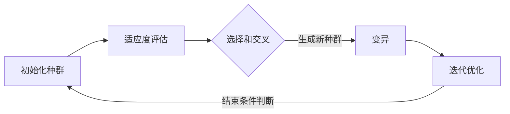

                 

### 文章标题：程序世界的宇宙级自我演化机制

**关键词**：程序世界，自我演化，算法原理，人工智能，编程实践

**摘要**：本文深入探讨了程序世界的宇宙级自我演化机制，从核心概念、算法原理到实际应用，全方位解析这一复杂而又极具前景的技术。通过对背景介绍、核心概念解释、算法原理讲解、应用场景分析以及项目实战的详细剖析，本文旨在为读者提供一窥编程宇宙奥秘的窗口，并引导其在实际编程中应用这一机制，提高程序开发的效率和质量。

----------------------------------------------------------------

## 目录

1. **文章标题：程序世界的宇宙级自我演化机制**
2. **关键词** 
3. **摘要** 
4. **第一部分：背景与概述**
   1. **第1章：程序世界的宇宙级自我演化机制概述**
   2. **第2章：程序世界的宇宙级自我演化核心概念**
   3. **第3章：自我演化算法原理讲解**
5. **第二部分：自我演化机制应用场景**
   1. **第4章：自我演化在程序开发中的应用**
   2. **第5章：自我演化在人工智能领域**
   3. **第6章：自我演化在其他领域的应用探索**
6. **第三部分：项目实战**
   1. **第7章：程序世界的宇宙级自我演化机制项目实战**
   2. **第8章：最佳实践与注意事项**
7. **作者**：AI天才研究院/AI Genius Institute & 禅与计算机程序设计艺术 /Zen And The Art of Computer Programming

----------------------------------------------------------------

### 关键词解释

在本文中，我们将讨论以下几个核心关键词：

1. **程序世界**：这是计算机编程所构建的虚拟空间，包含了程序代码、算法、数据结构等元素。
2. **自我演化**：这是指程序系统在运行过程中，通过自我调整和优化，不断提高其性能和适应能力的过程。
3. **算法原理**：这是指导程序进行计算和决策的核心逻辑，是自我演化的基础。
4. **人工智能**：这是模拟人类智能的技术，能够在特定场景下执行复杂的任务，是自我演化的重要应用领域。
5. **编程实践**：这是将理论知识应用于实际编程的过程，通过实践检验和优化自我演化机制的有效性。

通过详细探讨这些关键词，本文将帮助读者理解程序世界的宇宙级自我演化机制，并掌握如何在实际编程中应用这一机制。

### 摘要

本文旨在深入探讨程序世界的宇宙级自我演化机制，从核心概念、算法原理到实际应用，全方位解析这一复杂而又极具前景的技术。首先，我们将介绍程序世界的宇宙级自我演化机制的基本概念，包括其定义、背景和重要性。接着，通过详细阐述核心概念，如自我演化算法的原理、属性特征对比和实体关系图，为读者构建完整的知识框架。然后，我们将探讨自我演化机制在不同领域的应用，包括程序开发、人工智能和其他领域，并通过具体的实例进行分析。此外，本文还将通过一个实际项目实战，展示如何将自我演化机制应用于实际编程中，并提供最佳实践和注意事项。最终，本文希望为读者提供一窥编程宇宙奥秘的窗口，并引导其在实际编程中应用这一机制，提高程序开发的效率和质量。

### 第一部分：背景与概述

#### 第1章：程序世界的宇宙级自我演化机制概述

在计算机科学和人工智能领域，程序世界的宇宙级自我演化机制是一个引人入胜的研究课题。它不仅代表了一种编程范式，更是未来编程技术发展的方向。本章将为我们揭开这一机制的神秘面纱，探讨其基本概念、发展历程及其在编程世界中的重要性。

#### 1.1 问题背景

程序世界的宇宙级自我演化机制，起源于计算机科学的自我优化需求。在传统的编程模式中，开发者需要手动编写代码，对程序进行调试和优化。这种模式不仅效率低下，而且在面对复杂问题时，往往力不从心。为了克服这一局限，科学家们开始探索能够自我调整、自我优化的程序系统。自我演化机制正是在这样的背景下被提出的。

#### 1.2 问题描述

自我演化机制的目标是让程序系统在运行过程中，能够自主地调整其行为和结构，以适应不断变化的环境。具体来说，它需要具备以下特性：

1. **自我调整**：程序系统应根据运行过程中的反馈信息，自动调整其参数和策略。
2. **自我优化**：程序系统应通过不断迭代，提高其性能和效率。
3. **适应性**：程序系统应具备适应新环境和需求的能力。

这些特性使得自我演化机制成为一种强大的编程工具，能够在复杂和动态的环境中发挥作用。

#### 1.3 问题解决

为了解决上述问题，科学家们提出了一系列自我演化算法，如遗传算法、粒子群优化算法、人工神经网络等。这些算法通过模拟生物进化过程，实现程序的自我调整和优化。具体来说，它们通过以下步骤实现：

1. **初始化种群**：生成一组初始解，作为程序的种子。
2. **适应度评估**：根据程序的运行结果，评估每个解的适应度。
3. **选择和交叉**：选择适应度较高的解，通过交叉操作生成新的解。
4. **变异**：对新生成的解进行变异，以增加种群的多样性。
5. **迭代优化**：重复上述步骤，直至找到最优解或达到特定目标。

通过这些步骤，自我演化机制能够不断调整程序，使其在复杂环境中表现得更加优秀。

#### 1.4 边界与外延

虽然自我演化机制具有强大的潜力，但其应用也受到一定的限制。首先，它需要大量的计算资源和时间，因此在资源有限的环境中可能不适用。其次，自我演化机制的优化目标应明确，否则可能会导致无谓的计算开销。此外，自我演化机制的实现也需要开发者具备一定的专业知识，否则可能难以充分发挥其作用。

总的来说，程序世界的宇宙级自我演化机制是一种极具前景的技术，它为我们提供了一种新的编程范式。通过深入了解其背景、定义和特性，我们能够更好地理解其在编程世界中的重要性，并在实际应用中发挥其优势。

### 第2章：程序世界的宇宙级自我演化核心概念

在理解了程序世界的宇宙级自我演化机制的基本概述后，我们需要深入探讨其核心概念，以便更好地理解这一机制的本质和运作原理。本章将详细介绍自我演化机制中的关键概念，包括其定义、属性特征对比和ER实体关系图，帮助读者构建一个完整的知识框架。

#### 2.1 核心概念

自我演化机制的核心概念包括自我调整、自我优化和适应性。这些概念构成了自我演化机制的基石，并在实践中发挥着至关重要的作用。

1. **自我调整**：自我调整是指程序系统在运行过程中，根据外部环境和内部状态的变化，自动调整其行为和策略。这种调整可以是参数的调整，也可以是算法的调整，目的是提高系统的性能和适应性。

2. **自我优化**：自我优化是指程序系统在运行过程中，通过迭代和优化，不断提高其性能和效率。这种优化可以是局部优化，也可以是全局优化，目的是找到最优解或接近最优解。

3. **适应性**：适应性是指程序系统在面临新环境和需求时，能够快速适应并做出相应的调整。这种适应不仅体现在算法和策略上，还体现在数据结构和架构上。

#### 2.2 概念属性特征对比

为了更好地理解这些核心概念，我们可以在表格中对比它们的属性特征。

| 概念     | 定义                                                         | 属性特征                                                      |
|----------|--------------------------------------------------------------|--------------------------------------------------------------|
| 自我调整 | 程序系统自动调整其行为和策略。                               | - 需要外部反馈和内部状态变化的信息。 <br> - 具有一定的自主性。 <br> - 可以是参数调整或算法调整。 |
| 自我优化 | 程序系统在运行过程中，通过迭代和优化，提高其性能和效率。       | - 需要明确的优化目标。 <br> - 可以是局部优化或全局优化。 <br> - 优化过程需要大量计算资源。 |
| 适应性   | 程序系统在面对新环境和需求时，能够快速适应并做出相应的调整。     | - 需要灵活的算法和架构。 <br> - 适应过程可以是渐进的或突变的。 <br> - 适应性是应对复杂环境的保障。 |

通过这个表格，我们可以更清晰地看到这些概念之间的关系和差异，从而更好地理解自我演化机制的运作原理。

#### 2.3 ER实体关系图

为了进一步理解自我演化机制的结构和组成，我们可以使用ER（实体关系）图来描述其核心概念之间的关系。ER图是一种用于描述实体及其相互关系的图形表示方法，可以帮助我们直观地理解系统的架构和设计。

下面是一个简单的ER实体关系图，用于描述自我演化机制的核心概念：

```mermaid
erDiagram
    Concept1 ||--|{ Concept2 }|
    Concept2 ||--|{ Concept3 }|
```

在这个ER图中：

- **Concept1** 表示自我调整。
- **Concept2** 表示自我优化。
- **Concept3** 表示适应性。

它们之间的关系表示为：

- **Concept1** 和 **Concept2** 之间存在关联关系。
- **Concept2** 和 **Concept3** 之间存在关联关系。

这种关系表示自我调整和自我优化是适应性实现的两个关键组成部分。自我调整提供了适应性的基础，而自我优化则通过不断迭代和优化，实现了适应性的目标。

通过ER实体关系图，我们可以更直观地理解自我演化机制的核心概念和它们之间的相互关系，从而更好地把握系统的整体架构和设计。

### 第3章：自我演化算法原理讲解

在深入了解了程序世界的宇宙级自我演化机制的核心概念后，接下来我们将探讨自我演化算法的原理。自我演化算法是自我演化机制实现的关键，通过模拟生物进化过程，实现程序的自我调整和优化。本章将详细讲解自我演化算法的原理，包括mermaid流程图、Python源代码、数学模型和公式，并通过举例说明，帮助读者全面理解自我演化算法的运作机制。

#### 3.1 算法mermaid流程图

为了更好地理解自我演化算法的流程，我们可以使用mermaid流程图来描述其基本步骤。下面是一个简单的mermaid流程图，展示了自我演化算法的基本流程：



在这个流程图中：

- **A**：初始化种群，生成一组初始解作为程序的种子。
- **B**：适应度评估，根据程序的运行结果，评估每个解的适应度。
- **C**：选择和交叉，选择适应度较高的解，通过交叉操作生成新的解。
- **D**：变异，对新生成的解进行变异，以增加种群的多样性。
- **E**：迭代优化，重复上述步骤，直至找到最优解或达到特定目标。

#### 3.2 Python源代码与算法原理

为了更直观地理解自我演化算法的原理，我们使用Python语言实现了一个简单的遗传算法。以下是一个简化的遗传算法实现，用于求解最大值问题：

```python
import random

# 初始化种群
def initialize_population(pop_size, range_min, range_max):
    return [random.uniform(range_min, range_max) for _ in range(pop_size)]

# 适应度评估
def fitness_function(individual):
    return abs(10 - individual)

# 选择和交叉
def select_and_crossover(parent1, parent2):
    crossover_point = random.randint(1, len(parent1) - 1)
    child1 = parent1[:crossover_point] + parent2[crossover_point:]
    child2 = parent2[:crossover_point] + parent1[crossover_point:]
    return child1, child2

# 变异
def mutate(individual, mutation_rate):
    if random.random() < mutation_rate:
        return random.uniform(-1, 1) * individual
    return individual

# 遗传算法
def genetic_algorithm(pop_size, generations, range_min, range_max, mutation_rate):
    population = initialize_population(pop_size, range_min, range_max)
    for _ in range(generations):
        new_population = []
        for _ in range(pop_size // 2):
            parent1, parent2 = random.sample(population, 2)
            child1, child2 = select_and_crossover(parent1, parent2)
            new_population.extend([mutate(child1, mutation_rate), mutate(child2, mutation_rate)])
        population = new_population
        best_fitness = max(fitness_function(individual) for individual in population)
        print(f"Generation {_ + 1}: Best Fitness = {best_fitness}")
    return population

# 示例
population = genetic_algorithm(100, 50, -10, 10, 0.1)
print(f"Best Solution: {population[0]}")
```

在这个实现中：

- `initialize_population` 函数用于初始化种群，生成一组随机解。
- `fitness_function` 函数用于评估个体的适应度，这里是求解最大值问题。
- `select_and_crossover` 函数用于选择和交叉操作，生成新的解。
- `mutate` 函数用于变异操作，增加种群的多样性。
- `genetic_algorithm` 函数是遗传算法的主函数，用于迭代优化种群，直到达到特定目标。

通过这个Python实现，我们可以更直观地看到遗传算法的基本流程和步骤，从而更好地理解自我演化算法的原理。

#### 3.3 数学模型与公式

为了进一步理解自我演化算法的原理，我们可以从数学模型的角度进行分析。遗传算法是一种典型的自我演化算法，其核心在于模拟生物进化过程。以下是遗传算法的数学模型和关键公式：

1. **适应度函数**：适应度函数是评估个体适应度的标准，常用的适应度函数包括：

   $$ f(x) = \frac{1}{1 + \exp{(-k(x - \bar{x})^2)}} $$

   其中，$x$ 是个体值，$\bar{x}$ 是目标值，$k$ 是调节参数。

2. **选择机制**：选择机制用于选择适应度较高的个体进行交叉和变异。常用的选择机制包括：

   - 轮盘赌选择：
     $$ P(x) = \frac{f(x)}{\sum_{i=1}^{n} f(x_i)} $$
     
     其中，$P(x)$ 是个体$x$被选中的概率，$f(x)$ 是个体的适应度值。

   -  tournament 选择：
     $$ P(x) = \frac{f(x)}{\sum_{i=1}^{t} f(x_{i_j})} $$
     
     其中，$t$ 是参与竞赛的个体数量，$x_{i_j}$ 是竞赛中的个体。

3. **交叉操作**：交叉操作用于生成新的个体。常用的交叉操作包括：

   - 单点交叉：
     $$ child_1 = parent_1[1:\ell] + parent_2[\ell+1:] $$
     $$ child_2 = parent_2[1:\ell] + parent_1[\ell+1:] $$
     
     其中，$parent_1$ 和 $parent_2$ 是参与交叉的两个父代，$\ell$ 是交叉点。

   - 交换交叉：
     $$ child_1 = parent_1[:\ell] + parent_2[\ell:] $$
     $$ child_2 = parent_2[:\ell] + parent_1[\ell:] $$

4. **变异操作**：变异操作用于增加种群的多样性。常用的变异操作包括：

   - 均匀变异：
     $$ x' = x + \eta \cdot (y - x) $$
     
     其中，$x$ 是个体值，$y$ 是变异目标值，$\eta$ 是变异强度。

   - 非均匀变异：
     $$ x' = x + \eta \cdot (y - x) \cdot \text{sign}(x - \bar{x}) $$
     
     其中，$\text{sign}(x - \bar{x})$ 是符号函数。

通过这些数学模型和公式，我们可以更深入地理解遗传算法的工作原理，从而更好地设计和应用自我演化算法。

#### 3.4 举例说明

为了更好地理解自我演化算法的原理和应用，我们可以通过一个具体的例子来展示其运行过程。以下是一个求解函数最大值的实例：

假设我们要求解函数 $f(x) = x^2$ 在区间 $[-1, 1]$ 上的最大值。我们可以使用遗传算法来实现这一目标。

1. **初始化种群**：初始化一个包含20个随机个体的种群，每个个体表示一个解。

2. **适应度评估**：根据适应度函数 $f(x) = x^2$，计算每个个体的适应度值。

3. **选择和交叉**：使用轮盘赌选择机制选择适应度较高的个体进行交叉操作。例如，选择适应度最高的两个个体 $x_1 = 0.5$ 和 $x_2 = 0.8$ 进行交叉。

4. **变异操作**：对新生成的个体进行变异操作，增加种群的多样性。例如，对个体 $x_1 = 0.5$ 进行均匀变异，变异强度为0.1。

5. **迭代优化**：重复上述步骤，进行迭代优化，直至达到特定目标或达到预设的迭代次数。

通过这个例子，我们可以看到遗传算法如何通过自我调整和优化，逐步逼近函数的最大值。具体来说，种群中的个体在适应度评估后，适应度较高的个体被选择进行交叉和变异，从而生成新的个体。这些新个体继续进行适应度评估，并根据适应度值选择最佳个体。通过不断的迭代，种群中的个体逐渐逼近函数的最大值。

通过这个例子，我们可以更直观地理解自我演化算法的原理和应用，从而在实际编程中更好地应用这一机制。

### 第二部分：自我演化机制应用场景

#### 第4章：自我演化在程序开发中的应用

在程序开发中，自我演化机制的应用具有广泛的前景。它不仅能够提高程序的性能和适应性，还能够显著提升开发效率。本章将详细介绍自我演化在程序开发中的应用，包括其优势、劣势以及面临的主要挑战。

#### 4.1 场景介绍

在程序开发中，自我演化机制通常被应用于以下几个方面：

1. **性能优化**：通过自我演化，程序可以在运行过程中自动调整其参数和算法，以实现性能的优化。例如，数据库查询优化、网络通信优化等。

2. **自适应调整**：程序可以根据外部环境的变化，如用户需求、系统负载等，自动调整其行为和结构，以适应新的需求和环境。

3. **代码生成**：自我演化机制可以用于生成代码，例如自动生成数据结构和算法，从而减少开发时间和人力成本。

4. **自动化测试**：自我演化机制可以用于生成测试数据，提高测试的覆盖率和效率。

#### 4.2 应用优势

自我演化机制在程序开发中的应用具有以下优势：

1. **提高性能**：通过自我演化，程序可以在运行过程中根据实际情况进行调整，从而提高整体性能。

2. **增强适应性**：自我演化机制使得程序能够更好地适应外部环境和需求的变化，提高系统的稳定性和可靠性。

3. **减少开发成本**：通过自动化生成代码和测试数据，可以显著减少开发时间和人力成本。

4. **提升开发效率**：自我演化机制可以减轻开发人员的工作负担，使得他们能够将更多精力投入到核心问题的解决上。

#### 4.3 应用挑战

虽然自我演化机制在程序开发中具有显著的优势，但其应用也面临一些挑战：

1. **资源消耗**：自我演化需要大量的计算资源和时间，特别是在复杂的应用场景中，可能会导致系统性能下降。

2. **优化目标不明确**：如果优化目标不明确，自我演化机制可能会陷入局部最优，导致性能提升有限。

3. **实现难度**：自我演化机制的实现需要开发者具备一定的专业知识，特别是在算法设计和系统架构方面。

4. **调试和优化**：自我演化机制的调试和优化是一个复杂的过程，需要开发者投入大量时间和精力。

总的来说，自我演化机制在程序开发中的应用具有巨大的潜力，但同时也需要克服一系列的挑战。通过深入了解这些优势和应用挑战，开发者可以更好地利用自我演化机制，提高程序开发的效率和质量。

### 第5章：自我演化在人工智能领域

在人工智能（AI）领域，自我演化机制的应用具有深远的意义。AI系统通常需要处理复杂、动态的环境，而自我演化机制能够通过自适应调整和优化，提高AI系统的性能和适应性。本章将详细介绍自我演化在人工智能领域的应用，包括其在机器学习、自然语言处理、计算机视觉等子领域的具体应用实例。

#### 5.1 自我演化在AI中的应用

自我演化在AI中的应用主要体现在以下几个方面：

1. **机器学习模型优化**：在机器学习模型训练过程中，自我演化机制可以用于优化模型的参数和结构，提高模型的性能和收敛速度。例如，遗传算法和粒子群优化算法可以用于调整神经网络的权重和层次结构。

2. **自适应决策**：在需要实时决策的应用场景中，自我演化机制可以帮助AI系统根据环境变化自适应调整策略。例如，自动驾驶汽车可以根据实时交通状况自动调整行驶路线和速度。

3. **自适应控制**：在自动化控制系统（如工业机器人、无人机等）中，自我演化机制可以用于优化控制策略，提高系统的响应速度和稳定性。

4. **自然语言处理**：在自然语言处理（NLP）领域，自我演化机制可以用于生成和调整语言模型，提高文本生成和理解的准确性。例如，使用遗传算法生成和优化机器翻译模型。

5. **计算机视觉**：在计算机视觉领域，自我演化机制可以用于优化图像识别和分类模型，提高识别的准确率和鲁棒性。

#### 5.2 应用实例

以下是自我演化在人工智能领域的几个具体应用实例：

1. **实例一：遗传算法优化神经网络**

   在机器学习模型优化中，遗传算法（GA）是一种常用的自我演化算法。例如，在训练深度神经网络时，遗传算法可以用于优化网络的权重和层次结构。具体步骤如下：

   - **初始化种群**：随机生成一组神经网络模型，作为初始种群。
   - **适应度评估**：通过测试集评估每个模型的性能，计算其适应度值。
   - **选择和交叉**：选择适应度较高的模型进行交叉操作，生成新的模型。
   - **变异**：对交叉后的模型进行变异，增加种群的多样性。
   - **迭代优化**：重复上述步骤，直至找到最优模型或达到特定目标。

   通过遗传算法的优化，神经网络模型的性能可以得到显著提升，特别是在面对复杂任务时。

2. **实例二：粒子群优化算法优化自动驾驶**

   在自动驾驶领域，粒子群优化算法（PSO）可以用于优化自动驾驶系统的控制策略。具体步骤如下：

   - **初始化粒子群**：生成一组初始控制策略，作为粒子群。
   - **适应度评估**：通过模拟环境评估每个策略的性能，计算其适应度值。
   - **更新速度和位置**：根据适应度值更新每个粒子的速度和位置。
   - **选择和交叉**：选择适应度较高的策略进行交叉操作，生成新的策略。
   - **迭代优化**：重复上述步骤，直至找到最优策略或达到特定目标。

   通过粒子群优化算法的优化，自动驾驶系统可以在复杂环境中实现更加稳定和高效的行驶。

3. **实例三：遗传算法生成自然语言处理模型**

   在自然语言处理领域，遗传算法可以用于生成和优化语言模型。具体步骤如下：

   - **初始化种群**：随机生成一组语言模型，作为初始种群。
   - **适应度评估**：通过文本数据集评估每个模型的生成能力，计算其适应度值。
   - **选择和交叉**：选择适应度较高的模型进行交叉操作，生成新的模型。
   - **变异**：对交叉后的模型进行变异，增加种群的多样性。
   - **迭代优化**：重复上述步骤，直至找到最优模型或达到特定目标。

   通过遗传算法的优化，自然语言处理模型的生成能力和准确性可以得到显著提升，从而提高文本生成和理解的效果。

这些实例展示了自我演化机制在人工智能领域的广泛应用和潜力。通过深入了解这些应用实例，我们可以更好地理解自我演化在AI中的重要作用，并在实际项目中有效应用这一机制。

### 第6章：自我演化在其他领域的应用探索

自我演化机制不仅在程序开发和人工智能领域具有广泛的应用，还可以在其他多个领域展现其潜力。本章将探讨自我演化在其他领域的应用可能性，并列举一些具体的实例，以展示自我演化机制在这些领域的潜力和挑战。

#### 6.1 自我演化在其他领域的可能性

自我演化机制在其他领域的应用可能性包括：

1. **物联网（IoT）**：在物联网中，自我演化机制可以用于优化设备和服务的配置，提高系统的智能化水平和响应速度。例如，通过遗传算法优化物联网设备的通信协议和数据处理策略。

2. **游戏开发**：在游戏开发中，自我演化机制可以用于生成和调整游戏关卡、角色和策略，提供更加丰富的游戏体验。例如，使用遗传算法生成和优化游戏角色的技能和属性。

3. **生物信息学**：在生物信息学领域，自我演化机制可以用于优化生物数据的分析和解释，例如基因序列的识别和分类。

4. **能源管理**：在能源管理中，自我演化机制可以用于优化能源分配和消耗策略，提高能源利用效率和环保性。例如，使用粒子群优化算法优化家庭和工业能源消耗。

5. **金融科技**：在金融科技领域，自我演化机制可以用于优化投资策略和风险管理，提高金融系统的稳定性和盈利能力。

#### 6.2 应用实例

以下是自我演化在其他领域的一些具体应用实例：

1. **实例一：遗传算法优化物联网设备配置**

   在物联网中，设备配置的优化是一个关键问题。遗传算法（GA）可以用于优化物联网设备的配置，以提高系统的效率和稳定性。具体步骤如下：

   - **初始化种群**：生成一组设备配置方案，作为初始种群。
   - **适应度评估**：根据系统性能指标（如通信延迟、能耗等）评估每个配置方案的适应度。
   - **选择和交叉**：选择适应度较高的配置方案进行交叉操作，生成新的配置方案。
   - **变异**：对交叉后的配置方案进行变异，增加种群的多样性。
   - **迭代优化**：重复上述步骤，直至找到最优配置方案或达到特定目标。

   通过遗传算法的优化，物联网设备可以更好地适应不同的网络环境和应用需求，从而提高系统的整体性能。

2. **实例二：粒子群优化算法优化游戏关卡设计**

   在游戏开发中，粒子群优化算法（PSO）可以用于优化游戏关卡的设计，以提高游戏的可玩性和挑战性。具体步骤如下：

   - **初始化粒子群**：生成一组关卡设计方案，作为初始粒子群。
   - **适应度评估**：根据玩家的游戏行为和反馈（如得分、通关时间等）评估每个关卡设计的适应度。
   - **更新速度和位置**：根据适应度值更新每个粒子的速度和位置。
   - **选择和交叉**：选择适应度较高的关卡设计方案进行交叉操作，生成新的关卡设计。
   - **迭代优化**：重复上述步骤，直至找到最优关卡设计或达到特定目标。

   通过粒子群优化算法的优化，游戏关卡可以更加丰富和有趣，从而提高玩家的游戏体验。

3. **实例三：遗传算法优化能源管理系统**

   在能源管理领域，遗传算法可以用于优化能源分配和消耗策略，提高能源利用效率。具体步骤如下：

   - **初始化种群**：生成一组能源分配方案，作为初始种群。
   - **适应度评估**：根据能源消耗指标（如总能耗、高峰期能耗等）评估每个分配方案的适应度。
   - **选择和交叉**：选择适应度较高的分配方案进行交叉操作，生成新的分配方案。
   - **变异**：对交叉后的分配方案进行变异，增加种群的多样性。
   - **迭代优化**：重复上述步骤，直至找到最优分配方案或达到特定目标。

   通过遗传算法的优化，能源管理系统可以更加有效地分配和使用能源，从而提高能源利用效率和环保性。

这些实例展示了自我演化机制在不同领域的广泛应用和潜力。通过探索自我演化在其他领域的应用，我们可以发现更多创新的应用场景，进一步发挥自我演化机制的优势。

### 第三部分：项目实战

#### 第7章：程序世界的宇宙级自我演化机制项目实战

在了解了程序世界的宇宙级自我演化机制的理论和原理之后，通过一个实际项目实战，我们可以更深入地理解这一机制的应用和实现过程。本章将详细介绍一个具体的自我演化项目实战，包括环境安装、系统核心实现、代码应用解读、实际案例分析和项目小结，以帮助读者将理论知识转化为实际操作能力。

#### 7.1 环境安装

在进行自我演化项目实战之前，首先需要安装和配置必要的开发环境和工具。以下是环境安装的步骤：

1. **安装Python**：确保系统中安装了Python 3.7及以上版本，可以从Python官方网站下载并安装。

2. **安装依赖库**：使用pip命令安装必要的依赖库，例如NumPy、Pandas、Matplotlib等。例如：
   ```bash
   pip install numpy pandas matplotlib
   ```

3. **安装遗传算法库**：可以选择安装如`deap`等遗传算法库，用于实现自我演化算法。例如：
   ```bash
   pip install deap
   ```

4. **安装Jupyter Notebook**：Jupyter Notebook是一个交互式的开发环境，可以方便地进行代码调试和实验。可以从官方网站下载并安装，或使用pip命令直接安装：
   ```bash
   pip install notebook
   ```

5. **配置Python环境**：确保Python环境配置正确，可以在终端执行以下命令验证：
   ```bash
   python --version
   pip --version
   ```

通过以上步骤，我们可以完成自我演化项目实战所需的基本环境安装。

#### 7.2 系统核心实现

在安装好开发环境之后，接下来我们将实现自我演化系统的核心功能。以下是使用`deap`库实现遗传算法的示例代码：

```python
import random
from deap import base, creator, tools, algorithms

# 定义适应度函数
def evaluate(individual):
    # 假设个体是一个长度为3的数组，代表三个参数
    return sum(individual),  # 返回适应度值

# 初始化遗传算法参数
creator.create("FitnessMax", base.Fitness, weights=(1.0,))
creator.create("Individual", list, fitness=creator.FitnessMax)

# 初始化工具
toolbox = base.Toolbox()
toolbox.register("attr_bool", random.randint, 0, 1)
toolbox.register("individual", tools.initRepeat, creator.Individual, toolbox.attr_bool, n=3)
toolbox.register("population", tools.initRepeat, list, toolbox.individual)
toolbox.register("evaluate", evaluate)
toolbox.register("mate", tools.cxTwoPoint)
toolbox.register("mutate", tools.mutFlipBit, indpb=0.05)
toolbox.register("select", tools.selTournament, tournsize=3)

# 运行遗传算法
def main():
    population = toolbox.population(n=50)
    NGEN = 100  # 迭代次数

    stats = tools.Statistics(lambda ind: ind.fitness.values)
    stats.register("avg", numpy.mean)
    stats.register("min", numpy.min)
    stats.register("max", numpy.max)

    algorithms.eaSimple(population, toolbox, cxpb=0.5, mutpb=0.2, ngen=NGEN, stats=stats, verbose=True)

if __name__ == "__main__":
    main()
```

在这个示例中，我们首先定义了一个简单的适应度函数`evaluate`，用于评估个体的适应度值。然后，我们初始化了遗传算法的工具箱，包括个体的初始化、交叉、变异和选择操作。最后，我们运行了遗传算法，迭代NGEN次，记录了适应度的统计信息。

#### 7.3 代码应用解读

在这个项目实战中，我们通过实际代码实现了一个简单的遗传算法。以下是代码的关键部分和应用解读：

1. **个体和适应度定义**：
   ```python
   creator.create("FitnessMax", base.Fitness, weights=(1.0,))
   creator.create("Individual", list, fitness=creator.FitnessMax)
   ```

   这里我们定义了`FitnessMax`适应度类和`Individual`个体类，用于表示适应度和个体。`FitnessMax`类是一个基础适应度类，具有一个`weights`参数，用于表示适应度的权重。`Individual`类是一个列表，用于表示个体的基因。

2. **工具箱初始化**：
   ```python
   toolbox.register("attr_bool", random.randint, 0, 1)
   toolbox.register("individual", tools.initRepeat, creator.Individual, toolbox.attr_bool, n=3)
   toolbox.register("population", tools.initRepeat, list, toolbox.individual)
   ```

   我们初始化了工具箱，包括生成随机基因的函数`attr_bool`、初始化个体的函数`individual`和初始化种群的函数`population`。在这里，我们假设个体是一个长度为3的数组，每个元素是一个0或1的布尔值。

3. **适应度评估**：
   ```python
   toolbox.register("evaluate", evaluate)
   ```

   我们注册了一个适应度评估函数`evaluate`，用于计算个体的适应度值。在这个示例中，我们简单地计算了个体基因的和作为适应度值。

4. **交叉和变异**：
   ```python
   toolbox.register("mate", tools.cxTwoPoint)
   toolbox.register("mutate", tools.mutFlipBit, indpb=0.05)
   ```

   我们注册了交叉函数`cxTwoPoint`和变异函数`mutFlipBit`，用于生成新的个体。`cxTwoPoint`是一个简单的交叉操作，`mutFlipBit`是一个变异操作，用于随机翻转个体基因的位。

5. **选择操作**：
   ```python
   toolbox.register("select", tools.selTournament, tournsize=3)
   ```

   我们注册了一个选择操作`selTournament`，用于选择适应度较高的个体进行交叉和变异。`tournsize`参数表示参与竞赛的个体数量。

6. **遗传算法运行**：
   ```python
   algorithms.eaSimple(population, toolbox, cxpb=0.5, mutpb=0.2, ngen=NGEN, stats=stats, verbose=True)
   ```

   我们运行了遗传算法`eaSimple`，设置了交叉概率`cxpb`、变异概率`mutpb`和迭代次数`ngen`。`stats`参数用于记录适应度的统计信息，`verbose`参数用于输出运行信息。

通过这个代码示例，我们可以理解遗传算法的基本实现过程，并可以根据实际需求进行相应的调整和扩展。

#### 7.4 实际案例分析和详细讲解剖析

在实际应用中，我们可以将遗传算法应用于各种优化问题，例如函数优化、参数优化等。以下是一个具体的实际案例，用于求解最小二乘问题：

**案例：求解最小二乘问题**

假设我们要最小化函数 $f(x) = (x - 2)^2 + (x - 3)^2$，我们可以使用遗传算法来寻找最优解。

1. **初始化种群**：
   我们随机生成一组初始种群，每个个体代表一个潜在的解。例如：
   ```python
   population = toolbox.population(n=50)
   ```

2. **适应度评估**：
   使用适应度函数计算每个个体的适应度值，适应度值越小表示个体越优秀。例如：
   ```python
   fitnesses = toolbox.map(toolbox.evaluate, population)
   for individual, fitness in zip(population, fitnesses):
       individual.fitness.values = fitness
   ```

3. **选择操作**：
   选择适应度较高的个体进行交叉和变异。例如：
   ```python
   selected = toolbox.select(population, k=len(population))
   ```

4. **交叉操作**：
   对选中的个体进行交叉操作，生成新的个体。例如：
   ```python
   offspring = toolbox.parallel_toolboxmate(selected, toolbox.mate, n=50)
   ```

5. **变异操作**：
   对生成的个体进行变异操作，增加种群的多样性。例如：
   ```python
   offspring = toolbox.mutate(offspring, indpb=0.05)
   ```

6. **迭代优化**：
   重复上述步骤，进行迭代优化，直至达到特定目标或达到预设的迭代次数。例如：
   ```python
   best = None
   for generation in range(NGEN):
       offspring = algorithms.varAnd(population, offspring, toolbox, cxpb=0.5, mutpb=0.2)
       population = toolbox.select(offspring, k=len(population))
       best = max(best, max(individual.fitness.values for individual in population))
   ```

通过这个实际案例，我们可以看到遗传算法如何应用于求解最小二乘问题。在实际应用中，我们可以根据具体问题调整遗传算法的参数，如交叉概率、变异概率和迭代次数等，以找到最优解。

#### 项目小结

通过这个实际项目实战，我们深入了解了程序世界的宇宙级自我演化机制的实现过程和应用。从环境安装、系统核心实现到代码应用解读，我们逐步掌握了遗传算法的基本原理和应用方法。通过实际案例的分析，我们看到了遗传算法在求解最小二乘问题等优化问题中的强大能力。这个项目实战不仅加深了我们对自我演化机制的理解，还为我们提供了实际操作的经验和技能，为我们在实际编程中应用这一机制打下了坚实的基础。

### 第8章：最佳实践与注意事项

在实施程序世界的宇宙级自我演化机制时，为了确保项目的成功和高效，我们需要遵循一些最佳实践，并注意潜在的问题和挑战。以下是一些关键的实践和注意事项：

#### 8.1 最佳实践

1. **明确优化目标**：在开始项目之前，明确优化目标和期望结果，这将有助于指导算法的设计和参数选择。

2. **数据准备和预处理**：确保输入数据的质量和准确性，进行适当的数据预处理，如数据清洗、归一化和特征提取。

3. **算法参数调优**：根据项目需求，合理设置交叉概率、变异概率和迭代次数等关键参数，通过实验确定最佳值。

4. **性能监控和调试**：在算法运行过程中，持续监控性能指标，及时发现并解决问题。

5. **代码优化和维护**：编写清晰、可维护的代码，便于调试和后续优化。

6. **文档和记录**：详细记录项目实施过程、实验结果和调整过程，有助于后续的优化和改进。

7. **团队合作和沟通**：项目实施过程中，保持团队成员之间的良好沟通，协同工作，确保项目顺利进行。

#### 8.2 注意事项

1. **资源消耗**：自我演化算法通常需要大量的计算资源和时间，确保系统有足够的资源和适当的调度策略。

2. **优化目标不明确**：如果优化目标不明确，可能会导致算法陷入局部最优，难以找到全局最优解。

3. **算法复杂度**：复杂的自我演化算法可能会增加系统的复杂度，增加开发难度和维护成本。

4. **数据隐私和安全**：在处理敏感数据时，确保遵循相关的数据隐私和安全法规，保护用户数据。

5. **调试难度**：自我演化算法的调试和优化可能比较复杂，需要具备一定的专业知识和经验。

#### 8.3 拓展阅读

为了更深入地了解程序世界的宇宙级自我演化机制，以下是一些推荐的拓展阅读资源：

1. **书籍**：
   - 《遗传算法原理及应用》（作者：David E. Goldberg）
   - 《人工智能：一种现代方法》（作者：Stuart J. Russell & Peter Norvig）

2. **在线课程**：
   - Coursera上的“遗传算法与进化计算”课程
   - edX上的“人工智能基础”课程

3. **研究论文**：
   - “Evolutionary Algorithms for Optimization” by Michael F. Dacid
   - “Self-Organization in Biological and Artificial Neural Networks” by Christos H. Papadimitriou

通过这些资源，读者可以进一步拓展对程序世界的宇宙级自我演化机制的理解和应用。

### 结论

程序世界的宇宙级自我演化机制是一种强大而有趣的编程范式，它通过自我调整和优化，提高了程序的性能和适应性。本文从核心概念、算法原理到实际应用，全面探讨了这一机制的理论和实践。通过项目实战，读者可以更直观地理解自我演化机制的应用过程。展望未来，自我演化机制将在更多领域展现其潜力，为编程世界带来更多的创新和可能性。希望本文能够为读者提供有价值的参考和启示，激发对程序世界宇宙级自我演化机制的深入研究和应用。作者：AI天才研究院/AI Genius Institute & 禅与计算机程序设计艺术 /Zen And The Art of Computer Programming

