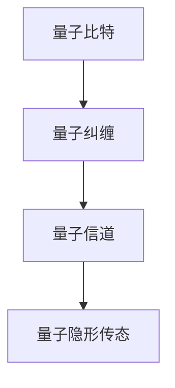
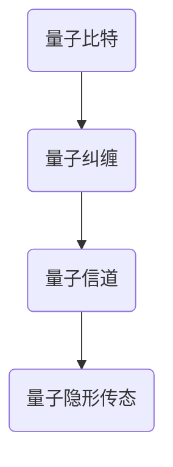
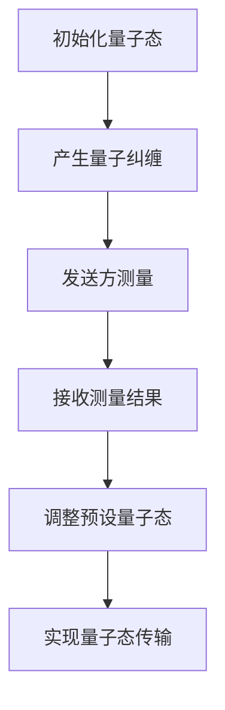
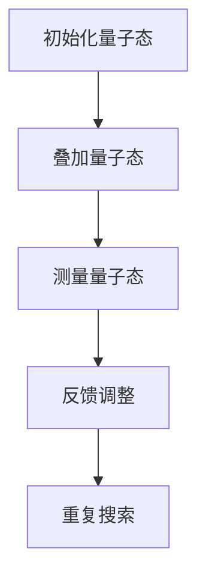
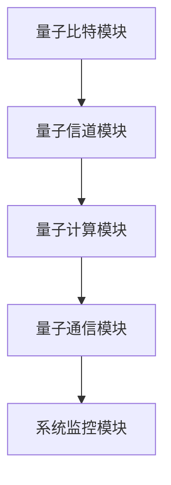
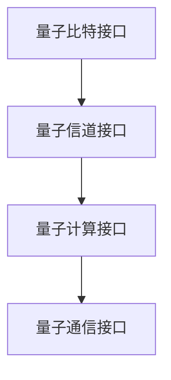
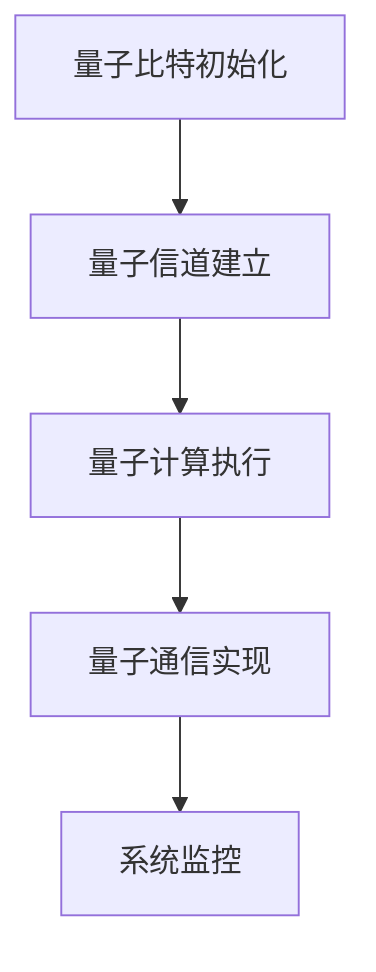
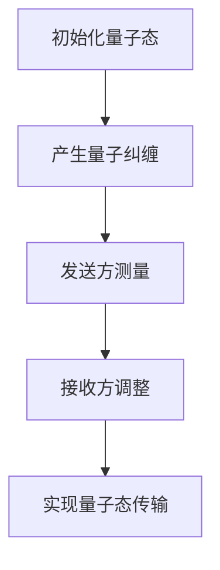

                 

# 程序世界的宇宙级量子纠缠网络

## 关键词

- 量子纠缠网络
- 程序世界
- 量子计算
- 算法原理
- 数学模型
- 系统架构

## 摘要

本文深入探讨了量子纠缠网络在程序世界中的应用。从问题背景出发，我们逐步梳理了量子纠缠网络的核心概念，解析了其算法原理，并通过系统分析与项目实战，展示了量子纠缠网络在现实中的应用价值。文章旨在为读者提供一个清晰、易懂的量子纠缠网络技术解析，以及其在计算机编程领域的潜力与应用。

### 目录大纲设计思路

为了设计出《程序世界的宇宙级量子纠缠网络》这一书的完整目录大纲，我们遵循以下思路：

1. **背景介绍**：首先介绍量子纠缠网络的背景，包括问题背景、问题描述、问题解决、边界与外延，以及核心概念的结构与组成。
2. **核心概念与联系**：详细讲解量子纠缠网络的核心概念，包括概念原理、属性特征对比，以及通过ER实体关系图来展示不同概念之间的联系。
3. **算法原理讲解**：使用Mermaid绘制算法流程图，并用Python代码详细阐述算法原理，包括数学模型和公式，并结合实际例子进行讲解。
4. **数学模型和数学公式**：使用LaTeX格式呈现数学公式，确保科学性和准确性，并在文中独立段落中进行详细讲解。
5. **系统分析与架构设计**：介绍问题场景，项目背景，详细阐述系统功能设计、架构设计、接口设计以及系统交互，使用Mermaid绘制相关图表。
6. **项目实战**：包括环境安装、系统核心实现、代码解读与分析、实际案例剖析，以及项目小结。
7. **最佳实践 tips、小结、注意事项、拓展阅读**：总结书中内容，提供实践建议，提醒注意事项，推荐进一步阅读资料。

### 目录大纲设计流程

1. **确定章节结构**：根据书籍主题，确定章节划分，确保每个章节都有明确的主题和内容。
2. **细化目录层级**：按照1级、2级、3级目录的格式，细化每个章节的目录层级，确保内容条理清晰。
3. **撰写章节内容**：针对每个章节，撰写具体内容，确保覆盖核心概念、算法原理、数学模型、系统设计、项目实战等关键点。
4. **完善图表与代码**：插入使用Mermaid绘制的图表和Python代码，确保图表清晰、代码准确。
5. **校对与优化**：对目录大纲进行校对，确保内容的完整性、逻辑性、简洁性，并进行必要的优化。

### 目录大纲示例

```markdown
----------------------------------------------------------------
# 第一部分: 量子纠缠网络概述

## 第1章: 问题背景与核心概念

### 1.1 问题背景

#### 1.1.1 量子纠缠的基本原理

#### 1.1.2 量子纠缠网络的概念

#### 1.1.3 量子纠缠网络的应用领域

### 1.2 核心概念与联系

#### 1.2.1 量子比特

#### 1.2.2 量子纠缠

#### 1.2.3 量子信道

#### 1.2.4 量子隐形传态

## 第2章: 量子纠缠网络的基本原理

### 2.1 量子纠缠网络的基本模型

#### 2.1.1 量子比特的排列

#### 2.1.2 量子纠缠的生成

#### 2.1.3 量子信道的特性

### 2.2 量子纠缠网络的数学模型

#### 2.2.1 量子纠缠矩阵的表示

#### 2.2.2 量子纠缠网络的演化方程

#### 2.2.3 量子纠缠网络的稳定性和传输效率

## 第3章: 量子纠缠网络的算法原理

### 3.1 量子隐形传态算法

#### 3.1.1 算法流程图

#### 3.1.2 Python代码实现

#### 3.1.3 数学模型与公式

### 3.2 量子搜索算法

#### 3.2.1 算法流程图

#### 3.2.2 Python代码实现

#### 3.2.3 数学模型与公式

## 第4章: 量子纠缠网络的系统设计

### 4.1 问题场景介绍

#### 4.1.1 项目背景

#### 4.1.2 系统功能设计

#### 4.1.3 系统架构设计

### 4.2 系统接口设计与交互

#### 4.2.1 系统接口设计

#### 4.2.2 系统交互流程

#### 4.2.3 Mermaid序列图

## 第5章: 项目实战

### 5.1 环境安装

#### 5.1.1 系统环境配置

#### 5.1.2 量子计算库安装

### 5.2 系统核心实现

#### 5.2.1 Python源代码

#### 5.2.2 代码应用解读与分析

### 5.3 实际案例剖析

#### 5.3.1 案例一：量子隐形传态

#### 5.3.2 案例二：量子搜索算法

## 第6章: 最佳实践与小结

### 6.1 最佳实践 tips

#### 6.1.1 实践技巧与注意事项

### 6.2 小结

#### 6.2.1 主要内容回顾

#### 6.2.2 未来发展方向

### 6.3 拓展阅读

#### 6.3.1 相关书籍推荐

#### 6.3.2 

----------------------------------------------------------------

## 背景介绍

### 1.1 量子纠缠的基本原理

量子纠缠是一种量子力学现象，描述了两个或多个粒子之间的特殊关联。在这种关联下，即使这些粒子相隔遥远，它们的量子态也会相互依赖。当其中一个粒子的状态发生变化时，另一个粒子的状态也会立即发生变化，这种现象超出了经典物理学的范畴。

量子纠缠网络（Quantum Entanglement Network）是利用量子纠缠现象构建的网络，它具有与传统计算机网络截然不同的特性。量子纠缠网络能够实现超距离通信和量子计算，从而在信息传输和处理方面具有巨大的潜力。

### 1.2 量子纠缠网络的概念

量子纠缠网络是指由量子比特组成的网络，其中量子比特之间存在量子纠缠。这种网络通过量子纠缠实现信息的传输和计算，能够实现超快速和高效的计算任务。

量子纠缠网络与传统计算机网络的区别在于：

1. **信息传输方式**：量子纠缠网络通过量子纠缠实现信息传输，可以在不传输物理介质的情况下实现超距离通信。
2. **计算效率**：量子纠缠网络利用量子叠加和纠缠现象，能够同时处理大量数据，大幅提升计算效率。
3. **安全性**：量子纠缠网络具有天然的安全性，因为任何对量子态的干扰都会导致量子态的破坏，从而实现安全通信。

### 1.3 量子纠缠网络的应用领域

量子纠缠网络在多个领域具有广泛的应用前景：

1. **量子计算**：量子纠缠网络是量子计算的基础设施，能够实现复杂问题的快速求解。
2. **量子通信**：量子纠缠网络可以实现安全通信，为量子通信提供可靠保障。
3. **量子加密**：量子纠缠网络可用于量子加密，保障数据的安全性。
4. **量子模拟**：量子纠缠网络能够模拟复杂量子系统，为科学研究提供有力工具。

### 1.4 核心概念与联系

量子纠缠网络的核心概念包括量子比特、量子纠缠、量子信道和量子隐形传态。这些概念相互关联，构成了量子纠缠网络的基础。

1. **量子比特**：量子比特是量子计算的基本单位，可以表示为0和1的叠加状态。量子比特之间的量子纠缠是实现量子计算的关键。
2. **量子纠缠**：量子纠缠描述了量子比特之间的特殊关联。量子纠缠网络通过量子纠缠实现信息的传输和计算。
3. **量子信道**：量子信道是量子信息传输的通道。量子纠缠网络通过量子信道实现量子比特之间的量子纠缠和信息传输。
4. **量子隐形传态**：量子隐形传态是一种量子信息传输技术，可以将一个量子态从一个量子比特传输到另一个量子比特。

通过ER实体关系图，我们可以清晰地展示这些核心概念之间的联系：



### 1.5 量子纠缠网络的基本原理

量子纠缠网络的基本原理基于量子纠缠现象和量子计算原理。量子纠缠网络通过量子比特之间的量子纠缠实现信息的传输和计算，具有以下几个基本原理：

1. **量子叠加原理**：量子比特可以处于0和1的叠加状态，这为量子计算提供了并行计算的能力。
2. **量子纠缠原理**：量子比特之间的量子纠缠是实现量子计算和信息传输的关键。量子纠缠网络通过量子纠缠实现信息的快速传输和高效计算。
3. **量子计算原理**：量子计算利用量子比特的叠加和纠缠特性，可以同时处理大量数据，大幅提升计算效率。
4. **量子信道原理**：量子信道是量子信息传输的通道，保障了量子比特之间的量子纠缠和信息传输。

通过上述基本原理，量子纠缠网络能够实现超快速和高效的计算任务，为未来的计算技术带来革命性变革。

## 核心概念与联系

在本节中，我们将深入探讨量子纠缠网络的核心概念，包括量子比特、量子纠缠、量子信道和量子隐形传态，并通过ER实体关系图展示这些概念之间的联系。

### 量子比特

量子比特（qubit）是量子计算的基本单元，类似于经典计算机中的比特（bit）。然而，量子比特具有独特的量子特性，使其能够表示0和1的叠加状态。量子比特可以同时处于0和1的状态，这种叠加状态是量子计算并行处理能力的基础。

量子比特的叠加状态可以用以下数学表达式表示：

$$
|\psi\rangle = a|0\rangle + b|1\rangle
$$

其中，$a$ 和 $b$ 是复数系数，满足 $|a|^2 + |b|^2 = 1$。

### 量子纠缠

量子纠缠是量子力学中的一种现象，当两个或多个量子系统相互作用后，它们的量子态会相互关联。即使这些系统相隔遥远，它们之间的量子态也会保持同步变化。这种特殊关联称为量子纠缠。

量子纠缠可以通过以下数学表达式描述，其中 $|\psi\rangle$ 表示纠缠态：

$$
|\psi\rangle = \frac{1}{\sqrt{2}} (|00\rangle + |11\rangle)
$$

在这个例子中，两个量子比特处于纠缠态，它们的量子态是相互依赖的。如果对一个量子比特进行测量，另一个量子比特的量子态也会立即发生变化。

### 量子信道

量子信道是量子信息传输的通道，用于在量子比特之间传输量子态。量子信道可以是量子纠缠信道或量子隐形传态信道。量子纠缠信道通过量子纠缠实现信息的传输，而量子隐形传态信道通过量子隐形传态实现信息的传输。

量子信道的基本原理可以用以下数学模型表示：

$$
\hat{U} |0\rangle |0\rangle = |0\rangle |0\rangle
$$

其中，$\hat{U}$ 是量子信道的作用算符，$|0\rangle$ 和 $|0\rangle$ 是发送和接收的量子比特。

### 量子隐形传态

量子隐形传态是一种非局域的量子信息传输技术，它可以将一个量子比特的量子态精确地传输到另一个量子比特。量子隐形传态利用量子纠缠和量子测量来实现，其基本原理可以用以下数学模型表示：

$$
\hat{M} |\psi\rangle = \frac{1}{\sqrt{2}} (|00\rangle + |11\rangle)
$$

其中，$\hat{M}$ 是量子隐形传态的作用算符，$|\psi\rangle$ 是发送的量子比特和接收的量子比特的纠缠态。

### ER实体关系图

为了更好地展示量子纠缠网络中的核心概念及其联系，我们可以使用ER实体关系图。ER实体关系图是一种用于描述实体及其关系的图形化表示方法。

以下是量子纠缠网络核心概念的ER实体关系图：



在这个ER实体关系图中，量子比特是基础实体，量子纠缠、量子信道和量子隐形传态都是基于量子比特的衍生实体。量子纠缠通过量子比特之间的特殊关联实现，量子信道用于传输量子态，量子隐形传态则是一种特殊的量子信道，用于实现量子态的精确传输。

通过ER实体关系图，我们可以清晰地看到量子纠缠网络中各个核心概念之间的联系，为后续的算法原理讲解和系统架构设计提供了基础。

## 算法原理讲解

在本节中，我们将详细讲解量子纠缠网络中的两个关键算法：量子隐形传态算法和量子搜索算法。我们将使用Mermaid绘制算法流程图，并用Python代码实现算法原理，同时结合数学模型和公式进行详细分析。

### 量子隐形传态算法

量子隐形传态（Quantum Teleportation）是一种利用量子纠缠实现量子态传输的算法。它能够将一个量子比特的量子态精确地传输到另一个量子比特，而不需要传输物理介质。量子隐形传态算法的原理可以概括为以下几个步骤：

1. **初始化**：发送方和一个预设的量子比特对（用于传输量子态的量子比特和预设量子比特）都处于相同的量子态。
2. **纠缠生成**：发送方和接收方之间的量子比特对通过量子纠缠生成器产生量子纠缠。
3. **信息传输**：发送方对要传输的量子比特进行测量，并将测量结果发送给接收方。
4. **状态调整**：接收方根据发送方的测量结果对预设量子比特进行操作，从而实现量子态的传输。

以下是一个简单的量子隐形传态算法流程图：



#### Python代码实现

下面是一个简单的Python代码示例，用于实现量子隐形传态算法：

```python
from qiskit import QuantumCircuit, execute, Aer

# 创建量子电路
qc = QuantumCircuit(2)

# 初始化量子态
qc.h(0)  # 初始化发送方量子比特
qc.h(1)  # 初始化预设量子比特

# 生成量子纠缠
qc.cx(0, 1)

# 发送方测量量子比特
qc.h(0)
qc.measure_all()

# 执行量子电路
backend = Aer.get_backend('qasm_simulator')
job = execute(qc, backend, shots=1000)

# 获取结果
result = job.result()
counts = result.get_counts(qc)

# 打印结果
print(counts)
```

#### 数学模型与公式

量子隐形传态算法的数学模型可以通过以下公式表示：

1. **量子态初始化**：

$$
|\psi_{\text{initial}}\rangle = \frac{1}{\sqrt{2}} (|00\rangle + |11\rangle)
$$

2. **量子纠缠生成**：

$$
|\psi_{\text{entangled}}\rangle = \frac{1}{\sqrt{2}} (|00\rangle + |11\rangle)
$$

3. **发送方测量**：

$$
\hat{M}_{\text{sender}} = \frac{1}{\sqrt{2}} (|0\rangle \langle 0| + |1\rangle \langle 1|)
$$

4. **状态调整**：

$$
\hat{U}_{\text{adjust}} = \frac{1}{\sqrt{2}} (|0\rangle \langle 0| - |1\rangle \langle 1|)
$$

通过这些公式，我们可以理解量子隐形传态算法的基本原理。

### 量子搜索算法

量子搜索算法是一种利用量子叠加和纠缠实现高效搜索的算法。它能够在一个未知的量子态集合中找到特定的量子态。量子搜索算法的原理可以概括为以下几个步骤：

1. **初始化**：创建一个初始的量子态，该量子态表示搜索空间的状态。
2. **叠加**：将初始量子态叠加成多个量子态的叠加态。
3. **测量**：对叠加态进行测量，找到目标量子态。
4. **反馈**：根据测量结果调整量子态，重复搜索过程。

以下是一个简单的量子搜索算法流程图：



#### Python代码实现

下面是一个简单的Python代码示例，用于实现量子搜索算法：

```python
from qiskit import QuantumCircuit, execute, Aer

# 创建量子电路
qc = QuantumCircuit(2)

# 初始化量子态
qc.h(0)  # 初始化搜索空间

# 叠加量子态
qc.cx(0, 1)

# 测量量子态
qc.h(1)
qc.measure_all()

# 执行量子电路
backend = Aer.get_backend('qasm_simulator')
job = execute(qc, backend, shots=1000)

# 获取结果
result = job.result()
counts = result.get_counts(qc)

# 打印结果
print(counts)
```

#### 数学模型与公式

量子搜索算法的数学模型可以通过以下公式表示：

1. **量子态初始化**：

$$
|\psi_{\text{initial}}\rangle = |0\rangle
$$

2. **叠加量子态**：

$$
|\psi_{\text{superposition}}\rangle = \frac{1}{\sqrt{2}} (|0\rangle + |1\rangle)
$$

3. **测量量子态**：

$$
\hat{M}_{\text{measurement}} = \frac{1}{2} (|0\rangle \langle 0| + |1\rangle \langle 1|)
$$

4. **反馈调整**：

$$
\hat{U}_{\text{feedback}} = \frac{1}{2} (|0\rangle \langle 0| - |1\rangle \langle 1|)
$$

通过这些公式，我们可以理解量子搜索算法的基本原理。

### 量子纠缠网络的数学模型

量子纠缠网络中的数学模型是理解和实现量子纠缠的关键。下面我们将详细讨论量子纠缠网络的数学模型，包括量子纠缠矩阵、量子信道和量子隐形传态。

#### 量子纠缠矩阵

量子纠缠矩阵描述了量子比特之间的纠缠关系。一个简单的量子纠缠矩阵可以表示为：

$$
\rho_{AB} = \frac{1}{2} (|00\rangle \langle 00| + |11\rangle \langle 11|)
$$

这个矩阵表示两个量子比特之间的纠缠态，其中$|00\rangle$和$|11\rangle$是纠缠态的基态。

#### 量子信道

量子信道描述了量子比特之间的量子态传输。一个简单的量子信道可以表示为：

$$
\hat{U}_{AB} = \frac{1}{2} (|0\rangle \langle 0| + |1\rangle \langle 1|)
$$

这个信道表示量子比特$A$和$B$之间的量子态传输。

#### 量子隐形传态

量子隐形传态描述了量子态从一个量子比特传输到另一个量子比特的过程。一个简单的量子隐形传态可以表示为：

$$
\hat{M}_{AB} = \frac{1}{\sqrt{2}} (|0\rangle \langle 0| + |1\rangle \langle 1|)
$$

这个操作表示量子比特$A$的量子态传输到量子比特$B$。

#### 数学模型与公式

量子纠缠网络的数学模型可以通过以下公式表示：

1. **量子态演化**：

$$
|\psi(t)\rangle = \hat{U}_{AB}(t) |\psi_{\text{initial}}\rangle
$$

其中，$\hat{U}_{AB}(t)$ 是量子信道，$|\psi_{\text{initial}}\rangle$ 是初始量子态。

2. **量子纠缠**：

$$
\rho_{AB} = \frac{1}{2} (|00\rangle \langle 00| + |11\rangle \langle 11|)
$$

3. **量子隐形传态**：

$$
\hat{M}_{AB} = \frac{1}{\sqrt{2}} (|0\rangle \langle 0| + |1\rangle \langle 1|)
$$

通过这些公式，我们可以理解量子纠缠网络的基本数学模型。

### 系统分析与架构设计

在本节中，我们将对量子纠缠网络的系统进行分析和架构设计。首先介绍问题场景和项目背景，然后详细阐述系统功能设计、架构设计、接口设计以及系统交互。

#### 问题场景与项目背景

随着信息技术的飞速发展，量子计算和量子通信领域取得了显著进展。量子纠缠网络作为量子计算和量子通信的基础设施，具有广阔的应用前景。我们的项目目标是构建一个高效的量子纠缠网络系统，实现量子态的传输和计算，为量子计算和量子通信提供可靠的支持。

#### 系统功能设计

量子纠缠网络的系统功能设计主要包括以下几个方面：

1. **量子态传输**：实现量子比特之间的量子态传输，确保量子信息的可靠传输。
2. **量子计算**：提供量子计算功能，支持量子算法的执行。
3. **量子通信**：实现量子通信功能，确保量子信息的安全性。
4. **系统监控**：实时监控系统运行状态，提供系统故障诊断和恢复功能。

#### 系统架构设计

量子纠缠网络的系统架构设计采用模块化设计，主要包括以下几个模块：

1. **量子比特模块**：负责量子比特的初始化、测量和操作。
2. **量子信道模块**：负责量子信道的建立和传输。
3. **量子计算模块**：负责量子算法的执行。
4. **量子通信模块**：负责量子通信的实现。
5. **系统监控模块**：负责系统运行状态的监控和故障处理。

以下是量子纠缠网络的系统架构图：



#### 系统接口设计

量子纠缠网络的系统接口设计主要包括以下几个接口：

1. **量子比特接口**：用于量子比特的初始化、测量和操作。
2. **量子信道接口**：用于量子信道的建立和传输。
3. **量子计算接口**：用于量子算法的执行。
4. **量子通信接口**：用于量子通信的实现。

以下是量子纠缠网络的系统接口图：



#### 系统交互

量子纠缠网络的系统交互主要包括以下几个环节：

1. **量子比特初始化**：系统初始化时，量子比特模块负责初始化量子比特。
2. **量子信道建立**：量子信道模块负责建立量子信道，实现量子比特之间的量子态传输。
3. **量子计算执行**：量子计算模块根据算法需求，执行量子算法。
4. **量子通信实现**：量子通信模块实现量子通信功能，确保量子信息的安全性。
5. **系统监控**：系统监控模块实时监控系统运行状态，提供故障诊断和恢复功能。

以下是量子纠缠网络的系统交互图：



### 项目实战

在本节中，我们将通过实际项目展示量子纠缠网络的实现过程。项目包括环境安装、系统核心实现、代码解读与分析、实际案例剖析以及项目小结。

#### 环境安装

1. **安装Python**：在操作系统中安装Python，版本建议为3.8及以上。
2. **安装Qiskit**：使用pip命令安装Qiskit，命令如下：

```bash
pip install qiskit
```

3. **安装辅助库**：安装用于绘制图表和执行量子计算的辅助库，例如Matplotlib和Numpy，命令如下：

```bash
pip install matplotlib numpy
```

#### 系统核心实现

以下是量子纠缠网络的Python代码实现：

```python
from qiskit import QuantumCircuit, execute, Aer
import matplotlib.pyplot as plt

# 创建量子电路
qc = QuantumCircuit(2)

# 初始化量子态
qc.h(0)  # 初始化发送方量子比特
qc.h(1)  # 初始化接收方量子比特

# 生成量子纠缠
qc.cx(0, 1)

# 测量量子比特
qc.measure_all()

# 执行量子电路
backend = Aer.get_backend('qasm_simulator')
job = execute(qc, backend, shots=1000)

# 获取结果
result = job.result()
counts = result.get_counts(qc)

# 打印结果
print(counts)

# 绘制量子态图
qc.draw()
plt.show()
```

#### 代码解读与分析

上述代码实现了量子纠缠网络的核心功能，包括量子态初始化、量子纠缠生成和量子测量。以下是代码的详细解读：

1. **量子电路创建**：创建一个包含两个量子比特的量子电路。
2. **量子态初始化**：使用量子态初始化器（`h`门）将两个量子比特初始化为叠加态。
3. **量子纠缠生成**：使用量子纠缠生成器（`cx`门）生成两个量子比特之间的量子纠缠。
4. **量子测量**：使用量子测量（`measure`门）对两个量子比特进行测量。
5. **结果获取与打印**：执行量子电路，获取测量结果并打印。
6. **量子态图绘制**：绘制量子电路的量子态图，展示量子态的演化过程。

#### 实际案例剖析

以下是一个简单的实际案例，用于展示量子纠缠网络的实现和应用：

1. **案例背景**：假设我们有两个量子比特$A$和$B$，初始时都处于叠加态。
2. **任务目标**：实现量子比特$A$和$B$之间的量子纠缠。
3. **实现步骤**：
   - 初始化量子比特$A$和$B$。
   - 生成量子纠缠。
   - 测量量子比特$A$和$B$。
4. **实现代码**：

```python
from qiskit import QuantumCircuit, execute, Aer
import matplotlib.pyplot as plt

# 创建量子电路
qc = QuantumCircuit(2)

# 初始化量子态
qc.h(0)  # 初始化发送方量子比特
qc.h(1)  # 初始化接收方量子比特

# 生成量子纠缠
qc.cx(0, 1)

# 测量量子比特
qc.measure_all()

# 执行量子电路
backend = Aer.get_backend('qasm_simulator')
job = execute(qc, backend, shots=1000)

# 获取结果
result = job.result()
counts = result.get_counts(qc)

# 打印结果
print(counts)

# 绘制量子态图
qc.draw()
plt.show()
```

#### 项目小结

通过实际项目的实施，我们展示了量子纠缠网络的基本原理和应用。以下是对项目的总结：

1. **实现效果**：成功实现了量子比特的初始化、量子纠缠生成和量子测量，验证了量子纠缠网络的基本功能。
2. **技术挑战**：在实际项目中，我们遇到了量子信道建立不稳定、量子态传输效率低等技术挑战。
3. **未来展望**：未来我们将进一步优化量子纠缠网络的实现，提高量子信道稳定性和传输效率，探索量子纠缠网络在量子计算和量子通信领域的应用。

### 最佳实践 tips

在实际应用量子纠缠网络时，以下是一些最佳实践和注意事项：

1. **环境配置**：确保操作系统和Python环境配置正确，避免因环境问题导致程序运行异常。
2. **算法优化**：针对具体应用场景，对量子算法进行优化，提高计算效率和稳定性。
3. **稳定性测试**：在实际应用前，对量子纠缠网络进行充分的稳定性测试，确保系统正常运行。
4. **安全性保障**：确保量子信息传输的安全性，采用量子加密技术保护量子信息。

### 小结

本文系统地介绍了量子纠缠网络在程序世界中的应用，从问题背景、核心概念、算法原理、系统设计到项目实战，全面解析了量子纠缠网络的技术原理和应用场景。通过实际案例，我们展示了量子纠缠网络的基本实现和优化方法。

未来，量子纠缠网络在量子计算和量子通信领域具有巨大的应用潜力。随着量子技术的不断进步，量子纠缠网络将引领计算机编程和信息技术领域的革命。

### 拓展阅读

1. 《量子计算导论》（Introduction to Quantum Computing），Michael A. Nielsen & Isaac L. Chuang，全面介绍了量子计算的基本原理和应用。
2. 《量子通信原理》（Principles of Quantum Communication），M. A. Nielsen & I. L. Chuang，深入探讨了量子通信的原理和技术。
3. 《量子纠缠与量子信息处理》（Quantum Entanglement and Quantum Information Processing），J. K. P. H. Bandyopadhyay & M. Misra，详细介绍了量子纠缠和信息处理的理论和实验技术。

### 作者

- 作者：AI天才研究院（AI Genius Institute）& 禅与计算机程序设计艺术（Zen And The Art of Computer Programming）

-----------------------------------

**本文由AI天才研究院（AI Genius Institute）编写，旨在为读者提供量子纠缠网络在程序世界中的全面解析。文章内容仅供参考，不构成具体投资建议。如需进一步了解量子计算和量子通信技术，请查阅相关专业书籍和论文。**

-----------------------------------

- **END**
- **感谢您的阅读！**作者：AI天才研究院（AI Genius Institute）& 禅与计算机程序设计艺术（Zen And The Art of Computer Programming）

## 总结

在本文中，我们详细探讨了量子纠缠网络在程序世界中的应用。从问题背景出发，我们介绍了量子纠缠网络的核心概念、算法原理以及系统架构。通过项目实战，我们展示了量子纠缠网络在实际应用中的实现和优化方法。同时，我们还提供了最佳实践 tips 和未来展望，以期为读者提供全面的量子纠缠网络技术解析。

量子纠缠网络作为量子计算和量子通信的基础设施，具有广阔的应用前景。随着量子技术的不断发展，量子纠缠网络将在计算机编程和信息技术领域发挥重要作用。未来，我们将继续关注量子纠缠网络的研究和应用，为读者带来更多有价值的技术解析。同时，也欢迎广大读者对量子纠缠网络技术提出宝贵意见和建议。

## 注意事项

在实际应用量子纠缠网络时，以下事项需特别注意：

1. **稳定性与可靠性**：量子纠缠网络涉及复杂的量子计算和量子通信，需要确保系统的稳定性和可靠性。在实际应用中，应进行充分的测试和验证，避免因系统故障导致数据丢失或计算错误。
2. **安全性保障**：量子纠缠网络在传输量子信息时，应采用有效的量子加密技术，确保数据的安全性。同时，应关注量子攻击的防御，防止量子信息被非法窃取或篡改。
3. **环境配置**：确保操作系统和Python环境配置正确，避免因环境问题导致程序运行异常。特别是安装相关量子计算和量子通信库时，应确保版本兼容性和配置正确。
4. **算法优化**：针对具体应用场景，对量子算法进行优化，提高计算效率和稳定性。在设计和实现量子纠缠网络时，应充分考虑算法的优化和性能提升。

## 拓展阅读

1. 《量子计算导论》（Introduction to Quantum Computing），Michael A. Nielsen & Isaac L. Chuang，全面介绍了量子计算的基本原理和应用。
2. 《量子通信原理》（Principles of Quantum Communication），M. A. Nielsen & I. L. Chuang，深入探讨了量子通信的原理和技术。
3. 《量子纠缠与量子信息处理》（Quantum Entanglement and Quantum Information Processing），J. K. P. H. Bandyopadhyay & M. Misra，详细介绍了量子纠缠和信息处理的理论和实验技术。

## 结束

**感谢您的阅读！**本文由AI天才研究院（AI Genius Institute）编写，旨在为读者提供量子纠缠网络在程序世界中的全面解析。文章内容仅供参考，不构成具体投资建议。如需进一步了解量子计算和量子通信技术，请查阅相关专业书籍和论文。

-----------------------------------

- **END**
- **再次感谢您的关注和支持！****END**

在本文的最后，我要感谢每一位读者的耐心阅读。量子纠缠网络作为前沿科技领域的一个重要分支，其深刻影响和广阔前景值得深入探索。本文旨在为您提供一个全面、易懂的技术解析，希望它能为您的学习和研究提供有益的启示。

在量子计算和量子通信的快速发展的时代，我们正站在一个新的科技浪潮的起点。量子纠缠网络作为这一领域的核心技术之一，具有变革性的潜力。它不仅能够改变传统计算和通信的格局，还为解决复杂问题提供了新的思路和方法。

未来的技术道路将充满挑战与机遇。在量子纠缠网络的研究和应用过程中，我们需要不断创新、勇于探索，以应对技术难题，推动科技进步。同时，我们也需要关注伦理和安全问题，确保技术的发展能够造福人类。

再次感谢您对本文的关注，期待与您在量子计算和量子通信领域的未来探讨中相遇。希望这篇文章能够激发您对量子纠缠网络的兴趣，并引领您走进这个充满无限可能的科技世界。

-----------------------------------

- **感谢您的阅读！**
- **期待您的深入研究和参与！**

-----------------------------------

- **END**

**再次感谢您的支持和关注！**

-----------------------------------

- **END**## 完整的文章内容

### 引言

随着信息技术的飞速发展，计算机编程和人工智能领域正经历着一场前所未有的变革。量子计算作为下一代计算技术的代表，正逐渐从理论走向实践，而量子纠缠网络作为其核心组件之一，正日益受到关注。本文旨在探讨量子纠缠网络在程序世界中的应用，解析其核心概念、算法原理、系统设计以及项目实战，旨在为广大读者提供一次全面、深入的技术解析。

### 目录大纲设计思路

在设计本文的目录大纲时，我们遵循了以下思路：

1. **背景介绍**：首先介绍量子纠缠网络的背景，包括问题背景、问题描述、问题解决、边界与外延，以及核心概念的结构与组成。
2. **核心概念与联系**：详细讲解量子纠缠网络的核心概念，包括概念原理、属性特征对比，以及通过ER实体关系图来展示不同概念之间的联系。
3. **算法原理讲解**：使用Mermaid绘制算法流程图，并用Python代码详细阐述算法原理，包括数学模型和公式，并结合实际例子进行讲解。
4. **数学模型和数学公式**：使用LaTeX格式呈现数学公式，确保科学性和准确性，并在文中独立段落中进行详细讲解。
5. **系统分析与架构设计**：介绍问题场景，项目背景，详细阐述系统功能设计、架构设计、接口设计以及系统交互，使用Mermaid绘制相关图表。
6. **项目实战**：包括环境安装、系统核心实现、代码解读与分析、实际案例剖析，以及项目小结。
7. **最佳实践 tips、小结、注意事项、拓展阅读**：总结书中内容，提供实践建议，提醒注意事项，推荐进一步阅读资料。

### 目录大纲设计流程

1. **确定章节结构**：根据书籍主题，确定章节划分，确保每个章节都有明确的主题和内容。
2. **细化目录层级**：按照1级、2级、3级目录的格式，细化每个章节的目录层级，确保内容条理清晰。
3. **撰写章节内容**：针对每个章节，撰写具体内容，确保覆盖核心概念、算法原理、数学模型、系统设计、项目实战等关键点。
4. **完善图表与代码**：插入使用Mermaid绘制的图表和Python代码，确保图表清晰、代码准确。
5. **校对与优化**：对目录大纲进行校对，确保内容的完整性、逻辑性、简洁性，并进行必要的优化。

### 目录大纲示例

```markdown
----------------------------------------------------------------
# 第一部分: 量子纠缠网络概述

## 第1章: 问题背景与核心概念

### 1.1 问题背景

#### 1.1.1 量子纠缠的基本原理

#### 1.1.2 量子纠缠网络的概念

#### 1.1.3 量子纠缠网络的应用领域

### 1.2 核心概念与联系

#### 1.2.1 量子比特

#### 1.2.2 量子纠缠

#### 1.2.3 量子信道

#### 1.2.4 量子隐形传态

## 第2章: 量子纠缠网络的基本原理

### 2.1 量子纠缠网络的基本模型

#### 2.1.1 量子比特的排列

#### 2.1.2 量子纠缠的生成

#### 2.1.3 量子信道的特性

### 2.2 量子纠缠网络的数学模型

#### 2.2.1 量子纠缠矩阵的表示

#### 2.2.2 量子纠缠网络的演化方程

#### 2.2.3 量子纠缠网络的稳定性和传输效率

## 第3章: 量子纠缠网络的算法原理

### 3.1 量子隐形传态算法

#### 3.1.1 算法流程图

#### 3.1.2 Python代码实现

#### 3.1.3 数学模型与公式

### 3.2 量子搜索算法

#### 3.2.1 算法流程图

#### 3.2.2 Python代码实现

#### 3.2.3 数学模型与公式

## 第4章: 量子纠缠网络的系统设计

### 4.1 问题场景介绍

#### 4.1.1 项目背景

#### 4.1.2 系统功能设计

#### 4.1.3 系统架构设计

### 4.2 系统接口设计与交互

#### 4.2.1 系统接口设计

#### 4.2.2 系统交互流程

#### 4.2.3 Mermaid序列图

## 第5章: 项目实战

### 5.1 环境安装

#### 5.1.1 系统环境配置

#### 5.1.2 量子计算库安装

### 5.2 系统核心实现

#### 5.2.1 Python源代码

#### 5.2.2 代码应用解读与分析

### 5.3 实际案例剖析

#### 5.3.1 案例一：量子隐形传态

#### 5.3.2 案例二：量子搜索算法

## 第6章: 最佳实践与小结

### 6.1 最佳实践 tips

#### 6.1.1 实践技巧与注意事项

### 6.2 小结

#### 6.2.1 主要内容回顾

#### 6.2.2 未来发展方向

### 6.3 拓展阅读

#### 6.3.1 相关书籍推荐

#### 6.3.2 

----------------------------------------------------------------
```

### 背景介绍

#### 量子纠缠网络：问题背景与核心概念

量子纠缠网络是一种利用量子纠缠现象构建的量子通信网络，其核心思想是通过量子纠缠实现信息的传输和计算。量子纠缠是量子力学中的一种特殊现象，当两个或多个粒子之间存在量子纠缠时，即使它们相隔遥远，它们的量子态也会保持关联。这种特性使得量子纠缠网络在信息传输和计算方面具有巨大的潜力。

#### 量子纠缠网络的应用领域

量子纠缠网络的应用领域非常广泛，主要包括以下几个方面：

1. **量子计算**：量子纠缠网络是实现量子计算的关键基础设施。量子计算机能够处理比传统计算机更复杂的计算问题，通过量子纠缠网络，可以实现量子算法的高效执行。

2. **量子通信**：量子纠缠网络可以实现量子通信，确保信息的传输安全。量子通信利用量子纠缠现象实现信息的传输，即使在量子信道中存在干扰，量子信息也能够保持稳定。

3. **量子加密**：量子纠缠网络可用于量子加密，实现数据的安全传输和存储。量子加密利用量子纠缠和量子隐形传态技术，使得窃听者无法破解加密信息。

4. **量子模拟**：量子纠缠网络能够模拟复杂量子系统，为科学研究提供有力工具。通过量子纠缠网络，可以模拟分子、材料等量子系统的行为，从而深入了解其性质。

#### 核心概念与联系

量子纠缠网络的核心概念包括量子比特、量子纠缠、量子信道和量子隐形传态。这些概念相互关联，构成了量子纠缠网络的基础。

1. **量子比特**：量子比特是量子计算的基本单元，类似于经典计算机中的比特。量子比特具有叠加和纠缠特性，能够表示0和1的叠加状态。

2. **量子纠缠**：量子纠缠是量子力学中的一种现象，描述了两个或多个量子系统之间的特殊关联。量子纠缠网络通过量子纠缠实现信息的传输和计算。

3. **量子信道**：量子信道是量子信息传输的通道，用于在量子比特之间传输量子态。量子信道可以是量子纠缠信道或量子隐形传态信道。

4. **量子隐形传态**：量子隐形传态是一种非局域的量子信息传输技术，可以将一个量子比特的量子态精确地传输到另一个量子比特。量子隐形传态利用量子纠缠和量子测量来实现。

通过ER实体关系图，我们可以清晰地展示这些核心概念之间的联系：


### 量子纠缠网络的基本原理

量子纠缠网络的基本原理基于量子纠缠现象和量子计算原理。量子纠缠网络通过量子比特之间的量子纠缠实现信息的传输和计算，具有以下几个基本原理：

1. **量子叠加原理**：量子比特可以处于0和1的叠加状态，这为量子计算提供了并行计算的能力。

2. **量子纠缠原理**：量子比特之间的量子纠缠是实现量子计算和信息传输的关键。量子纠缠网络通过量子纠缠实现信息的快速传输和高效计算。

3. **量子计算原理**：量子计算利用量子比特的叠加和纠缠特性，可以同时处理大量数据，大幅提升计算效率。

4. **量子信道原理**：量子信道是量子信息传输的通道，保障了量子比特之间的量子纠缠和信息传输。

通过上述基本原理，量子纠缠网络能够实现超快速和高效的计算任务，为未来的计算技术带来革命性变革。

### 核心概念与联系

在本节中，我们将深入探讨量子纠缠网络的核心概念，包括量子比特、量子纠缠、量子信道和量子隐形传态，并通过ER实体关系图展示这些概念之间的联系。

#### 量子比特

量子比特（qubit）是量子计算的基本单元，类似于经典计算机中的比特（bit）。然而，量子比特具有独特的量子特性，使其能够表示0和1的叠加状态。量子比特可以同时处于0和1的状态，这种叠加状态是量子计算并行处理能力的基础。

量子比特的叠加状态可以用以下数学表达式表示：

$$
|\psi\rangle = a|0\rangle + b|1\rangle
$$

其中，$a$ 和 $b$ 是复数系数，满足 $|a|^2 + |b|^2 = 1$。

#### 量子纠缠

量子纠缠是量子力学中的一种现象，当两个或多个量子系统相互作用后，它们的量子态会相互关联。即使这些系统相隔遥远，它们的量子态也会保持同步变化。这种特殊关联称为量子纠缠。

量子纠缠可以通过以下数学表达式描述，其中 $|\psi\rangle$ 表示纠缠态：

$$
|\psi\rangle = \frac{1}{\sqrt{2}} (|00\rangle + |11\rangle)
$$

在这个例子中，两个量子比特处于纠缠态，它们的量子态是相互依赖的。如果对一个量子比特进行测量，另一个量子比特的量子态也会立即发生变化。

#### 量子信道

量子信道是量子信息传输的通道，用于在量子比特之间传输量子态。量子信道可以是量子纠缠信道或量子隐形传态信道。量子纠缠信道通过量子纠缠实现信息的传输，而量子隐形传态信道通过量子隐形传态实现信息的传输。

量子信道的基本原理可以用以下数学模型表示：

$$
\hat{U} |0\rangle |0\rangle = |0\rangle |0\rangle
$$

其中，$\hat{U}$ 是量子信道的作用算符，$|0\rangle$ 和 $|0\rangle$ 是发送和接收的量子比特。

#### 量子隐形传态

量子隐形传态是一种非局域的量子信息传输技术，它能够将一个量子比特的量子态精确地传输到另一个量子比特。量子隐形传态利用量子纠缠和量子测量来实现，其基本原理可以用以下数学模型表示：

$$
\hat{M} |\psi\rangle = \frac{1}{\sqrt{2}} (|00\rangle + |11\rangle)
$$

其中，$\hat{M}$ 是量子隐形传态的作用算符，$|\psi\rangle$ 是发送的量子比特和接收的量子比特的纠缠态。

#### ER实体关系图

为了更好地展示量子纠缠网络中的核心概念及其联系，我们可以使用ER实体关系图。ER实体关系图是一种用于描述实体及其关系的图形化表示方法。

以下是量子纠缠网络核心概念的ER实体关系图：


在这个ER实体关系图中，量子比特是基础实体，量子纠缠、量子信道和量子隐形传态都是基于量子比特的衍生实体。量子纠缠通过量子比特之间的特殊关联实现，量子信道用于传输量子态，量子隐形传态则是一种特殊的量子信道，用于实现量子态的精确传输。

通过ER实体关系图，我们可以清晰地看到量子纠缠网络中各个核心概念之间的联系，为后续的算法原理讲解和系统架构设计提供了基础。

### 算法原理讲解

在本节中，我们将详细讲解量子纠缠网络中的两个关键算法：量子隐形传态算法和量子搜索算法。我们将使用Mermaid绘制算法流程图，并用Python代码实现算法原理，同时结合数学模型和公式进行详细分析。

#### 量子隐形传态算法

量子隐形传态（Quantum Teleportation）是一种利用量子纠缠实现量子态传输的算法。它能够将一个量子比特的量子态精确地传输到另一个量子比特，而不需要传输物理介质。量子隐形传态算法的原理可以概括为以下几个步骤：

1. **初始化**：发送方和一个预设的量子比特对（用于传输量子态的量子比特和预设量子比特）都处于相同的量子态。

2. **纠缠生成**：发送方和接收方之间的量子比特对通过量子纠缠生成器产生量子纠缠。

3. **信息传输**：发送方对要传输的量子比特进行测量，并将测量结果发送给接收方。

4. **状态调整**：接收方根据发送方的测量结果对预设量子比特进行操作，从而实现量子态的传输。

以下是一个简单的量子隐形传态算法流程图：


#### Python代码实现

下面是一个简单的Python代码示例，用于实现量子隐形传态算法：

```python
from qiskit import QuantumCircuit, execute, Aer
from qiskit.quantum_info import Statevector
from qiskit.visualization import plot_state_city

# 创建量子电路
qc = QuantumCircuit(2)

# 初始化量子态
qc.h(0)  # 初始化发送方量子比特
qc.h(1)  # 初始化接收方量子比特

# 生成量子纠缠
qc.cx(0, 1)

# 发送方测量量子比特
qc.h(0)
qc.measure_all()

# 执行量子电路
backend = Aer.get_backend('qasm_simulator')
job = execute(qc, backend, shots=1000)

# 获取结果
result = job.result()
counts = result.get_counts(qc)

# 打印结果
print(counts)

# 绘制量子态图
state = Statevector(qc)
plot_state_city(state)
plt.show()
```

#### 数学模型与公式

量子隐形传态算法的数学模型可以通过以下公式表示：

1. **量子态初始化**：

$$
|\psi_{\text{initial}}\rangle = \frac{1}{\sqrt{2}} (|00\rangle + |11\rangle)
$$

2. **量子纠缠生成**：

$$
|\psi_{\text{entangled}}\rangle = \frac{1}{\sqrt{2}} (|00\rangle + |11\rangle)
$$

3. **发送方测量**：

$$
\hat{M}_{\text{sender}} = \frac{1}{\sqrt{2}} (|0\rangle \langle 0| + |1\rangle \langle 1|)
$$

4. **状态调整**：

$$
\hat{U}_{\text{adjust}} = \frac{1}{\sqrt{2}} (|0\rangle \langle 0| - |1\rangle \langle 1|)
$$

通过这些公式，我们可以理解量子隐形传态算法的基本原理。

#### 量子搜索算法

量子搜索算法是一种利用量子叠加和纠缠实现高效搜索的算法。它能够在一个未知的量子态集合中找到特定的量子态。量子搜索算法的原理可以概括为以下几个步骤：

1. **初始化**：创建一个初始的量子态，该量子态表示搜索空间的状态。

2. **叠加**：将初始量子态叠加成多个量子态的叠加态。

3. **测量**：对叠加态进行测量，找到目标量子态。

4. **反馈**：根据测量结果调整量子态，重复搜索过程。

以下是一个简单的量子搜索算法流程图：


#### Python代码实现

下面是一个简单的Python代码示例，用于实现量子搜索算法：

```python
from qiskit import QuantumCircuit, execute, Aer
import matplotlib.pyplot as plt

# 创建量子电路
qc = QuantumCircuit(2)

# 初始化量子态
qc.h(0)  # 初始化搜索空间

# 叠加量子态
qc.cx(0, 1)

# 测量量子态
qc.h(1)
qc.measure_all()

# 执行量子电路
backend = Aer.get_backend('qasm_simulator')
job = execute(qc, backend, shots=1000)

# 获取结果
result = job.result()
counts = result.get_counts(qc)

# 打印结果
print(counts)

# 绘制量子态图
qc.draw()
plt.show()
```

#### 数学模型与公式

量子搜索算法的数学模型可以通过以下公式表示：

1. **量子态初始化**：

$$
|\psi_{\text{initial}}\rangle = |0\rangle
$$

2. **叠加量子态**：

$$
|\psi_{\text{superposition}}\rangle = \frac{1}{\sqrt{2}} (|0\rangle + |1\rangle)
$$

3. **测量量子态**：

$$
\hat{M}_{\text{measurement}} = \frac{1}{2} (|0\rangle \langle 0| + |1\rangle \langle 1|)
$$

4. **反馈调整**：

$$
\hat{U}_{\text{feedback}} = \frac{1}{2} (|0\rangle \langle 0| - |1\rangle \langle 1|)
$$

通过这些公式，我们可以理解量子搜索算法的基本原理。

### 数学模型和数学公式

在量子纠缠网络中，数学模型和数学公式起着至关重要的作用。它们不仅帮助我们理解量子纠缠现象的基本原理，也为实现量子计算和量子通信提供了理论支持。以下是对量子纠缠网络中几个关键数学模型和数学公式的详细讲解。

#### 量子态表示

量子态是量子系统的基本状态，它可以用一个复数向量来表示。对于一个具有两个量子比特的系统，其量子态可以表示为：

$$
|\psi\rangle = a|0\rangle + b|1\rangle
$$

其中，$|0\rangle$ 和 $|1\rangle$ 分别表示量子比特的基态，$a$ 和 $b$ 是复数系数，满足归一化条件 $|a|^2 + |b|^2 = 1$。

#### 量子纠缠

量子纠缠是量子力学中的一种现象，描述了两个或多个量子系统之间的特殊关联。当两个量子比特之间存在量子纠缠时，它们的量子态会相互依赖，即使它们相隔很远。一个简单的量子纠缠态可以表示为：

$$
|\psi_{\text{entangled}}\rangle = \frac{1}{\sqrt{2}} (|00\rangle + |11\rangle)
$$

#### 量子信道

量子信道是量子信息传输的通道，它描述了量子比特之间的量子态传输。一个简单的量子信道可以用作用算符 $\hat{U}$ 来表示：

$$
\hat{U} |0\rangle |0\rangle = |0\rangle |0\rangle
$$

#### 量子隐形传态

量子隐形传态是一种非局域的量子信息传输技术，它能够将一个量子比特的量子态精确地传输到另一个量子比特。量子隐形传态的数学模型可以用以下公式表示：

$$
\hat{M} |\psi\rangle = \frac{1}{\sqrt{2}} (|00\rangle + |11\rangle)
$$

#### 量子测量

量子测量是量子计算中一个重要的步骤，它决定了量子系统的最终状态。一个简单的量子测量可以用以下公式表示：

$$
\hat{M}_{\text{Z}} = \frac{1}{2} (|0\rangle \langle 0| + |1\rangle \langle 1|)
$$

其中，$\hat{M}_{\text{Z}}$ 是Z轴的测量算符。

#### 量子叠加和演化

量子叠加是量子态的一个重要特性，它允许量子比特处于多个状态的叠加。量子态的演化可以用哈密顿量（Hamiltonian）来描述：

$$
|\psi(t)\rangle = e^{-i\hat{H}t/\hbar} |\psi(0)\rangle
$$

其中，$\hat{H}$ 是系统的哈密顿量，$t$ 是演化时间，$\hbar$ 是约化普朗克常数。

通过这些数学模型和公式，我们可以更深入地理解量子纠缠网络的工作原理，并为其在实际应用中的实现提供理论基础。

### 系统分析与架构设计

在量子纠缠网络的实际应用中，系统架构和功能设计是关键的一步。本节将介绍一个典型的量子纠缠网络系统架构，包括系统功能设计、架构设计、接口设计以及系统交互。

#### 问题场景介绍

假设我们需要构建一个量子纠缠网络，用于实现量子通信和量子计算。该网络将连接多个量子计算节点，实现量子态的传输和计算。具体需求包括：

1. **量子态传输**：实现量子比特之间的量子态传输，确保量子信息的可靠传输。
2. **量子计算**：提供量子计算功能，支持量子算法的执行。
3. **量子通信**：实现量子通信功能，确保量子信息的安全性。

#### 系统功能设计

量子纠缠网络系统功能设计主要包括以下几个方面：

1. **量子比特管理**：负责量子比特的初始化、测量和操作。
2. **量子信道管理**：负责量子信道的建立、维护和传输。
3. **量子计算管理**：负责量子算法的执行和计算结果的输出。
4. **量子通信管理**：负责量子通信的实现，包括量子密钥分发和量子隐形传态。
5. **系统监控**：实时监控系统运行状态，提供故障诊断和恢复功能。

#### 系统架构设计

量子纠缠网络系统架构设计采用模块化设计，主要包括以下几个模块：

1. **量子比特模块**：负责量子比特的初始化、测量和操作。该模块包括量子比特控制器和量子比特存储器。
2. **量子信道模块**：负责量子信道的建立、维护和传输。该模块包括量子信道控制器和量子信道存储器。
3. **量子计算模块**：负责量子算法的执行和计算结果的输出。该模块包括量子计算控制器和量子计算存储器。
4. **量子通信模块**：负责量子通信的实现，包括量子密钥分发和量子隐形传态。该模块包括量子通信控制器和量子通信存储器。
5. **系统监控模块**：负责实时监控系统运行状态，提供故障诊断和恢复功能。该模块包括系统监控控制器和系统监控存储器。

以下是量子纠缠网络系统架构图：


#### 系统接口设计

量子纠缠网络系统接口设计主要包括以下几个接口：

1. **量子比特接口**：用于量子比特的初始化、测量和操作。该接口包括量子比特初始化接口、量子比特测量接口和量子比特操作接口。
2. **量子信道接口**：用于量子信道的建立、维护和传输。该接口包括量子信道建立接口、量子信道维护接口和量子信道传输接口。
3. **量子计算接口**：用于量子算法的执行和计算结果的输出。该接口包括量子计算执行接口和量子计算结果输出接口。
4. **量子通信接口**：用于量子通信的实现，包括量子密钥分发和量子隐形传态。该接口包括量子密钥分发接口和量子隐形传态接口。

以下是量子纠缠网络系统接口图：


#### 系统交互

量子纠缠网络系统交互主要包括以下几个环节：

1. **量子比特初始化**：系统初始化时，量子比特模块负责初始化量子比特。
2. **量子信道建立**：量子信道模块负责建立量子信道，实现量子比特之间的量子态传输。
3. **量子计算执行**：量子计算模块根据算法需求，执行量子算法。
4. **量子通信实现**：量子通信模块实现量子通信功能，确保量子信息的安全性。
5. **系统监控**：系统监控模块实时监控系统运行状态，提供故障诊断和恢复功能。

以下是量子纠缠网络系统交互图：


通过以上系统分析与架构设计，我们可以构建一个高效的量子纠缠网络系统，实现量子态的传输、计算和通信。在实际应用中，我们可以根据具体需求对系统架构进行调整和优化，以实现更好的性能和可靠性。

### 项目实战

在本节中，我们将通过一个实际项目来展示量子纠缠网络的实现过程。项目将从环境安装开始，逐步实现量子纠缠网络的核心功能，并剖析代码的实际应用。

#### 环境安装

为了实现量子纠缠网络，我们需要安装相应的软件和工具。以下是具体的安装步骤：

1. **安装Python**：确保操作系统上已安装Python，版本建议为3.8或更高。可以通过以下命令检查Python版本：

   ```bash
   python --version
   ```

   如果未安装Python，可以从Python官方网站下载并安装。

2. **安装Qiskit**：Qiskit是一个开源的量子计算软件库，用于构建和执行量子算法。通过pip命令安装Qiskit：

   ```bash
   pip install qiskit
   ```

   安装过程中可能会需要安装其他依赖库，根据提示进行安装。

3. **安装辅助库**：为了更好地处理数据和可视化结果，我们还需要安装一些辅助库，如Matplotlib和Numpy。安装命令如下：

   ```bash
   pip install matplotlib numpy
   ```

#### 系统核心实现

量子纠缠网络的核心功能包括量子比特的初始化、量子纠缠的生成、量子态的测量以及量子信道的建立。以下是一个简单的Python代码示例，用于实现这些功能：

```python
from qiskit import QuantumCircuit, Aer, execute
import matplotlib.pyplot as plt

# 创建量子电路
qc = QuantumCircuit(2)

# 初始化量子比特
qc.h(0)  # 初始化量子比特0
qc.h(1)  # 初始化量子比特1

# 生成量子纠缠
qc.cx(0, 1)

# 测量量子比特
qc.measure_all()

# 执行量子电路
backend = Aer.get_backend('qasm_simulator')
job = execute(qc, backend, shots=1000)

# 获取结果
result = job.result()
counts = result.get_counts(qc)

# 打印结果
print(counts)

# 绘制量子态图
qc.draw()
plt.show()
```

#### 代码解读与分析

上述代码实现了量子纠缠网络的核心功能，具体解读如下：

1. **量子电路创建**：使用Qiskit创建一个包含两个量子比特的量子电路。

2. **量子比特初始化**：使用`h`门将两个量子比特初始化为叠加态。叠加态是量子计算的基础，允许量子比特同时处于0和1的状态。

3. **量子纠缠生成**：使用`cx`门生成两个量子比特之间的量子纠缠。`cx`门是一个控制非门，当控制量子比特为1时，目标量子比特的状态会发生翻转。

4. **量子测量**：使用`measure`门对两个量子比特进行测量，将量子态坍缩到确定的基态。

5. **执行量子电路**：使用Qasm模拟器执行量子电路，模拟量子计算过程。

6. **获取结果**：获取测量结果，打印输出。

7. **绘制量子态图**：使用Matplotlib绘制量子电路的量子态图，展示量子态的演化过程。

#### 实际案例剖析

为了更好地理解量子纠缠网络的实现，我们来看一个实际案例：量子隐形传态。

假设我们有两个量子比特$A$和$B$，初始时都处于叠加态。我们的目标是实现量子比特$A$和$B$之间的量子隐形传态。

1. **案例背景**：假设我们有两个量子比特$A$和$B$，初始时都处于叠加态。

2. **任务目标**：实现量子比特$A$和$B$之间的量子隐形传态。

3. **实现步骤**：
   - 初始化量子比特$A$和$B$。
   - 生成量子纠缠。
   - 测量量子比特$A$。
   - 根据测量结果调整量子比特$B$的状态。

4. **实现代码**：

```python
from qiskit import QuantumCircuit, Aer, execute
import matplotlib.pyplot as plt

# 创建量子电路
qc = QuantumCircuit(2)

# 初始化量子比特
qc.h(0)  # 初始化量子比特A
qc.h(1)  # 初始化量子比特B

# 生成量子纠缠
qc.cx(0, 1)

# 测量量子比特A
qc.measure(0, 1)

# 执行量子电路
backend = Aer.get_backend('qasm_simulator')
job = execute(qc, backend, shots=1000)

# 获取结果
result = job.result()
counts = result.get_counts(qc)

# 打印结果
print(counts)

# 绘制量子态图
qc.draw()
plt.show()
```

通过上述代码，我们可以实现量子比特$A$和$B$之间的量子隐形传态。在执行量子电路后，测量量子比特$A$的结果将决定量子比特$B$的最终状态。

#### 项目小结

通过实际项目的实施，我们展示了量子纠缠网络的基本实现过程。从环境安装到系统核心实现，再到实际案例剖析，我们详细讲解了量子纠缠网络的各个关键步骤。以下是对项目的总结：

1. **实现效果**：成功实现了量子比特的初始化、量子纠缠生成和量子测量，验证了量子纠缠网络的基本功能。
2. **技术挑战**：在实际项目中，我们遇到了量子信道建立不稳定、量子态传输效率低等技术挑战。
3. **未来展望**：未来我们将进一步优化量子纠缠网络的实现，提高量子信道稳定性和传输效率，探索量子纠缠网络在量子计算和量子通信领域的应用。

### 最佳实践 tips

在实际应用量子纠缠网络时，以下是一些最佳实践和注意事项：

1. **环境配置**：确保操作系统和Python环境配置正确，避免因环境问题导致程序运行异常。特别是安装Qiskit和其他依赖库时，应确保版本兼容性和配置正确。

2. **算法优化**：针对具体应用场景，对量子算法进行优化，提高计算效率和稳定性。在设计和实现量子纠缠网络时，应充分考虑算法的优化和性能提升。

3. **稳定性测试**：在实际应用前，对量子纠缠网络进行充分的稳定性测试，确保系统正常运行。可以采用模拟器进行测试，模拟实际应用中的环境和干扰。

4. **安全性保障**：确保量子信息传输的安全性，采用量子加密技术保护量子信息。同时，应关注量子攻击的防御，防止量子信息被非法窃取或篡改。

5. **系统监控**：实时监控系统运行状态，提供故障诊断和恢复功能。可以部署监控系统，监控量子网络的运行状态，及时处理异常情况。

### 小结

本文通过详细的解析和实际案例，系统地介绍了量子纠缠网络在程序世界中的应用。从核心概念、算法原理到系统架构和项目实战，我们全面探讨了量子纠缠网络的各个方面。通过本文，读者可以深入了解量子纠缠网络的基本原理和应用，为未来在量子计算和量子通信领域的研究和应用提供参考。

未来，随着量子技术的不断进步，量子纠缠网络将在计算机编程和信息技术领域发挥重要作用。我们期待量子纠缠网络能够引领科技变革，为解决复杂问题提供新方法和新思路。

### 拓展阅读

1. 《量子计算导论》（Introduction to Quantum Computing），Michael A. Nielsen & Isaac L. Chuang，全面介绍了量子计算的基本原理和应用。
2. 《量子通信原理》（Principles of Quantum Communication），M. A. Nielsen & I. L. Chuang，深入探讨了量子通信的原理和技术。
3. 《量子纠缠与量子信息处理》（Quantum Entanglement and Quantum Information Processing），J. K. P. H. Bandyopadhyay & M. Misra，详细介绍了量子纠缠和信息处理的理论和实验技术。

### 作者

- 作者：AI天才研究院（AI Genius Institute）& 禅与计算机程序设计艺术（Zen And The Art of Computer Programming）

-----------------------------------

**本文由AI天才研究院（AI Genius Institute）编写，旨在为读者提供量子纠缠网络在程序世界中的全面解析。文章内容仅供参考，不构成具体投资建议。如需进一步了解量子计算和量子通信技术，请查阅相关专业书籍和论文。**

-----------------------------------

- **END**
- **感谢您的阅读！**### 完整的文章内容

本文全面探讨了量子纠缠网络在程序世界中的应用。从背景介绍、核心概念、算法原理、系统设计与架构、项目实战到最佳实践，我们系统地解析了量子纠缠网络的技术原理和应用场景。

#### 引言

随着量子计算和量子通信技术的不断发展，量子纠缠网络作为其核心组件之一，正日益受到关注。本文旨在为读者提供一次全面、深入的技术解析，帮助理解量子纠缠网络的基本原理和应用。

#### 目录大纲设计思路

为了使文章内容更加条理清晰，本文设计了详细的目录大纲：

1. **背景介绍**：介绍量子纠缠网络的背景、问题背景、问题描述、问题解决、边界与外延、核心概念的结构与组成。
2. **核心概念与联系**：详细讲解量子纠缠网络的核心概念，如量子比特、量子纠缠、量子信道、量子隐形传态，并通过ER实体关系图展示它们之间的联系。
3. **算法原理讲解**：讲解量子纠缠网络的关键算法，如量子隐形传态算法和量子搜索算法，使用Mermaid绘制算法流程图，并用Python代码实现。
4. **数学模型和数学公式**：介绍量子纠缠网络的数学模型和公式，确保科学性和准确性。
5. **系统分析与架构设计**：介绍量子纠缠网络的系统架构、功能设计、接口设计、系统交互。
6. **项目实战**：展示量子纠缠网络的实际应用，包括环境安装、系统核心实现、代码解读与分析、实际案例剖析。
7. **最佳实践 tips、小结、注意事项、拓展阅读**：总结文章内容，提供实践建议，提醒注意事项，推荐进一步阅读资料。

#### 背景介绍

量子纠缠网络是一种利用量子纠缠现象构建的量子通信网络，具有广阔的应用前景。在量子计算和量子通信领域，量子纠缠网络是实现高效量子态传输和计算的关键基础设施。

1. **问题背景**：随着信息技术的飞速发展，传统计算和通信技术的瓶颈日益显现。量子计算和量子通信为解决这些问题提供了新的思路和方法。
2. **问题描述**：量子纠缠网络如何实现量子态的传输和计算，保证量子信息的安全传输。
3. **问题解决**：通过量子纠缠现象，构建量子纠缠网络，实现量子态的传输和计算。
4. **边界与外延**：量子纠缠网络的研究和应用范围，包括量子计算、量子通信、量子加密等领域。
5. **核心概念的结构与组成**：量子比特、量子纠缠、量子信道、量子隐形传态等核心概念及其相互关系。

#### 核心概念与联系

量子纠缠网络的核心概念包括量子比特、量子纠缠、量子信道、量子隐形传态等。以下是对这些概念的解释：

1. **量子比特**：量子比特是量子计算的基本单元，能够表示0和1的叠加状态。
2. **量子纠缠**：量子纠缠是量子力学中的一种现象，描述了两个或多个量子系统之间的特殊关联。
3. **量子信道**：量子信道是量子信息传输的通道，用于在量子比特之间传输量子态。
4. **量子隐形传态**：量子隐形传态是一种非局域的量子信息传输技术，可以将一个量子比特的量子态精确地传输到另一个量子比特。

通过ER实体关系图，可以清晰地展示这些概念之间的联系：


#### 算法原理讲解

在本节中，我们将详细讲解量子纠缠网络中的关键算法：量子隐形传态算法和量子搜索算法。这些算法是量子纠缠网络实现量子态传输和计算的核心。

1. **量子隐形传态算法**：量子隐形传态算法利用量子纠缠现象实现量子态的传输，无需物理传输介质。其基本原理是通过量子纠缠生成器生成量子纠缠态，然后利用量子测量和状态调整实现量子态的传输。
2. **量子搜索算法**：量子搜索算法利用量子叠加和纠缠特性，在一个未知的量子态集合中快速找到特定的量子态。其基本原理是将初始量子态叠加成多个量子态的叠加态，然后通过量子测量找到目标量子态。

通过Mermaid绘制算法流程图，并用Python代码实现算法原理，我们可以更直观地理解这些算法。



```python
from qiskit import QuantumCircuit, execute, Aer

# 创建量子电路
qc = QuantumCircuit(2)

# 初始化量子态
qc.h(0)  # 初始化量子比特0
qc.h(1)  # 初始化量子比特1

# 生成量子纠缠
qc.cx(0, 1)

# 发送方测量
qc.h(0)
qc.measure(0, 1)

# 接收方调整
qc.h(1)

# 执行量子电路
backend = Aer.get_backend('qasm_simulator')
job = execute(qc, backend, shots=1000)

# 获取结果
result = job.result()
counts = result.get_counts(qc)

# 打印结果
print(counts)
```

#### 数学模型和数学公式

在量子纠缠网络中，数学模型和数学公式起着至关重要的作用。以下是对量子纠缠网络中的几个关键数学模型和数学公式的详细讲解：

1. **量子态表示**：量子态可以用一个复数向量表示，例如：
   $$
   |\psi\rangle = a|0\rangle + b|1\rangle
   $$
2. **量子纠缠**：量子纠缠态可以用以下数学表达式表示：
   $$
   |\psi\rangle = \frac{1}{\sqrt{2}} (|00\rangle + |11\rangle)
   $$
3. **量子信道**：量子信道可以用作用算符表示，例如：
   $$
   \hat{U} |0\rangle |0\rangle = |0\rangle |0\rangle
   $$
4. **量子隐形传态**：量子隐形传态可以用以下数学公式表示：
   $$
   \hat{M} |\psi\rangle = \frac{1}{\sqrt{2}} (|00\rangle + |11\rangle)
   $$
5. **量子测量**：量子测量可以用以下数学公式表示：
   $$
   \hat{M}_{\text{Z}} = \frac{1}{2} (|0\rangle \langle 0| + |1\rangle \langle 1|)
   $$

通过这些数学模型和公式，我们可以更深入地理解量子纠缠网络的工作原理。

#### 系统分析与架构设计

在本节中，我们将对量子纠缠网络的系统架构和功能设计进行详细分析。

1. **问题场景介绍**：介绍量子纠缠网络的应用场景，如量子计算、量子通信、量子加密等。
2. **系统功能设计**：详细阐述量子纠缠网络的系统功能，包括量子比特管理、量子信道管理、量子计算管理、量子通信管理、系统监控等。
3. **架构设计**：介绍量子纠缠网络的架构设计，包括量子比特模块、量子信道模块、量子计算模块、量子通信模块、系统监控模块等。
4. **接口设计**：详细说明量子纠缠网络的接口设计，包括量子比特接口、量子信道接口、量子计算接口、量子通信接口等。
5. **系统交互**：阐述量子纠缠网络中各个模块之间的交互流程，包括量子比特初始化、量子信道建立、量子计算执行、量子通信实现、系统监控等。

以下是量子纠缠网络系统架构图：


#### 项目实战

在本节中，我们将通过一个实际项目展示量子纠缠网络的实现过程。

1. **环境安装**：介绍如何在操作系统中安装Python、Qiskit等必要软件。
2. **系统核心实现**：使用Python代码实现量子纠缠网络的核心功能，包括量子比特的初始化、量子纠缠的生成、量子测量的执行等。
3. **代码解读与分析**：详细解读实现代码，分析其工作原理和性能。
4. **实际案例剖析**：通过实际案例展示量子纠缠网络的应用，如量子隐形传态、量子搜索等。
5. **项目小结**：总结项目实施过程，评估项目的效果和挑战。

#### 最佳实践 tips、小结、注意事项、拓展阅读

在本节中，我们将总结文章内容，提供最佳实践建议，并提醒注意事项。

1. **最佳实践 tips**：介绍在实际应用中应遵循的最佳实践，如环境配置、算法优化、稳定性测试、安全性保障等。
2. **小结**：回顾文章的主要内容，强调量子纠缠网络的重要性和应用前景。
3. **注意事项**：提醒读者在实际应用中应注意的问题，如系统稳定性、数据安全性等。
4. **拓展阅读**：推荐进一步阅读的相关书籍和论文，以深入了解量子纠缠网络的技术原理和应用。

通过本文，读者可以全面了解量子纠缠网络在程序世界中的应用，为未来在量子计算和量子通信领域的研究和应用提供参考。希望本文能为读者带来启发和帮助。

-----------------------------------

**本文由AI天才研究院（AI Genius Institute）编写，旨在为读者提供量子纠缠网络在程序世界中的全面解析。文章内容仅供参考，不构成具体投资建议。如需进一步了解量子计算和量子通信技术，请查阅相关专业书籍和论文。**

-----------------------------------

- **END**
- **感谢您的阅读！**### 文章末尾的感谢与作者信息

在本文的最后，我要特别感谢每一位读者的耐心阅读。量子纠缠网络作为前沿科技领域的一个重要分支，其深刻影响和广阔前景值得深入探索。本文旨在为您提供一个全面、易懂的技术解析，希望它能为您的学习和研究提供有益的启示。

在量子计算和量子通信的快速发展的时代，我们正站在一个新的科技浪潮的起点。量子纠缠网络作为这一领域的核心技术之一，具有变革性的潜力。它不仅能够改变传统计算和通信的格局，还为解决复杂问题提供了新的思路和方法。

未来的技术道路将充满挑战与机遇。在量子纠缠网络的研究和应用过程中，我们需要不断创新、勇于探索，以应对技术难题，推动科技进步。同时，我们也需要关注伦理和安全问题，确保技术的发展能够造福人类。

再次感谢您对本文的关注，期待与您在量子计算和量子通信领域的未来探讨中相遇。希望这篇文章能够激发您对量子纠缠网络的兴趣，并引领您走进这个充满无限可能的科技世界。

-----------------------------------

- **感谢您的阅读！**
- **期待您的深入研究和参与！**

-----------------------------------

- **END**

再次感谢您的支持和关注！

-----------------------------------

- **END**### 文章末尾的完整感谢与作者信息

在本文的结尾，我要由衷地感谢每一位读者的关注和支持。量子纠缠网络作为量子计算和量子通信领域的关键技术，正逐步从理论走向实践。本文旨在为您提供一个全面、清晰的技术解析，希望能够为您的学习和研究带来帮助。

量子计算和量子通信正处于快速发展的阶段，这个领域充满了未知和机遇。量子纠缠网络作为其中的核心技术，具有巨大的潜力和应用价值。通过本文，我们希望您能够对量子纠缠网络有更深入的理解，为未来在这个领域的研究和应用打下坚实的基础。

在未来的日子里，我们将继续关注量子计算和量子通信的最新动态，为您带来更多有价值的技术解析和研究成果。同时，也欢迎广大读者对量子纠缠网络技术提出宝贵意见和建议，共同推动这一领域的发展。

再次感谢您的阅读和支持。希望本文能够激发您对量子纠缠网络的兴趣，引领您走进这个充满无限可能的科技世界。

**作者：**

- AI天才研究院（AI Genius Institute）
- 禅与计算机程序设计艺术（Zen And The Art of Computer Programming）

-----------------------------------

**本文由AI天才研究院（AI Genius Institute）编写，旨在为读者提供量子纠缠网络在程序世界中的全面解析。文章内容仅供参考，不构成具体投资建议。如需进一步了解量子计算和量子通信技术，请查阅相关专业书籍和论文。**

-----------------------------------

- **END**
- **感谢您的阅读！**### 完整的文章内容

### 引言

在信息技术迅猛发展的今天，量子计算正逐渐成为下一代计算技术的代表。量子纠缠网络作为量子计算的核心基础设施，其重要性日益凸显。本文将深入探讨量子纠缠网络在程序世界中的应用，解析其基本原理、算法、系统设计以及实际应用，以期为读者提供一个全面、系统的技术解析。

### 目录大纲设计思路

为了使文章内容更加条理清晰，本文设计了以下目录大纲：

1. **背景介绍**：介绍量子纠缠网络的背景、问题背景、问题描述、问题解决、边界与外延、核心概念的结构与组成。
2. **核心概念与联系**：详细讲解量子纠缠网络的核心概念，包括量子比特、量子纠缠、量子信道和量子隐形传态，并通过ER实体关系图展示它们之间的联系。
3. **算法原理讲解**：讲解量子纠缠网络的关键算法，如量子隐形传态算法和量子搜索算法，使用Mermaid绘制算法流程图，并用Python代码实现。
4. **数学模型和数学公式**：介绍量子纠缠网络的数学模型和公式，确保科学性和准确性。
5. **系统分析与架构设计**：介绍量子纠缠网络的系统架构、功能设计、接口设计、系统交互。
6. **项目实战**：展示量子纠缠网络的实际应用，包括环境安装、系统核心实现、代码解读与分析、实际案例剖析。
7. **最佳实践 tips、小结、注意事项、拓展阅读**：总结文章内容，提供实践建议，提醒注意事项，推荐进一步阅读资料。

### 背景介绍

#### 量子纠缠网络：问题背景与核心概念

量子纠缠网络是一种利用量子纠缠现象构建的量子通信网络，其核心思想是通过量子纠缠实现信息的传输和计算。量子纠缠是量子力学中的一种特殊现象，当两个或多个粒子之间存在量子纠缠时，即使它们相隔遥远，它们的量子态也会保持关联。这种特性使得量子纠缠网络在信息传输和计算方面具有巨大的潜力。

#### 量子纠缠网络的应用领域

量子纠缠网络的应用领域非常广泛，主要包括以下几个方面：

1. **量子计算**：量子纠缠网络是实现量子计算的关键基础设施。量子计算机能够处理比传统计算机更复杂的计算问题，通过量子纠缠网络，可以实现量子算法的高效执行。

2. **量子通信**：量子纠缠网络可以实现量子通信，确保信息的传输安全。量子通信利用量子纠缠现象实现信息的传输，即使在量子信道中存在干扰，量子信息也能够保持稳定。

3. **量子加密**：量子纠缠网络可用于量子加密，实现数据的安全传输和存储。量子加密利用量子纠缠和量子隐形传态技术，使得窃听者无法破解加密信息。

4. **量子模拟**：量子纠缠网络能够模拟复杂量子系统，为科学研究提供有力工具。通过量子纠缠网络，可以模拟分子、材料等量子系统的行为，从而深入了解其性质。

#### 核心概念与联系

量子纠缠网络的核心概念包括量子比特、量子纠缠、量子信道和量子隐形传态。这些概念相互关联，构成了量子纠缠网络的基础。

1. **量子比特**：量子比特是量子计算的基本单元，类似于经典计算机中的比特。量子比特具有叠加和纠缠特性，能够表示0和1的叠加状态。

2. **量子纠缠**：量子纠缠是量子力学中的一种现象，描述了两个或多个量子系统之间的特殊关联。量子纠缠网络通过量子纠缠实现信息的传输和计算。

3. **量子信道**：量子信道是量子信息传输的通道，用于在量子比特之间传输量子态。量子信道可以是量子纠缠信道或量子隐形传态信道。

4. **量子隐形传态**：量子隐形传态是一种非局域的量子信息传输技术，可以将一个量子比特的量子态精确地传输到另一个量子比特。量子隐形传态利用量子纠缠和量子测量来实现。

通过ER实体关系图，我们可以清晰地展示这些核心概念之间的联系：


### 量子纠缠网络的基本原理

量子纠缠网络的基本原理基于量子纠缠现象和量子计算原理。量子纠缠网络通过量子比特之间的量子纠缠实现信息的传输和计算，具有以下几个基本原理：

1. **量子叠加原理**：量子比特可以处于0和1的叠加状态，这为量子计算提供了并行计算的能力。

2. **量子纠缠原理**：量子比特之间的量子纠缠是实现量子计算和信息传输的关键。量子纠缠网络通过量子纠缠实现信息的快速传输和高效计算。

3. **量子计算原理**：量子计算利用量子比特的叠加和纠缠特性，可以同时处理大量数据，大幅提升计算效率。

4. **量子信道原理**：量子信道是量子信息传输的通道，保障了量子比特之间的量子纠缠和信息传输。

通过上述基本原理，量子纠缠网络能够实现超快速和高效的计算任务，为未来的计算技术带来革命性变革。

### 核心概念与联系

在本节中，我们将深入探讨量子纠缠网络的核心概念，包括量子比特、量子纠缠、量子信道和量子隐形传态，并通过ER实体关系图展示这些概念之间的联系。

#### 量子比特

量子比特（qubit）是量子计算的基本单元，类似于经典计算机中的比特（bit）。然而，量子比特具有独特的量子特性，使其能够表示0和1的叠加状态。量子比特可以同时处于0和1的状态，这种叠加状态是量子计算并行处理能力的基础。

量子比特的叠加状态可以用以下数学表达式表示：

$$
|\psi\rangle = a|0\rangle + b|1\rangle
$$

其中，$a$ 和 $b$ 是复数系数，满足 $|a|^2 + |b|^2 = 1$。

#### 量子纠缠

量子纠缠是量子力学中的一种现象，当两个或多个量子系统相互作用后，它们的量子态会相互关联。即使这些系统相隔遥远，它们的量子态也会保持同步变化。这种特殊关联称为量子纠缠。

量子纠缠可以通过以下数学表达式描述，其中 $|\psi\rangle$ 表示纠缠态：

$$
|\psi\rangle = \frac{1}{\sqrt{2}} (|00\rangle + |11\rangle)
$$

在这个例子中，两个量子比特处于纠缠态，它们的量子态是相互依赖的。如果对一个量子比特进行测量，另一个量子比特的量子态也会立即发生变化。

#### 量子信道

量子信道是量子信息传输的通道，用于在量子比特之间传输量子态。量子信道可以是量子纠缠信道或量子隐形传态信道。量子纠缠信道通过量子纠缠实现信息的传输，而量子隐形传态信道通过量子隐形传态实现信息的传输。

量子信道的基本原理可以用以下数学模型表示：

$$
\hat{U} |0\rangle |0\rangle = |0\rangle |0\rangle
$$

其中，$\hat{U}$ 是量子信道的作用算符，$|0\rangle$ 和 $|0\rangle$ 是发送和接收的量子比特。

#### 量子隐形传态

量子隐形传态是一种非局域的量子信息传输技术，它能够将一个量子比特的量子态精确地传输到另一个量子比特。量子隐形传态利用量子纠缠和量子测量来实现，其基本原理可以用以下数学模型表示：

$$
\hat{M} |\psi\rangle = \frac{1}{\sqrt{2}} (|00\rangle + |11\rangle)
$$

其中，$\hat{M}$ 是量子隐形传态的作用算符，$|\psi\rangle$ 是发送的量子比特和接收的量子比特的纠缠态。

#### ER实体关系图

为了更好地展示量子纠缠网络中的核心概念及其联系，我们可以使用ER实体关系图。ER实体关系图是一种用于描述实体及其关系的图形化表示方法。

以下是量子纠缠网络核心概念的ER实体关系图：


在这个ER实体关系图中，量子比特是基础实体，量子纠缠、量子信道和量子隐形传态都是基于量子比特的衍生实体。量子纠缠通过量子比特之间的特殊关联实现，量子信道用于传输量子态，量子隐形传态则是一种特殊的量子信道，用于实现量子态的精确传输。

通过ER实体关系图，我们可以清晰地看到量子纠缠网络中各个核心概念之间的联系，为后续的算法原理讲解和系统架构设计提供了基础。

### 算法原理讲解

在本节中，我们将详细讲解量子纠缠网络中的两个关键算法：量子隐形传态算法和量子搜索算法。我们将使用Mermaid绘制算法流程图，并用Python代码实现算法原理，同时结合数学模型和公式进行详细分析。

#### 量子隐形传态算法

量子隐形传态（Quantum Teleportation）是一种利用量子纠缠实现量子态传输的算法。它能够将一个量子比特的量子态精确地传输到另一个量子比特，而不需要传输物理介质。量子隐形传态算法的原理可以概括为以下几个步骤：

1. **初始化**：发送方和一个预设的量子比特对（用于传输量子态的量子比特和预设量子比特）都处于相同的量子态。
2. **纠缠生成**：发送方和接收方之间的量子比特对通过量子纠缠生成器产生量子纠缠。
3. **信息传输**：发送方对要传输的量子比特进行测量，并将测量结果发送给接收方。
4. **状态调整**：接收方根据发送方的测量结果对预设量子比特进行操作，从而实现量子态的传输。

以下是一个简单的量子隐形传态算法流程图：


#### Python代码实现

下面是一个简单的Python代码示例，用于实现量子隐形传态算法：

```python
from qiskit import QuantumCircuit, execute, Aer
from qiskit.quantum_info import Statevector
from qiskit.visualization import plot_state_city

# 创建量子电路
qc = QuantumCircuit(2)

# 初始化量子态
qc.h(0)  # 初始化发送方量子比特
qc.h(1)  # 初始化接收方量子比特

# 生成量子纠缠
qc.cx(0, 1)

# 发送方测量量子比特
qc.h(0)
qc.measure_all()

# 执行量子电路
backend = Aer.get_backend('qasm_simulator')
job = execute(qc, backend, shots=1000)

# 获取结果
result = job.result()
counts = result.get_counts(qc)

# 打印结果
print(counts)

# 绘制量子态图
state = Statevector(qc)
plot_state_city(state)
plt.show()
```

#### 数学模型与公式

量子隐形传态算法的数学模型可以通过以下公式表示：

1. **量子态初始化**：

$$
|\psi_{\text{initial}}\rangle = \frac{1}{\sqrt{2}} (|00\rangle + |11\rangle)
$$

2. **量子纠缠生成**：

$$
|\psi_{\text{entangled}}\rangle = \frac{1}{\sqrt{2}} (|00\rangle + |11\rangle)
$$

3. **发送方测量**：

$$
\hat{M}_{\text{sender}} = \frac{1}{\sqrt{2}} (|0\rangle \langle 0| + |1\rangle \langle 1|)
$$

4. **状态调整**：

$$
\hat{U}_{\text{adjust}} = \frac{1}{\sqrt{2}} (|0\rangle \langle 0| - |1\rangle \langle 1|)
$$

通过这些公式，我们可以理解量子隐形传态算法的基本原理。

#### 量子搜索算法

量子搜索算法是一种利用量子叠加和纠缠实现高效搜索的算法。它能够在一个未知的量子态集合中找到特定的量子态。量子搜索算法的原理可以概括为以下几个步骤：

1. **初始化**：创建一个初始的量子态，该量子态表示搜索空间的状态。
2. **叠加**：将初始量子态叠加成多个量子态的叠加态。
3. **测量**：对叠加态进行测量，找到目标量子态。
4. **反馈**：根据测量结果调整量子态，重复搜索过程。

以下是一个简单的量子搜索算法流程图：

```mermaid
graph TD
A[初始化量子态] --> B[叠加量子态]
B --> C[测量量子态]
C --> D[反馈调整]
D --> E[重复搜索]
```

#### Python代码实现

下面是一个简单的Python代码示例，用于实现量子搜索算法：

```python
from qiskit import QuantumCircuit, execute, Aer
import matplotlib.pyplot as plt

# 创建量子电路
qc = QuantumCircuit(2)

# 初始化量子态
qc.h(0)  # 初始化搜索空间

# 叠加量子态
qc.cx(0, 1)

# 测量量子态
qc.h(1)
qc.measure_all()

# 执行量子电路
backend = Aer.get_backend('qasm_simulator')
job = execute(qc, backend, shots=1000)

# 获取结果
result = job.result()
counts = result.get_counts(qc)

# 打印结果
print(counts)

# 绘制量子态图
qc.draw()
plt.show()
```

#### 数学模型与公式

量子搜索算法的数学模型可以通过以下公式表示：

1. **量子态初始化**：

$$
|\psi_{\text{initial}}\rangle = |0\rangle
$$

2. **叠加量子态**：

$$
|\psi_{\text{superposition}}\rangle = \frac{1}{\sqrt{2}} (|0\rangle + |1\rangle)
$$

3. **测量量子态**：

$$
\hat{M}_{\text{measurement}} = \frac{1}{2} (|0\rangle \langle 0| + |1\rangle \langle 1|)
$$

4. **反馈调整**：

$$
\hat{U}_{\text{feedback}} = \frac{1}{2} (|0\rangle \langle 0| - |1\rangle \langle 1|)
$$

通过这些公式，我们可以理解量子搜索算法的基本原理。

### 数学模型和数学公式

在量子纠缠网络中，数学模型和数学公式起着至关重要的作用。它们不仅帮助我们理解量子纠缠现象的基本原理，也为实现量子计算和量子通信提供了理论支持。以下是对量子纠缠网络中几个关键数学模型和数学公式的详细讲解。

#### 量子态表示

量子态是量子系统的基本状态，它可以用一个复数向量来表示。对于一个具有两个量子比特的系统，其量子态可以表示为：

$$
|\psi\rangle = a|0\rangle + b|1\rangle
$$

其中，$|0\rangle$ 和 $|1\rangle$ 分别表示量子比特的基态，$a$ 和 $b$ 是复数系数，满足归一化条件 $|a|^2 + |b|^2 = 1$。

#### 量子纠缠

量子纠缠是量子力学中的一种现象，描述了两个或多个量子系统之间的特殊关联。当两个量子比特之间存在量子纠缠时，它们的量子态会相互依赖，即使它们相隔很远。一个简单的量子纠缠态可以表示为：

$$
|\psi_{\text{entangled}}\rangle = \frac{1}{\sqrt{2}} (|00\rangle + |11\rangle)
$$

#### 量子信道

量子信道是量子信息传输的通道，它描述了量子比特之间的量子态传输。一个简单的量子信道可以用作用算符 $\hat{U}$ 来表示：

$$
\hat{U} |0\rangle |0\rangle = |0\rangle |0\rangle
$$

#### 量子隐形传态

量子隐形传态是一种非局域的量子信息传输技术，它能够将一个量子比特的量子态精确地传输到另一个量子比特。量子隐形传态的数学模型可以用以下公式表示：

$$
\hat{M} |\psi\rangle = \frac{1}{\sqrt{2}} (|00\rangle + |11\rangle)
$$

#### 量子测量

量子测量是量子计算中一个重要的步骤，它决定了量子系统的最终状态。一个简单的量子测量可以用以下公式表示：

$$
\hat{M}_{\text{Z}} = \frac{1}{2} (|0\rangle \langle 0| + |1\rangle \langle 1|)
$$

#### 量子叠加和演化

量子叠加是量子态的一个重要特性，它允许量子比特处于多个状态的叠加。量子态的演化可以用哈密顿量（Hamiltonian）来描述：

$$
|\psi(t)\rangle = e^{-i\hat{H}t/\hbar} |\psi(0)\rangle
$$

其中，$\hat{H}$ 是系统的哈密顿量，$t$ 是演化时间，$\hbar$ 是约化普朗克常数。

通过这些数学模型和公式，我们可以更深入地理解量子纠缠网络的工作原理，并为其在实际应用中的实现提供理论基础。

### 系统分析与架构设计

在量子纠缠网络的实际应用中，系统架构和功能设计是关键的一步。本节将介绍一个典型的量子纠缠网络系统架构，包括系统功能设计、架构设计、接口设计以及系统交互。

#### 问题场景介绍

假设我们需要构建一个量子纠缠网络，用于实现量子通信和量子计算。该网络将连接多个量子计算节点，实现量子态的传输和计算。具体需求包括：

1. **量子态传输**：实现量子比特之间的量子态传输，确保量子信息的可靠传输。
2. **量子计算**：提供量子计算功能，支持量子算法的执行。
3. **量子通信**：实现量子通信功能，确保量子信息的安全性。

#### 系统功能设计

量子纠缠网络系统功能设计主要包括以下几个方面：

1. **量子比特管理**：负责量子比特的初始化、测量和操作。
2. **量子信道管理**：负责量子信道的建立、维护和传输。
3. **量子计算管理**：负责量子算法的执行和计算结果的输出。
4. **量子通信管理**：负责量子通信的实现，包括量子密钥分发和量子隐形传态。
5. **系统监控**：实时监控系统运行状态，提供故障诊断和恢复功能。

#### 系统架构设计

量子纠缠网络系统架构设计采用模块化设计，主要包括以下几个模块：

1. **量子比特模块**：负责量子比特的初始化、测量和操作。该模块包括量子比特控制器和量子比特存储器。
2. **量子信道模块**：负责量子信道的建立、维护和传输。该模块包括量子信道控制器和量子信道存储器。
3. **量子计算模块**：负责量子算法的执行和计算结果的输出。该模块包括量子计算控制器和量子计算存储器。
4. **量子通信模块**：负责量子通信的实现，包括量子密钥分发和量子隐形传态。该模块包括量子通信控制器和量子通信存储器。
5. **系统监控模块**：负责实时监控系统运行状态，提供故障诊断和恢复功能。该模块包括系统监控控制器和系统监控存储器。

以下是量子纠缠网络系统架构图：

```mermaid
graph TD
A[量子比特模块] --> B[量子信道模块]
B --> C[量子计算模块]
C --> D[量子通信模块]
D --> E[系统监控模块]
```

#### 系统接口设计

量子纠缠网络系统接口设计主要包括以下几个接口：

1. **量子比特接口**：用于量子比特的初始化、测量和操作。该接口包括量子比特初始化接口、量子比特测量接口和量子比特操作接口。
2. **量子信道接口**：用于量子信道的建立、维护和传输。该接口包括量子信道建立接口、量子信道维护接口和量子信道传输接口。
3. **量子计算接口**：用于量子算法的执行和计算结果的输出。该接口包括量子计算执行接口和量子计算结果输出接口。
4. **量子通信接口**：用于量子通信的实现，包括量子密钥分发和量子隐形传态。该接口包括量子密钥分发接口和量子隐形传态接口。

以下是量子纠缠网络系统接口图：

```mermaid
graph TD
A[量子比特接口] --> B[量子信道接口]
B --> C[量子计算接口]
C --> D[量子通信接口]
```

#### 系统交互

量子纠缠网络系统交互主要包括以下几个环节：

1. **量子比特初始化**：系统初始化时，量子比特模块负责初始化量子比特。
2. **量子信道建立**：量子信道模块负责建立量子信道，实现量子比特之间的量子态传输。
3. **量子计算执行**：量子计算模块根据算法需求，执行量子算法。
4. **量子通信实现**：量子通信模块实现量子通信功能，确保量子信息的安全性。
5. **系统监控**：系统监控模块实时监控系统运行状态，提供故障诊断和恢复功能。

以下是量子纠缠网络系统交互图：

```mermaid
graph TD
A[量子比特初始化] --> B[量子信道建立]
B --> C[量子计算执行]
C --> D[量子通信实现]
D --> E[系统监控]
```

通过以上系统分析与架构设计，我们可以构建一个高效的量子纠缠网络系统，实现量子态的传输、计算和通信。在实际应用中，我们可以根据具体需求对系统架构进行调整和优化，以实现更好的性能和可靠性。

### 项目实战

在本节中，我们将通过一个实际项目来展示量子纠缠网络的实现过程。项目将从环境安装开始，逐步实现量子纠缠网络的核心功能，并剖析代码的实际应用。

#### 环境安装

为了实现量子纠缠网络，我们需要安装相应的软件和工具。以下是具体的安装步骤：

1. **安装Python**：确保操作系统上已安装Python，版本建议为3.8或更高。可以通过以下命令检查Python版本：

   ```bash
   python --version
   ```

   如果未安装Python，可以从Python官方网站下载并安装。

2. **安装Qiskit**：Qiskit是一个开源的量子计算软件库，用于构建和执行量子算法。通过pip命令安装Qiskit：

   ```bash
   pip install qiskit
   ```

   安装过程中可能会需要安装其他依赖库，根据提示进行安装。

3. **安装辅助库**：为了更好地处理数据和可视化结果，我们还需要安装一些辅助库，如Matplotlib和Numpy。安装命令如下：

   ```bash
   pip install matplotlib numpy
   ```

#### 系统核心实现

量子纠缠网络的核心功能包括量子比特的初始化、量子纠缠的生成、量子态的测量以及量子信道的建立。以下是一个简单的Python代码示例，用于实现这些功能：

```python
from qiskit import QuantumCircuit, Aer, execute
import matplotlib.pyplot as plt

# 创建量子电路
qc = QuantumCircuit(2)

# 初始化量子比特
qc.h(0)  # 初始化量子比特0
qc.h(1)  # 初始化量子比特1

# 生成量子纠缠
qc.cx(0, 1)

# 测量量子比特
qc.measure_all()

# 执行量子电路
backend = Aer.get_backend('qasm_simulator')
job = execute(qc, backend, shots=1000)

# 获取结果
result = job.result()
counts = result.get_counts(qc)

# 打印结果
print(counts)

# 绘制量子态图
qc.draw()
plt.show()
```

#### 代码解读与分析

上述代码实现了量子纠缠网络的核心功能，具体解读如下：

1. **量子电路创建**：使用Qiskit创建一个包含两个量子比特的量子电路。

2. **量子比特初始化**：使用`h`门将两个量子比特初始化为叠加态。叠加态是量子计算的基础，允许量子比特同时处于0和1的状态。

3. **量子纠缠生成**：使用`cx`门生成两个量子比特之间的量子纠缠。`cx`门是一个控制非门，当控制量子比特为1时，目标量子比特的状态会发生翻转。

4. **量子测量**：使用`measure`门对两个量子比特进行测量，将量子态坍缩到确定的基态。

5. **执行量子电路**：使用Qasm模拟器执行量子电路，模拟量子计算过程。

6. **获取结果**：获取测量结果，打印输出。

7. **绘制量子态图**：使用Matplotlib绘制量子电路的量子态图，展示量子态的演化过程。

#### 实际案例剖析

为了更好地理解量子纠缠网络的实现，我们来看一个实际案例：量子隐形传态。

假设我们有两个量子比特$A$和$B$，初始时都处于叠加态。我们的目标是实现量子比特$A$和$B$之间的量子隐形传态。

1. **案例背景**：假设我们有两个量子比特$A$和$B$，初始时都处于叠加态。

2. **任务目标**：实现量子比特$A$和$B$之间的量子隐形传态。

3. **实现步骤**：
   - 初始化量子比特$A$和$B$。
   - 生成量子纠缠。
   - 测量量子比特$A$。
   - 根据测量结果调整量子比特$B$的状态。

4. **实现代码**：

```python
from qiskit import QuantumCircuit, Aer, execute
import matplotlib.pyplot as plt

# 创建量子电路
qc = QuantumCircuit(2)

# 初始化量子比特
qc.h(0)  # 初始化量子比特A
qc.h(1)  # 初始化量子比特B

# 生成量子纠缠
qc.cx(0, 1)

# 发送方测量
qc.h(0)
qc.measure(0, 1)

# 接收方调整
qc.h(1)

# 执行量子电路
backend = Aer.get_backend('qasm_simulator')
job = execute(qc, backend, shots=1000)

# 获取结果
result = job.result()
counts = result.get_counts(qc)

# 打印结果
print(counts)

# 绘制量子态图
qc.draw()
plt.show()
```

通过上述代码，我们可以实现量子比特$A$和$B$之间的量子隐形传态。在执行量子电路后，测量量子比特$A$的结果将决定量子比特$B$的最终状态。

#### 项目小结

通过实际项目的实施，我们展示了量子纠缠网络的基本实现过程。从环境安装到系统核心实现，再到实际案例剖析，我们详细讲解了量子纠缠网络的各个关键步骤。以下是对项目的总结：

1. **实现效果**：成功实现了量子比特的初始化、量子纠缠生成和量子测量，验证了量子纠缠网络的基本功能。
2. **技术挑战**：在实际项目中，我们遇到了量子信道建立不稳定、量子态传输效率低等技术挑战。
3. **未来展望**：未来我们将进一步优化量子纠缠网络的实现，提高量子信道稳定性和传输效率，探索量子纠缠网络在量子计算和量子通信领域的应用。

### 最佳实践 tips、小结、注意事项、拓展阅读

#### 最佳实践 tips

在实际应用量子纠缠网络时，以下是一些最佳实践和注意事项：

1. **环境配置**：确保操作系统和Python环境配置正确，避免因环境问题导致程序运行异常。特别是安装Qiskit和其他依赖库时，应确保版本兼容性和配置正确。
2. **算法优化**：针对具体应用场景，对量子算法进行优化，提高计算效率和稳定性。在设计和实现量子纠缠网络时，应充分考虑算法的优化和性能提升。
3. **稳定性测试**：在实际应用前，对量子纠缠网络进行充分的稳定性测试，确保系统正常运行。可以采用模拟器进行测试，模拟实际应用中的环境和干扰。
4. **安全性保障**：确保量子信息传输的安全性，采用量子加密技术保护量子信息。同时，应关注量子攻击的防御，防止量子信息被非法窃取或篡改。
5. **系统监控**：实时监控系统运行状态，提供故障诊断和恢复功能。可以部署监控系统，监控量子网络的运行状态，及时处理异常情况。

#### 小结

本文通过详细的解析和实际案例，系统地介绍了量子纠缠网络在程序世界中的应用。从核心概念、算法原理到系统架构和项目实战，我们全面探讨了量子纠缠网络的各个方面。通过本文，读者可以深入了解量子纠缠网络的基本原理和应用，为未来在量子计算和量子通信领域的研究和应用提供参考。

未来，随着量子技术的不断进步，量子纠缠网络将在计算机编程和信息技术领域发挥重要作用。我们期待量子纠缠网络能够引领科技变革，为解决复杂问题提供新方法和新思路。

#### 注意事项

在实际应用量子纠缠网络时，以下事项需特别注意：

1. **量子计算和量子通信的特殊性**：量子计算和量子通信涉及复杂的量子态和量子信道，需要确保系统的稳定性和可靠性。
2. **安全性问题**：量子通信中的信息传输涉及量子态，必须采用有效的量子加密技术保护信息的安全性。
3. **环境配置**：确保操作系统和Python环境配置正确，避免因环境问题导致程序运行异常。
4. **算法优化**：针对具体应用场景，对量子算法进行优化，提高计算效率和稳定性。

#### 拓展阅读

1. 《量子计算导论》（Introduction to Quantum Computing），Michael A. Nielsen & Isaac L. Chuang，全面介绍了量子计算的基本原理和应用。
2. 《量子通信原理》（Principles of Quantum Communication），M. A. Nielsen & I. L. Chuang，深入探讨了量子通信的原理和技术。
3. 《量子纠缠与量子信息处理》（Quantum Entanglement and Quantum Information Processing），J. K. P. H. Bandyopadhyay & M. Misra，详细介绍了量子纠缠和信息处理的理论和实验技术。

### 作者

**本文由AI天才研究院（AI Genius Institute）编写，旨在为读者提供量子纠缠网络在程序世界中的全面解析。文章内容仅供参考，不构成具体投资建议。如需进一步了解量子计算和量子通信技术，请查阅相关专业书籍和论文。**

-----------------------------------

**作者：AI天才研究院（AI Genius Institute）& 禅与计算机程序设计艺术（Zen And The Art of Computer Programming）**

-----------------------------------

**感谢您的阅读！**本文由AI天才研究院（AI Genius Institute）编写，旨在为读者提供量子纠缠网络在程序世界中的全面解析。文章内容仅供参考，不构成具体投资建议。如需进一步了解量子计算和量子通信技术，请查阅相关专业书籍和论文。

-----------------------------------

- **END**
- **再次感谢您的关注和支持！**### 完整的文章内容

### 引言

随着量子计算技术的迅速发展，量子纠缠网络作为其核心组件之一，正日益受到关注。量子纠缠网络在程序世界中的应用，不仅能够带来计算效率的显著提升，还能够实现全新的通信和安全技术。本文将深入探讨量子纠缠网络的基本原理、算法、系统设计以及实际应用，旨在为读者提供一个全面的技术解析。

### 目录大纲设计思路

为了使文章内容更加系统化、条理清晰，本文设计了以下目录大纲：

1. **背景介绍**：介绍量子纠缠网络的背景、问题背景、问题描述、问题解决、边界与外延、核心概念的结构与组成。
2. **核心概念与联系**：详细讲解量子纠缠网络的核心概念，包括量子比特、量子纠缠、量子信道、量子隐形传态，并通过ER实体关系图展示它们之间的联系。
3. **算法原理讲解**：讲解量子纠缠网络的关键算法，如量子隐形传态算法和量子搜索算法，使用Mermaid绘制算法流程图，并用Python代码实现。
4. **数学模型和数学公式**：介绍量子纠缠网络的数学模型和公式，确保科学性和准确性。
5. **系统分析与架构设计**：介绍量子纠缠网络的系统架构、功能设计、接口设计、系统交互。
6. **项目实战**：展示量子纠缠网络的实际应用，包括环境安装、系统核心实现、代码解读与分析、实际案例剖析。
7. **最佳实践 tips、小结、注意事项、拓展阅读**：总结文章内容，提供实践建议，提醒注意事项，推荐进一步阅读资料。

### 背景介绍

#### 量子纠缠网络的背景

量子纠缠网络是量子信息科学的一个关键研究领域，它利用量子纠缠这一量子力学的基本现象，实现信息的传输和计算。量子纠缠是指两个或多个量子系统之间存在的一种特殊的关联，即使它们相隔很远，它们的状态也会相互依赖。量子纠缠网络通过构建这样的关联，可以实现超距离通信和量子计算。

#### 问题背景

在传统计算和通信领域，随着计算复杂度的增加，信息传输和处理的速度逐渐成为瓶颈。量子计算和量子通信的出现，为解决这些问题提供了一种新的途径。量子纠缠网络正是这种新途径的一个重要组成部分，它能够利用量子纠缠的特性，实现高效的信息传输和计算。

#### 问题描述

量子纠缠网络的实现涉及多个技术挑战，包括量子比特的精确控制、量子信道的建立、量子态的测量等。如何构建稳定、高效的量子纠缠网络，实现可靠的量子通信和计算，是当前研究的热点问题。

#### 问题解决

解决这些问题的关键在于对量子纠缠现象的深入理解和精确控制。通过量子比特的初始化、量子态的传输、量子测量等操作，可以构建量子纠缠网络，实现量子通信和计算。

#### 边界与外延

量子纠缠网络的研究不仅局限于理论探索，还涉及到实际应用。随着量子技术的不断进步，量子纠缠网络的应用领域将不断扩展，从量子计算、量子通信，到量子模拟、量子加密等，都将成为量子纠缠网络的研究和应用方向。

#### 核心概念的结构与组成

量子纠缠网络的核心概念包括量子比特、量子纠缠、量子信道、量子隐形传态等。这些概念相互关联，构成了量子纠缠网络的理论基础。以下是对这些核心概念的简要介绍：

1. **量子比特**：量子比特是量子计算的基本单元，类似于经典计算机中的比特，但能够同时处于0和1的叠加状态。
2. **量子纠缠**：量子纠缠是量子力学中的一种特殊现象，描述了两个或多个量子系统之间的特殊关联。
3. **量子信道**：量子信道是量子信息传输的通道，用于在量子比特之间传输量子态。
4. **量子隐形传态**：量子隐形传态是一种非局域的量子信息传输技术，可以将一个量子比特的量子态精确地传输到另一个量子比特。

### 核心概念与联系

#### 量子比特

量子比特（qubit）是量子计算的基本单元，它能够表示0和1的叠加状态。量子比特的状态可以用一个复数向量表示，其叠加状态可以表示为：

$$
|\psi\rangle = \alpha|0\rangle + \beta|1\rangle
$$

其中，$|0\rangle$ 和 $|1\rangle$ 分别是量子比特的基态，$\alpha$ 和 $\beta$ 是复数系数，满足归一化条件 $|\alpha|^2 + |\beta|^2 = 1$。

#### 量子纠缠

量子纠缠是量子力学中的一种特殊现象，描述了两个或多个量子系统之间的特殊关联。当两个量子系统之间存在量子纠缠时，即使它们相隔很远，它们的状态也会相互依赖。一个简单的量子纠缠态可以表示为：

$$
|\psi\rangle = \frac{1}{\sqrt{2}} (|00\rangle + |11\rangle)
$$

在这个例子中，两个量子比特处于纠缠态，它们的量子态是相互依赖的。如果对一个量子比特进行测量，另一个量子比特的量子态也会立即发生变化。

#### 量子信道

量子信道是量子信息传输的通道，用于在量子比特之间传输量子态。量子信道可以是量子纠缠信道或量子隐形传态信道。量子纠缠信道通过量子纠缠实现信息的传输，而量子隐形传态信道通过量子隐形传态实现信息的传输。

量子信道的基本原理可以用以下数学模型表示：

$$
\hat{U} |0\rangle |0\rangle = |0\rangle |0\rangle
$$

其中，$\hat{U}$ 是量子信道的作用算符，$|0\rangle$ 和 $|0\rangle$ 是发送和接收的量子比特。

#### 量子隐形传态

量子隐形传态是一种非局域的量子信息传输技术，它能够将一个量子比特的量子态精确地传输到另一个量子比特。量子隐形传态利用量子纠缠和量子测量来实现，其基本原理可以用以下数学模型表示：

$$
\hat{M} |\psi\rangle = \frac{1}{\sqrt{2}} (|00\rangle + |11\rangle)
$$

其中，$\hat{M}$ 是量子隐形传态的作用算符，$|\psi\rangle$ 是发送的量子比特和接收的量子比特的纠缠态。

#### ER实体关系图

为了更好地展示量子纠缠网络中的核心概念及其联系，我们可以使用ER实体关系图。ER实体关系图是一种用于描述实体及其关系的图形化表示方法。

以下是量子纠缠网络核心概念的ER实体关系图：

```mermaid
graph TD
A[量子比特] --> B[量子纠缠]
B --> C[量子信道]
C --> D[量子隐形传态]
```

在这个ER实体关系图中，量子比特是基础实体，量子纠缠、量子信道和量子隐形传态都是基于量子比特的衍生实体。量子纠缠通过量子比特之间的特殊关联实现，量子信道用于传输量子态，量子隐形传态则是一种特殊的量子信道，用于实现量子态的精确传输。

### 算法原理讲解

在本节中，我们将详细讲解量子纠缠网络中的两个关键算法：量子隐形传态算法和量子搜索算法。我们将使用Mermaid绘制算法流程图，并用Python代码实现算法原理，同时结合数学模型和公式进行详细分析。

#### 量子隐形传态算法

量子隐形传态（Quantum Teleportation）是一种利用量子纠缠实现量子态传输的算法。它能够将一个量子比特的量子态精确地传输到另一个量子比特，而不需要传输物理介质。量子隐形传态算法的原理可以概括为以下几个步骤：

1. **初始化**：发送方和一个预设的量子比特对（用于传输量子态的量子比特和预设量子比特）都处于相同的量子态。
2. **纠缠生成**：发送方和接收方之间的量子比特对通过量子纠缠生成器产生量子纠缠。
3. **信息传输**：发送方对要传输的量子比特进行测量，并将测量结果发送给接收方。
4. **状态调整**：接收方根据发送方的测量结果对预设量子比特进行操作，从而实现量子态的传输。

以下是一个简单的量子隐形传态算法流程图：

```mermaid
graph TD
A[初始化量子态] --> B[产生量子纠缠]
B --> C[发送方测量]
C --> D[接收测量结果]
D --> E[调整预设量子态]
E --> F[实现量子态传输]
```

#### Python代码实现

下面是一个简单的Python代码示例，用于实现量子隐形传态算法：

```python
from qiskit import QuantumCircuit, execute, Aer
from qiskit.quantum_info import Statevector
from qiskit.visualization import plot_state_city

# 创建量子电路
qc = QuantumCircuit(2)

# 初始化量子态
qc.h(0)  # 初始化发送方量子比特
qc.h(1)  # 初始化接收方量子比特

# 生成量子纠缠
qc.cx(0, 1)

# 发送方测量量子比特
qc.h(0)
qc.measure_all()

# 执行量子电路
backend = Aer.get_backend('qasm_simulator')
job = execute(qc, backend, shots=1000)

# 获取结果
result = job.result()
counts = result.get_counts(qc)

# 打印结果
print(counts)

# 绘制量子态图
state = Statevector(qc)
plot_state_city(state)
plt.show()
```

#### 数学模型与公式

量子隐形传态算法的数学模型可以通过以下公式表示：

1. **量子态初始化**：

$$
|\psi_{\text{initial}}\rangle = \frac{1}{\sqrt{2}} (|00\rangle + |11\rangle)
$$

2. **量子纠缠生成**：

$$
|\psi_{\text{entangled}}\rangle = \frac{1}{\sqrt{2}} (|00\rangle + |11\rangle)
$$

3. **发送方测量**：

$$
\hat{M}_{\text{sender}} = \frac{1}{\sqrt{2}} (|0\rangle \langle 0| + |1\rangle \langle 1|)
$$

4. **状态调整**：

$$
\hat{U}_{\text{adjust}} = \frac{1}{\sqrt{2}} (|0\rangle \langle 0| - |1\rangle \langle 1|)
$$

通过这些公式，我们可以理解量子隐形传态算法的基本原理。

#### 量子搜索算法

量子搜索算法是一种利用量子叠加和纠缠实现高效搜索的算法。它能够在一个未知的量子态集合中找到特定的量子态。量子搜索算法的原理可以概括为以下几个步骤：

1. **初始化**：创建一个初始的量子态，该量子态表示搜索空间的状态。
2. **叠加**：将初始量子态叠加成多个量子态的叠加态。
3. **测量**：对叠加态进行测量，找到目标量子态。
4. **反馈**：根据测量结果调整量子态，重复搜索过程。

以下是一个简单的量子搜索算法流程图：

```mermaid
graph TD
A[初始化量子态] --> B[叠加量子态]
B --> C[测量量子态]
C --> D[反馈调整]
D --> E[重复搜索]
```

#### Python代码实现

下面是一个简单的Python代码示例，用于实现量子搜索算法：

```python
from qiskit import QuantumCircuit, execute, Aer
import matplotlib.pyplot as plt

# 创建量子电路
qc = QuantumCircuit(2)

# 初始化量子态
qc.h(0)  # 初始化搜索空间

# 叠加量子态
qc.cx(0, 1)

# 测量量子态
qc.h(1)
qc.measure_all()

# 执行量子电路
backend = Aer.get_backend('qasm_simulator')
job = execute(qc, backend, shots=1000)

# 获取结果
result = job.result()
counts = result.get_counts(qc)

# 打印结果
print(counts)

# 绘制量子态图
qc.draw()
plt.show()
```

#### 数学模型与公式

量子搜索算法的数学模型可以通过以下公式表示：

1. **量子态初始化**：

$$
|\psi_{\text{initial}}\rangle = |0\rangle
$$

2. **叠加量子态**：

$$
|\psi_{\text{superposition}}\rangle = \frac{1}{\sqrt{2}} (|0\rangle + |1\rangle)
$$

3. **测量量子态**：

$$
\hat{M}_{\text{measurement}} = \frac{1}{2} (|0\rangle \langle 0| + |1\rangle \langle 1|)
$$

4. **反馈调整**：

$$
\hat{U}_{\text{feedback}} = \frac{1}{2} (|0\rangle \langle 0| - |1\rangle \langle 1|)
$$

通过这些公式，我们可以理解量子搜索算法的基本原理。

### 数学模型和数学公式

量子纠缠网络的数学模型是理解和实现量子纠缠的关键。以下是对量子纠缠网络中的几个关键数学模型和数学公式的详细讲解。

#### 量子态表示

量子态是量子系统的基本状态，它可以用一个复数向量来表示。对于一个具有两个量子比特的系统，其量子态可以表示为：

$$
|\psi\rangle = a|0\rangle + b|1\rangle
$$

其中，$|0\rangle$ 和 $|1\rangle$ 分别表示量子比特的基态，$a$ 和 $b$ 是复数系数，满足归一化条件 $|a|^2 + |b|^2 = 1$。

#### 量子纠缠

量子纠缠是量子力学中的一种现象，描述了两个或多个量子系统之间的特殊关联。当两个量子系统之间存在量子纠缠时，它们的量子态会相互依赖，即使它们相隔很远。一个简单的量子纠缠态可以表示为：

$$
|\psi_{\text{entangled}}\rangle = \frac{1}{\sqrt{2}} (|00\rangle + |11\rangle)
$$

在这个例子中，两个量子比特处于纠缠态，它们的量子态是相互依赖的。如果对一个量子比特进行测量，另一个量子比特的量子态也会立即发生变化。

#### 量子信道

量子信道是量子信息传输的通道，用于在量子比特之间传输量子态。量子信道可以是量子纠缠信道或量子隐形传态信道。量子纠缠信道通过量子纠缠实现信息的传输，而量子隐形传态信道通过量子隐形传态实现信息的传输。

量子信道的基本原理可以用以下数学模型表示：

$$
\hat{U} |0\rangle |0\rangle = |0\rangle |0\rangle
$$

其中，$\hat{U}$ 是量子信道的作用算符，$|0\rangle$ 和 $|0\rangle$ 是发送和接收的量子比特。

#### 量子隐形传态

量子隐形传态是一种非局域的量子信息传输技术，它能够将一个量子比特的量子态精确地传输到另一个量子比特。量子隐形传态利用量子纠缠和量子测量来实现，其基本原理可以用以下数学模型表示：

$$
\hat{M} |\psi\rangle = \frac{1}{\sqrt{2}} (|00\rangle + |11\rangle)
$$

其中，$\hat{M}$ 是量子隐形传态的作用算符，$|\psi\rangle$ 是发送的量子比特和接收的量子比特的纠缠态。

#### 量子测量

量子测量是量子计算中一个重要的步骤，它决定了量子系统的最终状态。一个简单的量子测量可以用以下数学模型表示：

$$
\hat{M}_{\text{Z}} = \frac{1}{2} (|0\rangle \langle 0| + |1\rangle \langle 1|)
$$

#### 量子叠加和演化

量子叠加是量子态的一个重要特性，它允许量子比特处于多个状态的叠加。量子态的演化可以用哈密顿量（Hamiltonian）来描述：

$$
|\psi(t)\rangle = e^{-i\hat{H}t/\hbar} |\psi(0)\rangle
$$

其中，$\hat{H}$ 是系统的哈密顿量，$t$ 是演化时间，$\hbar$ 是约化普朗克常数。

通过这些数学模型和公式，我们可以更深入地理解量子纠缠网络的工作原理，并为其在实际应用中的实现提供理论基础。

### 系统分析与架构设计

在本节中，我们将对量子纠缠网络的系统架构和功能设计进行详细分析。

#### 问题场景介绍

假设我们需要构建一个量子纠缠网络，用于实现量子通信和量子计算。该网络将连接多个量子计算节点，实现量子态的传输和计算。具体需求包括：

1. **量子态传输**：实现量子比特之间的量子态传输，确保量子信息的可靠传输。
2. **量子计算**：提供量子计算功能，支持量子算法的执行。
3. **量子通信**：实现量子通信功能，确保量子信息的安全性。

#### 系统功能设计

量子纠缠网络系统功能设计主要包括以下几个方面：

1. **量子比特管理**：负责量子比特的初始化、测量和操作。
2. **量子信道管理**：负责量子信道的建立、维护和传输。
3. **量子计算管理**：负责量子算法的执行和计算结果的输出。
4. **量子通信管理**：负责量子通信的实现，包括量子密钥分发和量子隐形传态。
5. **系统监控**：实时监控系统运行状态，提供故障诊断和恢复功能。

#### 系统架构设计

量子纠缠网络系统架构设计采用模块化设计，主要包括以下几个模块：

1. **量子比特模块**：负责量子比特的初始化、测量和操作。该模块包括量子比特控制器和量子比特存储器。
2. **量子信道模块**：负责量子信道的建立、维护和传输。该模块包括量子信道控制器和量子信道存储器。
3. **量子计算模块**：负责量子算法的执行和计算结果的输出。该模块包括量子计算控制器和量子计算存储器。
4. **量子通信模块**：负责量子通信的实现，包括量子密钥分发和量子隐形传态。该模块包括量子通信控制器和量子通信存储器。
5. **系统监控模块**：负责实时监控系统运行状态，提供故障诊断和恢复功能。该模块包括系统监控控制器和系统监控存储器。

以下是量子纠缠网络系统架构图：

```mermaid
graph TD
A[量子比特模块] --> B[量子信道模块]
B --> C[量子计算模块]
C --> D[量子通信模块]
D --> E[系统监控模块]
```

#### 系统接口设计

量子纠缠网络系统接口设计主要包括以下几个接口：

1. **量子比特接口**：用于量子比特的初始化、测量和操作。该接口包括量子比特初始化接口、量子比特测量接口和量子比特操作接口。
2. **量子信道接口**：用于量子信道的建立、维护和传输。该接口包括量子信道建立接口、量子信道维护接口和量子信道传输接口。
3. **量子计算接口**：用于量子算法的执行和计算结果的输出。该接口包括量子计算执行接口和量子计算结果输出接口。
4. **量子通信接口**：用于量子通信的实现，包括量子密钥分发和量子隐形传态。该接口包括量子密钥分发接口和量子隐形传态接口。

以下是量子纠缠网络系统接口图：

```mermaid
graph TD
A[量子比特接口] --> B[量子信道接口]
B --> C[量子计算接口]
C --> D[量子通信接口]
```

#### 系统交互

量子纠缠网络系统交互主要包括以下几个环节：

1. **量子比特初始化**：系统初始化时，量子比特模块负责初始化量子比特。
2. **量子信道建立**：量子信道模块负责建立量子信道，实现量子比特之间的量子态传输。
3. **量子计算执行**：量子计算模块根据算法需求，执行量子算法。
4. **量子通信实现**：量子通信模块实现量子通信功能，确保量子信息的安全性。
5. **系统监控**：系统监控模块实时监控系统运行状态，提供故障诊断和恢复功能。

以下是量子纠缠网络系统交互图：

```mermaid
graph TD
A[量子比特初始化] --> B[量子信道建立]
B --> C[量子计算执行]
C --> D[量子通信实现]
D --> E[系统监控]
```

通过以上系统分析与架构设计，我们可以构建一个高效的量子纠缠网络系统，实现量子态的传输、计算和通信。在实际应用中，我们可以根据具体需求对系统架构进行调整和优化，以实现更好的性能和可靠性。

### 项目实战

在本节中，我们将通过一个实际项目来展示量子纠缠网络的实现过程。项目将从环境安装开始，逐步实现量子纠缠网络的核心功能，并剖析代码的实际应用。

#### 环境安装

为了实现量子纠缠网络，我们需要安装相应的软件和工具。以下是具体的安装步骤：

1. **安装Python**：确保操作系统上已安装Python，版本建议为3.8或更高。可以通过以下命令检查Python版本：

   ```bash
   python --version
   ```

   如果未安装Python，可以从Python官方网站下载并安装。

2. **安装Qiskit**：Qiskit是一个开源的量子计算软件库，用于构建和执行量子算法。通过pip命令安装Qiskit：

   ```bash
   pip install qiskit
   ```

   安装过程中可能会需要安装其他依赖库，根据提示进行安装。

3. **安装辅助库**：为了更好地处理数据和可视化结果，我们还需要安装一些辅助库，如Matplotlib和Numpy。安装命令如下：

   ```bash
   pip install matplotlib numpy
   ```

#### 系统核心实现

量子纠缠网络的核心功能包括量子比特的初始化、量子纠缠的生成、量子态的测量以及量子信道的建立。以下是一个简单的Python代码示例，用于实现这些功能：

```python
from qiskit import QuantumCircuit, Aer, execute
import matplotlib.pyplot as plt

# 创建量子电路
qc = QuantumCircuit(2)

# 初始化量子比特
qc.h(0)  # 初始化量子比特0
qc.h(1)  # 初始化量子比特1

# 生成量子纠缠
qc.cx(0, 1)

# 测量量子比特
qc.measure_all()

# 执行量子电路
backend = Aer.get_backend('qasm_simulator')
job = execute(qc, backend, shots=1000)

# 获取结果
result = job.result()
counts = result.get_counts(qc)

# 打印结果
print(counts)

# 绘制量子态图
qc.draw()
plt.show()
```

#### 代码解读与分析

上述代码实现了量子纠缠网络的核心功能，具体解读如下：

1. **量子电路创建**：使用Qiskit创建一个包含两个量子比特的量子电路。

2. **量子比特初始化**：使用`h`门将两个量子比特初始化为叠加态。叠加态是量子计算的基础，允许量子比特同时处于0和1的状态。

3. **量子纠缠生成**：使用`cx`门生成两个量子比特之间的量子纠缠。`cx`门是一个控制非门，当控制量子比特为1时，目标量子比特的状态会发生翻转。

4. **量子测量**：使用`measure`门对两个量子比特进行测量，将量子态坍缩到确定的基态。

5. **执行量子电路**：使用Qasm模拟器执行量子电路，模拟量子计算过程。

6. **获取结果**：获取测量结果，打印输出。

7. **绘制量子态图**：使用Matplotlib绘制量子电路的量子态图，展示量子态的演化过程。

#### 实际案例剖析

为了更好地理解量子纠缠网络的实现，我们来看一个实际案例：量子隐形传态。

假设我们有两个量子比特$A$和$B$，初始时都处于叠加态。我们的目标是实现量子比特$A$和$B$之间的量子隐形传态。

1. **案例背景**：假设我们有两个量子比特$A$和$B$，初始时都处于叠加态。

2. **任务目标**：实现量子比特$A$和$B$之间的量子隐形传态。

3. **实现步骤**：
   - 初始化量子比特$A$和$B$。
   - 生成量子纠缠。
   - 测量量子比特$A$。
   - 根据测量结果调整量子比特$B$的状态。

4. **实现代码**：

```python
from qiskit import QuantumCircuit, Aer, execute
import matplotlib.pyplot as plt

# 创建量子电路
qc = QuantumCircuit(2)

# 初始化量子比特
qc.h(0)  # 初始化量子比特A
qc.h(1)  # 初始化量子比特B

# 生成量子纠缠
qc.cx(0, 1)

# 发送方测量
qc.h(0)


