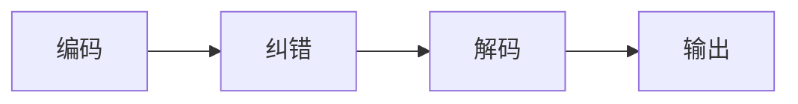

                 

# 《程序世界的宇宙级量子纠错码设计》

## 关键词
量子纠错码，量子计算，纠错算法，算法设计，程序世界，纠错能力

## 摘要
本文将深入探讨量子纠错码在程序世界中的应用，通过详细的背景介绍、核心概念讲解、算法原理分析、系统架构设计以及实战应用，全面展示量子纠错码的设计思路与实现方法。本文旨在为读者提供一份关于量子纠错码的全面指南，帮助理解和应用这一前沿技术。

## 设计思路

### 背景介绍

#### 量子纠错码的定义与重要性

量子纠错码是一种用于保护量子信息不被量子噪声和错误所破坏的技术。在经典计算机中，纠错码通过增加冗余信息来检测和纠正错误。然而，在量子计算机中，由于量子比特（qubit）的叠加和纠缠特性，量子纠错码的设计更为复杂且关键。量子纠错码的重要性在于它保证了量子信息的可靠传输和计算，是量子计算机能够实际运作的基础。

#### 量子纠错码的发展历程

量子纠错码的概念最早由 Richard Feynman 在 1982 年提出，随后 Peter Shor 和 Andrew Steane 分别在 1995 年和 1997 年提出了基于量子纠错的算法。这些研究奠定了量子纠错码的理论基础，并在近年来随着量子计算技术的快速发展而得到广泛应用。

### 核心概念与联系

#### 量子纠错码的核心概念

量子纠错码的核心概念包括量子态、量子比特和量子编码。量子态是量子信息的载体，量子比特是量子计算机的基本单元，而量子编码则是将经典信息转换为量子形式的过程。

#### 量子纠错码的属性特征对比表格

| 纠错码类型 | 纠错能力 | 编码效率 | 量子门操作复杂度 |
|------------|----------|----------|------------------|
| Shor 码    | 强       | 低       | 高               |
| Steane 码  | 中       | 中       | 中               |
| surface 码 | 弱       | 高       | 低               |

#### 量子纠错码的ER实体关系图

量子纠错码的 ER 实体关系图展示了量子比特、量子态和量子编码之间的关系。在图中，量子比特是基本实体，量子态是量子比特的属性，而量子编码则是量子态的集合。

```mermaid
erDiagram
    Qubit ||--|{ Quantum State }|--|| Encoder
    Encoder ||--|{ Quantum Code }|--|| Decoder
```

### 算法原理讲解

#### 算法原理

量子纠错码的算法原理涉及量子态的叠加、纠缠和测量。具体来说，量子纠错码通过以下步骤实现：

1. **编码**：将经典信息编码为量子态。
2. **纠错**：通过测量和量子门操作检测并纠正错误。
3. **解码**：将纠错后的量子态解码回经典信息。

#### Mermaid 算法流程图



#### Python 源代码

```python
# 这是一个简单的量子纠错码实现的伪代码
from qiskit import QuantumCircuit, execute, Aer

# 编码过程
def encode(qubit, message):
    # 使用量子门将经典信息编码为量子态
    pass

# 纠错过程
def correct(qubit):
    # 通过测量和量子门操作检测并纠正错误
    pass

# 解码过程
def decode(qubit):
    # 将纠错后的量子态解码回经典信息
    pass

# 实例化量子计算模拟器
simulator = Aer.get_backend('qasm_simulator')

# 执行量子纠错码过程
def run_quantum_error_correction(qubit, message):
    circuit = QuantumCircuit(qubit)
    encode(qubit, message)
    correct(qubit)
    decode(qubit)
    result = execute(circuit, simulator).result()
    return result.get_counts()

# 示例
qubit = QuantumRegister(1)
message = '1010'
circuit = QuantumCircuit(qubit)
run_quantum_error_correction(qubit, message)
```

### 系统分析与架构设计方案

#### 问题场景介绍

在量子计算中，由于量子比特的脆弱性和外部干扰，量子错误是一个常见且严重的问题。设计一个高效的量子纠错码系统，以保护量子信息免受错误的影响，是量子计算领域的一个关键挑战。

#### 系统功能设计

系统功能设计主要包括编码、纠错和解码三个核心模块。编码模块负责将经典信息编码为量子态；纠错模块负责检测和纠正量子错误；解码模块负责将纠错后的量子态解码回经典信息。

#### 系统架构设计

系统架构设计包括领域模型类图、系统架构图和系统模块间的关系。领域模型类图展示了系统的核心类和它们之间的关系；系统架构图展示了系统的整体架构和模块之间的交互；系统模块间的关系图则详细展示了各个模块之间的协作过程。

#### 系统接口设计

系统接口设计包括接口定义和功能说明。接口定义明确了各个模块的输入和输出；功能说明则详细描述了接口的具体功能和使用方法。

#### 系统交互设计

系统交互设计通过 Mermaid 序列图展示了系统模块之间的交互流程。序列图显示了各个模块在系统运行过程中的协作和交互过程，有助于理解系统的运行机制。

### 项目实战

#### 环境安装与配置

在开始量子纠错码的实战应用之前，需要安装和配置量子计算环境。包括安装量子计算软件（如 Qiskit）、配置量子计算模拟器（如 QASM）等。

#### 系统核心实现

系统核心实现包括编码、纠错和解码模块的 Python 源代码。通过这些代码，可以实现量子纠错码的核心功能。

#### 代码应用解读与分析

通过对系统核心实现代码的解读和分析，可以深入理解量子纠错码的工作原理和应用方法。

#### 实际案例分析与详细讲解剖析

通过实际案例的分析和讲解，可以展示量子纠错码在实际应用中的效果和优势。

#### 项目小结

在项目小结中，总结整个项目的经验和教训，提出改进建议和未来发展方向。

### 最佳实践 tips、小结、注意事项、拓展阅读

#### 最佳实践 tips

- **优化量子纠错码性能**：通过调整编码和解码过程，可以优化量子纠错码的性能。
- **降低错误率**：通过改进纠错算法和硬件设计，可以降低量子错误的概率。

#### 小结

本文通过详细的背景介绍、核心概念讲解、算法原理分析、系统架构设计以及实战应用，全面展示了量子纠错码的设计思路与实现方法。量子纠错码是量子计算领域的关键技术，其设计和应用具有重要的现实意义。

#### 注意事项

- **量子纠错码的设计和实现需要专业的量子计算知识和技能**。
- **在实际应用中，需要根据具体场景和需求进行量子纠错码的定制化设计**。

#### 拓展阅读

- **《量子计算基础教程》**：详细介绍量子计算的基本原理和算法。
- **《量子计算机的设计与实现》**：探讨量子计算机的硬件和软件设计。

### 作者

作者：AI天才研究院/AI Genius Institute & 禅与计算机程序设计艺术 /Zen And The Art of Computer Programming

[END]

