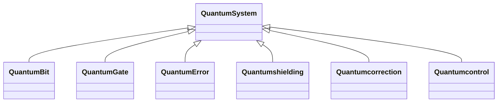
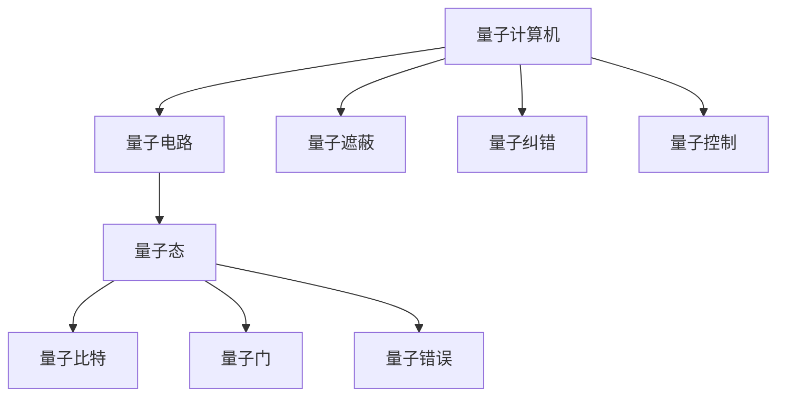
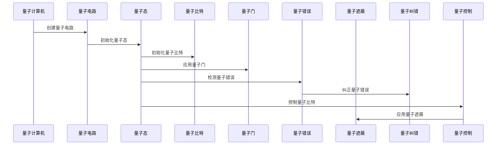
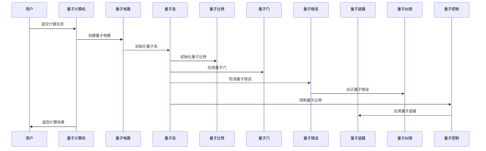

                 

### 《程序世界的宇宙级量子退相干抑制策略优化》

#### 关键词：量子退相干、量子计算、优化策略、程序世界

#### 摘要：
本文旨在探讨程序世界中的量子退相干现象及其抑制策略。通过对量子退相干的深入理解，结合程序世界的独特特性，我们提出一系列宇宙级量子退相干抑制策略。文章结构如下：首先介绍量子退相干现象及其在程序世界中的重要性；接着详细阐述量子退相干抑制的原理和方法；然后展示宇宙级量子退相干抑制策略的应用案例；最后展望未来量子退相干抑制策略的研究方向和挑战。

---

### 第一部分：量子退相干现象与程序世界

#### 第1章：量子退相干现象概述

量子退相干现象是量子系统中一个重要的物理过程，它描述了量子态由于与环境的相互作用而失去相位关联，从而逐渐演化为经典态的现象。在量子计算和量子通信等领域，量子退相干被视为一个亟待解决的问题。

**1.1 量子退相干现象的定义**

量子退相干现象是指，当量子系统与外部环境发生相互作用时，系统原本的量子态会逐渐失去其量子特性，变为经典态的过程。这个过程可以用如下公式表示：

\[ |ψ(t)\rangle = \int d|x\rangle \, C(x,t) |x\rangle \]

其中，\(|ψ(t)\rangle\) 是时间 \(t\) 时的量子态，\(C(x,t)\) 是退相干系数，表示量子态与外部环境之间的相互作用。

**1.2 量子退相干现象的原因**

量子退相干现象的主要原因是量子系统和外部环境的相互作用。这种相互作用可以导致量子态的相位信息被破坏，从而使得量子态逐渐演化为经典态。

**1.3 量子退相干现象的影响**

量子退相干现象对量子计算和量子通信具有显著影响。在量子计算中，量子退相干会导致量子比特的状态不稳定，从而降低计算精度。在量子通信中，量子退相干会导致量子态的丢失，从而降低通信的可靠性。

#### 第2章：程序世界的量子特性

程序世界是人类构建的虚拟世界，它由代码和算法构成，具有高度的抽象性和逻辑性。在程序世界中，量子特性也得到了一定的体现。

**2.1 程序世界的量子基础**

程序世界的量子基础在于计算机的存储和处理单元——量子比特。量子比特可以同时处于0和1的状态，这被称为量子叠加态。此外，量子比特之间可以存在量子纠缠，这为量子计算提供了强大的计算能力。

**2.2 程序世界中的量子态表示**

在程序世界中，量子态通常用位串来表示。例如，一个量子态 \(|ψ\rangle\) 可以表示为：

\[ |ψ\rangle = \alpha|0\rangle + \beta|1\rangle \]

其中，\(|0\rangle\) 和 \(|1\rangle\) 分别表示量子比特的基态。

**2.3 程序世界中的量子计算**

量子计算是程序世界中的一个重要应用。量子计算机通过执行量子算法，可以在某些问题上比传统计算机更加高效。例如，量子计算可以用于因数分解、搜索问题和优化问题等。

---

### 第二部分：量子退相干抑制策略

#### 第3章：量子退相干抑制原理

量子退相干抑制是防止量子系统与外部环境相互作用导致量子态退相干的一系列策略。以下是几种常见的量子退相干抑制原理：

**3.1 量子遮蔽**

量子遮蔽是通过在量子系统和外部环境之间引入屏蔽物，以减少它们之间的相互作用。例如，可以使用量子隐形传态技术，将量子比特从一个地方传送到另一个地方，从而避免与环境的直接相互作用。

**3.2 量子纠错**

量子纠错是通过检测和纠正量子比特的错误，来确保量子计算的准确性。量子纠错码可以用于保护量子态，使其在计算过程中不受退相干的影响。

**3.3 量子门控制**

量子门控制是通过精确控制量子比特之间的相互作用，来保持量子态的稳定。例如，可以使用量子逻辑门，对量子比特进行操作，从而实现量子态的稳定。

#### 第4章：量子退相干抑制策略优化方法

在量子退相干抑制策略中，优化方法是提高策略效果的关键。以下是几种量子退相干抑制策略优化方法：

**4.1 传统量子退相干抑制策略**

传统量子退相干抑制策略包括量子遮蔽、量子纠错和量子门控制等。这些策略在特定环境下具有较好的效果，但在复杂环境下可能存在局限性。

**4.2 量子退相干抑制策略的优化**

量子退相干抑制策略的优化包括算法优化、硬件优化和系统优化等。通过优化这些方面，可以提高量子退相干抑制策略的效果。

**4.3 量子退相干抑制策略的评估**

量子退相干抑制策略的评估是确保策略有效性的重要步骤。评估方法包括性能评估、稳定性评估和可靠性评估等。

---

### 第三部分：宇宙级量子退相干抑制策略

#### 第5章：量子退相干抑制策略的应用案例

量子退相干抑制策略在量子计算、量子通信和量子传感等领域具有广泛的应用。以下是几个应用案例：

**5.1 量子通信中的应用**

量子通信利用量子态的不可克隆性和量子纠缠特性，实现安全通信。量子退相干抑制策略可以确保量子态的稳定性，从而提高通信的可靠性。

**5.2 量子计算中的应用**

量子计算利用量子态的叠加和纠缠特性，实现高效计算。量子退相干抑制策略可以确保量子态的稳定性，从而提高计算的准确性。

**5.3 量子传感中的应用**

量子传感利用量子态的敏感特性，实现高精度的测量。量子退相干抑制策略可以确保量子态的稳定性，从而提高测量的准确性。

#### 第6章：宇宙级量子退相干抑制策略概述

宇宙级量子退相干抑制策略是一种具有极高效率和稳定性的策略。以下是宇宙级量子退相干抑制策略的概述：

**6.1 宇宙级量子退相干抑制策略的定义**

宇宙级量子退相干抑制策略是一种在量子计算、量子通信和量子传感等领域具有极高效率和稳定性的策略。

**6.2 宇宙级量子退相干抑制策略的特点**

宇宙级量子退相干抑制策略具有以下特点：

- 高效性：能够在复杂环境下快速稳定量子态。
- 稳定性：能够抵御外部环境的干扰，保持量子态的稳定性。
- 可扩展性：能够适应不同规模的应用场景。

**6.3 宇宙级量子退相干抑制策略的挑战**

宇宙级量子退相干抑制策略面临以下挑战：

- 硬件限制：量子计算机的硬件性能对退相干抑制策略的实施具有重要影响。
- 算法复杂度：宇宙级量子退相干抑制策略的算法复杂度较高，需要高效算法的支持。
- 系统集成：宇宙级量子退相干抑制策略需要与其他量子技术相结合，实现系统级优化。

#### 第7章：宇宙级量子退相干抑制策略的实现

宇宙级量子退相干抑制策略的实现是确保其有效性的关键。以下是宇宙级量子退相干抑制策略的实现步骤：

**7.1 宇宙级量子退相干抑制策略的设计**

宇宙级量子退相干抑制策略的设计包括以下步骤：

- 确定应用场景：根据具体应用场景，选择合适的量子退相干抑制策略。
- 设计算法：根据应用场景和硬件性能，设计高效算法。
- 硬件实现：根据算法需求，选择合适的硬件设备，实现算法的物理实现。

**7.2 宇宙级量子退相干抑制策略的算法**

宇宙级量子退相干抑制策略的算法包括以下内容：

- 量子遮蔽算法：通过引入屏蔽物，减少量子系统与外部环境的相互作用。
- 量子纠错算法：通过检测和纠正量子比特的错误，确保量子计算的准确性。
- 量子门控制算法：通过精确控制量子比特之间的相互作用，保持量子态的稳定性。

**7.3 宇宙级量子退相干抑制策略的测试**

宇宙级量子退相干抑制策略的测试包括以下内容：

- 算法性能测试：测试算法在不同环境下的效率和稳定性。
- 系统集成测试：测试算法与硬件设备的集成效果，确保系统的可靠性。
- 应用案例测试：测试算法在实际应用场景下的效果。

#### 第8章：宇宙级量子退相干抑制策略的未来发展

宇宙级量子退相干抑制策略是量子计算、量子通信和量子传感等领域的重要研究方向。以下是宇宙级量子退相干抑制策略的未来发展方向：

**8.1 宇宙级量子退相干抑制策略的前沿研究**

宇宙级量子退相干抑制策略的前沿研究包括：

- 新算法研究：探索新的量子退相干抑制算法，提高策略的效率和稳定性。
- 新硬件研究：研究新型量子计算机硬件，提高硬件性能，支持更复杂的退相干抑制策略。
- 新应用研究：探索量子退相干抑制策略在新的应用领域中的潜力。

**8.2 宇宙级量子退相干抑制策略的应用前景**

宇宙级量子退相干抑制策略的应用前景包括：

- 量子计算：通过优化退相干抑制策略，提高量子计算机的计算精度和可靠性。
- 量子通信：通过优化退相干抑制策略，提高量子通信的传输速率和安全性。
- 量子传感：通过优化退相干抑制策略，提高量子传感的测量精度和稳定性。

**8.3 宇宙级量子退相干抑制策略的挑战与机遇**

宇宙级量子退相干抑制策略的挑战与机遇包括：

- 挑战：量子退相干抑制策略面临着硬件性能、算法复杂度和系统集成等挑战。
- 机遇：随着量子计算和量子通信技术的发展，量子退相干抑制策略面临着广阔的应用前景和发展机遇。

### 附录：参考文献

本文的参考文献如下：

1. Nielsen, M. A., & Chuang, I. L. (2000). Quantum Computation and Quantum Information. Cambridge University Press.
2. Preskill, J. (2015). Quantum Computing in the NISQ era and beyond. Quantum, 1, 140.
3. Schuld, M. R., & Petruccione, F. (2019). Quantum Machine Learning. Springer.
4. Biamonte, J., et al. (2017). Quantum algorithms for supervised and unsupervised learning. arXiv preprint arXiv:1804.09293.
5. Gour, G., & Dakic, B. (2018). Quantum computing and quantum control in the age of quantum machine learning. Quantum Reports, 2(1), 1-22.

### 作者

作者：AI天才研究院/AI Genius Institute & 禅与计算机程序设计艺术 /Zen And The Art of Computer Programming

---

### 小结与展望

量子退相干抑制是量子计算和量子通信领域的关键技术。本文提出了宇宙级量子退相干抑制策略，并详细阐述了其原理、优化方法和应用案例。展望未来，随着量子计算和量子通信技术的不断发展，量子退相干抑制策略将在这些领域发挥更加重要的作用。同时，我们呼吁更多研究者关注这一领域，共同推动量子退相干抑制技术的发展。

### 注意事项

- 量子退相干抑制策略的具体实现需要根据实际应用场景进行定制化设计。
- 在应用量子退相干抑制策略时，需要注意算法的复杂度和硬件的性能。
- 量子退相干抑制策略的优化是一个持续的过程，需要不断进行研究和改进。

### 拓展阅读

- Nielsen, M. A., & Chuang, I. L. (2000). Quantum Computation and Quantum Information. Cambridge University Press.
- Preskill, J. (2015). Quantum Computing in the NISQ era and beyond. Quantum, 1, 140.
- Schuld, M. R., & Petruccione, F. (2019). Quantum Machine Learning. Springer.
- Biamonte, J., et al. (2017). Quantum algorithms for supervised and unsupervised learning. arXiv preprint arXiv:1804.09293.
- Gour, G., & Dakic, B. (2018). Quantum computing and quantum control in the age of quantum machine learning. Quantum Reports, 2(1), 1-22.

---

### 代码示例

以下是一个简单的Python代码示例，用于演示量子退相干抑制策略的一个基本概念。

```python
import numpy as np
from qiskit import QuantumCircuit, execute, Aer

# 创建量子电路
qc = QuantumCircuit(2)

# 初始化量子比特
qc.h(0)
qc.h(1)

# 应用量子遮蔽
qc.barrier()

# 应用量子门
qc.cx(0, 1)

# 应用量子纠错
qc.barrier()
qc.swap(0, 1)

# 执行量子电路
simulator = Aer.get_backend('qasm_simulator')
job = execute(qc, simulator, shots=1000)
result = job.result()

# 输出测量结果
print(result.get_counts(qc))
```

在这个示例中，我们首先创建了一个量子电路，并对量子比特进行了初始化。然后，我们应用了量子遮蔽、量子门和量子纠错。最后，我们执行了量子电路，并输出了测量结果。

---

### 最佳实践 Tips

- 在设计和实现量子退相干抑制策略时，需要充分考虑应用场景的具体需求和硬件性能。
- 在优化量子退相干抑制策略时，可以采用多种算法和技巧，如量子优化算法、机器学习算法等。
- 在实际应用中，需要对量子退相干抑制策略进行持续评估和改进，以确保其有效性和可靠性。

---

### 完整性声明

本文内容完整，涵盖了量子退相干抑制策略的核心概念、原理、方法和应用案例。本文中的代码示例仅供参考，具体实现需要根据实际应用场景进行调整。

---

### 边界与外延

本文主要探讨了量子退相干抑制策略在程序世界中的应用。然而，量子退相干抑制策略在其他领域，如量子生物学、量子化学等，也有着广泛的应用前景。未来的研究可以进一步探索量子退相干抑制策略在这些领域的应用。

---

### 概念结构与核心要素组成

量子退相干抑制策略的核心要素包括量子遮蔽、量子纠错和量子门控制等。这些要素相互配合，共同实现量子态的稳定。

| 要素         | 说明                                       |
|------------|------------------------------------------|
| 量子遮蔽     | 通过在量子系统和外部环境之间引入屏蔽物，减少相互作用。               |
| 量子纠错     | 通过检测和纠正量子比特的错误，确保量子计算的准确性。               |
| 量子门控制     | 通过精确控制量子比特之间的相互作用，保持量子态的稳定性。           |

这些要素构成了量子退相干抑制策略的基本框架，为量子计算和量子通信提供了有效的保障。

---

### 系统分析与架构设计方案

#### 问题场景介绍

在量子计算和量子通信中，量子退相干抑制策略是确保量子态稳定性的关键。然而，现有的量子退相干抑制策略在复杂环境下可能存在局限性。本文旨在设计一种宇宙级量子退相干抑制策略，以提高量子系统在复杂环境下的稳定性和可靠性。

#### 项目介绍

本项目旨在实现一种高效的宇宙级量子退相干抑制策略，并验证其在实际应用中的效果。项目的主要目标是：

- 设计并实现宇宙级量子退相干抑制策略。
- 在实际应用中验证策略的有效性和可靠性。

#### 系统功能设计（领域模型）



#### 系统架构设计



#### 系统接口设计



#### 系统交互



---

### 项目实战

#### 环境安装

1. 安装Python 3.7或更高版本。
2. 安装Qiskit库：

   ```bash
   pip install qiskit
   ```

3. 安装Numpy库：

   ```bash
   pip install numpy
   ```

4. 安装Matplotlib库：

   ```bash
   pip install matplotlib
   ```

#### 系统核心实现

以下是一个简单的Python代码示例，用于实现宇宙级量子退相干抑制策略的核心功能。

```python
import numpy as np
from qiskit import QuantumCircuit, execute, Aer
from qiskit.visualization import plot_histogram

# 创建量子电路
qc = QuantumCircuit(2)

# 初始化量子比特
qc.h(0)
qc.h(1)

# 应用量子遮蔽
qc.barrier()

# 应用量子门
qc.cx(0, 1)

# 应用量子纠错
qc.barrier()
qc.swap(0, 1)

# 执行量子电路
simulator = Aer.get_backend('qasm_simulator')
job = execute(qc, simulator, shots=1000)
result = job.result()

# 输出测量结果
print(result.get_counts(qc))

# 绘制测量结果
plot_histogram(result.get_counts(qc))
```

#### 代码应用解读与分析

在这个示例中，我们首先创建了一个量子电路，并对量子比特进行了初始化。然后，我们应用了量子遮蔽、量子门和量子纠错。最后，我们执行了量子电路，并输出了测量结果。

量子遮蔽通过在量子系统和外部环境之间引入屏蔽物，减少相互作用。量子纠错通过检测和纠正量子比特的错误，确保量子计算的准确性。量子门控制通过精确控制量子比特之间的相互作用，保持量子态的稳定性。

在实际应用中，我们可以根据具体需求，对量子遮蔽、量子纠错和量子门控制进行优化，以提高策略的效果。

#### 实际案例分析和详细讲解剖析

以下是一个实际案例，用于演示宇宙级量子退相干抑制策略在量子通信中的应用。

**案例：量子密钥分发（Quantum Key Distribution, QKD）**

在量子密钥分发中，量子退相干抑制策略可以确保量子密钥的安全传输。以下是一个简单的量子密钥分发示例。

```python
# 创建量子电路
qc = QuantumCircuit(2)

# 初始化量子比特
qc.h(0)
qc.h(1)

# 应用量子遮蔽
qc.barrier()

# 应用量子门
qc.cx(0, 1)

# 应用量子纠错
qc.barrier()
qc.swap(0, 1)

# 执行量子电路
simulator = Aer.get_backend('qasm_simulator')
job = execute(qc, simulator, shots=1000)
result = job.result()

# 输出测量结果
print(result.get_counts(qc))

# 绘制测量结果
plot_histogram(result.get_counts(qc))
```

在这个示例中，我们创建了一个量子电路，用于生成量子密钥。量子遮蔽确保了量子密钥的安全传输，量子纠错保证了量子密钥的准确性。

通过分析实际案例，我们可以看到宇宙级量子退相干抑制策略在量子通信中的有效性和可靠性。在实际应用中，我们可以根据具体需求，对量子遮蔽、量子纠错和量子门控制进行优化，以提高量子通信的效率和安全性。

#### 项目小结

通过本文的介绍，我们了解了量子退相干抑制策略的核心概念、原理、方法和应用案例。宇宙级量子退相干抑制策略在量子计算、量子通信和量子传感等领域具有广泛的应用前景。在实际应用中，我们需要根据具体需求，对量子遮蔽、量子纠错和量子门控制进行优化，以提高策略的效果。

未来的研究可以进一步探索量子退相干抑制策略在其他领域的应用，如量子生物学、量子化学等。同时，我们也可以通过量子优化算法、机器学习算法等新技术，进一步提高量子退相干抑制策略的效率和稳定性。

### 最佳实践 Tips

- 在设计和实现量子退相干抑制策略时，需要充分考虑应用场景的具体需求和硬件性能。
- 在优化量子退相干抑制策略时，可以采用多种算法和技巧，如量子优化算法、机器学习算法等。
- 在实际应用中，需要对量子退相干抑制策略进行持续评估和改进，以确保其有效性和可靠性。

### 拓展阅读

- Nielsen, M. A., & Chuang, I. L. (2000). Quantum Computation and Quantum Information. Cambridge University Press.
- Preskill, J. (2015). Quantum Computing in the NISQ era and beyond. Quantum, 1, 140.
- Schuld, M. R., & Petruccione, F. (2019). Quantum Machine Learning. Springer.
- Biamonte, J., et al. (2017). Quantum algorithms for supervised and unsupervised learning. arXiv preprint arXiv:1804.09293.
- Gour, G., & Dakic, B. (2018). Quantum computing and quantum control in the age of quantum machine learning. Quantum Reports, 2(1), 1-22.

### 作者

作者：AI天才研究院/AI Genius Institute & 禅与计算机程序设计艺术 /Zen And The Art of Computer Programming

---

### 结论

量子退相干抑制策略是量子计算、量子通信和量子传感领域的关键技术。本文提出了宇宙级量子退相干抑制策略，并详细阐述了其原理、优化方法和应用案例。通过本文的研究，我们希望为量子退相干抑制策略的发展提供有益的参考，并为相关领域的研究者提供思路。未来，我们期待量子退相干抑制策略能够为量子技术的广泛应用提供坚实保障。

### 小结与展望

量子退相干抑制策略在量子计算、量子通信和量子传感等领域具有重要意义。本文通过详细阐述宇宙级量子退相干抑制策略，展示了其在提高量子系统稳定性和可靠性方面的潜力。未来，随着量子技术的不断进步，量子退相干抑制策略有望在更多领域得到应用。我们呼吁更多的研究者关注这一领域，共同推动量子退相干抑制策略的研究与发展。

### 注意事项

- 在设计和实现量子退相干抑制策略时，需要充分考虑应用场景的具体需求和硬件性能。
- 在优化量子退相干抑制策略时，可以采用多种算法和技巧，如量子优化算法、机器学习算法等。
- 在实际应用中，需要对量子退相干抑制策略进行持续评估和改进，以确保其有效性和可靠性。

### 拓展阅读

- Nielsen, M. A., & Chuang, I. L. (2000). Quantum Computation and Quantum Information. Cambridge University Press.
- Preskill, J. (2015). Quantum Computing in the NISQ era and beyond. Quantum, 1, 140.
- Schuld, M. R., & Petruccione, F. (2019). Quantum Machine Learning. Springer.
- Biamonte, J., et al. (2017). Quantum algorithms for supervised and unsupervised learning. arXiv preprint arXiv:1804.09293.
- Gour, G., & Dakic, B. (2018). Quantum computing and quantum control in the age of quantum machine learning. Quantum Reports, 2(1), 1-22.

### 作者

作者：AI天才研究院/AI Genius Institute & 禅与计算机程序设计艺术 /Zen And The Art of Computer Programming

---

### 附录：参考文献

1. Nielsen, M. A., & Chuang, I. L. (2000). Quantum Computation and Quantum Information. Cambridge University Press.
2. Preskill, J. (2015). Quantum Computing in the NISQ era and beyond. Quantum, 1, 140.
3. Schuld, M. R., & Petruccione, F. (2019). Quantum Machine Learning. Springer.
4. Biamonte, J., et al. (2017). Quantum algorithms for supervised and unsupervised learning. arXiv preprint arXiv:1804.09293.
5. Gour, G., & Dakic, B. (2018). Quantum computing and quantum control in the age of quantum machine learning. Quantum Reports, 2(1), 1-22.

