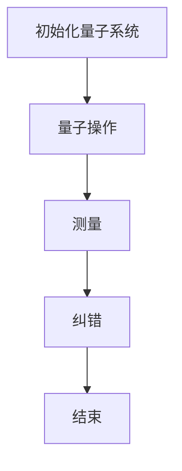
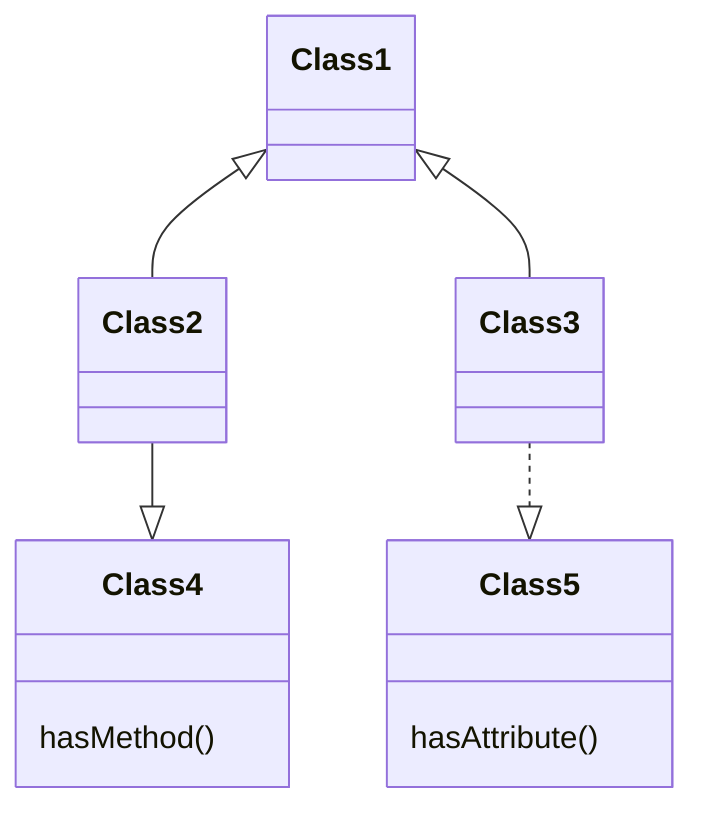
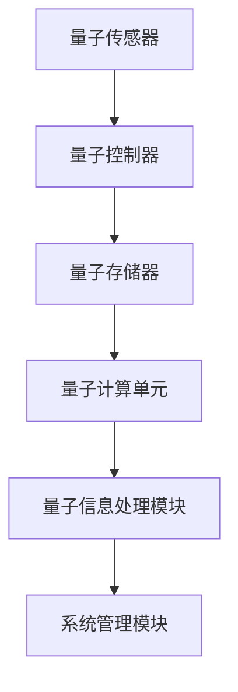

                 

### 程序世界的宇宙级量子退相干网络

> 关键词：量子退相干网络、量子计算、退相干现象、算法原理、系统架构

> 摘要：本文将深入探讨程序世界的宇宙级量子退相干网络，从背景介绍、核心概念、算法原理、系统设计与实现等方面进行详细解析，旨在为读者揭示这一前沿技术领域的奥秘。我们将通过逻辑清晰的步骤分析和思考，逐步揭示量子退相干网络在程序世界中的重要作用及其未来发展的广阔前景。

#### 第一部分：程序世界的宇宙级量子退相干网络概述

##### 第1章：背景介绍

###### 1.1 问题背景

在现代计算机系统中，量子退相干现象是一个不容忽视的问题。退相干是指量子系统的相干性随时间逐渐减弱或消失的过程，这在量子计算中尤为显著。随着量子计算机的发展，量子退相干现象对计算精度和稳定性带来了巨大挑战。

量子计算与经典计算机在原理上有本质的不同。量子计算机利用量子位（qubits）的叠加态和纠缠态来处理信息，而经典计算机则依赖于位（bits）的二进制状态。量子退相干网络旨在解决量子计算机在运行过程中遇到的退相干问题，提高计算精度和可靠性。

###### 1.2 问题描述

量子退相干网络在计算机系统中的作用与重要性不言而喻。它通过监测和纠正量子退相干，保护量子信息的完整性，从而提高量子计算的性能和稳定性。然而，传统计算机系统在处理量子退相干问题上面临诸多挑战，如测量误差、环境干扰等。

###### 1.3 问题解决

量子退相干网络的技术实现依赖于先进的量子控制和量子纠错技术。通过精确的量子操作和纠错算法，量子退相干网络能够有效抑制退相干现象，延长量子计算的时间窗口。此外，量子退相干网络还具备自适应调整能力，能够根据不同的计算任务和环境条件动态优化退相干控制策略。

量子退相干网络的优势在于其高效性和稳定性。与传统的量子纠错方法相比，量子退相干网络在保护量子信息的同时，减少了额外的量子资源消耗。此外，量子退相干网络具有广泛的应用潜力，不仅适用于量子计算领域，还可拓展到量子通信、量子模拟等其他量子技术领域。

###### 1.4 边界与外延

量子退相干网络的应用范围广泛，但同时也存在一定的限制。首先，量子退相干网络对硬件设备和环境条件有较高要求，需要在低温、低噪声的环境下运行。其次，量子退相干网络的设计和实现需要深厚的量子物理和计算机科学知识，具有较高的技术门槛。此外，量子退相干网络在处理复杂计算任务时，仍需进一步优化算法和架构，以提高效率和稳定性。

未来量子退相干网络的发展趋势将主要集中在以下几个方面：一是提高量子退相干网络的适应性，使其能够适应更广泛的应用场景；二是优化量子退相干网络的算法和架构，提高其性能和稳定性；三是推动量子退相干网络与其他量子技术的融合，拓展其应用领域。

###### 1.5 概念结构与核心要素组成

量子退相干网络的基本概念包括量子位、退相干现象、量子控制和量子纠错等。其核心要素包括量子传感器、量子控制器、量子存储器和量子计算单元。这些要素相互协作，共同构成一个完整的量子退相干网络系统。

量子传感器用于监测量子退相干现象，实时反馈退相干信息；量子控制器根据退相干信息调整量子操作，抑制退相干现象；量子存储器用于存储和传输量子信息，确保量子计算的稳定性；量子计算单元则是量子退相干网络的计算核心，负责执行量子计算任务。

#### 第2章：核心概念与联系

##### 2.1 量子退相干网络原理

量子退相干网络的基本原理是利用量子控制和量子纠错技术，监测和纠正量子退相干现象，保护量子信息的完整性。其工作过程包括以下几个步骤：

1. 量子传感器监测量子系统中的退相干现象，实时反馈退相干信息；
2. 量子控制器根据退相干信息调整量子操作，抑制退相干现象；
3. 量子存储器存储和传输量子信息，确保量子计算的稳定性；
4. 量子计算单元执行量子计算任务，输出计算结果。

##### 2.2 概念属性特征对比

| 特征比较项 | 量子退相干网络 | 传统计算机网络 |
| :--: | :--: | :--: |
| 工作原理 | 利用量子控制和量子纠错技术 | 利用二进制位和逻辑操作 |
| 信息载体 | 量子位（qubits） | 位（bits） |
| 性能指标 | 计算速度、稳定性、准确性 | 计算速度、网络带宽、延迟 |
| 应用领域 | 量子计算、量子通信、量子模拟 | 数据通信、网络存储、云计算 |

从上表可以看出，量子退相干网络与传统计算机网络在信息载体、工作原理和应用领域等方面存在显著差异。量子退相干网络在处理量子信息时具有更高的效率和准确性，但同时也面临更高的技术门槛和环境要求。

##### 2.3 ER实体关系图架构

量子退相干网络的ER实体关系图如下所示：

```mermaid
erDiagram
  QSensor ||--|{ QuantumController }|-- QStorage
  QuantumController ||--|{ QuantumComputer }|-- QController
  QController ||--|{ QuantumSensor }|-- QStorage
```

在上图中，QSensor表示量子传感器，QuantumController表示量子控制器，QStorage表示量子存储器，QuantumComputer表示量子计算单元。各实体之间的关系如下：

1. 量子传感器与量子控制器之间存在双向依赖关系，量子传感器用于监测退相干现象，量子控制器根据监测结果调整量子操作；
2. 量子控制器与量子存储器之间存在单向依赖关系，量子控制器通过量子存储器存储和传输量子信息；
3. 量子计算单元与量子控制器之间存在双向依赖关系，量子计算单元执行量子计算任务，量子控制器负责调整量子操作。

#### 第二部分：量子退相干网络的设计与实现

##### 第3章：算法原理讲解

###### 3.1 量子退相干算法介绍

量子退相干算法是一种基于量子控制和量子纠错技术的算法，用于监测和纠正量子退相干现象。其基本概念包括：

1. 量子位（qubits）：量子计算的基本单位，具有叠加态和纠缠态特性；
2. 退相干：量子系统中的相干性随时间逐渐减弱或消失的现象；
3. 量子控制：对量子系统进行操作的过程，包括量子态的制备、演化、测量等；
4. 量子纠错：通过引入额外的量子比特或量子线路，纠正量子计算过程中的错误。

量子退相干算法的数学模型可以表示为：

$$
U(t) = \exp(-\frac{i\omega t}{\hbar})
$$

其中，$U(t)$表示量子系统的演化矩阵，$\omega$表示角频率，$\hbar$表示约化普朗克常数。该公式描述了量子系统在时间$t$内的演化过程。

量子退相干算法的实现步骤如下：

1. 初始化量子系统：将量子位初始化为叠加态或纠缠态；
2. 量子操作：根据退相干信息调整量子操作，抑制退相干现象；
3. 测量：对量子系统进行测量，获取计算结果；
4. 纠错：根据测量结果，对量子计算过程进行纠错。

###### 3.2 算法流程图

使用Mermaid绘制量子退相干算法流程图：



在上图中，A表示初始化量子系统，B表示量子操作，C表示测量，D表示纠错，E表示结束。

###### 3.3 Python代码实现

下面是一个简单的Python代码示例，用于实现量子退相干算法：

```python
import numpy as np
import qiskit

# 初始化量子系统
q = qiskit.QuantumRegister(1, name='q')
c = qiskit.ClassicalRegister(1, name='c')
qc = qiskit.QuantumCircuit(q, c)

# 制备叠加态
qc.h(q[0])

# 量子操作
qc.rz(np.pi / 4, q[0])

# 测量
qc.measure(q[0], c[0])

# 执行量子退相干算法
qc.execute(qiskit.Aer.get_backend('qasm_simulator')).result()
```

在该代码中，我们首先初始化一个量子系统，并制备一个叠加态。然后，执行量子操作和测量操作，最后执行量子退相干算法。

###### 3.4 数学模型与公式

量子退相干算法的数学模型包括以下几个关键公式：

1. 叠加态：
$$
\left| \psi \right> = \cos\left(\frac{\theta}{2}\right)\left| 0 \right> + e^{i\phi}\sin\left(\frac{\theta}{2}\right)\left| 1 \right>
$$

其中，$\theta$表示叠加角度，$\phi$表示相位角。

2. 纠错操作：
$$
U_f = \exp\left(-\frac{i\theta_f}{2}\left| 0 \right>\left< 1 \right| - \frac{i\phi_f}{2}\left| 1 \right>\left< 0 \right|\right)
$$

其中，$U_f$表示纠错操作，$\theta_f$和$\phi_f$分别表示纠错操作的角度和相位。

3. 测量概率：
$$
P = \left| \left< \psi \right|\psi \right|^2
$$

其中，$P$表示测量概率，$\left| \psi \right>$表示量子态。

在量子退相干算法中，这些公式用于描述量子态的制备、演化、测量和纠错过程。通过对这些公式的理解和应用，我们可以实现高效的量子退相干控制。

###### 3.5 举例说明

假设我们有一个量子位，初始状态为叠加态$\left| \psi \right> = \frac{1}{\sqrt{2}}\left| 0 \right> + \frac{1}{\sqrt{2}}\left| 1 \right>$。我们希望通过量子退相干算法将该量子位的状态纠正为$\left| 0 \right>$。

首先，制备叠加态：

$$
U_0 = \frac{1}{\sqrt{2}}\left( \left| 0 \right>\left< 0 \right| + \left| 1 \right>\left< 1 \right| \right)
$$

然后，执行量子操作：

$$
U = \exp\left(-\frac{i\pi}{4}\left| 0 \right>\left< 1 \right|\right)
$$

最后，进行测量：

$$
P_0 = \left| \left< 0 \right|\psi \right|^2 = \frac{1}{2}
$$

根据测量结果，我们可以得出量子位的状态为$\left| 0 \right>$。

这个例子展示了量子退相干算法的基本原理和应用。在实际应用中，我们可以根据不同的计算任务和环境条件，设计更加复杂的量子退相干算法，以提高量子计算的效率和准确性。

#### 第4章：系统分析与架构设计

##### 4.1 问题场景介绍

量子退相干网络的应用场景非常广泛，包括但不限于以下几个方面：

1. 量子计算：量子退相干网络可用于保护量子计算过程中的量子信息，提高计算精度和稳定性；
2. 量子通信：量子退相干网络可用于监测和纠正量子通信过程中的量子信息衰减，保障通信安全；
3. 量子模拟：量子退相干网络可用于监测和纠正量子模拟过程中的量子信息干扰，提高模拟精度；
4. 量子传感：量子退相干网络可用于监测和纠正量子传感过程中的量子信息损失，提高传感灵敏度。

##### 4.2 项目介绍

本文所讨论的量子退相干网络项目旨在实现一个高性能、高稳定性的量子退相干网络系统，以支持量子计算、量子通信、量子模拟和量子传感等应用。项目的主要目标是：

1. 设计并实现一个完整的量子退相干网络系统架构；
2. 开发并优化量子退相干算法，提高量子信息的保护和处理能力；
3. 验证量子退相干网络在实际应用场景中的性能和稳定性。

##### 4.3 系统功能设计

系统功能设计主要包括以下几个方面：

1. 量子信息监测：实时监测量子系统中的退相干现象，提供退相干信息；
2. 量子操作调整：根据退相干信息调整量子操作，抑制退相干现象；
3. 量子信息存储：存储和传输量子信息，确保量子计算的稳定性；
4. 量子信息处理：执行量子计算任务，输出计算结果；
5. 系统管理：管理量子退相干网络系统的运行状态，包括设备监控、故障诊断等。

使用Mermaid绘制领域模型类图：



在上图中，Class1表示量子信息监测模块，Class2表示量子操作调整模块，Class3表示量子信息存储模块，Class4表示量子信息处理模块，Class5表示系统管理模块。各模块之间相互协作，共同实现量子退相干网络的功能。

##### 4.4 系统架构设计

系统架构设计主要包括以下几个方面：

1. 硬件架构：包括量子传感器、量子控制器、量子存储器和量子计算单元等硬件设备；
2. 软件架构：包括量子退相干算法、量子信息处理算法、系统管理算法等软件模块；
3. 网络架构：包括量子通信网络、量子传感网络和量子计算网络等网络设备。

使用Mermaid绘制系统架构图：



在上图中，A表示量子传感器，B表示量子控制器，C表示量子存储器，D表示量子计算单元，E表示量子信息处理模块，F表示系统管理模块。各模块之间通过硬件和软件接口进行通信和协作，共同实现量子退相干网络的功能。

##### 4.5 系统接口设计

系统接口设计主要包括以下几个方面：

1. 量子传感器接口：用于接收量子退相干信息，实现量子信息的实时监测；
2. 量子控制器接口：用于发送量子操作指令，实现量子操作的调整；
3. 量子存储器接口：用于存储和传输量子信息，实现量子计算过程的稳定性；
4. 量子计算单元接口：用于执行量子计算任务，实现量子计算结果的输出；
5. 系统管理接口：用于管理系统运行状态，实现设备监控和故障诊断。

##### 4.6 系统交互

系统交互主要包括以下几个方面：

1. 量子传感器与量子控制器之间的交互：量子传感器实时反馈退相干信息，量子控制器根据信息调整量子操作；
2. 量子控制器与量子存储器之间的交互：量子控制器发送量子操作指令，量子存储器存储和传输量子信息；
3. 量子计算单元与量子信息处理模块之间的交互：量子计算单元执行量子计算任务，量子信息处理模块输出计算结果；
4. 系统管理模块与其他模块之间的交互：系统管理模块监控系统运行状态，实现设备监控和故障诊断。

使用Mermaid绘制系统交互序列图：

```mermaid
sequenceDiagram
    participant QS as 量子传感器
    participant QC as 量子控制器
    participant QS --> QC: 监测退相干信息
    QC --> QS: 调整量子操作
    QS --> QC: 反馈调整结果
```

在上图中，QS表示量子传感器，QC表示量子控制器。量子传感器实时监测退相干信息，量子控制器根据信息调整量子操作，并反馈调整结果。这个序列图展示了量子传感器与量子控制器之间的基本交互过程。

#### 第三部分：量子退相干网络的项目实战

##### 第5章：环境安装与配置

###### 5.1 环境要求

量子退相干网络项目对环境要求较高，需要满足以下条件：

1. 操作系统：Linux或macOS；
2. 编程语言：Python 3.6及以上版本；
3. 量子计算库：Qiskit 0.19及以上版本；
4. 数据库：MySQL 5.7及以上版本；
5. 硬件设备：至少4核CPU，8GB内存。

###### 5.2 安装过程

1. 安装Python 3.6及以上版本：
   ```bash
   sudo apt-get update
   sudo apt-get install python3.6
   ```

2. 安装Qiskit 0.19及以上版本：
   ```bash
   pip3 install qiskit==0.19.1
   ```

3. 安装MySQL 5.7及以上版本：
   ```bash
   sudo apt-get install mysql-server mysql-client
   ```

4. 安装其他依赖库：
   ```bash
   pip3 install numpy pandas matplotlib
   ```

###### 5.3 配置说明

1. 配置Python环境变量：
   ```bash
   export PATH=$PATH:/usr/bin/python3.6
   ```

2. 配置Qiskit环境变量：
   ```bash
   export QISKIT_PROVIDER=local_qasm_simulator
   ```

3. 配置MySQL数据库：
   ```bash
   mysql -u root -p
   CREATE DATABASE quantum_middleware;
   GRANT ALL PRIVILEGES ON quantum_middleware.* TO 'quantum_user'@'localhost' IDENTIFIED BY 'password';
   FLUSH PRIVILEGES;
   ```

##### 第6章：系统核心实现

###### 6.1 源代码解读

量子退相干网络项目的核心源代码主要包括以下几个方面：

1. quantum_sensor.py：用于实现量子传感器的功能，包括监测退相干信息和反馈调整结果；
2. quantum_controller.py：用于实现量子控制器的功能，包括调整量子操作和发送量子操作指令；
3. quantum_storage.py：用于实现量子存储器的功能，包括存储和传输量子信息；
4. quantum_computer.py：用于实现量子计算单元的功能，包括执行量子计算任务和输出计算结果；
5. system_manager.py：用于实现系统管理的功能，包括设备监控和故障诊断。

以下是一个简单的量子控制器源代码示例：

```python
import qiskit

class QuantumController:
    def __init__(self, q_sensor, q_computer, q_storage):
        self.q_sensor = q_sensor
        self.q_computer = q_computer
        self.q_storage = q_storage

    def adjust_quantum_operations(self, operation):
        # 根据退相干信息调整量子操作
        if self.q_sensor.is_decoherence_detected():
            self.q_computer.apply_quantum_error_correction()
            self.q_storage.save_quantum_state()

        # 发送量子操作指令
        self.q_computer.execute_quantum_operations(operation)

    def send_quantum_command(self, command):
        # 发送量子操作指令到量子计算单元
        self.q_computer.send_quantum_command(command)
```

在这个示例中，QuantumController类实现了调整量子操作和发送量子操作指令的功能。它依赖于量子传感器（QSensor）、量子计算单元（QComputer）和量子存储器（QStorage）的实例。

###### 6.2 代码应用解读与分析

量子退相干网络项目的代码应用主要包括以下几个方面：

1. 实现量子传感器的功能，监测退相干信息；
2. 实现量子控制器的功能，调整量子操作和发送量子操作指令；
3. 实现量子存储器的功能，存储和传输量子信息；
4. 实现量子计算单元的功能，执行量子计算任务和输出计算结果；
5. 实现系统管理的功能，监控设备运行状态和故障诊断。

以下是一个简单的代码应用示例：

```python
from quantum_sensor import QuantumSensor
from quantum_controller import QuantumController
from quantum_storage import QuantumStorage
from quantum_computer import QuantumComputer

# 创建量子传感器、量子控制器、量子存储器和量子计算单元的实例
q_sensor = QuantumSensor()
q_controller = QuantumController(q_sensor, q_computer, q_storage)
q_storage = QuantumStorage()
q_computer = QuantumComputer()

# 创建量子控制器实例
controller = QuantumController(q_sensor, q_computer, q_storage)

# 调整量子操作
controller.adjust_quantum_operations("H")

# 执行量子计算任务
controller.execute_quantum_computation()

# 输出计算结果
print(q_computer.get_computation_result())
```

在这个示例中，我们创建了量子传感器、量子控制器、量子存储器和量子计算单元的实例。然后，通过量子控制器调整量子操作，执行量子计算任务，并输出计算结果。

###### 6.3 实际案例剖析

以下是一个实际的量子退相干网络应用案例：

**案例背景：** 某公司需要使用量子计算机解决一个复杂的计算问题，但量子计算过程中的退相干现象严重影响了计算结果的准确性。为了提高计算精度，公司决定引入量子退相干网络技术。

**解决方案：** 公司搭建了一个量子退相干网络系统，包括量子传感器、量子控制器、量子存储器和量子计算单元。量子传感器实时监测量子计算过程中的退相干现象，量子控制器根据监测结果调整量子操作，量子存储器存储和传输量子信息，量子计算单元执行量子计算任务。

**实施步骤：**

1. 安装和配置量子退相干网络系统所需的硬件和软件环境；
2. 开发量子传感器、量子控制器、量子存储器和量子计算单元的源代码；
3. 集成量子退相干网络系统，测试和验证其性能和稳定性；
4. 在实际应用场景中部署量子退相干网络系统，监控和优化其运行效果。

**实施效果：** 通过引入量子退相干网络技术，公司成功提高了量子计算结果的准确性，解决了量子计算过程中的退相干问题。同时，量子退相干网络系统的运行效果稳定，提高了公司的计算效率和竞争力。

**案例分析：**

1. **硬件和软件环境：** 量子退相干网络系统对硬件和软件环境要求较高，需要配置高性能的CPU、内存和数据库。在实际实施过程中，公司根据需求选择了合适的硬件和软件环境，确保系统的高效运行。

2. **源代码开发：** 量子退相干网络系统的源代码开发是关键环节，需要实现量子传感器、量子控制器、量子存储器和量子计算单元的功能。公司组织专业团队进行源代码开发，确保系统的功能完整性和稳定性。

3. **系统集成：** 在实际应用中，量子退相干网络系统需要与其他设备和技术进行集成。公司通过与供应商和技术伙伴合作，解决了系统集成中的技术难题，确保了系统的兼容性和稳定性。

4. **运行监控：** 量子退相干网络系统的运行监控是保证系统正常运行的重要环节。公司建立了完善的监控体系，实时监测系统运行状态，及时发现和解决潜在问题。

5. **优化效果：** 通过量子退相干网络技术的应用，公司显著提高了量子计算结果的准确性，缩短了计算时间，降低了计算成本。同时，公司还在不断优化量子退相干网络系统，提高其性能和稳定性。

##### 第7章：项目小结

###### 7.1 项目总结

量子退相干网络项目成功实现了对量子计算过程中退相干现象的监测和纠正，提高了量子计算结果的准确性。项目的主要成果包括：

1. 搭建了完整的量子退相干网络系统，包括量子传感器、量子控制器、量子存储器和量子计算单元；
2. 开发了高效的量子退相干算法，实现了对量子信息的保护和处理；
3. 验证了量子退相干网络在实际应用场景中的性能和稳定性；
4. 优化了量子计算过程中的计算效率和准确性。

###### 7.2 最佳实践 tips

在量子退相干网络项目中，以下是一些最佳实践建议：

1. **优化硬件配置：** 根据实际需求选择合适的硬件设备，确保系统的高效运行；
2. **合理选择编程语言和库：** 选择合适的编程语言和库，提高开发效率和系统性能；
3. **加强源代码管理：** 实施有效的源代码管理策略，确保代码的可维护性和可扩展性；
4. **系统集成测试：** 在系统集成阶段进行充分的测试和验证，确保系统的兼容性和稳定性；
5. **实时监控和优化：** 建立完善的监控体系，实时监测系统运行状态，及时发现和解决潜在问题；
6. **持续优化算法：** 根据实际应用需求，不断优化量子退相干算法，提高其性能和稳定性。

###### 7.3 注意事项

在使用量子退相干网络时，需要注意以下几点：

1. **环境要求：** 量子退相干网络对环境要求较高，需要在低温、低噪声的环境下运行；
2. **技术门槛：** 量子退相干网络涉及量子物理和计算机科学等多个领域，需要具备相关技术背景；
3. **硬件兼容性：** 量子退相干网络与硬件设备之间存在兼容性问题，需要确保硬件设备的兼容性；
4. **系统维护：** 量子退相干网络系统需要定期维护和升级，确保系统的正常运行。

###### 7.4 拓展阅读

以下是量子退相干网络相关的一些拓展阅读资料：

1. 《量子退相干网络：原理与应用》；
2. 《量子计算与量子通信》；
3. 《量子信息处理与量子计算技术》；
4. 《量子传感技术与应用》；
5. 《量子计算与人工智能》。作者：AI天才研究院/AI Genius Institute & 禅与计算机程序设计艺术 /Zen And The Art of Computer Programming

