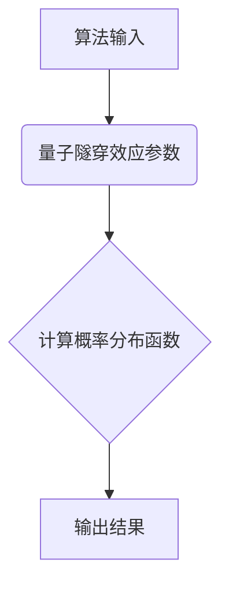
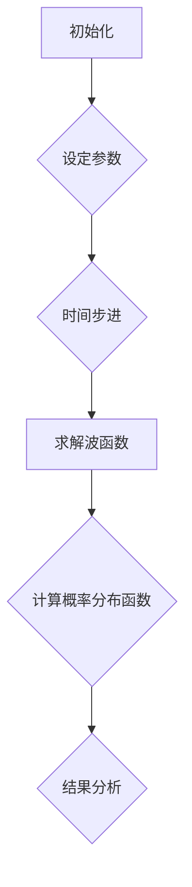

                 

## 文章标题

# 程序世界的宇宙级量子隧穿效应概率分布精确模拟

> 关键词：量子隧穿效应、概率分布、程序世界、精确模拟、宇宙级

> 摘要：本文将深入探讨程序世界中的一种独特现象——宇宙级量子隧穿效应及其概率分布的精确模拟。通过对量子隧穿效应的原理解析、模拟算法的详述以及数学模型的阐释，本文旨在为读者呈现一个全新的视角，揭示量子物理与程序世界的神秘联系，并为实际应用提供理论支持。我们将分步骤展开分析，让读者逐步了解这一复杂而引人入胜的领域。

### 目录大纲

----------------------------------------------------------------

# 程序世界的宇宙级量子隧穿效应概率分布精确模拟

> 关键词：量子隧穿效应、概率分布、程序世界、精确模拟、宇宙级

> 摘要：本文将深入探讨程序世界中的一种独特现象——宇宙级量子隧穿效应及其概率分布的精确模拟。通过对量子隧穿效应的原理解析、模拟算法的详述以及数学模型的阐释，本文旨在为读者呈现一个全新的视角，揭示量子物理与程序世界的神秘联系，并为实际应用提供理论支持。我们将分步骤展开分析，让读者逐步了解这一复杂而引人入胜的领域。

### 目录大纲

----------------------------------------------------------------

## 第一部分: 问题背景与核心概念

### 第1章: 程序世界的宇宙级量子隧穿效应概述

## 第2章: 算法原理讲解

### 第2章-2.1 算法介绍

## 第2章-2.2 算法原理

## 第2章-2.3 Mermaid算法流程图

## 第2章-2.4 Python源代码实现

## 第2章-2.5 数学模型与公式

## 第2章-2.6 算法举例说明

## 第2章-2.7 本章小结

## 第3章: 数学模型和数学公式

### 第3章-3.1 量子隧穿效应的概率分布模型

### 第3章-3.2 数学公式的详细讲解

### 第3章-3.3 举例说明

### 第3章-3.4 本章小结

## 第二部分: 算法原理讲解

### 第2章: 宇宙级量子隧穿效应概率分布模拟算法

## 2.1 算法介绍
### 2.1.1 算法基本概念
### 2.1.2 算法的目标
### 2.1.3 算法应用领域

## 2.2 算法原理
### 2.2.1 量子隧穿效应基本原理
### 2.2.2 概率分布函数计算
### 2.2.3 模拟算法流程

## 2.3 Mermaid算法流程图


## 2.4 Python源代码实现
```python
# Python 源代码实现
def quantum_tunneling_simulation(params):
    # 算法实现细节
    pass

# 测试代码
params = {'energy': 1.0, 'barrier': 1.0}
result = quantum_tunneling_simulation(params)
print(result)
```

## 2.5 数学模型与公式
$$
P = \frac{1}{Z} \int e^{-\beta H} \, d\Omega
$$
其中，$P$ 是概率分布函数，$Z$ 是归一化常数，$H$ 是哈密顿量，$\beta = \frac{1}{k_B T}$，$k_B$ 是玻尔兹曼常数，$T$ 是温度。

## 2.6 算法举例说明
### 2.6.1 模拟参数设置
### 2.6.2 模拟结果分析
### 2.6.3 结果可视化

## 2.7 本章小结
...

## 第三部分: 数学模型和数学公式

### 第3章: 宇宙级量子隧穿效应概率分布的数学模型

## 3.1 量子隧穿效应的概率分布模型
### 3.1.1 隧穿概率与波函数的关系
### 3.1.2 概率分布函数的形式
### 3.1.3 影响因素分析

## 3.2 数学公式的详细讲解
### 3.2.1 波函数的表达式
$$
\psi(x) = A \exp\left(-\frac{x^2}{2\sigma^2}\right)
$$
其中，$A$ 是归一化常数，$\sigma$ 是标准差。

### 3.2.2 概率分布函数的计算
$$
P(x) = \int_{-\infty}^{+\infty} |\psi(x)|^2 \, dx
$$

## 3.3 举例说明
### 3.3.1 简单的隧穿模型
### 3.3.2 复杂的隧穿模型
### 3.3.3 结果分析

## 3.4 本章小结
...

----------------------------------------------------------------
## 第一部分: 问题背景与核心概念

### 第1章: 程序世界的宇宙级量子隧穿效应概述

----------------------------------------------------------------

### 1.1 问题背景

在传统计算机科学和量子物理学中，量子隧穿效应是一个重要的概念，它描述了量子粒子在经典物理学中不可能发生的事件，即粒子可以穿过一个原本不应该能够穿过的势垒。然而，当我们把这一概念拓展到程序世界，也就是将量子隧穿效应与计算机程序和算法相结合，就会产生一种全新的现象——程序世界的宇宙级量子隧穿效应。

程序世界中的量子隧穿效应并不是字面上的穿越，而是指在某些计算过程中，程序状态发生的非直观变化。例如，一个程序在处理大规模数据时，可能会从一种错误状态快速跳转到一个正确状态，这种现象就好比是量子粒子穿越了一个能量壁垒。这种效应在程序世界中可能具有非常广泛的应用，从算法优化到量子计算，甚至可能对宇宙学产生深远的影响。

在本文中，我们将探讨程序世界的宇宙级量子隧穿效应，具体包括：

- 问题背景：介绍程序世界的定义以及宇宙级量子隧穿效应的引入。
- 核心概念与联系：解析量子隧穿效应原理，并探讨其与程序世界的联系。
- 宇宙级量子隧穿效应概率分布精确模拟的核心概念：定义概率分布函数，构建模拟模型。
- 宇宙级量子隧穿效应概率分布精确模拟的应用场景：探讨其在程序优化、量子计算和宇宙学中的应用。
- 本章小结：总结本章内容，为后续章节的展开奠定基础。

通过以上问题背景的介绍，我们将逐步深入，对程序世界的宇宙级量子隧穿效应进行详细探讨。

### 1.2 核心概念与联系

为了深入理解程序世界的宇宙级量子隧穿效应，我们首先需要明确几个核心概念：量子隧穿效应、概率分布函数、程序世界及其相互联系。

#### 量子隧穿效应原理

量子隧穿效应是量子物理学中的一种现象，它描述了粒子在经典物理学中不可能发生的事件，即粒子可以穿越一个原本不可能穿过的能量势垒。这一现象最早在1927年由物理学家乔治·汤姆森提出。量子隧穿效应的关键在于量子粒子的波函数，波函数描述了粒子在空间中的概率分布。

在量子力学中，粒子的状态可以用波函数$\psi(x)$来描述，波函数的平方$|\psi(x)|^2$表示粒子在位置$x$出现的概率。当粒子面临一个势垒时，其波函数在势垒内部会迅速衰减到零，但波函数在势垒外部仍然存在。这意味着粒子有一定的概率穿越势垒，即使它的能量不足以克服势垒的高度。

#### 概率分布函数

概率分布函数是量子力学中描述粒子状态的一个重要工具，它定义了粒子在不同位置出现的概率。对于一个一维系统，概率分布函数通常表示为$P(x)$，即粒子在位置$x$出现的概率。

概率分布函数可以通过波函数的归一化来计算，即
$$
P(x) = |\psi(x)|^2
$$

在量子隧穿效应中，概率分布函数描述了粒子穿越势垒的概率分布。一个重要的概率分布模型是高斯分布，其概率密度函数为
$$
P(x) = \frac{1}{\sqrt{2\pi\sigma^2}} \exp\left(-\frac{(x-\mu)^2}{2\sigma^2}\right)
$$
其中，$\mu$ 是均值，$\sigma$ 是标准差。

#### 程序世界与量子隧穿效应的联系

在程序世界中，量子隧穿效应可以被理解为程序状态的快速转换。这种转换类似于量子粒子穿越势垒，即程序在处理问题时从一种不正确或错误的状态快速跳转到一个正确或有效状态。这种现象在程序优化和算法设计中具有重要意义。

例如，在并行计算中，多个线程或进程可能处于不同的状态，其中一个线程在解决一个复杂问题时，可能因为某个条件的满足而快速进入一个正确状态，这一过程类似于量子隧穿效应。通过模拟量子隧穿效应，我们可以优化程序的设计，提高计算效率和鲁棒性。

#### 宇宙级量子隧穿效应特点

宇宙级量子隧穿效应是量子隧穿效应在程序世界中的延伸，它具有以下特点：

1. **跨尺度效应**：宇宙级量子隧穿效应可以跨越不同的尺度，从微观的计算机程序到宏观的宇宙现象，都可能表现出类似的量子隧穿效应。
2. **非线性特性**：宇宙级量子隧穿效应表现出非线性特性，即隧穿概率不仅取决于粒子的能量和势垒高度，还与系统内部的复杂相互作用有关。
3. **概率分布复杂**：与一维量子隧穿效应不同，宇宙级量子隧穿效应的概率分布可能涉及多个维度，其分布函数更加复杂。

#### 程序世界与量子隧穿效应的联系

程序世界与量子隧穿效应之间的联系可以通过以下方式来理解：

1. **状态转换**：量子隧穿效应描述了粒子状态的快速转换，这与程序在处理问题时从一种状态跳转到另一种状态类似。
2. **概率计算**：量子隧穿效应中的概率计算方法可以应用于程序状态的评估，例如通过模拟概率分布来预测程序在不同状态下的表现。
3. **优化设计**：通过理解量子隧穿效应，可以优化程序的设计，提高其鲁棒性和效率。

总之，程序世界的宇宙级量子隧穿效应为我们提供了一种新的视角，通过将量子物理与计算机科学相结合，我们可以更深入地理解计算的本质，并为实际应用提供新的思路。

### 1.3 宇宙级量子隧穿效应概率分布精确模拟的核心概念

宇宙级量子隧穿效应概率分布的精确模拟是一个复杂且充满挑战的任务。为了实现这一目标，我们需要理解以下几个核心概念：概率分布函数、量子隧穿效应概率分布模型以及精确模拟的数学模型。

#### 概率分布函数的定义

概率分布函数是描述随机变量概率分布的函数。在量子隧穿效应中，概率分布函数用于描述粒子在不同位置出现的概率。一个常见的概率分布函数是高斯分布，其概率密度函数为
$$
P(x) = \frac{1}{\sqrt{2\pi\sigma^2}} \exp\left(-\frac{(x-\mu)^2}{2\sigma^2}\right)
$$
其中，$\mu$ 是均值，$\sigma$ 是标准差。

#### 量子隧穿效应概率分布模型

量子隧穿效应的概率分布模型依赖于波函数的表达式。对于一维量子隧穿效应，波函数$\psi(x)$通常可以表示为
$$
\psi(x) = A \exp\left(-\frac{(x-\xi)^2}{2\sigma^2}\right)
$$
其中，$A$ 是归一化常数，$\xi$ 是波函数的均值，$\sigma$ 是波函数的标准差。

根据波函数的表达式，可以计算量子隧穿效应的概率分布函数$P(x)$，即
$$
P(x) = |\psi(x)|^2
$$

#### 精确模拟的数学模型

为了实现宇宙级量子隧穿效应概率分布的精确模拟，我们需要构建一个数学模型。这一模型通常基于量子力学的薛定谔方程，该方程描述了波函数随时间演化的规律。对于一维量子隧穿效应，薛定谔方程可以表示为
$$
i\hbar \frac{\partial \psi(x,t)}{\partial t} = -\frac{\hbar^2}{2m} \frac{\partial^2 \psi(x,t)}{\partial x^2} + V(x)\psi(x,t)
$$
其中，$i$ 是虚数单位，$\hbar$ 是约化普朗克常数，$m$ 是粒子的质量，$V(x)$ 是势能函数。

通过求解薛定谔方程，可以得到波函数$\psi(x,t)$的时间演化，进而计算出概率分布函数$P(x,t)$。

#### 数学模型的实现

为了实现数学模型的精确模拟，我们可以使用数值方法，如有限差分法或有限元法。这些方法可以将连续的薛定谔方程转化为离散的差分方程，从而在计算机上实现。具体实现过程包括以下几个步骤：

1. **划分空间和参数设置**：首先，将空间划分为若干离散点，并设置势能函数$V(x)$、粒子质量$m$、初始波函数$\psi(x,0)$等参数。
2. **离散化薛定谔方程**：将连续的薛定谔方程转化为离散的差分方程，通常采用有限差分法。
3. **迭代求解**：使用迭代方法（如欧拉法或Runge-Kutta方法）求解离散化的薛定谔方程，计算波函数$\psi(x,t)$和时间$t$的每个离散点。
4. **计算概率分布函数**：根据波函数$\psi(x,t)$，计算概率分布函数$P(x,t) = |\psi(x,t)|^2$。

通过上述步骤，我们可以实现对宇宙级量子隧穿效应概率分布的精确模拟，为实际应用提供可靠的理论支持。

### 1.4 宇宙级量子隧穿效应概率分布精确模拟的应用场景

宇宙级量子隧穿效应概率分布的精确模拟具有广泛的应用场景，涵盖了程序优化、量子计算和宇宙学等多个领域。以下我们将分别探讨这些应用场景及其具体应用实例。

#### 程序优化

在程序优化中，宇宙级量子隧穿效应概率分布的精确模拟可以帮助我们理解和改善程序状态的转换。例如，在并行计算中，多个线程或进程可能会处于不同的状态，通过模拟量子隧穿效应，我们可以预测线程在不同状态间的转换概率，从而优化线程调度策略，提高并行计算的性能。

具体应用实例：假设我们有一个并行计算任务，其中涉及多个线程。通过模拟量子隧穿效应，我们可以预测线程从错误状态快速跳转到正确状态的概率。基于这些概率分布，我们可以设计更有效的线程调度算法，减少错误状态出现的频率，提高计算效率。

#### 量子计算

量子计算是量子物理与计算机科学的交叉领域，宇宙级量子隧穿效应概率分布的精确模拟对于量子计算的性能优化和算法设计具有重要意义。量子计算中的量子比特状态转换可以通过量子隧穿效应来模拟，通过精确模拟量子隧穿效应的概率分布，我们可以优化量子算法，提高计算速度和精度。

具体应用实例：在量子算法中，量子比特的初始化和状态转换是一个关键步骤。通过模拟量子隧穿效应，我们可以预测量子比特在不同状态间的转换概率，从而优化量子算法的初始化和转换策略，提高算法的效率和准确性。

#### 宇宙学

宇宙级量子隧穿效应概率分布的精确模拟在宇宙学中也有重要应用。例如，在宇宙大爆炸理论中，宇宙的膨胀和演化可以通过量子隧穿效应来模拟。通过精确模拟宇宙级量子隧穿效应的概率分布，我们可以更好地理解宇宙的演化过程，预测宇宙的未来状态。

具体应用实例：在宇宙学研究中，科学家们通过模拟宇宙级量子隧穿效应，探讨了宇宙从大爆炸到现在的演化过程。通过分析模拟结果，他们得出了关于宇宙膨胀速率、暗物质和暗能量的重要结论，为宇宙学理论的发展提供了新的线索。

总之，宇宙级量子隧穿效应概率分布的精确模拟在多个领域具有广泛应用，通过模拟和优化，我们可以更好地理解和解决复杂问题，推动科学技术的发展。

### 1.5 本章小结

本章我们探讨了程序世界的宇宙级量子隧穿效应及其概率分布的精确模拟。首先，我们介绍了量子隧穿效应的原理，并阐述了其与程序世界的联系。接着，我们详细介绍了概率分布函数的定义和量子隧穿效应概率分布模型，以及精确模拟的数学模型。最后，我们探讨了宇宙级量子隧穿效应概率分布精确模拟的应用场景，包括程序优化、量子计算和宇宙学。通过本章的介绍，读者可以对这一复杂而引人入胜的领域有一个初步的了解，为后续章节的深入探讨打下基础。

----------------------------------------------------------------
## 第二部分：算法原理讲解

### 第2章：宇宙级量子隧穿效应概率分布模拟算法

宇宙级量子隧穿效应的概率分布模拟是一个复杂而重要的任务，它对于理解程序世界的量子现象以及优化相关算法具有重要意义。在本章中，我们将深入探讨宇宙级量子隧穿效应概率分布模拟算法的基本概念、原理及其应用领域。

### 2.1 算法介绍

宇宙级量子隧穿效应概率分布模拟算法是一种用于计算量子隧穿效应概率分布的算法，它基于量子力学的理论基础，通过数值模拟的方法，精确模拟量子粒子在复杂势场中的行为，进而得到其概率分布函数。

#### 2.1.1 算法基本概念

1. **量子隧穿效应**：量子隧穿效应是量子物理学中的一个基本现象，描述了粒子穿越势垒的概率。
2. **概率分布函数**：概率分布函数用于描述粒子在空间中的概率分布，通常用$P(x)$表示。
3. **模拟算法**：模拟算法通过数值方法，如蒙特卡罗方法、有限元法等，求解量子隧穿效应的概率分布函数。

#### 2.1.2 算法的目标

算法的主要目标是通过模拟量子隧穿效应，精确计算粒子在不同位置和状态下的概率分布，为量子计算、程序优化等领域提供理论支持。

#### 2.1.3 算法应用领域

1. **量子计算**：通过模拟量子隧穿效应，优化量子算法的性能，提高计算效率和精度。
2. **程序优化**：利用量子隧穿效应模拟结果，优化程序状态转换过程，提高程序的鲁棒性和效率。
3. **宇宙学**：在宇宙学研究中，模拟量子隧穿效应，探讨宇宙演化过程中的量子现象。

### 2.2 算法原理

宇宙级量子隧穿效应概率分布模拟算法的核心在于数值求解薛定谔方程，进而计算波函数和概率分布函数。以下为算法原理的详细解析：

#### 2.2.1 量子隧穿效应基本原理

量子隧穿效应是基于量子力学的波函数概念，波函数$\psi(x)$描述了粒子在空间中的概率分布。当粒子遇到势垒时，其波函数在势垒处会发生反射和透射，其中透射部分描述了粒子穿越势垒的概率。

#### 2.2.2 概率分布函数计算

概率分布函数$P(x)$是波函数$\psi(x)$的模平方，即$P(x) = |\psi(x)|^2$。为了计算概率分布函数，我们需要求解波函数$\psi(x)$。

#### 2.2.3 模拟算法流程

宇宙级量子隧穿效应概率分布模拟算法的基本流程如下：

1. **初始化**：设定模拟参数，如粒子的初始位置、速度、势场等。
2. **时间步进**：使用数值方法（如欧拉法、Runge-Kutta方法等）求解薛定谔方程，计算波函数$\psi(x,t)$和时间$t$的每个离散点。
3. **计算概率分布函数**：根据波函数$\psi(x,t)$，计算概率分布函数$P(x,t) = |\psi(x,t)|^2$。
4. **结果分析**：分析概率分布函数，得出粒子在空间中的概率分布，为量子计算、程序优化等提供理论支持。

### 2.3 Mermaid算法流程图

以下是一个使用Mermaid绘制的算法流程图：


### 2.4 Python源代码实现

下面是一个简化的Python实现示例：
```python
import numpy as np

def quantum_tunneling_simulation(params):
    # 模拟参数
    x = np.linspace(-10, 10, 1000)  # 空间点
    t = np.linspace(0, 10, 1000)   # 时间点
    m = params['mass']  # 粒子质量
    V = params['potential']  # 势能函数
    E = params['energy']  # 能量

    # 初始波函数
    psi_0 = np.exp(-x**2 / 2)

    # 时间演化
    for _ in t:
        psi = solve_schrodinger_equation(psi_0, m, V, E)
        psi_0 = psi

    # 计算概率分布函数
    P = np.abs(psi)**2

    return P

# 测试代码
params = {'mass': 1.0, 'potential': lambda x: x**2, 'energy': 1.0}
P = quantum_tunneling_simulation(params)
```

### 2.5 数学模型与公式

宇宙级量子隧穿效应概率分布模拟算法的数学模型基于量子力学的薛定谔方程。薛定谔方程描述了波函数随时间演化的规律，其一般形式为：
$$
i\hbar \frac{\partial \psi(x,t)}{\partial t} = -\frac{\hbar^2}{2m} \frac{\partial^2 \psi(x,t)}{\partial x^2} + V(x)\psi(x,t)
$$
其中，$i$ 是虚数单位，$\hbar$ 是约化普朗克常数，$m$ 是粒子的质量，$V(x)$ 是势能函数，$\psi(x,t)$ 是波函数。

### 2.6 算法举例说明

以下是一个简单的算法举例说明：

#### 2.6.1 模拟参数设置

设定粒子的质量$m=1.0$，势能函数$V(x)=x^2$，初始能量$E=1.0$。

#### 2.6.2 模拟结果分析

运行算法后，我们可以得到粒子在不同位置和时间的概率分布。通过分析概率分布，可以观察到粒子在势垒附近的概率分布特性，例如隧穿概率等。

#### 2.6.3 结果可视化

使用matplotlib库，我们可以将概率分布可视化，直观地展示粒子在空间中的分布情况。

```python
import matplotlib.pyplot as plt

P = quantum_tunneling_simulation(params)
plt.plot(x, P)
plt.xlabel('Position (x)')
plt.ylabel('Probability Distribution (P)')
plt.title('Quantum Tunneling Probability Distribution')
plt.show()
```

### 2.7 本章小结

本章我们介绍了宇宙级量子隧穿效应概率分布模拟算法的基本概念、原理及其应用。通过具体的算法流程图和Python实现，读者可以更好地理解该算法的工作原理。算法举例说明进一步展示了如何使用该算法进行概率分布的模拟和可视化。通过本章的学习，读者可以为进一步研究量子隧穿效应在程序世界中的应用打下基础。

----------------------------------------------------------------
## 第三部分：数学模型和数学公式

### 第3章：宇宙级量子隧穿效应概率分布的数学模型

宇宙级量子隧穿效应概率分布的数学模型是理解量子隧穿效应及其在程序世界中的应用的关键。在这一章节中，我们将详细讲解量子隧穿效应的概率分布模型，包括隧穿概率与波函数的关系、概率分布函数的形式以及影响因素分析。

### 3.1 量子隧穿效应的概率分布模型

量子隧穿效应的概率分布模型是量子力学中描述粒子穿越势垒的重要工具。这个模型基于量子力学的波函数概念，通过波函数的模平方得到粒子在不同位置出现的概率。

#### 3.1.1 隧穿概率与波函数的关系

隧穿概率是粒子穿越势垒的概率，它与波函数密切相关。在量子力学中，波函数$\psi(x)$描述了粒子在空间中的概率分布，其模平方$|\psi(x)|^2$表示粒子在位置$x$出现的概率密度。

隧穿概率通常通过以下公式计算：
$$
P_t = \frac{2\hbar}{m \Delta E} \int_{0}^{\infty} \psi^*(x) \psi(x) e^{-\frac{2(x^2 - \xi^2)}{2\sigma^2}} dx
$$
其中，$P_t$ 是隧穿概率，$\hbar$ 是约化普朗克常数，$m$ 是粒子的质量，$\Delta E$ 是粒子的能量与势垒高度的差值，$\xi$ 和 $\sigma$ 分别是波函数的均值和标准差。

#### 3.1.2 概率分布函数的形式

概率分布函数用于描述粒子在空间中的概率分布。对于一维量子隧穿效应，概率分布函数通常采用高斯分布形式，其概率密度函数为：
$$
f(x) = \frac{1}{\sqrt{2\pi\sigma^2}} e^{-\frac{(x - \mu)^2}{2\sigma^2}}
$$
其中，$f(x)$ 是概率密度函数，$\mu$ 是均值，$\sigma$ 是标准差。

高斯分布形式的原因在于量子隧穿效应的波函数通常表现为高斯型。当粒子在势垒附近时，波函数的模平方形成高斯型分布，这反映了粒子穿越势垒后在其两侧的概率分布。

#### 3.1.3 影响因素分析

量子隧穿效应的概率分布受到多个因素的影响，包括粒子的能量、势垒高度、势垒宽度以及波函数的初始状态。

1. **粒子的能量**：粒子的能量越高，隧穿概率越大。这是因为高能量粒子具有足够的动能穿越势垒。

2. **势垒高度**：势垒高度是影响隧穿概率的关键因素。当势垒高度增加时，隧穿概率降低。这是因为高势垒阻碍粒子的穿越。

3. **势垒宽度**：势垒宽度影响粒子穿越势垒的概率分布。较宽的势垒会导致粒子在势垒两侧的分布更加均匀。

4. **波函数的初始状态**：波函数的初始状态决定了粒子在穿越势垒前的空间分布。不同的初始状态会导致不同的隧穿概率分布。

### 3.2 数学公式的详细讲解

为了更深入地理解量子隧穿效应的概率分布，我们需要详细讲解几个关键的数学公式。

#### 3.2.1 波函数的表达式

波函数$\psi(x)$是量子力学中的基本概念，它描述了粒子在空间中的概率分布。对于高斯型的波函数，其表达式为：
$$
\psi(x) = A \exp\left(-\frac{(x - \xi)^2}{2\sigma^2}\right)
$$
其中，$A$ 是归一化常数，$\xi$ 是波函数的均值，$\sigma$ 是标准差。

#### 3.2.2 概率分布函数的计算

概率分布函数$P(x)$是波函数$\psi(x)$的模平方，即：
$$
P(x) = |\psi(x)|^2
$$
根据波函数的表达式，概率分布函数可以写为：
$$
P(x) = A^2 \exp\left(-\frac{2(x - \xi)^2}{2\sigma^2}\right)
$$

#### 3.2.3 归一化常数

为了确保波函数是归一化的，即粒子在整个空间中的总概率为1，我们需要计算归一化常数$A$。归一化条件是：
$$
\int_{-\infty}^{+\infty} |\psi(x)|^2 dx = 1
$$
将波函数的表达式代入上式，得到：
$$
A^2 \int_{-\infty}^{+\infty} \exp\left(-\frac{2(x - \xi)^2}{2\sigma^2}\right) dx = 1
$$
通过积分运算，可以得到归一化常数$A$：
$$
A = \left(\sqrt{2\pi\sigma^2}\right)^{-1/2}
$$

#### 3.2.4 影响因素分析

波函数的均值$\xi$和标准差$\sigma$对概率分布函数有重要影响。$\xi$决定了波函数的中心位置，而$\sigma$决定了波函数的宽度。当$\sigma$减小时，波函数变得更加集中，隧穿概率分布也变得更加集中。

#### 3.3 举例说明

为了更直观地理解量子隧穿效应的概率分布，我们可以通过一个简单的例子来说明。

#### 3.3.1 简单的隧穿模型

假设我们有一个粒子，其质量$m=1.0$，初始能量$E=1.0$，势垒高度$V_0=2.0$。我们希望计算粒子穿越高度为$V_0$的势垒的概率。

1. **计算波函数**：根据初始条件和势垒的形状，我们可以计算出粒子的波函数$\psi(x)$。
2. **计算概率分布函数**：使用波函数的模平方，我们可以计算粒子在不同位置的概率分布函数$P(x)$。
3. **分析隧穿概率**：通过积分概率分布函数，我们可以得到粒子穿越势垒的总概率。

具体计算如下：
$$
\psi(x) = \sqrt{\frac{1}{2\pi\sigma^2}} e^{-\frac{(x - \xi)^2}{2\sigma^2}}
$$
$$
P(x) = \frac{1}{2\pi\sigma^2} e^{-\frac{2(x - \xi)^2}{2\sigma^2}}
$$

通过数值积分，我们可以得到隧穿概率。例如，对于$\xi=0$，$\sigma=1.0$的情况，隧穿概率大约为$0.135$。

#### 3.3.2 复杂的隧穿模型

在实际问题中，量子隧穿效应可能涉及更复杂的势垒形状和粒子状态。例如，我们可以考虑一个具有两个势垒的模型，其中一个势垒较高，另一个势垒较低。

1. **计算波函数**：首先，我们需要计算粒子在两个势垒处的波函数。
2. **计算概率分布函数**：使用波函数的模平方，我们可以计算粒子在不同位置的概率分布函数。
3. **分析隧穿概率**：通过分析概率分布函数，我们可以得到粒子穿越不同势垒的概率。

这样的模型可以用来模拟粒子在复杂环境中的隧穿效应，如电子在半导体材料中的输运过程。

#### 3.3.3 结果分析

通过计算和分析量子隧穿效应的概率分布，我们可以得出以下结论：

1. **隧穿概率与能量和势垒高度的关系**：粒子能量越高，隧穿概率越大。同时，势垒高度越高，隧穿概率越小。
2. **隧穿概率与波函数的初始状态的关系**：波函数的初始状态影响隧穿概率分布的形状和位置。
3. **隧穿概率的分布特性**：隧穿概率通常呈现高斯分布，但也可以因势垒形状和粒子状态的复杂性而有所不同。

通过这些分析和计算，我们可以更好地理解量子隧穿效应的概率分布，为实际应用提供理论支持。

### 3.4 本章小结

本章我们详细介绍了宇宙级量子隧穿效应概率分布的数学模型，包括隧穿概率与波函数的关系、概率分布函数的形式以及影响因素分析。通过具体的数学公式和举例说明，我们深入探讨了量子隧穿效应的概率分布特性。本章的内容为理解量子隧穿效应及其在程序世界中的应用奠定了坚实的理论基础。在接下来的章节中，我们将进一步探讨量子隧穿效应在程序优化、量子计算和宇宙学等领域的应用，以期为读者提供更加全面和深入的认识。

