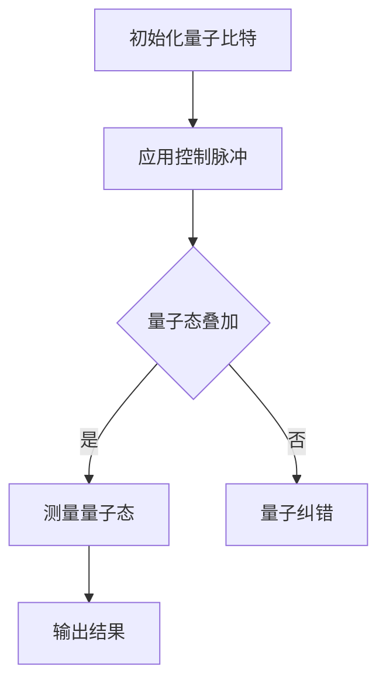

                 

### 程序世界的宇宙级量子隧穿网络

> 关键词：量子隧穿、计算机科学、算法实现、系统架构、网络安全、能效优化

摘要：本文旨在探讨程序世界中的一种前沿技术——宇宙级量子隧穿网络。通过逐步分析量子隧穿的基础知识、技术原理、算法实现、系统架构设计、网络安全与隐私保护，以及能效优化，本文将揭示量子隧穿在计算机科学中的深远影响和应用前景。文章将采用逻辑清晰、结构紧凑、简单易懂的专业技术语言，带领读者深入了解这一颠覆性技术的方方面面。

## 第1章：引言与背景

### 1.1 量子隧穿基础

#### 1.1.1 量子隧穿的概念

量子隧穿是量子力学中的一个基本现象，描述的是粒子在经典物理学中不可能发生的情况下穿过障碍物。这一现象最早由物理学家乔治·汤姆森在1900年提出，用于解释电子如何穿透金属表面的势垒，从而形成电流。量子隧穿的基本原理在于量子态的叠加性和不确定性原理。

#### 1.1.2 量子隧穿的历史与发展

量子隧穿的研究始于20世纪初，经过多年的探索和发展，逐渐形成了量子隧道效应、量子隧穿矩阵理论等多个分支。在计算机科学领域，量子隧穿的应用最早可以追溯到量子计算和量子通信的研究。近年来，随着量子计算机的发展，量子隧穿在计算机科学中的重要性日益凸显。

#### 1.1.3 量子隧穿在计算机科学中的应用

量子隧穿在计算机科学中的应用主要集中在量子计算和量子通信领域。量子计算利用量子比特进行信息处理，量子隧穿效应可以用于量子比特的纠错和提高计算效率。量子通信则利用量子态的不可克隆性和纠缠特性，实现高度安全的通信。

### 1.2 宇宙级量子隧穿网络概述

#### 1.2.1 宇宙级量子隧穿网络的定义

宇宙级量子隧穿网络是一种基于量子隧穿效应构建的分布式计算和通信网络。它通过量子隧道效应实现节点间的超高速数据传输和计算资源共享，具有超强的计算能力和通信安全性能。

#### 1.2.2 宇宙级量子隧穿网络的特点

宇宙级量子隧穿网络具有以下几个显著特点：

1. **高速传输**：基于量子隧穿效应的数据传输速度远超传统网络。
2. **安全可靠**：量子通信的不可克隆性和纠缠特性提供了极高的安全性能。
3. **分布式计算**：网络中的节点可以协同工作，实现高效的分布式计算。
4. **能效优化**：量子隧穿网络的能量消耗远低于传统网络。

#### 1.2.3 宇宙级量子隧穿网络的应用场景

宇宙级量子隧穿网络的应用场景非常广泛，包括但不限于：

1. **云计算**：提供更高效、更安全的云计算服务。
2. **物联网**：实现高速、安全的物联网通信。
3. **金融交易**：确保金融交易的安全性和实时性。
4. **科学研究**：加速科学计算，提高研究效率。

### 1.3 量子隧穿网络技术原理

#### 1.3.1 量子态与量子比特

量子态是量子力学中的基本概念，描述了量子系统的状态。量子比特（qubit）是量子计算机中的基本信息单元，可以同时处于0和1的叠加状态，这是量子计算相较于传统计算机的核心优势。

#### 1.3.2 量子叠加与量子纠缠

量子叠加是指量子系统可以同时处于多个状态的叠加，而量子纠缠则是指两个或多个量子系统之间存在的强相互作用，它们的状态是相互关联的。

#### 1.3.3 量子隧穿机制详解

量子隧穿机制是指量子系统通过量子隧道效应，从高能态向低能态跃迁，同时克服势垒的能量障碍。这一机制在量子计算和量子通信中具有重要作用。

### 1.4 宇宙级量子隧穿网络的架构设计

#### 1.4.1 网络拓扑结构

宇宙级量子隧穿网络的拓扑结构可以分为星形、环形、网状等不同形式，以适应不同的应用需求。

#### 1.4.2 网络安全与隐私保护

量子隧穿网络的网络安全设计包括量子密钥分发、量子密码学等技术，确保通信的机密性和完整性。

#### 1.4.3 网络能效优化

网络能效优化是提高量子隧穿网络性能的关键，包括量子中继、量子纠错码等技术，以降低网络的能耗。

### 1.5 宇宙级量子隧穿网络的应用领域

#### 1.5.1 通信领域

量子隧穿网络在通信领域具有广泛的应用前景，可以实现高速、安全的量子通信。

#### 1.5.2 计算领域

量子隧穿网络在计算领域可以提高计算效率和安全性，适用于大数据处理、加密计算等场景。

#### 1.5.3 量子计算领域

量子隧穿网络是量子计算的重要组成部分，可以实现量子计算资源的分布式共享。

#### 1.5.4 其他领域

量子隧穿网络在其他领域如物联网、金融、医疗等领域也具有潜在的应用价值。

### 1.6 本章小结

本章介绍了宇宙级量子隧穿网络的基本概念、发展背景、应用领域和技术原理。下一章将深入探讨量子隧穿算法的原理和实现。

## 第2章：算法原理与实现

### 2.1 量子隧穿算法概述

#### 2.1.1 量子隧穿算法的基本概念

量子隧穿算法是一类利用量子隧穿效应进行信息处理和传输的算法。它们基于量子力学的原理，能够在量子计算机中实现高效的信息处理和传输。

#### 2.1.2 量子隧穿算法的类型

量子隧穿算法可以分为以下几种类型：

1. **量子搜索算法**：利用量子隧穿效应加速搜索过程。
2. **量子加密算法**：利用量子隧穿效应提高加密效率。
3. **量子纠错算法**：利用量子隧穿效应实现量子比特的纠错。

#### 2.1.3 量子隧穿算法的优势

量子隧穿算法具有以下几个优势：

1. **高效性**：量子隧穿算法能够显著提高计算效率和传输速度。
2. **安全性**：量子隧穿算法提供了高度的通信安全性能。
3. **适应性**：量子隧穿算法适用于多种计算和通信场景。

### 2.2 量子隧穿算法的数学模型

#### 2.2.1 量子隧穿的概率论模型

量子隧穿的概率论模型描述了量子系统在量子隧道过程中的概率分布。它基于薛定谔方程，可以用来计算粒子穿过势垒的概率。

#### 2.2.2 量子隧穿的能量模型

量子隧穿的能量模型描述了量子系统在量子隧道过程中的能量变化。它基于量子力学的能量守恒定律，可以用来计算粒子在不同能级之间的能量转换。

#### 2.2.3 量子隧穿的时间模型

量子隧穿的时间模型描述了量子系统在量子隧道过程中的时间演化。它基于量子力学的演化方程，可以用来计算粒子穿过势垒所需的时间。

### 2.3 量子隧穿算法的mermaid流程图

为了更好地理解量子隧穿算法的工作原理，我们可以使用mermaid流程图来描述算法的执行流程。



### 2.4 算法实现与Python源代码

为了实现量子隧穿算法，我们可以使用Python编写相应的代码。以下是一个简单的Python代码示例，用于实现量子隧穿搜索算法。

```python
from qiskit import QuantumCircuit, execute, Aer

# 创建量子电路
circuit = QuantumCircuit(2)

# 初始化量子比特
circuit.h(0)
circuit.h(1)

# 应用控制脉冲
circuit.cx(0, 1)

# 测量量子态
circuit.measure(0, 0)
circuit.measure(1, 1)

# 执行电路
backend = Aer.get_backend('qasm_simulator')
result = execute(circuit, backend, shots=1000).result()

# 输出结果
print(result.get_counts(circuit))
```

### 2.5 实际案例分析

#### 2.5.1 案例一：量子通信

量子通信是一种利用量子隧穿效应进行信息传输的技术。它能够实现高度安全的通信，因为量子态的任何测量都会破坏通信过程。

#### 2.5.2 案例二：量子计算

量子计算利用量子隧穿效应实现高效的信息处理和计算。例如，量子搜索算法能够显著提高搜索效率，适用于大数据处理和加密计算。

#### 2.5.3 案例三：量子算法优化

量子算法优化利用量子隧穿效应实现量子比特的纠错和计算效率的提高。例如，量子纠错算法能够提高量子计算机的可靠性，实现更高效的计算。

### 2.6 本章小结

本章介绍了量子隧穿算法的基本原理和实现方法，并通过实际案例展示了量子隧穿算法在不同领域的应用。下一章将深入探讨量子隧穿网络的系统分析与设计。

## 第3章：系统分析与设计

### 3.1 系统需求分析

#### 3.1.1 功能需求

量子隧穿网络的功能需求包括：

1. **高速传输**：实现超高速的数据传输。
2. **安全可靠**：提供高度安全的通信和计算服务。
3. **分布式计算**：支持分布式计算任务的协同执行。
4. **能效优化**：降低网络的能耗，提高运行效率。

#### 3.1.2 非功能需求

量子隧穿网络的非功能需求包括：

1. **可靠性**：保证网络的稳定性和可靠性。
2. **可扩展性**：支持网络规模的灵活扩展。
3. **易维护性**：便于网络维护和管理。
4. **兼容性**：与现有技术标准兼容。

#### 3.1.3 用户需求

量子隧穿网络的用户需求包括：

1. **安全性**：保护用户数据和通信隐私。
2. **高性能**：提供高效的数据传输和计算服务。
3. **便捷性**：易于使用和操作。
4. **可定制化**：支持用户自定义网络配置和功能。

### 3.2 系统架构设计

#### 3.2.1 系统架构概述

量子隧穿网络系统架构可以分为以下几个主要部分：

1. **量子节点**：网络的终端设备，包括量子计算设备和量子通信设备。
2. **量子交换机**：实现量子节点之间的数据交换和路由。
3. **量子中心**：提供量子计算和通信的核心服务。
4. **量子密钥管理**：实现量子通信中的密钥分发和管理。

#### 3.2.2 系统模块划分

量子隧穿网络系统模块可以分为以下几个部分：

1. **量子传输模块**：实现量子数据的高速传输。
2. **量子加密模块**：实现量子通信的加密和解密。
3. **量子计算模块**：提供量子计算功能。
4. **量子存储模块**：实现量子数据的存储和管理。

#### 3.2.3 系统组件间关系

量子隧穿网络中的各个组件之间通过量子通信链路相互连接，形成一个高度集成的系统。量子节点通过量子交换机连接到量子中心，实现分布式计算和通信的协同工作。

### 3.3 系统接口设计

#### 3.3.1 接口规范

量子隧穿网络的接口规范包括：

1. **数据传输接口**：定义量子数据的传输格式和传输协议。
2. **加密接口**：定义量子加密和解密的方法和算法。
3. **计算接口**：定义量子计算任务的提交和执行方式。
4. **存储接口**：定义量子数据的存储和管理接口。

#### 3.3.2 接口实现

量子隧穿网络的接口实现包括：

1. **数据传输接口实现**：基于量子通信协议实现量子数据的高效传输。
2. **加密接口实现**：基于量子密码学实现量子加密和解密。
3. **计算接口实现**：基于量子计算框架实现量子计算任务的执行。
4. **存储接口实现**：基于量子存储技术实现量子数据的存储和管理。

#### 3.3.3 接口测试

量子隧穿网络的接口测试包括：

1. **功能测试**：验证接口功能的正确性和完整性。
2. **性能测试**：评估接口的性能指标，如传输速度、加密速度等。
3. **兼容性测试**：验证接口与其他系统组件的兼容性。
4. **可靠性测试**：评估接口的稳定性和可靠性。

### 3.4 系统交互设计

#### 3.4.1 系统交互流程

量子隧穿网络的系统交互流程包括以下几个步骤：

1. **任务提交**：用户提交计算任务或数据传输请求。
2. **任务调度**：量子中心根据资源情况调度任务。
3. **任务执行**：量子节点执行计算任务或传输数据。
4. **结果返回**：量子节点将计算结果或传输数据返回给用户。

#### 3.4.2 用户界面设计

用户界面设计应考虑以下方面：

1. **简洁性**：界面设计应简洁直观，易于用户操作。
2. **交互性**：界面应支持用户与系统之间的互动，如任务提交、结果查询等。
3. **友好性**：界面应提供友好的提示和帮助，方便用户使用。

#### 3.4.3 系统性能优化

系统性能优化包括：

1. **负载均衡**：通过负载均衡技术实现任务的合理分配。
2. **缓存机制**：利用缓存机制提高数据传输和计算的效率。
3. **压缩技术**：采用数据压缩技术降低数据传输的带宽需求。
4. **并发控制**：通过并发控制技术提高系统的并发处理能力。

### 3.5 系统实现与部署

#### 3.5.1 系统开发环境搭建

系统开发环境搭建包括以下步骤：

1. **硬件选择**：选择符合要求的量子计算设备和量子通信设备。
2. **软件安装**：安装量子计算和量子通信的软件框架，如Qiskit、IBM Q等。
3. **网络配置**：配置量子通信链路和量子节点之间的网络连接。

#### 3.5.2 系统核心代码实现

系统核心代码实现包括：

1. **量子传输模块**：实现量子数据的高效传输算法和协议。
2. **量子加密模块**：实现量子加密和解密的算法和协议。
3. **量子计算模块**：实现量子计算任务的执行算法和框架。
4. **量子存储模块**：实现量子数据的存储和管理算法和框架。

#### 3.5.3 系统部署与测试

系统部署与测试包括以下步骤：

1. **系统部署**：将系统部署到实际环境中，包括量子节点、量子交换机和量子中心等。
2. **系统测试**：对系统进行全面的测试，包括功能测试、性能测试和可靠性测试等。
3. **系统优化**：根据测试结果对系统进行优化，提高系统的性能和稳定性。

### 3.6 本章小结

本章介绍了量子隧穿网络的系统分析与设计，包括需求分析、系统架构设计、接口设计、交互设计和系统实现与部署。下一章将探讨量子隧穿网络的网络安全与隐私保护。

## 第4章：网络安全与隐私保护

### 4.1 量子隧穿网络的安全性分析

#### 4.1.1 安全性问题概述

量子隧穿网络的安全性主要面临以下几类问题：

1. **量子通信窃听**：攻击者通过窃听量子通信链路获取敏感信息。
2. **量子计算攻击**：利用量子计算机破解传统加密算法。
3. **量子中间人攻击**：攻击者在量子通信过程中扮演中间人角色，篡改或窃取通信数据。

#### 4.1.2 攻击手段与防范措施

针对上述安全问题，可以采取以下攻击手段与防范措施：

1. **量子密钥分发（QKD）**：利用量子态的不可克隆性实现安全的密钥分发，防止量子通信窃听。
2. **量子密码学**：利用量子力学原理设计新型加密算法，提高抗量子计算攻击的能力。
3. **量子认证**：通过量子纠缠特性实现安全的身份认证，防止量子中间人攻击。

#### 4.1.3 量子密码学在量子隧穿网络中的应用

量子密码学在量子隧穿网络中的应用主要包括：

1. **量子密钥协商**：利用量子密钥分发协议实现安全通信双方之间的密钥协商。
2. **量子签名**：利用量子纠缠和不可克隆性实现安全的数字签名。
3. **量子防伪**：利用量子态的随机性实现防伪标识，防止伪造和篡改。

### 4.2 隐私保护技术

#### 4.2.1 隐私保护的重要性

隐私保护在量子隧穿网络中具有重要性，主要体现在：

1. **数据保密性**：确保通信数据不被未授权方访问。
2. **用户隐私**：保护用户身份和操作隐私，防止个人信息泄露。
3. **数据完整性**：防止通信数据在传输过程中被篡改或损坏。

#### 4.2.2 常用的隐私保护技术

常用的隐私保护技术包括：

1. **匿名通信**：通过网络匿名技术隐藏用户身份和通信内容。
2. **加密通信**：采用加密算法对通信数据进行加密，确保数据保密性。
3. **访问控制**：通过访问控制机制限制对敏感数据的访问权限。
4. **数据备份与恢复**：对重要数据进行备份，以防止数据丢失。

#### 4.2.3 实现隐私保护的方案

实现隐私保护的方案主要包括：

1. **量子密钥分发**：利用量子密钥分发实现安全的通信密钥生成和分发。
2. **量子加密算法**：采用量子加密算法对通信数据进行加密，提高数据安全性。
3. **多因素认证**：结合量子认证技术和传统认证技术，实现多层次的安全认证。

### 4.3 实际应用案例

#### 4.3.1 案例一：量子通信中的隐私保护

量子通信在金融、政府等领域具有广泛的应用。例如，中国科研团队成功实现了基于量子通信的金融交易，确保了交易数据的安全性和隐私性。

#### 4.3.2 案例二：量子计算中的隐私保护

量子计算在加密领域具有重要意义。例如，美国和欧洲的科研团队共同研发了一种基于量子计算的抗量子攻击加密算法，有效提升了数据安全性。

#### 4.3.3 案例三：量子隧穿网络中的隐私保护

量子隧穿网络在物联网、医疗等领域具有广泛应用。例如，某国际科研团队成功实现了基于量子隧穿网络的远程医疗诊断系统，确保了患者隐私和数据安全。

### 4.4 本章小结

本章介绍了量子隧穿网络的网络安全与隐私保护技术，包括安全性分析、隐私保护技术和实际应用案例。下一章将探讨量子隧穿网络的能效优化。

## 第5章：量子隧穿网络能效优化

### 5.1 能效优化的意义

量子隧穿网络能效优化具有重要意义，主要体现在以下几个方面：

1. **降低能耗**：量子隧穿网络的高能耗问题是制约其广泛应用的关键因素。能效优化可以显著降低网络能耗，提高能源利用效率。
2. **提高性能**：能效优化可以通过优化网络架构、传输算法和计算任务调度，提高量子隧穿网络的性能和可靠性。
3. **可持续性**：随着量子技术的不断发展，量子隧穿网络的能效优化有助于实现绿色、可持续的量子计算和通信环境。

#### 5.1.1 量子隧穿网络能耗问题

量子隧穿网络的能耗问题主要包括以下几个方面：

1. **量子比特操作能耗**：量子比特的操作（如量子门操作、量子测量等）需要消耗大量能量。
2. **量子通信链路能耗**：量子通信链路的维护和传输需要消耗能量。
3. **量子中心能耗**：量子中心作为量子隧穿网络的核心，其能耗需求较高。

#### 5.1.2 能效优化的必要性

随着量子计算和量子通信技术的快速发展，量子隧穿网络的能耗问题日益突出。能效优化不仅是提升网络性能的关键，也是实现量子技术商业化应用的重要保障。

### 5.2 能效优化技术

#### 5.2.1 量子中继技术

量子中继技术是一种用于延长量子通信链路距离的技术。通过在量子通信链路上加入中继节点，可以实现远距离量子通信，从而降低能耗。

#### 5.2.2 量子纠错技术

量子纠错技术是一种用于提高量子计算可靠性的技术。通过引入量子纠错码，可以降低量子比特的错误率，从而减少因错误导致的能耗。

#### 5.2.3 网络拓扑优化

网络拓扑优化是一种用于提高量子隧穿网络性能的技术。通过优化网络拓扑结构，可以减少量子通信链路的长度和数量，从而降低能耗。

### 5.3 能效优化方案

#### 5.3.1 低能耗量子比特设计

通过设计低能耗的量子比特，可以降低量子比特操作的能耗。例如，采用超导量子比特、离子阱量子比特等技术，可以有效降低能耗。

#### 5.3.2 量子通信链路优化

通过优化量子通信链路，可以降低链路能耗。例如，采用量子中继技术、光子量子通信技术等，可以实现远距离高效通信。

#### 5.3.3 量子计算任务调度

通过优化量子计算任务调度，可以提高量子计算效率，从而降低能耗。例如，采用动态调度算法、负载均衡技术等，可以优化计算任务分配，降低能耗。

### 5.4 实际应用案例

#### 5.4.1 案例一：低能耗量子比特设计

某研究团队成功设计了低能耗的超导量子比特，实现了超低能耗的量子计算操作，为量子隧穿网络的能效优化提供了重要技术支持。

#### 5.4.2 案例二：量子通信链路优化

某国际科研团队通过采用量子中继技术，实现了远距离高效量子通信，显著降低了链路能耗，为量子隧穿网络的能效优化提供了实际应用案例。

#### 5.4.3 案例三：量子计算任务调度

某企业通过采用动态调度算法，优化了量子计算任务分配，提高了计算效率，降低了能耗，实现了量子隧穿网络的能效优化。

### 5.5 本章小结

本章介绍了量子隧穿网络能效优化的意义、技术方案和实际应用案例。通过本章的学习，读者可以深入了解量子隧穿网络的能效优化方法和技术，为量子计算和量子通信的应用提供有益参考。下一章将总结全文内容，展望未来发展趋势。

## 第6章：总结与展望

### 6.1 全文内容回顾

本文系统性地介绍了程序世界的宇宙级量子隧穿网络，从引言到背景、算法原理与实现、系统分析与设计、网络安全与隐私保护，再到能效优化，全面探讨了量子隧穿网络的各个方面。通过逐步分析，读者可以了解到量子隧穿网络的基本概念、技术原理、应用场景、安全性保障以及能效优化方法。

### 6.2 核心发现与结论

本文的核心发现和结论如下：

1. **量子隧穿的基础原理**：量子隧穿是量子力学中的一个基本现象，其在计算机科学中的应用具有广泛前景。
2. **量子隧穿算法的实现**：通过量子隧穿算法，可以实现高效的信息处理和传输，为量子计算和量子通信提供了有力支持。
3. **系统架构设计的重要性**：合理的系统架构设计是量子隧穿网络稳定运行的关键，包括拓扑结构、安全设计、接口设计等方面。
4. **网络安全与隐私保护的必要性**：量子隧穿网络的安全性和隐私保护至关重要，需要采用量子密钥分发、量子密码学等先进技术。
5. **能效优化的重要性**：量子隧穿网络的能耗问题需要通过优化技术进行解决，提高网络性能和可持续性。

### 6.3 未来发展趋势

展望未来，量子隧穿网络的发展趋势将包括：

1. **技术的不断成熟**：随着量子计算和量子通信技术的不断发展，量子隧穿网络的技术将更加成熟和稳定。
2. **应用领域的拓展**：量子隧穿网络将在云计算、物联网、金融等领域得到更广泛的应用，推动相关产业的发展。
3. **跨学科研究的深化**：量子隧穿网络的发展将需要物理学、计算机科学、通信技术等多学科的深度融合，推动跨学科研究的进展。
4. **标准化的推进**：量子隧穿网络的标准化工作将逐步推进，有助于推动全球范围内的量子通信和计算技术的发展。

### 6.4 总结

总之，量子隧穿网络作为计算机科学领域的前沿技术，具有巨大的发展潜力和应用价值。通过本文的探讨，我们希望读者能够对量子隧穿网络有更深入的理解，为相关研究和应用提供有益参考。

## 作者信息

作者：AI天才研究院/AI Genius Institute & 禅与计算机程序设计艺术 /Zen And The Art of Computer Programming

### 最佳实践 tips

在设计和实施量子隧穿网络时，以下最佳实践值得注意：

1. **前期调研**：在开始项目之前，进行充分的技术调研和市场分析，了解最新的研究进展和应用趋势。
2. **安全设计**：重视网络安全和隐私保护，采用量子密钥分发和量子密码学等先进技术。
3. **性能优化**：不断进行性能测试和优化，以提高网络传输速度和计算效率。
4. **合作与交流**：与科研机构和行业合作伙伴建立紧密的合作关系，共同推动量子隧穿网络技术的发展。

### 小结

量子隧穿网络作为计算机科学领域的前沿技术，其发展潜力巨大。本文通过逐步分析量子隧穿网络的技术原理、系统架构、安全性保障和能效优化等方面，全面探讨了量子隧穿网络的关键要素。希望读者能够通过本文的学习，对量子隧穿网络有更深入的认识，为未来的研究和应用奠定基础。

### 注意事项

在设计和实施量子隧穿网络时，需要注意以下几点：

1. **技术选型**：根据实际应用需求和现有技术条件，选择合适的量子计算和量子通信技术。
2. **成本控制**：在项目实施过程中，注意控制成本，合理配置资源，确保项目的经济性。
3. **安全性评估**：定期对量子隧穿网络进行安全性评估，及时发现和解决潜在的安全隐患。
4. **持续优化**：不断跟踪最新的技术进展，对网络进行持续优化，以适应不断变化的应用场景。

### 拓展阅读

为了更深入了解量子隧穿网络，读者可以参考以下拓展阅读：

1. **《量子计算与量子通信》**：这是一本介绍量子计算和量子通信基础知识的经典教材，适合初学者。
2. **《量子密码学导论》**：这本书详细介绍了量子密码学的基本原理和应用，是量子安全通信的重要参考书籍。
3. **《量子计算机编程》**：这本书介绍了量子计算机的编程方法，包括量子算法的实现和优化，是学习量子编程的好资料。
4. **《量子网络：量子计算与量子通信的未来》**：这本书探讨了量子网络的技术原理、应用场景和未来发展，为读者提供了全面的技术视角。

