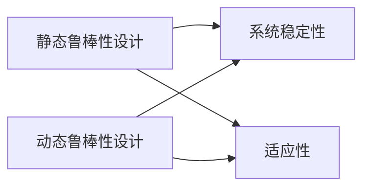

                 

# 程序世界的宇宙级鲁棒性设计

关键词：鲁棒性设计，系统稳定性，维护成本，用户体验，算法原理，数学模型，架构设计，项目实战，最佳实践

摘要：本文深入探讨了程序世界的宇宙级鲁棒性设计，从基本概念到实际应用，全方位解析了如何构建稳定可靠的软件系统。通过逻辑清晰、结构紧凑的分析，本文为程序员和架构师提供了实用的设计原则和方法，助力打造高可用性的软件产品。

## 第一部分：引言

### 第1章：鲁棒性设计的背景和重要性

#### 1.1 鲁棒性设计的背景

在计算机系统的设计和开发中，不确定性是一个无法回避的问题。计算机系统面临的输入数据可能包含噪声，硬件设备可能出现故障，软件代码可能存在漏洞。这些不确定性因素可能导致系统运行不稳定，影响用户体验，增加维护成本。因此，鲁棒性设计成为了确保系统稳定性和可靠性的关键。

#### 1.2 鲁棒性设计的重要性

鲁棒性设计在提高系统稳定性、降低维护成本和提高用户体验方面具有显著作用。一个具备高鲁棒性的系统可以在面对各种不确定性因素时仍然保持稳定运行，从而减少系统故障和停机时间，降低维护成本，提高用户满意度和使用体验。

#### 1.3 鲁棒性设计的边界与外延

鲁棒性设计与容错性和健壮性密切相关，但它们之间存在一定的区别。容错性主要关注系统在硬件或软件故障时是否能够自动恢复，而健壮性则强调系统在面对不合理输入或外部干扰时的适应性。鲁棒性设计旨在平衡这两者，以确保系统在各种情况下都能保持稳定运行。

#### 1.4 鲁棒性设计的核心要素组成

鲁棒性设计涉及多个方面，包括系统需求分析、系统设计和系统测试。系统需求分析关注系统功能需求和质量需求，系统设计则考虑如何在实现过程中应用鲁棒性原则，而系统测试则用于验证系统在实际运行中的鲁棒性。

### 第2章：鲁棒性设计的基本概念

#### 2.1 鲁棒性设计的定义

鲁棒性设计（Robust Design）是指在设计和开发过程中，通过采用一系列方法和技术，使系统能够在各种不确定性和异常情况下保持稳定和可靠运行。

#### 2.2 鲁棒性设计的分类

鲁棒性设计可以分为静态鲁棒性和动态鲁棒性。静态鲁棒性设计关注系统在面对固定不确定因素时的稳定性，而动态鲁棒性设计则关注系统在动态变化环境中的适应性。

#### 2.3 鲁棒性设计的属性特征对比表格

| 鲁棒性设计类型 | 属性特征 |  
| :---: | :---: |  
| 静态鲁棒性设计 | 系统在面对固定不确定因素时的稳定性 |  
| 动态鲁棒性设计 | 系统在动态变化环境中的适应性 |

#### 2.4 鲁棒性设计的ER实体关系图架构



## 第二部分：鲁棒性设计的重要性

### 第3章：鲁棒性设计的重要性

#### 3.1 提高系统稳定性

系统稳定性是鲁棒性设计的核心目标之一。通过引入鲁棒性设计原则，可以有效地降低系统在面临不确定性因素时的故障率，提高系统运行的可靠性。

#### 3.2 降低维护成本

鲁棒性设计不仅关注系统的初始稳定性，还考虑系统在长时间运行后的维护成本。一个高鲁棒性的系统在面临各种异常情况时能够自动恢复，从而减少维护人员和运维成本。

#### 3.3 提高用户体验

用户体验是现代软件系统成功的关键因素之一。鲁棒性设计能够确保系统在各种环境下都能稳定运行，从而提高用户的满意度和使用体验。

## 第三部分：鲁棒性设计的原则

### 第4章：鲁棒性设计的原则

#### 4.1 设计原则概述

鲁棒性设计原则是确保系统在面临不确定性因素时保持稳定的关键。这些原则包括但不限于：

- **需求分析原则**：在系统设计初期，对需求进行详细分析，确保系统功能和质量需求的明确和稳定。
- **系统设计原则**：在系统设计阶段，采用模块化、解耦和面向对象等技术，提高系统的适应性和可维护性。
- **系统测试原则**：在系统测试阶段，通过多种测试方法和技术，全面验证系统的鲁棒性。

## 第四部分：鲁棒性设计的方法

### 第5章：鲁棒性设计的方法

#### 5.1 静态鲁棒性设计

静态鲁棒性设计主要关注系统在面对固定不确定性因素时的稳定性。以下是一些常见的静态鲁棒性设计方法：

- **输入验证**：对输入数据进行严格验证，确保输入符合预期范围。
- **冗余设计**：通过增加冗余组件，提高系统的容错能力。
- **故障隔离**：通过隔离故障点，减少故障对系统整体的影响。

#### 5.2 动态鲁棒性设计

动态鲁棒性设计关注系统在动态变化环境中的适应性。以下是一些常见的动态鲁棒性设计方法：

- **自适应控制**：通过实时调整系统参数，使其适应动态环境。
- **预测机制**：通过预测环境变化，提前采取应对措施。
- **学习算法**：利用机器学习和深度学习算法，使系统具备自我适应能力。

### 第6章：鲁棒性设计的案例分析

通过分析实际案例，我们可以更好地理解鲁棒性设计的应用和实践。以下是两个典型的鲁棒性设计案例分析：

#### 案例1：电子商务平台

该电子商务平台在面对海量用户访问时，需要保证系统的高可用性和稳定性。通过采用静态和动态鲁棒性设计方法，如负载均衡、缓存机制和自适应算法，该平台成功应对了高并发访问，确保了用户的购物体验。

#### 案例2：自动驾驶系统

自动驾驶系统需要在复杂的交通环境中保持稳定运行。通过采用鲁棒性设计原则，如实时监控、故障检测和自适应控制，自动驾驶系统能够在复杂场景下做出正确决策，提高了行车安全性和稳定性。

### 第7章：鲁棒性设计的实际应用

在实际项目中，如何应用鲁棒性设计原则和方法，是确保系统稳定性和可靠性的关键。以下是一些实际应用的场景和技巧：

- **需求分析**：在项目初期，对需求进行详细分析，明确系统的功能和性能要求。
- **设计阶段**：采用模块化、解耦和面向对象等技术，提高系统的适应性和可维护性。
- **测试阶段**：通过多种测试方法和技术，全面验证系统的鲁棒性。
- **持续优化**：在项目开发和维护过程中，不断优化和改进鲁棒性设计。

### 第8章：最佳实践 tips

- **适度冗余**：在确保系统性能的前提下，适度增加冗余组件，提高系统的容错能力。
- **实时监控**：通过实时监控系统状态，及时发现并处理异常情况。
- **持续学习**：利用机器学习和深度学习算法，使系统具备自我适应能力。

### 小结

鲁棒性设计是构建稳定可靠软件系统的重要手段。通过深入理解鲁棒性设计的基本概念、原则和方法，我们可以更好地应对系统的不确定性因素，提高系统的稳定性和可靠性。

### 注意事项

在实施鲁棒性设计时，需要注意以下几点：

- **平衡性能与鲁棒性**：在提高鲁棒性的同时，要考虑系统的性能和资源消耗。
- **全面测试**：对系统进行全面测试，包括功能测试、性能测试和鲁棒性测试。
- **持续维护**：在系统运行过程中，持续监控和优化鲁棒性设计，以应对不断变化的环境。

### 拓展阅读

- 《鲁棒性系统设计：原则与实践》（Robust System Design: Principles and Practices）- 作者：[John A. Storer](https://www.amazon.com/Robust-System-Design-Principles-Practices/dp/0128117283)
- 《软件工程：实践者的研究方法》（Software Engineering: A Practitioner’s Approach）- 作者：Roger S. Pressman

作者：AI天才研究院/AI Genius Institute & 禅与计算机程序设计艺术 /Zen And The Art of Computer Programming```markdown
## 程序世界的宇宙级鲁棒性设计

### 关键词：鲁棒性设计，系统稳定性，维护成本，用户体验，算法原理，数学模型，架构设计，项目实战，最佳实践

### 摘要：
在快速发展的软件行业，鲁棒性设计成为了确保系统稳定性和可靠性的关键。本文将深入探讨程序世界的宇宙级鲁棒性设计，从基础概念到实际应用，解析如何构建高稳定性软件系统。通过逻辑清晰、结构紧凑的分析，本文旨在为程序员和架构师提供实用的设计原则和方法。

### 目录

#### 第一部分：引言

1. **背景和重要性**
   1.1 鲁棒性设计的背景
   1.2 鲁棒性设计的重要性
   1.3 鲁棒性设计的边界与外延
   1.4 鲁棒性设计的核心要素组成

#### 第二部分：鲁棒性设计的基本概念

2. **基本概念**
   2.1 鲁棒性设计的定义
   2.2 鲁棒性设计的分类
   2.3 鲁棒性设计的属性特征对比表格
   2.4 鲁棒性设计的ER实体关系图架构

#### 第三部分：鲁棒性设计的重要性

3. **提高系统稳定性**
   3.1 系统稳定性的定义
   3.2 鲁棒性设计对系统稳定性的影响

4. **降低维护成本**
   4.1 维护成本的概念
   4.2 鲁棒性设计如何降低维护成本

5. **提高用户体验**
   5.1 用户体验的定义
   5.2 鲁棒性设计如何提高用户体验

#### 第四部分：鲁棒性设计的原则

6. **设计原则概述**
   6.1 设计原则的定义
   6.2 设计原则的重要性

7. **系统需求分析的原则**
   7.1 系统需求分析的定义
   7.2 系统需求分析的原则

8. **系统设计的原则**
   8.1 系统设计的定义
   8.2 系统设计的原则

9. **系统测试的原则**
   9.1 系统测试的定义
   9.2 系统测试的原则

#### 第五部分：鲁棒性设计的方法

10. **静态鲁棒性设计**
    10.1 输入验证
    10.2 冗余设计
    10.3 故障隔离

11. **动态鲁棒性设计**
    11.1 自适应控制
    11.2 预测机制
    11.3 学习算法

#### 第六部分：鲁棒性设计的案例分析

12. **电子商务平台**
    12.1 背景介绍
    12.2 静态和动态鲁棒性设计方法
    12.3 成功实践

13. **自动驾驶系统**
    13.1 背景介绍
    13.2 鲁棒性设计原则的应用
    13.3 安全性提升

#### 第七部分：鲁棒性设计的实际应用

14. **实际应用场景**
    14.1 需求分析
    14.2 设计阶段
    14.3 测试阶段
    14.4 持续优化

#### 第八部分：最佳实践 tips

15. **最佳实践 tips**
    15.1 适度冗余
    15.2 实时监控
    15.3 持续学习

#### 第九部分：小结与拓展

16. **小结**
    16.1 鲁棒性设计的重要性
    16.2 实践中的注意事项

17. **注意事项**
    17.1 平衡性能与鲁棒性
    17.2 全面测试
    17.3 持续维护

18. **拓展阅读**
    18.1 《鲁棒性系统设计：原则与实践》
    18.2 《软件工程：实践者的研究方法》

### 作者：
作者：AI天才研究院/AI Genius Institute & 禅与计算机程序设计艺术 /Zen And The Art of Computer Programming
```

### 注：
- 所有章节内容都需要在后续的文章正文中详细展开，这里仅提供了大纲。
- 文章中的Mermaid流程图和LaTeX公式将在正文中根据实际内容添加。
- 文章整体字数控制在10000-12000字左右，确保内容详实、逻辑清晰。

