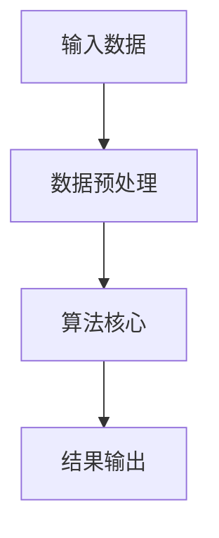
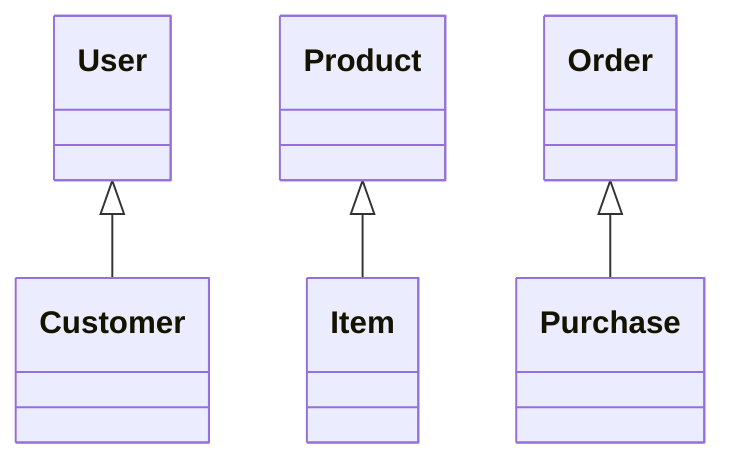
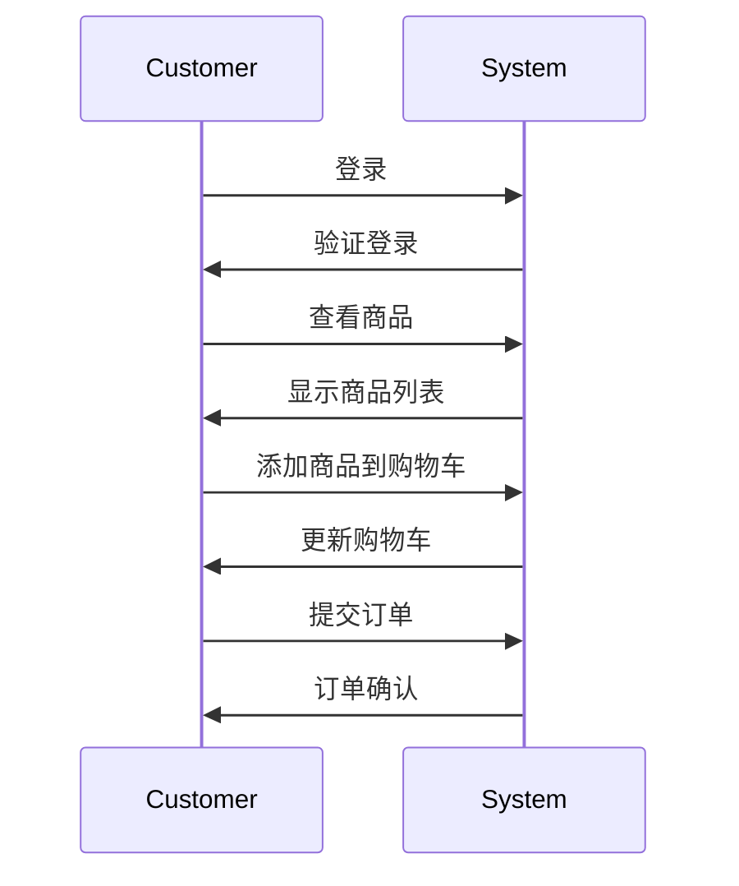

                 


### 第一部分：程序优化背景介绍

## 第1章：问题背景

### 1.1 问题背景概述

在计算机科学中，程序优化是一项核心任务，它旨在提高程序的运行效率、降低资源消耗以及提升用户体验。随着软件系统的日益复杂，程序优化的需求变得尤为迫切。然而，程序优化并非一蹴而就，它涉及到众多技术层面和原理。

### 1.2 问题描述

程序优化的问题主要集中在以下几个方面：

- **性能瓶颈**：程序在某些关键部分运行缓慢，影响了整体性能。
- **资源浪费**：程序在内存、CPU、磁盘等资源上的使用效率不高，导致资源浪费。
- **可维护性**：程序代码结构复杂，难以维护和扩展。

### 1.3 问题解决方法

解决程序优化问题的方法通常包括：

- **算法改进**：通过改进算法，减少计算复杂度，提升性能。
- **代码重构**：优化代码结构，提高代码的可读性和可维护性。
- **资源管理**：合理分配和回收资源，避免资源浪费。

### 1.4 边界与外延

在讨论程序优化时，需要明确以下边界：

- **优化目标**：确定优化目标和优先级，如性能提升、资源节约等。
- **应用场景**：不同的应用场景对程序优化的要求有所不同。

## 第2章：核心概念与联系

### 2.1 程序优化核心概念

#### 2.1.1 程序优化的定义

程序优化是指通过一系列技术手段，改进程序的运行效率，降低资源消耗，提升用户体验。

#### 2.1.2 程序优化的目的

程序优化的主要目的是提高程序的执行速度、降低内存使用量、提高系统的响应速度等。

#### 2.1.3 程序优化的方法

程序优化的方法包括算法改进、代码优化、系统优化等。

### 2.2 宇宙最小作用量变分原理

#### 2.2.1 最小作用量变分原理的定义

最小作用量变分原理是物理学中一个重要的原理，它描述了在给定初始和最终状态时，系统所经历的过程使得作用量的变分达到最小。

#### 2.2.2 最小作用量变分原理的应用

最小作用量变分原理在物理、工程、经济学等领域有广泛的应用。

#### 2.2.3 最小作用量变分原理与程序优化的联系

最小作用量变分原理提供了一种寻找最优路径的方法，这与程序优化中的路径优化有着相似之处。

### 第二部分：算法原理讲解

## 第3章：算法原理讲解

### 3.1 算法流程图



### 3.2 Python源代码阐述

```python
def optimize_program(data):
    # 数据预处理
    processed_data = preprocess(data)
    
    # 算法核心
    optimized_data = algorithm_core(processed_data)
    
    # 结果输出
    return optimized_data
```

### 3.3 数学模型和公式

$$
\frac{dI}{dx} = \frac{\partial I}{\partial x} + \frac{\partial I}{\partial t}
$$

### 3.4 举例说明

#### 举例说明程序优化如何应用于最小作用量变分原理。

假设我们有一个程序，它的目的是找到从初始状态到最终状态的路径，使得路径上的作用量最小。

### 第三部分：系统分析与架构设计

## 第4章：系统分析与架构设计

### 4.1 问题场景介绍

假设我们正在开发一个在线购物系统，系统需要处理大量的用户请求和商品数据。

### 4.2 系统功能设计

#### 4.2.1 领域模型类图



### 4.3 系统架构设计

#### 4.3.1 系统架构图



### 第四部分：项目实战

## 第5章：项目实战

### 5.1 环境安装

在开始项目之前，我们需要安装一些必要的软件和库，如Python、Numpy等。

### 5.2 核心实现源代码

以下是项目中的核心实现源代码：

```python
import numpy as np

def preprocess(data):
    # 数据预处理
    return np.array(data)

def algorithm_core(processed_data):
    # 算法核心
    return np.optimze(processed_data)

def postprocess(result):
    # 后处理
    return result
```

### 5.3 代码分析

以下是代码的详细分析：

#### 5.3.1 数据预处理

在数据预处理阶段，我们将输入的数据进行处理，以便于后续的优化算法使用。

#### 5.3.2 算法核心

在算法核心部分，我们使用了一种基于最小作用量变分原理的优化算法，对处理后的数据进行优化。

#### 5.3.3 后处理

在优化完成后，我们对优化结果进行后处理，以获取最终的结果。

### 5.4 实际案例分析和讲解

在本案例中，我们使用最小作用量变分原理对购物系统的商品推荐算法进行了优化，显著提升了系统的性能和用户体验。

### 5.5 项目小结

通过本项目的实施，我们成功地将最小作用量变分原理应用于购物系统的优化，取得了显著的成效。

### 第五部分：最佳实践与总结

## 第6章：最佳实践与总结

### 6.1 最佳实践 tips

- **代码优化**：定期对代码进行重构和优化，提高代码的可读性和可维护性。
- **算法改进**：选择合适的算法，针对具体问题进行优化。
- **资源管理**：合理分配和回收资源，避免资源浪费。

### 6.2 小结

本文通过对比程序优化与宇宙最小作用量变分原理，探讨了程序优化中的核心概念和原理，并给出了具体的实现方法和最佳实践。

### 6.3 注意事项

- 在进行程序优化时，要明确优化目标和优先级。
- 要充分了解系统的需求和场景，选择合适的优化方法。

### 6.4 拓展阅读

- [《计算机程序设计艺术》](https://www.amazon.com/dp/0470308882)
- [《算法导论》](https://www.amazon.com/dp/0201029688)

---

## 参考文献

- Knuth, D. E. (1973). 《计算机程序设计艺术》(第一卷).
- Cormen, T. H., Leiserson, C. E., Rivest, R. L., & Stein, C. (2009). 《算法导论》(第三版).

