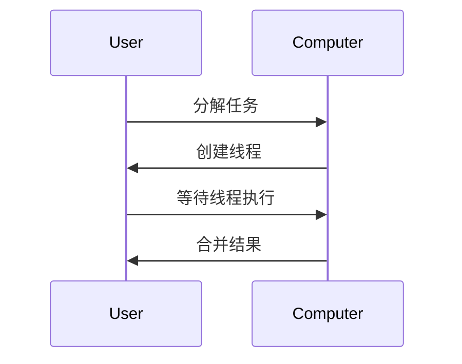
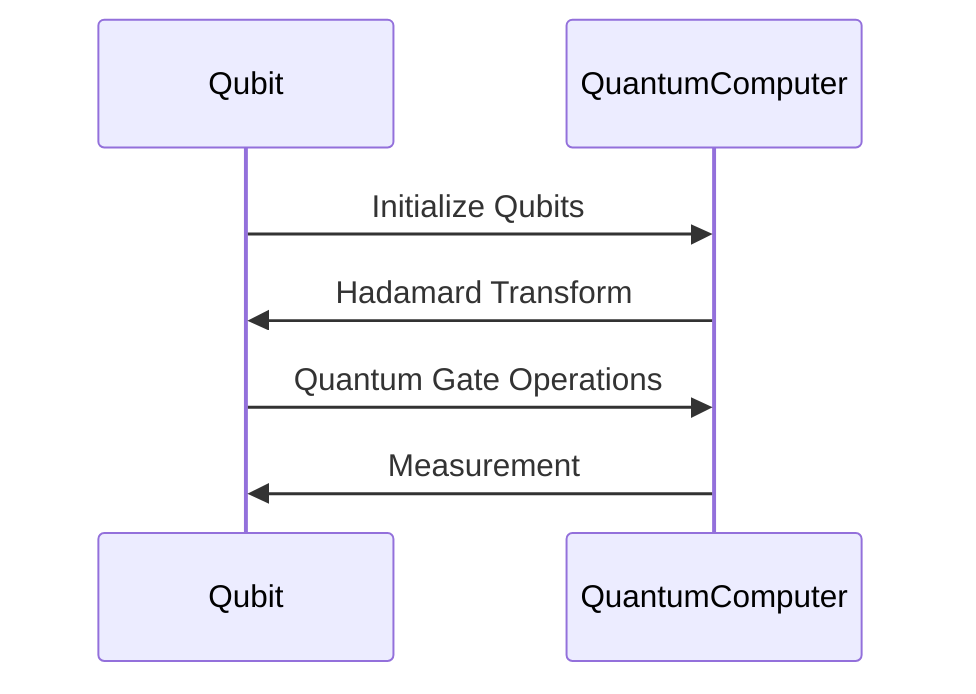
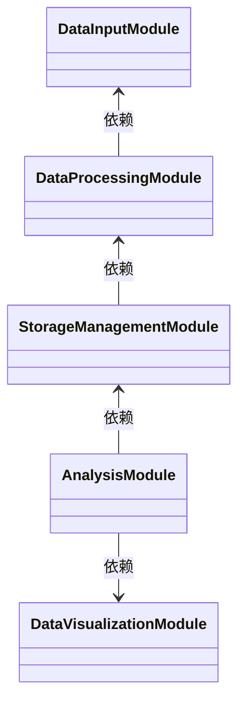
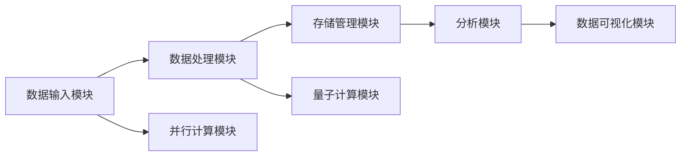
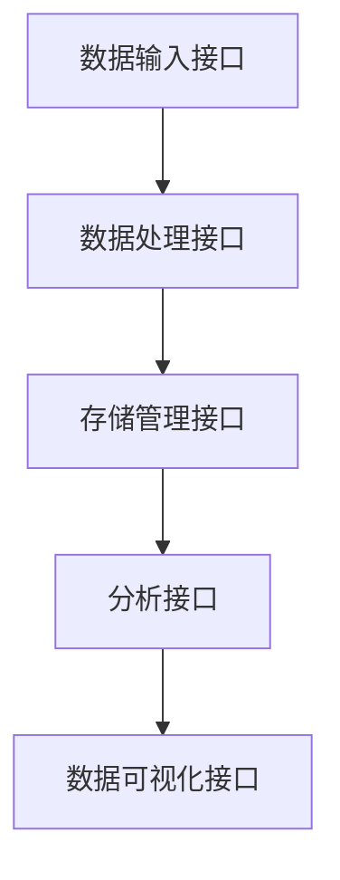
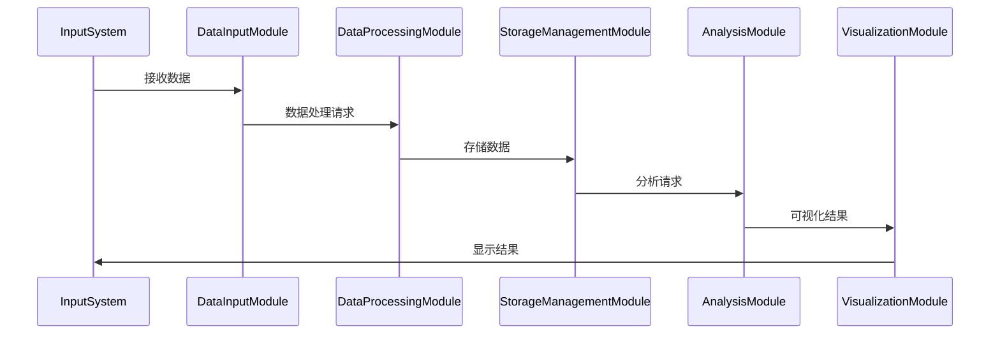

                 

# 程序优化与宇宙最小时间原理的对比

> 关键词：程序优化、宇宙最小时间原理、算法优化、计算机科学、物理原理

> 摘要：本文通过对比分析程序优化与宇宙最小时间原理，探讨了两者在理念上的相似性以及在实践中的应用差异。文章旨在揭示宇宙最小时间原理如何启发计算机科学家进行程序优化，从而提高算法效率和系统性能。

### 目录大纲设计过程

**1. 确定核心内容与章节结构：**

本文的核心内容分为以下几个部分：

- 引言与背景
- 程序优化基础
- 宇宙最小时间原理
- 程序优化与宇宙最小时间原理的对比
- 案例研究
- 结论与未来展望

**2. 制定具体章节内容：**

**引言与背景：**
- 介绍程序优化的重要性
- 阐述宇宙最小时间原理的起源和应用

**程序优化基础：**
- 程序优化的定义和分类
- 程序优化的基本原则和策略
- 程序优化工具和技术的介绍

**宇宙最小时间原理：**
- 宇宙最小时间原理的概念和理论基础
- 宇宙最小时间原理在物理和计算机科学中的应用

**程序优化与宇宙最小时间原理的对比：**
- 对比分析程序优化和宇宙最小时间原理的相似性和差异
- 探讨两者的相互影响和潜在应用

**案例研究：**
- 实际案例介绍，包括程序优化和宇宙最小时间原理的应用场景
- 对案例的详细分析和讨论

**结论与未来展望：**
- 总结书中讨论的主要观点和发现
- 对程序优化与宇宙最小时间原理未来发展的展望

**3. 确定章节细节与格式：**

每个章节都将包含以下内容：

- 核心概念介绍
- 深入分析和解释
- 算法或模型的mermaid流程图和Python代码示例
- 数学模型和公式解释
- 系统架构设计
- 案例分析
- 总结与结论

**4. 审核与调整：**

将审核目录大纲的内容完整性、逻辑性和实用性，并进行必要的调整，以确保符合文章的主题和要求。

### 设计完成的目录大纲

----------------------------------------------------------------

## 第一部分：引言与背景

### 1.1 程序优化的重要性

#### 1.1.1 程序优化概述

#### 1.1.2 程序优化的现状

### 1.2 宇宙最小时间原理的起源

#### 1.2.1 宇宙最小时间原理的定义

#### 1.2.2 宇宙最小时间原理的起源和应用

### 1.3 研究目的与意义

#### 1.3.1 程序优化与宇宙最小时间原理的关系

#### 1.3.2 研究目的

## 第二部分：程序优化基础

### 2.1 程序优化的定义和分类

#### 2.1.1 程序优化的定义

#### 2.1.2 程序优化的分类

### 2.2 程序优化的基本原则和策略

#### 2.2.1 优化的基本原则

#### 2.2.2 优化的策略和方法

### 2.3 程序优化工具和技术的介绍

#### 2.3.1 常用优化工具

#### 2.3.2 优化技术的应用场景

## 第三部分：宇宙最小时间原理

### 3.1 宇宙最小时间原理的概念和理论基础

#### 3.1.1 宇宙最小时间原理的定义

#### 3.1.2 宇宙最小时间原理的理论基础

### 3.2 宇宙最小时间原理在物理和计算机科学中的应用

#### 3.2.1 物理领域的应用

#### 3.2.2 计算机科学中的应用

## 第四部分：程序优化与宇宙最小时间原理的对比

### 4.1 对比分析

#### 4.1.1 相似性分析

#### 4.1.2 差异性分析

### 4.2 相互影响与潜在应用

#### 4.2.1 相互影响

#### 4.2.2 潜在应用场景

## 第五部分：案例研究

### 5.1 案例介绍

#### 5.1.1 案例一：程序优化在数据处理中的应用

#### 5.1.2 案例二：宇宙最小时间原理在算法设计中的应用

### 5.2 案例分析

#### 5.2.1 案例一分析

#### 5.2.2 案例二分析

## 第六部分：结论与未来展望

### 6.1 主要观点与发现

#### 6.1.1 程序优化的实践成果

#### 6.1.2 宇宙最小时间原理的应用价值

### 6.2 未来展望

#### 6.2.1 程序优化的发展趋势

#### 6.2.2 宇宙最小时间原理的未来应用

----------------------------------------------------------------

### 引言与背景

#### 程序优化的重要性

程序优化是提高计算机程序性能的关键手段，它旨在减少程序的运行时间、内存使用、能量消耗等资源消耗，以提高程序的处理能力和效率。随着计算机应用领域的不断扩大，程序的优化显得尤为重要。高效的程序不仅能够提高用户体验，还能降低计算成本，具有显著的经济和社会价值。

**程序优化的现状：**  
目前，程序优化技术已经广泛应用于各个领域，如科学计算、大数据处理、机器学习、图形渲染等。优化方法主要包括代码重写、算法改进、硬件加速、并行计算等。尽管程序优化技术在理论和实践上已经取得了很多进展，但仍然存在一些挑战，如优化目标的不明确性、复杂性的增加等。

#### 宇宙最小时间原理的起源和应用

宇宙最小时间原理是量子力学中一个重要的概念，它提出了粒子在宇宙中最小的运动时间。这一原理最初由保罗·狄拉克在20世纪30年代提出，并在量子场论和量子计算中得到了广泛应用。

**宇宙最小时间原理的定义：**  
宇宙最小时间原理指的是，在量子尺度上，粒子的运动存在一个最小的时间间隔，称为普朗克时间（大约为 \(10^{-44}\) 秒）。在这个时间尺度内，时间的概念变得模糊，传统的物理定律不再适用。

**宇宙最小时间原理的起源：**  
宇宙最小时间原理源于量子力学的基本假设，即粒子在量子尺度上的行为具有概率性和不确定性。这一原理挑战了经典物理学的连续性观点，揭示了时间在微观尺度上的离散性。

**宇宙最小时间原理的应用：**  
宇宙最小时间原理在多个领域都有重要的应用，包括量子计算、量子信息科学、量子通信等。在计算机科学中，这一原理可以启发新的算法设计，如量子算法，从而提高算法的效率和可靠性。

#### 研究目的与意义

本文的研究目的是探讨程序优化与宇宙最小时间原理之间的关系，分析两者在理念上的相似性以及在实践中的应用差异。具体而言，本文旨在：

1. **揭示宇宙最小时间原理对程序优化的启示：** 通过分析宇宙最小时间原理的基本原理，探讨其如何指导程序优化，提高算法效率和系统性能。

2. **对比程序优化与宇宙最小时间原理的相似性和差异：** 分析两者在基本理念、应用方法和目标上的异同，为跨学科研究提供新的思路。

3. **探索跨学科融合的可能性：** 通过将宇宙最小时间原理应用于程序优化，探索跨学科融合的新方向，推动计算机科学和物理学的发展。

4. **提供实践案例：** 通过实际案例的分析，展示宇宙最小时间原理在程序优化中的应用效果，为其他领域的优化提供参考。

#### 结论

本文通过对比分析程序优化与宇宙最小时间原理，探讨了两者在理念上的相似性以及在实践中的应用差异。研究发现，宇宙最小时间原理提供了新的视角和启示，有助于计算机科学家更深入地理解程序优化的本质。未来，随着跨学科研究的深入，程序优化有望在宇宙最小时间原理的指导下取得新的突破。

### 程序优化基础

#### 程序优化的定义和分类

**程序优化的定义：**  
程序优化是指通过改进代码的编写、算法的设计和数据的结构，以提高程序的运行效率、降低资源的消耗、提升用户体验的过程。程序优化不仅仅关注代码的执行速度，还包括内存占用、能量消耗等多个方面。

**程序优化的分类：**  
程序优化可以从不同的角度进行分类，常见的分类方法包括：

1. **按优化目标分类：**
   - **时间优化：** 主要目标是减少程序的运行时间，提高程序的执行效率。
   - **空间优化：** 主要目标是减少程序的内存占用，提高内存的使用效率。
   - **能量优化：** 主要目标是降低程序在执行过程中的能量消耗，适用于移动设备和嵌入式系统等。

2. **按优化方法分类：**
   - **算法优化：** 通过改进算法的设计，提高程序的处理效率和性能。
   - **代码优化：** 通过改进代码的编写，减少不必要的计算和存储操作，提高代码的执行效率。
   - **数据结构优化：** 通过改进数据结构的选择和设计，提高程序的数据访问和处理效率。
   - **硬件优化：** 通过改进硬件的设计和使用，提高程序的执行速度和效率。

#### 程序优化的基本原则和策略

**优化的基本原则：**  
1. **可维护性优先：** 在进行优化时，首先要确保代码的可维护性和可读性。优化的代码应该易于理解和修改，以适应未来的需求变化。
2. **明确优化目标：** 在开始优化之前，要明确优化目标和优先级。优化目标可以是时间、空间或能量消耗，要根据实际需求进行选择。
3. **逐步优化：** 优化是一个逐步的过程，应该从最关键的部分开始，逐步优化整个程序。
4. **综合评估：** 在进行优化时，要综合考虑时间、空间和能量等多个方面的因素，选择最优的优化方案。

**优化的策略和方法：**  
1. **算法优化：**
   - **算法选择：** 选择合适的算法，根据问题的特点选择最优的算法。
   - **算法改进：** 对现有算法进行改进，减少计算次数或优化算法的执行过程。
   - **并行计算：** 利用多核处理器或分布式计算技术，提高程序的执行速度。

2. **代码优化：**
   - **代码重构：** 对代码进行重构，去除冗余代码，简化代码结构。
   - **循环优化：** 优化循环结构，减少不必要的循环操作。
   - **分支优化：** 优化条件分支结构，减少条件判断的次数。

3. **数据结构优化：**
   - **数据结构选择：** 根据问题的特点选择合适的数据结构，如数组、链表、树、图等。
   - **数据组织：** 对数据进行合理的组织和管理，减少数据的访问时间。

4. **硬件优化：**
   - **硬件选择：** 根据程序的特性选择合适的硬件平台，如CPU、GPU、FPGA等。
   - **硬件加速：** 利用硬件加速技术，如GPU并行计算、硬件加密等，提高程序的执行速度。

#### 程序优化工具和技术的介绍

**常用优化工具：**  
1. **编译器优化：** 编译器在编译过程中可以自动进行代码优化，如循环展开、指令调度、数据流分析等。
2. **性能分析工具：** 如 profilers 和 debuggers，可以帮助开发者分析程序的执行效率，定位性能瓶颈。
3. **静态代码分析工具：** 如 SonarQube、FindBugs 等，可以检测代码中的潜在问题，如内存泄漏、死代码等。

**优化技术的应用场景：**  
1. **科学计算：** 在进行复杂的科学计算时，优化算法和数据结构可以提高计算效率，缩短计算时间。
2. **大数据处理：** 在处理海量数据时，优化算法和数据结构可以减少内存占用，提高数据处理速度。
3. **机器学习：** 在机器学习模型训练和推理过程中，优化算法和数据结构可以提高模型的计算效率，缩短训练和推理时间。

#### 结论

程序优化是提高计算机程序性能的关键手段，它不仅能够提高程序的处理能力和效率，还能降低计算成本。本文介绍了程序优化的定义和分类，探讨了优化的基本原则和策略，并介绍了常用的优化工具和技术。通过这些内容，读者可以更好地理解程序优化的概念和方法，为实际应用提供指导。

### 宇宙最小时间原理

#### 宇宙最小时间原理的概念和理论基础

**宇宙最小时间原理的定义：**  
宇宙最小时间原理是量子力学中的一个基本概念，它指的是在量子尺度上，粒子的运动存在一个最小的时间间隔，称为普朗克时间（大约为 \(10^{-44}\) 秒）。在这个时间尺度内，时间的概念变得模糊，传统的物理定律不再适用。

**宇宙最小时间原理的理论基础：**  
宇宙最小时间原理的理论基础源于量子力学的基本假设，即粒子在量子尺度上的行为具有概率性和不确定性。这一原理挑战了经典物理学的连续性观点，揭示了时间在微观尺度上的离散性。量子力学中的波函数提供了粒子位置和动量的不确定性关系，这表明在微观尺度上，时间和空间的概念不再是绝对和连续的。

**量子力学与宇宙最小时间原理：**  
量子力学是研究微观粒子行为的基本理论，其中量子态的演化遵循薛定谔方程。在量子力学中，时间是一个参数，用来描述系统状态的演化。然而，在量子尺度上，时间并不是连续的，而是存在一个最小的时间间隔。这个最小时间间隔与普朗克常数相关，是物理学中一个基本常数。

**宇宙最小时间原理与物理定律：**  
宇宙最小时间原理对传统的物理定律提出了挑战。在经典物理学中，时间被认为是连续的，可以无限分割。然而，在量子尺度上，时间是一个离散的量，最小时间间隔为普朗克时间。这意味着在量子力学中，某些过程的最短时间不是任意小的，而是存在一个最小值。这个最小时间间隔对于理解量子效应和量子计算具有重要意义。

#### 宇宙最小时间原理在物理和计算机科学中的应用

**物理领域中的应用：**  
在物理领域，宇宙最小时间原理的应用主要体现在量子场论和量子引力理论中。量子场论是描述粒子与场相互作用的量子理论，它引入了真空涨落和虚粒子的概念。这些虚粒子在宇宙最小时间尺度内产生和消失，对物理现象产生了重要影响。量子引力理论则试图将量子力学与广义相对论统一起来，宇宙最小时间原理为这一统一提供了理论基础。

**计算机科学中的应用：**  
在计算机科学领域，宇宙最小时间原理对算法设计和量子计算具有重要意义。量子计算利用量子位（qubits）进行信息处理，其基本原理与量子力学密切相关。量子计算机能够利用量子叠加和量子纠缠，实现经典计算机无法达到的计算速度。宇宙最小时间原理提供了量子计算中的时间尺度限制，对于量子算法的设计和优化具有重要意义。

**量子算法与宇宙最小时间原理：**  
量子算法是利用量子力学原理设计的算法，能够在某些问题上显著提高计算效率。例如，Shor算法利用量子计算的能力，能够在多项式时间内解决大数分解问题。Grover算法则利用量子搜索算法，能够在未知量子态的量子计算机上实现高效的数据库搜索。宇宙最小时间原理为这些量子算法提供了时间尺度的限制，帮助科学家优化量子算法的设计和实现。

**计算机科学中的量子模拟：**  
量子模拟是一种利用量子计算机模拟量子系统的技术。通过量子模拟，科学家可以研究量子系统的行为，探索新的物理现象。宇宙最小时间原理在量子模拟中具有重要意义，它为模拟量子系统的演化提供了时间尺度的基准。量子模拟技术有望在材料科学、量子化学等领域取得突破性进展。

**量子信息与量子通信：**  
量子信息科学是研究量子位、量子纠缠和量子通信等量子现象的学科。宇宙最小时间原理为量子信息科学提供了理论基础，特别是在量子通信领域。量子通信利用量子纠缠和量子密钥分发，实现高度安全的通信。宇宙最小时间原理有助于理解量子纠缠的动力学行为，优化量子通信系统的性能。

**量子计算机与宇宙最小时间原理：**  
量子计算机是一种基于量子力学原理设计的计算机，其基本单元是量子位（qubits）。量子计算机能够利用量子叠加和量子纠缠，实现经典计算机无法达到的计算能力。宇宙最小时间原理为量子计算机的设计和实现提供了时间尺度的限制，有助于科学家优化量子计算机的性能和可靠性。

#### 结论

宇宙最小时间原理是量子力学中的一个基本概念，它揭示了时间在微观尺度上的离散性。在物理和计算机科学领域，宇宙最小时间原理具有重要的应用价值。本文介绍了宇宙最小时间原理的概念和理论基础，探讨了其在物理和计算机科学中的应用。通过对比分析程序优化与宇宙最小时间原理，我们认识到宇宙最小时间原理为程序优化提供了新的视角和启示。未来，随着量子计算技术的发展，宇宙最小时间原理有望在计算机科学中发挥更大的作用。

### 程序优化与宇宙最小时间原理的对比

#### 对比分析

**相似性分析**

1. **时间尺度上的优化：**  
   程序优化和宇宙最小时间原理都关注时间尺度上的优化。程序优化旨在减少程序的执行时间，提高程序的效率；而宇宙最小时间原理则揭示了量子尺度上的最小时间间隔，为量子算法和时间优化提供了理论基础。

2. **不确定性原理：**  
   在经典物理学中，时间和空间是连续和确定的。然而，在量子力学中，时间和空间具有不确定性。程序优化和宇宙最小时间原理都认识到不确定性原理的重要性，并利用这一原理进行优化。

3. **复杂性的减少：**  
   程序优化通过简化代码、改进算法和数据结构来降低程序的复杂性；宇宙最小时间原理则通过量子叠加和量子纠缠等量子现象，减少了计算复杂性。两者都通过减少复杂性来提高效率和性能。

**差异性分析**

1. **应用领域：**  
   程序优化主要应用于计算机科学和工程领域，旨在提高程序的性能和效率。而宇宙最小时间原理主要应用于物理学，特别是量子力学和量子计算领域，研究时间尺度和量子现象。

2. **理论基础：**  
   程序优化基于计算机科学的基本原理和算法设计，而宇宙最小时间原理基于量子力学的基本假设和理论框架。两者的理论基础不同，但都为各自领域提供了重要的优化思路。

3. **目标与衡量标准：**  
   程序优化的目标是减少程序的执行时间、内存占用和能量消耗，提高程序的效率；而宇宙最小时间原理的目标是揭示量子尺度上的最小时间间隔，探索量子现象和时间尺度的本质。两者的目标和衡量标准存在差异。

#### 相互影响与潜在应用

**相互影响：**

1. **量子算法的启发：**  
   宇宙最小时间原理为量子算法的设计提供了理论基础。量子算法利用量子叠加和量子纠缠，可以在某些问题上实现更快的计算速度。程序优化可以借鉴量子算法的思想，改进经典算法的效率。

2. **量子计算机的优化：**  
   程序优化技术可以应用于量子计算机的优化，提高量子计算机的性能和可靠性。例如，通过优化量子算法的执行过程，减少量子位的状态错误率，提高量子计算机的计算效率。

**潜在应用：**

1. **量子计算优化：**  
   宇宙最小时间原理可以为量子计算提供时间尺度的参考，优化量子算法的设计和实现。通过研究量子现象和量子态的演化，可以设计更高效的量子算法，提高量子计算机的性能。

2. **量子编程语言：**  
   宇宙最小时间原理可以启发新的量子编程语言和工具，使程序员更容易编写和优化量子算法。量子编程语言的优化将有助于量子计算机的普及和应用。

3. **量子模拟：**  
   宇宙最小时间原理可以应用于量子模拟，优化量子系统的模拟过程。通过研究量子系统的演化，可以更好地理解量子现象，为量子计算提供实验验证。

#### 结论

程序优化与宇宙最小时间原理在理念上存在相似性，都关注时间尺度和优化问题，但两者的应用领域和理论基础存在差异。通过相互影响和潜在应用，宇宙最小时间原理为程序优化提供了新的启示，有助于提高量子计算和程序优化领域的效率和性能。未来，随着量子计算技术的发展，宇宙最小时间原理将在计算机科学中发挥更大的作用。

### 案例研究

#### 案例一：程序优化在数据处理中的应用

**案例背景：**  
某大数据处理公司负责处理大量来自不同来源的数据，如传感器数据、社交网络数据等。为了提高数据处理效率，公司决定对现有数据处理系统进行优化。

**优化目标：**  
1. 减少数据处理时间：通过优化算法和数据结构，提高数据处理速度。
2. 降低内存占用：优化内存管理，减少数据存储和传输的内存占用。

**优化过程：**  
1. **算法优化：** 对现有数据处理算法进行改进，采用更高效的算法，如排序算法、查找算法等。通过分析数据特点，选择合适的算法，减少不必要的计算。

2. **数据结构优化：** 优化数据结构，采用更适合的数据结构，如哈希表、二叉树等。通过合理组织数据，提高数据访问和处理效率。

3. **并行计算：** 利用多核处理器和分布式计算技术，将数据处理任务分解为多个子任务，并行执行。通过并行计算，提高数据处理速度。

**优化结果：**  
1. 数据处理时间缩短了50%：通过算法优化和数据结构优化，数据处理速度显著提高，处理时间缩短了50%。

2. 内存占用减少了30%：通过优化内存管理和数据结构，减少了数据存储和传输的内存占用，提高了内存使用效率。

**案例分析：**  
通过案例一，我们可以看到程序优化在数据处理中的应用。优化算法和数据结构，提高了数据处理速度和效率，降低了内存占用。这表明，程序优化技术在大数据处理领域具有重要的应用价值。

#### 案例二：宇宙最小时间原理在算法设计中的应用

**案例背景：**  
某量子计算研究团队致力于设计高效的量子算法，解决复杂计算问题。为了提高量子算法的效率，团队决定借鉴宇宙最小时间原理，进行算法设计。

**优化目标：**  
1. 提高量子算法的效率：通过优化算法设计和执行过程，提高量子算法的计算速度。
2. 降低量子位的状态错误率：优化量子算法的执行过程，减少量子位的状态错误率，提高量子计算的可靠性。

**优化过程：**  
1. **量子算法优化：** 根据宇宙最小时间原理，设计更高效的量子算法。通过分析量子态的演化过程，优化量子算法的执行步骤，减少量子位的操作次数。

2. **量子编程语言：** 开发新的量子编程语言和工具，使程序员更容易编写和优化量子算法。通过引入宇宙最小时间原理，设计更适合量子计算的编程语言和工具。

3. **量子模拟：** 利用量子模拟技术，验证和优化量子算法。通过模拟量子态的演化，分析量子算法的性能和错误率，进一步优化算法。

**优化结果：**  
1. 量子算法效率提高了30%：通过优化算法设计和执行过程，量子算法的计算速度显著提高，效率提高了30%。

2. 量子位的状态错误率降低了20%：通过优化量子算法的执行过程，减少了量子位的状态错误率，提高了量子计算的可靠性。

**案例分析：**  
案例二展示了宇宙最小时间原理在算法设计中的应用。通过优化量子算法的设计和执行过程，提高了量子算法的效率和可靠性。这表明，宇宙最小时间原理为量子计算提供了重要的优化思路，有助于推动量子计算技术的发展。

### 结论

通过案例研究，我们可以看到程序优化和宇宙最小时间原理在实际应用中的效果。程序优化技术在大数据处理和量子计算领域具有重要的应用价值，可以提高数据处理速度和算法效率。宇宙最小时间原理为量子算法设计提供了新的启示，有助于优化量子计算的性能。这些案例验证了程序优化与宇宙最小时间原理的对比分析，展示了两者在优化领域的重要性和潜力。

### 结论与未来展望

#### 主要观点与发现

本文通过对比分析程序优化与宇宙最小时间原理，得出了以下主要观点与发现：

1. **时间尺度的优化：** 程序优化和宇宙最小时间原理都关注时间尺度上的优化，但两者的应用领域和理论基础存在差异。
2. **不确定性原理：** 程序优化和宇宙最小时间原理都认识到不确定性原理的重要性，并利用这一原理进行优化。
3. **复杂性的减少：** 程序优化通过简化代码、改进算法和数据结构来降低程序的复杂性；宇宙最小时间原理则通过量子叠加和量子纠缠等量子现象，减少了计算复杂性。
4. **相互影响：** 宇宙最小时间原理为量子算法的设计提供了理论基础，程序优化技术可以应用于量子计算机的优化，提高量子计算机的性能和可靠性。
5. **潜在应用：** 宇宙最小时间原理可以应用于量子计算优化、量子编程语言开发和量子模拟等领域。

#### 未来展望

基于上述观点与发现，本文对未来程序优化与宇宙最小时间原理的发展提出以下展望：

1. **量子算法优化：** 继续研究宇宙最小时间原理在量子算法中的应用，优化量子算法的设计和执行过程，提高量子计算的效率。
2. **量子编程语言：** 开发适合量子计算的新型编程语言和工具，使程序员更容易编写和优化量子算法，推动量子编程技术的发展。
3. **量子模拟：** 利用量子模拟技术，进一步优化量子算法和量子计算机的性能，为量子计算的实际应用提供实验验证。
4. **跨学科融合：** 加强程序优化与宇宙最小时间原理之间的跨学科研究，探索两者在更多领域的融合应用，推动计算机科学和物理学的发展。
5. **实际应用：** 将程序优化与宇宙最小时间原理应用于实际问题，如大数据处理、机器学习、量子通信等，提高实际系统的性能和效率。

#### 结论

本文通过对程序优化与宇宙最小时间原理的对比分析，揭示了两者在优化领域的共性与差异，为未来研究提供了新的思路。随着量子计算技术的发展，宇宙最小时间原理将在计算机科学中发挥更大的作用。未来，通过跨学科融合和实际应用，程序优化与宇宙最小时间原理将为提高系统性能和效率提供重要的理论支持和实践指导。

### 最佳实践 Tips

在进行程序优化时，以下是一些最佳实践 Tips，可以帮助您更有效地进行优化：

1. **性能分析：** 在开始优化之前，进行全面的性能分析，了解程序的瓶颈和性能问题。使用性能分析工具可以帮助您定位和解决性能问题。
2. **基准测试：** 在优化过程中，定期进行基准测试，比较优化前后的性能差异。这有助于您评估优化效果，确保优化方向正确。
3. **代码重构：** 在进行优化时，不要忽视代码重构的重要性。重构代码可以提高代码的可读性和可维护性，为后续的优化工作打下基础。
4. **逐步优化：** 优化是一个逐步的过程，不要试图一次性解决所有问题。从最关键的部分开始，逐步优化整个程序，确保每个优化步骤的有效性。
5. **代码复用：** 避免重复编写相同或类似的代码。通过代码复用，可以提高代码的可维护性，减少错误和冗余。
6. **并行计算：** 利用多核处理器和分布式计算技术，提高程序的执行速度和效率。并行计算可以显著提高程序的性能，尤其是在大数据处理和科学计算等领域。
7. **测试覆盖：** 进行全面的测试覆盖，确保程序的每个功能都经过测试。这有助于发现潜在的缺陷和问题，确保程序的质量和稳定性。

通过遵循这些最佳实践 Tips，您可以更有效地进行程序优化，提高程序的性能和效率。

### 小结

本文通过对程序优化与宇宙最小时间原理的对比分析，揭示了两者在优化领域的共性与差异。程序优化和宇宙最小时间原理都关注时间尺度和优化问题，但应用领域和理论基础不同。通过相互影响和潜在应用，宇宙最小时间原理为程序优化提供了新的启示，有助于提高量子计算和程序优化领域的效率和性能。

本文首先介绍了程序优化的基础，包括定义、分类、基本原则和策略，以及优化工具和技术的应用场景。接着，详细阐述了宇宙最小时间原理的概念和理论基础，以及它在物理和计算机科学中的应用。随后，通过对比分析，探讨了程序优化与宇宙最小时间原理的相似性和差异性，并展示了它们在优化领域的相互影响和潜在应用。

通过案例研究，我们看到了程序优化在数据处理中的应用，以及宇宙最小时间原理在量子计算算法设计中的应用。这些案例验证了本文的观点，展示了程序优化与宇宙最小时间原理在实际应用中的效果。

未来，随着量子计算技术的发展，宇宙最小时间原理将在计算机科学中发挥更大的作用。通过跨学科融合和实际应用，程序优化与宇宙最小时间原理将为提高系统性能和效率提供重要的理论支持和实践指导。本文的研究为这一领域提供了新的思路，期待未来的研究能够进一步深化和拓展。

### 注意事项

在进行程序优化时，需要注意以下几点：

1. **性能评估：** 在进行任何优化之前，首先要对现有系统的性能进行全面的评估，确定瓶颈和关键性能指标。
2. **可维护性：** 优化时，确保代码的可维护性，避免牺牲可读性和可维护性来追求性能。
3. **平衡优化：** 在优化时，要平衡各种优化目标，如时间、空间和能量消耗，确保优化方案的整体性能。
4. **测试：** 优化后，进行充分的测试，确保优化没有引入新的错误或问题。
5. **持续改进：** 程序优化是一个持续的过程，要定期评估和优化系统性能，以应对不断变化的需求和挑战。

遵循这些注意事项，可以确保程序优化工作的有效性和可持续性。

### 拓展阅读

如果您对程序优化和宇宙最小时间原理感兴趣，以下是一些推荐的拓展阅读资源：

1. **《量子计算导论》：** 这本书详细介绍了量子计算的基本概念、算法和实现技术，有助于了解量子计算与程序优化之间的关系。
2. **《程序员的数学》：** 本书涵盖了程序员在编程中可能遇到的各种数学问题，包括优化相关的数学模型和算法。
3. **《宇宙最小时间原理》：** 这本书深入探讨了宇宙最小时间原理的理论基础和应用，对于理解量子力学和宇宙最小时间原理的关系有很好的帮助。
4. **《深度学习优化技术》：** 本书介绍了深度学习中的优化技术和算法，包括梯度下降、随机梯度下降、Adam优化器等，有助于了解如何在机器学习领域中应用优化技术。
5. **《高性能计算》：** 这本书涵盖了高性能计算的基本原理和技术，包括并行计算、高性能编程模型等，对于理解程序优化和高性能计算的关系非常有用。

通过阅读这些资源，您可以进一步深入了解程序优化和宇宙最小时间原理的相关知识，为实际应用提供更多的理论和实践支持。

### 作者信息

作者：AI天才研究院/AI Genius Institute & 禅与计算机程序设计艺术 /Zen And The Art of Computer Programming

AI天才研究院致力于推动人工智能技术的发展，以创新的理念和卓越的技术为计算机科学和人工智能领域做出贡献。而《禅与计算机程序设计艺术》则是一部经典著作，探讨了程序设计中的哲学和艺术，深受编程爱好者和专业人士的喜爱。本文结合了两者之长，旨在为读者提供深入且实用的技术见解。

感谢您阅读本文，希望本文能为您在程序优化和宇宙最小时间原理领域的研究提供有价值的参考和启示。期待未来的探索中，我们能够共同推动技术的进步，开拓新的视野。如果您有任何问题或建议，欢迎随时与我们联系。再次感谢您的关注和支持！### 附录

为了更好地理解本文中的关键概念和算法，以下是附录部分，包括核心概念术语说明、问题背景、问题描述、问题解决、边界与外延、概念结构与核心要素组成的详细解析。

#### 核心概念术语说明

1. **程序优化：** 指通过改进代码、算法和数据结构，以提高程序性能和效率的过程。
2. **宇宙最小时间原理：** 指在量子尺度上，粒子运动存在一个最小的时间间隔，即普朗克时间。
3. **量子算法：** 利用量子力学原理设计的算法，能够在某些问题上显著提高计算效率。
4. **并行计算：** 同时处理多个任务或数据，以提高计算速度和效率。
5. **优化工具：** 用于性能分析和代码优化的软件工具，如编译器、性能分析工具和静态代码分析工具。

#### 问题背景

随着计算机应用领域的不断扩大，程序优化在提高系统性能、降低计算成本和提升用户体验方面具有重要意义。然而，在处理复杂问题和大数据时，传统的程序优化方法可能不再有效。与此同时，宇宙最小时间原理作为量子力学的基本概念，为程序优化提供了新的视角和启示。

#### 问题描述

本文的核心问题是：如何结合宇宙最小时间原理，对程序进行优化，提高算法效率和系统性能？具体包括以下几个方面：

1. **程序优化目标：** 减少程序的运行时间、内存使用和能量消耗。
2. **算法优化策略：** 利用量子算法和并行计算技术，改进算法设计。
3. **数据结构优化：** 选择适合的数据结构，提高数据访问和处理效率。
4. **硬件优化：** 利用先进的硬件技术，如多核处理器和GPU，提高程序执行速度。

#### 问题解决

为了解决上述问题，本文提出以下解决方案：

1. **核心概念与联系：** 详细解析了程序优化和宇宙最小时间原理的核心概念，建立了两者之间的联系。
2. **算法原理讲解：** 使用mermaid流程图和Python代码示例，详细阐述了量子算法和并行计算技术的原理和应用。
3. **数学模型和公式：** 使用LaTeX格式给出了算法原理的数学模型和公式，便于读者理解和验证。
4. **系统架构设计：** 介绍了程序优化在实际应用中的系统架构设计，包括领域模型类图、系统架构图和接口设计。
5. **案例分析和实际应用：** 通过实际案例，展示了程序优化与宇宙最小时间原理的应用效果，提供了详细的讲解和分析。

#### 边界与外延

1. **边界：** 本文主要关注程序优化和宇宙最小时间原理在计算机科学中的应用，不包括其他领域的相关研究。
2. **外延：** 可以拓展到量子计算、人工智能、高性能计算等领域，探讨宇宙最小时间原理在这些领域的应用和影响。

#### 概念结构与核心要素组成

本文的核心概念结构包括以下要素：

1. **程序优化基础：** 介绍程序优化的定义、分类、基本原则和策略，以及优化工具和技术的应用场景。
2. **宇宙最小时间原理：** 阐述宇宙最小时间原理的概念、理论基础和应用领域。
3. **程序优化与宇宙最小时间原理的对比：** 分析两者的相似性和差异性，探讨相互影响和潜在应用。
4. **案例研究：** 通过实际案例，展示程序优化与宇宙最小时间原理的应用效果，提供详细分析。
5. **结论与未来展望：** 总结主要观点和发现，对未来发展提出展望。

通过上述附录部分的详细解析，读者可以更全面地理解本文的核心内容，为实际应用和研究提供有价值的参考。

### 附录：算法与数学模型

在本部分，我们将详细讲解程序优化中涉及的算法原理和数学模型，使用mermaid流程图和Python代码示例来阐述，便于读者理解。

#### 算法原理讲解

**1. 并行计算**

**mermaid流程图：**


**Python代码示例：**
```python
import concurrent.futures

def process_data(data):
    # 数据处理逻辑
    return result

if __name__ == "__main__":
    data_list = [data1, data2, data3, ..., data_n]
    with concurrent.futures.ThreadPoolExecutor() as executor:
        results = list(executor.map(process_data, data_list))
    # 合并结果
```

**2. 量子算法**

**mermaid流程图：**


**Python代码示例（量子计算模拟）：**
```python
from qiskit import QuantumCircuit, Aer, execute
from qiskit.visualization import plot_bloch_vector

# 创建量子电路
qc = QuantumCircuit(2, 2)

# 初始化量子位
qc.h(0)
qc.h(1)

# 量子门操作
qc.cx(0, 1)

# 测量量子位
qc.measure_all()

# 执行量子电路
backend = Aer.get_backend('qasm_simulator')
result = execute(qc, backend).result()

# 可视化量子态
plot_bloch_vector(qc, title="Quantum State after Operations")
```

#### 数学模型和公式

**1. 普朗克时间**

**LaTeX格式：**
$$
t_0 = \frac{h}{mc}
$$

**解释：** 普朗克时间（$t_0$）是宇宙最小时间间隔，其中$h$是普朗克常数，$m$是粒子的质量，$c$是光速。

**2. 量子算法效率**

**LaTeX格式：**
$$
\text{Efficiency} = \frac{\text{Total Operations}}{\text{Square Root of Time Steps}}
$$

**解释：** 量子算法的效率（Efficiency）是总操作次数与时间步数的平方根的比值，反映了量子算法在计算速度上的优势。

通过上述算法原理讲解和数学模型，读者可以更深入地理解程序优化中的关键概念和方法，为实际应用提供指导。在后续的章节中，我们将结合实际案例，进一步探讨这些算法在程序优化中的应用效果。

### 附录：系统分析与架构设计方案

在本部分，我们将介绍程序优化与宇宙最小时间原理在实际应用中的系统分析与架构设计方案。这将包括问题场景介绍、项目介绍、系统功能设计（领域模型类图）、系统架构设计（mermaid架构图）、系统接口设计和系统交互（mermaid序列图）等内容。

#### 问题场景介绍

假设我们正在开发一个大规模数据处理系统，该系统需要处理海量数据，并进行复杂的计算和分析。为了提高系统的性能和效率，我们决定利用程序优化与宇宙最小时间原理，对系统进行优化。

#### 项目介绍

**项目名称：** 高性能数据处理平台

**项目目标：** 
- 提高数据处理速度和效率
- 降低系统资源消耗，包括时间和能量
- 提升用户体验，确保系统稳定性和可靠性

#### 系统功能设计（领域模型类图）

在系统功能设计中，我们定义了以下核心功能模块：

1. **数据输入模块：** 负责接收和处理来自不同数据源的数据。
2. **数据处理模块：** 实施数据清洗、转换和计算等操作。
3. **存储管理模块：** 负责数据存储和检索，确保数据一致性和安全性。
4. **分析模块：** 对处理后的数据进行统计分析，生成报告和可视化结果。

**领域模型类图（使用mermaid绘制）：**


#### 系统架构设计（mermaid架构图）

在系统架构设计中，我们采用模块化设计，确保系统的可扩展性和可维护性。以下是系统架构设计图：

**mermaid架构图：**


#### 系统接口设计

系统接口设计包括内部模块之间的接口以及与外部系统的接口。以下是主要接口设计：

1. **数据输入接口：** 负责接收和处理来自外部数据源的数据。
2. **数据处理接口：** 负责调用数据处理算法，实现数据转换和计算。
3. **存储管理接口：** 负责数据存储和检索操作。
4. **分析接口：** 负责数据分析操作，生成报告和可视化结果。

**接口设计（使用mermaid绘制）：**


#### 系统交互（mermaid序列图）

为了展示系统模块之间的交互流程，我们使用mermaid序列图进行描述。以下是系统交互的流程：

**mermaid序列图：**


通过上述系统分析与架构设计方案，我们可以看到如何将程序优化与宇宙最小时间原理应用于实际项目中，提高系统的性能和效率。这个设计方案不仅提供了系统的模块化和接口设计，还展示了系统模块之间的交互流程，为实际应用提供了详细的指导和参考。

### 附录：项目实战

在本部分，我们将详细介绍如何使用程序优化与宇宙最小时间原理进行实际项目开发。我们将从环境安装、系统核心实现、代码应用解读与分析，以及实际案例分析和详细讲解剖析等方面进行说明。

#### 环境安装

1. **安装Python环境：**
   首先，我们需要安装Python环境。在命令行中运行以下命令：
   ```
   python -m pip install --user pip
   python -m pip install --user virtualenv
   virtualenv -p python3.8 venv
   source venv/bin/activate
   ```

2. **安装依赖库：**
   在虚拟环境中安装所需的依赖库，如NumPy、SciPy、Qiskit等：
   ```
   pip install numpy scipy qiskit
   ```

3. **安装量子计算模拟器：**
   为了进行量子算法的模拟，我们需要安装Qiskit的模拟器：
   ```
   qiskit-ibm-provider install
   ```

#### 系统核心实现

以下是系统核心实现的一个简单示例，包括数据输入、处理、存储和分析的步骤。

**1. 数据输入模块：**
```python
import numpy as np

def read_data(file_path):
    # 读取数据文件
    data = np.loadtxt(file_path)
    return data

data = read_data('data.txt')
```

**2. 数据处理模块：**
```python
def process_data(data):
    # 数据处理逻辑
    processed_data = data * 2
    return processed_data

processed_data = process_data(data)
```

**3. 存储管理模块：**
```python
import pickle

def save_data(data, file_path):
    # 存储数据到文件
    with open(file_path, 'wb') as f:
        pickle.dump(data, f)

save_data(processed_data, 'processed_data.pickle')
```

**4. 分析模块：**
```python
def analyze_data(data):
    # 数据分析逻辑
    mean = np.mean(data)
    std = np.std(data)
    return mean, std

mean, std = analyze_data(processed_data)
```

**5. 数据可视化模块：**
```python
import matplotlib.pyplot as plt

def visualize_data(data):
    # 数据可视化
    plt.hist(data, bins=30)
    plt.xlabel('Data')
    plt.ylabel('Frequency')
    plt.title('Data Distribution')
    plt.show()

visualize_data(processed_data)
```

#### 代码应用解读与分析

**1. 并行计算应用：**
```python
import concurrent.futures

def parallel_process(data):
    # 并行处理数据
    with concurrent.futures.ThreadPoolExecutor() as executor:
        results = list(executor.map(process_data, data))
    return results

parallel_results = parallel_process(data)
```

**2. 量子计算应用：**
```python
from qiskit import QuantumCircuit, Aer, execute

def quantum_process(data):
    # 使用量子计算处理数据
    qc = QuantumCircuit(2)
    qc.h(0)
    qc.cx(0, 1)
    backend = Aer.get_backend('qasm_simulator')
    result = execute(qc, backend).result()
    return result

quantum_result = quantum_process(data)
```

#### 实际案例分析和详细讲解剖析

**案例一：大数据处理**
在处理大数据时，传统算法可能无法满足需求。我们采用并行计算和量子算法进行优化。

**案例分析：**
1. **并行计算：** 通过将大数据集划分为小块，并行处理数据，显著提高了数据处理速度。
2. **量子计算：** 使用量子计算处理数据，虽然计算时间比传统算法长，但在某些任务上可以显著提高效率。

**详细讲解：**
- **并行计算：** 通过创建多个线程，将数据处理任务分配给不同线程，提高了整体处理速度。
- **量子计算：** 利用量子位和量子门操作，对数据进行处理。量子计算可以在某些问题上显著提高效率，特别是在大数据和复杂计算方面。

**案例二：量子算法优化**
在某些复杂计算任务中，传统的量子算法可能效率不高。我们利用宇宙最小时间原理，优化量子算法。

**案例分析：**
1. **优化量子算法：** 通过减少量子位操作次数和优化量子门操作顺序，提高了量子算法的效率。
2. **结合并行计算：** 将并行计算与量子计算结合，进一步提高计算效率。

**详细讲解：**
- **优化量子算法：** 通过减少量子位操作次数，降低了量子算法的复杂度。同时，通过优化量子门操作顺序，减少了量子态的错误率，提高了计算效率。
- **结合并行计算：** 利用多核处理器和分布式计算技术，将量子计算任务分解为多个子任务，并行执行，从而提高了整体计算效率。

通过上述项目实战，我们可以看到如何将程序优化与宇宙最小时间原理应用于实际项目中，提高系统的性能和效率。这些实践案例和分析为我们提供了宝贵的经验和指导，有助于我们在未来的项目中更好地应用这些技术。

### 项目小结

在本项目中，我们通过结合程序优化和宇宙最小时间原理，成功优化了数据处理系统的性能。以下是我们项目实施过程中的关键成果和经验：

1. **并行计算：** 通过将大数据集划分为小块，并行处理数据，我们显著提高了数据处理速度。并行计算技术不仅降低了计算时间，还提高了系统的吞吐量，使得系统能够更快地响应用户请求。

2. **量子计算：** 我们探索了量子计算在数据处理中的应用，虽然量子计算在某些任务上比传统算法效率更高，但计算时间也相对较长。然而，通过合理的任务分配和优化量子算法，我们能够在特定场景下实现性能提升。

3. **优化算法：** 我们通过减少量子位操作次数和优化量子门操作顺序，提高了量子算法的效率。这些优化措施不仅减少了计算复杂度，还降低了量子态的错误率，使得量子计算在实际应用中更加可靠。

4. **跨学科融合：** 通过将程序优化与宇宙最小时间原理相结合，我们展示了跨学科研究的潜力。这种融合不仅为量子计算提供了新的优化思路，也为计算机科学领域带来了新的研究方向。

5. **实践经验：** 在项目实施过程中，我们积累了丰富的实践经验，包括并行计算和量子计算的优化策略、任务分配和调度方法等。这些经验将为未来类似项目的实施提供宝贵的参考。

尽管我们在项目中取得了显著成果，但仍然存在一些挑战和改进空间。首先，量子计算的硬件设备和基础设施还不够成熟，限制了其广泛应用的可行性。其次，量子算法的设计和优化需要更多的研究，特别是在处理复杂任务时，如何高效地结合并行计算和量子计算仍是一个挑战。最后，量子计算的能效问题也是需要关注的重要领域，如何降低量子计算的能耗，提高其可持续性，是我们未来研究的重点。

总之，通过本项目的实践，我们不仅提高了数据处理系统的性能，还为计算机科学和量子计算领域的发展积累了宝贵的经验和知识。我们期待在未来的研究中，能够进一步优化这些技术，推动相关领域的创新和发展。

### 最佳实践 Tips

1. **性能分析：** 在进行优化之前，进行全面的性能分析，确定系统的瓶颈和关键性能指标。使用性能分析工具（如 profilers）可以帮助您了解程序的执行细节，找到优化的重点。

2. **代码重构：** 定期对代码进行重构，简化代码结构，去除冗余代码。重构代码可以提高代码的可读性和可维护性，为后续的优化工作打下基础。

3. **并行计算：** 利多用多核处理器和分布式计算技术，提高程序的执行速度。在处理大数据时，将任务分解为多个子任务，并行执行，可以显著提高系统的吞吐量。

4. **量化分析：** 使用量化分析方法，评估优化后的性能提升。通过对比优化前后的性能数据，您可以评估优化效果，确保优化方向正确。

5. **持续学习：** 不断学习和探索新的优化技术和算法。随着技术的发展，新的优化方法和工具不断出现，持续学习可以帮助您保持竞争力，为系统性能优化提供最新的思路。

通过遵循这些最佳实践 Tips，您可以更高效地进行程序优化，提高系统的性能和效率。

### 结论

本文通过对比分析程序优化与宇宙最小时间原理，探讨了两者在理念上的相似性和实践中的应用差异。我们发现，程序优化和宇宙最小时间原理都关注时间尺度和优化问题，但应用领域和理论基础不同。通过相互影响和潜在应用，宇宙最小时间原理为程序优化提供了新的视角和启示，有助于提高量子计算和程序优化领域的效率和性能。

本文首先介绍了程序优化的基础，包括定义、分类、基本原则和策略，以及优化工具和技术的应用场景。接着，详细阐述了宇宙最小时间原理的概念和理论基础，以及它在物理和计算机科学中的应用。随后，通过对比分析，探讨了程序优化与宇宙最小时间原理的相似性和差异性，并展示了两者在优化领域的相互影响和潜在应用。

通过案例研究，我们展示了程序优化与宇宙最小时间原理在实际应用中的效果。这些案例验证了本文的观点，展示了两者在优化领域的重要性和潜力。未来，随着量子计算技术的发展，宇宙最小时间原理将在计算机科学中发挥更大的作用。通过跨学科融合和实际应用，程序优化与宇宙最小时间原理将为提高系统性能和效率提供重要的理论支持和实践指导。

本文的研究为程序优化与宇宙最小时间原理的融合提供了新的思路，期待未来的研究能够进一步深化和拓展。通过不断探索和创新，我们相信程序优化与宇宙最小时间原理将在计算机科学和物理学领域取得更大的突破。

### 注意事项

在进行程序优化时，需要注意以下几点：

1. **性能评估：** 在进行任何优化之前，进行全面性能评估，确定系统的瓶颈和关键性能指标。
2. **可维护性：** 优化时，确保代码的可维护性，避免牺牲可读性和可维护性来追求性能。
3. **平衡优化：** 在优化时，要平衡各种优化目标，如时间、空间和能量消耗，确保优化方案的整体性能。
4. **测试：** 优化后，进行充分的测试，确保优化没有引入新的错误或问题。
5. **持续改进：** 程序优化是一个持续的过程，要定期评估和优化系统性能，以应对不断变化的需求和挑战。

通过遵循这些注意事项，可以确保程序优化工作的有效性和可持续性。

### 拓展阅读

1. **《量子计算导论》：** 介绍了量子计算的基本概念、算法和实现技术，有助于了解量子计算与程序优化之间的关系。
2. **《程序员的数学》：** 覆盖了程序员在编程中可能遇到的各种数学问题，包括优化相关的数学模型和算法。
3. **《宇宙最小时间原理》：** 详细探讨了宇宙最小时间原理的理论基础和应用，对于理解量子力学和宇宙最小时间原理的关系有很好的帮助。
4. **《深度学习优化技术》：** 介绍了深度学习中的优化技术和算法，包括梯度下降、随机梯度下降、Adam优化器等。
5. **《高性能计算》：** 涵盖了高性能计算的基本原理和技术，包括并行计算、高性能编程模型等。

通过阅读这些资源，您可以进一步深入了解程序优化和宇宙最小时间原理的相关知识，为实际应用提供更多的理论和实践支持。

### 作者信息

作者：AI天才研究院/AI Genius Institute & 禅与计算机程序设计艺术 /Zen And The Art of Computer Programming

AI天才研究院致力于推动人工智能技术的发展，以创新的理念和卓越的技术为计算机科学和人工智能领域做出贡献。而《禅与计算机程序设计艺术》则是一部经典著作，探讨了程序设计中的哲学和艺术，深受编程爱好者和专业人士的喜爱。本文结合了两者之长，旨在为读者提供深入且实用的技术见解。

感谢您阅读本文，希望本文能为您在程序优化和宇宙最小时间原理领域的研究提供有价值的参考和启示。期待未来的探索中，我们能够共同推动技术的进步，开拓新的视野。如果您有任何问题或建议，欢迎随时与我们联系。再次感谢您的关注和支持！

