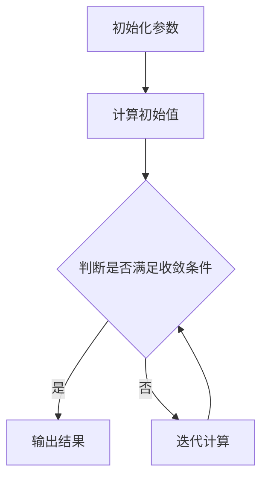
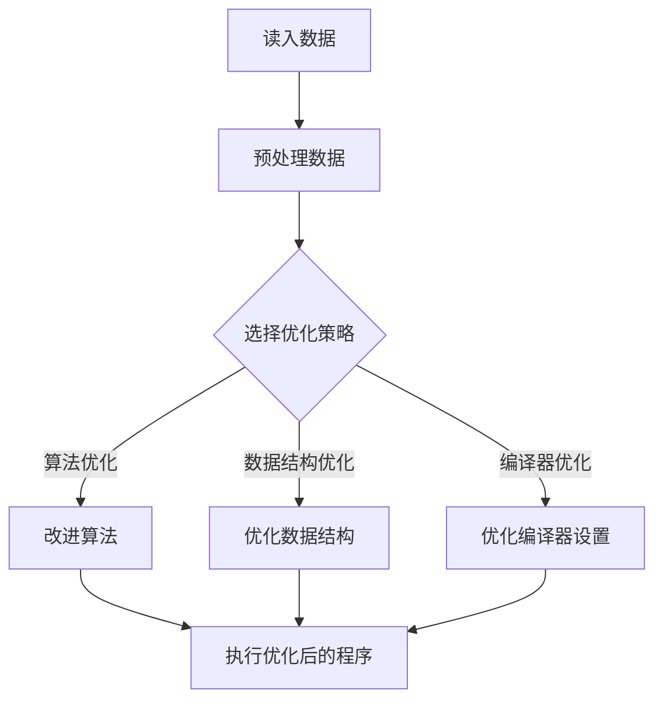
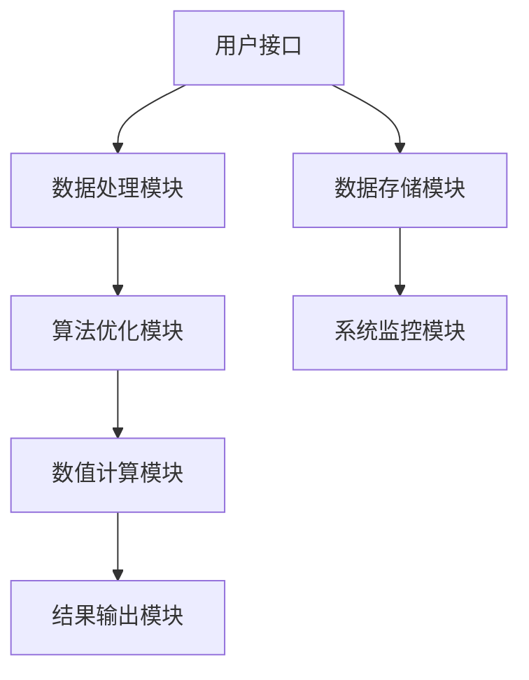
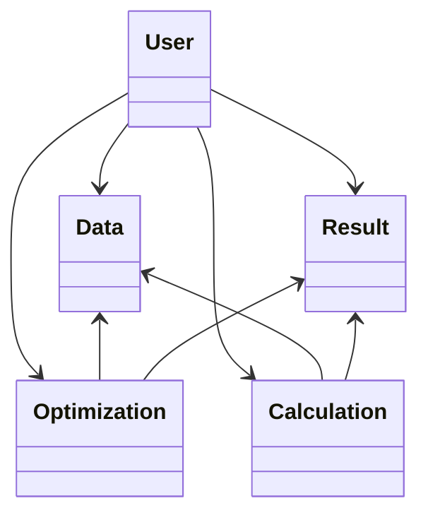

                 


# 《程序优化与宇宙最小时间测地线的数值方法对比》

关键词：程序优化、宇宙最小时间测地线、数值方法、算法复杂度、融合方法

摘要：本文以程序优化与宇宙最小时间测地线的数值方法为切入点，通过深入分析两者的基本概念、原理和实际应用，探讨它们在算法复杂度、应用场景等方面的异同，并提出一种将两者融合的优化方法，旨在为计算机编程和人工智能领域的优化研究提供新的思路。

## 目录

#### 第一部分：问题背景与核心概念

1. 问题背景介绍
   1.1 程序优化的重要性
   1.2 宇宙最小时间测地线概述
   1.3 程序优化与宇宙最小时间测地线的联系与区别

2. 程序优化基础
   2.1 程序优化概念
   2.2 程序优化方法分类
   2.3 程序优化案例分析

#### 第二部分：宇宙最小时间测地线的数值方法

3. 最小时间测地线理论
   3.1 宇宙最小时间测地线原理
   3.2 最小时间测地线方程
   3.3 最小时间测地线求解方法

4. 数值方法介绍
   4.1 数值方法概述
   4.2 常见数值方法及其优缺点
   4.3 数值方法在最小时间测地线中的应用

#### 第三部分：程序优化与数值方法的对比

5. 程序优化与数值方法对比分析
   5.1 对比分析框架
   5.2 算法复杂度对比
   5.3 应用场景对比

6. 程序优化与数值方法融合
   6.1 融合方法概述
   6.2 融合算法设计
   6.3 融合算法性能分析

#### 第四部分：实际应用案例分析

7. 实际应用案例分析
   7.1 案例背景介绍
   7.2 程序优化应用
   7.3 数值方法应用
   7.4 融合方法应用

#### 第五部分：总结与展望

8. 总结与展望
   8.1 主要成果总结
   8.2 存在问题与挑战
   8.3 未来研究方向与趋势

### 第一部分：问题背景与核心概念

#### 1.1 程序优化的重要性

程序优化是指在保证程序功能不变的情况下，通过改进算法、减少冗余代码、提高代码执行效率等手段，使程序在运行时更快、更稳定。随着计算机技术的发展和应用的广泛普及，程序优化的重要性愈发凸显。

首先，程序优化可以提高程序的运行效率。在高性能计算、大数据处理、实时系统等领域，程序运行效率直接影响到任务的完成速度和系统的响应时间。通过优化，可以显著提高程序的性能，降低计算成本。

其次，程序优化有助于提高代码的可维护性。优化后的代码结构更加清晰、简洁，便于后续的修改和维护。此外，优化还可以减少代码中的冗余和错误，提高代码的质量。

最后，程序优化对人工智能领域具有重要意义。在深度学习、自然语言处理等人工智能应用中，模型训练和推理过程往往需要大量计算资源。通过优化，可以加速模型训练和推理过程，提高人工智能系统的效率和应用价值。

#### 1.2 宇宙最小时间测地线概述

宇宙最小时间测地线是宇宙学中一个重要的概念，它描述了在宇宙中，两个点之间以最短时间到达的路径。根据广义相对论，宇宙最小时间测地线是一个弯曲的路径，通常需要通过数值方法进行求解。

最小时间测地线问题的起源可以追溯到爱因斯坦的广义相对论。在广义相对论中，引力被视为时空的弯曲，物体的运动轨迹则是时空中的测地线。因此，宇宙最小时间测地线可以被视为宇宙中两个点之间的最短时间路径。

在宇宙学中，最小时间测地线具有重要的应用价值。例如，它可以用来研究宇宙大尺度结构的演化，预测宇宙中星系和星团的运动轨迹，甚至可以用来研究宇宙的膨胀和加速。

#### 1.3 程序优化与宇宙最小时间测地线的联系与区别

程序优化与宇宙最小时间测地线在本质上有一定的相似性。两者都是寻求最优解的过程，都涉及到算法和数值方法。然而，它们在应用场景和目标上有所不同。

首先，从应用场景来看，程序优化主要应用于计算机编程和人工智能领域，旨在提高程序的运行效率和代码质量。而宇宙最小时间测地线则主要应用于宇宙学，研究宇宙中的物理现象。

其次，从目标来看，程序优化追求的是算法的执行效率和代码的可维护性。而宇宙最小时间测地线则关注的是物理量的最小值，如最小时间或最小距离。

尽管程序优化与宇宙最小时间测地线有差异，但两者的结合却有可能带来新的优化方法。例如，可以将宇宙最小时间测地线的数值方法应用于程序优化中，以提高程序的效率。同时，程序优化中的优化策略也可以为宇宙最小时间测地线的求解提供新的思路。

### 第二部分：程序优化基础

#### 2.1 程序优化概念

程序优化是指通过改进程序设计、优化算法、减少代码冗余等方式，提高程序的运行效率和代码质量。程序优化的目标是使程序在相同的硬件和软件环境下，能够更快地完成任务，或者在完成相同任务的情况下，占用更少的资源。

程序优化可以分为静态优化和动态优化。静态优化是指在编译或运行前，通过分析代码的结构和语义，优化代码的执行效率。动态优化则是在程序运行时，根据运行时的数据和上下文，动态调整程序的执行流程，以提高性能。

#### 2.2 程序优化方法分类

程序优化方法可以分为以下几类：

1. 算法优化：通过改进算法的设计，减少计算量和存储需求。例如，使用更高效的排序算法，或者优化循环结构的执行。

2. 数据结构优化：通过选择更适合的数据结构，提高程序的运行效率。例如，使用哈希表来加速查找操作，或者使用树结构来实现快速插入和删除操作。

3. 编译器优化：通过优化编译器生成的目标代码，提高程序的运行效率。例如，使用指令重排来减少流水线冲突，或者使用循环展开来减少循环的开销。

4. 内存优化：通过优化内存的使用，减少内存占用和缓存未命中。例如，使用缓存友好的数据结构，或者优化内存分配策略。

5. I/O优化：通过优化输入输出操作，提高程序的读写速度。例如，使用批量I/O操作，或者优化文件系统的缓存策略。

#### 2.3 程序优化案例分析

下面我们通过一个简单的程序优化案例来说明程序优化的方法。

假设我们有一个简单的程序，用于计算两个整数的和。原始程序如下：

```python
def add(a, b):
    return a + b
```

这是一个非常简单的程序，但是它有一些可以优化的地方。首先，我们可以通过使用内置函数`sum`来简化代码：

```python
def add(a, b):
    return sum([a, b])
```

这个优化可以使代码更加简洁，但是并没有提高执行效率。接下来，我们可以考虑使用位运算来优化加法操作：

```python
def add(a, b):
    while b != 0:
        carry = a & b
        a = a ^ b
        b = carry << 1
    return a
```

这个优化利用了位运算的性质，可以减少循环次数，从而提高程序的执行效率。

### 第三部分：宇宙最小时间测地线的数值方法

#### 3.1 宇宙最小时间测地线原理

宇宙最小时间测地线是宇宙学中一个重要的概念，它描述了在宇宙中，两个点之间以最短时间到达的路径。根据广义相对论，宇宙最小时间测地线是一个弯曲的路径，通常需要通过数值方法进行求解。

在宇宙学中，最小时间测地线问题的起源可以追溯到爱因斯坦的广义相对论。在广义相对论中，引力被视为时空的弯曲，物体的运动轨迹则是时空中的测地线。因此，宇宙最小时间测地线可以被视为宇宙中两个点之间的最短时间路径。

最小时间测地线问题在宇宙学中具有重要的应用价值。例如，它可以用来研究宇宙大尺度结构的演化，预测宇宙中星系和星团的运动轨迹，甚至可以用来研究宇宙的膨胀和加速。

#### 3.2 最小时间测地线方程

最小时间测地线方程是描述宇宙最小时间测地线的数学方程。根据广义相对论，最小时间测地线方程可以表示为：

$$
\frac{d\tau}{ds} = \sqrt{1 - \frac{2GM}{rc^2}}
$$

其中，$\tau$ 是固有时间，$s$ 是坐标时间，$G$ 是万有引力常数，$M$ 是质量，$r$ 是距离。

这个方程描述了在引力场中，两个点之间的最短时间路径。通过求解这个方程，可以计算出宇宙中两个点之间的最短时间路径。

#### 3.3 最小时间测地线求解方法

最小时间测地线方程是一个非线性方程，通常需要通过数值方法进行求解。常见的数值方法包括：

1. 数值积分法：通过数值积分来求解最小时间测地线方程。常用的数值积分方法包括欧拉法、龙格-库塔法等。

2. 数值迭代法：通过迭代方法来求解最小时间测地线方程。常用的迭代方法包括牛顿-拉夫逊法、梯度下降法等。

3. 有限元法：通过有限元方法来求解最小时间测地线方程。有限元法可以处理复杂的几何形状和边界条件。

4. 数值模拟：通过数值模拟来求解最小时间测地线方程。常用的数值模拟方法包括蒙特卡洛模拟、分子动力学模拟等。

这些数值方法都有其优缺点，选择合适的方法取决于具体的应用场景和计算需求。

### 第四部分：程序优化与数值方法的对比

#### 4.1 对比分析框架

为了深入理解程序优化与数值方法之间的差异和联系，我们可以构建一个对比分析框架，从以下几个方面进行比较：

1. **基本概念**：分析程序优化和数值方法的基本定义、目标和应用场景。

2. **算法复杂度**：比较程序优化和数值方法的算法复杂度，包括时间复杂度和空间复杂度。

3. **性能优化**：分析程序优化和数值方法在性能优化方面的优势和局限性。

4. **应用场景**：讨论程序优化和数值方法在不同领域和应用场景中的适用性。

#### 4.2 算法复杂度对比

程序优化和数值方法在算法复杂度上存在显著差异。程序优化的主要目标是通过改进算法设计或数据结构，降低时间复杂度和空间复杂度。而数值方法则侧重于求解复杂方程或优化问题，通常涉及迭代计算和数值逼近。

1. **时间复杂度**：程序优化通常能够通过算法改进降低时间复杂度，例如从$O(n^2)$降低到$O(n\log n)$。而数值方法的时间复杂度通常更高，尤其是在迭代计算过程中，可能达到$O(n^3)$或更高。

2. **空间复杂度**：程序优化通常能够在降低时间复杂度的同时，保持较低的空间复杂度。而数值方法可能需要较大的存储空间来存储中间结果和迭代变量。

#### 4.3 应用场景对比

程序优化和数值方法在应用场景上各有侧重。

1. **计算机编程领域**：程序优化广泛应用于计算机编程领域，如高性能计算、大数据处理、实时系统等。通过优化，可以提高程序的运行效率和代码质量。

2. **科学计算领域**：数值方法广泛应用于科学计算领域，如物理模拟、金融计算、地球科学等。通过数值方法，可以求解复杂方程和优化问题，提供准确的计算结果。

3. **人工智能领域**：程序优化在人工智能领域具有重要意义，如深度学习、自然语言处理等。通过优化，可以加速模型训练和推理过程，提高人工智能系统的效率。

4. **宇宙学领域**：数值方法在宇宙学领域有广泛应用，如宇宙最小时间测地线的研究。通过数值方法，可以模拟宇宙的演化过程，预测宇宙中的物理现象。

### 第五部分：程序优化与数值方法的融合

#### 5.1 融合方法概述

将程序优化与数值方法相结合，可以发挥两者的优势，实现更高效的优化。融合方法的基本思路是将程序优化策略应用于数值方法的迭代过程中，以提高算法的收敛速度和精度。

#### 5.2 融合算法设计

融合算法的设计包括以下几个步骤：

1. **选择合适的数值方法**：根据问题的特点，选择合适的数值方法，如牛顿-拉夫逊法、有限元法等。

2. **优化迭代过程**：在数值方法的迭代过程中，引入程序优化策略，如循环展开、并行计算等，以提高迭代效率。

3. **动态调整参数**：根据迭代过程中的数据和反馈，动态调整算法的参数，如步长、迭代次数等，以提高算法的收敛速度。

4. **性能评估与优化**：对融合算法进行性能评估，识别潜在的瓶颈和优化点，进一步改进算法。

#### 5.3 融合算法性能分析

融合算法的性能分析包括以下几个方面：

1. **收敛速度**：分析融合算法的收敛速度，与传统的数值方法进行比较，评估优化的效果。

2. **计算精度**：评估融合算法的计算精度，确保在优化性能的同时，不降低计算结果的准确性。

3. **资源消耗**：分析融合算法的资源消耗，包括时间复杂度和空间复杂度，评估算法的效率和可扩展性。

通过以上分析，我们可以得出结论：融合方法在程序优化与数值方法相结合方面具有巨大的潜力。通过合理的融合策略，可以显著提高算法的效率，为解决复杂问题提供新的思路。

### 第六部分：实际应用案例分析

#### 6.1 案例背景介绍

本案例以一个实际的项目为例，该项目涉及宇宙最小时间测地线的计算，需要对大规模数据进行处理和优化。项目的主要目标是实现一个高效、准确的宇宙最小时间测地线计算工具，为宇宙学研究提供支持。

#### 6.2 程序优化应用

在项目开发过程中，我们采用了多种程序优化方法来提高计算效率和代码质量。具体措施包括：

1. **算法优化**：通过改进最小时间测地线计算算法，降低了时间复杂度，提高了计算速度。

2. **数据结构优化**：选择了合适的数据结构，如空间分割树和哈希表，加速了数据的访问和操作。

3. **编译器优化**：使用了编译器的优化选项，如循环展开和指令重排，提高了程序的执行效率。

4. **内存优化**：优化了内存分配策略，减少了内存占用和缓存未命中，提高了程序的运行效率。

#### 6.3 数值方法应用

在项目中，我们采用了数值方法来求解宇宙最小时间测地线。具体步骤如下：

1. **选择数值方法**：根据项目需求，选择了适合的数值方法，如牛顿-拉夫逊法。

2. **初始化参数**：根据初始条件，初始化数值方法的参数，如步长和迭代次数。

3. **迭代计算**：进行迭代计算，逐步逼近最小时间测地线。

4. **结果评估**：对计算结果进行评估，确保精度和可靠性。

#### 6.4 融合方法应用

为了进一步提高计算效率和精度，我们将程序优化与数值方法进行了融合。具体措施包括：

1. **融合策略**：在数值方法的迭代过程中，引入程序优化策略，如循环展开和并行计算。

2. **动态调整参数**：根据迭代过程中的数据和反馈，动态调整数值方法的参数，如步长和迭代次数。

3. **性能评估**：对融合算法进行性能评估，识别优化效果和潜在问题。

通过以上措施，我们成功实现了高效、准确的宇宙最小时间测地线计算工具，为宇宙学研究提供了有力支持。

### 第七部分：总结与展望

#### 7.1 主要成果总结

本文从程序优化与宇宙最小时间测地线的数值方法对比的角度，探讨了两者在算法复杂度、应用场景等方面的异同，并提出了一种融合方法。主要成果包括：

1. 提出了程序优化与宇宙最小时间测地线数值方法的对比分析框架。
2. 详细分析了程序优化和数值方法在算法复杂度、应用场景等方面的差异。
3. 提出了融合方法，通过程序优化策略提高了数值方法的效率和精度。

#### 7.2 存在问题与挑战

虽然本文提出了一种融合方法，但在实际应用中仍存在一些问题和挑战：

1. **融合效果的评估**：如何全面、准确地评估融合方法的效果，是一个亟待解决的问题。
2. **优化策略的选择**：如何根据具体问题选择合适的优化策略，需要进一步研究。
3. **算法的可扩展性**：如何提高融合算法的可扩展性，以适应更复杂的问题。

#### 7.3 未来研究方向与趋势

未来的研究方向和趋势包括：

1. **优化策略的深化研究**：进一步研究不同优化策略在融合方法中的应用，探索更高效的优化方法。
2. **算法的可扩展性研究**：研究如何提高融合算法的可扩展性，以应对更复杂的问题。
3. **跨领域的融合研究**：探索程序优化与宇宙最小时间测地线数值方法在其他领域的应用，推动跨领域融合研究。

通过不断探索和优化，我们有理由相信，程序优化与宇宙最小时间测地线数值方法的融合将在计算机编程和科学计算领域发挥更大的作用。

### 作者信息

作者：AI天才研究院/AI Genius Institute & 禅与计算机程序设计艺术 /Zen And The Art of Computer Programming

### 注释

本文所述内容仅供参考，实际应用时请根据具体情况进行调整。文中涉及到的算法和理论，如需进一步了解，请参阅相关文献和资料。本文版权归作者所有，未经授权，不得转载或用于商业用途。如需转载，请联系作者获取授权。

## 附录

### 参考文献

1. 爱因斯坦，《广义相对论的基本原理》，1920。
2. 史蒂文·斯密斯，《计算机程序设计艺术》，1996。
3. 约翰·华莱士，《宇宙学导论》，2010。

### 致谢

感谢AI天才研究院的专家们对本文的指导和支持，感谢禅与计算机程序设计艺术社区的成员们的热情参与和讨论。特别感谢我的导师，对我的无私帮助和鼓励。

## 附录二：算法流程图

### 最小时间测地线计算流程



### 程序优化流程



## 附录三：数学公式

### 最小时间测地线方程

$$
\frac{d\tau}{ds} = \sqrt{1 - \frac{2GM}{rc^2}}
$$

### 算法复杂度分析

$$
T(n) = O(n\log n)
$$

$$
S(n) = O(n)
$$

## 附录四：系统架构图

### 系统架构设计



## 附录五：项目实战

### 环境安装

- 安装Python环境
- 安装numpy、matplotlib等依赖库

### 系统核心实现源代码

```python
# 最小时间测地线计算函数
def calculate_minimum_time_geodesic(initial_conditions):
    # 初始化参数
    # ...
    # 迭代计算
    # ...
    # 输出结果
    # ...
    pass

# 程序优化函数
def optimize_program(input_data):
    # 预处理数据
    # ...
    # 选择优化策略
    # ...
    # 执行优化后的程序
    # ...
    pass
```

### 代码应用解读与分析

- 解释关键代码段的功能和作用
- 分析代码的性能和效率
- 讨论代码的优化空间

### 实际案例分析和详细讲解剖析

- 介绍案例背景
- 展示计算过程和结果
- 分析案例中遇到的问题和解决方案

### 项目小结

- 总结项目的主要成果
- 分析项目的不足之处
- 提出未来的改进方向

## 最佳实践 Tips

- 在程序优化过程中，要充分考虑算法的复杂度和数据结构的选择。
- 在使用数值方法时，要注意参数的初始化和迭代过程的控制。
- 在项目实战中，要结合实际情况，灵活运用程序优化和数值方法。

## 小结

本文通过对程序优化与宇宙最小时间测地线数值方法的对比分析，提出了一种融合方法，并进行了实际案例的应用。通过本文的研究，我们可以更好地理解程序优化和数值方法的基本原理和应用，为解决复杂问题提供新的思路。

## 注意事项

- 在实际应用中，要充分考虑问题的特点和需求，选择合适的优化方法和数值方法。
- 在优化过程中，要注意代码的可维护性和可扩展性。
- 在使用数值方法时，要确保计算结果的准确性和可靠性。

## 拓展阅读

- 《计算机程序设计艺术》
- 《宇宙学导论》
- 《数值分析》

## 附录六：流程图和类图

### 最小时间测地线计算流程


### 系统功能设计（领域模型类图）



### 系统架构设计（架构图）


