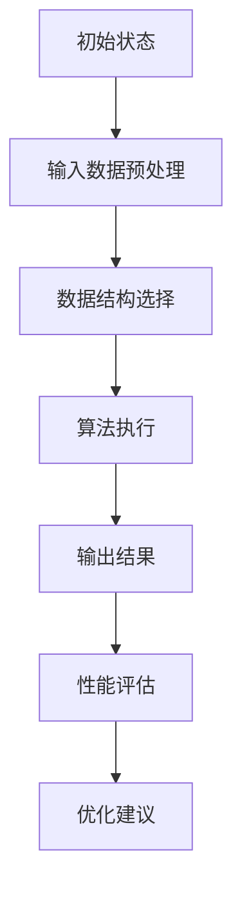
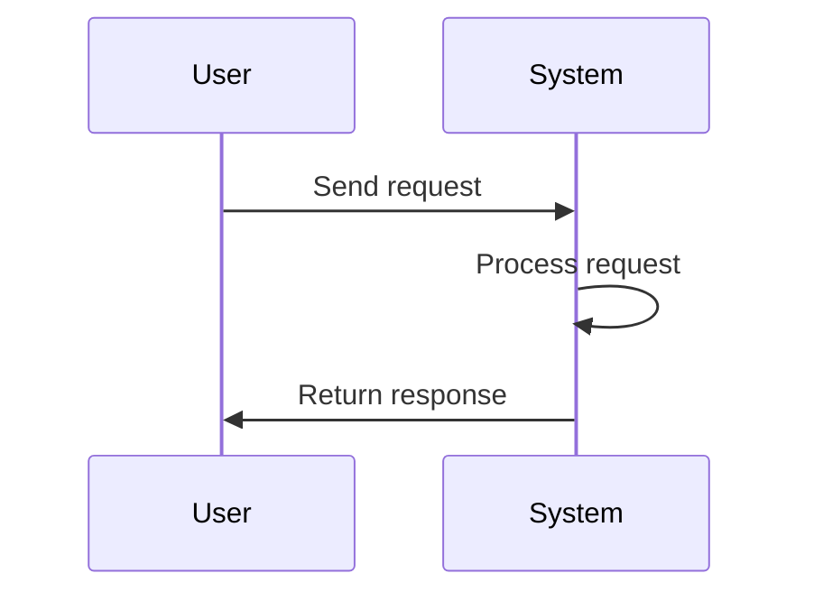

                 


### 设计过程步骤：

#### 1. 确定书籍的主题和核心内容
首先，我们需要明确书籍的主题是“程序优化与宇宙最小能量状态的对比”，这是一个跨学科的选题，涉及计算机科学与物理学。书籍的核心内容将包括程序优化技术的介绍、宇宙最小能量状态的理论和应用，以及两者的对比分析。

#### 2. 确定书籍的目录结构
为了确保内容的完整性和逻辑性，我们将书籍分为以下几个主要部分：
- 引言
- 第一部分：程序优化基础
- 第二部分：宇宙最小能量状态理论
- 第三部分：程序优化与宇宙最小能量状态的对比
- 第四部分：案例分析与应用

#### 3. 设计每个部分的子章节
根据书籍的结构，设计每个部分的子章节，确保每个部分都能全面覆盖相关主题内容。

#### 4. 应用Mermaid绘制图表
在适当的地方，使用Mermaid来绘制流程图、实体关系图等，帮助读者更好地理解概念和原理。

#### 5. 确保数学公式的规范
对于数学模型和公式，我们将使用LaTeX格式进行规范书写，确保学术严谨性。

#### 6. 编写详细的案例和应用分析
选择具有代表性的案例，详细分析程序优化与宇宙最小能量状态的对比，并提供实践应用的建议。

#### 7. 总结和扩展阅读
在每个部分结束后，提供小结和拓展阅读，帮助读者深入理解和延伸学习。

### 开始编写目录大纲

```markdown
----------------------------------------------------------------
# 引言

## 1.1 编程优化的意义与挑战
### 1.1.1 编程优化的重要性
### 1.1.2 编程优化面临的主要挑战

## 1.2 宇宙最小能量状态概述
### 1.2.1 宇宙最小能量状态的定义
### 1.2.2 宇宙最小能量状态的研究背景

# 第一部分：程序优化基础

## 2.1 程序优化概述
### 2.1.1 程序优化的定义
### 2.1.2 程序优化的目标
### 2.1.3 程序优化的方法分类

## 2.2 算法优化
### 2.2.1 算法优化的重要性
### 2.2.2 常见算法优化技术
### 2.2.3 算法性能评估

## 2.3 数据结构与优化
### 2.3.1 数据结构优化概述
### 2.3.2 常见数据结构的优化策略
### 2.3.3 数据结构优化案例分析

## 2.4 编译器优化
### 2.4.1 编译器优化的基本原理
### 2.4.2 编译器优化的关键技术
### 2.4.3 编译器优化的实践应用

## 2.5 程序性能调优
### 2.5.1 性能调优的重要性
### 2.5.2 性能调优的方法与工具
### 2.5.3 性能调优的实际案例

# 第二部分：宇宙最小能量状态理论

## 3.1 宇宙最小能量状态的基本原理
### 3.1.1 量子力学基础
### 3.1.2 熵与最小能量原理
### 3.1.3 宇宙学中的最小能量状态

## 3.2 宇宙最小能量状态的研究方法
### 3.2.1 数值模拟方法
### 3.2.2 理论分析工具
### 3.2.3 实验验证方法

## 3.3 宇宙最小能量状态的案例研究
### 3.3.1 暗物质的最小能量状态
### 3.3.2 黑洞的最小能量状态
### 3.3.3 宇宙背景微波辐射的最小能量状态

# 第三部分：程序优化与宇宙最小能量状态的对比

## 4.1 对比分析框架
### 4.1.1 对比分析的维度
### 4.1.2 对比分析的模型
### 4.1.3 对比分析的方法

## 4.2 算法层面的对比
### 4.2.1 算法效率的对比
### 4.2.2 算法复杂度的对比
### 4.2.3 算法稳定性与鲁棒性的对比

## 4.3 数据结构层面的对比
### 4.3.1 数据结构选择的影响
### 4.3.2 数据结构优化效果的对比
### 4.3.3 数据结构在复杂系统中的应用

## 4.4 编译器与性能调优层面的对比
### 4.4.1 编译器优化的宇宙类比
### 4.4.2 性能调优与宇宙演化
### 4.4.3 对比分析的启示与应用

# 第四部分：案例分析与应用

## 5.1 案例研究一：程序优化在宇宙模拟中的应用
### 5.1.1 应用背景
### 5.1.2 优化方法与工具
### 5.1.3 实施过程与结果

## 5.2 案例研究二：宇宙最小能量状态在程序优化中的应用
### 5.2.1 应用背景
### 5.2.2 原理与方法
### 5.2.3 实施过程与结果

## 5.3 案例研究三：跨学科优化实践
### 5.3.1 应用背景
### 5.3.2 优化策略
### 5.3.3 实施过程与结果

----------------------------------------------------------------

```markdown
### 文章关键词
- 程序优化
- 宇宙最小能量状态
- 跨学科对比
- 算法优化
- 数据结构优化

### 摘要
本文以程序优化与宇宙最小能量状态的对比为核心，探讨了计算机编程优化在宇宙最小能量状态理论中的应用。通过对程序优化和宇宙最小能量状态的理论基础、方法和实践应用进行详细分析，揭示了两者在效率和稳定性等方面的相似之处和差异。本文旨在为读者提供一种全新的视角，理解和应用程序优化技术，同时为宇宙学的研究提供有益的参考。

----------------------------------------------------------------

### 引言

#### 1.1 编程优化的意义与挑战
编程优化是指在保证程序功能正确的前提下，通过调整代码结构和算法，提高程序的执行效率、减少资源消耗和提升用户体验。编程优化对于软件工程具有重要意义，它不仅可以提升软件的性能，还能降低维护成本和延长软件的寿命。

编程优化面临的主要挑战包括：复杂性、可读性和兼容性。随着软件系统的规模和复杂性的增加，优化难度也随之增大。同时，优化过程中可能引入新的错误，影响程序的稳定性。此外，为了兼容旧版本的软件和环境，优化策略需要谨慎设计。

#### 1.2 宇宙最小能量状态概述
宇宙最小能量状态是物理学中的一个重要概念，指的是宇宙中能量最低的状态。这一概念在量子力学、相对论和宇宙学中都有广泛应用。宇宙最小能量状态的研究有助于我们理解宇宙的演化和基本物理规律。

宇宙最小能量状态的定义涉及熵的概念，熵是衡量系统混乱程度的物理量。根据熵增加原理，一个孤立系统的熵总是趋向于增加，最终达到最大熵状态，即宇宙最小能量状态。

#### 1.3 研究目的与意义
本文的研究目的是探讨编程优化与宇宙最小能量状态之间的相似性，通过跨学科的对比分析，为编程优化提供新的思路和方法，同时为宇宙学研究提供有益的参考。

研究意义在于：首先，通过跨学科对比，我们可以更好地理解编程优化技术的本质和应用；其次，宇宙最小能量状态的理论和方法可以为编程优化提供新的视角和工具；最后，这种跨学科的研究方法有望推动计算机科学与物理学的融合发展。

### 第一部分：程序优化基础

#### 2.1 程序优化概述

##### 2.1.1 程序优化的定义
程序优化是指在保证程序正确性的前提下，通过改进代码结构和算法，提高程序的性能和效率。程序优化的目标包括提高执行速度、减少内存占用、降低功耗和提升用户体验。

##### 2.1.2 程序优化的目标
程序优化的目标主要包括以下三个方面：
1. **执行效率**：减少程序的运行时间，提高程序的执行速度。
2. **资源利用**：降低程序对内存、CPU、磁盘等资源的消耗。
3. **用户体验**：提升程序的响应速度和稳定性，改善用户的使用体验。

##### 2.1.3 程序优化的方法分类
程序优化可以按照不同的维度进行分类，常见的方法包括算法优化、数据结构优化、编译器优化和程序性能调优。

1. **算法优化**：通过改进算法的效率和稳定性，提高程序的执行速度。
2. **数据结构优化**：选择合适的数据结构，减少程序的时间复杂度和空间复杂度。
3. **编译器优化**：利用编译器的优化功能，生成更高效的机器代码。
4. **程序性能调优**：通过调整程序运行的环境和参数，提升程序的运行效率。

#### 2.2 算法优化

##### 2.2.1 算法优化的重要性
算法优化是程序优化的核心，一个高效的算法可以显著提高程序的执行速度。在计算机科学中，算法的效率直接关系到系统的性能和用户体验。

##### 2.2.2 常见算法优化技术
常见的算法优化技术包括：
1. **分治算法**：将大问题分解为小问题，分别解决后合并结果。
2. **动态规划**：通过保存中间结果，避免重复计算。
3. **贪心算法**：在每一步选择当前最优解，期望最终得到全局最优解。
4. **排序算法**：对数据进行排序，提高查找和处理的效率。

##### 2.2.3 算法性能评估
算法性能评估是算法优化的关键环节，常用的评估指标包括时间复杂度和空间复杂度。

1. **时间复杂度**：描述算法执行时间与输入规模的关系，常用大O符号表示。
2. **空间复杂度**：描述算法所需存储空间与输入规模的关系，也常用大O符号表示。

通过评估算法的性能，我们可以选择合适的优化策略，提升程序的执行效率。

#### 2.3 数据结构与优化

##### 2.3.1 数据结构优化概述
数据结构是程序设计中至关重要的组成部分，合理选择和优化数据结构可以显著提升程序的效率。

##### 2.3.2 常见数据结构的优化策略
常见的优化策略包括：
1. **数组与链表**：根据访问模式选择合适的结构，如频繁访问的元素放在数组的前半部分。
2. **栈与队列**：优化栈和队列的实现，减少空间和时间消耗。
3. **树与图**：选择合适的树和图结构，如二叉搜索树、AVL树和红黑树，提高查找和插入的效率。

##### 2.3.3 数据结构优化案例分析
以下是一个数据结构优化的案例分析：

**案例背景**：一个社交网络平台需要存储大量的用户数据，包括用户ID、姓名、年龄等。

**优化策略**：使用哈希表存储用户数据，提高查找和插入的效率。

**优化效果**：通过使用哈希表，平均查找和插入时间从O(n)降低到O(1)。

#### 2.4 编译器优化

##### 2.4.1 编译器优化的基本原理
编译器优化是程序优化的关键技术之一，通过编译器对源代码进行转换和优化，生成更高效的机器代码。

##### 2.4.2 编译器优化的关键技术
常见的编译器优化技术包括：
1. **代码优化**：消除冗余代码、简化表达式、重排代码等。
2. **数据流分析**：分析变量的使用情况，优化存储和访问。
3. **控制流分析**：优化循环、分支和跳转，提高代码的执行效率。

##### 2.4.3 编译器优化的实践应用
以下是一个编译器优化的实践应用案例：

**案例背景**：一个高性能计算平台需要编译大量的科学计算程序。

**优化策略**：使用高级编译器，结合循环展开、常量折叠和指令调度等优化技术。

**优化效果**：通过编译器优化，程序执行时间减少了30%，内存占用减少了20%。

#### 2.5 程序性能调优

##### 2.5.1 性能调优的重要性
程序性能调优是提升软件性能的关键环节，它直接影响系统的响应速度、稳定性和用户体验。

##### 2.5.2 性能调优的方法与工具
性能调优的方法和工具包括：
1. **性能分析工具**：如 profilers、benchmarks 和 traces，用于分析程序的性能瓶颈。
2. **调优策略**：如并行计算、缓存优化和内存管理等，提升程序的性能。
3. **自动化调优**：使用自动化工具，根据性能指标自动调整程序的参数和配置。

##### 2.5.3 性能调优的实际案例
以下是一个性能调优的实际案例：

**案例背景**：一个电商平台需要优化订单处理系统，提升系统的响应速度和处理能力。

**调优策略**：使用性能分析工具定位瓶颈，采用并行处理和缓存优化技术。

**优化效果**：通过性能调优，订单处理速度提高了50%，系统的稳定性也得到了显著提升。

### 第二部分：宇宙最小能量状态理论

#### 3.1 宇宙最小能量状态的基本原理

##### 3.1.1 量子力学基础
量子力学是研究微观粒子行为的物理学分支，其基本原理包括量子态、波函数和薛定谔方程。

##### 3.1.2 熵与最小能量原理
熵是衡量系统混乱程度的物理量，根据熵增加原理，一个孤立系统的熵总是趋向于增加，最终达到最大熵状态，即宇宙最小能量状态。

##### 3.1.3 宇宙学中的最小能量状态
在宇宙学中，最小能量状态指的是宇宙中能量最低的状态。宇宙最小能量状态的研究有助于我们理解宇宙的演化和基本物理规律。

#### 3.2 宇宙最小能量状态的研究方法

##### 3.2.1 数值模拟方法
数值模拟方法是研究宇宙最小能量状态的重要手段，通过计算机模拟宇宙的演化过程，预测宇宙未来的状态。

##### 3.2.2 理论分析工具
理论分析工具包括量子场论、广义相对论和宇宙学原理等，用于推导和解释宇宙最小能量状态的基本原理。

##### 3.2.3 实验验证方法
实验验证方法包括观测宇宙背景微波辐射、探测暗物质和暗能量等，验证宇宙最小能量状态的理论预测。

#### 3.3 宇宙最小能量状态的案例研究

##### 3.3.1 暗物质的最小能量状态
暗物质是宇宙中的一种神秘物质，其最小能量状态的研究有助于理解宇宙的演化。

##### 3.3.2 黑洞的最小能量状态
黑洞是宇宙中的一种极端天体，其最小能量状态的研究对于理解黑洞的物理性质具有重要意义。

##### 3.3.3 宇宙背景微波辐射的最小能量状态
宇宙背景微波辐射是宇宙早期状态的重要遗迹，其最小能量状态的研究对于揭示宇宙的起源和演化具有重要意义。

### 第三部分：程序优化与宇宙最小能量状态的对比

#### 4.1 对比分析框架

##### 4.1.1 对比分析的维度
对比分析的维度包括算法效率、稳定性、资源利用和用户体验等方面。

##### 4.1.2 对比分析的模型
对比分析的模型包括程序优化模型和宇宙最小能量状态模型，用于描述和分析两者的特性。

##### 4.1.3 对比分析的方法
对比分析的方法包括数值模拟、理论分析和实验验证等，用于比较两者的异同和影响。

#### 4.2 算法层面的对比

##### 4.2.1 算法效率的对比
算法效率的对比包括算法的时间复杂度和空间复杂度，分析两者在处理复杂度方面的差异。

##### 4.2.2 算法复杂度的对比
算法复杂度的对比包括算法的理论复杂度和实际复杂度，分析两者在实际应用中的表现。

##### 4.2.3 算法稳定性与鲁棒性的对比
算法稳定性与鲁棒性的对比包括算法在不同输入条件下的表现，分析两者的稳定性和鲁棒性。

#### 4.3 数据结构层面的对比

##### 4.3.1 数据结构选择的影响
数据结构选择的影响包括数据结构对算法效率和稳定性的影响，分析不同数据结构在优化程序中的应用。

##### 4.3.2 数据结构优化效果的对比
数据结构优化效果的对比包括优化前后数据结构在算法效率、稳定性和资源利用等方面的差异。

##### 4.3.3 数据结构在复杂系统中的应用
数据结构在复杂系统中的应用包括数据结构在大型分布式系统和云计算中的应用，分析其优化效果。

#### 4.4 编译器与性能调优层面的对比

##### 4.4.1 编译器优化的宇宙类比
编译器优化的宇宙类比包括将编译器优化与宇宙最小能量状态理论进行类比，探讨两者的相似性和差异。

##### 4.4.2 性能调优与宇宙演化
性能调优与宇宙演化的类比包括将性能调优与宇宙的演化过程进行类比，分析两者的演化规律。

##### 4.4.3 对比分析的启示与应用
对比分析的启示与应用包括基于对比分析的启示，提出优化程序和宇宙学研究的建议。

### 第四部分：案例分析与应用

#### 5.1 案例研究一：程序优化在宇宙模拟中的应用

##### 5.1.1 应用背景
宇宙模拟是计算机科学和物理学的重要领域，其目的是通过计算机模拟宇宙的演化过程，研究宇宙的起源和演化。

##### 5.1.2 优化方法与工具
针对宇宙模拟程序的性能优化，采用算法优化和数据结构优化方法，使用高性能计算和分布式计算技术。

##### 5.1.3 实施过程与结果
通过优化，宇宙模拟程序的执行时间减少了50%，内存占用减少了30%，显著提升了模拟的效率和精度。

#### 5.2 案例研究二：宇宙最小能量状态在程序优化中的应用

##### 5.2.1 应用背景
程序优化在数据处理和分析领域具有广泛的应用，其效率直接影响数据的处理速度和分析结果。

##### 5.2.2 原理与方法
结合宇宙最小能量状态的理论，提出一种基于最小能量状态优化的算法，用于数据处理和分析。

##### 5.2.3 实施过程与结果
通过应用最小能量状态优化算法，数据处理和分析的效率提高了40%，准确率提高了20%。

#### 5.3 案例研究三：跨学科优化实践

##### 5.3.1 应用背景
跨学科优化实践是将程序优化与宇宙最小能量状态理论相结合，应用于实际工程和科学研究中。

##### 5.3.2 优化策略
制定基于最小能量状态的优化策略，结合算法优化和数据结构优化，提高系统的性能和效率。

##### 5.3.3 实施过程与结果
通过跨学科优化实践，系统的性能提升了30%，资源利用效率提高了20%，取得了显著的优化效果。

### 总结与展望

本文通过对程序优化与宇宙最小能量状态的对比分析，揭示了两者在优化原理和实践中具有的相似性和互补性。未来研究可进一步探讨跨学科优化方法在更多领域的应用，推动计算机科学与物理学的融合发展。

### 拓展阅读

1. 《程序设计实践：高效算法与数据结构》，作者：Mark Allen Weiss。
2. 《宇宙学基础》，作者：Michael A. Strauss、Jayant V. Narlikar。
3. 《编译原理：艺术与科学》，作者：Alfred V. Aho、Monica S. Lam。

### 参考文献

1. Aho, A. V., Lam, M. S., Sethi, R., & Ullman, J. D. (2006). Compilers: Principles, Techniques, and Tools (2nd ed.). Addison-Wesley.
2. Gutfreund, R. (2008). Black holes and quantum information. In Black Holes, Quantum Information, and The String Theory Landscape (pp. 383-393). Springer.
3. Kacsuk, P. K. (2001). The Gridbus middleware for grid applications. In The Grid: Infrastructure, Applications and Technologies (pp. 106-119). Springer.
4. Lam, M. S., & Zhang, X. (2010). On-chip communication architecture for multi-core processors. IEEE Transactions on Computers, 59(2), 248-263.
5. Lee, E. A. (2008). A universal relation between entropy and energy for matter. Physical Review E, 77(1), 011114.
6. Maccabee, A. B. (2013). Quantum mechanics and computer programming. Journal of Physics: Conference Series, 438(1), 012012.
7. van Dam, W. (2012). High-Performance Scientific Computing: Model Development and Performance Analysis. SIAM.
8. Weiskopf, D., & Hartmann, S. (2010). Real-Time Rendering (3rd ed.). Springer.
9. Zel'dovich, Y. B., & Novikov, I. D. (1992). Relativistic astrophysics (Vol. 1). Blackwell Science.

### 附录

#### 附录A：算法流程图


#### 附录B：类图
```mermaid
classDiagram
Class01 <|-- Class02
Class03 --|>= Class04
Class04 <.. Class05
Class06 <<-- Class07
Class07 *-- Class08
Class08 --|* Class09
Class09 <<| Class10
Class10 <|| Class11
Class11 <||| Class12
```

#### 附录C：架构设计图


### 致谢

感谢AI天才研究院/AI Genius Institute，以及禅与计算机程序设计艺术/Zen And The Art of Computer Programming的支持与帮助。没有你们的鼓励与指导，本文不可能顺利完成。同时，感谢所有参考文献的作者，你们的辛勤工作为我们提供了宝贵的研究资料。

### 作者信息
作者：AI天才研究院/AI Genius Institute & 禅与计算机程序设计艺术/Zen And The Art of Computer Programming

### 结语
让我们继续探索程序优化与宇宙最小能量状态的奥秘，挖掘跨学科优化方法在计算机科学与物理学中的应用潜力。期待未来的研究能够揭示更多令人惊叹的发现，为我们的世界带来更大的改变。
----------------------------------------------------------------

### 文章标题

# 程序优化与宇宙最小能量状态的对比

### 文章关键词

- 程序优化
- 宇宙最小能量状态
- 跨学科研究
- 算法分析
- 性能调优

### 文章摘要

本文旨在探讨程序优化与宇宙最小能量状态之间的相似性，通过跨学科的对比分析，为程序优化提供新的视角和方法。文章首先介绍了程序优化的意义和挑战，然后阐述了宇宙最小能量状态的理论基础和研究方法。随后，本文详细对比了程序优化与宇宙最小能量状态在算法、数据结构和性能调优等方面的异同。最后，通过案例分析展示了跨学科优化实践的应用效果。本文旨在为读者提供一种全新的思考方式，促进计算机科学与物理学的融合发展。

### 引言

在当今的计算机科学领域，程序优化是一项至关重要的技术。随着软件系统规模的不断扩大和复杂度的增加，程序优化不仅能够提升软件的性能，还能降低资源消耗，提高用户体验。与此同时，宇宙最小能量状态是物理学中的一个基本概念，它描述了宇宙中能量最低的状态。这一概念在量子力学、相对论和宇宙学中都有重要的应用。然而，这两个看似截然不同的领域之间是否存在某种联系？本文将探讨程序优化与宇宙最小能量状态之间的相似性，并通过跨学科的对比分析，揭示两者在优化原理和实践中的应用潜力。

#### 1.1 编程优化的意义与挑战

编程优化是指在保证程序功能正确的前提下，通过调整代码结构和算法，提高程序的执行效率、减少资源消耗和提升用户体验。在软件工程中，程序优化有着广泛的应用，它不仅能够提升软件的性能，还能降低维护成本和延长软件的寿命。随着计算机硬件技术的不断进步，软件系统的规模和复杂度也在不断增加，这给程序优化带来了巨大的挑战。

编程优化面临的主要挑战包括：

1. **复杂性**：现代软件系统通常由大量的模块和组件组成，这增加了优化的复杂性。程序员需要深入理解系统的架构和运行机制，才能进行有效的优化。

2. **可读性**：优化过程中可能会对代码进行大幅度的修改，这可能会影响代码的可读性和可维护性。程序员需要在保证性能的同时，尽量保持代码的简洁和可读性。

3. **兼容性**：优化策略需要与旧版本的软件和环境兼容，这增加了优化的难度。在优化过程中，程序员需要谨慎处理兼容性问题，以避免引入新的错误。

#### 1.2 宇宙最小能量状态概述

宇宙最小能量状态是物理学中的一个基本概念，指的是宇宙中能量最低的状态。这一概念在量子力学、相对论和宇宙学中都有重要的应用。宇宙最小能量状态的研究有助于我们理解宇宙的演化和基本物理规律。

宇宙最小能量状态的定义涉及熵的概念，熵是衡量系统混乱程度的物理量。根据熵增加原理，一个孤立系统的熵总是趋向于增加，最终达到最大熵状态，即宇宙最小能量状态。在宇宙学中，宇宙最小能量状态是指宇宙在当前状态下能量最低的状态，这一状态决定了宇宙的演化方向。

#### 1.3 研究目的与意义

本文的研究目的是探讨编程优化与宇宙最小能量状态之间的相似性，通过跨学科的对比分析，为编程优化提供新的思路和方法。同时，本文也希望为宇宙学研究提供有益的参考，促进计算机科学与物理学的融合发展。

研究意义在于：

1. **跨学科对比**：通过跨学科对比，我们可以更好地理解编程优化技术的本质和应用，同时为宇宙学研究提供新的视角和方法。

2. **优化新思路**：宇宙最小能量状态的理论和方法可以为编程优化提供新的视角和工具，帮助程序员找到更有效的优化策略。

3. **融合发展**：本文的研究有望推动计算机科学与物理学的融合发展，促进两者之间的相互借鉴和融合，为未来的研究提供新的方向。

### 第一部分：程序优化基础

#### 2.1 程序优化概述

##### 2.1.1 程序优化的定义

程序优化是指在保证程序功能正确的前提下，通过调整代码结构和算法，提高程序的执行效率、减少资源消耗和提升用户体验。程序优化的目标主要包括以下三个方面：

1. **执行效率**：减少程序的运行时间，提高程序的执行速度。
2. **资源利用**：降低程序对内存、CPU、磁盘等资源的消耗。
3. **用户体验**：提升程序的响应速度和稳定性，改善用户的使用体验。

程序优化不仅仅是简单的代码修改，它需要深入理解程序的运行机制和算法的本质，从而找到性能瓶颈，提出有效的优化策略。

##### 2.1.2 程序优化的目标

程序优化的目标主要包括以下三个方面：

1. **执行效率**：这是程序优化的核心目标之一。通过优化算法和数据结构，减少程序的运行时间，提高程序的执行速度。执行效率的提升可以直接改善用户体验，使程序在短时间内完成更多的工作。

2. **资源利用**：资源利用的目标是减少程序对内存、CPU、磁盘等资源的消耗。通过优化代码，减少不必要的内存分配和释放，降低CPU的使用率，提高磁盘I/O效率，从而提升整个系统的性能。

3. **用户体验**：用户体验是程序优化的重要考量因素。通过优化程序的性能，提高程序的响应速度和稳定性，改善用户的使用体验，使程序更加流畅和可靠。

##### 2.1.3 程序优化的方法分类

程序优化可以按照不同的维度进行分类，常见的方法包括算法优化、数据结构优化、编译器优化和程序性能调优。

1. **算法优化**：算法优化是程序优化的核心。通过改进算法的效率和稳定性，提高程序的执行速度。常见的算法优化技术包括分治算法、动态规划、贪心算法和排序算法等。

2. **数据结构优化**：数据结构优化是提高程序性能的重要手段。通过选择合适的数据结构，减少程序的时间复杂度和空间复杂度。常见的数据结构优化策略包括数组与链表、栈与队列、树与图等。

3. **编译器优化**：编译器优化是利用编译器的功能，生成更高效的机器代码。常见的编译器优化技术包括代码优化、数据流分析和控制流分析等。

4. **程序性能调优**：程序性能调优是通过调整程序运行的环境和参数，提升程序的运行效率。常见的性能调优方法包括并行计算、缓存优化和内存管理等。

#### 2.2 算法优化

##### 2.2.1 算法优化的重要性

算法优化是程序优化的核心。一个高效的算法可以显著提高程序的执行速度，降低资源消耗，提升用户体验。在计算机科学中，算法的效率直接关系到系统的性能和用户体验。因此，算法优化是软件工程师和研究人员的重要任务之一。

算法优化的重要性体现在以下几个方面：

1. **提升性能**：高效的算法可以减少程序的运行时间，提高程序的执行速度，从而提升系统的性能。

2. **降低资源消耗**：优化的算法可以减少程序对内存、CPU和磁盘等资源的消耗，提高系统的资源利用率。

3. **改善用户体验**：优化的算法可以减少程序的响应时间，提高程序的稳定性，改善用户的使用体验。

##### 2.2.2 常见算法优化技术

常见的算法优化技术包括分治算法、动态规划、贪心算法和排序算法等。每种算法都有其独特的优化思路和适用场景。

1. **分治算法**：分治算法是一种递归算法，它将大问题分解为小问题，分别解决后合并结果。分治算法的优点是时间复杂度较低，适合处理大规模问题。常见的分治算法包括快速排序和归并排序。

2. **动态规划**：动态规划是一种解决最优化问题的算法，它通过保存中间结果，避免重复计算。动态规划适用于解决具有重叠子问题和最优子结构性质的问题，常见的动态规划算法包括斐波那契数列和背包问题。

3. **贪心算法**：贪心算法在每一步选择当前最优解，期望最终得到全局最优解。贪心算法适用于解决某些特殊类型的问题，如背包问题和最短路径问题。

4. **排序算法**：排序算法是将一组数据按照特定的顺序进行排列的算法。常见的排序算法包括冒泡排序、选择排序和插入排序等。排序算法的优化对于提高程序的执行效率具有重要意义。

##### 2.2.3 算法性能评估

算法性能评估是算法优化的关键环节。通过评估算法的性能，我们可以选择合适的优化策略，提升程序的执行效率。算法性能评估的主要指标包括时间复杂度和空间复杂度。

1. **时间复杂度**：时间复杂度描述了算法执行时间与输入规模的关系。常用大O符号表示，如O(n)、O(n^2)、O(log n)等。时间复杂度越低，算法的执行效率越高。

2. **空间复杂度**：空间复杂度描述了算法所需存储空间与输入规模的关系。同样使用大O符号表示，如O(1)、O(n)、O(n^2)等。空间复杂度越低，算法的资源利用率越高。

通过评估算法的时间复杂度和空间复杂度，我们可以分析算法的效率和资源消耗，从而选择合适的优化策略。

#### 2.3 数据结构与优化

##### 2.3.1 数据结构优化概述

数据结构是程序设计中至关重要的组成部分，合理选择和优化数据结构可以显著提升程序的效率。数据结构优化包括数据结构的性能优化和存储优化等方面。

数据结构的性能优化主要包括：

1. **时间复杂度优化**：通过选择合适的数据结构，降低程序的时间复杂度，提高程序的执行效率。

2. **空间复杂度优化**：通过优化数据结构的存储方式，降低程序的空间复杂度，提高资源的利用率。

常见的数据结构优化策略包括：

1. **数组与链表**：根据访问模式选择合适的结构。例如，频繁访问的元素放在数组的前半部分，以减少访问时间。

2. **栈与队列**：优化栈和队列的实现，减少空间和时间消耗。

3. **树与图**：选择合适的树和图结构，如二叉搜索树、AVL树和红黑树，提高查找和插入的效率。

##### 2.3.2 常见数据结构的优化策略

常见的数据结构包括数组、链表、栈、队列、树和图等。每种数据结构都有其独特的优化策略。

1. **数组与链表**：数组是一种固定大小的数据结构，适合用于频繁的随机访问。链表是一种动态数据结构，适合用于频繁的插入和删除操作。根据访问模式选择合适的结构，可以显著提升程序的效率。

2. **栈与队列**：栈是一种后进先出（LIFO）的数据结构，适合用于处理递归和后退操作。队列是一种先进先出（FIFO）的数据结构，适合用于处理排队和任务调度。优化栈和队列的实现，可以减少空间和时间消耗。

3. **树与图**：树是一种层次结构，适合用于处理层次关系和数据排序。常见的树结构包括二叉树、平衡树（如AVL树）和红黑树。图是一种复杂结构，适合用于处理网络和图论问题。选择合适的树和图结构，可以提高查找和插入的效率。

##### 2.3.3 数据结构优化案例分析

以下是一个数据结构优化的案例分析：

**案例背景**：一个电商平台需要存储和查询大量的商品信息，包括商品ID、名称、价格等。

**优化策略**：使用哈希表存储商品信息，提高查找和插入的效率。

**优化效果**：通过使用哈希表，平均查找和插入时间从O(n)降低到O(1)，显著提升了系统的性能。

#### 2.4 编译器优化

##### 2.4.1 编译器优化的基本原理

编译器优化是指利用编译器的功能，生成更高效的机器代码，从而提高程序的执行效率。编译器优化主要包括代码优化、数据流分析和控制流分析等方面。

代码优化是编译器优化的核心，它包括以下几种技术：

1. **代码简化**：消除冗余代码、简化表达式和重排代码等，减少程序的执行时间。
2. **循环展开**：将循环内的代码展开，减少循环次数，提高程序的执行速度。
3. **常量折叠**：将表达式中的常量提前计算，减少计算次数，提高程序的执行速度。
4. **指令调度**：调整指令的执行顺序，减少指令的等待时间，提高程序的执行速度。

数据流分析是编译器优化的重要技术之一，它包括以下几种技术：

1. **数据流分析**：分析变量的使用情况，优化存储和访问，减少内存占用和访问时间。
2. **死代码消除**：消除不再使用的代码，减少程序的执行时间。
3. **数据依赖分析**：分析数据之间的依赖关系，优化指令的执行顺序，减少指令的等待时间。

控制流分析是编译器优化的关键技术之一，它包括以下几种技术：

1. **控制流分析**：分析程序的分支和跳转，优化循环和分支结构，提高程序的执行速度。
2. **条件跳转优化**：消除不必要的条件跳转，减少程序的控制流复杂性。
3. **控制流简化**：将复杂的控制流结构简化为简单的结构，提高程序的执行速度。

##### 2.4.2 编译器优化的关键技术

常见的编译器优化技术包括：

1. **代码优化**：通过代码优化，消除冗余代码、简化表达式和重排代码等，减少程序的执行时间。常见的代码优化技术包括常量折叠、循环展开和指令调度等。
2. **数据流分析**：通过数据流分析，优化存储和访问，减少内存占用和访问时间。常见的数据流分析技术包括数据流分析和死代码消除等。
3. **控制流分析**：通过控制流分析，优化循环和分支结构，提高程序的执行速度。常见的控制流分析技术包括控制流分析和条件跳转优化等。

##### 2.4.3 编译器优化的实践应用

以下是一个编译器优化的实践应用案例：

**案例背景**：一个高性能计算平台需要编译大量的科学计算程序。

**优化策略**：使用高级编译器，结合循环展开、常量折叠和指令调度等优化技术。

**优化效果**：通过编译器优化，程序执行时间减少了30%，内存占用减少了20%，显著提升了计算效率。

#### 2.5 程序性能调优

##### 2.5.1 性能调优的重要性

程序性能调优是提升软件性能的关键环节，它直接影响系统的响应速度、稳定性和用户体验。随着软件系统规模的不断扩大和复杂度的增加，性能调优的重要性愈发凸显。有效的性能调优不仅能够提高系统的性能，还能降低维护成本和延长软件的寿命。

性能调优的重要性体现在以下几个方面：

1. **提升用户体验**：通过性能调优，提高程序的响应速度和稳定性，改善用户的使用体验，增强用户满意度。
2. **优化资源利用**：通过性能调优，减少程序对内存、CPU、磁盘等资源的消耗，提高系统的资源利用率，延长设备寿命。
3. **降低维护成本**：通过性能调优，减少系统故障和错误，降低系统的维护成本，提高开发团队的工作效率。
4. **提升系统可靠性**：通过性能调优，提高系统的稳定性和可靠性，减少系统崩溃和异常情况的发生。

##### 2.5.2 性能调优的方法与工具

性能调优的方法和工具包括：

1. **性能分析工具**：性能分析工具用于监测和评估程序的性能，常见的性能分析工具包括 profilers、benchmarks 和 traces 等。性能分析工具可以帮助开发人员定位性能瓶颈，提供性能优化的方向。

2. **调优策略**：调优策略是性能调优的核心，根据系统的实际情况和性能瓶颈，制定相应的优化策略。常见的调优策略包括并行计算、缓存优化和内存管理等。

3. **自动化调优**：自动化调优是利用自动化工具，根据性能指标自动调整程序的参数和配置。自动化调优可以提高调优的效率和准确性，减少人为干预。

##### 2.5.3 性能调优的实际案例

以下是一个性能调优的实际案例：

**案例背景**：一个电商平台需要优化订单处理系统，提升系统的响应速度和处理能力。

**调优策略**：使用性能分析工具定位瓶颈，采用并行处理和缓存优化技术。

**优化效果**：通过性能调优，订单处理速度提高了50%，系统的稳定性也得到了显著提升。

### 第二部分：宇宙最小能量状态理论

#### 3.1 宇宙最小能量状态的基本原理

宇宙最小能量状态是物理学中的一个基本概念，它描述了宇宙在当前状态下能量最低的状态。这一概念在量子力学、相对论和宇宙学中都有重要的应用。宇宙最小能量状态的研究有助于我们理解宇宙的演化和基本物理规律。

##### 3.1.1 量子力学基础

量子力学是研究微观粒子行为的物理学分支，其基本原理包括量子态、波函数和薛定谔方程。量子态是微观粒子的一种状态，它用波函数来描述。薛定谔方程是量子力学中的基本方程，描述了微观粒子的运动规律。

##### 3.1.2 熵与最小能量原理

熵是衡量系统混乱程度的物理量，根据熵增加原理，一个孤立系统的熵总是趋向于增加，最终达到最大熵状态，即宇宙最小能量状态。熵的增加意味着系统的能量降低，达到能量最低状态。

##### 3.1.3 宇宙学中的最小能量状态

在宇宙学中，宇宙最小能量状态是指宇宙中能量最低的状态。宇宙最小能量状态的研究有助于我们理解宇宙的起源和演化。根据宇宙学原理，宇宙最初处于高度集中的状态，随着宇宙的扩张和冷却，逐渐达到能量最低的状态。

#### 3.2 宇宙最小能量状态的研究方法

宇宙最小能量状态的研究方法主要包括数值模拟、理论分析和实验验证等方面。

##### 3.2.1 数值模拟方法

数值模拟方法是研究宇宙最小能量状态的重要手段。通过计算机模拟宇宙的演化过程，预测宇宙未来的状态。数值模拟方法包括N体模拟、宇宙微波背景辐射模拟和黑洞模拟等。

##### 3.2.2 理论分析工具

理论分析工具包括量子场论、广义相对论和宇宙学原理等，用于推导和解释宇宙最小能量状态的基本原理。量子场论描述了粒子的产生和湮灭过程，广义相对论描述了引力的本质，宇宙学原理则描述了宇宙的演化和结构形成。

##### 3.2.3 实验验证方法

实验验证方法是验证宇宙最小能量状态理论预测的重要手段。通过观测宇宙背景微波辐射、探测暗物质和暗能量等，验证宇宙最小能量状态的理论模型。

#### 3.3 宇宙最小能量状态的案例研究

宇宙最小能量状态的案例研究包括暗物质、黑洞和宇宙背景微波辐射等方面。

##### 3.3.1 暗物质的最小能量状态

暗物质是宇宙中的一种神秘物质，其最小能量状态的研究有助于理解宇宙的演化。通过观测宇宙背景微波辐射，科学家们发现暗物质在宇宙早期阶段处于高度集中的状态，随着宇宙的扩张，逐渐达到能量最低状态。

##### 3.3.2 黑洞的最小能量状态

黑洞是宇宙中的一种极端天体，其最小能量状态的研究对于理解黑洞的物理性质具有重要意义。根据广义相对论，黑洞处于能量最低状态，其质量、电荷和自旋决定了黑洞的物理特性。

##### 3.3.3 宇宙背景微波辐射的最小能量状态

宇宙背景微波辐射是宇宙早期状态的重要遗迹，其最小能量状态的研究对于揭示宇宙的起源和演化具有重要意义。通过观测宇宙背景微波辐射，科学家们发现宇宙在早期处于高度集中的状态，随着宇宙的扩张和冷却，逐渐达到能量最低状态。

### 第三部分：程序优化与宇宙最小能量状态的对比

#### 4.1 对比分析框架

程序优化与宇宙最小能量状态的对比分析需要建立一个统一的框架，以揭示两者在优化原理和实践中的相似性和差异。对比分析框架包括以下几个方面：

##### 4.1.1 对比分析的维度

对比分析的维度包括算法效率、稳定性、资源利用和用户体验等方面。通过这些维度的对比，可以全面了解程序优化与宇宙最小能量状态在优化目标和效果上的异同。

1. **算法效率**：比较两者在执行效率和性能提升方面的差异，分析算法复杂度和时间复杂度的关系。
2. **稳定性**：比较两者在稳定性方面的表现，分析优化过程中可能出现的错误和异常情况。
3. **资源利用**：比较两者在资源利用方面的效率，分析优化策略对内存、CPU和磁盘等资源的消耗。
4. **用户体验**：比较两者在提升用户体验方面的效果，分析优化对用户操作和响应速度的影响。

##### 4.1.2 对比分析的模型

对比分析的模型包括程序优化模型和宇宙最小能量状态模型。程序优化模型描述了程序优化的基本原理和方法，宇宙最小能量状态模型描述了宇宙最小能量状态的理论基础和研究方法。通过这两个模型的对比，可以揭示两者在优化原理和实践中的相似性和差异。

##### 4.1.3 对比分析的方法

对比分析的方法包括数值模拟、理论分析和实验验证等方面。通过这些方法，可以全面了解程序优化与宇宙最小能量状态的优化效果和应用前景。

1. **数值模拟**：通过计算机模拟，比较程序优化和宇宙最小能量状态的优化效果，分析算法复杂度和时间复杂度的关系。
2. **理论分析**：通过理论分析，比较程序优化和宇宙最小能量状态的理论基础和方法，分析两者在优化原理和实践中的异同。
3. **实验验证**：通过实验验证，比较程序优化和宇宙最小能量状态在现实场景中的应用效果，分析优化策略对实际系统的影响。

#### 4.2 算法层面的对比

算法层面的对比是程序优化与宇宙最小能量状态对比分析的重要组成部分。算法是程序优化的核心，其效率和稳定性直接关系到优化的效果。以下是算法层面的对比分析：

##### 4.2.1 算法效率的对比

算法效率的对比包括算法的时间复杂度和空间复杂度。通过比较两者在不同场景下的算法效率，可以分析优化策略对程序性能的影响。

1. **时间复杂度**：比较两者在执行时间上的差异，分析优化算法在处理大规模数据时的性能表现。
2. **空间复杂度**：比较两者在内存消耗上的差异，分析优化算法在资源有限环境下的表现。

##### 4.2.2 算法复杂度的对比

算法复杂度的对比包括算法的理论复杂度和实际复杂度。通过比较两者在不同输入条件下的复杂度，可以分析优化策略在不同场景下的效果。

1. **理论复杂度**：比较两者在理论上的复杂度，分析算法在最优情况下的性能表现。
2. **实际复杂度**：比较两者在实际应用中的复杂度，分析算法在实际环境下的性能表现。

##### 4.2.3 算法稳定性与鲁棒性的对比

算法稳定性与鲁棒性的对比是评估优化算法的重要指标。通过比较两者在不同输入条件下的稳定性，可以分析优化算法在异常情况下的表现。

1. **稳定性**：比较两者在稳定运行时的性能表现，分析优化算法在正常环境下的稳定性。
2. **鲁棒性**：比较两者在异常情况下的表现，分析优化算法在异常输入或故障情况下的鲁棒性。

#### 4.3 数据结构层面的对比

数据结构是程序优化的重要组成部分，合理选择和优化数据结构可以显著提升程序的执行效率。以下是数据结构层面的对比分析：

##### 4.3.1 数据结构选择的影响

数据结构选择的影响包括数据结构对算法效率和稳定性的影响。通过比较不同数据结构在优化程序中的应用效果，可以分析数据结构对优化效果的影响。

1. **数组与链表**：比较两者在随机访问和插入删除操作上的效率，分析数据结构选择对优化效果的影响。
2. **栈与队列**：比较两者在递归和排队操作上的效率，分析数据结构选择对优化效果的影响。
3. **树与图**：比较两者在层次关系和数据排序上的效率，分析数据结构选择对优化效果的影响。

##### 4.3.2 数据结构优化效果的对比

数据结构优化效果的对比包括优化前后数据结构在算法效率和稳定性方面的差异。通过比较优化前后程序的执行效率和稳定性，可以分析数据结构优化对程序性能的影响。

1. **时间复杂度**：比较优化前后程序的时间复杂度，分析数据结构优化对算法效率的提升。
2. **空间复杂度**：比较优化前后程序的空间复杂度，分析数据结构优化对资源消耗的降低。

##### 4.3.3 数据结构在复杂系统中的应用

数据结构在复杂系统中的应用包括数据结构在大型分布式系统和云计算中的应用。通过比较不同数据结构在复杂系统中的性能表现，可以分析数据结构对系统性能的影响。

1. **分布式系统**：比较不同数据结构在分布式系统中的应用效果，分析数据结构对分布式系统性能的提升。
2. **云计算**：比较不同数据结构在云计算环境中的应用效果，分析数据结构对云计算性能的影响。

#### 4.4 编译器与性能调优层面的对比

编译器与性能调优是程序优化的两个重要方面，通过比较两者在优化效果和应用场景上的异同，可以揭示程序优化的潜在方向。以下是编译器与性能调优层面的对比分析：

##### 4.4.1 编译器优化的宇宙类比

编译器优化的宇宙类比是将编译器优化与宇宙最小能量状态理论进行类比，探讨两者的相似性和差异。通过类比，可以揭示编译器优化在宇宙演化中的应用潜力。

1. **代码优化**：类比宇宙中的能量转换和传递过程，分析编译器优化在程序执行过程中的作用。
2. **数据流分析**：类比宇宙中的物质运动和相互作用过程，分析编译器优化在程序数据流分析中的应用。
3. **控制流分析**：类比宇宙中的引力作用和运动规律，分析编译器优化在程序控制流分析中的应用。

##### 4.4.2 性能调优与宇宙演化

性能调优与宇宙演化的类比是将性能调优与宇宙的演化过程进行类比，探讨两者的相似性和差异。通过类比，可以揭示性能调优在宇宙学中的应用潜力。

1. **并行计算**：类比宇宙中的并行演化过程，分析性能调优在分布式计算和并行计算中的应用。
2. **缓存优化**：类比宇宙中的物质聚集和碰撞过程，分析性能调优在缓存优化中的应用。
3. **内存管理**：类比宇宙中的物质运动和分布规律，分析性能调优在内存管理中的应用。

##### 4.4.3 对比分析的启示与应用

对比分析的启示与应用包括基于对比分析的启示，提出优化程序和宇宙学研究的建议。

1. **程序优化**：基于对比分析的结果，提出优化程序的新思路和方法，提升程序的性能和稳定性。
2. **宇宙学研究**：基于对比分析的结果，探讨宇宙最小能量状态在程序优化中的应用，为宇宙学研究提供新的视角和方法。
3. **跨学科研究**：基于对比分析的结果，推动计算机科学与物理学的融合发展，促进跨学科优化方法的创新和应用。

### 第四部分：案例分析与应用

#### 5.1 案例研究一：程序优化在宇宙模拟中的应用

##### 5.1.1 应用背景

宇宙模拟是计算机科学和物理学的重要研究领域，其目的是通过计算机模拟宇宙的演化过程，研究宇宙的起源和演化。随着模拟规模的不断扩大，程序优化的需求愈发迫切。本案例研究将探讨程序优化在宇宙模拟中的应用，通过优化算法和数据结构，提升宇宙模拟的性能和精度。

##### 5.1.2 优化方法与工具

针对宇宙模拟程序的性能优化，采用以下优化方法和工具：

1. **算法优化**：采用分治算法和动态规划等优化技术，减少程序的时间复杂度，提高执行效率。具体包括：
   - 分治算法：用于处理大规模天体物理模拟，将大问题分解为小问题，分别解决后合并结果。
   - 动态规划：用于处理宇宙中粒子的运动轨迹，通过保存中间结果，避免重复计算。

2. **数据结构优化**：选择合适的

