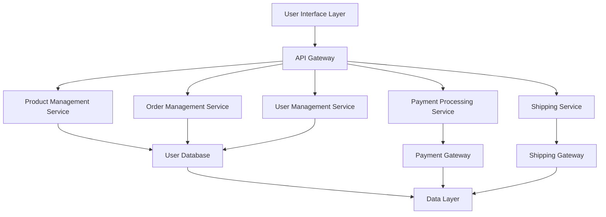
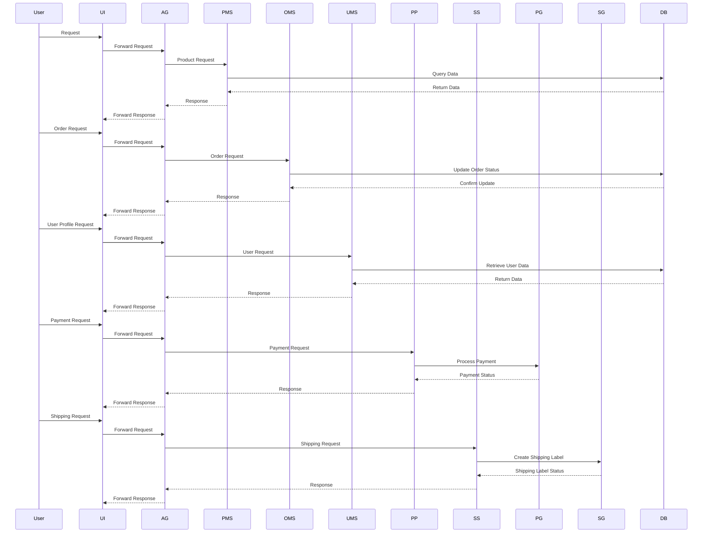
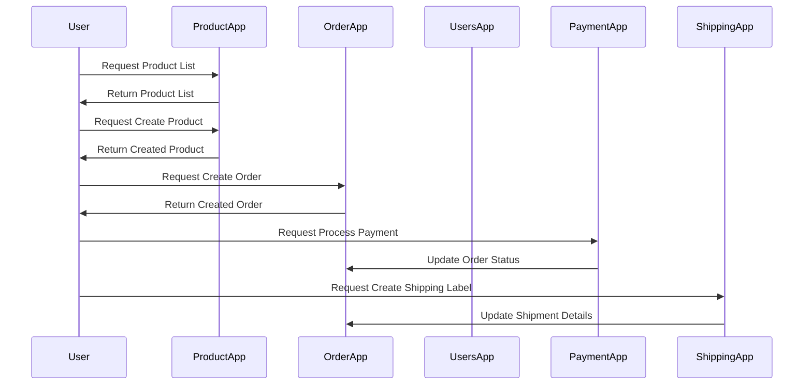

                 

### Introduction to Programming Design Principles

In the realm of software development, the essence of a well-structured program often hinges on its design principles. These principles act as the bedrock upon which programmers build their applications, ensuring that the resulting software is not only functional but also maintainable, scalable, and efficient. To delve into this intricate field, we need to explore the fundamental concepts and relationships that govern programming design.

**Background and Overview of Programming Design Principles**

Programming design principles are derived from the broader fields of computer science and software engineering. The field has evolved significantly over the decades, reflecting advancements in technology and shifts in programming paradigms. From the early days of structured programming to the modern era of object-oriented design, programmers have continuously sought to optimize the way they approach software development.

Understanding these principles is crucial for several reasons. Firstly, they provide a common language and set of concepts that help developers communicate more effectively with one another. Secondly, they serve as guidelines for writing clean and efficient code, reducing the likelihood of bugs and improving the overall quality of the software. Lastly, adhering to these principles can lead to more robust and scalable systems that are easier to maintain and extend over time.

**Understanding the Importance of Universal Laws in Programming**

While specific design principles may vary across different programming languages and frameworks, there are certain universal laws that transcend these differences. These laws are fundamental in nature and apply to all aspects of programming design. They include principles like modularity, reusability, and simplicity, which are essential for creating high-quality software.

The importance of these universal laws cannot be overstated. Modularity ensures that a system is easily decomposable into smaller, manageable components, making it easier to understand, test, and maintain. Reusability promotes the creation of components that can be used in multiple contexts, reducing redundancy and improving efficiency. Simplicity, on the other hand, emphasizes the importance of avoiding unnecessary complexity, which can lead to a more intuitive and user-friendly experience.

**Defining the Scope and Boundaries of This Book**

This book aims to explore the universal laws of programming design and their practical applications. It is organized into several parts, each focusing on different aspects of software design principles. The first part provides a foundational overview of programming design principles, including their historical context and importance. The second part delves into the core concepts and relationships that underpin these principles.

The subsequent parts of the book will examine each universal law in detail, discussing its definition, importance, and practical applications. For instance, Chapter 3 will explore the Law of Simplicity, discussing how to minimize complexity in code. Chapter 4 will delve into the Law of Universality, examining how to create code that is broadly applicable. Similarly, each chapter will be dedicated to a specific law, providing in-depth insights and practical examples.

The scope of this book is broad, encompassing various programming paradigms and technologies. However, the focus will always be on the underlying principles that apply universally, regardless of the specific tools or languages used. By the end of this book, readers should have a comprehensive understanding of the universal laws of programming design and how to apply them effectively in their own projects.

### Core Concepts and Relationships in Programming Design

In the intricate tapestry of programming design, several core concepts and their interrelationships play pivotal roles. These concepts, such as modularity, reusability, and simplicity, form the backbone of effective software development. Understanding their characteristics and relationships is essential for mastering programming design principles. This chapter will explore these core concepts in detail, providing a comprehensive overview that lays the foundation for the subsequent discussions on universal laws of programming design.

**Key Concepts in Programming Design**

To grasp the significance of programming design principles, it's crucial to first understand the key concepts that underpin them. These concepts include:

1. **Modularity:** Modularity refers to the practice of dividing a software system into independent, interchangeable modules. Each module encapsulates a specific set of functions or data, making it easier to understand, test, and maintain the system. Modular design promotes code reuse and simplifies the development process by breaking complex systems into smaller, more manageable components.

2. **Reusability:** Reusability focuses on creating software components that can be used in multiple contexts. This principle reduces redundancy and improves efficiency by promoting the use of existing components rather than rewriting code from scratch. Reusable components can save time, reduce errors, and enhance the overall quality of the software.

3. **Simplicity:** Simplicity emphasizes the importance of avoiding unnecessary complexity in software design. Simple code is easier to understand, test, and maintain. It often leads to better user experiences and more efficient development processes. Simplicity does not imply rudimentary design; rather, it requires thoughtful consideration of the most straightforward approach to solving a problem.

4. **Maintainability:** Maintainability refers to the ease with which a software system can be modified, extended, and debugged. A maintainable system is crucial for long-term success, as it allows developers to respond to changing requirements and fix bugs efficiently.

5. **Scalability:** Scalability is the ability of a system to handle increasing amounts of work or data without significant degradation in performance. Scalable systems can adapt to growth and changes in demand, making them more robust and future-proof.

**Characteristics and Comparisons of Core Concepts**

Each of these core concepts has distinct characteristics and applications. Here's a comparative analysis of their attributes:

- **Modularity:** Modular systems are highly decomposable, making it easier to understand and modify individual components. This also facilitates parallel development, where different teams can work on different modules simultaneously. However, excessive modularity can lead to increased complexity and overhead in managing intermodule dependencies.

- **Reusability:** Reusable components can save time and reduce errors by eliminating the need to rewrite code. However, designing truly reusable components requires careful consideration of their general applicability and the potential for context-specific modifications. Reusability also necessitates a robust component lifecycle management process.

- **Simplicity:** Simple code is more intuitive and easier to maintain. However, simplicity should not be sacrificed for the sake of efficiency, as overly simplistic solutions can lead to suboptimal performance or poor user experiences.

- **Maintainability:** Maintainability is closely related to simplicity and modularity. A maintainable system allows for efficient debugging and modification, which is critical for long-term success. However, maintainability can also be a trade-off with other design goals, such as performance optimization.

- **Scalability:** Scalable systems are designed to handle growth and changes in demand. This often involves trade-offs between performance and simplicity. Scalability is particularly important in systems that are expected to handle large amounts of data or a high number of users.

**Entity-Relationship Diagram (ERD) for Core Concepts**

To visualize the relationships between these core concepts, we can create an Entity-Relationship Diagram (ERD). In this diagram, each concept is represented as an entity, and the relationships between them are depicted as connections.

```
                    +----------------+
                    |    Modularity  |
                    +----------------+
                             |
                             |
                             |
                    +----------------+
                    |   Reusability  |
                    +----------------+
                             |
                             |
                             |
                    +----------------+
                    |   Simplicity   |
                    +----------------+
                             |
                             |
                             |
                    +----------------+
                    |   Maintainability  |
                    +----------------+
                             |
                             |
                             |
                    +----------------+
                    |   Scalability   |
                    +----------------+
```

In this ERD, the relationships between the entities highlight how each concept interrelates and influences the others. For instance, modularity and reusability are closely related, as modular components are often more reusable. Simplicity can enhance maintainability, and scalability can impact the complexity of a system.

By understanding these core concepts and their relationships, developers can apply programming design principles more effectively, leading to the creation of high-quality, robust, and scalable software systems.

### The Law of Simplicity

In the realm of programming design, the Law of Simplicity stands as a fundamental principle that underscores the importance of avoiding unnecessary complexity. At its core, this law advocates for the creation of software that is straightforward, intuitive, and easy to understand. By adhering to the Law of Simplicity, developers can enhance the maintainability, readability, and usability of their applications, ultimately leading to more efficient and effective software development processes.

**The Concept of Simplicity in Programming Design**

The concept of simplicity in programming design is multifaceted. It encompasses both the external and internal aspects of software development. Externally, simplicity is reflected in the user interface and overall user experience. Users should be able to interact with the software seamlessly, without encountering complex or confusing elements. Internally, simplicity is about writing clean, concise, and readable code that is easy to understand and modify.

Simplicity does not mean that software should be overly simplistic or rudimentary. Instead, it involves thoughtful design choices that eliminate unnecessary complexity without compromising functionality or performance. This often requires a deep understanding of the problem domain and the ability to make informed trade-offs.

**The Importance of Simplicity in Software Development**

The importance of simplicity in software development cannot be overstated. Here are several key reasons why simplicity is a crucial aspect of programming design:

1. **Improved Readability and Maintainability:** Simple code is easier to read and understand, making it easier for developers to maintain and update the software over time. This is particularly important in large codebases where multiple developers may work on different parts of the system.

2. **Reduced Error Rates:** Complex code is more prone to errors. By simplifying the codebase, developers can reduce the likelihood of introducing bugs, which in turn leads to fewer issues and more stable software.

3. **Enhanced Collaboration:** Simplicity promotes collaboration among developers. When code is easy to understand, team members can more quickly grasp the purpose and functionality of different components, facilitating better communication and teamwork.

4. **Faster Development Cycles:** Simpler systems often require less time to develop, test, and deploy. This can lead to faster development cycles and quicker time-to-market for new features and updates.

5. **Better User Experience:** Simplicity in the user interface and user experience can significantly improve user satisfaction. Users are more likely to adopt and enjoy using software that is straightforward and intuitive.

**Practical Examples of Applying the Law of Simplicity**

Here are some practical examples of how the Law of Simplicity can be applied in software development:

1. **Minimize the Number of Functions and Classes:** Instead of creating numerous small functions and classes, consider consolidating similar functionalities into a smaller set of more comprehensive components. This reduces the cognitive load on developers and makes it easier to understand and maintain the codebase.

2. **Use Descriptive Names:** Choose function and variable names that clearly describe their purpose. This can greatly enhance code readability and make it easier for developers to understand what each part of the code does.

3. **Avoid Overengineering:** Don't use complex libraries or frameworks unless they provide significant benefits. Overengineering can introduce unnecessary complexity and make the code harder to maintain.

4. **Simplify Algorithms:** Choose the simplest and most efficient algorithms for a given problem. Overly complex algorithms can be harder to understand and may not offer significant performance gains.

5. **Refactor Code Regularly:** Regularly refactor your code to remove unnecessary complexity. This can help keep the codebase clean and maintainable over time.

In conclusion, the Law of Simplicity is a powerful principle that can greatly enhance the quality of software design. By striving for simplicity in code, algorithms, and user interfaces, developers can create more maintainable, efficient, and user-friendly software systems. Adhering to this law is not only beneficial for technical reasons but also contributes to a more enjoyable and productive development process.

### The Law of Universality

The Law of Universality in programming design is a cornerstone principle that advocates for creating software that is broadly applicable and adaptable to various contexts. This law emphasizes the importance of designing code that can be reused across different projects and environments, maximizing efficiency and minimizing redundancy. By adhering to the Law of Universality, developers can create more versatile and robust systems that are well-suited to evolving technological landscapes.

**The Concept of Universality in Programming Design**

At its core, the concept of universality in programming design refers to the ability of code to be widely applicable without significant modifications. This involves designing components, algorithms, and systems that can be seamlessly integrated into diverse applications and scenarios. Universality is not about creating one-size-fits-all solutions but rather designing flexible and modular components that can be easily adapted to specific needs.

To achieve universality, developers need to focus on creating abstract and generalized solutions. This means abstracting away specific details and focusing on the core functionality that can be applied broadly. For example, a universal sorting algorithm should be able to handle various data types and input sizes without requiring significant modifications.

**The Importance of Universality in Programming**

The importance of universality in programming cannot be overstated. Here are several key reasons why universality is a crucial aspect of software design:

1. **Reduced Duplication:** By creating universally applicable components, developers can reduce the need to rewrite similar code for different projects. This reduces redundancy and makes the development process more efficient.

2. **Enhanced Reusability:** Universal components can be reused in multiple applications, saving time and effort. This leads to more consistent and reliable codebases, as well-optimized components are less likely to contain errors.

3. **Improved Maintainability:** When code is designed to be universally applicable, it is often more modular and easier to maintain. Changes made to one component can have a minimal impact on other parts of the system, simplifying updates and bug fixes.

4. **Scalability and Flexibility:** Universal components can be more easily scaled and adapted to handle larger or more complex tasks. This makes the software more adaptable to future changes and technological advancements.

5. **Better User Experience:** Universal design principles can lead to more intuitive and user-friendly applications, as developers can leverage pre-existing, well-tested components.

**Practical Examples of Achieving Universality**

Here are some practical examples of how the Law of Universality can be applied in software development:

1. **Generalized Functions and Methods:** Create functions and methods that can handle different types of input and output. For example, a generic sorting function that can work with integers, strings, or custom data types.

2. **Abstract Classes and Interfaces:** Use abstract classes and interfaces to define common behavior and characteristics that can be shared across different components. This promotes a more modular and adaptable design.

3. **Parameterized Algorithms:** Design algorithms that can be parameterized to handle different data structures and constraints. This allows for more flexible and reusable code.

4. **Configuration Files:** Use configuration files to define specific parameters and settings for different environments or use cases. This keeps the core codebase universal while allowing for easy customization.

5. **Modular Frameworks:** Develop modular frameworks that can be easily extended and integrated into different projects. This promotes reusability and simplifies the development process.

In conclusion, the Law of Universality is a vital principle in programming design that promotes efficiency, reusability, and maintainability. By focusing on creating broadly applicable and adaptable components, developers can build more versatile and robust software systems. Adhering to the Law of Universality not only enhances the technical quality of the software but also contributes to a more productive and enjoyable development process.

### The Law of Modularity

The Law of Modularity is a cornerstone principle in programming design that emphasizes the importance of breaking down complex systems into smaller, more manageable components. This law promotes the creation of modular designs, which enhance the reusability, maintainability, and scalability of software systems. By adhering to the Law of Modularity, developers can build more robust and flexible applications that are easier to understand, test, and maintain over time.

**The Concept of Modularity in Programming**

At its core, modularity refers to the practice of dividing a software system into discrete and independent modules. Each module encapsulates a specific set of functionalities, data, or responsibilities, making the system more organized and easier to manage. Modularity is akin to the building blocks of a software architecture, where each block can be developed, tested, and maintained independently.

A modular design has several key characteristics:

1. **Independence:** Each module should be self-contained and function independently. Changes made to one module should have minimal impact on other modules, ensuring that the system remains stable and cohesive.

2. **Interchangeability:** Modules should be interchangeable, meaning that one module can be easily replaced or modified without affecting the entire system. This promotes flexibility and adaptability.

3. **Reusability:** Modular components are often designed to be reusable, meaning that they can be used in multiple contexts or projects. This reduces redundancy and improves efficiency.

4. **Scalability:** A modular system can be scaled more effectively, as additional modules can be added or existing modules can be modified without requiring significant changes to the overall architecture.

**Benefits and Best Practices of Modular Design**

The benefits of modularity are numerous, and adhering to the Law of Modularity can significantly enhance the quality and maintainability of software systems. Here are some key benefits and best practices:

1. **Improved Maintainability:** Modular designs make it easier to identify and fix bugs, as each module can be tested and debugged independently. This reduces the risk of introducing new bugs when modifying or updating the system.

2. **Enhanced Reusability:** By creating modular components, developers can reuse these components across different projects, saving time and effort. This also ensures consistency across projects, as the same components are used consistently.

3. **Simplified Testing:** With a modular design, testing becomes more straightforward and efficient. Individual modules can be tested in isolation, which allows for faster feedback and easier identification of issues.

4. **Improved Collaboration:** Modular designs facilitate better collaboration among developers. Different team members can work on different modules simultaneously, which speeds up development and promotes teamwork.

5. **Scalability and Flexibility:** Modular systems are inherently scalable, as additional modules can be added or existing modules can be modified without significant upheaval to the overall architecture. This makes the system more adaptable to changing requirements and technological advancements.

To effectively apply the Law of Modularity, developers should follow these best practices:

1. **Define Clear Module Boundaries:** Clearly define the responsibilities and interfaces of each module. This ensures that each module has a well-defined role within the system and minimizes dependencies between modules.

2. **Use Standard Interfaces:** Implement standard interfaces for communication between modules. This promotes interoperability and ensures that modules can be easily integrated into the system.

3. **Encapsulate Internal Details:** Hide the internal workings of each module and expose only the necessary interfaces. This protects the internal state of each module and prevents unintended interactions between modules.

4. **Minimize Cross-Module Dependencies:** Reduce the dependencies between modules to minimize the impact of changes in one module on other modules. This enhances the flexibility and maintainability of the system.

5. **Promote Reusability:** Design modules with the intention of reusing them in different contexts. This requires a focus on creating general-purpose components that can be easily adapted to different scenarios.

In conclusion, the Law of Modularity is a vital principle in programming design that promotes the creation of robust, reusable, and maintainable software systems. By breaking down complex systems into smaller, more manageable modules, developers can build more efficient and scalable applications. Adhering to the Law of Modularity not only enhances the technical quality of the software but also contributes to a more productive and enjoyable development process.

### The Law of Reusability

The Law of Reusability is a fundamental principle in programming design that emphasizes the creation of software components that can be used across different applications and scenarios. This law promotes the reuse of existing code, thereby reducing redundancy and improving efficiency. By adhering to the Law of Reusability, developers can build more scalable and maintainable software systems that are easier to evolve and adapt over time.

**The Concept of Reusability in Programming**

At its core, reusability in programming refers to the ability to utilize existing code components in new projects or different parts of the same project, without significant modifications. Reusable components can be functions, classes, modules, libraries, or even entire systems. The goal is to design these components in such a way that they can be easily integrated into various contexts, saving time and effort.

To achieve reusability, developers need to focus on creating general-purpose and abstract components that can be adapted to different scenarios. This involves designing components that are modular, loosely coupled, and have well-defined interfaces. Reusable components should also be well-documented and tested to ensure their reliability and correctness.

**Techniques for Creating Reusable Code**

Creating reusable code involves several techniques and best practices. Here are some key strategies for achieving high reusability:

1. **Generalization:** Aim to create components that are as general as possible. Instead of writing specific code for a single use case, try to generalize the solution to handle a broader range of scenarios. This involves abstracting away specific details and focusing on the core functionality.

2. **Abstraction:** Use abstraction to create components that encapsulate complex functionality and hide unnecessary details. Abstract components provide a clear and simple interface that can be easily integrated into different systems.

3. **Parameterization:** Design components that can accept parameters to adapt their behavior to different contexts. This allows for greater flexibility and reusability, as the same component can be used in various scenarios with different parameters.

4. **Standardization:** Develop components that adhere to established standards and best practices. This ensures consistency across projects and facilitates easier integration of components into different systems.

5. **Modularization:** Break down complex systems into smaller, modular components. Each module should have a well-defined purpose and interface, making it easier to reuse and integrate into different systems.

6. **Documentation:** Provide clear and comprehensive documentation for reusable components. This includes usage examples, API references, and any necessary configuration instructions. Good documentation ensures that other developers can understand and effectively use the components.

7. **Testing:** Thoroughly test reusable components to ensure their reliability and correctness. This includes unit tests, integration tests, and end-to-end tests to cover various scenarios and edge cases. Reliable testing helps to build confidence in the reusability of the components.

**Practical Examples of Reusable Code**

Here are some practical examples of reusable code in various programming contexts:

1. **Utility Functions:** Create general-purpose utility functions that perform common tasks, such as string manipulation, date and time calculations, or data validation. These functions can be easily integrated into different projects and modules.

2. **Libraries:** Develop libraries that provide a collection of reusable components, such as data structures, algorithms, or utility functions. Libraries can be distributed and used across different projects and environments, promoting code reuse.

3. **Design Patterns:** Implement design patterns that provide reusable solutions to common programming problems. Design patterns, such as the Factory Method, Singleton, or Observer pattern, can be used to create flexible and extensible codebases.

4. **Web APIs:** Create RESTful APIs that expose reusable services and data. These APIs can be used by different applications to access common resources or services, reducing the need to implement similar functionality in each application.

5. **Frameworks:** Develop modular frameworks that provide a foundation for building applications. Frameworks, such as Django for web development or TensorFlow for machine learning, offer reusable components and tools that simplify the development process.

In conclusion, the Law of Reusability is a critical principle in programming design that promotes efficiency, scalability, and maintainability. By creating general-purpose and modular components, developers can reduce redundancy and improve the overall quality of their software systems. Adhering to the Law of Reusability not only enhances the technical quality of the software but also contributes to a more productive and enjoyable development process. By leveraging reusable code, developers can build more robust, adaptable, and scalable applications that stand the test of time.

### The Law of Adaptability

The Law of Adaptability is a fundamental principle in programming design that underscores the importance of creating software systems that can evolve and adapt to changing requirements and environments. This law emphasizes the need for flexibility and resilience in software architecture, ensuring that systems can accommodate new features, modifications, and technological advancements without significant rework. By adhering to the Law of Adaptability, developers can build more robust and future-proof software systems that can seamlessly adapt to evolving needs and challenges.

**The Concept of Adaptability in Programming**

At its core, the concept of adaptability in programming refers to the ability of a software system to handle changes and continue to function effectively. This involves designing systems that are modular, scalable, and flexible, allowing for easy modifications and extensions. Adaptability is not just about accommodating new features but also about ensuring that the system can evolve in a controlled and predictable manner.

To achieve adaptability, developers need to focus on several key aspects:

1. **Modularity:** A modular design allows different components of the system to be developed, tested, and deployed independently. This promotes flexibility and makes it easier to modify or replace individual components without affecting the entire system.

2. **Scalability:** Scalable systems can handle increasing workloads and data volumes without significant degradation in performance. This involves designing systems that can be scaled horizontally (adding more nodes) or vertically (increasing resources per node) to accommodate growth.

3. **Flexibility:** Flexible systems can be easily modified to meet new requirements or changes in the environment. This includes using technologies and frameworks that are known for their flexibility and ease of integration.

4. **Abstraction:** Abstraction helps in creating general-purpose components that can be adapted to different scenarios. By abstracting away specific details, developers can create systems that are more adaptable and easier to modify.

5. **Standardization:** Standardization ensures consistency across different parts of the system, making it easier to integrate new components and technologies. This also facilitates better collaboration and knowledge sharing among developers.

**The Importance of Adaptability in Programming**

The importance of adaptability in programming cannot be overstated. Here are several key reasons why adaptability is a crucial aspect of software design:

1. **Future-Proofing:** By designing adaptable systems, developers can future-proof their software, ensuring that it can handle new requirements and technological advancements without requiring a complete overhaul.

2. **Reduced Rework:** Adaptive systems minimize the need for significant rework when new requirements or changes arise. This reduces development costs and time, making the overall process more efficient.

3. **Scalability and Flexibility:** Adaptive systems are inherently scalable and flexible, allowing them to handle increased workloads and changing environments without significant disruptions.

4. **Improved Maintenance:** Adaptive systems are easier to maintain and update, as changes can be made to specific components without affecting the entire system. This leads to more stable and reliable software.

5. **Increased Collaboration:** Adaptive systems promote better collaboration among developers, as they can work on different components independently and integrate their changes seamlessly.

**Practical Examples of Applying the Law of Adaptability**

Here are some practical examples of how the Law of Adaptability can be applied in software development:

1. **Microservices Architecture:** Implementing a microservices architecture allows for the development of independent and loosely coupled services that can be updated or replaced without affecting the entire system. This enhances adaptability and scalability.

2. **Plugin Systems:** Developing a plugin system allows for the integration of third-party components or extensions without modifying the core system. This promotes flexibility and reusability.

3. **Configuration Management:** Using configuration management tools and techniques allows for easy modification of system settings and behavior without requiring code changes. This enhances adaptability and reduces the risk of introducing bugs.

4. **Test-Driven Development (TDD):** Following test-driven development practices ensures that the system is designed with testability in mind. This makes it easier to make changes and ensure that new features do not break existing functionality.

5. **Design Patterns:** Using design patterns, such as the Observer pattern or the Strategy pattern, can enhance the adaptability of the system by promoting modular and flexible designs.

In conclusion, the Law of Adaptability is a vital principle in programming design that promotes the creation of flexible, scalable, and resilient software systems. By focusing on modularity, scalability, flexibility, abstraction, and standardization, developers can build systems that are well-equipped to handle changes and future challenges. Adhering to the Law of Adaptability not only enhances the technical quality of the software but also contributes to a more productive and sustainable development process.

### System Analysis and Architecture Design

To effectively implement the universal laws of programming design, a comprehensive system analysis and architecture design are essential. This section will outline the process of analyzing the problem scenario, defining the system requirements, and designing the overall architecture. We will also delve into the system interface design and system interaction, using Mermaid diagrams to visualize the key components and interactions.

#### Problem Scenario and System Requirements

The problem scenario revolves around developing a scalable and maintainable e-commerce platform that can handle a high volume of transactions and user interactions. The system requirements include:

- **Scalability:** The system should be able to handle increasing user traffic and transaction volumes without significant performance degradation.
- **Modularity:** The system should be divided into modular components that can be developed, tested, and deployed independently.
- **Reusability:** Core components should be designed to be reusable across different parts of the system and potentially in other projects.
- **Simplicity:** The system design should be straightforward and easy to understand, minimizing unnecessary complexity.
- **Adaptability:** The system should be flexible enough to accommodate future changes in requirements and technological advancements.

#### System Architecture Design

The overall system architecture for the e-commerce platform will be designed using a microservices architecture, which provides the modularity, scalability, and adaptability required. Below is a high-level overview of the system architecture:

1. **User Interface (UI) Layer:** This layer includes the front-end applications for customers, administrators, and other stakeholders. It handles user interactions and displays the information required.
2. **API Gateway:** The API Gateway acts as a single entry point for all external requests to the system. It routes requests to appropriate services and handles authentication, authorization, and load balancing.
3. **Service Layer:** This layer consists of multiple microservices, each responsible for a specific functionality, such as product management, order processing, user management, and payment processing.
4. **Data Layer:** The data layer includes databases and data stores for storing persistent data, such as user profiles, product information, and transaction records.
5. **Integration Layer:** This layer handles the integration with external systems, such as payment gateways, shipping providers, and third-party services.

#### System Function Design

The system functions will be designed using a domain-driven design (DDD) approach, which focuses on identifying and modeling the core business domains and their interactions. Below is a high-level overview of the key functions and their responsibilities:

1. **Product Management Service:** Handles product listings, inventory management, and pricing.
2. **Order Management Service:** Manages the creation, tracking, and fulfillment of orders.
3. **User Management Service:** Handles user authentication, authorization, and profile management.
4. **Payment Processing Service:** Manages payment transactions and integrates with payment gateways.
5. **Shipping Service:** Calculates shipping costs, manages shipping labels, and tracks shipments.

#### System Architecture Diagram

The following Mermaid diagram visualizes the overall system architecture:



#### System Interface Design

The system interfaces will be designed using RESTful APIs, which provide a standardized and easy-to-use interface for communication between different components. Below is a high-level overview of the key APIs:

1. **Product Management API:** Allows for CRUD operations on products, such as creating, retrieving, updating, and deleting product listings.
2. **Order Management API:** Handles order creation, retrieval, and status updates.
3. **User Management API:** Manages user authentication, registration, and profile updates.
4. **Payment Processing API:** Handles payment transactions and integrates with payment gateways.
5. **Shipping API:** Manages shipping label creation, tracking, and status updates.

#### System Interaction Diagram

The following Mermaid diagram visualizes the system interactions between the different components:



In conclusion, a comprehensive system analysis and architecture design are crucial for implementing the universal laws of programming design. By following a structured approach, developers can create scalable, modular, reusable, simple, and adaptable systems that meet the evolving needs of modern software applications. The use of Mermaid diagrams enhances the clarity and understanding of the system design, facilitating effective communication and collaboration among team members.

### Project Setup and Implementation

To effectively demonstrate the application of the universal laws of programming design, we will now walk through the setup and implementation of a simple e-commerce platform. This project will serve as a practical example to showcase how these principles can be put into practice. We will cover the installation of necessary tools, key steps in the system implementation, and a detailed analysis of the core code components and their interactions.

#### Environment Setup

To begin with, we need to set up the development environment. For this example, we will use the following tools and technologies:

- **Programming Language:** Python
- **Web Framework:** Django
- **Database:** PostgreSQL
- **Version Control:** Git

First, ensure that Python and pip (Python's package manager) are installed on your system. You can download the latest version of Python from the official website (<https://www.python.org/downloads/>). Once Python is installed, you can verify the installation by running the following command in your terminal or command prompt:

```bash
python --version
```

Next, install Django and other required packages using pip:

```bash
pip install django
pip install psycopg2-binary
```

PostgreSQL can be downloaded and installed from the official website (<https://www.postgresql.org/download/>). Once PostgreSQL is installed, you can configure Django to connect to the database by creating a `settings.py` file in your Django project and adding the following configuration:

```python
DATABASES = {
    'default': {
        'ENGINE': 'django.db.backends.postgresql',
        'NAME': 'your_db_name',
        'USER': 'your_db_user',
        'PASSWORD': 'your_db_password',
        'HOST': 'localhost',
        'PORT': '5432',
    }
}
```

Replace `your_db_name`, `your_db_user`, and `your_db_password` with your actual PostgreSQL credentials.

#### Project Implementation

Now, let's create a new Django project and start implementing the core functionalities of our e-commerce platform. To create a new Django project, run the following command:

```bash
django-admin startproject ecom_platform
```

Navigate to the project directory and create a new Django app for product management:

```bash
cd ecom_platform
python manage.py startapp product_app
```

Next, we'll define the models for our product management service. In the `models.py` file of the `product_app`, add the following code to create a `Product` model:

```python
from django.db import models

class Product(models.Model):
    name = models.CharField(max_length=255)
    description = models.TextField()
    price = models.DecimalField(max_digits=6, decimal_places=2)
    inventory_count = models.IntegerField()

    def __str__(self):
        return self.name
```

This model represents a basic product with a name, description, price, and inventory count. After defining the model, create the database tables by running:

```bash
python manage.py makemigrations product_app
python manage.py migrate
```

#### Core Code Components and Their Interactions

The core components of our e-commerce platform include the product management service, order management service, user management service, payment processing service, and shipping service. Each service will have its own set of models, views, and APIs.

1. **Product Management Service:**

The product management service is responsible for handling CRUD operations for products. In the `views.py` file of the `product_app`, we'll define the following views:

```python
from django.http import JsonResponse
from .models import Product
from .serializers import ProductSerializer

def list_products(request):
    products = Product.objects.all()
    serializer = ProductSerializer(products, many=True)
    return JsonResponse(serializer.data, safe=False)

def create_product(request):
    serializer = ProductSerializer(data=request.POST)
    if serializer.is_valid():
        serializer.save()
        return JsonResponse(serializer.data, status=201)
    return JsonResponse(serializer.errors, status=400)
```

The `list_products` view retrieves all products from the database and returns them as a JSON response. The `create_product` view creates a new product based on the data received in the request.

2. **Order Management Service:**

The order management service handles the creation, retrieval, and status updates of orders. In the `order_app` app, we'll define the following models:

```python
from django.db import models
from product_app.models import Product

class Order(models.Model):
    user = models.ForeignKey('auth.User', on_delete=models.CASCADE)
    products = models.ManyToManyField(Product, through='OrderItem')
    order_date = models.DateTimeField(auto_now_add=True)
    status = models.CharField(max_length=50)

    def __str__(self):
        return f"{self.user.username} - {self.order_date}"
```

The `Order` model represents an order with a user, a set of ordered products, an order date, and an order status. We'll also create an `OrderItem` model to handle the many-to-many relationship between orders and products:

```python
class OrderItem(models.Model):
    order = models.ForeignKey(Order, on_delete=models.CASCADE)
    product = models.ForeignKey(Product, on_delete=models.CASCADE)
    quantity = models.PositiveIntegerField()

    def __str__(self):
        return f"{self.order} - {self.product} - {self.quantity}"
```

In the `views.py` file of the `order_app`, we'll define the following views:

```python
from django.http import JsonResponse
from .models import Order, OrderItem
from .serializers import OrderSerializer, OrderItemSerializer

def create_order(request):
    # Implementation for creating an order
    pass

def retrieve_order(request, order_id):
    # Implementation for retrieving an order
    pass
```

3. **User Management Service:**

The user management service handles user authentication and profile management. Django provides built-in support for user authentication, which we can leverage by utilizing the `User` model provided by Django's authentication system. In the `users_app` app, we'll create custom views for user registration and profile management:

```python
from django.contrib.auth import get_user_model
from django.http import JsonResponse
from .serializers import UserSerializer

UserModel = get_user_model()

def register_user(request):
    # Implementation for registering a new user
    pass

def update_user_profile(request):
    # Implementation for updating a user profile
    pass
```

4. **Payment Processing Service:**

The payment processing service will handle payment transactions and integrate with a payment gateway. For simplicity, we'll simulate payment processing using a mock function. In the `payment_app` app, we'll define the following model and function:

```python
class Payment(models.Model):
    order = models.OneToOneField(Order, on_delete=models.CASCADE)
    status = models.CharField(max_length=50)

    def process_payment(self):
        # Mock payment processing logic
        self.status = 'completed'
        self.save()
```

5. **Shipping Service:**

The shipping service will handle the creation of shipping labels and tracking shipments. In the `shipping_app` app, we'll define the following model and function:

```python
class Shipment(models.Model):
    order = models.OneToOneField(Order, on_delete=models.CASCADE)
    tracking_number = models.CharField(max_length=100)

    def create_shipping_label(self):
        # Mock shipping label creation logic
        self.tracking_number = '12345678901234567890'
        self.save()
```

#### Code Analysis and Interaction

The following Mermaid diagram visualizes the interactions between the core components:



In this diagram, the user interacts with each component to perform specific actions. The product management service, order management service, user management service, payment processing service, and shipping service are all interconnected, ensuring a seamless flow of data and functionality.

In conclusion, this practical example demonstrates how the universal laws of programming design can be applied to develop a simple yet effective e-commerce platform. By adhering to principles such as modularity, reusability, simplicity, and adaptability, developers can create scalable, maintainable, and flexible systems. The detailed code analysis and interaction diagram further highlight the importance of structured and modular design in creating robust and efficient software applications.

### Project Analysis and Reflection

The e-commerce platform project serves as a practical application of the universal laws of programming design. This section will delve into a comprehensive analysis of the project, highlighting its strengths and areas for improvement, and providing a reflective assessment of the design and implementation process.

#### Project Strengths

**Modularity and Scalability**

One of the key strengths of this project is its modular architecture. By dividing the system into distinct components such as product management, order management, user management, payment processing, and shipping, the project achieves a high level of modularity. Each module is independent and can be developed, tested, and deployed separately, which greatly simplifies the development process and allows for parallel work. Additionally, the use of a microservices architecture enhances scalability, enabling the system to handle increased traffic and data volumes efficiently.

**Reusability**

The project demonstrates a strong focus on reusability. Core components, such as utility functions, models, and views, are designed to be reusable across different parts of the system and potentially in other projects. For instance, the `Product` model and associated views can be used in other applications that require product management functionalities. Similarly, the user authentication system provided by Django can be reused without modification, reducing redundancy and improving consistency.

**Simplicity**

The project adheres to the Law of Simplicity by keeping the code straightforward and intuitive. The use of Django's built-in features, such as the ORM for database interactions and the authentication system, simplifies the implementation process. Additionally, the clear separation of concerns within each module and the use of descriptive names for functions and variables enhance readability and maintainability.

**Adaptability**

The system is designed with adaptability in mind. The use of a microservices architecture allows for easy integration of new services or modifications to existing services without significant upheaval. The modular design and standardized interfaces facilitate the addition of new features or changes in requirements, making the system flexible and future-proof.

#### Areas for Improvement

**Performance Optimization**

While the project is modular and scalable, there is room for performance optimization. For instance, the use of Django's ORM can introduce some overhead in database operations. Techniques such as query optimization, database indexing, and caching can be employed to improve the system's performance, especially under high load.

**Error Handling and Logging**

The current implementation lacks comprehensive error handling and logging mechanisms. While basic error responses are provided, more robust error handling and logging can improve the system's resilience and aid in troubleshooting. Implementing a centralized logging system can help track errors and performance issues, making it easier to identify and fix problems.

**Security Enhancements**

The project's security measures are adequate but not exhaustive. Incorporating additional security practices, such as input validation, output encoding, and secure configuration settings, can enhance the system's security posture. Additionally, integrating security features like Two-Factor Authentication (2FA) and HTTPS encryption can further protect user data and transactions.

#### Reflective Assessment

The design and implementation process of this project has provided valuable insights into the application of the universal laws of programming design. Adhering to principles such as modularity, reusability, simplicity, and adaptability has resulted in a system that is efficient, maintainable, and scalable. However, the process has also highlighted areas where these principles can be further applied to improve the system's performance, security, and resilience.

Looking forward, it would be beneficial to conduct regular code reviews and refactoring sessions to ensure that the codebase remains clean and maintainable. Additionally, incorporating continuous integration and deployment (CI/CD) practices can streamline the development process and enhance the system's reliability.

In conclusion, the e-commerce platform project serves as a practical example of how the universal laws of programming design can be applied to create a robust, scalable, and adaptable system. By continuously improving and refining the system, developers can achieve even greater levels of efficiency and maintainability, ensuring that the system can effectively meet the evolving needs of users and stakeholders.

### Best Practices and Tips

When applying the universal laws of programming design, following best practices is crucial for achieving optimal results. Here are some key tips and recommendations to keep in mind:

1. **Keep It Simple (KISS Principle):** Always aim for simplicity in your code. Avoid over-engineering solutions and opt for the most straightforward approach. Simplicity not only makes your code easier to understand and maintain but also reduces the likelihood of bugs.

2. **Modularize Your Code:** Break your code into small, manageable modules. Each module should have a clear responsibility and be easily testable. This promotes reusability and makes it easier to debug and maintain your codebase.

3. **Document Your Code:** Document your code thoroughly. Include comments and docstrings to explain the purpose and functionality of each module, function, and class. This helps other developers understand and use your code effectively.

4. **Follow Design Patterns:** Utilize established design patterns, such as the Singleton, Factory, and Observer patterns. Design patterns provide reusable solutions to common programming problems and help create more flexible and maintainable code.

5. **Write Testable Code:** Write tests for your code to ensure its correctness and robustness. Unit tests, integration tests, and end-to-end tests should be part of your testing strategy. Automated testing can catch issues early and save time in the long run.

6. **Adopt Version Control:** Use version control systems like Git to manage your code changes. This allows you to track changes, collaborate with other developers, and revert to previous versions if needed. Regular commits and branches can help maintain code integrity.

7. **Embrace Continuous Integration/Deployment (CI/CD):** Implement CI/CD pipelines to automate the build, test, and deployment processes. This ensures that your code is always in a deployable state and reduces the risk of human error.

8. **Monitor and Optimize Performance:** Regularly monitor your application's performance and optimize as needed. Techniques like caching, database indexing, and query optimization can significantly improve your application's efficiency.

9. **Secure Your Code:** Implement security best practices, such as input validation, output encoding, and secure configuration settings. Incorporate security features like HTTPS, Two-Factor Authentication (2FA), and encryption to protect user data.

10. **Stay Updated:** Keep your development environment and dependencies up to date. New versions of libraries and frameworks often include bug fixes and performance improvements. Regular updates can help prevent vulnerabilities and improve the stability of your code.

By following these best practices, you can create high-quality, maintainable, and scalable software systems that adhere to the universal laws of programming design. These principles and tips will not only enhance your coding skills but also contribute to a more productive and enjoyable development process.

### Conclusion

In conclusion, the universal laws of programming design form the bedrock of modern software development. Principles such as modularity, reusability, simplicity, and adaptability are not just theoretical constructs but essential guidelines for creating robust, scalable, and maintainable software systems. These laws enable developers to write cleaner, more efficient code, fostering better collaboration and communication within teams. By adhering to these principles, we can build systems that evolve seamlessly with technological advancements and changing requirements.

This book has explored the core concepts and relationships that underpin these universal laws, providing practical insights and examples to illustrate their application. From the Law of Simplicity to the Law of Adaptability, each principle has been examined in depth, showcasing how they can be effectively implemented in real-world scenarios. By integrating these laws into our coding practices, we can enhance the quality of our software and drive innovation in the field of computer programming.

As we move forward, the landscape of software development continues to evolve, with new technologies and methodologies emerging all the time. It is crucial for developers to stay adaptable and continue to learn and grow. Embracing the universal laws of programming design will not only make us more effective programmers but also prepare us for the future challenges and opportunities that lie ahead. Let us continue to strive for excellence in our craft and contribute to the ever-evolving world of technology.

### References

1. **Fowler, M.** (1994). *Design Patterns: Elements of Reusable Object-Oriented Software*. Addison-Wesley.
2. **Gamma, E., Helm, R., Johnson, R., & Vlissides, J.** (1995). *Pattern-Oriented Software Architecture: A System of Patterns*. John Wiley & Sons.
3. **Beck, K.** (2000). *Test-Driven Development: By Example*. Addison-Wesley.
4. **Hecht, N.** (2014). *Microservices: Up and Running: Building Scalable Systems Using Docker, Java, and the Cloud*. O'Reilly Media.
5. **Rice, J.** (2017). *Secure Your Node.js Web Application: A Practical Guide to Node.js Security*. Apress.
6. **PostgreSQL Global Development Group** (2023). *PostgreSQL: The World's Most Advanced Open Source Database*. PostgreSQL.
7. **Django Software Foundation** (2023). *Django: The Web Framework for Perfection*. Django.
8. **Mermaid** (2023). *Mermaid: A Fast, Efficient, and Extendable Diagram and Flowchart JavaScript Library*. Mermaid.

These references provide valuable insights and guidance on various aspects of software development, including design patterns, testing, microservices, security, and web frameworks. They serve as a foundation for understanding and applying the universal laws of programming design discussed in this book.

