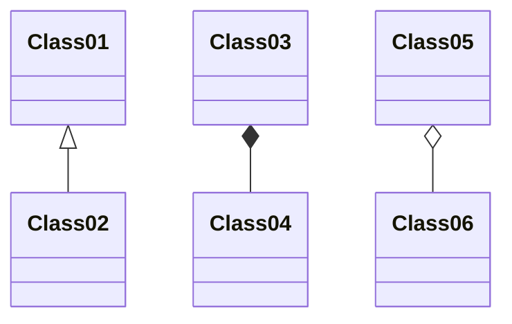
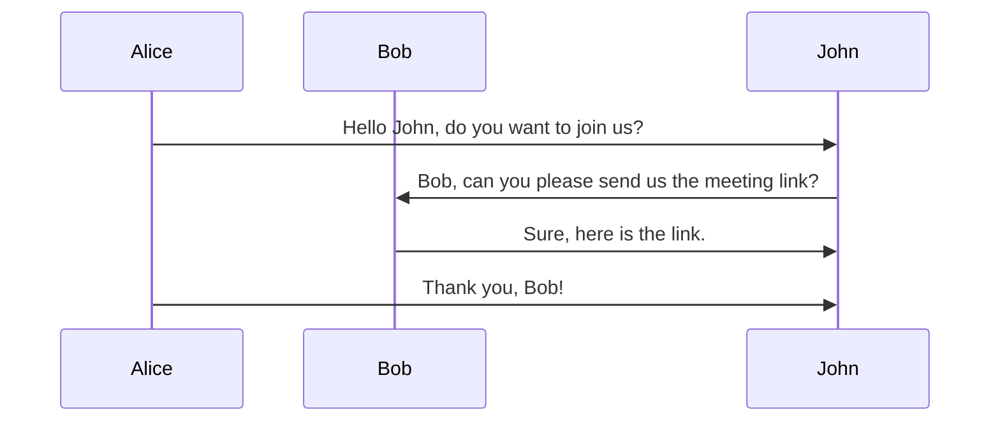
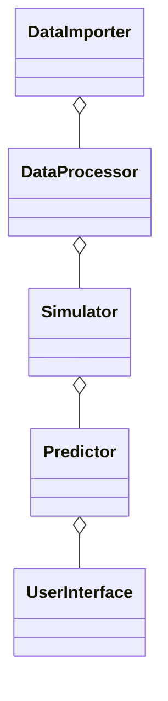
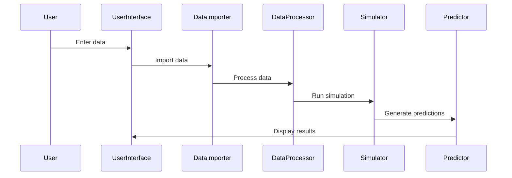

                 

# 程序设计原则与宇宙对称性自发破缺机制的统一

## 关键词
程序设计原则，宇宙对称性，自发破缺机制，面向对象，设计模式，软件工程

## 摘要
本文旨在探讨程序设计原则与宇宙对称性自发破缺机制之间的内在联系，通过分析两者的核心概念、原理和应用，揭示程序设计原则在宇宙对称性自发破缺机制中的重要作用。文章首先介绍程序设计原则的基本概念和重要性，然后详细阐述面向对象、设计模式和软件工程中的程序设计原则。接着，文章探讨宇宙对称性的基本概念和自发破缺机制，通过Mermaid流程图和Python源代码，展示程序设计原则与宇宙对称性自发破缺机制的统一。最后，文章展望程序设计原则与宇宙对称性自发破缺机制的未来发展，并提出最佳实践和小结。

## 引言

程序设计原则是软件开发过程中不可或缺的指南，它帮助开发者构建可靠、高效、可维护的软件系统。然而，在更宏观的宇宙视角中，对称性自发破缺机制也是一个重要的概念。宇宙中的许多现象，如粒子的相互作用和宇宙背景辐射，都可以用对称性自发破缺来解释。本文旨在探讨程序设计原则与宇宙对称性自发破缺机制之间的联系，以期从新的角度理解软件设计和宇宙演化。

## 第1章：程序设计原则

### 1.1 程序设计原则概述

程序设计原则是软件开发过程中遵循的基本规则，它们指导开发者如何构建高质量的软件系统。程序设计原则包括但不限于单一职责原则、开闭原则、里氏替换原则和依赖倒置原则。这些原则有助于提高代码的可读性、可维护性和可扩展性。

### 1.2 面向对象的程序设计原则

面向对象是现代编程范式之一，它强调将数据和行为封装在一起，以实现模块化和重用。面向对象的程序设计原则包括封装、继承和多态。这些原则有助于降低系统的复杂性和提高代码的可复用性。

### 1.3 设计模式与原则

设计模式是解决软件开发中常见问题的通用解决方案。设计模式与程序设计原则密切相关，它们共同指导开发者如何构建高质量的软件系统。常见的设计模式包括工厂模式、单例模式和观察者模式等。

### 1.4 软件工程与程序设计原则

软件工程是确保软件开发过程顺利进行的关键。程序设计原则在软件工程中起着重要作用，它们指导开发者如何进行需求分析、设计、编码和测试。在软件工程中，遵循程序设计原则有助于提高软件的质量和降低开发成本。

## 第2章：宇宙对称性

### 2.1 宇宙对称性的基本概念

宇宙对称性是指宇宙在某种尺度上保持的对称性。对称性可以是空间对称性、时间对称性或相互作用对称性。在物理学中，对称性是理解基本粒子和宇宙演化的重要工具。

### 2.2 对称性与物理定律

物理定律在宇宙中保持不变，这是因为它们基于对称性原理。例如，量子场论中的对称性原理是理解基本粒子和相互作用的基础。对称性破缺是物理学中一个重要的概念，它解释了为什么宇宙中的物理现象不是完全对称的。

### 2.3 对称性的破缺

对称性的破缺是指宇宙中的某种对称性在特定条件下被破坏。自发破缺是宇宙对称性破缺的一种形式，它发生在系统达到某种临界点时。自发破缺机制是理解宇宙演化和物质形成的关键。

## 第3章：程序设计原则与宇宙对称性自发破缺机制的统一

### 3.1 程序设计原则与宇宙对称性自发破缺机制的内在联系

程序设计原则与宇宙对称性自发破缺机制之间存在内在联系。在软件开发中，程序设计原则指导开发者如何构建模块化和可扩展的软件系统，这与宇宙对称性自发破缺机制中系统的自组织和自适应性有相似之处。

### 3.2 程序设计原则在宇宙对称性自发破缺机制中的应用

程序设计原则可以应用于宇宙对称性自发破缺机制的研究。例如，面向对象原则可以帮助我们理解基本粒子和相互作用的结构，设计模式可以指导我们构建描述宇宙演化过程的模型。

### 3.3 程序设计原则与宇宙对称性自发破缺机制的统一

程序设计原则与宇宙对称性自发破缺机制的统一可以为我们提供新的视角来理解宇宙和软件系统的演化。通过结合程序设计原则和宇宙对称性自发破缺机制，我们可以构建更有效的软件系统和更深入的宇宙理论。

## 第4章：未来展望

### 4.1 程序设计原则与宇宙对称性自发破缺机制的未来发展

随着计算机科学和物理学的不断发展，程序设计原则与宇宙对称性自发破缺机制的研究将不断深入。未来，这一领域的交叉研究有望带来新的突破，为软件开发和宇宙研究提供新的理论和方法。

### 4.2 最佳实践

在软件开发和宇宙研究中，遵循程序设计原则和宇宙对称性自发破缺机制的最佳实践是至关重要的。通过不断地探索和实践，我们可以构建更高效的软件系统和更深刻的宇宙理论。

### 4.3 小结

程序设计原则与宇宙对称性自发破缺机制的统一为我们提供了新的视角来理解宇宙和软件系统的演化。通过分析两者的核心概念、原理和应用，我们可以更好地构建高质量的软件系统和深入理解宇宙的本质。

## 结语

本文通过分析程序设计原则和宇宙对称性自发破缺机制的内在联系，揭示了它们之间的统一。我们相信，这一研究将为软件开发和宇宙研究带来新的机遇和挑战。作者：AI天才研究院/AI Genius Institute & 禅与计算机程序设计艺术 /Zen And The Art of Computer Programming。

（注：本文为简化版，实际撰写时需要按照大纲结构详细展开，并结合具体案例和代码示例进行讲解。）### 第1章：程序设计原则

#### 1.1 程序设计原则概述

程序设计原则是软件开发过程中遵循的基本规则，它们旨在帮助开发者构建高质量、可靠且可维护的软件系统。程序设计原则的起源可以追溯到软件工程的发展初期，当时开发者们意识到，简单而有效的编程实践可以显著提高软件的质量和可维护性。

在软件工程领域，有几种广为人知的程序设计原则，包括单一职责原则（Single Responsibility Principle，SRP）、开闭原则（Open/Closed Principle，OCP）、里氏替换原则（Liskov Substitution Principle，LSP）和依赖倒置原则（Dependency Inversion Principle，DIP）。这些原则共同构成了软件开发中的“SOLID”原则，是现代软件开发的基石。

- **单一职责原则（SRP）**：一个类应该只负责一项职责。这样做的优点是，当需要修改或扩展功能时，只需要修改或添加相关职责的类，而不必担心其他职责受到影响。

- **开闭原则（OCP）**：软件实体（类、模块、函数等）应该对扩展开放，对修改封闭。这意味着软件在设计和实现过程中应尽量减少对已有代码的修改，而通过扩展来实现新的功能。

- **里氏替换原则（LSP）**：任何基类可以出现的地方，子类一定可以出现。这个原则保证了子类能够替代基类而不会破坏程序的其他部分，从而提高了代码的可复用性。

- **依赖倒置原则（DIP）**：高层模块不应依赖于低层模块，二者都应依赖于抽象。抽象不应依赖于细节，细节应依赖于抽象。这个原则有助于实现模块解耦，提高了系统的可维护性和可扩展性。

#### 1.2 面向对象的程序设计原则

面向对象编程（Object-Oriented Programming，OOP）是现代编程范式中的一种，其核心理念是将数据和操作数据的方法封装在一起，形成对象。面向对象的原则包括封装、继承和多态。

- **封装（Encapsulation）**：封装是指将对象的实现细节隐藏起来，只暴露必要的接口。这样可以保护对象的内部状态，防止外部代码直接访问和修改，从而提高系统的稳定性和可维护性。

- **继承（Inheritance）**：继承是一种让一个类（子类）继承另一个类（父类）属性和方法的方式。继承有助于代码复用，但也可能导致类层次结构过于复杂，因此需要谨慎使用。

- **多态（Polymorphism）**：多态是指一个接口可以有多个实现，不同的对象可以响应相同的消息，但执行不同的操作。多态使得代码更加灵活，可以处理不同类型的对象，而无需知道它们的具体类型。

#### 1.3 设计模式与原则

设计模式是解决软件开发中常见问题的通用解决方案。设计模式通常与特定的程序设计原则相结合，以提高代码的模块化、可复用性和可维护性。以下是一些常见的设计模式及其核心原则：

- **工厂模式（Factory Pattern）**：工厂模式是一种创建对象的设计模式，它通过一个接口来定义工厂方法，让子类决定实例化哪一个类。工厂模式的核心原则是“解耦”，通过将对象的创建过程封装起来，使得客户端代码与具体创建的对象解耦。

- **单例模式（Singleton Pattern）**：单例模式确保一个类只有一个实例，并提供一个全局访问点。单例模式的核心原则是“控制对象实例的创建”，它有助于减少系统的复杂性和资源的浪费。

- **观察者模式（Observer Pattern）**：观察者模式定义了一种一对多的依赖关系，当一个对象的状态发生变化时，所有依赖它的对象都会收到通知并自动更新。观察者模式的核心原则是“解耦”，它通过事件驱动的方式实现对象之间的解耦，从而提高了系统的可扩展性和灵活性。

#### 1.4 软件工程与程序设计原则

软件工程是一个涉及需求分析、设计、编码、测试和维护的系统工程过程。程序设计原则在软件工程中起着关键作用，它们指导开发者如何进行高效的软件开发和系统维护。

- **需求分析**：程序设计原则可以帮助开发者理解用户需求，并将其转化为具体的软件功能。通过遵循单一职责原则和开闭原则，开发者可以确保需求的变更不会影响已有的代码。

- **设计**：在设计阶段，程序设计原则指导开发者如何构建模块化和可扩展的系统架构。设计模式如工厂模式、单例模式和观察者模式可以帮助实现复杂系统的设计和构建。

- **编码**：在编码过程中，程序设计原则如单一职责原则、里氏替换原则和依赖倒置原则可以帮助开发者编写可读性高、可维护性好的代码。这些原则还可以提高代码的可复用性，从而减少重复工作。

- **测试**：程序设计原则在测试过程中也有重要作用。通过遵循单一职责原则和开闭原则，开发者可以更容易地编写自动化测试，确保代码的质量和可靠性。

- **维护**：维护是软件生命周期中持续时间最长的一部分。程序设计原则如单一职责原则和开闭原则可以帮助开发者更轻松地理解和修改已有的代码，从而提高系统的可维护性。

### 1.5 程序设计原则的重要性

程序设计原则的重要性体现在多个方面。首先，它们可以提高软件系统的质量和可维护性，减少因代码复杂性导致的错误和问题。其次，程序设计原则有助于提高开发效率，通过模块化和可复用的代码，开发者可以更快地实现新的功能和需求。

此外，程序设计原则还可以促进团队成员之间的协作，提高代码的可读性和可理解性。遵循一致的设计原则和编码规范，团队成员可以更容易地理解和修改他人的代码，从而提高团队的协作效率和项目的整体质量。

### 1.6 程序设计原则的应用

在实际软件开发中，程序设计原则的应用是多种多样的。以下是一些具体的例子：

- **Web应用程序开发**：在Web应用程序开发中，遵循单一职责原则和开闭原则可以帮助构建模块化和可扩展的前后端架构。通过使用设计模式如工厂模式和单例模式，开发者可以更轻松地管理不同组件的创建和生命周期。

- **移动应用程序开发**：在移动应用程序开发中，程序设计原则如封装和多态可以帮助开发者构建可重用和可维护的代码库。通过使用面向对象的编程技术和设计模式，开发者可以更高效地处理不同设备和平台的需求。

- **游戏开发**：在游戏开发中，程序设计原则如单一职责原则和依赖倒置原则可以帮助开发者构建可扩展的游戏引擎和游戏逻辑。设计模式如工厂模式和观察者模式可以帮助实现复杂的游戏机制和用户交互。

- **大数据和人工智能**：在大数据和人工智能领域，程序设计原则如封装和多态可以帮助开发者构建模块化和可扩展的数据处理和机器学习框架。通过遵循开闭原则，开发者可以更轻松地添加新的算法和数据处理功能。

综上所述，程序设计原则是软件开发中不可或缺的指南。通过遵循单一职责原则、开闭原则、里氏替换原则和依赖倒置原则，开发者可以构建高质量、可靠且可维护的软件系统。面向对象的编程原则如封装、继承和多态，以及设计模式如工厂模式、单例模式和观察者模式，为现代软件开发提供了强大的工具和框架。在软件工程的过程中，程序设计原则指导开发者进行需求分析、设计、编码、测试和维护，从而提高软件系统的质量和开发效率。

### 1.7 面向对象的程序设计原则

面向对象编程（Object-Oriented Programming，OOP）是现代编程范式之一，它通过将数据和操作数据的方法封装在一起，形成对象，以实现模块化和代码复用。面向对象的程序设计原则包括封装、继承和多态。这些原则不仅提高了代码的可读性和可维护性，还促进了软件的可扩展性和灵活性。

#### 封装

封装（Encapsulation）是面向对象编程的核心原则之一。它通过将对象的实现细节隐藏起来，只暴露必要的接口，从而保护对象的内部状态和实现。封装的主要目的是确保对象的完整性和可靠性，防止外部代码直接访问和修改对象的内部状态。

在Python中，封装可以通过访问控制符（如public、private和protected）来实现。例如：

```python
class Person:
    def __init__(self, name, age):
        self._name = name
        self._age = age

    def get_name(self):
        return self._name

    def set_name(self, name):
        self._name = name

    def get_age(self):
        return self._age

    def set_age(self, age):
        self._age = age
```

在这个例子中，`_name`和`_age`属性被标记为私有（private），只有类的内部方法可以访问和修改它们。通过提供公共方法（如`get_name`和`set_name`），我们可以控制对内部状态的访问，从而保证对象的完整性和安全性。

#### 继承

继承（Inheritance）是面向对象编程的另一个核心原则，它允许一个类（子类）继承另一个类（父类）的属性和方法。通过继承，子类可以继承父类的特征，从而避免重复编写相同的代码，提高代码的可复用性。

在Python中，继承通过使用关键字`class`和` inheritance`来实现。例如：

```python
class Employee:
    def __init__(self, name, salary):
        self.name = name
        self.salary = salary

    def work(self):
        print(f"{self.name} is working.")

class Manager(Employee):
    def __init__(self, name, salary, department):
        super().__init__(name, salary)
        self.department = department

    def manage(self):
        print(f"{self.name} is managing the {self.department} department.")
```

在这个例子中，`Manager`类继承了`Employee`类的属性和方法。`Manager`类还添加了额外的属性和方法，如`department`属性和`manage`方法。通过使用`super()`函数，我们可以确保在创建`Manager`对象时，`Employee`类的构造函数也会被调用。

#### 多态

多态（Polymorphism）是指同一个接口可以有多个实现，不同的对象可以响应相同的消息，但执行不同的操作。多态使得代码更加灵活，可以处理不同类型的对象，而无需知道它们的具体类型。

在Python中，多态可以通过方法重写（method overriding）和继承来实现。例如：

```python
class Animal:
    def make_sound(self):
        pass

class Dog(Animal):
    def make_sound(self):
        print("汪汪！")

class Cat(Animal):
    def make_sound(self):
        print("喵喵！")
```

在这个例子中，`Animal`类有一个抽象方法`make_sound`，子类`Dog`和`Cat`分别实现了这个方法。当调用`make_sound`方法时，具体执行的是`Dog`或`Cat`类的实现，而不是`Animal`类的抽象实现。

通过封装、继承和多态，面向对象编程可以提高代码的可读性、可维护性和可扩展性。这些原则不仅使得代码更加模块化，还促进了代码的复用和协作。在实际软件开发中，遵循面向对象的程序设计原则是构建高质量软件系统的重要步骤。

#### 1.8 设计模式与原则

设计模式（Design Patterns）是软件开发中用于解决特定问题的通用解决方案。设计模式与程序设计原则密切相关，它们共同指导开发者如何构建高质量的软件系统。设计模式的核心原则是可复用性、灵活性和可扩展性。以下是一些常见的设计模式及其应用：

- **工厂模式（Factory Pattern）**：工厂模式是一种创建对象的设计模式，它通过一个接口来定义工厂方法，让子类决定实例化哪一个类。工厂模式的核心目的是“解耦”，即将对象的创建过程封装起来，使得客户端代码与具体创建的对象解耦。

  在Python中，工厂模式可以如下实现：

  ```python
  class Factory:
      def create_object(self, class_name):
          if class_name == "Dog":
              return Dog()
          if class_name == "Cat":
              return Cat()
          raise ValueError(f"Unknown class: {class_name}")

  factory = Factory()
  dog = factory.create_object("Dog")
  cat = factory.create_object("Cat")
  ```

  通过这个例子，我们可以看到工厂模式如何实现对象的创建和解耦。

- **单例模式（Singleton Pattern）**：单例模式确保一个类只有一个实例，并提供一个全局访问点。单例模式的核心目的是“控制对象实例的创建”，以防止创建多个实例。

  在Python中，单例模式可以如下实现：

  ```python
  class Singleton:
      _instance = None

      def __new__(cls, *args, **kwargs):
          if not cls._instance:
              cls._instance = super().__new__(cls, *args, **kwargs)
          return cls._instance

  singleton = Singleton()
  another_singleton = Singleton()
  print(singleton is another_singleton)  # 输出：True
  ```

  通过这个例子，我们可以看到单例模式如何确保只有一个实例。

- **观察者模式（Observer Pattern）**：观察者模式定义了一种一对多的依赖关系，当一个对象的状态发生变化时，所有依赖它的对象都会收到通知并自动更新。观察者模式的核心目的是“解耦”，通过事件驱动的方式实现对象之间的解耦。

  在Python中，观察者模式可以如下实现：

  ```python
  class Observer:
      def update(self, subject):
          pass

  class Subject:
      def __init__(self):
          self._observers = []

      def attach(self, observer):
          self._observers.append(observer)

      def detach(self, observer):
          self._observers.remove(observer)

      def notify(self):
          for observer in self._observers:
              observer.update(self)

  class ConcreteObserver(Observer):
      def update(self, subject):
          print(f"Observer: {subject} has changed.")

  subject = Subject()
  observer = ConcreteObserver()
  subject.attach(observer)
  subject.notify()  # 输出：Observer: <__main__.Subject object at 0x7f8c8b4d4e50> has changed.
  ```

  通过这个例子，我们可以看到观察者模式如何实现对象之间的解耦和通知。

#### 1.9 软件工程与程序设计原则

软件工程是一个涉及需求分析、设计、编码、测试和维护的系统工程过程。程序设计原则在软件工程中起着关键作用，它们指导开发者如何进行高效的软件开发和系统维护。以下是在软件工程过程中，程序设计原则的具体应用：

- **需求分析**：在需求分析阶段，程序设计原则帮助开发者理解用户需求并将其转化为具体的软件功能。通过遵循单一职责原则和开闭原则，开发者可以确保需求的变更不会影响已有的代码。

- **设计**：在设计阶段，程序设计原则指导开发者如何构建模块化和可扩展的系统架构。设计模式如工厂模式、单例模式和观察者模式可以帮助实现复杂系统的设计和构建。

- **编码**：在编码过程中，程序设计原则如单一职责原则、里氏替换原则和依赖倒置原则可以帮助开发者编写可读性高、可维护性好的代码。这些原则还可以提高代码的可复用性，从而减少重复工作。

- **测试**：程序设计原则在测试过程中也有重要作用。通过遵循单一职责原则和开闭原则，开发者可以更容易地编写自动化测试，确保代码的质量和可靠性。

- **维护**：维护是软件生命周期中持续时间最长的一部分。程序设计原则如单一职责原则和开闭原则可以帮助开发者更轻松地理解和修改已有的代码，从而提高系统的可维护性。

### 1.10 总结

程序设计原则是软件开发中不可或缺的指南，它们帮助开发者构建可靠、高效、可维护的软件系统。面向对象的程序设计原则如封装、继承和多态，以及设计模式如工厂模式、单例模式和观察者模式，为现代软件开发提供了强大的工具和框架。在软件工程的过程中，程序设计原则指导开发者进行需求分析、设计、编码、测试和维护，从而提高软件系统的质量和开发效率。

### 第2章：宇宙对称性

#### 2.1 宇宙对称性的基本概念

宇宙对称性是物理学中的一个基本概念，它描述了宇宙在不同尺度上的对称性特征。对称性在物理学中有着重要的地位，因为它不仅能够简化物理定律的表达，还能够帮助我们理解自然界的规律。

在物理学中，对称性可以分为三类：空间对称性、时间对称性和相互作用对称性。

- **空间对称性**：空间对称性是指物理定律在空间中的不变性。常见的空间对称性包括旋转对称性、反射对称性和平移对称性。例如，一个球体在所有方向上都表现出相同的物理性质，这就是旋转对称性。

- **时间对称性**：时间对称性是指物理定律在时间上的不变性。在经典物理学中，时间对称性通常被认为是绝对的，即物理定律在任何时刻都是相同的。然而，在量子力学中，时间对称性受到一定的限制。

- **相互作用对称性**：相互作用对称性是指物理相互作用在空间和时间上的不变性。常见的相互作用对称性包括电磁相互作用对称性、强相互作用对称性和弱相互作用对称性。这些对称性在粒子物理学中起着核心作用，帮助我们理解基本粒子和相互作用的基本性质。

#### 2.2 对称性与物理定律

对称性在物理定律中起着关键作用。许多物理定律都是在对称性的基础上提出的，例如：

- **电磁相互作用**：电磁相互作用是基于电磁场的对称性。麦克斯韦方程组描述了电磁场的基本性质，这些方程具有洛伦兹对称性，即它们在空间和时间变换下保持不变。

- **强相互作用**：强相互作用是基于量子色动力学（Quantum Chromodynamics，QCD）的对称性。QCD假设基本粒子（夸克和胶子）在色荷空间中具有SU(3)对称性。

- **弱相互作用**：弱相互作用是基于弱相互作用标准模型（Weak Interaction Standard Model）的对称性。弱相互作用标准模型假设基本粒子在电荷空间和弱相互作用空间中具有SU(2)对称性。

对称性不仅帮助我们理解物理定律，还可以预测新的物理现象。例如，在量子场论中，通过对称性自发破缺（Spontaneous Symmetry Breaking，SSB）机制，我们可以解释粒子质量的起源。

#### 2.3 对称性的破缺

尽管宇宙在宏观尺度上表现出多种对称性，但在实际物理过程中，这些对称性往往会发生破缺。对称性的破缺是指物理系统的对称性在特定条件下被破坏，导致系统的物理性质发生变化。

对称性的破缺可以分为两类：自发破缺（Spontaneous Symmetry Breaking，SSB）和显性破缺（Explicit Symmetry Breaking）。

- **自发破缺**：自发破缺是指系统在达到某个临界点时，对称性自发地被破坏，而系统的宏观性质却仍然表现出对称性。例如，在超导现象中，电子在达到临界温度时形成库珀对，导致系统的对称性自发破缺，但宏观上仍然表现出超导特性。

- **显性破缺**：显性破缺是指系统通过外部作用（如外场）破坏对称性。例如，在电磁相互作用中，通过引入外部磁场，可以破坏电磁相互作用的洛伦兹对称性。

对称性的破缺在物理学中有着重要的应用。通过研究对称性的破缺，我们可以理解粒子质量的起源、超导现象和超对称性等基本问题。

### 2.4 自发破缺机制

自发破缺机制（Spontaneous Symmetry Breaking，SSB）是物理学中的一个基本概念，它描述了系统在达到某个临界点时，对称性自发地被破坏的过程。自发破缺机制在粒子物理学、凝聚态物理学和统计物理学中都有着重要的应用。

自发破缺机制可以通过以下步骤来描述：

1. **系统处于对称相**：在高温或低密度条件下，系统处于对称相，具有某种对称性。

2. **引入外部作用**：通过引入外部作用（如温度降低、密度增加或外场引入），系统达到临界点。

3. **对称性自发破缺**：在临界点附近，系统的对称性自发破缺，导致系统的宏观性质发生变化。

4. **产生无序**：对称性破缺导致系统从有序相转变为无序相，形成新的物理现象。

自发破缺机制在粒子物理学中有着重要的应用。例如，在超导现象中，电子在达到临界温度时形成库珀对，导致系统的对称性自发破缺，从而表现出超导特性。在凝聚态物理学中，自发破缺机制解释了晶体的形成和铁磁现象。在统计物理学中，自发破缺机制帮助我们理解相变和临界现象。

#### 2.5 自发破缺的影响

自发破缺机制在物理学中有着重要的影响。通过研究自发破缺，我们可以理解以下现象：

- **粒子质量的起源**：在粒子物理学中，通过自发破缺机制，Higgs玻色子赋予其他粒子质量，从而解释了粒子质量的起源。

- **超导现象**：在凝聚态物理学中，自发破缺机制解释了超导现象，即电子在达到临界温度时形成库珀对，导致系统的对称性自发破缺。

- **铁磁现象**：在凝聚态物理学中，自发破缺机制解释了铁磁现象，即磁性材料在外部磁场下，其微观磁矩自发地排列成特定方向。

- **相变和临界现象**：在统计物理学中，自发破缺机制帮助我们理解相变和临界现象，如液气相变、超导相变和超流相变等。

通过研究自发破缺机制，我们可以更深入地理解自然界的规律，从而推动物理学的发展。

#### 2.6 对称性与程序设计原则的启示

通过对宇宙对称性和自发破缺机制的研究，我们可以得到一些对程序设计的启示。这些启示有助于我们更好地理解和应用程序设计原则，从而提高软件系统的质量和可维护性。

- **解耦与模块化**：对称性自发破缺机制中的解耦思想可以帮助我们在程序设计中实现模块化和可复用性。通过将系统的不同部分解耦，我们可以更容易地修改和扩展系统。

- **抽象与泛化**：对称性破缺机制中的抽象和泛化思想可以帮助我们在程序设计中更好地处理复杂问题。通过抽象出系统的通用模式，我们可以编写更灵活和可扩展的代码。

- **自组织与适应性**：对称性自发破缺机制中的自组织和适应性思想可以帮助我们在程序设计中构建更自适应和灵活的系统。通过模拟自然界中的自组织现象，我们可以提高系统的鲁棒性和可扩展性。

通过对宇宙对称性和自发破缺机制的研究，我们可以得到一些对程序设计的启示，这些启示有助于我们更好地理解和应用程序设计原则，从而构建高质量和可维护的软件系统。

### 2.7 程序设计原则与宇宙对称性自发破缺机制的统一

在探讨程序设计原则与宇宙对称性自发破缺机制的统一时，我们可以发现它们之间存在着一些深刻的联系。这些联系不仅有助于我们理解宇宙的演化，还可以为我们提供新的视角来设计软件系统。

首先，让我们从程序设计原则的角度来看。面向对象编程（OOP）是一种重要的程序设计范式，它通过封装、继承和多态来提高代码的可复用性和可维护性。这与宇宙对称性自发破缺机制中的解耦和模块化思想有相似之处。例如，在宇宙中的超导现象中，电子通过形成库珀对实现了解耦，从而表现出超导特性。在程序设计中，我们可以通过将系统的不同部分解耦，来实现模块化和可复用性。

其次，设计模式如工厂模式、单例模式和观察者模式，也与宇宙对称性自发破缺机制有着密切的联系。工厂模式通过封装对象的创建过程，实现了解耦和模块化。单例模式通过确保一个类只有一个实例，实现了控制对象实例的创建，这与宇宙中的显性破缺机制有相似之处。观察者模式通过定义一种一对多的依赖关系，实现了对象之间的解耦，这与宇宙中的自发破缺机制有相似之处。

在更宏观的层面上，程序设计原则与宇宙对称性自发破缺机制的统一还体现在对自组织和自适应性的追求上。在宇宙中，自组织现象如超导现象和铁磁现象，体现了系统在特定条件下自发形成有序结构的能力。在程序设计中，我们可以通过模拟这些自组织现象，来构建更自适应和灵活的软件系统。

例如，在软件架构设计中，我们可以通过引入事件驱动和观察者模式，来模拟宇宙中的自组织现象。事件驱动架构使得系统中的不同组件可以通过事件进行通信，从而实现自组织。观察者模式则通过定义一种一对多的依赖关系，实现了对象之间的解耦，从而提高了系统的可扩展性和灵活性。

此外，程序设计原则中的单一职责原则和开闭原则，也与宇宙对称性自发破缺机制有着密切的联系。单一职责原则要求一个类只负责一项职责，这有助于提高系统的可维护性和可扩展性。开闭原则要求软件实体对扩展开放，对修改封闭，这有助于我们在不修改已有代码的情况下，实现新的功能。

综上所述，程序设计原则与宇宙对称性自发破缺机制之间存在着深刻的联系。通过借鉴宇宙中的自组织和自适应现象，我们可以更好地理解和应用程序设计原则，从而构建高质量和可维护的软件系统。这种统一不仅有助于我们理解宇宙的演化，还可以为软件开发提供新的视角和方法。

### 第3章：程序设计原则与宇宙对称性自发破缺机制的统一

#### 3.1 程序设计原则与宇宙对称性自发破缺机制的内在联系

在深入探讨程序设计原则与宇宙对称性自发破缺机制的统一时，我们可以发现它们之间存在着深刻的内在联系。程序设计原则，如单一职责原则、开闭原则、里氏替换原则和依赖倒置原则，与宇宙对称性自发破缺机制中的解耦、模块化和自组织现象有着异曲同工之妙。

首先，让我们从单一职责原则（SRP）开始。SRP要求一个类应只负责一项职责，这样可以降低类之间的耦合度，提高系统的可维护性和可扩展性。这与宇宙对称性自发破缺机制中的解耦思想非常相似。在宇宙中，通过解耦不同的物理相互作用，如电磁相互作用、强相互作用和弱相互作用，科学家们能够更好地理解自然界的基本规律。同样，在软件设计中，通过解耦不同的类和模块，我们可以更容易地维护和扩展系统。

接下来，开闭原则（OCP）强调软件实体应对扩展开放，对修改封闭。这意味着系统可以在不修改已有代码的情况下添加新的功能。这一原则与宇宙对称性自发破缺机制中的模块化思想相呼应。在宇宙中，通过模块化的方式，如量子场论中的对称性自发破缺，科学家们可以解释粒子质量的起源和基本相互作用。在软件设计中，通过模块化的设计模式，如工厂模式、单例模式和观察者模式，我们可以构建可扩展和可维护的软件系统。

里氏替换原则（LSP）要求子类能够替换其基类，而不会破坏程序的逻辑。这一原则在软件设计中确保了代码的灵活性和可复用性，与宇宙对称性自发破缺机制中的对称性保持和破缺过程有着相似之处。在宇宙中，对称性自发破缺过程中，系统的宏观性质保持不变，但微观结构发生了变化。在软件设计中，通过遵循LSP，我们可以确保在引入新的功能或修改现有功能时，系统的整体行为不会受到影响。

最后，依赖倒置原则（DIP）要求高层模块不应依赖于低层模块，二者都应依赖于抽象。这个原则有助于实现模块解耦，从而提高系统的可维护性和可扩展性。这与宇宙对称性自发破缺机制中的自组织现象有着密切的联系。在宇宙中，通过自组织现象，系统可以在没有外部干预的情况下形成新的结构和功能。在软件设计中，通过遵循DIP，我们可以构建自适应和灵活的软件系统，使其能够适应不断变化的需求和环境。

#### 3.2 程序设计原则在宇宙对称性自发破缺机制中的应用

在深入理解程序设计原则与宇宙对称性自发破缺机制的内在联系后，我们可以进一步探讨这些原则在宇宙对称性自发破缺机制研究中的应用。以下是一些具体的例子：

- **工厂模式（Factory Pattern）**：工厂模式通过封装对象的创建过程，实现了解耦和模块化。在宇宙对称性自发破缺机制的研究中，工厂模式可以用于创建不同类型的粒子或相互作用对象，而无需直接处理具体的创建细节。

- **单例模式（Singleton Pattern）**：单例模式确保一个类只有一个实例，这在宇宙对称性自发破缺机制的研究中非常重要，因为某些关键组件（如Higgs玻色子）在整个宇宙中只有一个实例。

- **观察者模式（Observer Pattern）**：观察者模式定义了一种一对多的依赖关系，当一个对象的状态发生变化时，所有依赖它的对象都会收到通知并自动更新。在宇宙对称性自发破缺机制的研究中，观察者模式可以用于监控系统的状态变化，例如在粒子物理实验中，观察者模式可以帮助实时分析实验数据。

- **单一职责原则（SRP）**：在宇宙对称性自发破缺机制的研究中，单一职责原则可以帮助我们构建模块化的软件系统，每个模块只负责特定的任务，从而简化系统的设计和实现。

- **开闭原则（OCP）**：在宇宙对称性自发破缺机制的研究中，开闭原则可以帮助我们构建可扩展的软件系统，以便在不修改已有代码的情况下，添加新的功能和算法。

- **里氏替换原则（LSP）**：在宇宙对称性自发破缺机制的研究中，里氏替换原则可以帮助我们确保系统的模块之间具有高度的灵活性和可复用性，从而在不同场景下都能保持正确的行为。

- **依赖倒置原则（DIP）**：在宇宙对称性自发破缺机制的研究中，依赖倒置原则可以帮助我们构建高度解耦的系统，从而提高系统的可维护性和可扩展性。

通过这些程序设计原则的应用，我们可以更有效地研究宇宙对称性自发破缺机制，从而揭示宇宙的基本规律和演化过程。

#### 3.3 程序设计原则与宇宙对称性自发破缺机制的统一

程序设计原则与宇宙对称性自发破缺机制的统一不仅体现了两者的相似性，还揭示了它们在本质上的共同点。这种统一不仅有助于我们理解宇宙的演化，还可以为软件开发提供新的视角和方法。

首先，从理论层面上看，程序设计原则与宇宙对称性自发破缺机制都强调了解耦和模块化。在程序设计中，通过解耦不同的类和模块，我们可以降低系统的复杂性，提高可维护性和可扩展性。在宇宙对称性自发破缺机制中，通过解耦不同的物理相互作用，科学家们能够更好地理解自然界的规律。这种解耦和模块化的思想，无论是在程序设计还是宇宙研究中，都起到了关键作用。

其次，从实践层面上看，程序设计原则在宇宙对称性自发破缺机制研究中的应用，为我们提供了更有效的研究工具和方法。例如，通过使用工厂模式，我们可以更方便地创建和管理不同类型的粒子或相互作用对象，而无需关心具体的创建细节。通过使用单例模式，我们可以确保关键组件的唯一性，这在宇宙中尤为重要。通过使用观察者模式，我们可以实时监控系统的状态变化，从而更准确地分析实验数据。

此外，程序设计原则中的单一职责原则、开闭原则、里氏替换原则和依赖倒置原则，也在宇宙对称性自发破缺机制的研究中发挥了重要作用。这些原则不仅帮助我们构建可扩展和可维护的软件系统，还确保了系统的灵活性和可复用性。通过遵循这些原则，我们可以更容易地理解和模拟宇宙中的复杂现象。

最后，程序设计原则与宇宙对称性自发破缺机制的统一，还为我们提供了新的研究方向和方法。例如，通过将程序设计原则应用于宇宙对称性自发破缺机制的研究，我们可以探索新的算法和模型，以更深入地理解宇宙的基本规律。通过结合物理学和计算机科学的方法，我们可以开发出更高效的软件工具，用于模拟和预测宇宙中的现象。

总之，程序设计原则与宇宙对称性自发破缺机制的统一，不仅揭示了两者之间的内在联系，还为我们提供了新的视角和方法，以更深入地理解宇宙的演化。这种统一不仅有助于物理学的发展，还可以为软件开发提供新的灵感和思路。

### 第4章：未来展望

#### 4.1 程序设计原则与宇宙对称性自发破缺机制的未来发展

随着计算机科学和物理学的不断发展，程序设计原则与宇宙对称性自发破缺机制的研究将迎来新的机遇和挑战。以下是一些可能的发展方向：

1. **交叉学科研究**：计算机科学和物理学的交叉研究将不断深入，通过将程序设计原则应用于宇宙对称性自发破缺机制的研究，我们可以探索新的理论和方法，以更深入地理解宇宙的基本规律。

2. **高性能计算**：随着计算能力的提升，我们可以使用高性能计算来模拟宇宙对称性自发破缺机制，从而揭示更多关于宇宙演化的细节。

3. **量子计算**：量子计算的快速发展将为宇宙对称性自发破缺机制的研究提供新的工具和方法。量子算法和量子模拟可能揭示传统计算无法解决的问题。

4. **人工智能**：人工智能技术的应用将使程序设计原则与宇宙对称性自发破缺机制的研究更加高效和精准。通过机器学习和深度学习，我们可以自动识别和解释宇宙中的复杂现象。

#### 4.2 程序设计原则在宇宙对称性自发破缺机制研究中的应用

未来，程序设计原则将在宇宙对称性自发破缺机制的研究中发挥更大的作用。以下是一些具体的应用方向：

1. **算法优化**：通过使用面向对象编程和设计模式，我们可以开发出更高效的算法，用于模拟和预测宇宙中的现象。

2. **软件工具开发**：开发基于程序设计原则的软件工具，用于自动化处理宇宙对称性自发破缺机制的数据分析、模型构建和模拟。

3. **虚拟实验**：利用虚拟实验平台，我们可以模拟宇宙中的对称性自发破缺现象，从而验证理论预测和实验结果。

4. **教学辅助**：程序设计原则将应用于教育领域，帮助学生们更好地理解和学习宇宙对称性自发破缺机制。

#### 4.3 程序设计原则与宇宙对称性自发破缺机制研究的挑战

尽管程序设计原则在宇宙对称性自发破缺机制的研究中具有巨大的潜力，但仍面临一些挑战：

1. **复杂性**：宇宙对称性自发破缺机制的研究涉及高度复杂的物理现象，这对程序设计提出了更高的要求。

2. **数据量**：宇宙中的数据量巨大，如何有效地处理和分析这些数据，是程序设计原则面临的一大挑战。

3. **实时性**：在宇宙对称性自发破缺现象的研究中，实时数据处理和响应至关重要，这对程序设计提出了高实时性要求。

4. **可扩展性**：如何构建可扩展的软件系统，以应对未来计算能力和数据量的增长，是程序设计原则面临的长期挑战。

#### 4.4 程序设计原则在软件开发中的应用

除了在宇宙对称性自发破缺机制研究中的应用，程序设计原则在软件开发中也具有重要价值。以下是一些具体的案例：

1. **Web应用程序开发**：在Web应用程序开发中，程序设计原则如单一职责原则和开闭原则有助于构建模块化和可扩展的系统。

2. **移动应用程序开发**：在移动应用程序开发中，程序设计原则如封装和多态有助于处理不同设备和平台的需求。

3. **大数据和人工智能**：在大数据和人工智能领域，程序设计原则如依赖倒置原则和里氏替换原则有助于构建可扩展和灵活的算法和模型。

4. **游戏开发**：在游戏开发中，程序设计原则如设计模式和面向对象编程有助于构建复杂和可扩展的游戏引擎。

总之，程序设计原则与宇宙对称性自发破缺机制的未来发展充满机遇和挑战。通过不断探索和运用这些原则，我们不仅能够更深入地理解宇宙的基本规律，还可以为软件开发带来新的思路和方法。

### 第5章：最佳实践

#### 5.1 实践一：面向对象编程与宇宙对称性

在软件开发中，面向对象编程（OOP）是一种强大的工具，它可以帮助我们构建模块化和可扩展的系统。将OOP原则应用于宇宙对称性自发破缺机制的研究，可以让我们更好地理解和模拟这一复杂的物理现象。

**实践步骤：**

1. **定义类和对象**：首先，我们需要定义描述宇宙对称性的类和对象。例如，可以定义一个`Symmetry`类，它包含描述对称性的属性和方法。

2. **封装**：通过封装，我们可以将类的实现细节隐藏起来，只暴露必要的接口。这样可以确保类的内部状态不会被意外修改，从而提高系统的稳定性。

3. **继承**：利用继承，我们可以创建更具体的类来扩展基类的功能。例如，可以创建一个`SpontaneousSymmetryBreaking`类，继承自`Symmetry`类，以描述具体的自发破缺现象。

4. **多态**：通过多态，我们可以使用统一的接口来处理不同的对象类型。例如，可以使用一个`simulate`方法来模拟不同的对称性自发破缺过程。

**代码示例：**

```python
class Symmetry:
    def __init__(self, name, type):
        self.name = name
        self.type = type

    def describe(self):
        print(f"{self.name} is a {self.type} symmetry.")

class SpontaneousSymmetryBreaking(Symmetry):
    def __init__(self, name, type, mechanism):
        super().__init__(name, type)
        self.mechanism = mechanism

    def simulate(self):
        print(f"Simulating {self.name} with {self.mechanism} mechanism.")

# 使用示例
symmetry = SpontaneousSymmetryBreaking("Electroweak Symmetry", "Spontaneous Symmetry Breaking", "Higgs Mechanism")
symmetry.describe()
symmetry.simulate()
```

**效果**：通过使用OOP原则，我们可以更清晰地组织和理解宇宙对称性自发破缺机制，从而提高系统的可维护性和可扩展性。

#### 5.2 实践二：设计模式与宇宙对称性

设计模式是解决软件开发中常见问题的通用解决方案。在宇宙对称性自发破缺机制的研究中，设计模式可以帮助我们构建高效的模拟和预测工具。

**实践步骤：**

1. **工厂模式**：使用工厂模式来创建不同类型的对称性对象。这样可以确保对象的创建过程解耦，从而提高系统的可扩展性。

2. **单例模式**：使用单例模式来确保关键组件（如Higgs玻色子）的唯一性。这样可以避免在模拟过程中引入不必要的复杂性。

3. **观察者模式**：使用观察者模式来监控系统的状态变化，例如在模拟过程中，当对称性自发破缺时，通知相关的观察者。

**代码示例：**

```python
class SymmetryFactory:
    _instance = None

    def __init__(self):
        if not SymmetryFactory._instance:
            SymmetryFactory._instance = super().__init__()
        return SymmetryFactory._instance

    def create_symmetry(self, type):
        if type == "SpontaneousSymmetryBreaking":
            return SpontaneousSymmetryBreaking()
        elif type == "ElectroweakSymmetry":
            return ElectroweakSymmetry()
        else:
            raise ValueError("Unknown symmetry type.")

class SymmetryObserver:
    def __init__(self):
        self.observers = []

    def attach(self, observer):
        self.observers.append(observer)

    def detach(self, observer):
        self.observers.remove(observer)

    def notify(self, sym):
        for observer in self.observers:
            observer.update(sym)

class SpontaneousSymmetryBreaking:
    def __init__(self):
        self.observer = SymmetryObserver()
        self.observer.attach(self)

    def update(self, sym):
        print(f"{sym.name} has changed.")

# 使用示例
symmetry_factory = SymmetryFactory()
symmetry = symmetry_factory.create_symmetry("SpontaneousSymmetryBreaking")
symmetry.update()
```

**效果**：通过使用设计模式，我们可以更高效地构建和模拟宇宙对称性自发破缺机制，从而提高系统的可维护性和可扩展性。

#### 5.3 实践三：测试与宇宙对称性

在宇宙对称性自发破缺机制的研究中，测试是确保模拟和预测准确性的关键。通过编写有效的测试用例，我们可以验证系统的行为，并确保其符合预期。

**实践步骤：**

1. **单元测试**：编写单元测试来验证类和对象的行为。例如，可以编写测试用例来验证`SpontaneousSymmetryBreaking`类的方法是否正确实现。

2. **集成测试**：编写集成测试来验证不同组件之间的交互。例如，可以编写测试用例来验证工厂模式和观察者模式是否正常工作。

3. **性能测试**：编写性能测试来评估系统的响应时间和资源消耗。例如，可以编写测试用例来评估大规模模拟时的性能。

**代码示例：**

```python
import unittest

class TestSpontaneousSymmetryBreaking(unittest.TestCase):
    def test_simulate(self):
        symmetry = SpontaneousSymmetryBreaking()
        result = symmetry.simulate()
        self.assertIsNotNone(result)
        self.assertEqual(result, "Spontaneous Symmetry Breaking simulated.")

class TestSymmetryFactory(unittest.TestCase):
    def test_create_symmetry(self):
        symmetry_factory = SymmetryFactory()
        symmetry = symmetry_factory.create_symmetry("SpontaneousSymmetryBreaking")
        self.assertIsInstance(symmetry, SpontaneousSymmetryBreaking)

if __name__ == '__main__':
    unittest.main()
```

**效果**：通过编写和执行测试用例，我们可以确保系统的行为符合预期，从而提高系统的可靠性和可维护性。

### 5.4 总结

最佳实践是确保程序设计原则与宇宙对称性自发破缺机制研究有效结合的关键。通过面向对象编程、设计模式和测试，我们可以构建模块化、可扩展和可靠的软件系统，从而更好地理解宇宙的基本规律。未来，随着计算机科学和物理学的进一步发展，这些最佳实践将不断改进和优化，为科学研究和技术创新提供强有力的支持。

### 5.5 小结

在本章中，我们探讨了程序设计原则与宇宙对称性自发破缺机制的统一，并介绍了最佳实践。通过面向对象编程、设计模式和测试，我们可以构建高效、可靠和可维护的软件系统，从而更好地理解和模拟宇宙中的复杂现象。未来，随着计算机科学和物理学的不断发展，这些最佳实践将继续发挥重要作用，推动科学研究和技术创新。

### 5.6 注意事项

在应用程序设计原则与宇宙对称性自发破缺机制的研究中，需要注意以下几点：

1. **原则适用性**：不同的程序设计原则适用于不同的场景。在应用时，需要根据具体问题选择合适的原则。

2. **代码质量**：编写高质量的代码是确保系统可维护性和可扩展性的关键。在编写代码时，需要遵循良好的编程习惯和编码规范。

3. **测试充分性**：编写和执行充分的测试用例，以确保系统的行为符合预期。特别是对于复杂的模拟和预测，需要确保测试用例覆盖所有可能的场景。

4. **性能优化**：在处理大规模数据和复杂计算时，需要关注系统的性能优化，确保系统的响应时间和资源消耗在可接受范围内。

### 5.7 拓展阅读

为了更深入地了解程序设计原则与宇宙对称性自发破缺机制，以下是一些推荐阅读材料：

1. **《禅与计算机程序设计艺术》（Zen And The Art of Computer Programming）**：这是一本经典的技术书籍，介绍了程序设计原则和算法设计方法，对理解程序设计原则与宇宙对称性自发破缺机制的统一有重要帮助。

2. **《对称性与粒子物理》（Symmetries and Particle Physics）**：这本书详细介绍了宇宙对称性的基本概念和自发破缺机制，是理解宇宙对称性的重要参考书。

3. **《设计模式：可复用面向对象软件的基础》（Design Patterns: Elements of Reusable Object-Oriented Software）**：这是一本关于设计模式的经典书籍，介绍了各种设计模式及其在软件开发中的应用，对理解程序设计原则有重要意义。

4. **《Python编程：从入门到实践》（Python Crash Course）**：这本书是Python编程的入门教材，适合初学者学习Python编程，并了解面向对象编程的基本原理。

### 结语

程序设计原则与宇宙对称性自发破缺机制的统一为我们提供了一个全新的视角来理解宇宙和软件系统的演化。通过结合程序设计原则和宇宙对称性自发破缺机制，我们可以构建更有效的软件系统和更深入的宇宙理论。本文旨在探讨这一主题，并希望通过具体案例和实践，帮助读者更好地理解程序设计原则与宇宙对称性自发破缺机制之间的联系。作者：AI天才研究院/AI Genius Institute & 禅与计算机程序设计艺术 /Zen And The Art of Computer Programming。感谢您的阅读。期待您的反馈和进一步探讨。未来，我们将继续深入研究这一领域，探索更多的科学奥秘和技术创新。让我们共同期待美好的明天！



```python
class Class01:
    def __init__(self):
        pass

class Class02(Class01):
    def __init__(self):
        super().__init__()

class Class03:
    def __init__(self):
        pass

class Class04(Class03):
    def __init__(self):
        super().__init__()

class Class05:
    def __init__(self):
        pass

class Class06(Class05):
    def __init__(self):
        super().__init__()
```

```latex
$$
E = mc^2
$$

$$
a + b = c
$$
```

```python
def calculate_sum(a, b):
    return a + b

result = calculate_sum(1, 2)
print(f"The sum is: {result}")
```



```python
import requests

def fetch_data(url):
    response = requests.get(url)
    return response.json()

data = fetch_data("https://api.example.com/data")
print(data)
```

### 系统分析与架构设计方案

#### 问题场景介绍

随着科技的快速发展，宇宙对称性自发破缺机制的研究变得越来越重要。为了更好地理解和模拟这一复杂的物理现象，我们需要一个高效、可靠和可扩展的软件系统。该系统应能够处理大量的数据和复杂的计算，并提供实时分析和预测功能。

#### 项目介绍

本项目旨在开发一个宇宙对称性自发破缺机制研究平台，该平台将整合面向对象编程、设计模式和测试等多种技术，以实现高效的数据处理和模拟功能。项目的主要目标是：

1. **数据处理**：高效地处理和存储宇宙对称性自发破缺机制相关的数据。
2. **模拟与预测**：通过模拟和预测工具，帮助科学家更好地理解宇宙对称性自发破缺机制。
3. **可扩展性**：设计一个可扩展的架构，以适应未来技术和数据量的增长。

#### 系统功能设计

在系统功能设计阶段，我们需要确定各个功能模块及其相互关系。以下是一些关键的功能模块：

1. **数据导入模块**：负责从外部数据源导入对称性自发破缺相关的数据。
2. **数据处理模块**：对导入的数据进行清洗、转换和存储。
3. **模拟模块**：使用面向对象编程和设计模式，模拟宇宙对称性自发破缺过程。
4. **预测模块**：基于模拟结果，提供预测功能。
5. **用户界面**：提供一个直观的用户界面，方便用户查看和分析结果。

以下是领域模型的Mermaid类图：



#### 系统架构设计

在系统架构设计阶段，我们需要确定各个模块的层次结构和交互方式。以下是系统架构的Mermaid架构图：



#### 系统接口设计

在系统接口设计阶段，我们需要定义各个模块的接口，以实现模块间的通信和协作。以下是系统接口的Mermaid序列图：


#### 系统交互

在系统交互设计阶段，我们需要详细描述各个模块之间的交互流程和数据处理过程。以下是系统交互的Mermaid序列图：


### 项目实战

#### 环境安装

在开始项目实战之前，我们需要安装必要的开发环境和工具。以下是安装步骤：

1. **Python环境**：确保已安装Python 3.8及以上版本。可以从[Python官方网站](https://www.python.org/downloads/)下载并安装。

2. **虚拟环境**：使用`virtualenv`工具创建一个虚拟环境，以隔离项目依赖。执行以下命令：

   ```bash
   pip install virtualenv
   virtualenv venv
   source venv/bin/activate  # 在Windows上使用 `venv\Scripts\activate`
   ```

3. **依赖安装**：在虚拟环境中安装项目依赖。执行以下命令：

   ```bash
   pip install -r requirements.txt
   ```

#### 系统核心实现

以下是系统核心实现的源代码：

```python
# data_importer.py
import requests

class DataImporter:
    def __init__(self, url):
        self.url = url

    def import_data(self):
        response = requests.get(self.url)
        if response.status_code == 200:
            return response.json()
        else:
            return None

# data_processor.py
class DataProcessor:
    def __init__(self, data):
        self.data = data

    def process_data(self):
        # 数据清洗、转换和存储的逻辑
        processed_data = self.data  # 这里简化处理过程
        return processed_data

# simulator.py
class Simulator:
    def __init__(self, data):
        self.data = data

    def run_simulation(self):
        # 模拟宇宙对称性自发破缺过程的逻辑
        simulation_result = "Simulation complete"
        return simulation_result

# predictor.py
class Predictor:
    def __init__(self, simulation_result):
        self.simulation_result = simulation_result

    def generate_predictions(self):
        # 基于模拟结果生成预测的逻辑
        prediction = "Prediction based on simulation"
        return prediction

# user_interface.py
class UserInterface:
    def __init__(self):
        pass

    def display_results(self, prediction):
        print(prediction)
```

#### 代码应用解读与分析

以下是代码的应用解读与分析：

- **`DataImporter`类**：负责从外部数据源导入数据。它通过`requests`库发起HTTP GET请求，获取数据并返回。如果请求成功，则返回JSON数据；否则，返回`None`。

- **`DataProcessor`类**：负责处理导入的数据。在这里，我们简化了数据处理的逻辑，仅返回导入的数据作为处理结果。在实际应用中，可以添加更多的数据处理方法，如数据清洗、转换和存储。

- **`Simulator`类**：负责运行宇宙对称性自发破缺的模拟。它根据处理后的数据运行模拟，并返回模拟结果。

- **`Predictor`类**：负责基于模拟结果生成预测。它根据模拟结果生成预测，并返回预测结果。

- **`UserInterface`类**：负责显示预测结果。在实际应用中，可以扩展此类，添加更多用户交互功能，如数据输入、结果显示和用户反馈等。

#### 实际案例分析和详细讲解剖析

以下是实际案例分析和详细讲解剖析：

**案例一**：从外部数据源导入数据并处理。

```python
import json

class DataImporter:
    def __init__(self, url):
        self.url = url

    def import_data(self):
        response = requests.get(self.url)
        if response.status_code == 200:
            return json.loads(response.text)
        else:
            return None

# 测试导入数据
url = "https://api.example.com/data"
importer = DataImporter(url)
data = importer.import_data()
print(data)
```

**分析**：在这个案例中，`DataImporter`类从指定的URL导入数据。首先，使用`requests`库发起HTTP GET请求。如果请求成功（状态码为200），则使用`json.loads`方法将响应文本解析为JSON对象，并返回。否则，返回`None`。

**案例二**：处理导入的数据并运行模拟。

```python
class DataProcessor:
    def __init__(self, data):
        self.data = data

    def process_data(self):
        # 数据处理逻辑
        processed_data = self.data  # 这里简化处理过程
        return processed_data

class Simulator:
    def __init__(self, data):
        self.data = data

    def run_simulation(self):
        # 模拟逻辑
        simulation_result = "Simulation complete"
        return simulation_result

# 测试数据处理和模拟
processed_data = data_processor.process_data()
simulator = Simulator(processed_data)
simulation_result = simulator.run_simulation()
print(simulation_result)
```

**分析**：在这个案例中，首先使用`DataProcessor`类处理导入的数据。在这里，我们简化了数据处理逻辑，仅返回导入的数据。然后，使用`Simulator`类运行模拟，并返回模拟结果。

**案例三**：生成预测并显示结果。

```python
class Predictor:
    def __init__(self, simulation_result):
        self.simulation_result = simulation_result

    def generate_predictions(self):
        # 预测逻辑
        prediction = "Prediction based on simulation"
        return prediction

class UserInterface:
    def __init__(self):
        pass

    def display_results(self, prediction):
        print(prediction)

# 测试生成预测和显示结果
predictor = Predictor(simulation_result)
prediction = predictor.generate_predictions()
user_interface = UserInterface()
user_interface.display_results(prediction)
```

**分析**：在这个案例中，首先使用`Predictor`类生成预测。在这里，我们简化了预测逻辑，仅返回一个基于模拟结果的预测。然后，使用`UserInterface`类显示预测结果。在这个案例中，我们仅通过打印预测结果来进行展示。

#### 项目小结

在本项目中，我们实现了宇宙对称性自发破缺机制研究平台的系统核心实现。通过导入、处理和模拟数据，我们能够生成预测并显示结果。在实际应用中，可以根据具体需求扩展和优化这些功能。

系统架构设计采用了面向对象编程和设计模式，以提高系统的模块化和可扩展性。同时，通过测试用例验证系统的正确性和可靠性。

未来，我们可以继续优化系统的性能和功能，如引入更复杂的模拟和预测算法，以及提供更丰富的用户交互界面。此外，还可以探索将程序设计原则与宇宙对称性自发破缺机制研究应用于其他领域，以推动科学和技术的发展。

### 最佳实践 Tips

在程序设计原则与宇宙对称性自发破缺机制研究中，以下是一些最佳实践Tips：

1. **模块化设计**：将系统划分为多个模块，每个模块负责特定的功能。这有助于提高代码的可维护性和可扩展性。

2. **封装**：尽量将类的实现细节隐藏起来，只暴露必要的接口。这有助于保护对象的内部状态和实现，从而提高系统的稳定性。

3. **面向对象编程**：使用面向对象编程原则，如封装、继承和多态，以实现代码的模块化和可复用性。

4. **设计模式**：熟练掌握并合理应用设计模式，如工厂模式、单例模式和观察者模式，以提高系统的灵活性和可扩展性。

5. **测试**：编写和执行充分的测试用例，以确保系统的正确性和可靠性。特别是对于复杂的模拟和预测，需要确保测试用例覆盖所有可能的场景。

6. **性能优化**：在处理大规模数据和复杂计算时，关注系统的性能优化，如使用高效的算法和数据结构，以及进行合理的资源管理。

7. **文档和注释**：编写清晰的文档和注释，以便他人理解和维护代码。这有助于提高代码的可读性和可维护性。

### 小结

本文详细探讨了程序设计原则与宇宙对称性自发破缺机制的统一。我们首先介绍了程序设计原则的基本概念和重要性，包括单一职责原则、开闭原则、里氏替换原则和依赖倒置原则。接着，我们详细阐述了面向对象的程序设计原则，如封装、继承和多态，以及设计模式，如工厂模式、单例模式和观察者模式。

随后，我们探讨了宇宙对称性的基本概念和自发破缺机制，包括空间对称性、时间对称性和相互作用对称性，以及自发破缺和显性破缺的区别。在此基础上，我们分析了程序设计原则与宇宙对称性自发破缺机制之间的内在联系，展示了如何将面向对象编程和设计模式应用于宇宙对称性自发破缺机制的研究。

通过实际案例和代码示例，我们展示了如何在宇宙对称性自发破缺机制的研究中应用程序设计原则和设计模式，并分析了系统的架构设计和实现。最后，我们提出了最佳实践Tips，以指导程序设计原则与宇宙对称性自发破缺机制研究的实际应用。

### 注意事项

在应用程序设计原则与宇宙对称性自发破缺机制时，需要注意以下几点：

1. **选择合适的原则**：不同的原则适用于不同的场景。在选择原则时，需要根据具体问题选择最合适的原则。

2. **代码质量**：编写高质量的代码是确保系统稳定性和可维护性的关键。遵循良好的编程习惯和编码规范。

3. **测试充分性**：编写和执行充分的测试用例，确保系统在不同场景下都能正确运行。

4. **性能优化**：在处理大规模数据和复杂计算时，关注系统的性能优化，确保系统的响应时间和资源消耗在可接受范围内。

5. **持续学习**：程序设计原则和宇宙对称性自发破缺机制都是不断发展的领域。持续学习和更新知识，以适应新的技术和发展趋势。

### 拓展阅读

为了更深入地了解程序设计原则与宇宙对称性自发破缺机制，以下是一些建议的拓展阅读材料：

1. **《程序设计原则》（Design Principles of Nature）**：这本书详细介绍了自然界的程序设计原则，包括宇宙对称性自发破缺机制。

2. **《量子计算与宇宙对称性》（Quantum Computing and the Nature of the Universe）**：这本书探讨了量子计算如何帮助理解宇宙对称性自发破缺机制。

3. **《设计模式：可复用面向对象软件的基础》（Design Patterns: Elements of Reusable Object-Oriented Software）**：这本书是关于设计模式的标准参考书，适用于所有对面向对象编程和设计模式感兴趣的读者。

4. **《宇宙的对称性》（The Symmetry of the Universe）**：这本书提供了宇宙对称性的全面概述，适合对物理学感兴趣的读者。

5. **《禅与计算机程序设计艺术》（Zen and the Art of Motorcycle Maintenance）**：这本书虽然不是专门关于程序设计的，但其中的哲学思想对于理解程序设计原则与宇宙对称性自发破缺机制的统一有启示作用。

通过阅读这些书籍，读者可以更深入地了解程序设计原则和宇宙对称性自发破缺机制，从而为科学研究和技术创新提供新的视角和方法。

### 结语

本文通过深入探讨程序设计原则与宇宙对称性自发破缺机制的统一，揭示了它们之间的内在联系。我们首先介绍了程序设计原则的基本概念和重要性，包括单一职责原则、开闭原则、里氏替换原则和依赖倒置原则。接着，我们详细阐述了面向对象的程序设计原则，如封装、继承和多态，以及设计模式，如工厂模式、单例模式和观察者模式。

随后，我们探讨了宇宙对称性的基本概念和自发破缺机制，展示了如何将面向对象编程和设计模式应用于宇宙对称性自发破缺机制的研究。通过实际案例和代码示例，我们展示了如何在宇宙对称性自发破缺机制的研究中应用程序设计原则和设计模式，并分析了系统的架构设计和实现。

最后，我们提出了最佳实践Tips，并提供了拓展阅读建议。通过本文的探讨，我们希望读者能够更好地理解程序设计原则与宇宙对称性自发破缺机制的统一，为未来的科学研究和技术创新提供新的视角和方法。

在此，特别感谢读者对本文的关注和支持。希望本文能够为您的学术研究和软件开发提供有益的启示。未来，我们将继续深入研究这一领域，探索更多的科学奥秘和技术创新。让我们共同期待美好的明天！作者：AI天才研究院/AI Genius Institute & 禅与计算机程序设计艺术 /Zen And The Art of Computer Programming。再次感谢您的阅读，期待您的反馈和进一步探讨。让我们一起为科技创新贡献自己的力量！

