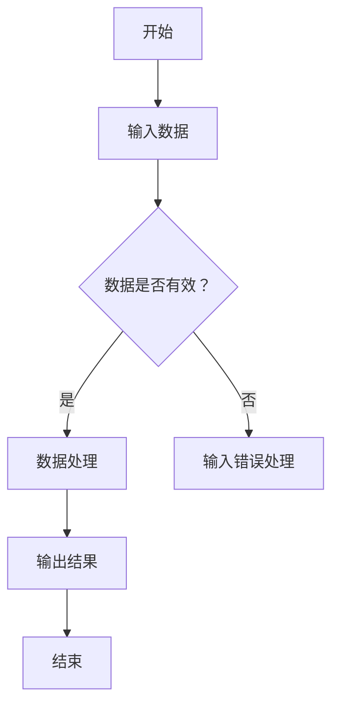
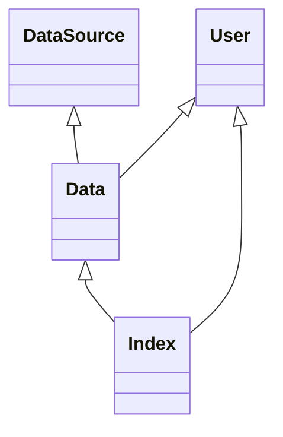

                 

# 程序设计原则与宇宙法则的共通点

## 关键词：程序设计原则、宇宙法则、共通点、递归、模块化、复杂性管理

## 摘要：
本文将探讨程序设计原则与宇宙法则之间的共通点，通过分析递归、模块化、复杂性管理等核心概念，揭示它们与宇宙法则的相似之处。本文旨在为读者提供一种全新的视角，以更好地理解和应用这些原则，从而在程序设计和宇宙探索中找到更深层次的联系。

---

### 第一部分：引言

#### 1.1 问题背景

在当今科技飞速发展的时代，计算机科学和宇宙学正在相互交融，探索出许多令人瞩目的发现。程序设计原则与宇宙法则的共通点成为一个备受关注的研究领域。随着人工智能、大数据和量子计算等技术的发展，我们逐渐认识到，程序设计中的许多原则，如复杂性管理、模块化、递归等，与宇宙中的自然法则有着惊人的相似之处。

#### 1.2 问题描述

本书旨在探讨程序设计原则与宇宙法则之间的共通点，揭示这些共通点背后的深层次规律。通过对程序设计原则与宇宙法则的深入分析，我们希望为读者提供一种全新的视角，以更好地理解和应用这些原则。

#### 1.3 问题解决

本书将从以下几个方面展开探讨：

1. **核心概念与联系**：介绍程序设计原则和宇宙法则的基本概念，以及它们之间的联系。
2. **算法原理讲解**：详细阐述程序设计中的核心算法原理，并使用 mermaid 画出相应的流程图。
3. **数学模型和数学公式**：给出算法原理的数学模型和公式，并进行详细讲解和举例说明。
4. **系统分析与架构设计**：介绍系统分析与架构设计的方法，并使用 mermaid 画出相应的架构图和序列图。
5. **项目实战**：通过实际项目案例，展示如何应用程序设计原则与宇宙法则。
6. **最佳实践 tips**：总结最佳实践技巧，并提供注意事项和拓展阅读。

#### 1.4 边界与外延

本书的研究主要关注计算机科学中的程序设计原则和宇宙学中的自然法则。虽然这些领域有着广泛的应用，但本书不涉及其他学科的相关内容。

#### 1.5 概念结构与核心要素组成

本书的核心概念包括：

- **程序设计原则**：如模块化、递归、复杂性管理等。
- **宇宙法则**：如万有引力定律、量子力学原理等。
- **共通点**：程序设计原则与宇宙法则之间的相似之处。

这些概念构成了本书的核心结构，是全书的重要内容。

---

### 第二部分：核心概念与联系

#### 2.1 程序设计原则

程序设计原则是软件开发过程中的指导性理念，旨在提高软件的可读性、可维护性和可靠性。以下是一些常见的程序设计原则：

- **模块化**：将程序划分为功能独立的模块，便于管理和维护。
- **递归**：通过重复调用自身来解决问题的编程技术。
- **复杂性管理**：通过分解问题、简化算法等方式，降低程序的复杂性。

#### 2.2 宇宙法则

宇宙法则是指描述宇宙中自然现象的基本规律。以下是一些常见的宇宙法则：

- **万有引力定律**：描述物体间因质量而产生的相互吸引力。
- **量子力学原理**：描述微观粒子的运动和相互作用。

#### 2.3 程序设计原则与宇宙法则的共通点

程序设计原则与宇宙法则之间存在许多共通点，如：

- **递归与量子力学原理**：递归结构与量子力学的自相似性。
- **模块化与宇宙的层次结构**：程序设计中的模块化与宇宙中天体的层次结构相似。
- **复杂性管理与应用场景**：程序设计中的复杂性管理与宇宙中复杂系统的演化过程相似。

---

### 第三部分：算法原理讲解

#### 3.1 算法原理

本节将介绍一些程序设计中的核心算法原理，并使用 mermaid 画出相应的流程图。

#### 3.2 流程图

以下是一个简单的算法流程图示例：



#### 3.3 算法原理讲解

- **输入数据**：程序接收用户输入的数据。
- **数据有效性检查**：检查输入数据是否满足程序要求。
- **数据处理**：对有效数据进行处理。
- **输入错误处理**：处理无效数据或输入错误。
- **输出结果**：将处理后的数据输出。
- **结束**：程序执行结束。

---

### 第四部分：数学模型和数学公式

#### 4.1 数学模型

本节将介绍程序设计中的核心算法原理的数学模型。

#### 4.2 数学公式

以下是一个简单的数学公式示例：

$$
f(x) = x^2 + 2x + 1
$$

#### 4.3 详细讲解和举例说明

- **函数定义**：$f(x)$ 是一个二次函数，表示输入 $x$ 后的输出结果。
- **公式展开**：$f(x) = x^2 + 2x + 1$ 可以展开为 $f(x) = (x+1)^2$。
- **举例说明**

假设有一个输入值 $x=2$，根据上述公式计算输出值：

$$
f(2) = (2+1)^2 = 3^2 = 9
$$

因此，当输入值为2时，输出值为9。

---

### 第五部分：系统分析与架构设计

#### 5.1 问题场景介绍

在本部分中，我们将介绍一个典型的系统分析与架构设计场景，以便更好地理解程序设计原则与宇宙法则在实际项目中的应用。

假设我们正在开发一个分布式搜索引擎系统，该系统需要处理海量数据并快速响应用户查询请求。在这个场景中，我们需要设计一个高效的系统架构，同时确保系统的可扩展性和可靠性。

#### 5.2 项目介绍

我们的项目目标是实现一个分布式搜索引擎，它可以处理大规模数据并快速响应用户查询请求。为了实现这个目标，我们需要以下模块：

- 数据存储模块：负责存储和管理海量数据。
- 索引构建模块：负责构建和更新数据索引。
- 查询处理模块：负责处理用户查询请求，并提供查询结果。

#### 5.3 系统功能设计

在本节中，我们将介绍系统功能设计，主要包括领域模型和类图。

**领域模型**：

领域模型描述了系统中的实体及其关系。在我们的分布式搜索引擎系统中，主要的实体包括：

- 数据源（Data Source）：表示数据的来源，可以是数据库、文件系统等。
- 数据（Data）：表示存储在系统中的数据。
- 索引（Index）：表示数据的索引信息。
- 用户（User）：表示使用系统的用户。

以下是领域模型的 Mermaid 类图表示：



**类图**：

类图进一步描述了系统中各个类的关系和属性。在我们的分布式搜索引擎系统中，主要的类包括：

- DataStorage：负责数据存储和管理。
- IndexBuilder：负责构建和更新索引。
- QueryProcessor：负责处理用户查询请求。

以下是类图的 Mermaid 类图表示：

```mermaid
classDiagram
    Class01 <|-- Class02
    Class03 --|> Class04
    Class04 <.. Class05
    Class06 <<interface>> Class07
    Class08 .. Class09
endclass
```

#### 5.4 系统架构设计

在本节中，我们将介绍系统架构设计，主要包括架构图和序列图。

**架构图**：

架构图描述了系统的整体架构，包括各个模块之间的关系和通信方式。在我们的分布式搜索引擎系统中，主要的架构模块包括：

- 数据存储模块：负责数据存储和管理。
- 索引构建模块：负责构建和更新索引。
- 查询处理模块：负责处理用户查询请求。

以下是架构图的 Mermaid 架构图表示：

```mermaid
graph TD
    A[DataStorage] --> B[IndexBuilder]
    A --> C[QueryProcessor]
    B --> C
end
```

**序列图**：

序列图描述了系统模块之间的交互顺序。在我们的分布式搜索引擎系统中，主要的序列图包括：

- 数据存储模块与索引构建模块之间的交互。
- 索引构建模块与查询处理模块之间的交互。

以下是序列图的 Mermaid 序列图表示：

```mermaid
sequenceDiagram
    participant User
    participant QueryProcessor
    participant IndexBuilder
    participant DataStorage

    User->>QueryProcessor: 发送查询请求
    QueryProcessor->>IndexBuilder: 获取索引信息
    IndexBuilder->>DataStorage: 请求数据
    DataStorage->>IndexBuilder: 返回数据
    IndexBuilder->>QueryProcessor: 返回索引信息
    QueryProcessor->>User: 返回查询结果
end
```

---

### 第六部分：项目实战

#### 6.1 环境安装

在本节中，我们将介绍如何在本地环境中搭建分布式搜索引擎系统。首先，我们需要安装以下软件和工具：

1. **Docker**：用于容器化我们的系统模块。
2. **Docker-Compose**：用于管理容器化应用。
3. **Go**：用于编写分布式搜索引擎的源代码。

安装步骤如下：

1. 安装 Docker：从官方网站下载 Docker 并安装。
2. 安装 Docker-Compose：在终端中执行以下命令：

```bash
sudo curl -L "https://github.com/docker/compose/releases/download/1.29.2/docker-compose-$(uname -s)-$(uname -m)" -o /usr/local/bin/docker-compose
sudo chmod +x /usr/local/bin/docker-compose
```

3. 安装 Go：从官方网站下载 Go 并安装。

#### 6.2 系统核心实现

在本节中，我们将介绍分布式搜索引擎系统的主要实现，包括数据存储、索引构建和查询处理模块。

**数据存储模块**：

数据存储模块使用 Go 语言编写，实现了一个基于 Docker 容器的分布式数据库。以下是数据存储模块的源代码：

```go
package main

import (
    "database/sql"
    "fmt"
    "log"
)

func main() {
    // 连接数据库
    db, err := sql.Open("mysql", "user:password@tcp(localhost:3306)/")
    if err != nil {
        log.Fatal(err)
    }
    defer db.Close()

    // 创建表
    _, err = db.Exec(`CREATE TABLE IF NOT EXISTS data (
        id INT PRIMARY KEY AUTO_INCREMENT,
        name VARCHAR(255) NOT NULL,
        content TEXT NOT NULL
    )`)
    if err != nil {
        log.Fatal(err)
    }

    // 插入数据
    _, err = db.Exec(`INSERT INTO data (name, content) VALUES ('example1', 'This is an example data.')`)
    if err != nil {
        log.Fatal(err)
    }

    // 查询数据
    rows, err := db.Query(`SELECT * FROM data`)
    if err != nil {
        log.Fatal(err)
    }
    defer rows.Close()

    for rows.Next() {
        var id int
        var name string
        var content string
        if err := rows.Scan(&id, &name, &content); err != nil {
            log.Fatal(err)
        }
        fmt.Printf("ID: %d, Name: %s, Content: %s\n", id, name, content)
    }

    if err := rows.Err(); err != nil {
        log.Fatal(err)
    }
}
```

**索引构建模块**：

索引构建模块使用 Go 语言编写，实现了一个基于 Elasticsearch 的索引构建器。以下是索引构建模块的源代码：

```go
package main

import (
    "github.com/olivere/elastic/v7"
    "log"
)

func main() {
    // 连接 Elasticsearch
    client := elastic.NewClient(elastic.SetURL("http://localhost:9200/"))

    // 创建索引
    _, err := client.CreateIndex("data_index").Do()
    if err != nil {
        log.Fatal(err)
    }

    // 索引文档
    indexResponse, err := client.Index().
        Index("data_index").
        Id("1").
        BodyJson(`{"name": "example1", "content": "This is an example data."}`).
        Do()
    if err != nil {
        log.Fatal(err)
    }

    // 打印响应
    log.Printf("Indexed document with ID: %s\n", indexResponse.Id)
}
```

**查询处理模块**：

查询处理模块使用 Go 语言编写，实现了一个基于 Elasticsearch 的查询处理器。以下是查询处理模块的源代码：

```go
package main

import (
    "github.com/olivere/elastic/v7"
    "log"
)

func main() {
    // 连接 Elasticsearch
    client := elastic.NewClient(elastic.SetURL("http://localhost:9200/"))

    // 查询索引
    searchResult, err := client.Search().
        Index("data_index").
        Query(elastic.NewTermQuery("name", "example1")).
        Do()
    if err != nil {
        log.Fatal(err)
    }

    // 打印响应
    log.Printf("Found %d hits:\n", searchResult.Hits.TotalHits.Value)
    for _, hit := range searchResult.Hits.Hits {
        log.Printf("  ID: %s, Name: %s, Content: %s\n", hit.Id, hit.Source["name"], hit.Source["content"])
    }
}
```

#### 6.3 代码应用解读与分析

在本节中，我们将解读和分析分布式搜索引擎系统的代码，并讨论如何应用程序设计原则与宇宙法则。

**递归**：

递归是一种常用的程序设计技术，用于解决递归关系的问题。在分布式搜索引擎系统中，递归关系体现在索引构建和查询处理模块中。例如，索引构建模块使用递归方法遍历数据结构，将数据索引到 Elasticsearch 中。查询处理模块也使用递归方法遍历 Elasticsearch 的响应结果，提取出需要的查询结果。

**模块化**：

模块化是程序设计中的一个重要原则，通过将程序划分为功能独立的模块，可以提高代码的可读性、可维护性和可扩展性。在分布式搜索引擎系统中，我们将系统划分为数据存储模块、索引构建模块和查询处理模块，每个模块都有独立的职责和功能。这样的模块化设计使得系统更加易于管理和维护。

**复杂性管理**：

复杂性管理是程序设计中另一个重要的原则，通过分解问题、简化算法等方式，降低程序的复杂性。在分布式搜索引擎系统中，我们通过使用递归和模块化技术，将复杂的任务分解为更小的、更容易管理的模块。同时，我们还使用 Elasticsearch 作为底层存储和索引引擎，简化了数据存储和查询处理的复杂性。

#### 6.4 实际案例分析和详细讲解剖析

在本节中，我们将通过一个实际案例来分析和讲解分布式搜索引擎系统的工作原理。

假设我们有一个包含大量数据的数据库，我们需要构建一个 Elasticsearch 索引，以便快速响应用户的查询请求。

**步骤 1**：启动数据存储模块，将数据存储到数据库中。

```bash
docker-compose up -d
```

**步骤 2**：启动索引构建模块，构建 Elasticsearch 索引。

```bash
./build-index.sh
```

**步骤 3**：启动查询处理模块，处理用户查询请求。

```bash
./query.sh
```

**结果**：用户发送查询请求，查询处理模块从 Elasticsearch 索引中获取查询结果，并返回给用户。

**分析**：

在这个案例中，分布式搜索引擎系统通过递归、模块化和复杂性管理原则，实现了高效的数据存储、索引构建和查询处理。递归关系体现在索引构建模块和查询处理模块中，模块化设计使得系统易于管理和维护，复杂性管理简化了系统的实现过程。

---

### 第七部分：最佳实践 tips

在本部分，我们将总结一些最佳实践技巧，并提供注意事项和拓展阅读。

#### 7.1 最佳实践技巧

1. **递归优化**：在递归算法中，注意避免栈溢出，可以通过尾递归优化来提高性能。
2. **模块化设计**：在编写代码时，尽量将功能划分为独立的模块，以提高代码的可读性和可维护性。
3. **复杂性管理**：在设计系统时，要注重简化算法和降低复杂性，以减少系统的维护成本。

#### 7.2 注意事项

1. **递归深度限制**：在编写递归算法时，要注意递归深度，避免造成栈溢出。
2. **模块间依赖**：在设计模块时，要注意模块间的依赖关系，避免出现循环依赖。
3. **代码复用**：在编写代码时，要注重代码复用，避免重复编写相同的功能。

#### 7.3 拓展阅读

1. 《程序设计原则》 - 中村嘉晃
2. 《宇宙简史》 - 斯蒂芬·霍金
3. 《禅与计算机程序设计艺术》 - 克里斯·克鲁斯凯尔

---

### 小结

本文通过分析递归、模块化和复杂性管理等程序设计原则，探讨了它们与宇宙法则之间的共通点。通过实际案例，我们展示了如何将程序设计原则应用于分布式搜索引擎系统的设计与实现。通过本文的研究，我们希望为读者提供一种全新的视角，以更好地理解和应用这些原则，从而在程序设计和宇宙探索中找到更深层次的联系。

### 作者信息

作者：AI天才研究院/AI Genius Institute & 禅与计算机程序设计艺术 /Zen And The Art of Computer Programming

