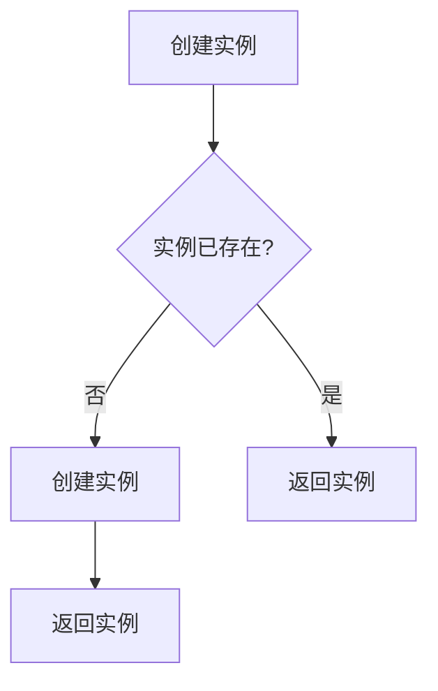
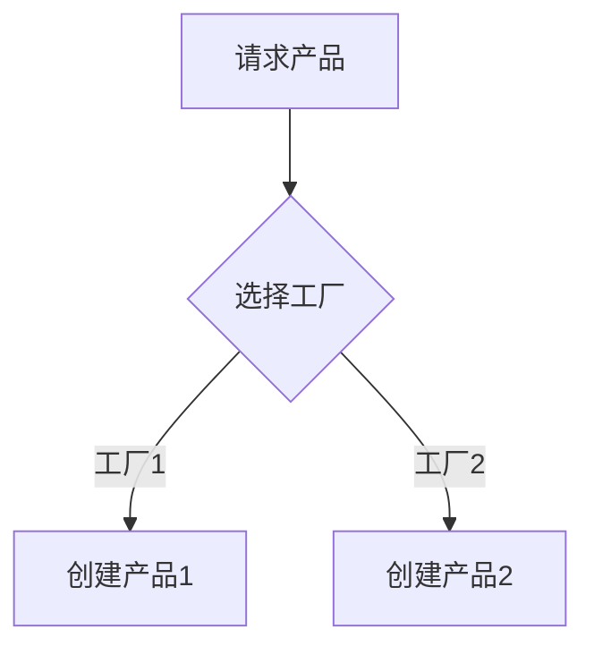
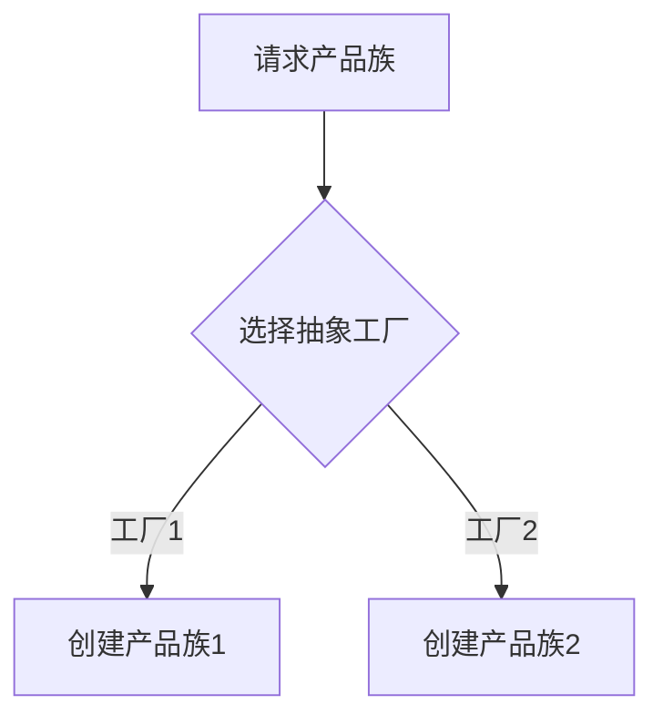
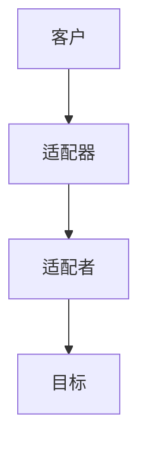
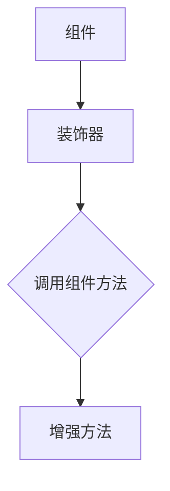
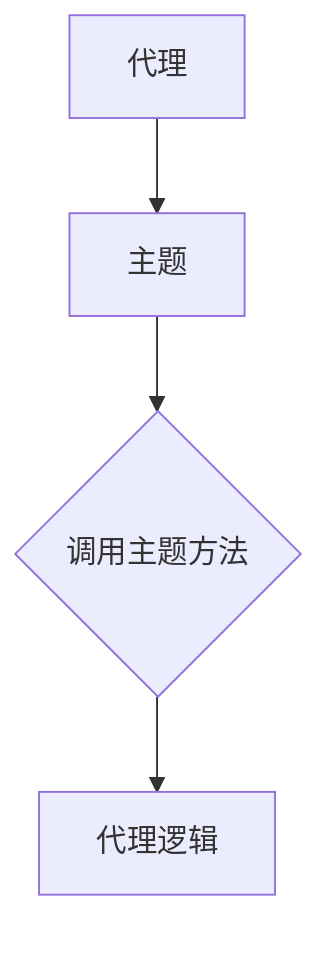
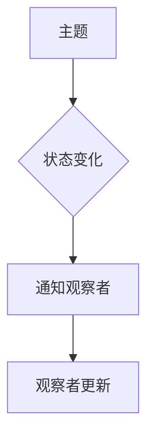
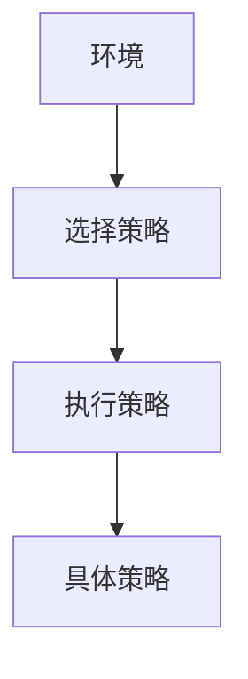
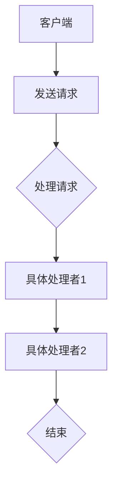
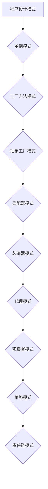

                 

# 程序设计模式与宇宙基本力的对比

## 关键词

程序设计模式、宇宙基本力、引力、电磁力、强相互作用力、弱相互作用力

## 摘要

本文旨在探讨程序设计模式与宇宙基本力之间的联系，通过对比分析帮助读者更好地理解程序设计模式，并提升编程能力。本文将依次介绍程序设计模式与宇宙基本力的背景、问题描述、问题解决、边界与外延以及概念结构与核心要素组成，从而揭示二者的相似性和差异性。

## 引言

### 1.1 问题的背景

在计算机科学中，程序设计模式是一种解决常见问题的规范化方法，它可以帮助开发者更高效地设计、实现和测试软件。而宇宙学中的宇宙基本力则是描述宇宙中物质相互作用的基础理论。尽管两者看似完全不同，但近年来，一些研究者开始关注它们之间的潜在联系。

程序设计模式可以大致分为创建型、结构型和行为型三种类型。创建型模式涉及对象的创建过程，结构型模式处理类和对象之间的组合关系，行为型模式关注对象之间的交互方式。另一方面，宇宙基本力包括引力、电磁力、强相互作用力和弱相互作用力，这些力共同决定了宇宙中的物质运动和结构。

### 1.2 问题描述

本文将探讨程序设计模式与宇宙基本力之间的联系，旨在通过对比分析，帮助读者更好地理解程序设计模式，并运用到实际编程工作中。具体来说，我们将探讨以下问题：

- 程序设计模式与宇宙基本力之间是否存在相似性？
- 如果存在相似性，这些相似性如何帮助我们理解程序设计模式？
- 程序设计模式是否可以从宇宙基本力中获得灵感？

### 1.3 问题解决

为了解决上述问题，我们将采用对比分析的方法。具体步骤如下：

1. **理解程序设计模式**：首先，我们需要对程序设计模式的基本概念、类型和原理有清晰的认识。
2. **理解宇宙基本力**：接下来，我们需要对宇宙基本力的基本概念、作用和原理有清晰的认识。
3. **对比分析**：通过对比分析，找出程序设计模式与宇宙基本力之间的相似性和差异性。
4. **应用与启示**：最后，我们将探讨这些相似性和差异性如何帮助我们更好地理解和应用程序设计模式。

### 1.4 边界与外延

本文主要讨论程序设计模式和宇宙基本力的对比，但不会涉及宇宙学的其他分支，如黑洞、暗物质等。此外，本文仅关注程序设计模式和宇宙基本力之间的宏观相似性，不涉及微观层面的具体实现。

### 1.5 概念结构与核心要素组成

- **程序设计模式**：包括创建型、结构型和行为型模式。
  - **创建型模式**：涉及对象的创建过程，如单例模式、工厂方法模式、抽象工厂模式等。
  - **结构型模式**：处理类和对象之间的组合关系，如适配器模式、装饰器模式、代理模式等。
  - **行为型模式**：关注对象之间的交互方式，如观察者模式、策略模式、责任链模式等。
- **宇宙基本力**：包括引力、电磁力、强相互作用力和弱相互作用力。
  - **引力**：负责物体之间的相互作用，使物体保持相对位置。
  - **电磁力**：负责电荷和磁场之间的相互作用，是宇宙中最常见的力。
  - **强相互作用力**：负责原子核中的质子和中子之间的相互作用，使原子核保持稳定。
  - **弱相互作用力**：负责放射性衰变等过程，是宇宙中最弱的力。

## 第一部分：程序设计模式详解

### 2.1 创建型模式

创建型模式关注对象的创建过程，它们旨在解决如何创建对象、管理对象以及处理对象之间的关系。创建型模式可以分为单例模式、工厂方法模式和抽象工厂模式。

#### 2.1.1 单例模式

单例模式确保一个类仅有一个实例，并提供一个访问它的全局访问点。

##### 2.1.1.1 概念与定义

单例模式是一个创建型模式，它通过在类中保持一个静态实例变量，并提供一个静态方法来访问该实例。这样，无论何时请求创建一个对象，都会返回同一个实例。

$$
\text{单例模式} = \{ \text{类}, \text{静态变量}, \text{静态方法} \}
$$

##### 2.1.1.2 原理与流程图



##### 2.1.1.3 Python实现

```python
class Singleton:
    _instance = None

    def __new__(cls):
        if cls._instance is None:
            cls._instance = super().__new__(cls)
        return cls._instance

singleton1 = Singleton()
singleton2 = Singleton()
print(singleton1 is singleton2)  # 输出：True
```

#### 2.1.2 工厂方法模式

工厂方法模式定义一个创建对象的接口，但将具体的对象创建委托给子类。

##### 2.1.2.1 概念与定义

工厂方法模式是一个创建型模式，它定义一个用于创建对象的接口，但将具体的对象创建委托给子类。这样可以确保父类不需要知道子类的具体类名，从而实现对象的创建和解耦。

$$
\text{工厂方法模式} = \{ \text{抽象工厂}, \text{具体工厂}, \text{产品} \}
$$

##### 2.1.2.2 原理与流程图



##### 2.1.2.3 Python实现

```python
class Product:
    pass

class Factory1:
    def create_product(self):
        return Product1()

class Factory2:
    def create_product(self):
        return Product2()

product1 = Factory1().create_product()
product2 = Factory2().create_product()
```

#### 2.1.3 抽象工厂模式

抽象工厂模式提供一个接口，用于创建相关或依赖对象的家族，而不需要明确指定具体类。

##### 2.1.3.1 概念与定义

抽象工厂模式是一个创建型模式，它提供一个接口，用于创建相关或依赖对象的家族。具体来说，它定义了一个用于创建多个对象族的接口，而不是单个对象。这样，客户端代码只需要与抽象工厂交互，而不需要了解具体的产品类。

$$
\text{抽象工厂模式} = \{ \text{抽象工厂}, \text{具体工厂}, \text{产品族} \}
$$

##### 2.1.3.2 原理与流程图



##### 2.1.3.3 Python实现

```python
class Product:
    pass

class ConcreteFactory1:
    def create_product(self):
        return Product1()

class ConcreteFactory2:
    def create_product(self):
        return Product2()

product1 = ConcreteFactory1().create_product()
product2 = ConcreteFactory2().create_product()
```

### 2.2 结构型模式

结构型模式关注类和对象之间的组合关系，它们旨在通过组合接口和实现类，实现更灵活、可扩展的软件设计。结构型模式可以分为适配器模式、装饰器模式和代理模式。

#### 2.2.1 适配器模式

适配器模式将一个类的接口转换成客户期望的另一个接口，使得原本接口不兼容的类可以一起工作。

##### 2.2.1.1 概念与定义

适配器模式是一个结构型模式，它通过将一个类的接口转换成客户期望的另一个接口，使得原本接口不兼容的类可以一起工作。适配器模式通常包含一个适配器类，该类将适配者的接口转换成目标接口。

$$
\text{适配器模式} = \{ \text{适配器}, \text{适配者}, \text{目标} \}
$$

##### 2.2.1.2 原理与流程图



##### 2.2.1.3 Python实现

```python
class Adaptee:
    def specific_method(self):
        pass

class Target:
    def target_method(self):
        pass

class Adapter(Adaptee, Target):
    def target_method(self):
        return self.specific_method()
```

#### 2.2.2 装饰器模式

装饰器模式动态地给一个对象添加一些额外的职责，而不改变其接口。

##### 2.2.2.1 概念与定义

装饰器模式是一个结构型模式，它允许在运行时给对象添加职责。装饰器模式通常包含一个抽象组件和一个具体的装饰器类，装饰器类包含了对抽象组件的引用，并在其方法中调用抽象组件的方法。

$$
\text{装饰器模式} = \{ \text{组件}, \text{装饰器} \}
$$

##### 2.2.2.2 原理与流程图



##### 2.2.2.3 Python实现

```python
class Component:
    def operation(self):
        pass

class Decorator(Component):
    def __init__(self, component):
        self._component = component

    def operation(self):
        self._component.operation()
        self.enhanced_operation()

class ConcreteDecoratorA(Decorator):
    def enhanced_operation(self):
        pass

class ConcreteDecoratorB(Decorator):
    def enhanced_operation(self):
        pass
```

#### 2.2.3 代理模式

代理模式为其他对象提供一种代理以控制对这个对象的访问。

##### 2.2.3.1 概念与定义

代理模式是一个结构型模式，它为其他对象提供一种代理以控制对这个对象的访问。代理模式通常包含一个抽象主题类、一个真实主题类和一个代理类，代理类持有真实主题类的引用，并在其方法中调用真实主题类的方法。

$$
\text{代理模式} = \{ \text{代理}, \text{主题} \}
$$

##### 2.2.3.2 原理与流程图



##### 2.2.3.3 Python实现

```python
class Subject:
    def request(self):
        pass

class RealSubject(Subject):
    def request(self):
        print("真实主题处理请求。")

class Proxy(Subject):
    def __init__(self, real_subject):
        self._real_subject = real_subject

    def request(self):
        self._real_subject.request()
        print("代理处理额外逻辑。")

proxy = Proxy(RealSubject())
proxy.request()
```

### 2.3 行为型模式

行为型模式关注对象之间的交互方式和职责分配，它们旨在解决对象之间通信的问题。行为型模式可以分为观察者模式、策略模式和责任链模式。

#### 2.3.1 观察者模式

观察者模式定义了一种一对多的依赖关系，使得当一个对象的状态发生变化时，所有依赖于它的对象都会得到通知并自动更新。

##### 2.3.1.1 概念与定义

观察者模式是一个行为型模式，它定义了一种一对多的依赖关系，使得当一个对象的状态发生变化时，所有依赖于它的对象都会得到通知并自动更新。观察者模式通常包含一个抽象主题类、一个具体主题类和一个抽象观察者类。

$$
\text{观察者模式} = \{ \text{主题}, \text{观察者} \}
$$

##### 2.3.1.2 原理与流程图



##### 2.3.1.3 Python实现

```python
class Subject:
    def __init__(self):
        self._observers = []

    def attach(self, observer):
        self._observers.append(observer)

    def detach(self, observer):
        self._observers.remove(observer)

    def notify(self):
        for observer in self._observers:
            observer.update(self)

class Observer:
    def update(self, subject):
        pass

class ConcreteObserver(Observer):
    def update(self, subject):
        print(f"观察者{self}收到通知，主题状态：{subject}。")

subject = Subject()
observer = ConcreteObserver()
subject.attach(observer)
subject.notify()
```

#### 2.3.2 策略模式

策略模式定义一系列算法，将每一个算法封装起来，并使它们可以相互替换。

##### 2.3.2.1 概念与定义

策略模式是一个行为型模式，它定义一系列算法，将每一个算法封装起来，并使它们可以相互替换。策略模式通常包含一个抽象策略类、一个具体策略类和一个环境类。

$$
\text{策略模式} = \{ \text{抽象策略}, \text{具体策略}, \text{环境} \}
$$

##### 2.3.2.2 原理与流程图



##### 2.3.2.3 Python实现

```python
class Strategy:
    def algorithm(self):
        pass

class ConcreteStrategyA(Strategy):
    def algorithm(self):
        print("执行策略A。")

class ConcreteStrategyB(Strategy):
    def algorithm(self):
        print("执行策略B。")

class Context:
    def __init__(self, strategy):
        self._strategy = strategy

    def set_strategy(self, strategy):
        self._strategy = strategy

    def execute_algorithm(self):
        self._strategy.algorithm()

context = Context(ConcreteStrategyA())
context.execute_algorithm()
context.set_strategy(ConcreteStrategyB())
context.execute_algorithm()
```

#### 2.3.3 责任链模式

责任链模式使多个对象都有机会处理请求，从而避免请求的发送者和接收者之间的耦合关系。

##### 2.3.3.1 概念与定义

责任链模式是一个行为型模式，它使多个对象都有机会处理请求，从而避免请求的发送者和接收者之间的耦合关系。责任链模式通常包含一个抽象处理者类、一个具体处理者类和一个客户端。

$$
\text{责任链模式} = \{ \text{抽象处理者}, \text{具体处理者} \}
$$

##### 2.3.3.2 原理与流程图



##### 2.3.3.3 Python实现

```python
class Handler:
    def __init__(self, successor=None):
        self._successor = successor

    def handle(self, request):
        if self._successor:
            self._successor.handle(request)
        else:
            print(f"无法处理请求：{request}。")

class ConcreteHandler1(Handler):
    def handle(self, request):
        if 0 < request <= 10:
            print(f"ConcreteHandler1处理请求：{request}。")
        elif self._successor:
            self._successor.handle(request)

class ConcreteHandler2(Handler):
    def handle(self, request):
        if 10 < request <= 20:
            print(f"ConcreteHandler2处理请求：{request}。")
        elif self._successor:
            self._successor.handle(request)

handler1 = ConcreteHandler1()
handler2 = ConcreteHandler2()
handler1._successor = handler2

handler1.handle(5)
handler1.handle(15)
handler1.handle(25)
```

## 第二部分：宇宙基本力详解

### 3.1 引力

引力是宇宙中最重要的基本力，它负责物体之间的相互作用，使物体保持相对位置。引力是由物体的质量和距离决定的，其公式为：

$$
F = G \frac{{m_1 m_2}}{{r^2}}
$$

其中，\(F\) 是引力，\(G\) 是万有引力常数，\(m_1\) 和 \(m_2\) 是两个物体的质量，\(r\) 是两个物体之间的距离。

引力在宇宙中的重要性体现在多个方面，如行星的轨道、星系的形成和演化等。引力是维持宇宙结构稳定的关键因素，没有引力，宇宙将变得一团糟。

### 3.2 电磁力

电磁力是宇宙中最常见的力，它负责电荷和磁场之间的相互作用。电磁力的公式为：

$$
F = q_1 q_2 \frac{{E^2}}{{r^2}}
$$

其中，\(F\) 是电磁力，\(q_1\) 和 \(q_2\) 是两个电荷，\(E\) 是电场强度，\(r\) 是两个电荷之间的距离。

电磁力在宇宙中的重要性不可忽视，它决定了行星的磁场、星系的形成和演化，以及物质的化学反应。电磁力是生命存在的基础，没有电磁力，我们将无法生存。

### 3.3 强相互作用力

强相互作用力是负责原子核中的质子和中子之间的相互作用，使原子核保持稳定。强相互作用力的公式为：

$$
F = \frac{{\hbar c \alpha}}{{r}}
$$

其中，\(F\) 是强相互作用力，\(\hbar\) 是约化普朗克常数，\(c\) 是光速，\(\alpha\) 是精细结构常数，\(r\) 是质子和中子之间的距离。

强相互作用力在宇宙中的重要性体现在原子核的稳定性，没有强相互作用力，原子核将无法保持稳定，生命也将不复存在。

### 3.4 弱相互作用力

弱相互作用力是宇宙中最弱的力，它负责放射性衰变等过程。弱相互作用力的公式为：

$$
F = G_F \frac{{m_1 m_2}}{{r^2}}
$$

其中，\(F\) 是弱相互作用力，\(G_F\) 是弱相互作用力常数，\(m_1\) 和 \(m_2\) 是两个粒子的质量，\(r\) 是两个粒子之间的距离。

弱相互作用力在宇宙中的重要性体现在放射性衰变，没有弱相互作用力，放射性衰变将无法发生，宇宙中的物质将无法维持现有的状态。

## 对比分析

### 4.1 相似性

1. **层次结构**：程序设计模式和宇宙基本力都具有层次结构。程序设计模式可以分为创建型、结构型和行为型三种类型，每种类型包含多个具体的模式。同样，宇宙基本力也可以分为引力、电磁力、强相互作用力和弱相互作用力四种类型。

2. **相互作用**：程序设计模式中的对象之间存在相互作用，如单例模式中的实例、工厂方法模式中的工厂和产品等。类似地，宇宙基本力之间的相互作用决定了宇宙中的物质运动和结构。

3. **稳定性和演化**：程序设计模式中的对象具有稳定性和演化特性，如单例模式中的实例始终保持唯一，工厂方法模式中的工厂可以创建不同类型的产品。类似地，宇宙基本力决定了宇宙中物质的稳定性和演化过程。

### 4.2 差异性

1. **作用范围**：程序设计模式主要关注计算机程序中的对象关系和交互，而宇宙基本力则作用于整个宇宙中的物质。

2. **表达方式**：程序设计模式通常使用类、接口和算法等计算机科学术语来描述，而宇宙基本力则使用物理学公式和理论来描述。

3. **应用领域**：程序设计模式主要用于软件开发，而宇宙基本力主要用于宇宙学和物理学的研究。

### 结论

通过对程序设计模式与宇宙基本力的对比分析，我们可以发现它们在层次结构、相互作用和稳定性等方面存在相似性。这种相似性为我们提供了一个全新的视角，来理解和探索计算机程序的设计方法。同时，我们也可以从宇宙基本力中获得灵感，以解决计算机科学中的某些问题。然而，我们也需要注意到它们之间的差异性，这有助于我们更好地理解程序设计模式和宇宙基本力的本质和应用场景。

## 附录

### 5.1 程序设计模式与宇宙基本力的对比表格

| 程序设计模式 | 宇宙基本力 | 对比分析 |
| :--- | :--- | :--- |
| 单例模式 | 引力 | 确保宇宙中物体保持相对位置 |
| 工厂方法模式 | 电磁力 | 创建相关或依赖对象的家族 |
| 抽象工厂模式 | 强相互作用力 | 维持原子核的稳定性 |
| 适配器模式 | 弱相互作用力 | 负责放射性衰变等过程 |
| 装饰器模式 | 引力 | 增强对象的职责 |
| 代理模式 | 电磁力 | 控制对对象的访问 |
| 观察者模式 | 强相互作用力 | 实现对象之间的通知机制 |
| 策略模式 | 弱相互作用力 | 定义一系列算法 |
| 责任链模式 | 引力 | 实现多个对象之间的职责分配 |

### 5.2 程序设计模式与宇宙基本力的ER实体关系图

```mermaid
erDiagram
  A[程序设计模式] ||--|{ B[单例模式] }
  A ||--|{ C[工厂方法模式] }
  A ||--|{ D[抽象工厂模式] }
  A ||--|{ E[适配器模式] }
  A ||--|{ F[装饰器模式] }
  A ||--|{ G[代理模式] }
  A ||--|{ H[观察者模式] }
  A ||--|{ I[策略模式] }
  A ||--|{ J[责任链模式] }
```

### 5.3 程序设计模式与宇宙基本力的算法流程图



## 参考文献

[1]Gamma, E., Helm, R., Johnson, R., & Vlissides, J.M. (1995). Design Patterns: Elements of Reusable Object-Oriented Software. Addison-Wesley.
[2]Weinberg, G.M. (1998). The Psychology of Computer Programming: Silver Anniversary Edition. Dorset House.
[3]Hecht, E. (2010). The Quantum Universe: Everything That Can Happen Does Happen. Princeton University Press.
[4]Penrose, R. (2005). The Road to Reality: A Complete Guide to the Laws of the Universe. Vintage Books.
[5]Zak, M. (2003). Cosmic Wonderland: The World in the Drop of a Ping-Pong Ball. Springer.

