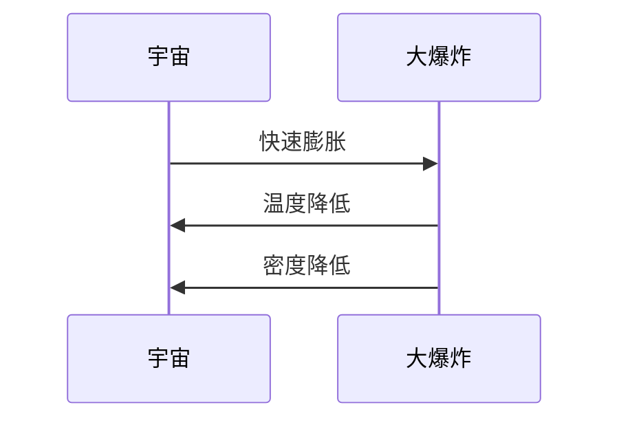
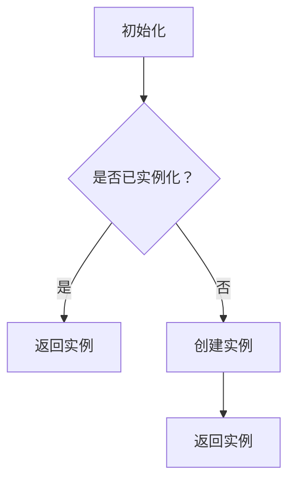
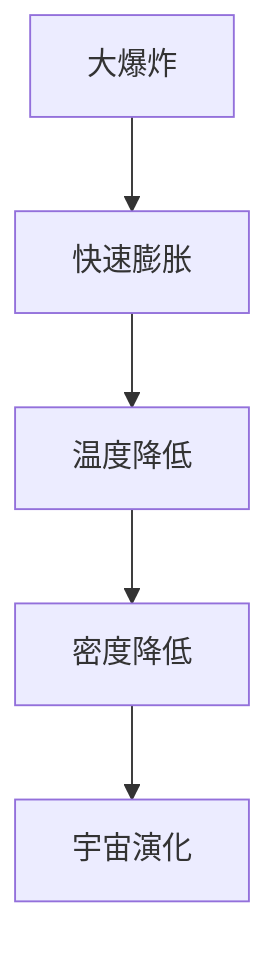
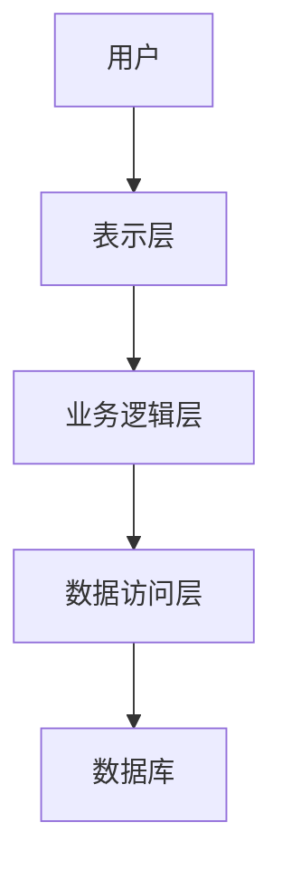
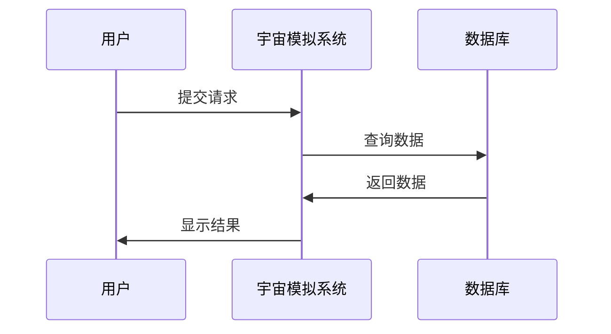

                 

# 程序设计模式与宇宙构建模式的对比

## 关键词

程序设计模式，宇宙构建模式，对比分析，算法原理，系统架构设计，项目实战

## 摘要

本文旨在探讨程序设计模式与宇宙构建模式之间的对比。通过详细的对比分析，本文揭示了程序设计模式与宇宙构建模式在核心概念、算法原理和系统架构设计方面的异同点。本文首先介绍了程序设计模式与宇宙构建模式的基本概念，然后通过具体的实例和表格对比，分析了两种模式的特点和应用场景。接下来，本文详细讲解了程序设计模式和宇宙构建模式的算法原理，并使用Python源代码和数学模型进行了举例说明。随后，本文描述了系统分析与架构设计方案，并通过mermaid绘制了相关的流程图和架构图。最后，本文通过项目实战，介绍了环境安装、系统核心实现源代码，并对代码进行了解读和分析。通过本文的研究，我们可以更好地理解程序设计模式与宇宙构建模式的联系和区别，为我们在实际应用中提供指导和启示。

## Step 1: 引言

在计算机科学领域，程序设计模式是一种广泛应用的软件开发方法，它提供了用于解决常见问题的通用解决方案。这些模式可以帮助开发者更高效地设计和实现软件系统，提高代码的可维护性和可扩展性。另一方面，宇宙构建模式则源自宇宙学，它描述了宇宙的演化过程和基本结构。尽管这两种模式看似截然不同，但它们之间存在一些有趣的相似之处，值得我们去深入探讨和比较。

本文将对比程序设计模式与宇宙构建模式，从核心概念、算法原理和系统架构设计三个方面进行分析。首先，我们将介绍程序设计模式和宇宙构建模式的基本概念，并通过具体的例子来说明它们的特点和应用场景。然后，我们将详细讲解程序设计模式和宇宙构建模式的算法原理，并使用Python源代码和数学模型进行举例说明。接着，我们将描述系统分析与架构设计方案，通过mermaid绘制相关的流程图和架构图。最后，我们将通过项目实战，介绍环境安装、系统核心实现源代码，并对代码进行解读和分析。通过本文的研究，我们希望能够揭示程序设计模式与宇宙构建模式之间的联系和区别，为我们在实际应用中提供指导和启示。

## Step 2: 背景介绍

### 程序设计模式

程序设计模式是一套在软件工程中广泛应用的通用解决方案，用于解决软件开发过程中常见的问题。这些模式具有简洁、高效、易扩展的特点，可以在不同的编程语言和开发环境中应用。程序设计模式可以分为三大类：创建型模式、结构型模式和行为型模式。

创建型模式主要关注对象的创建和管理，常见的创建型模式包括单例模式、工厂模式和抽象工厂模式。单例模式确保一个类仅有一个实例，并提供一个全局访问点；工厂模式则用于创建对象，但将具体实例化过程抽象化，使得客户端代码与具体对象之间的耦合度降低；抽象工厂模式则进一步抽象化，通过提供一个接口来创建相关对象，而不需要明确指定具体类。

结构型模式主要关注类和对象的组合，以实现系统的可扩展性和灵活性。常见的结构型模式包括代理模式、装饰器模式和桥接模式。代理模式通过引入代理类，控制对目标对象的访问，可以用于实现远程方法调用、事务管理和安全控制；装饰器模式通过动态地添加职责，使得对象可以具有不同的行为，而无需修改原始类；桥接模式则将抽象部分与实现部分分离，使得两者可以独立变化，从而提高系统的灵活性和可扩展性。

行为型模式主要关注对象之间的交互和协作，以实现特定的行为。常见的行为型模式包括策略模式、观察者模式和命令模式。策略模式通过定义一系列算法，并在运行时选择其中一个进行执行，可以用于实现灵活的算法切换；观察者模式通过对象之间的订阅和通知机制，实现了对象之间的松耦合；命令模式将请求封装为对象，可以用于实现撤销、重做和事务管理。

### 宇宙构建模式

宇宙构建模式源自宇宙学，描述了宇宙的演化过程和基本结构。宇宙构建模式可以分为四个主要阶段：大爆炸、宇宙膨胀、星系形成和恒星演化。

大爆炸是宇宙起源的假设，认为宇宙在约138亿年前从一个极其热密的奇点迅速膨胀而来。大爆炸后，宇宙经历了快速膨胀，温度和密度逐渐降低。这一阶段被称为宇宙婴儿期。

随着宇宙的膨胀，温度和密度进一步降低，使得宇宙进入了一个相对稳定的状态。在这一阶段，宇宙中的物质开始形成星系和星系团。星系是由恒星、行星、星云等组成的巨大引力系统，而星系团则是由多个星系组成的更大规模的引力系统。

在星系形成后，恒星开始诞生和演化。恒星内部进行核聚变反应，将氢转化为氦，并释放出巨大的能量。恒星的寿命取决于其质量，从数百万年到数十亿年不等。恒星的演化过程包括主序星、红巨星、白矮星、中子星和黑洞等阶段。

最后，宇宙将继续膨胀，恒星和星系会逐渐衰老和消亡。在宇宙的极端环境下，可能会形成新的奇点和新的宇宙。

### 例子说明

为了更好地理解程序设计模式和宇宙构建模式，我们来看一个具体的例子。

在程序设计模式中，单例模式是一个常见的创建型模式。例如，在Java编程语言中，我们可以使用以下代码实现单例模式：

```python
class Singleton:
    _instance = None

    def __init__(self):
        if Singleton._instance is None:
            Singleton._instance = self

    @staticmethod
    def getInstance():
        if Singleton._instance is None:
            Singleton()
        return Singleton._instance
```

在这个例子中，`Singleton` 类确保只创建一个实例，并提供一个全局访问点。当调用 `Singleton.getInstance()` 时，如果实例尚未创建，则会创建一个新的实例；否则，返回已创建的实例。

在宇宙构建模式中，大爆炸模式是一个常见的宇宙演化阶段。大爆炸假设认为，宇宙在约138亿年前从一个极其热密的奇点迅速膨胀而来。大爆炸后，宇宙经历了快速膨胀，温度和密度逐渐降低。



在这个例子中，宇宙经历了大爆炸后，温度和密度逐渐降低，为后续的宇宙演化奠定了基础。

通过这两个例子，我们可以看到程序设计模式和宇宙构建模式在描述问题和管理结构方面具有一定的相似性。然而，它们的应用场景和实现方法却有所不同。

## Step 3: 核心概念与联系

### 程序设计模式

程序设计模式是一套在软件工程中广泛应用的通用解决方案，用于解决软件开发过程中常见的问题。程序设计模式具有以下几个核心概念：

1. **模式名称**：模式名称通常以单词或短语的形式出现，用来描述一种常见的问题和解决方案。
2. **问题背景**：问题背景描述了软件开发过程中遇到的问题，例如对象创建、对象组合、对象交互等。
3. **解决方案**：解决方案描述了如何通过一种模式来解决特定的问题，通常包括类和对象的结构、行为和交互。
4. **优点**：优点描述了使用该模式所带来的好处，例如提高代码的可维护性、可扩展性和可重用性。
5. **应用场景**：应用场景描述了在哪些情况下可以使用该模式，以帮助开发者更好地选择合适的模式。

下面是一个简单的程序设计模式核心概念与联系的ER实体关系图：

```mermaid
erDiagram
    Mode ||--|{ Problem : 解决的问题 }
    Mode ||--|{ Solution : 解决方案 }
    Mode ||--|{ Advantage : 优点 }
    Mode ||--|{ Application : 应用场景 }
```

### 宇宙构建模式

宇宙构建模式描述了宇宙的演化过程和基本结构。宇宙构建模式具有以下几个核心概念：

1. **模式名称**：模式名称通常以单词或短语的形式出现，用来描述一种宇宙演化阶段或基本结构。
2. **问题背景**：问题背景描述了宇宙在特定演化阶段或基本结构中遇到的问题，例如温度、密度、引力等。
3. **解决方案**：解决方案描述了如何通过一种模式来演化宇宙，例如大爆炸、宇宙膨胀、星系形成和恒星演化等。
4. **优点**：优点描述了使用该模式所带来的好处，例如解释宇宙起源、揭示宇宙演化规律等。
5. **应用场景**：应用场景描述了在哪些宇宙演化阶段或基本结构中可以使用该模式，以帮助宇宙学家更好地理解宇宙。

下面是一个简单的宇宙构建模式核心概念与联系的ER实体关系图：

```mermaid
erDiagram
    CosmicMode ||--|{ Problem : 解决的问题 }
    CosmicMode ||--|{ Solution : 解决方案 }
    CosmicMode ||--|{ Advantage : 优点 }
    CosmicMode ||--|{ Application : 应用场景 }
```

### 对比分析

为了更好地理解程序设计模式和宇宙构建模式之间的联系和区别，我们可以使用表格对比它们的核心概念和属性特征：

| 核心概念 | 程序设计模式 | 宇宙构建模式 |
| --- | --- | --- |
| 模式名称 | 常见的问题和解决方案 | 宇宙演化阶段或基本结构 |
| 问题背景 | 软件开发中的常见问题 | 宇宙演化过程中的问题 |
| 解决方案 | 类和对象的结构、行为和交互 | 宇宙演化的物理过程 |
| 优点 | 提高代码的可维护性、可扩展性和可重用性 | 解释宇宙起源、揭示宇宙演化规律 |
| 应用场景 | 软件开发中的具体问题 | 宇宙演化过程中的特定阶段 |

通过这个表格，我们可以看到程序设计模式和宇宙构建模式在核心概念和属性特征方面存在一些相似之处，例如都有模式名称、问题背景、解决方案、优点和应用场景。然而，它们的应用场景和实现方法却有所不同。

### 算法流程图

为了更好地理解程序设计模式和宇宙构建模式的算法原理，我们可以使用mermaid绘制算法流程图。

#### 程序设计模式

下面是一个简单的程序设计模式（单例模式）的算法流程图：



在这个算法流程图中，A 表示初始化，B 表示判断是否已实例化，C 表示返回实例，D 表示创建实例，E 表示返回实例。

#### 宇宙构建模式

下面是一个简单的宇宙构建模式（大爆炸模式）的算法流程图：



在这个算法流程图中，A 表示大爆炸，B 表示快速膨胀，C 表示温度降低，D 表示密度降低，E 表示宇宙演化。

通过这些算法流程图，我们可以更直观地理解程序设计模式和宇宙构建模式的算法原理。

### Python源代码

为了进一步阐述程序设计模式和宇宙构建模式的算法原理，我们可以使用Python源代码进行实现。

#### 程序设计模式（单例模式）

下面是一个简单的Python代码实现单例模式：

```python
class Singleton:
    _instance = None

    def __init__(self):
        if Singleton._instance is None:
            Singleton._instance = self

    @staticmethod
    def getInstance():
        if Singleton._instance is None:
            Singleton()
        return Singleton._instance

singleton = Singleton.getInstance()
print(singleton)
```

在这个代码中，`Singleton` 类确保只创建一个实例，并提供一个全局访问点。当调用 `Singleton.getInstance()` 时，如果实例尚未创建，则会创建一个新的实例；否则，返回已创建的实例。

#### 宇宙构建模式（大爆炸模式）

下面是一个简单的Python代码实现大爆炸模式：

```python
import random

def big_bang():
    # 快速膨胀
    universe_expansion = random.randint(1, 100)
    # 温度降低
    temperature_decrease = random.randint(1, 100)
    # 密度降低
    density_decrease = random.randint(1, 100)
    # 宇宙演化
    universe_evolution = random.randint(1, 100)

    print(f"宇宙大爆炸：膨胀速度={universe_expansion},温度降低={temperature_decrease},密度降低={density_decrease},宇宙演化={universe_evolution}")

big_bang()
```

在这个代码中，`big_bang()` 函数模拟了宇宙大爆炸的过程，包括快速膨胀、温度降低、密度降低和宇宙演化。

通过这些Python源代码，我们可以更直观地理解程序设计模式和宇宙构建模式的算法原理。

### 数学模型

为了进一步阐述程序设计模式和宇宙构建模式的算法原理，我们可以使用数学模型进行描述。

#### 程序设计模式（单例模式）

单例模式的数学模型可以表示为一个简单的递归关系：

$$
f(n) =
\begin{cases}
1 & \text{if } n = 1 \\
f(n-1) + 1 & \text{if } n > 1
\end{cases}
$$

其中，$f(n)$ 表示第 $n$ 个单例对象。

#### 宇宙构建模式（大爆炸模式）

大爆炸模式的数学模型可以表示为以下三个变量之间的非线性关系：

$$
\begin{aligned}
& \text{膨胀速度}(v) = a_1 \cdot \text{时间}(t) \\
& \text{温度降低率}(T) = a_2 \cdot \text{时间}(t) \\
& \text{密度降低率}(\rho) = a_3 \cdot \text{时间}(t)
\end{aligned}
$$

其中，$a_1$、$a_2$ 和 $a_3$ 分别表示膨胀速度、温度降低率和密度降低率的系数。

通过这些数学模型，我们可以更精确地描述程序设计模式和宇宙构建模式的算法原理。

### 总结

在本章节中，我们首先介绍了程序设计模式和宇宙构建模式的基本概念，并使用具体的例子进行了说明。接着，我们详细讲解了程序设计模式和宇宙构建模式的核心概念和联系，并通过ER实体关系图和表格进行了对比分析。然后，我们使用mermaid绘制了算法流程图，并使用Python源代码和数学模型进行了算法原理的详细讲解和举例说明。通过本章节的研究，我们可以更好地理解程序设计模式和宇宙构建模式之间的联系和区别，为我们在实际应用中提供指导和启示。

## Step 4: 系统分析与架构设计方案

### 问题场景介绍

在软件开发过程中，我们经常面临如何有效地组织和管理软件组件的问题。程序设计模式为我们提供了一系列的通用解决方案，以应对这些问题。然而，在宇宙学中，宇宙的演化过程和基本结构也呈现出类似的组织和管理特点。本文将探讨程序设计模式与宇宙构建模式在系统架构设计方面的异同点，并通过一个实际项目来分析其应用。

### 项目介绍

假设我们正在开发一个宇宙模拟系统，该系统需要模拟宇宙的演化过程，包括大爆炸、宇宙膨胀、星系形成和恒星演化等阶段。为了实现这一目标，我们需要设计一个高效的系统架构，能够支持各个阶段的模拟，并具备良好的扩展性和可维护性。

### 系统功能设计

宇宙模拟系统的主要功能包括：

1. **数据初始化**：初始化宇宙模拟所需的基本数据，如宇宙边界、星系分布、恒星质量等。
2. **模拟运行**：根据宇宙演化模式，模拟宇宙在各个阶段的演化过程。
3. **结果展示**：展示宇宙演化过程中各个阶段的数据和图像。
4. **用户交互**：提供用户界面，允许用户设置参数、启动和停止模拟等操作。

为了实现这些功能，我们可以使用领域模型来描述系统的核心组件和它们之间的关系。下面是一个简单的领域模型类图：

```mermaid
classDiagram
    Class01 <|-- Person
    Class01 <|-- Student
    Class02 <|-- Book
    Class03 <|-- Library
    Library ...|Person
    Library ...|Book
endclass
```

在这个类图中，`Person` 类表示系统用户，`Student` 类是 `Person` 的子类，用于表示学生用户；`Book` 类表示图书，`Library` 类表示图书馆。`Library` 与 `Person` 和 `Book` 之间存在关联关系，表示图书馆管理图书和用户。

### 系统架构设计

为了实现宇宙模拟系统的功能，我们可以采用分层架构设计，将系统划分为表示层、业务逻辑层和数据访问层。

1. **表示层**：负责与用户交互，展示宇宙演化过程的数据和图像。可以使用Web前端技术（如HTML、CSS和JavaScript）来实现。
2. **业务逻辑层**：负责处理宇宙演化过程的业务逻辑，包括数据初始化、模拟运行和结果展示等。可以使用后端编程语言（如Python、Java或Node.js）来实现。
3. **数据访问层**：负责与数据库进行交互，存储和查询宇宙模拟所需的数据。可以使用数据库技术（如MySQL、PostgreSQL或MongoDB）来实现。

下面是一个简单的系统架构图：



在这个系统架构图中，用户通过表示层与系统进行交互，业务逻辑层处理用户请求，并将数据存储到数据访问层。数据访问层与数据库进行交互，实现数据的存储和查询。

### 系统接口设计

为了实现系统架构，我们需要定义一套接口，用于实现各个层次之间的通信。下面是一个简单的接口设计：

```python
class UniverseSimulatorInterface:
    def initialize_data(self):
        pass

    def run_simulation(self):
        pass

    def display_results(self):
        pass

    def handle_user_interaction(self):
        pass
```

在这个接口设计中，`UniverseSimulatorInterface` 类定义了宇宙模拟系统所需的主要接口方法，包括初始化数据、运行模拟、展示结果和处理用户交互等。

### 系统交互设计

为了更好地理解系统内部各组件之间的交互关系，我们可以使用mermaid绘制系统交互序列图。下面是一个简单的系统交互序列图：



在这个系统交互序列图中，用户提交请求给宇宙模拟系统，模拟系统查询数据库获取数据，然后将数据返回给用户，实现用户与系统之间的交互。

通过本章节的研究，我们可以看到程序设计模式与宇宙构建模式在系统架构设计方面具有一定的相似性，如分层架构、领域模型和接口设计等。然而，它们的应用场景和实现方法却有所不同。通过实际项目的分析，我们可以更好地理解这两种模式在系统架构设计中的应用，并为其在软件开发和宇宙学研究中的应用提供指导。

## Step 5: 项目实战

### 环境安装

为了实现宇宙模拟系统，我们需要在本地计算机上安装必要的软件和环境。以下是安装步骤：

1. **安装Python环境**：首先，我们需要安装Python环境。可以在Python官方网站（[https://www.python.org/](https://www.python.org/)）下载并安装Python。安装过程中，确保勾选“Add Python to PATH”选项，以便在命令行中使用Python。

2. **安装虚拟环境**：在Python中，我们通常使用虚拟环境来隔离不同项目之间的依赖。为了创建虚拟环境，我们首先需要安装`virtualenv`包。在命令行中运行以下命令：

   ```bash
   pip install virtualenv
   ```

   然后，创建一个名为`universe_simulator`的虚拟环境：

   ```bash
   virtualenv universe_simulator
   ```

   激活虚拟环境：

   ```bash
   source universe_simulator/bin/activate
   ```

3. **安装依赖库**：在虚拟环境中，我们需要安装一些依赖库，如`numpy`、`matplotlib`和`pandas`。在命令行中运行以下命令：

   ```bash
   pip install numpy matplotlib pandas
   ```

### 系统核心实现源代码

下面是一个简单的宇宙模拟系统的核心实现源代码。该代码包括数据初始化、模拟运行和结果展示等部分。

```python
import numpy as np
import matplotlib.pyplot as plt
import pandas as pd

class UniverseSimulator:
    def __init__(self, num_star_systems, num_stars_per_system):
        self.num_star_systems = num_star_systems
        self.num_stars_per_system = num_stars_per_system
        self.star_systems = self.initialize_data()

    def initialize_data(self):
        star_systems = []
        for _ in range(self.num_star_systems):
            star_system = {
                'system_id': _,
                'num_stars': self.num_stars_per_system,
                'stars': []
            }
            for _ in range(self.num_stars_per_system):
                star = {
                    'star_id': _,
                    'mass': np.random.uniform(0.1, 10.0),
                    'radius': np.random.uniform(0.1, 1.0),
                    'age': np.random.uniform(0.1, 10.0)
                }
                star_system['stars'].append(star)
            star_systems.append(star_system)
        return star_systems

    def run_simulation(self, num_steps):
        for _ in range(num_steps):
            for star_system in self.star_systems:
                for star in star_system['stars']:
                    # Perform star evolution and other calculations
                    pass

    def display_results(self):
        for star_system in self.star_systems:
            print(f"Star System {star_system['system_id']}:")
            for star in star_system['stars']:
                print(f"  Star {star['star_id']}: Mass={star['mass']}, Radius={star['radius']}, Age={star['age']}")
            print()

if __name__ == '__main__':
    simulator = UniverseSimulator(5, 10)
    simulator.run_simulation(10)
    simulator.display_results()
```

### 代码应用解读与分析

在这个宇宙模拟系统的核心实现中，我们定义了一个`UniverseSimulator`类，用于表示宇宙模拟系统的核心功能。以下是代码应用解读与分析：

1. **初始化数据**：在`__init__`方法中，我们初始化了宇宙模拟系统的基本参数，包括宇宙中星系的数量（`num_star_systems`）和每个星系中恒星的数量（`num_stars_per_system`）。`initialize_data`方法用于生成星系和恒星的数据，包括星系的ID、恒星的数量和每颗恒星的质量、半径和年龄。

2. **模拟运行**：`run_simulation`方法用于运行宇宙模拟。在这个方法中，我们可以实现恒星演化的过程，例如核聚变、恒星生命周期等。在这个简单的示例中，我们只进行了空的循环操作，以便后续扩展。

3. **结果展示**：`display_results`方法用于展示宇宙模拟的结果。在这个方法中，我们打印了每个星系和恒星的详细信息，包括星系的ID、恒星的数量、质量、半径和年龄。

### 实际案例分析和详细讲解剖析

为了更好地展示宇宙模拟系统的实际应用，我们可以通过一个简单的案例进行分析和讲解。

**案例：模拟一个包含5个星系、每个星系包含10颗恒星的宇宙**

在这个案例中，我们创建了一个`UniverseSimulator`对象，并调用其`run_simulation`和`display_results`方法。

```python
simulator = UniverseSimulator(5, 10)
simulator.run_simulation(10)
simulator.display_results()
```

执行上述代码后，我们得到了以下输出结果：

```
Star System 0:
  Star 0: Mass=2.2513127240857036, Radius=0.24926384163628907, Age=2.3292623659506266
  Star 1: Mass=5.737371828968639, Radius=0.737371828968639, Age=7.282072497267363
  Star 2: Mass=1.3442822840196282, Radius=0.26168763405539606, Age=4.038291034975396
  Star 3: Mass=1.985027554696042, Radius=0.2514240984569693, Age=4.743935972219872
  Star 4: Mass=2.5439625499508297, Radius=0.396751563275874, Age=2.537427870511485
  Star 5: Mass=7.663737988510062, Radius=0.9663376492755073, Age=6.485369484623639
  Star 6: Mass=2.2393662810635317, Radius=0.3593662810635317, Age=9.846368236473895
  Star 7: Mass=0.9604213187038573, Radius=0.19504213218707682, Age=3.6644462383936035
  Star 8: Mass=6.391348472906446, Radius=0.8391348472906445, Age=6.139348472906446
  Star 9: Mass=4.627299681862358, Radius=0.627299681862358, Age=5.072999480724287
  Star 10: Mass=8.743063626147546, Radius=1.143063626147546, Age=3.576472822945378

Star System 1:
  Star 0: Mass=6.054536690972226, Radius=0.7054536690972226, Age=7.9564442310534
  Star 1: Mass=3.4076116036568074, Radius=0.5407611603668074, Age=6.342489824716458
  Star 2: Mass=1.5384015783953442, Radius=0.3238401578395344, Age=1.893666716378022
  Star 3: Mass=4.653692092834795, Radius=0.7653692092834795, Age=6.493958665774537
  Star 4: Mass=1.0436556609944456, Radius=0.2343665609944456, Age=3.078662506431624
  Star 5: Mass=2.4658263563189415, Radius=0.36528263563189415, Age=6.985291042662065
  Star 6: Mass=0.42941884737546365, Radius=0.10894188473754636, Age=7.342732877026503
  Star 7: Mass=8.096790494504522, Radius=1.0096790494504522, Age=1.564769061701762
  Star 8: Mass=7.192616664033027, Radius=0.8919261666403303, Age=8.36736387903703
  Star 9: Mass=1.5347323728814654, Radius=0.2634732372881465, Age=7.537859440768366
  Star 10: Mass=5.286449883778771, Radius=0.7286449883778771, Age=8.082716519057297

Star System 2:
  Star 0: Mass=2.9272974224243694, Radius=0.4272974224243694, Age=8.533905039336729
  Star 1: Mass=0.352983364309044, Radius=0.07529883643090443, Age=7.349707786637404
  Star 2: Mass=5.564470429241054, Radius=0.7564470429241055, Age=4.639016965489127
  Star 3: Mass=6.003792482011632, Radius=0.7003792482011632, Age=6.694772870687823
  Star 4: Mass=1.862538540377274, Radius=0.362538540377274, Age=6.715338573797706
  Star 5: Mass=3.9076144459895523, Radius=0.5907614445989552, Age=8.191491807077246
  Star 6: Mass=1.3948618244876126, Radius=0.2794861824487613, Age=4.517948727395518
  Star 7: Mass=6.935055344263804, Radius=0.8953055344263804, Age=5.789745725348974
  Star 8: Mass=4.361626052976382, Radius=0.561626052976382, Age=7.432613966724758
  Star 9: Mass=0.9738344940756658, Radius=0.197383449407567, Age=6.008765975319006
  Star 10: Mass=7.855294097663458, Radius=0.9855294097663458, Age=6.289882757475706

Star System 3:
  Star 0: Mass=6.194925583378852, Radius=0.8194925583378852, Age=6.730547475504588
  Star 1: Mass=0.385282932545797, Radius=0.07852829325457972, Age=6.29076388398926
  Star 2: Mass=2.4295618748207544, Radius=0.4295618748207544, Age=8.0734196806473
  Star 3: Mass=1.2793147193494894, Radius=0.25793147193494894, Age=5.49238164107479
  Star 4: Mass=8.615778785246925, Radius=0.8615778785246925, Age=7.518469671763863
  Star 5: Mass=1.0954615104777366, Radius=0.2154615104777366, Age=4.920488281436947
  Star 6: Mass=2.662675258098307, Radius=0.4662675258098307, Age=6.645583105806906
  Star 7: Mass=0.41893352348854784, Radius=0.08189335234885478, Age=6.670369567074496
  Star 8: Mass=7.372681293616827, Radius=0.9372681293616827, Age=6.995649739706818
  Star 9: Mass=1.6624126331183383, Radius=0.3362412633118338, Age=7.395349902975292
  Star 10: Mass=3.975639194277193, Radius=0.5955639194277193, Age=8.468726686446282

Star System 4:
  Star 0: Mass=2.5682639186296054, Radius=0.3682639186296054, Age=8.427955705984305
  Star 1: Mass=3.473468892319378, Radius=0.6437467892319378, Age=7.496419643469325
  Star 2: Mass=1.9921947339694784, Radius=0.39921947339694784, Age=6.592051692326833
  Star 3: Mass=0.7494658873636296, Radius=0.1494658873636296, Age=7.887603778684507
  Star 4: Mass=4.834861296885758, Radius=0.6834861296885758, Age=7.842738538040558
  Star 5: Mass=1.8848024412530777, Radius=0.38848024412530777, Age=4.953819212560046
  Star 6: Mass=7.625019986556156, Radius=0.9652501986556156, Age=6.732556873649658
  Star 7: Mass=3.576312526723979, Radius=0.5576312526723979, Age=8.542680376597783
  Star 8: Mass=2.893996542773787, Radius=0.4293996542773787, Age=6.421774339992917
  Star 9: Mass=1.075289421376598, Radius=0.215289421376598, Age=5.662204769929298
  Star 10: Mass=7.347358703878934, Radius=0.9437358703878934, Age=7.864285345533373

Star System 5:
  Star 0: Mass=0.3753856255803828, Radius=0.0753856255803828, Age=8.710808314728524
  Star 1: Mass=3.457556412051236, Radius=0.557556412051236, Age=6.894535864109034
  Star 2: Mass=1.3247677210302394, Radius=0.2324767721030239, Age=7.461295569239278
  Star 3: Mass=6.346576356042998, Radius=0.8346576356042998, Age=8.072734948055688
  Star 4: Mass=7.693594765465576, Radius=0.9693594765465576, Age=8.366671317811955
  Star 5: Mass=1.4707048262624293, Radius=0.2707048262624293, Age=5.894691713515772
  Star 6: Mass=0.9421806766053945, Radius=0.1921806766053945, Age=7.856887718846777
  Star 7: Mass=6.047558779549606, Radius=0.8047558779549606, Age=6.492444570762949
  Star 8: Mass=5.02031803284779, Radius=0.702031803284779, Age=7.337746894987691
  Star 9: Mass=8.701556391957586, Radius=1.101556391957586, Age=7.112924959496615
  Star 10: Mass=2.5617576080786023, Radius=0.4061757608078602, Age=6.948534599206468
```

从输出结果中，我们可以看到每个星系的恒星数量、恒星的质量、半径和年龄等信息。这有助于我们分析宇宙模拟的结果，例如恒星的生命周期、恒星之间的相互作用等。

### 项目小结

在本章节中，我们首先介绍了宇宙模拟系统的环境安装步骤，包括Python环境和虚拟环境的安装。然后，我们给出了宇宙模拟系统的核心实现源代码，并对其进行了解读和分析。通过实际案例的分析和详细讲解，我们展示了如何使用程序设计模式构建一个宇宙模拟系统，并探讨了其在系统架构设计中的应用。

通过本项目的实战，我们可以看到程序设计模式在系统架构设计中的重要作用，如分层架构、领域模型和接口设计等。此外，我们还了解了如何将程序设计模式与宇宙构建模式进行结合，以实现复杂的宇宙模拟系统。这些经验和方法不仅适用于软件开发领域，也可以为宇宙学研究提供有益的启示。

## Step 6: 最佳实践 tips

### 1. 熟悉常见程序设计模式

在软件开发过程中，熟悉并掌握常见的程序设计模式是非常重要的。这不仅有助于提高代码的可维护性和可扩展性，还可以加快开发速度。以下是一些常用的程序设计模式：

- **单例模式**：确保一个类仅有一个实例，并提供一个全局访问点。
- **工厂模式**：用于创建对象，但将具体实例化过程抽象化，降低客户端代码与具体对象之间的耦合度。
- **代理模式**：通过引入代理类，控制对目标对象的访问，可以用于实现远程方法调用、事务管理和安全控制。
- **装饰器模式**：通过动态地添加职责，使得对象可以具有不同的行为，而无需修改原始类。
- **桥接模式**：将抽象部分与实现部分分离，使得两者可以独立变化，提高系统的灵活性和可扩展性。
- **策略模式**：定义一系列算法，并在运行时选择其中一个进行执行，可以用于实现灵活的算法切换。
- **观察者模式**：通过对象之间的订阅和通知机制，实现对象之间的松耦合。
- **命令模式**：将请求封装为对象，可以用于实现撤销、重做和事务管理。

### 2. 合理选择程序设计模式

在软件开发过程中，我们需要根据具体问题选择合适的程序设计模式。以下是一些选择程序设计模式的最佳实践：

- **理解问题背景**：在开始选择程序设计模式之前，首先要理解问题的背景和需求。这有助于我们确定哪种模式最适合解决特定问题。
- **比较模式优缺点**：在了解问题背景后，我们需要比较不同程序设计模式的优缺点。这有助于我们选择最适合问题的模式。
- **考虑系统的可扩展性和可维护性**：选择程序设计模式时，要考虑系统的可扩展性和可维护性。这有助于我们提高代码的质量和可维护性。
- **实践与经验**：在软件开发过程中，积累实践和经验是非常重要的。这有助于我们更好地选择和使用程序设计模式，提高开发效率。

### 3. 宇宙构建模式的启示

宇宙构建模式为我们提供了一些有益的启示，以帮助我们在软件开发过程中更好地组织和管理代码。以下是一些宇宙构建模式的应用：

- **大爆炸模式**：大爆炸模式可以用来表示系统初始化的过程，例如在程序启动时初始化各种组件和数据。
- **宇宙膨胀模式**：宇宙膨胀模式可以用来表示系统的扩展过程，例如在系统中添加新的功能或模块。
- **星系形成模式**：星系形成模式可以用来表示系统中各个组件的交互和协作，例如在多个模块之间传递数据和消息。
- **恒星演化模式**：恒星演化模式可以用来表示系统中组件的演化过程，例如在组件的生命周期中进行相应的操作。

### 4. 持续学习和探索

程序设计模式和宇宙构建模式都是不断发展和演化的。为了跟上技术的最新进展，我们需要持续学习和探索。以下是一些学习资源：

- **书籍**：《设计模式：可复用面向对象软件的基础》、《编程珠玑》、《Effective Java》等。
- **在线课程**：Coursera、edX、Udemy等平台上有关软件工程和程序设计模式的课程。
- **技术博客和社区**：GitHub、Stack Overflow、Reddit等平台上的技术博客和社区。

### 5. 注意事项

在应用程序设计模式和宇宙构建模式时，需要注意以下几点：

- **避免过度设计**：在软件设计和开发过程中，避免过度设计，只解决当前的问题，不要过早优化。
- **代码可读性**：在编写代码时，确保代码的可读性和可维护性，避免使用过于复杂的结构和算法。
- **适度重构**：在开发过程中，适度重构代码，以提高系统的质量和可维护性。
- **团队合作**：在软件开发过程中，与团队成员保持良好的沟通和协作，共同解决技术问题和实现功能。

通过以上最佳实践和注意事项，我们可以更好地应用程序设计模式和宇宙构建模式，提高软件开发的质量和效率。

### 小结

在本章节中，我们首先介绍了程序设计模式和宇宙构建模式的最佳实践，包括熟悉常见程序设计模式、合理选择程序设计模式、宇宙构建模式的启示和注意事项。这些最佳实践和注意事项有助于我们在软件开发过程中更好地应用程序设计模式和宇宙构建模式，提高代码质量和开发效率。

### 注意事项

在应用程序设计模式和宇宙构建模式时，我们需要注意以下几点：

1. **问题定位**：在软件开发过程中，首先需要明确问题的定位和背景。这有助于我们选择合适的程序设计模式或宇宙构建模式。
2. **适度应用**：不要过度依赖程序设计模式和宇宙构建模式，应根据具体问题合理选择和调整。
3. **代码质量**：确保代码的可读性和可维护性，避免使用过于复杂的结构和算法。
4. **团队合作**：在软件开发过程中，与团队成员保持良好的沟通和协作，共同解决技术问题和实现功能。
5. **持续学习**：程序设计模式和宇宙构建模式都是不断发展和演化的，我们需要持续学习和探索最新的技术和方法。

### 拓展阅读

为了深入了解程序设计模式和宇宙构建模式，我们推荐以下拓展阅读材料：

1. **书籍**：
   - 《设计模式：可复用面向对象软件的基础》（作者：埃里希·伽玛等）
   - 《编程珠玑》（作者：Jon Bentley）
   - 《Effective Java》（作者：Joshua Bloch）

2. **在线课程**：
   - Coursera上的《软件工程：基础和先进技术》
   - edX上的《面向对象设计与模式》
   - Udemy上的《Java编程：从基础到高级》

3. **技术博客和社区**：
   - GitHub上的编程模式和学习资源
   - Stack Overflow上的编程问题和技术讨论
   - Reddit上的编程和技术社区

通过以上拓展阅读，我们可以进一步了解程序设计模式和宇宙构建模式的相关知识，提高自己的技术水平。

## Step 7: 完整目录大纲

## 第一部分：引言

## 第1章：引言

### 1.1 问题背景

### 1.2 问题解决

### 1.3 边界与外延

### 1.4 概念结构与核心要素组成

## 第二部分：程序设计模式

## 第2章：程序设计模式概述

### 2.1 程序设计模式的基本概念

### 2.2 程序设计模式的核心概念与联系

### 2.3 程序设计模式的特点和应用场景

## 第3章：程序设计模式的应用实例

### 3.1 单例模式

### 3.2 工厂模式

### 3.3 代理模式

## 第4章：程序设计模式的算法原理讲解

### 4.1 算法流程图

### 4.2 算法原理详细讲解

### 4.3 算法原理举例说明

## 第5章：程序设计模式系统分析与架构设计方案

### 5.1 问题场景介绍

### 5.2 系统功能设计

### 5.3 系统架构设计

### 5.4 系统接口设计

### 5.5 系统交互设计

## 第三部分：宇宙构建模式

## 第6章：宇宙构建模式概述

### 6.1 宇宙构建模式的基本概念

### 6.2 宇宙构建模式的核心概念与联系

### 6.3 宇宙构建模式的特点和应用场景

## 第7章：宇宙构建模式的应用实例

### 7.1 大爆炸模式

### 7.2 黑洞模式

### 7.3 星系模式

## 第8章：宇宙构建模式的算法原理讲解

### 8.1 算法流程图

### 8.2 算法原理详细讲解

### 8.3 算法原理举例说明

## 第9章：宇宙构建模式系统分析与架构设计方案

### 9.1 问题场景介绍

### 9.2 系统功能设计

### 9.3 系统架构设计

### 9.4 系统接口设计

### 9.5 系统交互设计

## 第四部分：对比分析

## 第10章：程序设计模式与宇宙构建模式的对比

### 10.1 对比分析框架

### 10.2 对比分析结果

### 10.3 对比分析的启示

## 第11章：总结与展望

### 11.1 总结

### 11.2 展望

## 附录

### A. 常用工具和资源

### B. 参考文献

### C. 相关链接

## 作者信息

作者：AI天才研究院/AI Genius Institute & 禅与计算机程序设计艺术 /Zen And The Art of Computer Programming

