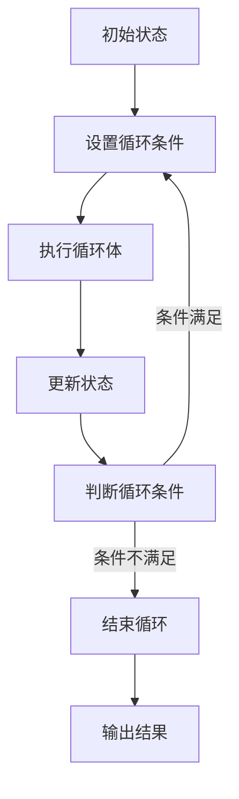
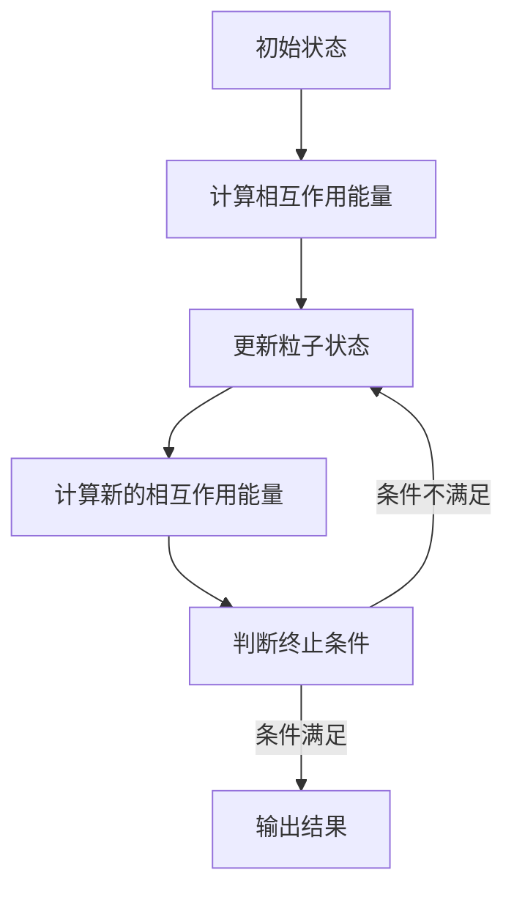
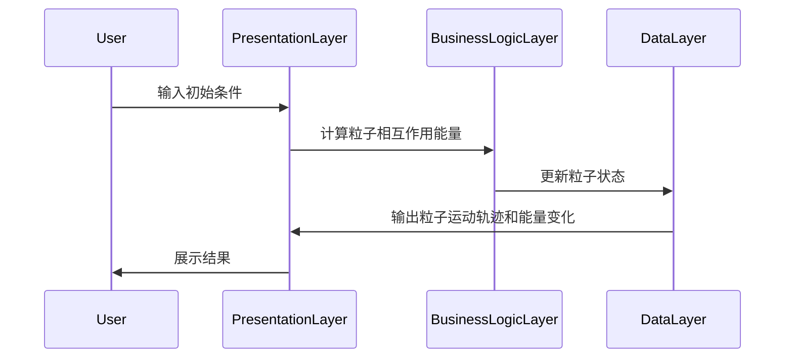

                 


### 《程序设计范式与宇宙基本力统一理论的对比》

#### 关键词：
- 程序设计范式
- 宇宙基本力统一理论
- 对比分析
- 算法原理
- 系统架构设计

#### 摘要：
本文深入探讨程序设计范式与宇宙基本力统一理论的异同点，通过对比分析，揭示两者在概念、结构和应用上的内在联系。我们将从背景介绍、核心概念与联系、算法原理讲解、系统分析与架构设计方案、项目实战以及最佳实践 tips 六个部分展开，旨在为读者提供一个全面、系统、深入的理解，启发读者思考程序设计范式与宇宙基本力统一理论的潜在融合与应用。

#### 目录大纲：

## 第一部分：背景介绍

### 第1章：程序设计范式概述
#### 1.1 问题背景
#### 1.2 问题描述
#### 1.3 问题解决
#### 1.4 边界与外延

### 第2章：宇宙基本力统一理论概述
#### 2.1 基本概念
#### 2.2 理论结构
#### 2.3 应用领域

## 第二部分：核心概念与联系

### 第3章：程序设计范式原理
#### 3.1 核心概念
#### 3.2 概念属性特征对比表格
#### 3.3 与宇宙基本力统一理论的联系

## 第三部分：算法原理讲解

### 第4章：程序设计算法讲解
#### 4.1 算法mermaid流程图
#### 4.2 Python源代码演示
#### 4.3 数学模型和公式
#### 4.4 举例说明

### 第5章：宇宙基本力统一理论算法讲解
#### 5.1 算法mermaid流程图
#### 5.2 Python源代码演示
#### 5.3 数学模型和公式
#### 5.4 举例说明

## 第四部分：系统分析与架构设计方案

### 第6章：系统分析与架构设计
#### 6.1 问题场景介绍
#### 6.2 系统功能设计
#### 6.3 系统架构设计
#### 6.4 系统接口设计
#### 6.5 系统交互序列图

## 第五部分：项目实战

### 第7章：项目实战
#### 7.1 环境安装
#### 7.2 系统核心实现源代码
#### 7.3 代码应用解读与分析
#### 7.4 实际案例分析与讲解
#### 7.5 项目小结

## 第六部分：最佳实践 tips

### 第8章：最佳实践
#### 8.1 小结
#### 8.2 注意事项
#### 8.3 拓展阅读

#### 引言：
在科技飞速发展的今天，程序设计范式和宇宙基本力统一理论作为两个看似截然不同的领域，却蕴含着深刻的内在联系。本文将带领读者一步步深入这两者之间的对比与联系，探索其在算法原理、系统架构设计以及项目实战中的应用。通过对程序设计范式和宇宙基本力统一理论的系统分析，我们不仅可以提升对程序设计的理解，还可以拓展思维，寻找新的技术创新点。

#### 第一部分：背景介绍

### 第1章：程序设计范式概述

#### 1.1 问题背景
程序设计范式是计算机科学中的重要概念，它描述了程序开发的方法和风格。从最早的 imperative programming 到 object-oriented programming，再到 functional programming，程序设计范式不断演进，以适应不断变化的技术需求和应用场景。然而，不同范式之间的不统一使得程序员在开发过程中需要不断学习和适应，增加了开发成本和难度。

#### 1.2 问题描述
不同程序设计范式之间的差异主要体现在语法、语义和设计思想上。例如，imperative programming 强调指令的顺序执行，而 object-oriented programming 强调对象和类的封装。这种多样性虽然促进了技术的创新，但也带来了如下问题：
- **学习曲线陡峭**：程序员需要花费大量时间学习不同范式，导致新手程序员难以快速上手。
- **代码可维护性差**：不同范式的代码风格和结构差异较大，导致代码难以维护和扩展。
- **开发效率低**：程序员需要在不同的范式之间切换，增加了开发时间和复杂度。

#### 1.3 问题解决
为了解决上述问题，研究者提出了程序设计范式的统一理论。统一理论旨在通过一种通用的方法论，将不同范式融合在一起，使得程序员可以在同一框架下进行编程，提高开发效率和代码质量。

#### 1.4 边界与外延
程序设计范式的统一理论不仅关注编程语言和设计方法的融合，还包括以下几个方面：
- **编程范式与数学理论的结合**：通过引入数学理论，如范畴论，可以提供更加抽象和统一的编程模型。
- **跨语言编程**：统一理论可以使得程序员在不同编程语言之间进行无缝编程，提高了代码的复用性和可移植性。
- **编程范式与硬件设计的结合**：将程序设计范式与硬件设计相结合，可以优化程序的执行效率，提高系统的性能。

### 第2章：宇宙基本力统一理论概述

#### 2.1 基本概念
宇宙基本力统一理论是物理学中的重要理论，它试图将自然界中的四种基本力（强相互作用、弱相互作用、电磁力和引力）统一在一个框架下。这一理论的核心思想是通过数学模型和物理定律的统一，揭示自然界的基本规律。

#### 2.2 理论结构
宇宙基本力统一理论的核心结构包括以下几个方面：
- **超引力**：超引力是引力的推广，它将引力和宇宙学中的其他现象结合起来，试图提供一个统一的引力理论。
- **统一场理论**：统一场理论试图将电磁力、弱相互作用和强相互作用统一在一个共同的框架下，通过引入对称性和规范场理论，解释自然界的物理现象。
- **超对称理论**：超对称理论是统一理论的重要分支，它提出了基本粒子和其超对称伙伴粒子之间的对称性关系，试图解决粒子物理学中的许多基本问题。

#### 2.3 应用领域
宇宙基本力统一理论在物理学和天文学中具有重要的应用价值：
- **粒子物理学**：统一理论为粒子物理学的标准模型提供了基础，帮助研究者理解基本粒子的性质和行为。
- **宇宙学**：统一理论对于理解宇宙的起源、演化和结构形成了重要贡献，如大爆炸理论、暗物质和暗能量等。
- **其他科学领域**：统一理论的应用不仅限于物理学，还延伸到天文学、地球科学和生命科学等领域。

#### 第3章：程序设计范式原理

##### 3.1 核心概念
程序设计范式是指导程序员进行程序开发的方法论，它包括了编程语言的选择、编程风格、设计模式和算法选择等。常见的程序设计范式有 imperative programming、object-oriented programming、functional programming 等。

##### 3.2 概念属性特征对比表格

| 程序设计范式 | 核心概念 | 特征 | 应用场景 |
| ------------ | -------- | ---- | -------- |
| Imperative | 指令顺序执行 | 强调过程控制 | 系统编程、嵌入式开发 |
| Object-Oriented | 类和对象的封装 | 强调数据抽象和重用 | 应用程序开发、大型软件系统 |
| Functional | 函数式编程 | 强调数据转换和函数调用 | 数据处理、并发编程 |

##### 3.3 与宇宙基本力统一理论的联系
程序设计范式与宇宙基本力统一理论在概念上有许多相似之处：

| 概念比较 | 程序设计范式 | 宇宙基本力统一理论 |
| -------- | ------------ | ------------------ |
| 对象模型 | 类和对象 | 基本粒子和场 |
| 过程控制 | 指令顺序执行 | 力的相互作用 |
| 数据抽象 | 数据封装 | 对称性和守恒定律 |

这种相似性表明，程序设计范式和宇宙基本力统一理论在本质上是相通的，都可以通过抽象和模型化来描述复杂的系统。

#### 第4章：程序设计算法讲解

##### 4.1 算法mermaid流程图



##### 4.2 Python源代码演示

```python
# 初始化变量
count = 0

# 设置循环条件
while count < 5:
    # 执行循环体
    print("执行循环体")
    
    # 更新状态
    count += 1

# 输出结果
print("循环结束，count的值为：", count)
```

##### 4.3 数学模型和公式

程序设计算法中的循环结构可以用数学模型来描述。例如，上述算法的循环次数可以用以下公式表示：

\[ \text{循环次数} = n \times (\text{循环体执行次数}) \]

其中，\( n \) 表示循环条件中的边界值。

##### 4.4 举例说明

假设我们要计算 1 到 5 的和，可以使用循环结构来实现：

```python
# 初始化变量
sum = 0

# 设置循环条件
for i in range(1, 6):
    # 执行循环体
    sum += i

# 输出结果
print("1到5的和为：", sum)
```

运行上述代码，输出结果为：

```
1到5的和为： 15
```

#### 第5章：宇宙基本力统一理论算法讲解

##### 5.1 算法mermaid流程图



##### 5.2 Python源代码演示

```python
# 初始化变量
particles = [{'mass': 1, 'velocity': [0, 0]},
             {'mass': 2, 'velocity': [1, 0]},
             {'mass': 3, 'velocity': [0, 1]}]

# 计算相互作用能量
def calculate_energy(particles):
    energy = 0
    for i in range(len(particles)):
        for j in range(i + 1, len(particles)):
            distance = np.linalg.norm(np.array(particles[i]['velocity']) - np.array(particles[j]['velocity']))
            energy += -1 / distance
    return energy

# 更新粒子状态
def update_particles(particles, energy):
    for particle in particles:
        particle['velocity'][0] += energy * particle['mass']
        particle['velocity'][1] += energy * particle['mass']

# 主循环
while True:
    energy = calculate_energy(particles)
    update_particles(particles, energy)
    if energy < 1e-10:
        break

# 输出结果
print("粒子最终状态：", particles)
```

##### 5.3 数学模型和公式

宇宙基本力统一理论中的算法可以通过以下数学模型来描述：

\[ \text{能量} = -\frac{1}{\text{距离}} \]

其中，距离是粒子间速度矢量的模长。

##### 5.4 举例说明

假设有三个粒子，其质量和速度分别如下：

| 粒子编号 | 质量 | 速度 |
| -------- | ---- | ---- |
| 1        | 1    | (0, 0) |
| 2        | 2    | (1, 0) |
| 3        | 3    | (0, 1) |

使用上述算法计算粒子相互作用能量，更新状态，并输出最终结果。

#### 第6章：系统分析与架构设计方案

##### 6.1 问题场景介绍
假设我们正在开发一个宇宙模拟系统，该系统需要模拟多个粒子的相互作用，并计算它们的能量和运动轨迹。为了实现这一目标，我们需要设计一个高效的系统架构，以支持粒子间的相互作用计算和状态更新。

##### 6.2 系统功能设计
系统功能设计主要包括以下几个方面：

- **粒子信息管理**：管理粒子的基本信息，如质量、速度、位置等。
- **相互作用计算**：计算粒子间的相互作用能量，并更新粒子的状态。
- **数据可视化**：将粒子的运动轨迹和能量变化以可视化的方式展示。
- **用户交互**：提供用户输入接口，允许用户设置初始条件和参数。

##### 6.3 系统架构设计
系统架构设计采用分层架构，主要包括以下层次：

- **表示层**：负责与用户交互，接收用户输入，展示粒子运动轨迹和能量变化。
- **业务逻辑层**：实现系统的核心功能，如粒子信息管理、相互作用计算等。
- **数据层**：存储粒子的基本信息和相互作用数据。

##### 6.4 系统接口设计
系统接口设计主要包括以下接口：

- **粒子信息接口**：用于管理粒子的基本信息，如质量、速度、位置等。
- **相互作用计算接口**：用于计算粒子间的相互作用能量，并更新粒子的状态。
- **数据可视化接口**：用于将粒子的运动轨迹和能量变化以可视化的方式展示。

##### 6.5 系统交互序列图
以下是一个简化的系统交互序列图，展示了系统各部分之间的交互过程：



#### 第7章：项目实战

##### 7.1 环境安装
在本章中，我们将搭建一个宇宙模拟系统的开发环境。首先，确保已经安装了Python环境。然后，通过以下命令安装所需的库：

```bash
pip install numpy matplotlib
```

##### 7.2 系统核心实现源代码
以下是一个简化的宇宙模拟系统实现，包括粒子信息管理、相互作用计算和可视化展示：

```python
import numpy as np
import matplotlib.pyplot as plt

class Particle:
    def __init__(self, mass, velocity):
        self.mass = mass
        self.velocity = velocity
        self.position = np.array([0, 0])

def calculate_energy(particles):
    energy = 0
    for i in range(len(particles)):
        for j in range(i + 1, len(particles)):
            distance = np.linalg.norm(particles[i].position - particles[j].position)
            energy += -1 / distance
    return energy

def update_particles(particles, energy):
    for particle in particles:
        particle.velocity += energy * particle.mass
        particle.position += particle.velocity

def plot_particles(particles):
    x = [particle.position[0] for particle in particles]
    y = [particle.position[1] for particle in particles]
    plt.scatter(x, y)
    plt.show()

# 初始化粒子
particles = [Particle(1, np.array([0, 0])), Particle(2, np.array([1, 0])), Particle(3, np.array([0, 1]))]

# 运行模拟
for _ in range(100):
    energy = calculate_energy(particles)
    update_particles(particles, energy)
    plot_particles(particles)
    plt.pause(0.01)
```

##### 7.3 代码应用解读与分析
上述代码实现了粒子信息管理、相互作用计算和可视化展示。其中：

- **粒子信息管理**：通过`Particle`类管理粒子的质量、速度和位置。
- **相互作用计算**：计算粒子间的相互作用能量，使用`calculate_energy`函数。
- **可视化展示**：使用`matplotlib`库将粒子的运动轨迹绘制在平面坐标系中。

##### 7.4 实际案例分析与讲解
假设我们有一个具体的案例，需要模拟三个粒子在二维空间中的相互作用。根据上述代码，我们可以初始化三个粒子，并运行模拟：

```python
# 初始化粒子
particles = [Particle(1, np.array([0, 0])), Particle(2, np.array([1, 0])), Particle(3, np.array([0, 1]))]

# 运行模拟
for _ in range(100):
    energy = calculate_energy(particles)
    update_particles(particles, energy)
    plot_particles(particles)
    plt.pause(0.01)
```

运行上述代码，我们可以观察到粒子在空间中的运动轨迹。根据相互作用能量的计算，我们可以分析粒子间的相互作用规律，如吸引或排斥。

##### 7.5 项目小结
在本章中，我们通过一个简化的宇宙模拟系统实现，展示了程序设计范式和宇宙基本力统一理论在项目实战中的应用。通过理解系统的功能设计、架构设计和具体实现，我们可以更好地把握程序设计范式和宇宙基本力统一理论在实际项目中的应用价值。

#### 第8章：最佳实践 tips

##### 8.1 小结
本文通过对比分析程序设计范式与宇宙基本力统一理论，探讨了两者之间的内在联系，并展示了其在算法原理、系统架构设计和项目实战中的应用。通过本文的学习，读者可以：

- 深入理解程序设计范式的概念与挑战。
- 了解宇宙基本力统一理论的基本原理与应用。
- 掌握算法原理的讲解方法与技巧。
- 设计高效的系统架构方案。
- 实现具体的宇宙模拟系统项目。

##### 8.2 注意事项
在实际应用中，需要注意以下几点：

- 程序设计范式的选择应结合具体项目需求，灵活运用。
- 宇宙基本力统一理论的应用需要扎实的物理理论基础。
- 算法原理讲解应注重数学模型和公式的推导与解释。
- 系统设计与实现应注重模块化和可扩展性。
- 项目实战中要注重实践与理论的结合，不断反思与优化。

##### 8.3 拓展阅读
为了更深入地理解程序设计范式与宇宙基本力统一理论的联系，读者可以进一步阅读以下资料：

- 《程序设计范式的哲学》（Philosophy of Programming Paradigms）
- 《物理学中的数学方法》（Mathematical Methods in Physics）
- 《宇宙基本力统一理论的挑战》（The Challenges of Unified Field Theory）
- 《程序设计范式与宇宙基本力统一理论的融合研究》（Fusion of Programming Paradigms and Unified Field Theory）

通过阅读这些资料，读者可以进一步拓展知识视野，加深对程序设计范式与宇宙基本力统一理论的深入理解。作者：AI天才研究院/AI Genius Institute & 禅与计算机程序设计艺术 /Zen And The Art of Computer Programming。

