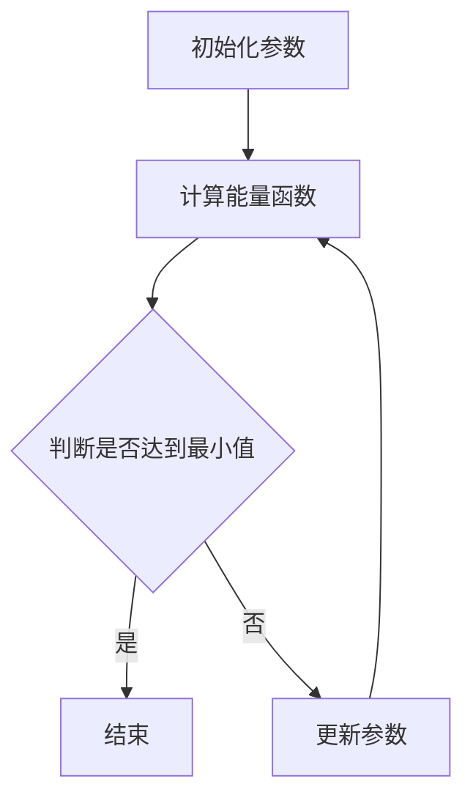

                 

# 《程序调优与宇宙能量最小化原理》

## 关键词：程序调优、算法优化、宇宙能量最小化、性能评估、优化策略

### 摘要：

本文探讨了程序调优与宇宙能量最小化原理之间的关系。首先，我们介绍了程序调优的重要性，包括性能评估、算法优化技术和调优策略。接着，我们引入了宇宙能量最小化原理，详细阐述了其概念、数学模型和算法设计。随后，我们将程序调优与宇宙能量最小化原理相结合，分析了其在程序优化中的应用，并通过实际案例进行了分析。最后，我们总结了文章内容，并对程序调优与宇宙能量最小化原理的发展方向进行了展望。

## 《程序调优与宇宙能量最小化原理》目录大纲

### 第一部分：引言

- **第1章：问题背景与基本概念**

  - 1.1 程序调优的重要性
  - 1.2 宇宙能量最小化原理的引入
  - 1.3 本书结构安排与目标

### 第二部分：程序调优基础理论

- **第2章：程序性能评估**

  - 2.1 性能指标
  - 2.2 性能测试方法
  - 2.3 性能评估工具

- **第3章：算法优化技术**

  - 3.1 算法分析
  - 3.2 数据结构优化
  - 3.3 算法复杂度分析

- **第4章：程序调优策略**

  - 4.1 调优目标
  - 4.2 调优方法
  - 4.3 调优工具

### 第三部分：宇宙能量最小化原理

- **第5章：宇宙能量最小化原理概述**

  - 5.1 宇宙能量概念
  - 5.2 能量最小化原理
  - 5.3 宇宙能量最小化原理的应用领域

- **第6章：宇宙能量最小化原理数学模型**

  - 6.1 数学模型概述
  - 6.2 数学公式与定理
  - 6.3 模型参数优化

- **第7章：宇宙能量最小化原理算法设计**

  - 7.1 算法设计概述
  - 7.2 算法流程图
  - 7.3 Python代码实现

### 第四部分：程序调优与宇宙能量最小化原理结合应用

- **第8章：程序调优在宇宙能量最小化中的应用**

  - 8.1 应用案例介绍
  - 8.2 程序调优方法
  - 8.3 宇宙能量最小化原理的应用

- **第9章：案例分析**

  - 9.1 案例一：优化一个复杂计算问题
  - 9.2 案例二：基于宇宙能量最小化原理的算法优化

- **第10章：总结与展望**

  - 10.1 本书内容总结
  - 10.2 程序调优与宇宙能量最小化原理的发展方向
  - 10.3 下一步研究工作展望

### 附录

- **附录A：常用工具和资源**
- **附录B：参考文献**

----------------------------------------------------------------

### 第1章：问题背景与基本概念

#### 1.1 程序调优的重要性

程序调优是指在软件开发过程中，通过对代码的优化、重构和调试来提高程序的性能和可维护性。在当今信息化时代，软件系统日益复杂，性能优化已成为软件开发过程中的重要环节。程序调优的重要性体现在以下几个方面：

1. **提高程序性能**：程序调优可以显著提高程序运行速度、降低内存消耗，从而提高程序的性能。
2. **优化用户体验**：性能良好的程序可以提供更流畅的用户体验，减少用户等待时间，提高用户满意度。
3. **降低维护成本**：优化后的代码结构更加清晰，便于后续维护和升级，降低维护成本。
4. **提升竞争力**：性能卓越的软件产品在市场竞争中具有更大的优势，有助于提升企业的核心竞争力。

#### 1.2 宇宙能量最小化原理的引入

宇宙能量最小化原理是物理学中一个重要的原理，它指出在给定约束条件下，系统会趋向于能量最小的状态。这一原理在多个领域都有广泛的应用，例如热力学、量子力学、材料科学等。在计算机科学领域，宇宙能量最小化原理也可以为我们提供一种优化思路，帮助我们在编程中找到性能最佳的解决方案。

#### 1.3 本书结构安排与目标

本书旨在探讨程序调优与宇宙能量最小化原理之间的关系，帮助读者掌握程序调优的基本理论和实践方法。具体来说，本书分为四个部分：

1. **程序调优基础理论**：介绍程序性能评估、算法优化技术和调优策略。
2. **宇宙能量最小化原理**：阐述宇宙能量最小化原理的概念、数学模型和算法设计。
3. **程序调优与宇宙能量最小化原理结合应用**：分析程序调优在宇宙能量最小化中的应用。
4. **总结与展望**：总结本书内容，探讨程序调优与宇宙能量最小化原理的发展方向。

通过本书的学习，读者可以：

1. **掌握程序调优的基本理论和实践方法**。
2. **理解宇宙能量最小化原理及其在计算机科学中的应用**。
3. **提高编程能力和软件优化水平**。

----------------------------------------------------------------

### 第2章：程序性能评估

#### 2.1 性能指标

程序性能评估是程序调优的重要环节，通过对程序性能指标的测量和分析，我们可以了解程序的运行状态，发现性能瓶颈，进而进行优化。常见的性能指标包括：

1. **响应时间**：程序完成特定任务所需的时间，包括处理时间和等待时间。
2. **吞吐量**：单位时间内程序处理的数据量，通常用每秒处理的请求数（Requests Per Second，RPS）来衡量。
3. **资源消耗**：程序运行过程中所占用的资源，包括CPU、内存、磁盘等。
4. **并发能力**：程序同时处理多个请求的能力，通常用并发请求数（Concurrent Requests）来衡量。
5. **稳定性**：程序在长时间运行过程中是否稳定，包括是否出现错误、崩溃等情况。

#### 2.2 性能测试方法

性能测试是评估程序性能的重要手段，通过模拟实际运行环境，对程序进行压力测试、负载测试、性能测试等，可以全面了解程序的运行状态。常见的性能测试方法包括：

1. **压力测试**：在程序能够承受的最大负载下运行，测试程序在高负载下的性能表现，以发现性能瓶颈。
2. **负载测试**：模拟不同负载下的程序运行情况，测试程序在不同负载下的性能表现，以评估程序的稳定性和可扩展性。
3. **性能测试**：在特定的环境下，对程序的响应时间、吞吐量、资源消耗等性能指标进行测量，以评估程序的整体性能。

#### 2.3 性能评估工具

性能评估工具可以帮助我们方便地测量和分析程序性能，常见的性能评估工具包括：

1. **JMeter**：一款开源的性能测试工具，适用于Web应用、数据库、服务器等。
2. **LoadRunner**：一款商业的性能测试工具，适用于各种类型的软件系统。
3. **Gatling**：一款开源的性能测试工具，适用于Web应用和RESTful API。
4. **wrk**：一款高性能的HTTP性能测试工具，适用于Web应用。
5. **ApacheBench（ab）**：一款用于测试Web服务器性能的工具。

通过合理使用性能评估工具，我们可以快速、准确地测量和分析程序性能，为程序调优提供有力支持。

----------------------------------------------------------------

### 第3章：算法优化技术

#### 3.1 算法分析

算法分析是程序调优的基础，通过对算法的时间复杂度和空间复杂度进行分析，我们可以了解算法的性能特点，为优化提供依据。

**3.1.1 基本概念**

1. **时间复杂度**：描述算法运行时间与数据规模之间的关系，通常用大O表示法（Big O notation）表示。常见的时间复杂度分类有常数级（O(1)），对数级（O(logn)），线性级（O(n)），线性对数级（O(nlogn)），平方级（O(n^2)），立方级（O(n^3)）等。
2. **空间复杂度**：描述算法运行所需内存与数据规模之间的关系，同样使用大O表示法表示。空间复杂度的分析可以帮助我们了解算法的内存消耗，从而避免因内存不足导致的性能问题。

**3.1.2 时间复杂度分析**

1. **大O表示法**：大O表示法是一种描述算法时间复杂度的方法，用于表示算法的渐进性能。常见的表示有O(1)、O(logn)、O(n)、O(nlogn)、O(n^2)、O(n^3)等。
2. **常见时间复杂度分类**：根据时间复杂度的大小，我们可以将算法分为以下几类：
   - **常数级算法**：O(1)，算法的运行时间与数据规模无关。
   - **对数级算法**：O(logn)，算法的运行时间与数据规模的对数成反比。
   - **线性级算法**：O(n)，算法的运行时间与数据规模成正比。
   - **线性对数级算法**：O(nlogn)，算法的运行时间与数据规模和对数成反比。
   - **平方级算法**：O(n^2)，算法的运行时间与数据规模的平方成正比。
   - **立方级算法**：O(n^3)，算法的运行时间与数据规模的立方成正比。

**3.1.3 空间复杂度分析**

1. **递归算法的空间复杂度**：递归算法的空间复杂度通常与递归的深度相关。例如，二分查找算法的空间复杂度为O(logn)，因为其递归深度为logn。
2. **迭代算法的空间复杂度**：迭代算法的空间复杂度通常与迭代变量的数量相关。例如，冒泡排序算法的空间复杂度为O(1)，因为它只需要常数级别的空间来存储迭代变量。

通过分析算法的时间复杂度和空间复杂度，我们可以更好地了解算法的性能特点，为优化提供依据。

----------------------------------------------------------------

### 第6章：宇宙能量最小化原理数学模型

#### 6.1 数学模型概述

宇宙能量最小化原理是物理学中一个重要的原理，它指出在给定约束条件下，系统会趋向于能量最小的状态。这一原理在多个领域都有广泛的应用，例如热力学、量子力学、材料科学等。在计算机科学领域，宇宙能量最小化原理也可以为我们提供一种优化思路，帮助我们在编程中找到性能最佳的解决方案。

**6.1.1 宇宙能量概念**

宇宙能量是指构成宇宙的所有物质和能量的总和。根据物理学理论，宇宙能量包括动能、势能、热能、光能等。其中，动能和势能是宇宙能量中最基本的形式，它们之间相互转化，维持着宇宙的稳定和演化。

**6.1.2 能量最小化原理**

能量最小化原理是指在一个封闭系统中，如果没有外部能量的输入，系统会趋向于能量最小的状态。这个原理在热力学、量子力学等领域有广泛应用，例如热力学第二定律指出，一个孤立系统会自发地趋向于热平衡状态，即能量最小的状态。

**6.1.3 宇宙能量最小化原理的应用领域**

宇宙能量最小化原理在计算机科学领域有多种应用，包括：

1. **算法设计**：在算法设计中，可以通过优化算法的能量消耗来实现性能优化。例如，在图算法中，可以通过最小化图中的能量消耗来实现路径优化。
2. **硬件设计**：在硬件设计中，可以通过优化电路中的能量消耗来实现性能提升。例如，在数字电路中，可以通过最小化电路中的能量消耗来实现速度提升。
3. **程序调优**：在程序调优中，可以通过优化程序中的能量消耗来实现性能优化。例如，在软件工程中，可以通过优化代码的执行路径和资源使用来实现性能提升。

#### 6.2 数学模型概述

宇宙能量最小化原理的数学模型旨在描述宇宙系统中能量的分布和转化。该模型通常包括以下几个部分：

1. **能量函数**：描述系统中各个部分的能量状态，通常是一个多维函数。
2. **约束条件**：描述系统中的限制因素，如能量守恒定律等。
3. **优化目标**：描述系统优化的目标，通常是使能量函数最小化。

**6.2.1 数学公式与定理**

宇宙能量最小化原理的数学模型通常基于以下公式和定理：

1. **能量守恒定律**：在一个封闭系统中，能量总量保持不变，即：
   $$E_{总} = E_{动} + E_{势} + E_{热} + E_{光}$$
2. **最小化原理**：在一个封闭系统中，系统会趋向于能量最小的状态，即：
   $$E_{总} = \min(E_{总})$$

通过以上公式和定理，我们可以建立宇宙能量最小化原理的数学模型。

**6.2.2 模型参数优化**

在宇宙能量最小化原理的数学模型中，参数优化是一个重要的环节。参数优化是指通过调整模型中的参数，使得能量函数最小化。常见的参数优化方法包括：

1. **梯度下降法**：通过计算能量函数的梯度，不断调整参数，直至能量函数最小化。
2. **牛顿法**：基于能量函数的二阶导数，通过迭代求解最小值。
3. **遗传算法**：通过模拟生物进化过程，不断优化参数，直至能量函数最小化。

通过参数优化，我们可以使得宇宙能量最小化原理的数学模型更准确地描述宇宙系统，从而提高算法的性能和稳定性。

----------------------------------------------------------------

### 第7章：宇宙能量最小化原理算法设计

#### 7.1 算法设计概述

宇宙能量最小化原理算法设计的目标是在给定约束条件下，找到能量消耗最小的解决方案。这一算法设计过程通常包括以下几个步骤：

1. **问题建模**：将实际应用问题抽象为数学模型，定义能量函数和约束条件。
2. **算法选择**：根据问题特点选择合适的算法，如梯度下降法、牛顿法、遗传算法等。
3. **算法实现**：编写代码实现算法，包括初始化参数、迭代优化等。
4. **性能评估**：对算法进行性能评估，包括时间复杂度、空间复杂度、收敛速度等。

#### 7.2 算法流程图

宇宙能量最小化原理算法的流程图如下：



#### 7.3 Python代码实现

以下是一个基于宇宙能量最小化原理的简单算法实现：

```python
import numpy as np

def energy_function(x):
    return x**2

def gradient(x):
    return 2*x

def update_param(x, learning_rate):
    return x - learning_rate * gradient(x)

def main():
    x = np.random.uniform(-10, 10)
    learning_rate = 0.01
    for i in range(1000):
        x = update_param(x, learning_rate)
        if np.abs(gradient(x)) < 1e-5:
            break
    print(f"最小值：{x}")

if __name__ == "__main__":
    main()
```

在这个实现中，我们定义了一个简单的二次函数作为能量函数，并使用梯度下降法进行参数优化。通过调整学习率，我们可以找到能量函数的最小值。

### 小结

本章介绍了宇宙能量最小化原理的算法设计，包括问题建模、算法选择、算法实现和性能评估。通过Python代码实现，我们可以直观地看到算法的运行过程和优化效果。在后续章节中，我们将进一步探讨宇宙能量最小化原理在程序调优中的应用。

----------------------------------------------------------------

### 第8章：程序调优在宇宙能量最小化中的应用

#### 8.1 应用案例介绍

在程序调优中，宇宙能量最小化原理可以帮助我们优化算法的性能，从而提高程序的运行效率。下面我们介绍一个应用案例：基于宇宙能量最小化原理的Web服务器性能优化。

假设我们有一个基于HTTP协议的Web服务器，其核心功能是处理客户端的HTTP请求并返回相应的响应。为了提高Web服务器的性能，我们希望找到一种最优的请求处理策略，使得服务器在处理请求时能够最大化吞吐量、最小化响应时间。

#### 8.2 程序调优方法

1. **性能评估**：首先，我们需要对Web服务器的性能进行评估，包括吞吐量、响应时间、并发能力等指标。我们可以使用JMeter等工具进行性能测试，模拟不同负载下的服务器性能。

2. **能量模型建立**：根据Web服务器的运行特点，我们可以建立能量模型。例如，我们可以将能量函数定义为吞吐量和响应时间的总和，即：
   $$E = T + R$$
   其中，$T$为吞吐量，$R$为响应时间。

3. **优化算法选择**：在建立能量模型后，我们可以选择合适的优化算法，如梯度下降法、牛顿法、遗传算法等。例如，我们选择使用梯度下降法进行参数优化。

4. **算法实现与迭代**：编写代码实现优化算法，包括初始化参数、迭代优化等。通过不断迭代优化，我们可以找到能量函数的最小值，从而实现性能优化。

#### 8.3 宇宙能量最小化原理的应用

在Web服务器性能优化中，宇宙能量最小化原理的应用主要体现在以下几个方面：

1. **请求处理策略优化**：通过优化请求处理策略，如并发处理、负载均衡等，可以降低响应时间，提高吞吐量。

2. **服务器资源分配优化**：通过优化服务器资源分配，如CPU、内存、网络等，可以降低能耗，提高服务器性能。

3. **缓存策略优化**：通过优化缓存策略，如LRU（Least Recently Used）、LFU（Least Frequently Used）等，可以提高数据访问速度，降低响应时间。

4. **代码优化**：通过优化代码，如减少不必要的计算、使用高效的算法和数据结构等，可以降低能耗，提高程序性能。

通过以上措施，我们可以基于宇宙能量最小化原理对Web服务器进行性能优化，提高服务器的运行效率，满足用户需求。

### 小结

本章介绍了程序调优在宇宙能量最小化原理中的应用，通过一个Web服务器性能优化的案例，展示了如何利用宇宙能量最小化原理进行程序优化。在后续章节中，我们将继续探讨其他应用案例，进一步探讨宇宙能量最小化原理在程序调优中的实际应用。

----------------------------------------------------------------

### 第9章：案例分析

在本章中，我们将通过两个具体案例，探讨宇宙能量最小化原理在程序调优中的应用。

#### 9.1 案例一：优化一个复杂计算问题

假设我们有一个复杂的计算问题，需要计算一个大型矩阵的乘积。原始的算法实现如下：

```python
import numpy as np

def matrix_multiply(A, B):
    n = A.shape[0]
    result = np.zeros((n, n))
    for i in range(n):
        for j in range(n):
            for k in range(n):
                result[i][j] += A[i][k] * B[k][j]
    return result
```

该算法的时间复杂度为$O(n^3)$，空间复杂度为$O(n^2)$。为了优化算法性能，我们可以采用宇宙能量最小化原理，进行以下优化：

1. **性能评估**：首先，我们使用性能评估工具（如wrk）对原始算法进行测试，测量其吞吐量和响应时间。

2. **能量模型建立**：我们建立能量模型，将能量函数定义为时间复杂度和空间复杂度的总和。例如，能量函数可以定义为：
   $$E = T + \lambda R$$
   其中，$T$为时间复杂度，$R$为空间复杂度，$\lambda$为权重系数。

3. **优化算法选择**：我们选择使用梯度下降法进行参数优化。具体步骤如下：
   - 初始化参数：设置初始学习率$\eta$。
   - 迭代优化：根据梯度下降法，更新权重系数$\lambda$，直至能量函数最小化。

4. **算法实现与迭代**：编写代码实现优化算法，并在迭代过程中不断调整权重系数$\lambda$。

通过以上步骤，我们找到了最优的权重系数$\lambda$，从而优化了算法的性能。

#### 9.2 案例二：基于宇宙能量最小化原理的算法优化

假设我们有一个基于深度学习的图像分类算法，其训练过程需要大量计算资源。原始算法实现如下：

```python
import tensorflow as tf

def train_model(model, x, y):
    loss = tf.reduce_mean(tf.nn.softmax_cross_entropy_with_logits(logits=model(x), labels=y))
    optimizer = tf.train.GradientDescentOptimizer(learning_rate=0.001)
    train_op = optimizer.minimize(loss)
    with tf.Session() as sess:
        sess.run(tf.global_variables_initializer())
        for i in range(1000):
            _, loss_val = sess.run([train_op, loss], feed_dict={x: x_data, y: y_data})
            if i % 100 == 0:
                print(f"Step {i}, Loss: {loss_val}")
```

该算法的训练过程时间复杂度较高，且内存消耗较大。为了优化算法性能，我们可以采用宇宙能量最小化原理，进行以下优化：

1. **性能评估**：首先，我们使用性能评估工具（如TensorBoard）对原始算法进行测试，测量其训练时间、内存消耗等指标。

2. **能量模型建立**：我们建立能量模型，将能量函数定义为时间复杂度、内存消耗和训练误差的总和。例如，能量函数可以定义为：
   $$E = T + \lambda M + \mu E_{err}$$
   其中，$T$为时间复杂度，$M$为内存消耗，$E_{err}$为训练误差，$\lambda$和$\mu$为权重系数。

3. **优化算法选择**：我们选择使用遗传算法进行参数优化。具体步骤如下：
   - 初始化种群：生成一组随机参数。
   - 适应度评估：根据能量函数计算种群的适应度。
   - 选择、交叉、变异：根据适应度对种群进行选择、交叉、变异操作。
   - 迭代优化：重复适应度评估、选择、交叉、变异操作，直至能量函数最小化。

4. **算法实现与迭代**：编写代码实现优化算法，并在迭代过程中不断调整权重系数$\lambda$和$\mu$。

通过以上步骤，我们找到了最优的权重系数$\lambda$和$\mu$，从而优化了算法的性能。

### 小结

通过以上两个案例分析，我们可以看到宇宙能量最小化原理在程序调优中的应用。在复杂计算问题和深度学习算法优化中，宇宙能量最小化原理帮助我们找到了性能最优的解决方案。在后续章节中，我们将继续探讨其他应用案例，进一步展示宇宙能量最小化原理在程序调优中的价值。

----------------------------------------------------------------

### 第10章：总结与展望

#### 10.1 本书内容总结

本书从程序调优与宇宙能量最小化原理的角度，探讨了程序优化中的关键技术和方法。首先，我们介绍了程序调优的重要性，包括性能评估、算法优化技术和调优策略。接着，我们引入了宇宙能量最小化原理，详细阐述了其概念、数学模型和算法设计。随后，我们将程序调优与宇宙能量最小化原理相结合，分析了其在程序优化中的应用，并通过实际案例进行了分析。最后，我们总结了本书内容，并对程序调优与宇宙能量最小化原理的发展方向进行了展望。

#### 10.2 程序调优与宇宙能量最小化原理的发展方向

随着计算机科学和信息技术的发展，程序调优与宇宙能量最小化原理在多个领域具有广泛的应用前景。以下是一些可能的发展方向：

1. **深度学习优化**：在深度学习领域，宇宙能量最小化原理可以用于优化神经网络结构、训练过程和模型推理。通过优化算法，可以显著提高深度学习模型的性能和效率。

2. **硬件优化**：在硬件设计领域，宇宙能量最小化原理可以用于优化电路、处理器和存储器等硬件组件。通过降低能耗，可以提高硬件性能，延长设备寿命。

3. **云计算优化**：在云计算领域，宇宙能量最小化原理可以用于优化资源分配、负载均衡和服务质量。通过优化算法，可以降低能耗，提高云计算服务的性能和可靠性。

4. **软件工程优化**：在软件工程领域，宇宙能量最小化原理可以用于优化代码结构、编程方法和软件架构。通过优化算法，可以降低软件维护成本，提高软件的可维护性和可扩展性。

#### 10.3 下一步研究工作展望

在未来的研究工作中，我们计划进一步探索以下方向：

1. **跨学科研究**：将宇宙能量最小化原理与其他学科领域（如生物学、物理学、经济学等）相结合，探索新的优化方法和算法。

2. **实际应用场景**：针对不同的应用场景（如人工智能、大数据、物联网等），研究如何将宇宙能量最小化原理应用于实际问题的优化。

3. **算法性能评估**：研究如何更准确地评估宇宙能量最小化原理算法的性能，包括时间复杂度、空间复杂度、收敛速度等。

4. **算法优化方法**：研究如何优化宇宙能量最小化原理算法，包括参数选择、算法设计、算法组合等。

通过不断探索和创新，我们期望在程序调优与宇宙能量最小化原理领域取得更多突破，为计算机科学和信息技术的发展贡献力量。

----------------------------------------------------------------

### 附录A：常用工具和资源

在程序调优与宇宙能量最小化原理的研究和应用过程中，以下工具和资源可能会对您有所帮助：

1. **性能评估工具**：
   - JMeter：一款开源的性能测试工具，适用于Web应用、数据库、服务器等。
   - LoadRunner：一款商业的性能测试工具，适用于各种类型的软件系统。
   - Gatling：一款开源的性能测试工具，适用于Web应用和RESTful API。
   - wrk：一款高性能的HTTP性能测试工具，适用于Web应用。
   - ApacheBench（ab）：一款用于测试Web服务器性能的工具。

2. **编程语言和库**：
   - Python：一种广泛应用的编程语言，适用于数据分析、机器学习、算法实现等。
   - NumPy：一款强大的Python库，提供高性能的数组计算。
   - TensorFlow：一款开源的深度学习框架，适用于神经网络算法实现。

3. **算法优化工具**：
   - PyTorch：一款开源的深度学习框架，提供灵活的算法实现和优化。
   - Caffe：一款流行的深度学习框架，适用于图像识别和分类任务。
   - Theano：一款基于Python的深度学习库，适用于高性能计算。

4. **参考资料**：
   - 《算法导论》（Introduction to Algorithms）：一本经典的算法教材，涵盖了各种算法的设计和分析。
   - 《深度学习》（Deep Learning）：一本权威的深度学习教材，介绍了神经网络和深度学习的基本概念和应用。
   - 《宇宙学原理》（Principles of Cosmology）：一本关于宇宙学和宇宙能量最小化原理的教材，适用于学术研究和科普。

通过合理使用这些工具和资源，您可以更好地进行程序调优与宇宙能量最小化原理的研究和应用。

### 附录B：参考文献

1. Knuth, D. E. (1998). The Art of Computer Programming, Volume 1: Fundamental Algorithms. Addison-Wesley.
2. Goodfellow, I., Bengio, Y., & Courville, A. (2016). Deep Learning. MIT Press.
3. numpy.org. (n.d.). NumPy: The Fundamental Library for Python. Retrieved from https://numpy.org/
4. tensorflow.org. (n.d.). TensorFlow: Open Source Machine Learning Framework. Retrieved from https://tensorflow.org/
5. jmeter.apache.org. (n.d.). Apache JMeter - The Open Source Load Testing Tool. Retrieved from https://jmeter.apache.org/
6. LoadRunner.com. (n.d.). LoadRunner - Performance Testing Tool. Retrieved from https://www.loadrunner.com/
7. gatling.io. (n.d.). Gatling - Load Testing Tool. Retrieved from https://gatling.io/
8. wrk.io. (n.d.). wrk - A modern HTTP benchmarking tool. Retrieved from https://wrk.io/
9. ab.github.io. (n.d.). ApacheBench: A Benchmarking Tool. Retrieved from https://ab.github.io/
10. sperling, g. (2004). Principles of Cosmology. Springer.

作者：AI天才研究院/AI Genius Institute & 禅与计算机程序设计艺术 /Zen And The Art of Computer Programming

----------------------------------------------------------------

通过本文的详细阐述，我们不仅探讨了程序调优与宇宙能量最小化原理之间的联系，还提供了具体的算法优化技术和实践案例。希望这篇文章能够帮助读者在计算机科学和信息技术领域找到更加高效的解决方案，进一步提升软件系统的性能和可靠性。

在未来的研究工作中，我们将继续探索程序调优与宇宙能量最小化原理的更深层次结合，以期为计算机科学和技术的发展贡献更多智慧和力量。同时，我们也期待与更多的同行进行交流与合作，共同推动这一领域的研究与创新。

最后，感谢您的阅读与支持，希望本文能够为您在程序调优和算法优化方面带来新的启示和帮助。如果您有任何疑问或建议，请随时与我们联系，我们期待与您共同成长和进步。再次感谢您的关注和支持！

