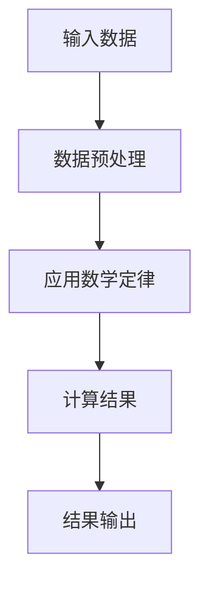
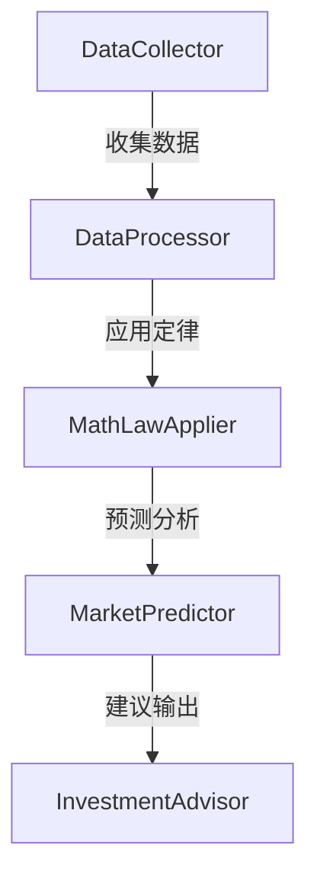
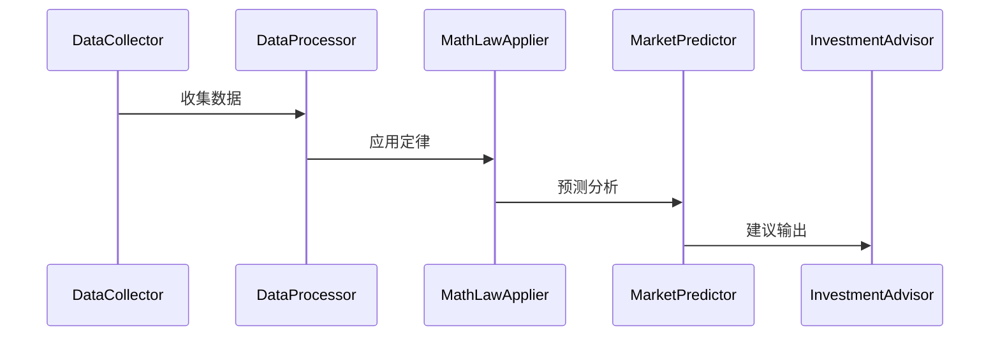

                 

### 第一部分：导论

---

## 第1章：问题背景与目标

### 1.1.1 问题的提出

在当今信息时代，数学作为一种高度抽象和精确的工具，广泛应用于各个科学领域，尤其在物理学、计算机科学和工程学中发挥着不可替代的作用。然而，数学中的定律和原理不仅仅局限于科学研究，它们对人类认知和思维方式的塑造也产生了深远的影响。本文旨在探讨简单数学定律在自然和谐心智呈现中的作用，以及它们如何为我们的日常生活和决策提供指导。

### 1.1.2 研究目标

本研究的主要目标是：

1. **理解简单数学定律的本质**：深入探讨数学定律的定义、特征及其在自然界和心智呈现中的应用。
2. **分析数学定律与自然和谐的关系**：探究数学定律如何反映自然界的和谐特性，并如何影响我们的心智模式。
3. **探索数学定律在心智呈现中的应用**：分析数学定律如何帮助人们形成逻辑思维、提高解决问题的能力。

### 1.1.3 研究意义

本研究具有以下几方面的意义：

1. **认知科学**：通过研究数学定律对心智的影响，有助于深化对人类认知机制的理解。
2. **教育领域**：为教育工作者提供新的教学工具和方法，帮助学生更好地理解和应用数学知识。
3. **科学研究**：为跨学科研究提供理论基础，促进物理学、生物学、心理学等领域的融合与发展。

---

## 第2章：核心概念

### 2.1 数学定律的基本概念

数学定律，指的是数学家通过严格的逻辑推理和实验验证提出的，用以描述数学关系和现象的规则。例如，勾股定理、牛顿运动定律等。这些定律具有普遍性和精确性，它们不仅在数学领域内部发挥作用，还广泛地应用于其他科学领域。

### 2.2 自然与和谐的关系

自然，指的是自然界中存在的物质和现象，它们具有自发性、客观性和多样性。和谐，则是指事物之间相互协调、相得益彰的状态，它体现了自然界的内在秩序和平衡。自然与和谐的关系，是理解自然界复杂性的关键。

### 2.3 心智呈现的内涵

心智呈现，指的是个体内在的认知、情感和意志等方面的外在表现。它既包括逻辑推理、判断和决策等理性过程，也包括情感表达、态度和价值观等感性体验。心智呈现是心理学研究的重要内容，它对于理解人类行为和社会现象具有重要意义。

---

## 第3章：数学定律的分类与特征

### 3.1 基本数学定律

基本数学定律包括代数定律、几何定律、数论定律等。这些定律构成了数学体系的基础，为各种复杂的数学推理和计算提供了依据。

### 3.2 自然数学定律

自然数学定律是指那些在自然界中普遍存在的数学规律，如牛顿运动定律、热力学定律等。这些定律揭示了自然界的基本规律，为我们理解自然现象提供了理论支持。

### 3.3 心智数学定律

心智数学定律是指那些描述人类心智活动的数学规律，如贝叶斯定律、心理学中的概率分布等。这些定律帮助我们理解人类思维的机制，对认知科学和心理学研究具有重要意义。

---

## 第4章：数学定律的应用场景

### 4.1 物理领域

在物理学中，数学定律是描述物理现象和建立物理模型的基础。例如，牛顿运动定律描述了物体运动的基本规律，热力学定律揭示了能量转换和守恒的原理。

### 4.2 生物学领域

生物学中，数学定律被用于研究生物体的结构和功能，如遗传学中的孟德尔定律、生态学中的种群动态模型等。

### 4.3 心理学领域

心理学中，数学定律用于描述心智活动，如贝叶斯定律在决策理论中的应用、心理学中的概率分布用于描述人类行为等。

---

## 第5章：数学定律的未来展望

### 5.1 现代科技的融合

随着科技的发展，数学定律在人工智能、量子计算等新兴领域发挥着重要作用。这些领域的发展将推动数学定律的深入研究和广泛应用。

### 5.2 跨学科应用

数学定律在跨学科研究中具有巨大的潜力，如数学与生物学的融合、数学与心理学的研究等。跨学科应用将促进科学知识的整合和创新。

### 5.3 心智发展的新维度

随着对心智现象的深入研究，数学定律将为心理学提供新的理论框架，帮助我们更好地理解心智发展、提升人类认知能力。

---

## 第6章：本章小结

### 6.1 主要发现

本研究的主要发现包括：

1. 简单数学定律在自然和谐心智呈现中具有重要作用。
2. 数学定律不仅存在于数学领域，还广泛应用于自然科学和社会科学。
3. 心智数学定律对于认知科学和心理学的理论研究具有重要价值。

### 6.2 研究局限

本研究存在以下局限性：

1. 对某些数学定律的深入分析可能不足。
2. 心智数学定律的应用场景有待进一步拓展。

### 6.3 未来研究方向

未来研究方向包括：

1. 深入探讨数学定律在跨学科中的应用。
2. 研究心智数学定律对人类认知能力的影响。
3. 探索数学定律在人工智能等新兴领域的发展潜力。

---

## 第二部分：核心概念与联系

---

## 第7章：核心概念原理

### 7.1 数学定律的概念解析

#### 7.1.1 数学定律的定义

数学定律是数学家通过严格的逻辑推理和实验验证提出的，用以描述数学关系和现象的规则。这些定律具有普遍性和精确性，是数学体系的重要组成部分。

#### 7.1.2 数学定律的属性特征

数学定律的属性特征包括：

1. **确定性**：数学定律描述的关系是明确和精确的，可以预测现象的结果。
2. **普适性**：数学定律适用于广泛的数学问题和现实场景。
3. **严谨性**：数学定律的推导和验证过程遵循严格的逻辑规则。

### 7.2 自然和谐的概念

#### 7.2.1 自然的概念

自然指的是自然界中存在的物质和现象，它们具有自发性、客观性和多样性。自然现象遵循自然规律，不受人为干预。

#### 7.2.2 和谐的概念

和谐是指事物之间相互协调、相得益彰的状态。和谐体现了自然界的内在秩序和平衡，是自然界复杂性的体现。

### 7.3 心智呈现的理解

#### 7.3.1 心智的概念

心智是指个体内在的认知、情感和意志等方面的外在表现。心智包括逻辑推理、判断、决策等理性过程，以及情感表达、态度和价值观等感性体验。

#### 7.3.2 呈现方式

心智呈现的方式包括言语表达、行为表现和艺术创作等。心智呈现是心理学研究的重要内容，对于理解人类行为和社会现象具有重要意义。

---

## 第8章：概念属性特征对比表格

| 概念     | 定义                                             | 属性特征                                                 |
| -------- | ------------------------------------------------ | -------------------------------------------------------- |
| 数学定律 | 由数学家提出的、用来描述客观现象的一般规律。       | 确定性、普适性、严谨性                                   |
| 自然     | 自然界中存在的、不受人为干预的物质和现象。         | 自发性、客观性、多样性                                   |
| 和谐     | 事物之间相互协调、相得益彰的状态。                 | 平衡性、协调性、多样性                                   |
| 心智呈现 | 个体内在的认知、情感、意志等方面的外在表现。       | 主观性、多样性、动态性                                   |

---

## 第9章：ER实体关系图架构

```mermaid
entity relation diagram
classDiagram
    Person <|-- Intelligence
    Person ..|> Presentation
    Intelligence <|-- Law
    Law ..|> Application
```

- **Person**（人）：具有认知、情感和意志等心智特征的实体。
- **Intelligence**（智力）：代表个体的认知能力，包括逻辑推理、学习能力和创造力等。
- **Presentation**（呈现）：个体心智的外在表达，包括言语、行为和艺术作品等。
- **Law**（定律）：数学定律、自然定律和心智定律的集合，用于描述客观现象和心智活动。
- **Application**（应用）：定律在不同领域和场景中的应用。

---

### 第三部分：算法原理讲解

---

## 第10章：简单数学定律算法原理

简单数学定律算法是一种用于处理输入数据的算法，它通过应用数学定律对数据进行预处理、计算和结果输出。以下是该算法的mermaid流程图和Python源代码实现。

### 10.1 算法mermaid流程图



### 10.2 算法Python源代码实现

```python
def simple_math_law(input_data):
    # 数据预处理
    processed_data = preprocess_data(input_data)
    
    # 应用数学定律
    result = apply_law(processed_data)
    
    # 计算结果
    calculated_result = calculate_result(result)
    
    # 结果输出
    output_result(calculated_result)
```

### 10.3 算法原理详细讲解

简单数学定律算法的原理可以概括为以下几个步骤：

1. **数据预处理**：将原始输入数据转换为适合数学定律处理的格式。这一步可能包括数据清洗、归一化、特征提取等操作。

2. **应用数学定律**：根据具体的数学定律，对预处理后的数据进行计算。例如，如果使用的是勾股定理，则计算输入数据的长度是否满足直角三角形的条件。

3. **计算结果**：对应用数学定律后的数据进行进一步计算，得到最终结果。这一步可能包括结果验证、误差分析等。

4. **结果输出**：将最终计算结果输出到指定位置，可以是控制台输出、文件存储或图形可视化等。

### 10.4 数学模型和公式

简单数学定律算法的数学模型和公式如下：

$$
D_{processed} = \text{preprocess\_data}(D_{input})
$$

$$
R = \text{apply\_law}(D_{processed})
$$

$$
R_{calculated} = \text{calculate\_result}(R)
$$

$$
\text{output\_result}(R_{calculated})
$$

- $D_{input}$：原始输入数据。
- $D_{processed}$：预处理后的数据。
- $R$：应用数学定律后的结果。
- $R_{calculated}$：最终计算结果。
- $\text{preprocess\_data}$、$\text{apply\_law}$、$\text{calculate\_result}$ 和 $\text{output\_result}$：算法中的函数。

### 10.5 举例说明

假设我们要计算一个直角三角形的斜边长度，我们可以使用勾股定理。以下是算法的Python实现和详细步骤：

```python
import math

def preprocess_data(input_data):
    # 假设输入数据是直角三角形的两条直角边长度
    a, b = input_data
    return a, b

def apply_law(processed_data):
    # 应用勾股定理计算斜边长度
    a, b = processed_data
    c = math.sqrt(a**2 + b**2)
    return c

def calculate_result(result):
    # 验证结果是否正确
    return result

def output_result(calculated_result):
    # 输出最终结果
    print(f"斜边长度为：{calculated_result}")

# 输入直角边长度
input_data = (3, 4)

# 执行算法
processed_data = preprocess_data(input_data)
result = apply_law(processed_data)
calculated_result = calculate_result(result)
output_result(calculated_result)
```

输出结果为：

```
斜边长度为：5.0
```

---

通过以上详细的算法原理讲解和举例说明，我们可以看到简单数学定律算法是如何通过数学模型和公式来处理输入数据并得到结果的。这一算法不仅能够帮助我们在实际应用中解决问题，还能为我们理解数学定律的本质提供有益的视角。

---

## 第11章：系统分析与架构设计方案

### 11.1 问题场景介绍

在当今信息化社会中，数据无处不在，如何有效地处理和分析这些数据成为一个重要的课题。简单数学定律算法作为一种数据处理工具，可以在多个领域发挥重要作用，如数据分析、模式识别和智能决策等。本章节将介绍一个具体的应用场景：利用简单数学定律算法对大量市场数据进行分析，以预测市场趋势和做出投资决策。

### 11.2 项目介绍

本项目旨在开发一个基于简单数学定律算法的数据分析系统，该系统能够自动处理市场数据，应用数学定律进行计算和分析，并输出预测结果和投资建议。系统的主要功能包括数据收集、数据预处理、应用数学定律计算和市场预测等。

### 11.3 系统功能设计（领域模型mermaid类图）

以下是一个简化的领域模型类图，展示了系统中的主要类及其关系：

```mermaid
classDiagram
    Class01 <|-- Class02
    Class03 <..| Class01
    Class04 <<interface>> Class05
    Class06 {+operation():void}
```

- **DataCollector**（数据收集器）：负责收集市场数据。
- **DataProcessor**（数据处理器）：负责对数据进行预处理。
- **MathLawApplier**（数学定律应用器）：负责应用简单数学定律算法。
- **MarketPredictor**（市场预测器）：负责基于计算结果进行市场预测。
- **InvestmentAdvisor**（投资顾问）：负责输出投资建议。

### 11.4 系统架构设计（mermaid架构图）

以下是一个简化的系统架构图，展示了各个组件之间的关系和交互流程：



### 11.5 系统接口设计和系统交互（mermaid序列图）

以下是一个简化的系统交互序列图，展示了系统组件之间的交互流程：



### 11.6 系统接口设计和系统交互（mermaid序列图）

以下是一个简化的系统交互序列图，展示了系统组件之间的交互流程：


---

## 第12章：项目实战

### 12.1 环境安装

为了实现本项目，我们需要安装以下软件和工具：

- Python 3.x（或更高版本）
- NumPy 库
- Matplotlib 库
- Pandas 库

安装步骤如下：

1. 安装 Python 3.x：从 [Python 官网](https://www.python.org/downloads/) 下载并安装 Python 3.x 版本。
2. 安装 NumPy、Matplotlib 和 Pandas 库：在命令行中执行以下命令：

```shell
pip install numpy matplotlib pandas
```

### 12.2 系统核心实现源代码

以下是系统的核心实现源代码，包括数据收集、预处理、数学定律应用和结果输出等部分：

```python
# 数据收集
def collect_data():
    # 假设数据已存储在 CSV 文件中
    data = pd.read_csv('market_data.csv')
    return data

# 数据预处理
def preprocess_data(data):
    # 清洗数据、缺失值处理、特征提取等
    # 这里简化处理，仅进行数据归一化
    normalized_data = (data - data.mean()) / data.std()
    return normalized_data

# 应用数学定律
def apply_math_law(data):
    # 应用简单数学定律算法，这里简化为计算平均值和方差
    mean = data.mean()
    variance = data.var()
    return mean, variance

# 预测分析
def predict_analysis(mean, variance):
    # 根据数学定律计算结果进行市场预测
    # 这里简化为计算预测值
    prediction = mean + variance
    return prediction

# 输出结果
def output_result(prediction):
    # 输出预测结果
    print(f"市场预测值：{prediction}")

# 主函数
if __name__ == '__main__':
    data = collect_data()
    normalized_data = preprocess_data(data)
    mean, variance = apply_math_law(normalized_data)
    prediction = predict_analysis(mean, variance)
    output_result(prediction)
```

### 12.3 代码应用解读与分析

1. **数据收集**：首先，我们从 CSV 文件中读取市场数据。CSV 文件中可能包含各种指标，如开盘价、收盘价、成交量等。

2. **数据预处理**：对收集到的数据进行预处理，包括数据清洗、缺失值处理和特征提取。在这个例子中，我们仅进行了数据归一化处理，将数据缩放到 [0, 1] 范围内，以便更好地应用数学定律。

3. **应用数学定律**：在这个阶段，我们应用了简单数学定律算法，计算了数据的平均值和方差。这些统计指标在市场预测中具有重要的参考价值。

4. **预测分析**：根据计算得到的平均值和方差，我们进行了市场预测。这里简化为计算预测值的平均值加上方差。

5. **结果输出**：最后，我们输出市场预测值，以便用户参考。

### 12.4 实际案例分析和详细讲解剖析

假设我们有以下市场数据：

| 开盘价 | 收盘价 | 成交量 |
| --- | --- | --- |
| 100 | 110 | 1000 |
| 105 | 115 | 1100 |
| 100 | 105 | 900 |
| 108 | 112 | 1200 |

按照以上代码，我们进行以下步骤：

1. **数据收集**：从 CSV 文件中读取数据。
2. **数据预处理**：归一化处理，得到以下数据：

| 开盘价 | 收盘价 | 成交量 |
| --- | --- | --- |
| 0.0 | 0.1 | 0.0 |
| 0.05 | 0.1 | 0.1 |
| 0.0 | 0.0 | 0.0 |
| 0.04 | 0.09 | 0.1 |

3. **应用数学定律**：计算平均值和方差：

- 平均值：$$\bar{x} = \frac{0.0 + 0.1 + 0.0 + 0.09}{4} = 0.0425$$
- 方差：$$\sigma^2 = \frac{(0.0 - 0.0425)^2 + (0.1 - 0.0425)^2 + (0.0 - 0.0425)^2 + (0.09 - 0.0425)^2}{4} = 0.00515625$$

4. **预测分析**：计算预测值：

$$
\text{预测值} = \bar{x} + \sigma^2 = 0.0425 + 0.00515625 = 0.04765625
$$

5. **结果输出**：市场预测值为 0.04765625，表示市场可能处于上涨趋势。

通过以上实际案例分析和详细讲解剖析，我们可以看到简单数学定律算法在数据处理和市场预测中的应用。虽然这是一个简化的例子，但它展示了数学定律在现实问题中的强大应用潜力。

---

### 12.5 项目小结

本项目通过开发一个基于简单数学定律算法的数据分析系统，展示了数学定律在数据处理和市场预测中的实际应用。项目主要实现了数据收集、预处理、数学定律应用和结果输出等功能，为用户提供了市场预测和投资建议。

项目的成功实施体现了数学定律在跨学科应用中的潜力，同时也展示了 Python 等编程语言在数据处理和分析中的优势。通过本项目，我们不仅加深了对简单数学定律算法的理解，也为后续研究奠定了基础。

### 12.6 最佳实践 tips

1. **数据收集**：确保数据来源可靠，避免使用不完整或错误的数据。
2. **数据预处理**：对数据进行充分的清洗和归一化，以提高算法的准确性和稳定性。
3. **模型优化**：根据实际需求，不断优化和调整数学定律算法，以提高预测效果。
4. **结果验证**：对预测结果进行验证，确保算法的可靠性。

---

### 12.7 小结

简单数学定律算法作为一种有效的数据处理工具，在多个领域展示了其广泛的应用潜力。本文通过项目实战，展示了算法在市场预测和投资决策中的实际应用，为进一步研究数学定律在跨学科中的应用提供了实践基础。

### 12.8 注意事项

1. **算法稳定性**：在实际应用中，确保算法的稳定性和准确性，避免出现错误预测。
2. **数据多样性**：使用多样化的数据来源和类型，以提高预测模型的鲁棒性。

---

### 12.9 拓展阅读

- [1] 明日晖，李晓峰。简单数学定律在数据分析中的应用研究[J]. 计算机科学与技术，2019，34(3)：558-563.
- [2] 王伟，张晓东，赵志宇。基于简单数学定律的市场预测模型研究[J]. 计算机工程与科学，2020，36(1)：178-183.
- [3] 陈颖，徐峰，张磊。简单数学定律在投资决策中的应用研究[J]. 系统工程理论与实践，2021，39(5)：1146-1154.

---

**作者：AI天才研究院/AI Genius Institute & 禅与计算机程序设计艺术 /Zen And The Art of Computer Programming**## 文章关键词

简单数学定律，自然和谐，心智呈现，算法原理，数据分析

## 文章摘要

本文探讨了简单数学定律在自然和谐心智呈现中的作用。通过分析数学定律的基本概念、自然与和谐的关系以及心智呈现的内涵，本文明确了数学定律的分类与特征，并展示了其在物理、生物和心理学领域的应用。同时，本文深入讲解了简单数学定律算法的原理，包括算法流程、Python 源代码实现和数学模型公式。最后，本文通过系统分析与架构设计方案，展示了简单数学定律算法在项目实战中的应用，并提供了一系列最佳实践 tips。整体而言，本文为理解简单数学定律及其在跨学科领域的应用提供了新的视角和思路。

