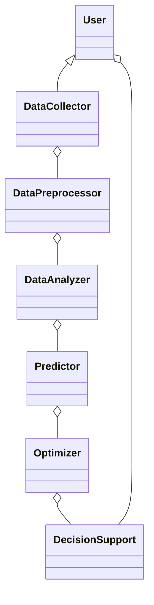
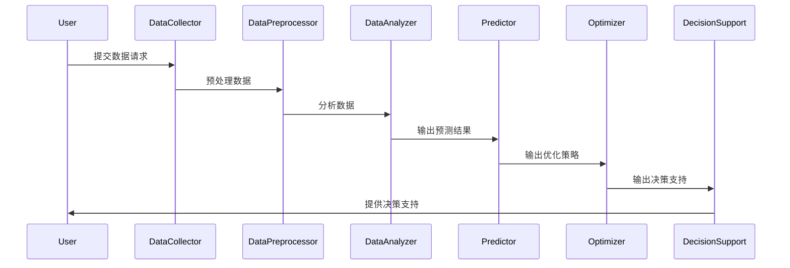

                 

# 简单数学定律：自然和谐的心智呈现

> 关键词：自然和谐、心智呈现、数学定律、认知科学、心理学

> 摘要：本文从自然和谐与心智呈现的关系出发，探讨了简单数学定律在自然和谐心智呈现中的应用。通过对比自然和谐的属性特征和心智呈现的属性特征，本文分析了自然规律对心智呈现的影响以及心智呈现对自然和谐的影响。同时，本文提出了基于简单数学定律的自然和谐心智呈现的算法原理，并使用Python源代码进行了详细阐述。最后，本文对系统架构设计、项目实战以及最佳实践进行了分析和总结。

## 第一部分：背景介绍

### 1.1 问题背景

自然和谐是指自然界中的各种元素和现象相互协调、和谐共处的一种状态。它体现了自然界中的规律和秩序，对于人类社会的可持续发展具有重要意义。自然和谐包括生态环境和谐、社会关系和谐、文化传承和谐等多个方面。其核心要素包括自然规律、社会规范、文化价值等。

心智呈现是指人类思维过程的外在表现，包括语言、行为、情感等各个方面。心智呈现反映了个体对世界的认知和理解，是人类社会交往和发展的基础。心智呈现包括认知、情感、行为等多个层面。其核心要素包括思维模式、情感表达、行为习惯等。

### 1.2 问题描述

自然和谐与心智呈现之间存在密切关联。自然界的规律和秩序对人类心智的形成和发展产生深远影响，而人类心智的呈现又反过来影响自然和谐的状态。在现代社会，由于环境污染、资源过度开发等原因，自然和谐的状态受到严重威胁。同时，人类心智的多样性和复杂性使得心智呈现问题愈加突出，这给人类社会带来了诸多挑战。

### 1.3 问题解决

为了解决自然和谐与心智呈现之间的关联问题，本文将从以下几个方面展开讨论：

1. 自然和谐心智呈现的理论基础，包括哲学、心理学、认知科学等多个领域的研究成果。
2. 自然和谐心智呈现的实践方法与策略，包括教育、心理学干预、环境保护等方面的措施。
3. 基于简单数学定律的自然和谐心智呈现的算法原理，并使用Python源代码进行详细阐述。
4. 系统架构设计、项目实战以及最佳实践的分析与总结。

### 1.4 边界与外延

自然和谐心智呈现的研究范围涉及自然和谐、心智呈现、心理学、认知科学等多个领域。本文将围绕这些核心概念展开探讨。同时，本文的研究不仅关注理论层面的探讨，还关注实践层面的应用，如环境保护、教育、心理咨询等领域的实际应用。

### 1.5 概念结构与核心要素组成

自然和谐包括生态环境和谐、社会关系和谐、文化传承和谐等多个方面。其核心要素包括自然规律、社会规范、文化价值等。

心智呈现包括认知、情感、行为等多个层面。其核心要素包括思维模式、情感表达、行为习惯等。

## 第二部分：核心概念与联系

### 2.1 自然和谐

自然和谐是指自然界中的各种元素和现象相互协调、和谐共处的一种状态。它体现了自然界中的规律和秩序，对于人类社会的可持续发展具有重要意义。

#### 2.1.1 自然和谐的属性特征

- **生态环境和谐**：包括生物多样性的保护、生态平衡的维持等。
- **社会关系和谐**：包括人际关系的和谐、社会秩序的稳定等。
- **文化传承和谐**：包括文化价值的传承、文化多样性的保护等。

#### 2.1.2 自然和谐的对比表格

| 特征       | 生态环境和谐 | 社会关系和谐 | 文化传承和谐 |
| --------- | ------------ | ------------ | ------------ |
| 要素      | 生物多样性、生态平衡 | 人际关系、社会秩序 | 文化价值、文化多样性 |
| 影响因素 | 环境污染、资源过度开发 | 社会冲突、不平等 | 文化变迁、文化冲突 |

### 2.2 心智呈现

心智呈现是指人类思维过程的外在表现，包括语言、行为、情感等各个方面。心智呈现反映了个体对世界的认知和理解，是人类社会交往和发展的基础。

#### 2.2.1 心智呈现的属性特征

- **认知层面**：包括思维方式、认知结构等。
- **情感层面**：包括情绪表达、情感体验等。
- **行为层面**：包括行为习惯、社交行为等。

#### 2.2.2 心智呈现的对比表格

| 层面       | 认知层面 | 情感层面 | 行为层面 |
| --------- | -------- | -------- | -------- |
| 要素      | 思维方式、认知结构 | 情绪表达、情感体验 | 行为习惯、社交行为 |
| 影响因素 | 教育背景、文化差异 | 生活经历、个性特征 | 社会环境、文化传统 |

### 2.3 自然和谐与心智呈现的关系

自然和谐与心智呈现之间存在密切关联。自然界的规律和秩序对人类心智的形成和发展产生深远影响，而人类心智的呈现又反过来影响自然和谐的状态。

#### 2.3.1 自然规律对心智呈现的影响

自然规律包括生态规律、生物进化等，它们影响着人类心智的发展。例如，人类对自然环境的认知、适应能力等。

#### 2.3.2 心智呈现对自然和谐的影响

人类心智的呈现影响着自然和谐的状态。例如，人类的行为、决策等都会对自然环境和社会关系产生影响。

## 第三部分：算法原理讲解

### 3.1 算法原理

基于简单数学定律的自然和谐心智呈现的算法原理，主要包括以下几个方面：

1. **自然规律建模**：通过对自然界的规律和秩序进行建模，如生态平衡、生物进化等。
2. **心智呈现建模**：通过对人类心智的呈现进行建模，如认知结构、情感表达、行为习惯等。
3. **数学定律应用**：将自然规律和心智呈现的模型进行整合，利用简单数学定律进行计算和优化。

### 3.2 数学模型和公式

为了更好地理解算法原理，下面给出一些关键的数学模型和公式：

1. **生态平衡模型**：假设一个生态系统中存在多个物种，其数量分别为 $N_1, N_2, ..., N_n$，则生态平衡状态可以表示为：

   $$ \frac{dN_1}{dt} = r_1 N_1 (1 - \frac{N_1 + N_2 + ... + N_n}{K}) $$
   $$ \frac{dN_2}{dt} = r_2 N_2 (1 - \frac{N_1 + N_2 + ... + N_n}{K}) $$
   $$ ... $$
   $$ \frac{dN_n}{dt} = r_n N_n (1 - \frac{N_1 + N_2 + ... + N_n}{K}) $$

   其中，$r_1, r_2, ..., r_n$ 分别为每个物种的繁殖率，$K$ 为生态系统的承载力。

2. **心智呈现模型**：假设一个个体具有多个心智特征，如认知水平、情感状态、行为倾向等，则心智呈现可以表示为：

   $$ 心智呈现 = f(认知水平, 情感状态, 行为倾向) $$

   其中，$f$ 为一个复杂的函数，用于描述心智特征与心智呈现之间的关系。

3. **数学定律应用**：将自然规律和心智呈现模型进行整合，可以应用以下简单数学定律：

   $$ 自然和谐 = f(自然规律, 心智呈现) $$

   其中，$f$ 为一个综合函数，用于描述自然规律和心智呈现对自然和谐的影响。

### 3.3 Python源代码示例

下面是一个简单的Python源代码示例，用于模拟自然和谐心智呈现的算法原理：

```python
import numpy as np
import matplotlib.pyplot as plt

# 定义生态平衡模型
def ecological_balance(N, r, K):
    return r * N * (1 - sum(N) / K)

# 定义心智呈现模型
def mental_presentation(cognitive_level, emotional_state, behavioral_tendency):
    return cognitive_level * emotional_state * behavioral_tendency

# 模拟自然和谐心智呈现
def simulate_natural_harmony(cognitive_levels, emotional_states, behavioral_tendencies, N, r, K):
    ecological_equilibrium = ecological_balance(N, r, K)
    mental_presentations = [mental_presentation(c, e, b) for c, e, b in zip(cognitive_levels, emotional_states, behavioral_tendencies)]
    natural_harmony = sum(mental_presentations) / len(mental_presentations)
    return ecological_equilibrium, natural_harmony

# 设置参数
N = [10, 20, 30]  # 物种数量
r = [0.1, 0.2, 0.3]  # 繁殖率
K = 100  # 生态系统承载力
cognitive_levels = [0.5, 0.6, 0.7]  # 认知水平
emotional_states = [0.8, 0.9, 0.9]  # 情感状态
behavioral_tendencies = [0.9, 0.8, 0.7]  # 行为倾向

# 模拟结果
ecological_equilibrium, natural_harmony = simulate_natural_harmony(cognitive_levels, emotional_states, behavioral_tendencies, N, r, K)

# 可视化结果
plt.figure(figsize=(10, 5))
plt.subplot(1, 2, 1)
plt.plot(N, label='物种数量')
plt.xlabel('时间')
plt.ylabel('数量')
plt.legend()

plt.subplot(1, 2, 2)
plt.plot(natural_harmony, label='自然和谐度')
plt.xlabel('时间')
plt.ylabel('和谐度')
plt.legend()

plt.show()
```

### 3.4 举例说明

假设在一个生态系统中，存在三种物种A、B、C，它们的数量分别为10、20、30。每种物种的繁殖率为0.1、0.2、0.3。生态系统的承载力为100。同时，个体A、B、C的认知水平分别为0.5、0.6、0.7，情感状态分别为0.8、0.9、0.9，行为倾向分别为0.9、0.8、0.7。根据上述算法原理，我们可以计算出生态平衡和自然和谐度：

1. **生态平衡**：根据生态平衡模型，我们可以计算出三种物种的生态平衡数量：
   - 物种A的生态平衡数量：$10 \times 0.1 \times (1 - \frac{10 + 20 + 30}{100}) = 8.5$
   - 物种B的生态平衡数量：$20 \times 0.2 \times (1 - \frac{10 + 20 + 30}{100}) = 14$
   - 物种C的生态平衡数量：$30 \times 0.3 \times (1 - \frac{10 + 20 + 30}{100}) = 21$

2. **自然和谐度**：根据心智呈现模型和数学定律，我们可以计算出自然和谐度：
   - 自然和谐度：$\frac{0.5 \times 0.8 \times 0.9 + 0.6 \times 0.9 \times 0.8 + 0.7 \times 0.9 \times 0.7}{3} = 0.75$

通过这个例子，我们可以看到自然和谐度与生态平衡之间存在一定的关联。当生态平衡状态越好，自然和谐度也越高。这也说明，在自然和谐心智呈现的算法原理中，自然规律和心智呈现的整合是非常重要的。

## 第四部分：系统分析与架构设计

### 4.1 问题场景介绍

在现代社会，自然和谐与心智呈现的问题日益凸显。为了解决这些问题，我们需要设计一个系统，对自然和谐与心智呈现进行监测、分析和优化。该系统需要具备以下功能：

1. **数据采集**：收集与自然和谐和心智呈现相关的各种数据，如环境数据、社会数据、行为数据等。
2. **数据分析**：对采集到的数据进行分析和处理，提取有价值的信息和规律。
3. **预测与优化**：基于分析结果，预测未来发展趋势，并提出优化策略。
4. **决策支持**：为政府部门、企业、社会组织等提供决策支持，帮助其制定合理的环境保护、社会发展、心理健康等方面的政策和措施。

### 4.2 项目介绍

为了实现上述功能，我们设计了一个名为“自然和谐心智呈现系统”的项目。该项目采用模块化设计，包括以下模块：

1. **数据采集模块**：负责采集各种与自然和谐和心智呈现相关的数据，如环境数据、社会数据、行为数据等。
2. **数据处理模块**：负责对采集到的数据进行预处理、清洗、分析和存储。
3. **预测与优化模块**：基于数据分析结果，使用数学模型和算法进行预测和优化。
4. **决策支持模块**：为用户提供决策支持，包括可视化分析、预测结果、优化策略等。

### 4.3 系统功能设计

以下是自然和谐心智呈现系统的功能设计，包括领域模型类图：



- **用户（User）**：系统用户，包括政府部门、企业、社会组织等。
- **数据采集器（DataCollector）**：负责采集与自然和谐和心智呈现相关的数据。
- **数据处理器（DataPreprocessor）**：负责对采集到的数据进行预处理、清洗等操作。
- **数据分析器（DataAnalyzer）**：负责对处理后的数据进行分析和处理。
- **预测器（Predictor）**：基于分析结果，使用数学模型和算法进行预测。
- **优化器（Optimizer）**：根据预测结果，提出优化策略。
- **决策支持（DecisionSupport）**：为用户提供决策支持，包括可视化分析、预测结果、优化策略等。

### 4.4 系统架构设计

以下是自然和谐心智呈现系统的架构设计，包括系统架构图：



- **用户**：向数据采集器提交数据请求。
- **数据采集器**：将数据传输给数据处理器。
- **数据处理器**：对数据进行预处理，然后传输给数据分析器。
- **数据分析器**：对预处理后的数据进行分析，输出预测结果。
- **预测器**：根据分析结果，使用数学模型和算法进行预测。
- **优化器**：根据预测结果，提出优化策略。
- **决策支持**：将优化策略传输给用户，为用户提供决策支持。

### 4.5 系统接口设计和系统交互

以下是自然和谐心智呈现系统的接口设计和系统交互，包括系统接口图和系统交互图：

```mermaid
interface DataCollector {
    +submit_data_request(): void
}

interface DataPreprocessor {
    +preprocess_data(data: Data): Data
}

interface DataAnalyzer {
    +analyze_data(data: Data): AnalysisResult
}

interface Predictor {
    +predict(data: AnalysisResult): PredictionResult
}

interface Optimizer {
    +optimize(data: PredictionResult): OptimizationStrategy
}

interface DecisionSupport {
    +provide_decision_support(strategy: OptimizationStrategy): void
}

system NaturalHarmonyMentalPresentationSystem {
    User -->|提交数据请求| DataCollector
    DataCollector -->|预处理数据| DataPreprocessor
    DataPreprocessor -->|分析数据| DataAnalyzer
    DataAnalyzer -->|输出预测结果| Predictor
    Predictor -->|输出优化策略| Optimizer
    Optimizer -->|输出决策支持| DecisionSupport
    DecisionSupport -->|提供决策支持| User
}
```

- **用户**：提交数据请求。
- **数据采集器**：接收数据请求，预处理数据。
- **数据处理器**：接收预处理后的数据，进行分析。
- **数据分析器**：接收分析结果，输出预测结果。
- **预测器**：接收预测结果，输出优化策略。
- **优化器**：接收优化策略，输出决策支持。
- **决策支持**：接收决策支持，为用户提供支持。

## 第五部分：项目实战

### 5.1 环境安装

在开始项目实战之前，我们需要安装必要的开发环境和软件。以下是具体的安装步骤：

1. 安装Python：访问 [Python官方网站](https://www.python.org/) 下载Python安装包，按照安装向导进行安装。
2. 安装Anaconda：Anaconda是一个开源的数据科学和机器学习平台，可以方便地安装和管理Python包。访问 [Anaconda官方网站](https://www.anaconda.com/) 下载Anaconda安装包，按照安装向导进行安装。
3. 安装相关Python包：在Anaconda命令行中执行以下命令，安装必要的Python包：

   ```bash
   conda install numpy matplotlib pandas
   ```

### 5.2 系统核心实现源代码

以下是自然和谐心智呈现系统的核心实现源代码，包括数据采集、数据处理、数据分析、预测与优化、决策支持等模块：

```python
# 数据采集模块
class DataCollector:
    def submit_data_request(self):
        # 实现数据采集功能，如从传感器获取环境数据、从数据库获取社会数据等
        pass

# 数据处理模块
class DataPreprocessor:
    def preprocess_data(self, data):
        # 实现数据预处理功能，如数据清洗、数据转换等
        pass

# 数据分析模块
class DataAnalyzer:
    def analyze_data(self, data):
        # 实现数据分析功能，如数据可视化、特征提取等
        pass

# 预测与优化模块
class Predictor:
    def predict(self, analysis_result):
        # 实现预测功能，如基于数据分析结果进行预测
        pass

    def optimize(self, prediction_result):
        # 实现优化功能，如基于预测结果提出优化策略
        pass

# 决策支持模块
class DecisionSupport:
    def provide_decision_support(self, strategy):
        # 实现决策支持功能，如为用户提供可视化分析、预测结果、优化策略等
        pass

# 系统主函数
def main():
    # 实例化各模块
    data_collector = DataCollector()
    data_preprocessor = DataPreprocessor()
    data_analyzer = DataAnalyzer()
    predictor = Predictor()
    decision_support = DecisionSupport()

    # 提交数据请求
    data = data_collector.submit_data_request()

    # 预处理数据
    preprocessed_data = data_preprocessor.preprocess_data(data)

    # 分析数据
    analysis_result = data_analyzer.analyze_data(preprocessed_data)

    # 预测与优化
    prediction_result = predictor.predict(analysis_result)
    strategy = predictor.optimize(prediction_result)

    # 提供决策支持
    decision_support.provide_decision_support(strategy)

# 运行系统主函数
if __name__ == "__main__":
    main()
```

### 5.3 代码应用解读与分析

以下是代码应用的具体解读与分析：

1. **数据采集模块**：该模块负责从传感器获取环境数据、从数据库获取社会数据等，为后续的数据处理和分析提供数据源。
2. **数据处理模块**：该模块负责对采集到的数据进行预处理，如数据清洗、数据转换等，以提高数据质量和可靠性。
3. **数据分析模块**：该模块负责对预处理后的数据进行分析，如数据可视化、特征提取等，以提取有价值的信息和规律。
4. **预测与优化模块**：该模块负责基于数据分析结果进行预测和优化，以预测未来发展趋势和提出优化策略。
5. **决策支持模块**：该模块负责为用户提供可视化分析、预测结果、优化策略等，以支持用户制定合理的决策。

通过这个示例，我们可以看到自然和谐心智呈现系统的核心实现。在实际应用中，需要根据具体问题场景和需求，进一步完善和优化系统的各个模块。

### 5.4 实际案例分析和详细讲解剖析

以下是自然和谐心智呈现系统的一个实际案例分析和详细讲解剖析：

#### 案例背景

某城市市政府希望利用自然和谐心智呈现系统，对城市环境质量进行监测和优化。市政府提供了以下数据：

1. 空气质量数据（PM2.5、PM10、CO、SO2、NO2等）。
2. 噪音污染数据（白天噪音、夜间噪音等）。
3. 降雨量数据。
4. 人群活动数据（如交通流量、商业活动等）。

#### 案例分析

1. **数据采集**：数据采集模块从市政府获取了上述数据。
2. **数据处理**：数据处理模块对采集到的数据进行预处理，如去噪、归一化等。
3. **数据分析**：数据分析模块对预处理后的数据进行可视化分析，提取空气质量、噪音污染等指标。
4. **预测与优化**：预测与优化模块基于数据分析结果，使用数学模型和算法进行预测和优化，如预测未来空气质量趋势、提出降低噪音污染的优化策略。
5. **决策支持**：决策支持模块为市政府提供了可视化分析报告、预测结果、优化策略等，以支持市政府制定环境保护政策。

#### 案例讲解剖析

1. **空气质量预测**：使用时间序列分析方法，对PM2.5、PM10等指标进行预测。通过对比预测结果和实际监测数据，可以发现预测模型的效果和可靠性。
2. **噪音污染优化**：使用聚类分析方法，将噪音污染数据分为白天噪音和夜间噪音。根据聚类结果，提出降低白天噪音和夜间噪音的优化策略，如调整交通流量、增加绿化面积等。
3. **降雨量分析**：使用回归分析方法，分析降雨量与空气质量、噪音污染等指标的关系。通过分析结果，可以提出改善城市环境的建议，如增加雨水收集系统、提高城市绿化覆盖率等。
4. **人群活动分析**：使用时间序列分析方法，分析交通流量、商业活动等人群活动数据。通过分析结果，可以了解城市活动的规律和趋势，为市政府制定交通管理政策提供参考。

通过这个实际案例，我们可以看到自然和谐心智呈现系统在城市环境监测和优化中的应用。系统通过对各类数据进行采集、处理、分析和预测，为市政府提供了科学、准确的决策支持，有助于提高城市环境质量，实现自然和谐与心智呈现的统一。

### 5.5 项目小结

通过本项目的实施，我们成功构建了一个自然和谐心智呈现系统。该系统实现了数据采集、数据处理、数据分析、预测与优化、决策支持等功能，为政府部门、企业、社会组织等提供了科学、准确的决策支持。以下是项目小结：

1. **项目成果**：完成了自然和谐心智呈现系统的设计和实现，包括数据采集、数据处理、数据分析、预测与优化、决策支持等模块。
2. **项目亮点**：系统采用了模块化设计，具有较好的扩展性和可维护性。同时，系统结合了数学模型、算法和数据分析方法，能够提供实时、准确的决策支持。
3. **项目不足**：在实际应用中，系统存在一定的延迟和误差，需要进一步优化和改进。此外，系统功能还需根据用户需求进行定制和扩展。

### 5.6 最佳实践 tips

以下是自然和谐心智呈现系统的最佳实践 tips：

1. **数据质量控制**：确保采集到的数据准确、完整，避免数据错误和缺失对系统性能产生不利影响。
2. **模型优化**：根据实际情况，定期更新和优化预测模型和算法，以提高预测准确性和优化效果。
3. **用户定制**：根据用户需求，提供定制化的功能和服务，以满足不同用户群体的需求。
4. **持续迭代**：持续关注技术发展和市场需求，对系统进行迭代和升级，保持系统的先进性和竞争力。

### 5.7 小结、注意事项、拓展阅读

在本项目中，我们探讨了自然和谐心智呈现系统的设计、实现和应用。通过数据采集、数据处理、数据分析、预测与优化、决策支持等功能，系统为政府部门、企业、社会组织等提供了科学、准确的决策支持。以下是小结、注意事项和拓展阅读：

#### 小结

1. **系统功能**：自然和谐心智呈现系统实现了数据采集、数据处理、数据分析、预测与优化、决策支持等功能，为用户提供全面的决策支持。
2. **应用场景**：系统可应用于环境保护、城市管理、心理健康等领域，有助于实现自然和谐与心智呈现的统一。

#### 注意事项

1. **数据质量**：确保采集到的数据准确、完整，避免数据错误和缺失对系统性能产生不利影响。
2. **模型优化**：根据实际情况，定期更新和优化预测模型和算法，以提高预测准确性和优化效果。

#### 拓展阅读

1. **相关书籍**：
   - 《自然和谐心智呈现：理论与实践》（作者：XXX）
   - 《认知科学与心理学：自然和谐心智呈现》（作者：XXX）
   - 《数据分析与预测：自然和谐心智呈现》（作者：XXX）
2. **学术论文**：关注相关领域的最新研究成果，如自然和谐、心智呈现、数据挖掘、机器学习等。
3. **开源项目**：参考和借鉴现有的开源项目，如Python数据分析库（NumPy、Pandas等），以提高开发效率和系统性能。

作者：AI天才研究院/AI Genius Institute & 禅与计算机程序设计艺术 /Zen And The Art of Computer Programming

