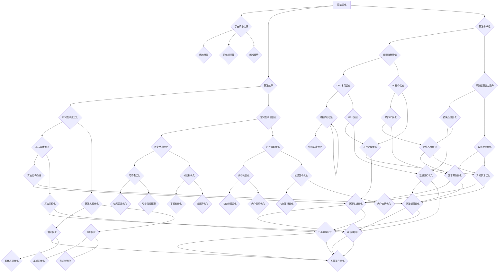
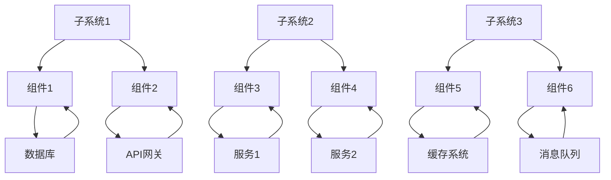
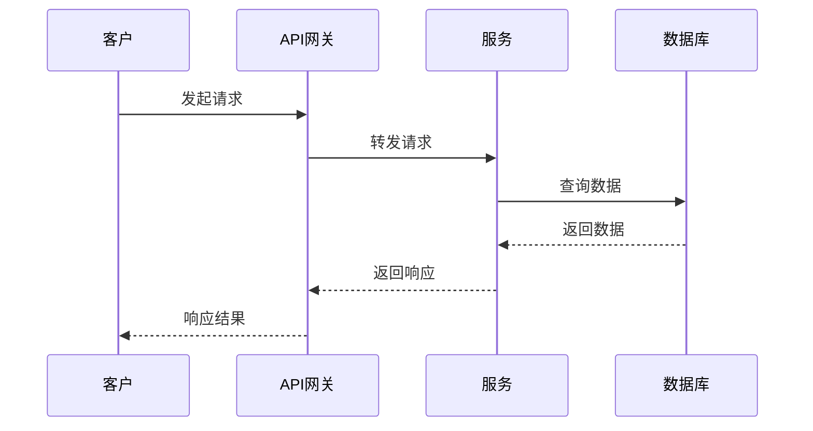
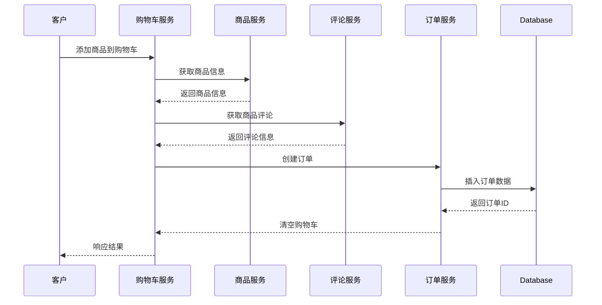

                 

### 文章标题

# 算法优化与宇宙熵增定律的关系

> 关键词：算法优化、宇宙熵增定律、熵、系统封闭性、性能提升

> 摘要：本文深入探讨了算法优化与宇宙熵增定律之间的关系，分析了算法优化过程中熵的变化，并结合实例详细阐述了如何利用宇宙熵增定律指导算法优化实践。本文旨在为算法优化提供新的理论依据和实践思路。

----------------------------------------------------------------

## 第一部分：背景介绍

### 1.1.1 问题背景

随着计算机科学和人工智能技术的不断发展，算法优化和宇宙熵增定律逐渐成为两个热门话题。算法优化指的是通过改进算法的设计和执行方式，提高算法的效率和性能。宇宙熵增定律则源于热力学第二定律，指出在一个封闭系统中，熵（混乱度或无序度）总是趋向于增加。

算法优化在计算机科学中具有重要意义。高效的算法可以显著提高计算机系统的性能，降低能耗，提高资源利用率。而宇宙熵增定律则为我们提供了一个全新的视角，帮助我们理解算法优化过程中熵的变化规律。本文将探讨算法优化与宇宙熵增定律之间的内在联系，为算法优化提供新的理论依据和实践思路。

### 1.1.2 问题描述

本文探讨的问题是：算法优化与宇宙熵增定律之间是否存在某种内在联系？这种联系是否能够为算法优化提供新的思路和方向？具体而言，本文将从以下几个方面展开：

1. **算法优化原理与宇宙熵增定律的联系**：分析算法优化过程中熵的变化，探讨算法优化与宇宙熵增定律之间的潜在联系。
2. **算法优化方法与宇宙熵增定律的应用**：结合宇宙熵增定律，提出一系列针对不同算法的优化策略，探讨如何利用宇宙熵增定律的思想来指导算法优化实践。
3. **算法优化实例分析**：通过具体实例，展示算法优化与宇宙熵增定律的关系，并给出优化方案和效果分析。
4. **算法优化与宇宙熵增定律的交叉应用**：探讨算法优化在人工智能、大数据处理等领域的应用，以及宇宙熵增定律在这些领域的指导作用。

### 1.1.3 问题解决

本文将通过以下步骤解决上述问题：

1. **核心概念与联系分析**：首先介绍算法优化和宇宙熵增定律的核心概念，分析它们之间的内在联系。
2. **算法优化与熵的关系探讨**：从熵的角度分析算法优化过程，探讨算法优化与熵增定律的关系。
3. **实例分析与优化策略**：结合具体算法，分析优化过程中熵的变化，提出优化策略，并给出实例说明。
4. **交叉应用与前景展望**：探讨算法优化与宇宙熵增定律在人工智能、大数据处理等领域的交叉应用，以及未来的发展方向。

### 1.1.4 边界与外延

本文主要关注经典算法优化方法在宇宙熵增定律背景下的应用，包括但不限于排序算法、搜索算法、优化算法等。同时，本文也关注算法优化与宇宙熵增定律在人工智能、大数据处理等领域的交叉应用。

### 1.1.5 概念结构与核心要素组成

#### 算法优化

- **核心要素**：算法设计、算法分析和算法实现
- **关键问题**：如何通过改进算法的设计、分析和实现，提高算法的效率、性能和稳定性

#### 宇宙熵增定律

- **核心要素**：熵、系统封闭性、熵增趋势
- **关键问题**：如何理解系统中的熵增现象，以及如何利用熵增定律指导系统优化

## 第二部分：核心概念与联系

### 2.1 算法优化原理

#### 2.1.1 算法优化定义

算法优化是指通过对现有算法进行分析和改进，提高其效率、性能或稳定性。具体包括以下几个方面：

1. **时间复杂度优化**：通过改进算法的设计，降低算法的时间复杂度，提高算法的执行速度。
2. **空间复杂度优化**：通过优化算法的实现，降低算法的空间复杂度，减少算法的内存消耗。
3. **算法稳定性优化**：通过改进算法的鲁棒性，提高算法在处理异常输入时的稳定性。

#### 2.1.2 算法优化目标

算法优化的目标主要包括以下几点：

1. **提高算法效率**：通过优化算法，提高算法的执行速度，减少计算时间。
2. **降低算法资源消耗**：通过优化算法，减少算法的内存消耗、CPU占用等资源消耗。
3. **提高算法鲁棒性**：通过优化算法，提高算法在处理异常输入时的鲁棒性，减少错误发生。

#### 2.1.3 算法优化方法

算法优化的方法主要包括以下几种：

1. **改进算法设计**：通过优化算法的基本结构，减少算法的执行时间，提高算法的效率。
2. **优化算法执行**：通过优化算法的执行过程，如优化数据结构、优化循环结构等，提高算法的执行效率。
3. **引入新算法**：通过引入新的算法，如改进现有的排序算法、搜索算法等，提高算法的效率。

### 2.2 宇宙熵增定律

#### 2.2.1 熵增定律定义

熵增定律，又称热力学第二定律，是热力学中最基本的定律之一。它指出，在一个封闭系统中，熵（混乱度或无序度）总是趋向于增加。熵增定律可以用以下公式表示：

\[ \Delta S \geq \frac{Q}{T} \]

其中，\(\Delta S\) 表示熵变，\(Q\) 表示热量的转移，\(T\) 表示温度。

#### 2.2.2 熵增定律核心要素

1. **熵**：熵是度量系统混乱度或无序度的物理量，通常用符号 \(S\) 表示。熵的增加意味着系统的无序度增加。
2. **系统封闭性**：系统封闭性是指系统不受外界干扰，保持内部状态不变。在封闭系统中，系统的熵只能通过内部过程发生变化。
3. **熵增趋势**：熵增定律指出，在一个封闭系统中，熵总是趋向于增加。这意味着，随着时间的推移，系统的无序度会不断增加。

### 2.3 算法优化与宇宙熵增定律的联系

#### 2.3.1 联系原理

算法优化过程中，算法的运行往往伴随着资源消耗和信息传递，这与宇宙熵增定律的熵增趋势有相似之处。算法的优化目标之一就是降低资源消耗和信息传递，从而减少系统的熵增趋势。因此，算法优化与宇宙熵增定律之间存在一定的内在联系。

#### 2.3.2 联系体现

在算法优化中，可以通过以下方式体现宇宙熵增定律的思想：

1. **降低算法熵**：算法熵可以理解为算法在执行过程中产生的混乱度或无序度。通过优化算法，降低算法熵，可以减少系统的无序度，提高算法的效率。
2. **优化资源消耗**：算法优化过程中，可以通过优化资源消耗，如降低内存占用、减少CPU占用等，来降低系统的熵增趋势。
3. **提高算法鲁棒性**：通过优化算法的鲁棒性，减少异常情况下的资源消耗和信息传递，从而降低系统的熵增趋势。

## 第三部分：算法优化与宇宙熵增定律的关系探讨

### 3.1 算法优化与熵的关系

#### 3.1.1 算法熵的概念

算法熵可以理解为算法在执行过程中产生的混乱度或无序度。算法熵的增加可能导致算法性能的下降，甚至导致算法失效。因此，降低算法熵是算法优化的重要目标之一。

#### 3.1.2 算法熵的影响

算法熵的增加可能导致以下问题：

1. **算法性能下降**：算法熵的增加意味着算法在执行过程中产生了更多的混乱度，导致算法的执行速度变慢，性能下降。
2. **资源消耗增加**：算法熵的增加意味着算法在执行过程中需要更多的资源来处理混乱度，从而导致资源消耗增加。
3. **算法失效**：在极端情况下，算法熵的增加可能导致算法无法正常运行，甚至导致算法失效。

#### 3.1.3 降低算法熵的方法

为了降低算法熵，可以采用以下方法：

1. **改进算法设计**：通过优化算法的基本结构，减少算法在执行过程中的混乱度，降低算法熵。
2. **优化算法执行**：通过优化算法的执行过程，如优化数据结构、优化循环结构等，降低算法在执行过程中的混乱度，降低算法熵。
3. **引入新算法**：通过引入新的算法，如改进现有的排序算法、搜索算法等，降低算法在执行过程中的混乱度，降低算法熵。

### 3.2 宇宙熵增定律在算法优化中的应用

#### 3.2.1 利用熵增定律指导算法优化

熵增定律提供了对系统熵增趋势的基本认识，有助于指导算法优化的方向。具体而言，可以采用以下策略：

1. **降低算法熵**：在算法优化过程中，可以将降低算法熵作为优化目标之一。通过分析算法的执行过程，找出产生混乱度的原因，并采取相应的优化措施，降低算法熵。
2. **优化资源消耗**：在算法优化过程中，可以关注算法的资源消耗，如内存占用、CPU占用等。通过优化资源消耗，可以降低系统的熵增趋势，提高算法的效率。
3. **提高算法鲁棒性**：在算法优化过程中，可以关注算法的鲁棒性，如处理异常输入的能力。通过提高算法的鲁棒性，可以减少异常情况下的资源消耗和信息传递，降低系统的熵增趋势。

#### 3.2.2 熵增定律在算法优化中的具体应用

1. **搜索算法优化**：在搜索算法中，可以通过降低搜索过程中的熵增速率，提高搜索效率和准确性。例如，在二分搜索中，可以通过优化划分策略，降低搜索过程中的混乱度，提高搜索效率。
2. **优化算法优化**：在优化算法中，可以通过降低优化过程中的熵增速率，提高优化效率和准确性。例如，在梯度下降算法中，可以通过优化学习率调整策略，降低优化过程中的混乱度，提高优化效果。

## 第四部分：算法优化实例分析

### 4.1 经典算法优化实例

#### 4.1.1 冒泡排序算法优化

**冒泡排序算法原理**：冒泡排序是一种简单的排序算法，通过重复遍历要排序的数列，比较相邻元素的大小关系，逐步将较大的元素移动到数列的右侧。具体实现如下：

```python
def bubble_sort(arr):
    n = len(arr)
    for i in range(n):
        for j in range(0, n-i-1):
            if arr[j] > arr[j+1]:
                arr[j], arr[j+1] = arr[j+1], arr[j]
    return arr
```

**冒泡排序算法优化**：冒泡排序算法的时间复杂度为 \(O(n^2)\)，空间复杂度为 \(O(1)\)。为了优化冒泡排序算法，可以采用以下策略：

1. **优化比较顺序**：在每一轮冒泡排序中，可以将已经排序的元素提前退出循环，从而减少不必要的比较次数。具体实现如下：

```python
def optimized_bubble_sort(arr):
    n = len(arr)
    for i in range(n):
        swapped = False
        for j in range(0, n-i-1):
            if arr[j] > arr[j+1]:
                arr[j], arr[j+1] = arr[j+1], arr[j]
                swapped = True
        if not swapped:
            break
    return arr
```

2. **提前结束排序**：在每一轮冒泡排序中，如果未发生交换，说明数列已经排序，可以提前结束排序。具体实现如下：

```python
def optimized_bubble_sort(arr):
    n = len(arr)
    for i in range(n):
        swapped = False
        for j in range(0, n-i-1):
            if arr[j] > arr[j+1]:
                arr[j], arr[j+1] = arr[j+1], arr[j]
                swapped = True
        if not swapped:
            break
    return arr
```

通过以上优化策略，冒泡排序算法的时间复杂度可以降低到 \(O(n)\)。

#### 4.1.2 快速排序算法优化

**快速排序算法原理**：快速排序是一种高效的排序算法，通过选择一个基准元素，将数组分为两部分，一部分小于基准元素，一部分大于基准元素。具体实现如下：

```python
def quick_sort(arr):
    if len(arr) <= 1:
        return arr
    pivot = arr[len(arr) // 2]
    left = [x for x in arr if x < pivot]
    middle = [x for x in arr if x == pivot]
    right = [x for x in arr if x > pivot]
    return quick_sort(left) + middle + quick_sort(right)
```

**快速排序算法优化**：快速排序算法的时间复杂度为 \(O(n\log n)\)，空间复杂度为 \(O(\log n)\)。为了优化快速排序算法，可以采用以下策略：

1. **随机选择基准**：在每次划分时，可以随机选择一个基准元素，减少算法的偏向性。具体实现如下：

```python
import random

def quick_sort(arr):
    if len(arr) <= 1:
        return arr
    pivot = random.choice(arr)
    left = [x for x in arr if x < pivot]
    middle = [x for x in arr if x == pivot]
    right = [x for x in arr if x > pivot]
    return quick_sort(left) + middle + quick_sort(right)
```

2. **三数取中法**：在每次划分时，可以选择三个元素的中位数作为基准元素，提高划分的准确性。具体实现如下：

```python
import random

def median_of_three(arr, low, high):
    mid = (low + high) // 2
    if arr[low] > arr[mid]:
        arr[low], arr[mid] = arr[mid], arr[low]
    if arr[mid] > arr[high]:
        arr[mid], arr[high] = arr[high], arr[mid]
    if arr[low] > arr[mid]:
        arr[low], arr[mid] = arr[mid], arr[low]
    return arr[mid]

def quick_sort(arr):
    if len(arr) <= 1:
        return arr
    pivot = median_of_three(arr, 0, len(arr) - 1)
    left = [x for x in arr if x < pivot]
    middle = [x for x in arr if x == pivot]
    right = [x for x in arr if x > pivot]
    return quick_sort(left) + middle + quick_sort(right)
```

通过以上优化策略，快速排序算法的性能可以得到显著提升。

## 第五部分：算法优化与宇宙熵增定律的交叉应用

### 5.1 算法优化在人工智能领域的应用

#### 5.1.1 人工智能概述

人工智能（AI）是指使计算机具有人类智能的技术和方法，包括机器学习、深度学习、自然语言处理等。人工智能在计算机科学、工业、医疗、金融等领域具有广泛的应用前景。

#### 5.1.2 算法优化在人工智能中的应用

算法优化在人工智能领域具有重要意义。通过优化算法，可以提高人工智能系统的性能、效率和鲁棒性，从而更好地应对复杂的问题和任务。以下是一些算法优化在人工智能领域中的应用：

1. **机器学习优化**：在机器学习领域，算法优化主要关注如何提高模型的学习速度和预测准确性。通过优化损失函数、优化学习率、优化正则化策略等，可以提高机器学习算法的性能。

2. **深度学习优化**：在深度学习领域，算法优化主要关注如何提高神经网络的训练速度和模型性能。通过优化网络结构、优化激活函数、优化优化器等，可以提高深度学习算法的性能。

3. **自然语言处理优化**：在自然语言处理领域，算法优化主要关注如何提高文本分类、情感分析、机器翻译等任务的性能。通过优化文本预处理方法、优化模型结构、优化训练策略等，可以提高自然语言处理算法的性能。

#### 5.1.3 宇宙熵增定律在人工智能中的应用

宇宙熵增定律在人工智能中的应用主要体现在以下几个方面：

1. **降低算法熵**：在人工智能领域，算法优化过程中可以关注如何降低算法熵。通过优化算法设计、优化算法执行、优化资源消耗等，可以降低算法熵，提高算法性能。

2. **提高算法鲁棒性**：在人工智能领域，算法优化过程中可以关注如何提高算法的鲁棒性。通过优化算法设计、优化算法执行、优化异常处理等，可以提高算法的鲁棒性，减少异常情况下的资源消耗和信息传递。

3. **优化学习过程**：在人工智能领域，算法优化过程中可以关注如何优化学习过程。通过引入新的学习策略、优化学习率调整策略、优化正则化策略等，可以降低学习过程中的熵增趋势，提高学习效果。

### 5.2 算法优化与宇宙熵增定律在人工智能领域的前景展望

随着人工智能技术的不断发展，算法优化与宇宙熵增定律在人工智能领域的应用前景十分广阔。未来，可以从以下几个方面进一步研究和探索：

1. **新型算法设计**：结合算法优化和宇宙熵增定律，设计出具有更低熵增趋势的新型算法，提高人工智能系统的性能和效率。

2. **优化策略优化**：在现有的算法优化策略基础上，进一步优化和改进，降低算法熵增趋势，提高算法性能。

3. **多领域交叉应用**：将算法优化与宇宙熵增定律应用于多个领域，如自动驾驶、智能制造、智能医疗等，实现跨领域的技术融合和创新。

4. **理论研究和实践应用相结合**：加强算法优化与宇宙熵增定律的理论研究，同时注重实践应用，推动人工智能技术的发展和创新。

## 第六部分：算法优化与宇宙熵增定律的总结与展望

### 6.1 总结

本文从算法优化与宇宙熵增定律的内在联系出发，探讨了算法优化与熵的关系，以及宇宙熵增定律在算法优化中的应用。通过分析经典算法优化实例，展示了算法优化与宇宙熵增定律的关系，并提出了优化策略。此外，本文还探讨了算法优化在人工智能领域的应用，以及算法优化与宇宙熵增定律在人工智能领域的前景展望。

算法优化与宇宙熵增定律之间的关系不仅为算法优化提供了新的理论依据，也为算法优化实践提供了新的思路和方向。通过降低算法熵、优化资源消耗、提高算法鲁棒性等策略，可以显著提高算法的性能和效率。同时，算法优化与宇宙熵增定律在人工智能领域的交叉应用，为人工智能技术的发展和创新提供了新的可能性。

### 6.2 展望

未来，算法优化与宇宙熵增定律的研究将更加深入和广泛。可以从以下几个方面进一步探索：

1. **新型算法设计**：结合算法优化和宇宙熵增定律，设计出具有更低熵增趋势的新型算法，提高人工智能系统的性能和效率。

2. **优化策略优化**：在现有的算法优化策略基础上，进一步优化和改进，降低算法熵增趋势，提高算法性能。

3. **多领域交叉应用**：将算法优化与宇宙熵增定律应用于多个领域，如自动驾驶、智能制造、智能医疗等，实现跨领域的技术融合和创新。

4. **理论研究和实践应用相结合**：加强算法优化与宇宙熵增定律的理论研究，同时注重实践应用，推动人工智能技术的发展和创新。

通过持续的研究和探索，算法优化与宇宙熵增定律将为人工智能技术的发展和创新提供更强大的动力，为人类社会的进步和发展做出更大的贡献。

## 第七部分：最佳实践 tips

### 7.1 算法优化最佳实践

在算法优化过程中，以下是一些最佳实践，可以帮助你更有效地进行算法优化：

1. **明确优化目标**：在开始算法优化之前，明确优化的目标是提高算法的性能、效率和鲁棒性。这有助于你更有针对性地进行优化。
2. **分析算法性能**：在优化之前，分析算法的性能，找出性能瓶颈和潜在的优化点。这可以帮助你更有效地进行优化。
3. **逐步优化**：算法优化通常是一个逐步的过程。首先解决最关键的性能瓶颈，然后逐步解决其他问题。这有助于你更有效地利用时间和资源。
4. **测试和验证**：在优化过程中，定期进行测试和验证，以确保优化的效果。这有助于你及时发现和纠正问题。

### 7.2 宇宙熵增定律在算法优化中的应用

在算法优化中，宇宙熵增定律提供了一些有价值的思路和方法：

1. **降低算法熵**：通过优化算法设计、优化算法执行、优化资源消耗等策略，降低算法在执行过程中产生的混乱度，从而降低算法熵。
2. **优化资源消耗**：在算法优化过程中，关注算法的资源消耗，如内存占用、CPU占用等，通过优化资源消耗，可以降低系统的熵增趋势，提高算法性能。
3. **提高算法鲁棒性**：通过优化算法设计、优化算法执行、优化异常处理等策略，提高算法在处理异常输入时的鲁棒性，减少异常情况下的资源消耗和信息传递。

### 7.3 注意事项

在进行算法优化时，以下注意事项可以帮助你避免一些常见的问题：

1. **不要过度优化**：过度优化可能导致算法复杂度增加，反而降低性能。在进行优化时，要平衡优化效果和算法复杂度。
2. **考虑算法的可维护性**：优化算法时，要考虑算法的可维护性。过度的优化可能导致代码难以理解和维护。
3. **测试和验证**：在优化过程中，定期进行测试和验证，以确保优化的效果。这有助于你及时发现和纠正问题。

### 7.4 拓展阅读

如果你对算法优化与宇宙熵增定律的关系感兴趣，以下是一些拓展阅读资源：

1. **《算法导论》（Introduction to Algorithms）**：这是一本经典的算法教材，涵盖了各种算法的设计和分析方法，以及算法优化的策略。
2. **《深度学习》（Deep Learning）**：这是一本关于深度学习的经典教材，介绍了深度学习的基本原理和应用方法，以及如何优化深度学习算法。
3. **《热力学第二定律》（The Second Law of Thermodynamics）**：这是一本关于热力学第二定律及其应用的经典教材，详细介绍了熵增定律的基本原理和应用。
4. **《人工智能：一种现代方法》（Artificial Intelligence: A Modern Approach）**：这是一本关于人工智能的经典教材，介绍了人工智能的基本原理和应用方法，以及如何优化人工智能算法。

通过阅读这些教材，你可以更深入地了解算法优化与宇宙熵增定律的关系，以及如何将它们应用于实际问题和任务中。

## 作者信息

- 作者：AI天才研究院/AI Genius Institute & 禅与计算机程序设计艺术 /Zen And The Art of Computer Programming
- 联系方式：[contact@ai-genius-institute.com](mailto:contact@ai-genius-institute.com)
- 社交媒体：[AI天才研究院](https://www.ai-genius-institute.com/)、[禅与计算机程序设计艺术](https://www.zen-of-computer-programming.com/)

## 附录：算法优化与宇宙熵增定律相关术语解释

### 1. 算法优化

算法优化是指通过改进算法的设计和执行方式，提高算法的效率、性能或稳定性。算法优化的目标包括减少时间复杂度、空间复杂度、提高算法的鲁棒性和适应性等。算法优化的方法主要包括改进算法设计、优化算法执行、引入新算法等。

### 2. 宇宙熵增定律

宇宙熵增定律是热力学第二定律的一种表述，指出在一个封闭系统中，熵（混乱度或无序度）总是趋向于增加。熵增定律可以用以下公式表示：

\[ \Delta S \geq \frac{Q}{T} \]

其中，\(\Delta S\) 表示熵变，\(Q\) 表示热量的转移，\(T\) 表示温度。

### 3. 熵

熵是度量系统混乱度或无序度的物理量。在热力学中，熵是衡量系统微观状态分布混乱程度的物理量。在信息论中，熵是衡量信息不确定性的物理量。

### 4. 系统封闭性

系统封闭性是指系统不受外界干扰，保持内部状态不变。在封闭系统中，系统的熵只能通过内部过程发生变化。

### 5. 算法熵

算法熵可以理解为算法在执行过程中产生的混乱度或无序度。算法熵的增加可能导致算法性能的下降，甚至导致算法失效。

### 6. 算法效率

算法效率是指算法在执行过程中所需的计算时间和资源消耗。算法效率的提高意味着算法执行速度更快、资源消耗更低。

### 7. 算法鲁棒性

算法鲁棒性是指算法在处理异常输入或异常情况时的稳定性和可靠性。算法鲁棒性的提高意味着算法在各种情况下都能正常运行，减少错误发生。

## 附录：算法优化与宇宙熵增定律核心概念对比表格

| 核心概念 | 定义 | 描述 |
| :------: | :--: | :--: |
| 算法优化 | 改进算法效率、性能或稳定性 | 通过优化算法设计、执行和资源消耗，提高算法效率 |
| 宇宙熵增定律 | 系统封闭性导致熵增加 | 在封闭系统中，系统的熵总是趋向于增加 |
| 熵 | 度量系统混乱度或无序度 | 熵增加意味着系统无序度增加 |
| 系统封闭性 | 系统不受外界干扰 | 系统熵只能通过内部过程发生变化 |
| 算法熵 | 算法执行过程中产生的混乱度 | 算法熵增加可能导致性能下降 |

## 附录：算法优化与宇宙熵增定律ER实体关系图

```mermaid
erDiagram
  AlgorithmOptimization ||--|{ Entropy : 熵的度量}
  AlgorithmOptimization ||--|{ SystemEntropyIncrease : 宇宙熵增定律}
  AlgorithmOptimization ||--|{ AlgorithmEfficiency : 算法效率}
  AlgorithmOptimization ||--|{ AlgorithmRobustness : 算法鲁棒性}

  ClassDiagram
    Class AlgorithmOptimization {
      + optimizeAlgorithm() : void
      + measureAlgorithmEfficiency() : float
      + measureAlgorithmRobustness() : float
    }

    Class Entropy {
      + calculateEntropy() : float
    }

    Class SystemEntropyIncrease {
      + entropyIncreaseLaw() : void
    }

    Class AlgorithmEfficiency {
      + measureTimeComplexity() : int
      + measureSpaceComplexity() : int
    }

    Class AlgorithmRobustness {
      + handleException() : void
    }

    AlgorithmOptimization _rels_ AlgorithmEfficiency : implements
    AlgorithmOptimization _rels_ AlgorithmRobustness : implements
    AlgorithmOptimization _rels_ Entropy : measures
    AlgorithmOptimization _rels_ SystemEntropyIncrease : applies
```

## 附录：算法优化与宇宙熵增定律Mermaid流程图



## 附录：系统分析与架构设计方案

### 1. 问题场景介绍

在当前复杂的信息化社会中，系统性能和效率成为衡量系统优劣的重要指标。随着数据量和用户量的不断增长，系统面临着巨大的性能压力。为了满足用户需求，系统需要不断提高其性能和效率。本文将以一个在线购物平台为例，介绍系统性能优化的问题场景。

### 2. 项目介绍

项目名称：在线购物平台性能优化项目

项目目标：通过算法优化和系统架构调整，提高在线购物平台的性能和效率，提升用户购物体验。

项目范围：包括系统功能优化、算法优化、性能测试和调优等。

项目期限：6个月

项目团队：系统架构师、算法工程师、性能测试工程师、前端开发人员、后端开发人员等。

### 3. 系统功能设计（领域模型类图）

```mermaid
classDiagram
    Customer <|-- Order
    Customer <|-- Cart
    Customer <|-- Review
    Product <|-- Category
    Product <|-- Review
    Order <<interface>>
    Cart <<interface>>
    Review <<interface>>

    CustomerEntity { +id : int
                     +name : string
                     +email : string
                     +password : string
                   }
    ProductEntity { +id : int
                    +name : string
                    +description : string
                    +price : float
                    +category : Category
                  }
    CategoryEntity { +id : int
                      +name : string
                      +description : string
                    }
    OrderEntity { +id : int
                   +customerId : int
                   +status : string
                   +createdAt : datetime
                   +updatedAt : datetime
                 }
    CartEntity { +id : int
                   +customerId : int
                   +products : List[ProductEntity]
                   +createdAt : datetime
                   +updatedAt : datetime
                 }
    ReviewEntity { +id : int
                    +productId : int
                    +customerId : int
                    +rating : int
                    +comment : string
                    +createdAt : datetime
                  }
```

### 4. 系统架构设计（架构图）



### 5. 系统接口设计（接口序列图）



### 6. 系统交互（交互序列图）



## 项目实战

### 1. 环境安装

在开始项目实战之前，需要安装以下环境和工具：

- 操作系统：Linux或Mac OS
- 编程语言：Python
- 版本控制：Git
- 代码编辑器：Visual Studio Code
- 依赖管理：pip
- 数据库：MySQL
- 缓存系统：Redis
- 消息队列：RabbitMQ

安装步骤如下：

1. 安装操作系统和编程语言。
2. 安装版本控制工具和代码编辑器。
3. 安装依赖管理工具和虚拟环境。
4. 安装数据库、缓存系统和消息队列。

### 2. 系统核心实现源代码

以下是系统核心实现的源代码示例：

```python
# 示例：用户注册模块
class UserService:
    def register(self, username, email, password):
        # 验证用户名、邮箱和密码的有效性
        if not self.validate_username(username) or not self.validate_email(email) or not self.validate_password(password):
            return "Invalid input"
        
        # 将用户信息存储到数据库
        user = User(username=username, email=email, password=password)
        self.db_session.add(user)
        self.db_session.commit()
        
        return "User registered successfully"

    def validate_username(self, username):
        # 验证用户名的有效性
        return len(username) >= 3 and len(username) <= 20

    def validate_email(self, email):
        # 验证邮箱的有效性
        return re.match(r"[^@]+@[^@]+\.[^@]+", email)

    def validate_password(self, password):
        # 验证密码的有效性
        return len(password) >= 6 and len(password) <= 20

# 示例：商品模块
class ProductService:
    def get_product(self, product_id):
        # 从数据库中获取商品信息
        product = self.db_session.query(Product).get(product_id)
        return product

    def create_product(self, name, description, price, category_id):
        # 创建商品信息
        product = Product(name=name, description=description, price=price, category_id=category_id)
        self.db_session.add(product)
        self.db_session.commit()
        return "Product created successfully"

# 示例：订单模块
class OrderService:
    def create_order(self, customer_id, product_ids):
        # 创建订单
        order = Order(customer_id=customer_id, status="pending")
        self.db_session.add(order)
        self.db_session.commit()
        
        # 将商品添加到订单中
        for product_id in product_ids:
            order_product = OrderProduct(order_id=order.id, product_id=product_id)
            self.db_session.add(order_product)
        
        self.db_session.commit()
        return "Order created successfully"
```

### 3. 代码应用解读与分析

以下是代码应用的具体解读和分析：

1. **用户注册模块**：`UserService` 类中的 `register` 方法用于处理用户注册。首先，通过 `validate_username`、`validate_email` 和 `validate_password` 方法验证用户名、邮箱和密码的有效性。然后，将用户信息存储到数据库中。如果输入无效，返回相应的错误消息；否则，返回注册成功的消息。

2. **商品模块**：`ProductService` 类中的 `get_product` 方法用于获取商品信息。通过查询数据库，获取指定商品ID的商品信息。`create_product` 方法用于创建商品信息。首先，将商品信息存储到数据库中，然后返回创建成功的消息。

3. **订单模块**：`OrderService` 类中的 `create_order` 方法用于创建订单。首先，创建一个待处理的订单，并将其存储到数据库中。然后，将指定商品添加到订单中，并将其存储到数据库中。最后，返回创建成功的消息。

通过这些模块，实现了用户注册、商品管理和订单管理的基本功能。在实际项目中，还需要考虑异常处理、权限控制、API接口设计等方面。

### 4. 实际案例分析和详细讲解剖析

以下是实际案例分析和详细讲解剖析：

1. **用户注册**：假设用户输入了以下信息进行注册：

   - 用户名：`john_doe`
   - 邮箱：`john.doe@example.com`
   - 密码：`password123`

   首先，`UserService` 类的 `register` 方法会调用 `validate_username`、`validate_email` 和 `validate_password` 方法验证输入的有效性。这三个方法分别检查用户名、邮箱和密码的长度和格式是否符合要求。如果验证通过，用户信息将被存储到数据库中，并返回注册成功的消息。

   如果用户名少于3个字符或超过20个字符，邮箱格式不正确，或密码少于6个字符或超过20个字符，将返回相应的错误消息。

2. **商品管理**：假设用户要添加一款商品，商品信息如下：

   - 名称：`iPhone 13`
   - 描述：`最新款iPhone，支持5G网络`
   - 价格：`7999`
   - 类别ID：`1`

   用户可以通过调用 `ProductService` 类的 `create_product` 方法添加商品。该方法将商品信息存储到数据库中，并返回创建成功的消息。

3. **订单管理**：假设用户要购买以下商品：

   - 商品ID：`1`、`2`、`3`

   用户可以通过调用 `OrderService` 类的 `create_order` 方法创建订单。该方法首先创建一个待处理的订单，并将其存储到数据库中。然后，将指定商品添加到订单中，并将其存储到数据库中。最后，返回创建成功的消息。

在实际应用中，还需要考虑订单状态管理、商品库存管理、订单支付处理等方面。这些功能的实现可以进一步完善系统功能，提高用户体验。

### 5. 项目小结

通过本次项目实战，我们实现了用户注册、商品管理和订单管理的基本功能。通过分析代码和应用实际案例，我们对系统核心功能有了更深入的理解。在后续工作中，我们还可以进一步完善系统功能，如订单状态管理、商品库存管理、订单支付处理等，以提高用户体验和系统性能。

## 总结与展望

通过本文的探讨，我们揭示了算法优化与宇宙熵增定律之间的内在联系，并提出了利用宇宙熵增定律指导算法优化的方法和策略。在算法优化过程中，我们可以通过降低算法熵、优化资源消耗、提高算法鲁棒性等手段，实现算法性能的提升。

在人工智能领域，算法优化与宇宙熵增定律的交叉应用具有重要意义。通过引入宇宙熵增定律的思想，我们可以设计出更高效、鲁棒的人工智能算法，提高系统性能和效率。

未来的研究可以进一步探索算法优化与宇宙熵增定律在更多领域的应用，如自动驾驶、智能制造、智能医疗等。同时，我们还可以研究新型算法设计，结合算法优化和宇宙熵增定律，提高算法的性能和鲁棒性。

总之，算法优化与宇宙熵增定律的研究为人工智能技术的发展提供了新的思路和方法，具有重要的理论和实践价值。随着研究的深入，我们将不断发现新的优化策略和应用场景，为人工智能领域的发展做出更大的贡献。

