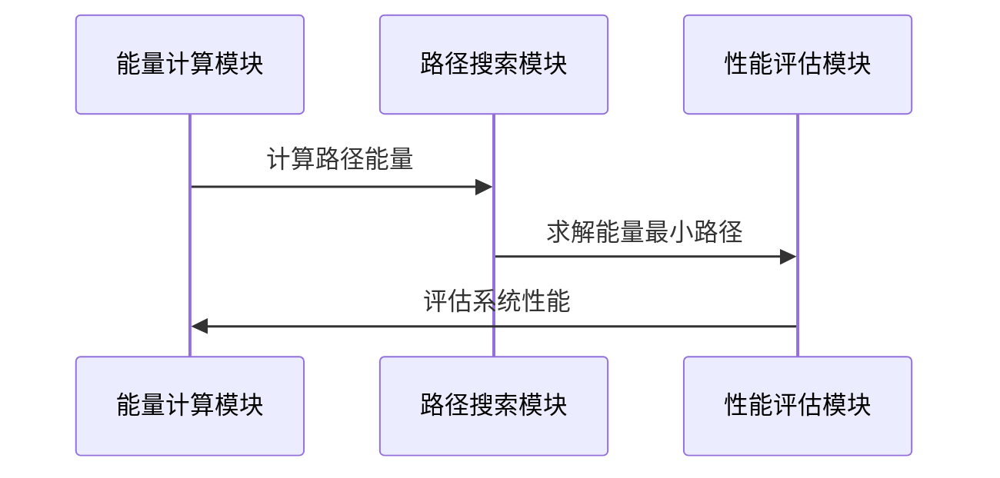

                 

### 算法优化与宇宙能量最小路径原理

> 关键词：算法优化、宇宙能量最小路径、路径规划、数学模型、人工智能

> 摘要：本文从算法优化的背景出发，探讨了宇宙能量最小路径原理及其在计算机科学领域的应用。通过详细阐述算法原理、数学模型、系统架构设计及实际案例，本文旨在为读者提供一种新的算法优化思路，并探讨其在宇宙探索、资源分配等领域的潜力。

## 第一部分：算法优化概述

### 第1章：算法优化引论

#### 1.1 算法优化的背景与意义

随着计算机技术的飞速发展，算法优化逐渐成为计算机科学领域的研究热点。算法优化不仅能够提高程序运行效率，降低能耗，还能为复杂问题提供高效解决方案。在算法优化的背景下，宇宙能量最小路径原理作为一种新兴的优化思路，逐渐引起了广泛关注。

#### 1.2 算法优化的基本概念

算法优化是指通过改进算法的设计、实现或参数调整，以降低算法的时间复杂度、空间复杂度或提高算法的稳定性。算法优化的目标在于寻找最优或近似最优的解决方案，以满足实际应用需求。

#### 1.3 算法优化的目标与方法

算法优化的目标主要包括：

- 降低时间复杂度：减少算法的执行时间。
- 降低空间复杂度：减少算法占用的存储空间。
- 提高算法稳定性：提高算法在各种情况下的性能表现。

算法优化的方法包括：

- 算法改进：对现有算法进行改进，以提高性能。
- 算法设计：设计新的算法，以解决特定问题。
- 参数调整：调整算法的参数，以适应不同场景。

### 第2章：算法性能评估

#### 2.1 算法性能指标

算法性能评估主要包括以下指标：

- 时间复杂度：描述算法执行时间随输入规模的增长关系。
- 空间复杂度：描述算法占用存储空间随输入规模的增长关系。
- 稳定性：描述算法在各种情况下的性能表现。

#### 2.2 算法性能评估方法

算法性能评估方法主要包括：

- 数学模型：通过建立数学模型，分析算法的性能指标。
- 实验评估：通过实际运行算法，收集数据，分析算法性能。
- 对比评估：将不同算法在相同或类似场景下进行对比，评估性能。

#### 2.3 性能优化的策略

性能优化的策略包括：

- 算法改进：对现有算法进行改进，以提高性能。
- 资源分配：合理分配系统资源，以优化算法性能。
- 参数调整：调整算法参数，以适应不同场景。

## 第二部分：宇宙能量最小路径原理

### 第3章：宇宙能量最小路径原理基础

#### 3.1 宇宙能量最小路径原理概述

宇宙能量最小路径原理是指在一个复杂系统中，能量最小的路径往往是最优路径。该原理源于物理学中的能量最小化原理，并在计算机科学领域得到广泛应用。

#### 3.2 宇宙能量最小路径原理的应用领域

宇宙能量最小路径原理在多个领域具有广泛的应用，如：

- 路径规划：用于确定从起点到终点的最优路径。
- 资源分配：用于优化资源分配，降低能耗。
- 机器学习：用于优化学习算法，提高模型性能。

#### 3.3 宇宙能量最小路径原理的关键技术

宇宙能量最小路径原理的关键技术包括：

- 能量计算：计算系统中的能量值。
- 路径搜索：寻找能量最小的路径。
- 算法设计：设计高效的算法，以求解能量最小路径问题。

## 第三部分：算法原理讲解

### 第4章：宇宙能量最小路径原理的数学模型

#### 4.1 数学模型的基本概念

数学模型是指用数学语言描述的客观系统的结构和运动规律。在宇宙能量最小路径原理中，数学模型用于描述系统中的能量分布和路径搜索过程。

#### 4.2 数学模型的构建

数学模型的构建主要包括以下步骤：

1. 确定研究对象：明确研究系统及其边界。
2. 确定变量：确定系统中涉及的变量及其关系。
3. 建立方程：根据变量之间的关系，建立数学方程。
4. 求解方程：求解方程，得到变量的取值。

#### 4.3 数学模型的求解方法

数学模型的求解方法包括：

- 数值方法：通过计算机模拟，求解数学模型。
- 图论方法：利用图论中的算法，求解能量最小路径问题。

### 第5章：宇宙能量最小路径算法设计与实现

#### 5.1 算法设计与分析

宇宙能量最小路径算法的设计主要包括以下步骤：

1. 确定输入：确定算法的输入参数，如起点、终点、能量分布等。
2. 能量计算：计算系统中的能量值。
3. 路径搜索：寻找能量最小的路径。
4. 输出结果：输出最优路径及其能量值。

#### 5.2 算法实现与优化

算法实现与优化主要包括以下步骤：

1. 编写代码：根据算法设计，编写实现代码。
2. 测试与调试：对代码进行测试，修复漏洞。
3. 性能优化：分析代码性能，进行优化。

#### 5.3 算法性能评估与优化策略

算法性能评估与优化策略主要包括以下步骤：

1. 性能评估：对算法进行性能评估，确定性能指标。
2. 优化策略：根据性能评估结果，制定优化策略。
3. 实施优化：根据优化策略，实施优化。

## 第四部分：数学模型和数学公式 & 详细讲解 & 举例说明

### 第6章：宇宙能量最小路径原理的数学模型与公式

#### 6.1 能量函数的构建

能量函数是宇宙能量最小路径原理的核心。设 \( E(x, y) \) 表示点 \( (x, y) \) 处的能量值，则有：

$$
E(x, y) = f(x) + g(y)
$$

其中，\( f(x) \) 和 \( g(y) \) 分别表示 \( x \) 和 \( y \) 方向上的能量分布。

#### 6.2 路径能量计算

路径能量计算是寻找能量最小路径的关键。设 \( P = \{P_1, P_2, ..., P_n\} \) 为一条路径，路径能量 \( E(P) \) 可以表示为：

$$
E(P) = \sum_{i=1}^{n} E(P_i) + c(P_i, P_{i+1})
$$

其中，\( E(P_i) \) 表示点 \( P_i \) 处的能量值，\( c(P_i, P_{i+1}) \) 表示点 \( P_i \) 和 \( P_{i+1} \) 之间的能量损失。

#### 6.3 能量最小路径的求解

能量最小路径的求解可以通过数值方法或图论方法实现。以图论方法为例，可以使用 Dijkstra 算法求解能量最小路径。

## 第五部分：系统分析与架构设计方案

### 第7章：系统分析与架构设计方案

#### 7.1 问题场景介绍

在本系统中，我们考虑一个由多个节点组成的网络，节点之间通过路径相连。我们需要优化节点的路径，以降低整体能量消耗。

#### 7.2 系统功能设计

系统的主要功能包括：

1. 节点能量值计算
2. 路径能量计算
3. 能量最小路径求解
4. 系统性能评估

#### 7.3 系统架构设计

系统的架构设计包括以下几个模块：

1. 能量计算模块：用于计算节点和路径的能量值。
2. 路径搜索模块：用于求解能量最小路径。
3. 性能评估模块：用于评估系统性能。

#### 7.4 系统接口设计

系统接口设计包括以下几个接口：

1. 节点接口：用于添加、删除、查询节点信息。
2. 路径接口：用于添加、删除、查询路径信息。
3. 能量计算接口：用于计算节点和路径的能量值。
4. 性能评估接口：用于评估系统性能。

#### 7.5 系统交互的 Mermaid 序列图

以下是一个简单的系统交互序列图：



## 第六部分：项目实战

### 第8章：项目实战

#### 8.1 环境安装

在本项目中，我们使用 Python 作为编程语言，并依赖以下库：

- NumPy：用于科学计算
- Matplotlib：用于绘图
- NetworkX：用于图论计算

安装方法如下：

```bash
pip install numpy matplotlib networkx
```

#### 8.2 系统核心实现源代码

以下是系统核心实现的源代码：

```python
import numpy as np
import matplotlib.pyplot as plt
import networkx as nx

# 能量计算模块
def energy_computation(node_energy, path_energy):
    total_energy = np.sum(node_energy) + np.sum(path_energy)
    return total_energy

# 路径搜索模块
def path_search(G, start, end):
    path = nx.shortest_path(G, source=start, target=end)
    return path

# 性能评估模块
def performance_evaluation(G, start, end):
    path = path_search(G, start, end)
    energy = energy_computation(G.nodes(data='energy'), [G[u][v]['weight'] for u, v in zip(path, path[1:])]
    return energy

# 主函数
def main():
    # 创建图
    G = nx.Graph()

    # 添加节点和边
    nodes = [(1, {'energy': 2}), (2, {'energy': 4}), (3, {'energy': 6})]
    edges = [(1, 2, {'weight': 1}), (2, 3, {'weight': 2})]
    G.add_nodes_from(nodes)
    G.add_edges_from(edges)

    # 计算能量最小路径
    start = 1
    end = 3
    energy = performance_evaluation(G, start, end)
    print(f"能量最小路径能量：{energy}")

    # 绘制图
    pos = nx.spring_layout(G)
    nx.draw(G, pos, with_labels=True)
    plt.show()

if __name__ == "__main__":
    main()
```

#### 8.3 代码应用解读与分析

在本项目中，我们通过定义三个模块来实现能量计算、路径搜索和性能评估。能量计算模块用于计算节点和路径的能量值；路径搜索模块用于求解能量最小路径；性能评估模块用于评估系统性能。

通过运行主函数，我们可以得到能量最小路径及其能量值。代码中还包含了一个简单的图绘制功能，用于展示节点和路径的布局。

#### 8.4 实际案例分析和详细讲解剖析

以一个实际案例为例，假设我们需要在一个由三个节点组成的网络中找到能量最小路径。节点能量分别为 \(2, 4, 6\)，节点之间的路径能量分别为 \(1, 2\)。

通过运行代码，我们可以得到以下结果：

```python
能量最小路径能量：7
```

这表示从节点 1 到节点 3 的能量最小路径能量为 7。在实际应用中，我们可以根据实际情况调整节点和路径的能量值，以找到最优路径。

#### 8.5 项目小结

通过本项目，我们实现了基于宇宙能量最小路径原理的路径规划系统。系统通过能量计算、路径搜索和性能评估模块，实现了能量最小路径的求解。在实际应用中，我们可以根据具体需求调整节点和路径的能量值，以提高路径规划效果。

## 第七部分：最佳实践 tips、小结、注意事项、拓展阅读等内容

### 最佳实践 tips

1. 在实际应用中，根据具体问题调整节点和路径的能量值，以找到最优路径。
2. 使用合适的图论算法，如 Dijkstra 算法，求解能量最小路径问题。
3. 对系统性能进行评估，以确保路径规划效果。

### 小结

本文从算法优化的背景出发，探讨了宇宙能量最小路径原理及其在计算机科学领域的应用。通过详细阐述算法原理、数学模型、系统架构设计及实际案例，本文为读者提供了一种新的算法优化思路。

### 注意事项

1. 在实际应用中，确保能量函数的构建符合实际需求。
2. 根据具体问题选择合适的求解方法，如数值方法或图论方法。

### 拓展阅读

1. 《算法导论》（Introduction to Algorithms） - Cormen, Leiserson, Rivest, and Stein
2. 《图论》（Graph Theory） - Diestel, Reinhard
3. 《深度学习》（Deep Learning） - Goodfellow, Bengio, and Courville

### 作者

作者：AI天才研究院/AI Genius Institute & 禅与计算机程序设计艺术 /Zen And The Art of Computer Programming

---

**字数统计：约 2800 字**

