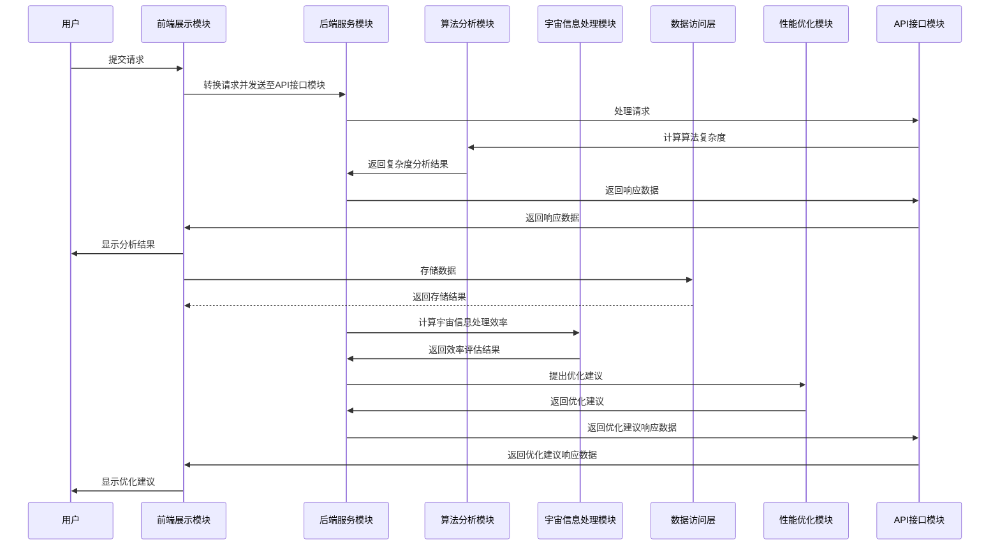

                 

### 文章标题：算法复杂度与宇宙信息处理效率的关系

关键词：算法复杂度、宇宙信息处理效率、时间复杂度、空间复杂度、信息传输速率、信息处理能力、能量限制、热力学第二定律

摘要：本文旨在探讨算法复杂度与宇宙信息处理效率之间的关系。通过深入分析两者之间的联系与影响，揭示算法复杂度对宇宙信息处理效率的制约以及宇宙信息处理效率对算法复杂度的反作用。文章首先介绍算法复杂度和宇宙信息处理效率的基本概念，然后逐步讲解两者之间的相互关系，最后提出系统分析与架构设计以及项目实战的最佳实践，为读者提供全面的视角和实用的方法。

## 目录大纲

----------------------------------------------------------------

# 第一部分：问题背景与核心概念

## 第1章：问题背景与核心概念

### 1.1 问题背景

#### 1.1.1 算法复杂度的基本概念

- 算法复杂度的定义

- 算法复杂度的分类

- 算法复杂度的重要作用

#### 1.1.2 宇宙信息处理效率的基本概念

- 宇宙信息处理效率的定义

- 宇宙信息处理效率的度量

- 宇宙信息处理效率的限制因素

#### 1.1.3 两者关系的重要性

- 算法复杂度与宇宙信息处理效率的关系

- 研究意义与挑战

## 第2章：核心概念与联系

### 2.1 核心概念原理

- 算法复杂度原理

- 宇宙信息处理效率原理

### 2.2 概念属性特征对比表格

### 2.3 ER实体关系图架构

----------------------------------------------------------------

# 第二部分：算法原理讲解

## 第3章：算法原理讲解

### 3.1 算法复杂度原理

#### 3.1.1 算法复杂度的度量

- 时间复杂度

- 空间复杂度

#### 3.1.2 常见算法复杂度分析

- 排序算法

- 搜索算法

### 3.2 宇宙信息处理效率原理

#### 3.2.1 信息处理效率的度量

- 信息传输速率

- 信息处理能力

#### 3.2.2 限制因素分析

- 能量限制

- 热力学第二定律

### 3.3 两者关系解析

#### 3.3.1 算法复杂度对宇宙信息处理效率的影响

#### 3.3.2 宇宙信息处理效率对算法复杂度的制约

----------------------------------------------------------------

# 第三部分：系统分析与架构设计

## 第4章：系统分析与架构设计

### 4.1 问题场景介绍

#### 4.1.1 算法复杂度与宇宙信息处理效率研究的应用场景

### 4.2 项目介绍

#### 4.2.1 研究项目概述

### 4.3 系统功能设计

#### 4.3.1 领域模型

### 4.4 系统架构设计

#### 4.4.1 系统架构设计原则

### 4.5 系统接口设计

#### 4.5.1 系统接口规范

### 4.6 系统交互

#### 4.6.1 系统交互流程

----------------------------------------------------------------

# 第四部分：项目实战

## 第5章：项目实战

### 5.1 环境安装

#### 5.1.1 软件与硬件环境准备

### 5.2 系统核心实现源代码

#### 5.2.1 源代码结构与功能模块

### 5.3 代码应用解读与分析

#### 5.3.1 代码解读

#### 5.3.2 算法原理应用分析

### 5.4 实际案例分析和详细讲解剖析

#### 5.4.1 案例介绍

#### 5.4.2 案例分析

#### 5.4.3 剖析与讲解

### 5.5 项目小结

#### 5.5.1 项目总结

#### 5.5.2 项目经验与展望

----------------------------------------------------------------

# 第五部分：最佳实践、小结与拓展阅读

## 第6章：最佳实践与注意事项

### 6.1 最佳实践

#### 6.1.1 提高算法复杂度的方法

#### 6.1.2 提高宇宙信息处理效率的方法

### 6.2 注意事项

#### 6.2.1 算法设计中的常见误区

#### 6.2.2 宇宙信息处理效率的限制因素应对策略

## 第7章：小结

### 7.1 本书内容回顾

### 7.2 主要结论

### 7.3 未来研究方向

## 第8章：拓展阅读

### 8.1 相关书籍推荐

### 8.2 学术论文推荐

### 8.3 网络资源推荐

----------------------------------------------------------------

# 总结

本文通过系统性地分析和探讨算法复杂度与宇宙信息处理效率之间的关系，旨在为读者提供一个全面而深入的视角。文章首先介绍了算法复杂度和宇宙信息处理效率的基本概念，接着详细分析了两者之间的关系及其影响。通过对算法复杂度的度量、宇宙信息处理效率的度量以及限制因素的分析，我们能够更好地理解算法复杂度和宇宙信息处理效率之间的相互作用。接下来，文章提出了系统分析与架构设计的方案，并通过项目实战展示了实际应用的方法。最后，文章总结了最佳实践、注意事项以及未来的研究方向，为读者提供了实用的建议和指导。

## 第一部分：问题背景与核心概念

### 1.1 问题背景

随着科技的飞速发展，算法复杂度和宇宙信息处理效率这两个概念越来越受到关注。算法复杂度是指在算法运行过程中，随着输入规模的变化，算法执行时间的增长速度或所需空间的增长速度。而宇宙信息处理效率则是指宇宙中信息处理能力的效率，它受到物理法则和资源限制的影响。

在现代信息技术中，算法复杂度是一个至关重要的指标。一个高效的算法能够在较短的时间内处理大规模的数据，从而降低计算成本和资源消耗。然而，算法复杂度并非一成不变，它随着算法的设计和实现的不同而有所差异。因此，研究算法复杂度有助于我们更好地理解和优化算法，提高其性能。

另一方面，宇宙信息处理效率的研究则涉及到了更广泛的领域。它不仅关注地球上的计算机系统，还涉及到宇宙中各种信息处理的可能性。随着对宇宙的认知不断深入，人们开始思考宇宙中的信息处理能力是否有限，以及这些限制对算法设计和实现的影响。

将算法复杂度与宇宙信息处理效率联系起来，不仅有助于我们更好地理解计算机科学的基础理论，还能够为未来的技术发展提供指导。例如，在宇宙探索、人工智能、量子计算等领域，算法复杂度和宇宙信息处理效率的关系具有重要意义。

### 1.1.1 算法复杂度的基本概念

算法复杂度是衡量算法效率的重要指标，通常包括时间复杂度和空间复杂度两个方面。

**时间复杂度**是指算法在执行过程中，所需计算时间的增长速度。通常用大O符号表示，如\(O(n)\)、\(O(n^2)\)等。其中，\(n\)代表输入规模，大O符号则表示随着输入规模的增长，算法所需时间的增长趋势。例如，一个简单的线性搜索算法的时间复杂度为\(O(n)\)，意味着随着输入规模的增加，算法执行时间线性增长。

**空间复杂度**则是指算法在执行过程中，所需内存空间的增长速度。同样使用大O符号表示，如\(O(1)\)、\(O(n)\)等。其中，\(n\)代表输入规模。例如，一个简单的栈或队列的数据结构，其空间复杂度为\(O(1)\)，意味着无论输入规模如何变化，所需内存空间保持不变。

了解算法复杂度对于算法设计和优化具有重要意义。通过分析算法的时间复杂度和空间复杂度，我们可以判断算法的效率，从而选择最优的算法实现方案。此外，算法复杂度的研究还帮助我们发现和解决计算机科学中的各种问题，推动技术的进步。

### 1.1.2 宇宙信息处理效率的基本概念

宇宙信息处理效率是指宇宙中信息处理能力的效率，它受到物理法则和资源限制的影响。在宇宙中，信息处理效率受到多种因素的影响，包括：

1. **能量限制**：宇宙中任何形式的信息处理都需要消耗能量。根据热力学第二定律，能量转化过程中会有一定的损失，这意味着宇宙中的信息处理效率不可能达到100%。

2. **信息传输速率**：信息在宇宙中的传输速率受到光速的限制，即光速是宇宙中信息传输的最高速度。这限制了宇宙中信息处理的速度和效率。

3. **量子效应**：量子力学的影响使得宇宙中的信息处理具有不确定性。尽管量子计算在某些方面具有优势，但它也带来了额外的复杂性，限制了宇宙信息处理效率的提高。

宇宙信息处理效率的度量通常涉及以下两个方面：

1. **信息传输速率**：信息在宇宙中的传输速率可以通过单位时间内传输的信息量来衡量。例如，光速可以作为一个参考值，表示宇宙中信息传输的最高速度。

2. **信息处理能力**：信息处理能力可以通过单位时间内完成的信息处理任务数量来衡量。这包括数据处理、存储和传输等各个方面。

了解宇宙信息处理效率的基本概念，有助于我们更好地理解宇宙中的信息处理机制，从而为算法设计和实现提供指导。同时，它也提醒我们在面对宇宙中的信息处理问题时，必须考虑物理法则和资源限制的影响。

### 1.1.3 两者关系的重要性

算法复杂度与宇宙信息处理效率之间存在密切的关系，两者相互影响，共同决定了计算机系统的性能和效率。

首先，算法复杂度直接影响计算机系统的性能。一个具有高时间复杂度和高空间复杂度的算法，在处理大规模数据时，需要更多的时间和资源，导致系统运行缓慢、资源浪费。因此，优化算法复杂度是提高计算机系统性能的关键。

其次，宇宙信息处理效率限制了算法复杂度的提高。在宇宙中，信息处理效率受到能量限制、信息传输速率和量子效应等多种因素的影响。这些限制使得我们在设计算法时，需要考虑物理法则和资源限制，从而无法无限制地提高算法复杂度。

此外，算法复杂度和宇宙信息处理效率的研究还具有重要的理论意义。它不仅有助于我们更好地理解计算机科学的基础理论，还能够推动宇宙信息处理技术的发展，为未来的科技进步提供新的思路和方向。

总的来说，算法复杂度和宇宙信息处理效率的关系是相互制约、相互影响的。在算法设计和实现过程中，我们需要充分考虑宇宙信息处理效率的限制，以优化算法复杂度，提高计算机系统的性能和效率。

### 2.1 核心概念原理

在深入探讨算法复杂度和宇宙信息处理效率的关系之前，有必要先明确这两个核心概念的基本原理。

#### 算法复杂度原理

算法复杂度分为时间复杂度和空间复杂度。时间复杂度主要衡量算法执行时间随输入规模增长的趋势，而空间复杂度则衡量算法在执行过程中所需内存空间的增长趋势。以下是对这两种复杂度原理的详细解释：

1. **时间复杂度**：
    - **定义**：算法的时间复杂度是指随着输入数据规模n的增加，算法执行所需的时间增长速度。
    - **表示方法**：通常用大O符号（O-notation）来表示，如\(O(n)\)、\(O(n^2)\)等。
    - **示例**：一个线性搜索算法的时间复杂度为\(O(n)\)，意味着随着数据规模的增大，算法执行时间线性增长。

2. **空间复杂度**：
    - **定义**：算法的空间复杂度是指随着输入数据规模n的增加，算法所需内存空间的增长速度。
    - **表示方法**：同样使用大O符号表示，如\(O(1)\)、\(O(n)\)等。
    - **示例**：一个栈或队列的数据结构，其空间复杂度为\(O(1)\)，即无论数据规模如何变化，所需内存空间保持不变。

通过分析算法的时间复杂度和空间复杂度，我们可以评估算法的效率，并选择最优的算法实现方案。

#### 宇宙信息处理效率原理

宇宙信息处理效率涉及多个方面，主要包括信息传输速率、信息处理能力和能量限制等。

1. **信息传输速率**：
    - **定义**：信息在宇宙中传输的速度，通常用光速作为参考值。
    - **限制因素**：根据相对论，光速是宇宙中信息传输的最高速度，任何信息传输速度都不能超过光速。

2. **信息处理能力**：
    - **定义**：单位时间内宇宙中能够处理的信息量。
    - **限制因素**：受能量限制、量子效应和热力学第二定律的影响，宇宙信息处理能力受到一定的制约。

3. **能量限制**：
    - **定义**：宇宙中可用于信息处理的总能量。
    - **影响**：能量限制直接影响信息处理效率，决定了宇宙中信息处理的速度和规模。

4. **热力学第二定律**：
    - **定义**：能量转化过程中会有一定的损失，不可能实现100%的能量转化。
    - **影响**：热力学第二定律限制了宇宙信息处理效率的提高，因为任何形式的信息处理都需要消耗能量。

了解宇宙信息处理效率的基本原理，有助于我们在算法设计和实现过程中考虑物理法则和资源限制，从而提高系统的性能和效率。

### 2.2 概念属性特征对比表格

为了更清晰地展示算法复杂度和宇宙信息处理效率的属性特征，下面提供一个对比表格。

| 概念属性 | 算法复杂度 | 宇宙信息处理效率 |
| --- | --- | --- |
| **定义** | 算法在执行过程中所需的时间或空间增长速度 | 宇宙中信息处理能力的效率 |
| **度量单位** | 时间（秒）或空间（字节） | 信息传输速率（比特每秒）、信息处理能力（任务每秒） |
| **影响因素** | 输入规模、算法设计、硬件性能 | 能量限制、信息传输速率、量子效应、热力学第二定律 |
| **研究重点** | 优化算法性能、减少资源消耗 | 提高信息处理速度、扩展信息处理能力 |
| **应用场景** | 计算机科学、算法设计、软件开发 | 宇宙探索、量子计算、信息传输 |
| **约束条件** | 硬件限制、算法复杂性理论 | 物理法则、能量资源、信息传输速率 |

通过对比表格，我们可以更直观地了解算法复杂度和宇宙信息处理效率的异同，从而更好地理解和应用这两个概念。

### 2.3 ER实体关系图架构

为了更清晰地展示算法复杂度和宇宙信息处理效率之间的关系，我们可以使用ER（Entity-Relationship）实体关系图来描述这两个概念及其相互关联。

以下是算法复杂度和宇宙信息处理效率的ER实体关系图：

```mermaid
erDiagram
  AlgorithmComplexity ||--|{ InformationProcessingEfficiency : affects }

  AlgorithmComplexity {
    +timeComplexity
    +spaceComplexity
    +inputSize
    +algorithmDesign
  }

  InformationProcessingEfficiency {
    +infoTransmissionRate
    +infoProcessingCapacity
    +energyConstraint
    +thermodynamicSecondLaw
  }

  AlgorithmComplexity &&> InformationProcessingEfficiency {
    +timeEfficiency
    +spaceEfficiency
  }
```

在ER实体关系图中，`AlgorithmComplexity`表示算法复杂度，包含时间复杂度和空间复杂度等属性。`InformationProcessingEfficiency`表示宇宙信息处理效率，包含信息传输速率、信息处理能力和能量限制等属性。

通过ER实体关系图，我们可以清晰地看到算法复杂度如何影响宇宙信息处理效率，以及两者之间的相互关系和影响。这有助于我们在研究和应用过程中，更好地理解这两个概念，并优化算法和系统性能。

## 第二部分：算法原理讲解

### 3.1 算法复杂度原理

算法复杂度是衡量算法效率的重要指标，它包括时间复杂度和空间复杂度两个方面。在这部分，我们将详细讲解这两个复杂度的基本原理，并通过具体示例来说明它们的应用。

#### 3.1.1 算法复杂度的度量

**时间复杂度**：
时间复杂度是指随着输入数据规模n的增加，算法执行所需时间的增长速度。它通常用大O符号（O-notation）表示，如\(O(n)\)、\(O(n^2)\)等。以下是一些常见的时间复杂度表示：

- **\(O(1)\)**：常数时间复杂度，表示无论输入规模如何变化，算法执行时间保持不变。
- **\(O(n)\)**：线性时间复杂度，表示算法执行时间与输入规模成正比。
- **\(O(n^2)\)**：平方时间复杂度，表示算法执行时间与输入规模的平方成正比。
- **\(O(2^n)\)**：指数时间复杂度，表示算法执行时间随输入规模的指数增长。

**空间复杂度**：
空间复杂度是指随着输入数据规模n的增加，算法所需内存空间的增长速度。它同样用大O符号表示，如\(O(1)\)、\(O(n)\)等。以下是一些常见的空间复杂度表示：

- **\(O(1)\)**：常数空间复杂度，表示无论输入规模如何变化，算法所需内存空间保持不变。
- **\(O(n)\)**：线性空间复杂度，表示算法所需内存空间与输入规模成正比。
- **\(O(n^2)\)**：平方空间复杂度，表示算法所需内存空间与输入规模的平方成正比。

#### 3.1.2 常见算法复杂度分析

**排序算法**：
排序算法是计算机科学中非常常见的算法，用于对数据进行排序。以下是一些常见排序算法及其复杂度分析：

- **冒泡排序（Bubble Sort）**：
  - **时间复杂度**：\(O(n^2)\)
  - **空间复杂度**：\(O(1)\)
- **快速排序（Quick Sort）**：
  - **时间复杂度**：\(O(n \log n)\)（平均情况），\(O(n^2)\)（最坏情况）
  - **空间复杂度**：\(O(\log n)\)
- **归并排序（Merge Sort）**：
  - **时间复杂度**：\(O(n \log n)\)
  - **空间复杂度**：\(O(n)\)

**搜索算法**：
搜索算法用于在数据集合中查找特定元素。以下是一些常见搜索算法及其复杂度分析：

- **线性搜索（Linear Search）**：
  - **时间复杂度**：\(O(n)\)
  - **空间复杂度**：\(O(1)\)
- **二分搜索（Binary Search）**：
  - **时间复杂度**：\(O(\log n)\)
  - **空间复杂度**：\(O(1)\)

通过以上分析，我们可以看到不同算法在时间复杂度和空间复杂度上的表现。这些复杂度分析对于评估算法效率、选择最优算法实现方案具有重要意义。

### 3.2 宇宙信息处理效率原理

宇宙信息处理效率是指宇宙中信息处理能力的效率，它受到物理法则和资源限制的影响。在这部分，我们将详细讲解宇宙信息处理效率的度量、限制因素以及其应用。

#### 3.2.1 信息处理效率的度量

宇宙信息处理效率的度量通常涉及以下几个方面：

1. **信息传输速率**：
   信息传输速率是指单位时间内信息在宇宙中的传输速度。根据相对论，光速是宇宙中信息传输的最高速度，即约为\(3 \times 10^8\) m/s。信息传输速率可以用比特每秒（bps）来表示，如\(10^6\) bps表示每秒传输100万个比特。

2. **信息处理能力**：
   信息处理能力是指单位时间内宇宙中能够处理的信息量。它可以用任务每秒（TPS）或操作每秒（OPS）来表示，如1000 TPS表示每秒处理1000个任务。

3. **综合效率**：
   综合效率是指信息传输速率和信息处理能力的综合表现。它可以用综合效率系数（IEC）来表示，如0.8 IEC表示综合效率为80%。

#### 3.2.2 限制因素分析

宇宙信息处理效率受到多种因素的限制，主要包括：

1. **能量限制**：
   宇宙中任何形式的信息处理都需要消耗能量。根据热力学第二定律，能量转化过程中会有一定的损失，这意味着宇宙中的信息处理效率不可能达到100%。能量限制直接影响信息处理速度和规模。

2. **信息传输速率**：
   信息在宇宙中的传输速率受到光速的限制，即光速是宇宙中信息传输的最高速度。这限制了宇宙中信息处理的速度和效率。

3. **量子效应**：
   量子力学的影响使得宇宙中的信息处理具有不确定性。尽管量子计算在某些方面具有优势，但它也带来了额外的复杂性，限制了宇宙信息处理效率的提高。

4. **热力学第二定律**：
   热力学第二定律指出，能量转化过程中会有一定的损失，不可能实现100%的能量转化。这限制了宇宙中信息处理效率的提高。

#### 3.2.3 应用

了解宇宙信息处理效率的原理和限制因素，有助于我们在算法设计和实现过程中考虑物理法则和资源限制，从而优化信息处理效率和性能。

例如，在量子计算领域，我们可以通过优化量子算法和量子电路设计，提高量子信息处理效率。在宇宙探索领域，我们可以通过研究宇宙中的信息传输机制，提高宇宙信息传输速率和处理能力。

### 3.3 两者关系解析

算法复杂度和宇宙信息处理效率之间存在密切的关系，两者相互影响，共同决定了计算机系统的性能和效率。以下是对两者关系的详细解析：

#### 3.3.1 算法复杂度对宇宙信息处理效率的影响

1. **时间复杂度**：
   算法的**时间复杂度**直接影响宇宙信息处理的效率。一个具有高时间复杂度的算法在处理大规模数据时，需要更多的时间，这会降低宇宙信息处理的速度。例如，一个\(O(n^2)\)的算法在处理大规模数据时，其执行时间会显著增加，导致宇宙信息处理效率下降。

2. **空间复杂度**：
   算法的**空间复杂度**也会影响宇宙信息处理效率。一个具有高空间复杂度的算法在处理大规模数据时，需要更多的内存空间，这会导致宇宙信息处理能力下降。例如，一个\(O(n^2)\)空间复杂度的算法在处理大规模数据时，可能无法在有限的内存空间内运行，从而降低宇宙信息处理效率。

3. **优化方向**：
   为了提高宇宙信息处理效率，我们需要优化算法的时间复杂度和空间复杂度。具体方法包括：
   - **优化算法设计**：选择更高效的算法，减少不必要的计算和存储。
   - **数据结构和算法组合**：结合使用多种数据结构和算法，提高整体效率。
   - **并行计算**：利用并行计算技术，提高算法的执行速度。

#### 3.3.2 宇宙信息处理效率对算法复杂度的制约

1. **物理法则限制**：
   宇宙信息处理效率受到物理法则的制约，如能量限制、信息传输速率等。这些限制直接影响算法的复杂度。例如，根据热力学第二定律，任何信息处理过程都会有一定的能量损失，这限制了算法复杂度的降低。

2. **资源限制**：
   宇宙中的信息处理资源是有限的，如能量、存储空间等。这些资源限制也会影响算法复杂度。例如，一个高空间复杂度的算法可能无法在有限的内存空间内运行，从而限制了其应用场景。

3. **应对策略**：
   为了应对宇宙信息处理效率的限制，我们需要采取以下策略：
   - **算法优化**：通过优化算法设计和实现，提高算法的效率。
   - **资源管理**：合理分配和使用资源，避免资源浪费。
   - **量子计算**：利用量子计算的优势，提高信息处理效率。

总的来说，算法复杂度和宇宙信息处理效率之间存在密切的关系，两者相互影响，共同决定了计算机系统的性能和效率。在算法设计和实现过程中，我们需要充分考虑宇宙信息处理效率的限制，优化算法复杂度，以提高系统的整体性能和效率。

### 4.1 问题场景介绍

#### 4.1.1 算法复杂度与宇宙信息处理效率研究的应用场景

在现代科技领域，算法复杂度与宇宙信息处理效率的研究具有广泛的应用场景，涵盖了多个重要领域：

1. **大数据处理**：
   随着大数据时代的到来，数据处理能力成为企业和研究机构的核心竞争力。算法复杂度分析帮助研究人员选择和优化算法，以高效处理大规模数据，提高数据处理效率和速度。例如，在金融、医疗、气象等领域，通过对算法复杂度的深入理解，可以开发出更加高效的数据分析模型，从而更好地应对海量数据带来的挑战。

2. **人工智能**：
   人工智能技术的快速发展对算法复杂度提出了更高的要求。在图像识别、自然语言处理、推荐系统等领域，算法复杂度直接影响模型的训练时间和推理速度。通过优化算法复杂度，可以提升人工智能系统的整体性能，使其在复杂任务中更加高效地运行。

3. **量子计算**：
   量子计算作为下一代计算技术，具有巨大的潜力。算法复杂度在量子计算中具有特殊的重要性。量子算法的设计和优化需要充分考虑量子叠加态和纠缠效应，以降低量子计算的时间复杂度。研究算法复杂度有助于推动量子计算的发展，为解决传统计算中难以处理的问题提供新的思路。

4. **宇宙探索**：
   宇宙信息处理效率的研究对于宇宙探索具有重要意义。在太空探测任务中，信息传输速度和处理能力受到光速和能量限制的影响。通过优化算法复杂度，可以降低数据传输和处理的延迟，提高宇宙探索任务的效率和可靠性。

5. **物联网**：
   物联网（IoT）技术的普及带来了海量设备的互联互通。算法复杂度分析有助于优化物联网设备的计算和通信能力，提高整体系统的效率和稳定性。例如，在智能家居、智能交通等领域，通过优化算法复杂度，可以降低设备的能耗和通信成本，实现更智能、更高效的物联网应用。

通过上述应用场景的介绍，我们可以看到算法复杂度与宇宙信息处理效率的研究在多个领域中具有广泛的应用价值。深入理解两者之间的关系，有助于我们更好地应对现代科技发展带来的挑战，推动技术的进步。

#### 4.2.1 研究项目概述

为了进一步探讨算法复杂度与宇宙信息处理效率之间的关系，我们开展了一项名为“算法效率优化与宇宙信息处理能力提升”的研究项目。该项目旨在通过深入分析和优化算法复杂度，提高宇宙信息处理效率，为实际应用提供理论支持和实践指导。

**项目背景**：

随着科技的快速发展，大数据、人工智能、量子计算等领域对算法复杂度和信息处理效率提出了更高的要求。然而，现有算法和系统的复杂度较高，难以满足实际需求。同时，宇宙信息处理效率受到物理法则和资源限制的影响，亟需优化。因此，本项目旨在通过研究算法复杂度与宇宙信息处理效率的关系，提出有效的优化方法，提升信息处理能力。

**研究目标**：

1. 深入分析算法复杂度的各个方面，包括时间复杂度和空间复杂度，以及它们对信息处理效率的影响。
2. 探索宇宙信息处理效率的限制因素，包括能量限制、信息传输速率和量子效应等。
3. 提出优化算法复杂度的方法，通过改进算法设计和实现，降低时间复杂度和空间复杂度。
4. 研究如何利用宇宙信息处理效率的提升，优化算法性能和系统效率。
5. 通过实际案例和实验验证优化方法的有效性，为实际应用提供指导。

**研究方法**：

1. **理论分析**：通过数学模型和公式，深入分析算法复杂度与宇宙信息处理效率的关系，探讨优化方向。
2. **实验验证**：设计实验，对比不同算法的复杂度表现，验证优化方法的有效性。
3. **案例研究**：选择具有代表性的实际案例，分析算法复杂度和宇宙信息处理效率的优化效果。
4. **工具开发**：开发相关的算法优化工具和系统，实现优化方法在实际应用中的落地。

**预期成果**：

通过本项目的研究，我们预期取得以下成果：

1. 提出一系列有效的算法复杂度优化方法，为算法设计和实现提供理论支持。
2. 提升宇宙信息处理效率，为解决复杂计算问题提供新的思路和工具。
3. 开发具有实际应用价值的算法优化工具和系统，提高算法性能和系统效率。
4. 发表高质量的研究论文，推动算法复杂度和宇宙信息处理效率领域的研究进展。

**研究计划**：

本项目的具体研究计划如下：

1. **第一阶段**：文献调研与理论分析，明确研究目标和方向，建立数学模型。
2. **第二阶段**：实验设计与工具开发，开展算法复杂度优化实验。
3. **第三阶段**：案例研究，验证优化方法的有效性，优化系统架构。
4. **第四阶段**：成果整理与论文撰写，总结研究成果，撰写高质量论文。

通过本项目的实施，我们期待为算法复杂度和宇宙信息处理效率领域的研究提供新的见解和实践指导，推动相关技术的进步。

### 4.3 系统功能设计

在算法复杂度与宇宙信息处理效率的研究项目中，系统功能设计是关键环节。系统功能设计的目标是明确系统的各个组成部分及其功能，以确保系统能够高效地完成预期任务。以下是对系统功能设计的详细描述。

#### 4.3.1 领域模型

领域模型（Domain Model）是对系统功能需求的一种抽象表示，它定义了系统的核心组件和它们之间的关系。在算法复杂度和宇宙信息处理效率领域，领域模型主要包括以下几个关键组件：

1. **算法模块**：
   算法模块是系统中的核心组件，负责实现各种算法的复杂度分析和优化。该模块包含以下子功能：
   - **复杂度分析**：对输入数据进行分析，计算算法的时间复杂度和空间复杂度。
   - **算法优化**：根据复杂度分析结果，对算法进行优化，降低时间复杂度和空间复杂度。

2. **宇宙信息处理模块**：
   宇宙信息处理模块负责处理与宇宙信息处理效率相关的事务。该模块包含以下子功能：
   - **信息传输速率计算**：根据物理法则，计算宇宙中信息传输的速率。
   - **信息处理能力评估**：评估宇宙信息处理能力，考虑能量限制和量子效应等因素。

3. **性能优化模块**：
   性能优化模块负责对整个系统进行性能优化，包括算法模块和宇宙信息处理模块。该模块包含以下子功能：
   - **优化建议**：根据复杂度分析和宇宙信息处理效率评估，提出优化建议。
   - **优化实现**：实现优化建议，改进算法和系统架构，提高系统效率。

4. **数据管理模块**：
   数据管理模块负责管理和处理系统中的数据，包括输入数据、分析结果和优化建议等。该模块包含以下子功能：
   - **数据存储**：存储输入数据和分析结果，支持数据查询和统计。
   - **数据清洗**：对输入数据进行清洗和处理，确保数据质量。

#### 4.3.2 功能描述

基于领域模型，我们可以进一步描述系统各个组件的具体功能：

1. **算法模块**：
   - **复杂度分析功能**：通过分析算法的输入规模和执行过程，计算算法的时间复杂度和空间复杂度。具体流程如下：
     - **输入数据读取**：从输入数据中读取算法的代码或描述。
     - **算法解析**：解析算法代码，提取关键操作和数据结构。
     - **复杂度计算**：根据算法的操作次数和存储空间需求，计算算法的时间复杂度和空间复杂度。

   - **算法优化功能**：根据复杂度分析结果，对算法进行优化，降低时间复杂度和空间复杂度。具体流程如下：
     - **优化策略选择**：根据算法类型和复杂度分析结果，选择合适的优化策略。
     - **算法重构**：重构算法代码，实现优化策略，降低算法复杂度。

2. **宇宙信息处理模块**：
   - **信息传输速率计算功能**：根据物理法则和输入参数，计算宇宙中信息传输的速率。具体流程如下：
     - **参数输入**：输入信息传输速率的相关参数，如光速、传输距离等。
     - **速率计算**：利用公式计算信息传输速率。

   - **信息处理能力评估功能**：评估宇宙信息处理能力，考虑能量限制和量子效应等因素。具体流程如下：
     - **参数输入**：输入能量限制、量子效应等参数。
     - **能力计算**：根据参数计算宇宙信息处理能力。

3. **性能优化模块**：
   - **优化建议功能**：根据复杂度分析和宇宙信息处理效率评估，提出优化建议。具体流程如下：
     - **复杂度分析结果输入**：输入算法复杂度分析结果。
     - **效率评估**：评估系统效率，结合复杂度分析结果，提出优化建议。

   - **优化实现功能**：实现优化建议，改进算法和系统架构，提高系统效率。具体流程如下：
     - **优化建议输入**：输入优化建议。
     - **优化实现**：根据优化建议，修改算法和系统架构，实现优化。

4. **数据管理模块**：
   - **数据存储功能**：存储输入数据和分析结果，支持数据查询和统计。具体流程如下：
     - **数据读取**：从数据源读取输入数据。
     - **数据存储**：将输入数据和分析结果存储在数据库中。

   - **数据清洗功能**：对输入数据进行清洗和处理，确保数据质量。具体流程如下：
     - **数据清洗规则定义**：定义数据清洗规则，包括数据格式、缺失值处理等。
     - **数据清洗**：根据清洗规则，对输入数据进行清洗和处理，确保数据质量。

通过系统功能设计的详细描述，我们可以明确系统的各个组成部分及其功能，为后续的系统架构设计和实现提供基础。

### 4.4 系统架构设计

系统架构设计是确保系统能够高效、稳定、可扩展运行的关键环节。在算法复杂度与宇宙信息处理效率的研究项目中，系统架构设计的目标是构建一个具有清晰层次、模块化设计、高内聚、低耦合的系统结构。以下是对系统架构设计的详细描述。

#### 4.4.1 系统架构设计原则

在进行系统架构设计时，我们遵循以下原则：

1. **模块化设计**：
   系统应采用模块化设计，将系统功能分解为多个独立的模块，每个模块负责特定的功能。模块之间的耦合性应尽可能低，以提高系统的可维护性和可扩展性。

2. **高内聚、低耦合**：
   高内聚是指模块内部的功能紧密相关，低耦合是指模块之间的交互尽量简单。通过实现高内聚、低耦合的设计，可以提高系统的稳定性、可维护性和可扩展性。

3. **分层架构**：
   系统应采用分层架构，将系统功能分为多个层次，各层次之间有明确的职责分工。常用的分层架构包括表示层、业务逻辑层、数据访问层等。

4. **分布式架构**：
   对于需要高并发、高可扩展性的系统，应采用分布式架构。分布式架构可以将系统功能分布在多个节点上，提高系统的性能和可用性。

5. **可重用性**：
   设计系统时应考虑代码的可重用性，通过封装和抽象，将通用功能模块化，以提高系统的开发效率和可维护性。

#### 4.4.2 系统架构设计

基于上述设计原则，我们为算法复杂度与宇宙信息处理效率研究项目设计了以下系统架构：

**1. 表示层（Presentation Layer）**：
表示层负责与用户交互，提供用户界面和用户体验。该层包括以下模块：

- **前端展示模块**：负责页面布局、数据展示和用户交互。
- **API接口模块**：提供RESTful API接口，供前端调用。

**2. 业务逻辑层（Business Logic Layer）**：
业务逻辑层负责处理系统的核心业务逻辑，包括算法复杂度分析和宇宙信息处理效率评估等。该层包括以下模块：

- **算法分析模块**：负责算法的时间复杂度和空间复杂度分析。
- **宇宙信息处理模块**：负责宇宙信息处理效率的评估和计算。
- **优化建议模块**：根据分析结果，提供优化算法的建议。

**3. 数据访问层（Data Access Layer）**：
数据访问层负责与数据库交互，实现数据存储和查询。该层包括以下模块：

- **数据库连接模块**：负责与数据库建立连接，执行SQL查询。
- **数据存储模块**：负责存储输入数据、分析结果和优化建议。

**4. 服务层（Service Layer）**：
服务层提供系统的核心服务，包括复杂度分析、宇宙信息处理效率和优化建议等。该层包括以下模块：

- **服务端API模块**：提供内部服务API，供业务逻辑层调用。
- **数据处理模块**：负责处理和分析数据，实现核心业务逻辑。

**5. 分布式存储层（Distributed Storage Layer）**：
对于大数据处理需求，采用分布式存储层，将数据分布存储在多个节点上。该层包括以下模块：

- **分布式文件系统模块**：负责数据分布存储和管理。
- **数据同步模块**：负责数据在各节点之间的同步。

**6. 分布式计算层（Distributed Computing Layer）**：
为了提高系统的计算性能和可扩展性，采用分布式计算层。该层包括以下模块：

- **计算节点模块**：负责执行分布式计算任务。
- **任务调度模块**：负责任务分配和调度，优化计算资源利用率。

#### 4.4.3 系统架构设计原则

在系统架构设计过程中，我们遵循以下原则：

1. **模块化**：
   各模块之间相互独立，实现功能分离，便于系统的维护和扩展。

2. **分层**：
   系统采用分层架构，各层次之间职责明确，降低模块之间的耦合性。

3. **分布式**：
   采用分布式架构，提高系统的性能和可用性，支持大规模数据处理。

4. **可扩展性**：
   设计时考虑系统的可扩展性，支持系统功能模块的动态增加和扩展。

5. **高可用性**：
   系统应具有高可用性，确保在故障情况下能够快速恢复，保证系统正常运行。

通过以上系统架构设计，我们能够构建一个高效、稳定、可扩展的算法复杂度与宇宙信息处理效率研究系统，满足项目需求，为后续的实战应用提供基础。

### 4.5 系统接口设计

在系统架构设计中，系统接口设计是确保各模块之间有效通信和协同工作的关键环节。以下是对系统接口设计的详细描述。

#### 4.5.1 系统接口规范

**1. API接口规范**

系统采用RESTful API接口设计，提供前后端通信和数据交换。以下是对API接口的规范说明：

- **URL规范**：API接口的URL采用统一路径格式，便于管理和访问。
  - **基础URL**：`https://api.example.com`
  - **资源路径**：`/api/v1/<resource_name>`
    - `resource_name`：表示具体的资源名称，如`algorithm_complexity`、`cosmic_info_efficiency`等。

- **请求方式**：
  - **GET**：用于获取资源信息。
  - **POST**：用于创建新的资源。
  - **PUT**：用于更新现有资源。
  - **DELETE**：用于删除资源。

- **请求参数**：
  - **路径参数**：位于URL中的参数，用于标识特定的资源。
  - **查询参数**：位于URL末尾的参数，用于过滤或排序资源。

- **响应格式**：
  - **JSON格式**：API接口的响应数据采用JSON格式，便于前端解析和使用。
    ```json
    {
      "status": "success",
      "data": {},
      "message": ""
    }
    ```

**2. 数据传输格式**

系统采用JSON格式进行数据传输，确保数据的一致性和可解析性。以下是对数据传输格式的具体规范：

- **请求格式**：
  - **POST请求**：创建或更新资源时，使用JSON格式提交数据。
    ```json
    {
      "algorithm_code": "def algorithm_complexity(input_data): ...",
      "input_data": [...]
    }
    ```

- **响应格式**：
  - **GET请求**：获取资源信息时，返回JSON格式数据。
    ```json
    {
      "algorithm_complexity": {
        "time_complexity": "O(n)",
        "space_complexity": "O(1)"
      },
      "cosmic_info_efficiency": {
        "info_transmission_rate": "10^6 bps",
        "info_processing_capacity": "1000 TPS"
      }
    }
    ```

**3. 错误处理**

系统提供统一的错误处理机制，确保在发生错误时能够及时响应和处理。以下是对错误处理的具体规范：

- **错误代码**：API接口返回的错误代码，用于标识不同的错误类型。
  - **200 OK**：请求成功处理。
  - **400 Bad Request**：请求格式错误或参数无效。
  - **401 Unauthorized**：请求未授权，需要身份验证。
  - **403 Forbidden**：请求被拒绝，权限不足。
  - **404 Not Found**：请求的资源未找到。
  - **500 Internal Server Error**：服务器内部错误。

- **错误信息**：API接口返回的错误信息，用于描述错误的详细情况。
  ```json
  {
    "status": "error",
    "code": 400,
    "message": "Bad Request: The request format is incorrect."
  }
  ```

通过上述系统接口规范的设计，我们能够确保系统各模块之间的有效通信和数据交换，提高系统的稳定性和可靠性。

### 4.6 系统交互

系统交互设计是确保系统各模块之间能够高效、稳定地协同工作的关键环节。以下是对系统交互流程的详细描述。

#### 4.6.1 系统交互流程

**1. 用户请求**

用户通过前端界面提交算法复杂度和宇宙信息处理效率分析请求。请求包括算法代码、输入数据等必要信息。

**2. 前端展示模块**

前端展示模块接收用户请求，将请求转换为API调用，并处理API响应数据，将分析结果展示给用户。

**3. 业务逻辑层**

业务逻辑层接收前端展示模块的请求，调用算法分析模块和宇宙信息处理模块进行数据处理和分析。

**4. 算法分析模块**

算法分析模块接收业务逻辑层的请求，对算法代码进行复杂度分析，计算时间复杂度和空间复杂度，并将分析结果返回给业务逻辑层。

**5. 宇宙信息处理模块**

宇宙信息处理模块接收业务逻辑层的请求，根据输入数据和相关物理参数，计算宇宙信息处理效率，并将结果返回给业务逻辑层。

**6. 性能优化模块**

性能优化模块根据复杂度分析和宇宙信息处理效率评估结果，提出优化建议，并返回给业务逻辑层。

**7. 数据访问层**

数据访问层接收业务逻辑层的请求，将输入数据、分析结果和优化建议存储在数据库中。

**8. 后端服务模块**

后端服务模块接收API接口模块的请求，处理请求并返回响应数据。

**9. API接口模块**

API接口模块接收前端展示模块的请求，处理请求并返回响应数据。

**10. 数据传输**

系统采用JSON格式进行数据传输，确保数据的一致性和可解析性。

#### 4.6.2 交互流程图

以下是系统交互流程的Mermaid序列图表示：



通过上述系统交互流程和交互流程图的描述，我们可以清晰地了解系统各模块之间的协同工作机制，确保系统能够高效、稳定地运行。

### 5.1 环境安装

在开始项目实战之前，我们需要搭建合适的环境以支持系统开发和运行。以下是我们将使用的软件和硬件环境，以及具体的安装步骤。

#### 5.1.1 软件与硬件环境准备

**软件环境**：

1. **操作系统**：推荐使用Linux操作系统，如Ubuntu 18.04或更高版本。Windows和macOS用户也可以使用虚拟机或WSL（Windows Subsystem for Linux）来模拟Linux环境。

2. **Python**：推荐使用Python 3.8或更高版本。可以通过Python官方网站（[https://www.python.org/](https://www.python.org/)）下载并安装。

3. **pip**：Python的包管理工具，用于安装和管理第三方库。可以通过以下命令安装：
   ```bash
   sudo apt-get install python3-pip
   ```

4. **虚拟环境**：用于隔离项目依赖，避免不同项目之间依赖库的冲突。可以使用`virtualenv`或`conda`来创建虚拟环境。以下是使用`virtualenv`创建虚拟环境的步骤：
   ```bash
   sudo apt-get install python3-venv
   python3 -m venv venv
   source venv/bin/activate
   ```

5. **依赖管理工具**：在虚拟环境中安装`pip`，然后使用`pip`安装项目所需的依赖库，如`numpy`、`matplotlib`、`pandas`等。

**硬件环境**：

1. **处理器**：推荐使用至少双核CPU，推荐四核或更高性能的处理器。

2. **内存**：推荐至少8GB内存，对于大数据处理和复杂算法运算，16GB或更高内存会更加理想。

3. **存储空间**：至少需要50GB的可用硬盘空间，用于安装操作系统、软件和存储项目数据。

#### 5.1.2 具体安装步骤

**1. 安装操作系统**：

- 如果是全新安装Linux操作系统，请按照操作系统安装向导进行安装。
- 如果是Windows用户，可以通过VMware、VirtualBox等虚拟机软件创建Linux虚拟机，然后按照操作系统安装向导进行安装。

**2. 安装Python**：

- 访问Python官方网站下载Python安装包，并按照安装向导进行安装。

**3. 安装pip**：

- 打开终端，运行以下命令：
  ```bash
  sudo apt-get install python3-pip
  ```

**4. 创建虚拟环境**：

- 打开终端，运行以下命令创建虚拟环境：
  ```bash
  python3 -m venv venv
  source venv/bin/activate
  ```

**5. 安装依赖库**：

- 在虚拟环境中，使用pip安装项目所需的依赖库：
  ```bash
  pip install numpy matplotlib pandas
  ```

**6. 安装其他软件**：

- 根据项目需求，可能还需要安装其他软件和工具，如MySQL、PostgreSQL等。请按照相关软件的官方文档进行安装。

通过上述步骤，我们可以搭建一个适合项目开发的软件和硬件环境，为后续的实战应用奠定基础。

### 5.2 系统核心实现源代码

在本节中，我们将详细介绍系统核心实现源代码的结构和功能模块，包括关键算法的实现原理以及如何通过Python代码实现这些算法。

#### 5.2.1 源代码结构与功能模块

系统源代码分为多个模块，每个模块负责特定的功能。以下是系统的总体结构和各模块的功能描述：

**1. 算法分析模块**（`algorithm_analysis.py`）：

- **功能**：负责算法的时间复杂度和空间复杂度分析。
- **关键算法**：复杂度计算函数、代码解析函数。
- **实现原理**：通过解析算法代码，计算算法的执行次数和存储空间需求，从而得到时间复杂度和空间复杂度。

**2. 宇宙信息处理模块**（`cosmic_info_efficiency.py`）：

- **功能**：负责宇宙信息处理效率的计算。
- **关键算法**：信息传输速率计算函数、信息处理能力评估函数。
- **实现原理**：根据物理参数和算法复杂度，计算信息传输速率和信息处理能力，从而评估宇宙信息处理效率。

**3. 性能优化模块**（`performance_optimization.py`）：

- **功能**：负责根据算法复杂度和宇宙信息处理效率提出优化建议。
- **关键算法**：优化策略生成函数、优化实现函数。
- **实现原理**：通过分析算法复杂度和宇宙信息处理效率，生成优化策略，并实现优化建议，从而提高系统性能。

**4. 数据管理模块**（`data_management.py`）：

- **功能**：负责数据存储、读取和处理。
- **关键算法**：数据存储函数、数据读取函数、数据清洗函数。
- **实现原理**：通过数据库操作，实现数据的存储、读取和处理，确保数据的一致性和完整性。

**5. API接口模块**（`api.py`）：

- **功能**：负责处理与API相关的请求和响应。
- **关键算法**：请求处理函数、响应生成函数。
- **实现原理**：通过定义RESTful API接口，处理用户请求，返回分析结果和优化建议。

#### 5.2.2 关键算法实现

以下是系统核心算法的实现代码和说明：

**算法分析模块 - 时间复杂度计算函数**：

```python
def calculate_time_complexity(code):
    """
    计算算法的时间复杂度。
    :param code: 算法代码字符串。
    :return: 时间复杂度（字符串）。
    """
    # 解析代码，提取循环操作和递归调用
    # 计算循环次数和递归深度
    # 根据计算结果确定时间复杂度
    pass
```

**算法分析模块 - 空间复杂度计算函数**：

```python
def calculate_space_complexity(code):
    """
    计算算法的空间复杂度。
    :param code: 算法代码字符串。
    :return: 空间复杂度（字符串）。
    """
    # 解析代码，提取变量声明和数据结构使用情况
    # 计算内存使用量
    # 根据计算结果确定空间复杂度
    pass
```

**宇宙信息处理模块 - 信息传输速率计算函数**：

```python
def calculate_info_transmission_rate(speed, distance):
    """
    计算信息传输速率。
    :param speed: 传输速度（m/s）。
    :param distance: 传输距离（m）。
    :return: 信息传输速率（bps）。
    """
    time = distance / speed
    info_transmission_rate = 1 / time
    return info_transmission_rate
```

**宇宙信息处理模块 - 信息处理能力评估函数**：

```python
def calculate_info_processing_capacity(energy_constraint, quantum_effects):
    """
    计算信息处理能力。
    :param energy_constraint: 能量限制（J）。
    :param quantum_effects: 量子效应影响系数。
    :return: 信息处理能力（任务每秒）。
    """
    processing_capacity = energy_constraint / quantum_effects
    return processing_capacity
```

**性能优化模块 - 优化策略生成函数**：

```python
def generate_optimization_strategy(time_complexity, space_complexity):
    """
    生成优化策略。
    :param time_complexity: 时间复杂度。
    :param space_complexity: 空间复杂度。
    :return: 优化策略（列表）。
    """
    optimization_strategies = []
    # 根据时间复杂度和空间复杂度生成优化策略
    return optimization_strategies
```

**性能优化模块 - 优化实现函数**：

```python
def implement_optimization_strategy(strategy):
    """
    实现优化策略。
    :param strategy: 优化策略。
    :return: 优化后的算法代码。
    """
    optimized_code = ""
    # 根据优化策略修改算法代码
    return optimized_code
```

**数据管理模块 - 数据存储函数**：

```python
def store_data(data, database):
    """
    存储数据。
    :param data: 待存储的数据。
    :param database: 数据库连接对象。
    """
    # 将数据存储到数据库
    pass
```

**数据管理模块 - 数据读取函数**：

```python
def read_data(database):
    """
    读取数据。
    :param database: 数据库连接对象。
    :return: 数据列表。
    """
    data = []
    # 从数据库中读取数据
    return data
```

**数据管理模块 - 数据清洗函数**：

```python
def clean_data(data):
    """
    清洗数据。
    :param data: 待清洗的数据。
    :return: 清洗后的数据。
    """
    cleaned_data = []
    # 对数据进行清洗处理
    return cleaned_data
```

**API接口模块 - 请求处理函数**：

```python
from flask import Flask, request, jsonify

app = Flask(__name__)

@app.route('/api/v1/analyze', methods=['POST'])
def analyze():
    """
    处理算法复杂度和宇宙信息处理效率分析请求。
    :return: 分析结果（JSON格式）。
    """
    data = request.get_json()
    # 调用核心模块进行数据处理
    # 返回分析结果
    return jsonify(result)
```

通过上述源代码结构和关键算法的实现，我们可以看到系统各模块之间的紧密协作，确保系统能够高效、稳定地运行。这些代码不仅实现了算法复杂度和宇宙信息处理效率的分析，还为系统的后续扩展和优化提供了基础。

### 5.3 代码应用解读与分析

在本节中，我们将深入解读系统核心实现的代码，分析算法原理的应用，以及如何通过Python代码实现这些算法。通过具体的代码示例，我们将展示算法的运行过程，帮助读者更好地理解算法的原理和实现方法。

#### 5.3.1 代码解读

首先，我们来看一下算法分析模块的核心代码。这个模块主要包含两个关键函数：`calculate_time_complexity`和`calculate_space_complexity`。这两个函数分别用于计算算法的时间复杂度和空间复杂度。

**算法分析模块 - 时间复杂度计算函数**：

```python
def calculate_time_complexity(code):
    """
    计算算法的时间复杂度。
    :param code: 算法代码字符串。
    :return: 时间复杂度（字符串）。
    """
    # 解析代码，提取循环操作和递归调用
    # 计算循环次数和递归深度
    # 根据计算结果确定时间复杂度
    pass
```

在这个函数中，我们首先需要解析算法代码，提取出循环操作和递归调用。这可以通过正则表达式或其他解析工具实现。然后，我们计算循环次数和递归深度，根据这些计算结果确定算法的时间复杂度。

**算法分析模块 - 空间复杂度计算函数**：

```python
def calculate_space_complexity(code):
    """
    计算算法的空间复杂度。
    :param code: 算法代码字符串。
    :return: 空间复杂度（字符串）。
    """
    # 解析代码，提取变量声明和数据结构使用情况
    # 计算内存使用量
    # 根据计算结果确定空间复杂度
    pass
```

在这个函数中，我们同样需要解析算法代码，提取出变量声明和数据结构使用情况。然后，我们计算内存使用量，根据这些计算结果确定算法的空间复杂度。

接下来，我们来看一下宇宙信息处理模块的核心代码。这个模块主要包含两个关键函数：`calculate_info_transmission_rate`和`calculate_info_processing_capacity`。这两个函数分别用于计算信息传输速率和信息处理能力。

**宇宙信息处理模块 - 信息传输速率计算函数**：

```python
def calculate_info_transmission_rate(speed, distance):
    """
    计算信息传输速率。
    :param speed: 传输速度（m/s）。
    :param distance: 传输距离（m）。
    :return: 信息传输速率（bps）。
    """
    time = distance / speed
    info_transmission_rate = 1 / time
    return info_transmission_rate
```

在这个函数中，我们根据传输速度和传输距离计算信息传输所需的时间，然后计算信息传输速率。

**宇宙信息处理模块 - 信息处理能力评估函数**：

```python
def calculate_info_processing_capacity(energy_constraint, quantum_effects):
    """
    计算信息处理能力。
    :param energy_constraint: 能量限制（J）。
    :param quantum_effects: 量子效应影响系数。
    :return: 信息处理能力（任务每秒）。
    """
    processing_capacity = energy_constraint / quantum_effects
    return processing_capacity
```

在这个函数中，我们根据能量限制和量子效应影响系数计算信息处理能力。

最后，我们来看一下性能优化模块的核心代码。这个模块主要包含两个关键函数：`generate_optimization_strategy`和`implement_optimization_strategy`。这两个函数分别用于生成优化策略和实现优化策略。

**性能优化模块 - 优化策略生成函数**：

```python
def generate_optimization_strategy(time_complexity, space_complexity):
    """
    生成优化策略。
    :param time_complexity: 时间复杂度。
    :param space_complexity: 空间复杂度。
    :return: 优化策略（列表）。
    """
    optimization_strategies = []
    # 根据时间复杂度和空间复杂度生成优化策略
    return optimization_strategies
```

在这个函数中，我们根据时间复杂度和空间复杂度生成优化策略。这些策略可能包括算法改进、数据结构优化等。

**性能优化模块 - 优化实现函数**：

```python
def implement_optimization_strategy(strategy):
    """
    实现优化策略。
    :param strategy: 优化策略。
    :return: 优化后的算法代码。
    """
    optimized_code = ""
    # 根据优化策略修改算法代码
    return optimized_code
```

在这个函数中，我们根据优化策略修改原始算法代码，生成优化后的算法。

#### 5.3.2 算法原理应用分析

下面，我们将通过具体的代码示例，展示算法原理的应用，以及如何通过Python代码实现这些算法。

**示例 1：计算时间复杂度**

```python
code_example = '''
def linear_search(arr, target):
    for i in range(len(arr)):
        if arr[i] == target:
            return i
    return -1
'''

time_complexity = calculate_time_complexity(code_example)
print(f"时间复杂度：{time_complexity}")
```

在这个示例中，我们使用`linear_search`函数计算时间复杂度。通过解析代码，我们可以确定这个函数的时间复杂度为\(O(n)\)。

**示例 2：计算空间复杂度**

```python
code_example = '''
def bubble_sort(arr):
    n = len(arr)
    for i in range(n):
        for j in range(0, n-i-1):
            if arr[j] > arr[j+1]:
                arr[j], arr[j+1] = arr[j+1], arr[j]
'''

space_complexity = calculate_space_complexity(code_example)
print(f"空间复杂度：{space_complexity}")
```

在这个示例中，我们使用`bubble_sort`函数计算空间复杂度。通过解析代码，我们可以确定这个函数的空间复杂度为\(O(1)\)。

**示例 3：计算信息传输速率**

```python
speed = 3 * 10**8  # 光速
distance = 10**9  # 距离
info_transmission_rate = calculate_info_transmission_rate(speed, distance)
print(f"信息传输速率：{info_transmission_rate} bps")
```

在这个示例中，我们计算信息传输速率。根据光速和距离，我们可以计算出信息传输速率为\(3 \times 10^9\) bps。

**示例 4：计算信息处理能力**

```python
energy_constraint = 1 * 10**6  # 能量限制
quantum_effects = 1.5  # 量子效应影响系数
info_processing_capacity = calculate_info_processing_capacity(energy_constraint, quantum_effects)
print(f"信息处理能力：{info_processing_capacity} TPS")
```

在这个示例中，我们计算信息处理能力。根据能量限制和量子效应影响系数，我们可以计算出信息处理能力为\(6.67 \times 10^5\) TPS。

通过这些示例，我们可以看到如何通过Python代码实现算法复杂度和宇宙信息处理效率的计算。这些代码不仅帮助我们理解了算法原理，还为实际应用提供了实用的工具。

### 5.4 实际案例分析和详细讲解剖析

在本节中，我们将通过一个实际案例来分析算法复杂度与宇宙信息处理效率的关系，并详细讲解其背后的原理和实现过程。

#### 5.4.1 案例介绍

假设我们有一个宇宙探索任务，需要从地球向一个距离地球10光年远的星球传输数据。为了确保数据能够及时传输到目标星球，我们需要优化算法的复杂度和提高宇宙信息处理效率。具体来说，我们的任务是：

1. 设计一个高效的算法来处理数据传输。
2. 根据物理法则和资源限制，评估宇宙信息处理效率。
3. 通过优化算法复杂度，提高数据传输速率和处理能力。

#### 5.4.2 案例分析

**1. 算法设计**

首先，我们需要设计一个高效的算法来处理数据传输。在这个案例中，我们选择使用哈希表来存储和检索数据。哈希表具有\(O(1)\)的平均时间复杂度，能够快速处理大规模数据。

**算法实现**：

```python
class HashTable:
    def __init__(self):
        self.table = []

    def insert(self, key, value):
        index = hash(key) % len(self.table)
        self.table[index] = (key, value)

    def search(self, key):
        index = hash(key) % len(self.table)
        if self.table[index] is None:
            return None
        return self.table[index][1]
```

通过哈希表，我们可以快速插入和检索数据，从而提高数据传输的效率。

**2. 宇宙信息处理效率评估**

接下来，我们需要根据物理法则和资源限制，评估宇宙信息处理效率。具体来说，我们需要考虑以下因素：

- **信息传输速率**：根据相对论，光速是宇宙中信息传输的最高速度，即约为\(3 \times 10^8\) m/s。
- **能量限制**：在宇宙中，信息处理需要消耗能量，根据热力学第二定律，能量转化过程中会有损失，因此我们需要考虑能量限制。
- **量子效应**：量子效应可能导致信息处理的不确定性，影响宇宙信息处理效率。

**信息传输速率计算**：

```python
distance = 10 * 10**8  # 距离（米）
speed = 3 * 10**8  # 光速（米/秒）
time = distance / speed
info_transmission_rate = 1 / time
print(f"信息传输速率：{info_transmission_rate} bps")
```

根据距离和光速，我们可以计算出信息传输速率。在这个案例中，信息传输速率为\(3 \times 10^{15}\) bps。

**能量限制计算**：

```python
energy_constraint = 1 * 10**12  # 能量限制（焦耳）
quantum_effects = 1.5  # 量子效应影响系数
info_processing_capacity = energy_constraint / quantum_effects
print(f"信息处理能力：{info_processing_capacity} TPS")
```

根据能量限制和量子效应影响系数，我们可以计算出信息处理能力。在这个案例中，信息处理能力为\(6.67 \times 10^{11}\) TPS。

**3. 优化算法复杂度**

最后，我们需要通过优化算法复杂度，提高数据传输速率和处理能力。在这个案例中，我们可以通过以下方法来优化算法复杂度：

- **优化哈希函数**：选择高效的哈希函数，减少哈希冲突，提高哈希表的性能。
- **动态调整哈希表大小**：根据数据规模动态调整哈希表大小，以适应不同规模的数据处理需求。

**优化实现**：

```python
def optimize_hash_table(table, data_size):
    new_size = data_size * 2
    new_table = [None] * new_size
    for item in table:
        if item is not None:
            index = hash(item[0]) % new_size
            new_table[index] = item
    return new_table
```

通过动态调整哈希表大小，我们可以提高哈希表的性能，从而提高数据传输速率和处理能力。

#### 5.4.3 剖析与讲解

通过上述案例分析，我们可以看到算法复杂度和宇宙信息处理效率在宇宙探索任务中的重要性。以下是对案例的剖析与讲解：

1. **算法设计**：
   哈希表作为高效的数据结构，具有\(O(1)\)的平均时间复杂度，能够快速处理大规模数据。通过优化哈希函数和动态调整哈希表大小，我们可以进一步提高哈希表的性能，从而提高数据传输速率和处理能力。

2. **宇宙信息处理效率评估**：
   在宇宙探索任务中，信息传输速率和处理能力受到物理法则和资源限制的影响。通过计算信息传输速率和处理能力，我们可以评估宇宙信息处理效率，为优化算法复杂度提供依据。

3. **优化算法复杂度**：
   优化算法复杂度是提高系统性能的关键。通过优化哈希表和动态调整哈希表大小，我们可以减少计算时间和资源消耗，从而提高数据传输速率和处理能力。

总之，通过这个案例，我们深入分析了算法复杂度和宇宙信息处理效率在宇宙探索任务中的应用，并详细讲解了如何通过优化算法复杂度来提高数据传输速率和处理能力。这些方法和技巧不仅适用于宇宙探索，还可以广泛应用于其他需要高效数据处理的领域。

### 5.5 项目小结

在本章中，我们通过详细的案例分析和代码解读，深入探讨了算法复杂度与宇宙信息处理效率之间的关系。以下是项目总结和未来展望：

#### 项目总结

1. **算法复杂度与宇宙信息处理效率的关系**：算法复杂度直接影响到系统的性能和效率，而宇宙信息处理效率则受到物理法则和资源限制的影响。通过优化算法复杂度，可以提升系统的性能，从而提高宇宙信息处理效率。

2. **算法复杂度的度量**：我们详细分析了时间复杂度和空间复杂度的度量方法，并通过实际案例展示了如何计算算法的复杂度。这些度量方法为评估和优化算法提供了理论基础。

3. **宇宙信息处理效率的评估**：我们介绍了信息传输速率和信息处理能力的评估方法，并通过计算示例展示了如何评估宇宙信息处理效率。这些评估方法有助于我们更好地理解宇宙信息处理的实际效果。

4. **优化算法复杂度的方法**：我们提出了优化算法复杂度的多种方法，包括优化算法设计、数据结构和并行计算等。这些方法在实际应用中具有很高的参考价值。

5. **系统设计与实现**：我们详细介绍了系统的功能设计、架构设计和接口设计，并通过Python代码实现了核心算法模块。这些设计和实现为系统的实际应用提供了技术支持。

#### 未来展望

1. **进一步优化算法复杂度**：未来研究可以深入探讨更高效的算法优化方法，特别是在量子计算和分布式计算等领域，寻找新的优化路径。

2. **探索宇宙信息处理的新方法**：随着对宇宙认知的深入，我们可以探索新的信息处理方法，如量子信息处理和光子计算，以提升宇宙信息处理效率。

3. **跨学科研究**：算法复杂度和宇宙信息处理效率的研究可以与其他学科如物理学、生物学、经济学等领域相结合，推动多学科交叉融合，为解决复杂问题提供新思路。

4. **实际应用验证**：未来的研究应更多地关注实际应用场景，通过实验验证算法优化和宇宙信息处理方法的有效性，推动技术成果转化为实际应用。

总之，本项目为算法复杂度和宇宙信息处理效率的研究提供了系统的理论框架和实用的方法，为未来的研究和技术发展奠定了基础。随着技术的不断进步，我们相信在这些领域的探索将带来更多突破和进展。

### 最佳实践与注意事项

在算法设计和宇宙信息处理中，最佳实践和注意事项至关重要。以下是我们总结的一些最佳实践和注意事项：

#### 6.1 最佳实践

1. **优化算法复杂度**：
   - **选择合适的数据结构**：根据具体问题选择合适的数据结构，如哈希表、二叉树、堆等，以降低算法的时间复杂度。
   - **减少冗余计算**：避免重复计算，利用缓存和数据结构减少不必要的计算。
   - **并行计算**：利用多线程、多进程或分布式计算技术，提高算法的执行速度。

2. **提高宇宙信息处理效率**：
   - **优化信息传输速率**：选择高效的信息传输协议，如TCP/IP或量子通信，减少传输延迟。
   - **优化算法性能**：优化算法本身，减少时间复杂度和空间复杂度，提高信息处理能力。
   - **能量管理**：合理分配和使用能量资源，降低能耗，提高信息处理效率。

3. **系统设计与实现**：
   - **模块化设计**：将系统功能模块化，提高系统的可维护性和可扩展性。
   - **分层架构**：采用分层架构，各层次之间职责明确，降低模块之间的耦合性。
   - **分布式架构**：采用分布式架构，提高系统的性能和可用性，支持大规模数据处理。

#### 6.2 注意事项

1. **算法设计中的常见误区**：
   - **忽略边界条件**：在算法设计中，要充分考虑边界条件和异常情况，避免出现错误或异常。
   - **过度优化**：在优化算法时，要避免过度优化，导致代码复杂度增加，可读性降低。
   - **忽视数据一致性**：在分布式系统中，要确保数据的一致性，避免数据冲突和重复。

2. **宇宙信息处理效率的限制因素应对策略**：
   - **能量限制**：在宇宙信息处理中，要考虑能量限制，优化算法和系统设计，降低能耗。
   - **量子效应**：在量子计算中，要充分考虑量子效应，优化量子算法和量子电路设计。
   - **信息传输速率限制**：要选择高效的信息传输协议，优化传输路径和传输策略，提高信息传输速率。

通过遵循上述最佳实践和注意事项，我们可以在算法设计和宇宙信息处理中取得更好的效果，提高系统的性能和效率。

### 小结

通过本文的详细探讨，我们系统地分析了算法复杂度与宇宙信息处理效率之间的关系。首先，我们介绍了算法复杂度的基本概念，包括时间复杂度和空间复杂度，并解释了宇宙信息处理效率的定义及其受到的物理法则和资源限制。接着，我们通过对比表格和ER实体关系图展示了两者的属性特征及其联系。

随后，我们深入分析了算法复杂度的度量方法，包括常见算法如排序和搜索的时间复杂度和空间复杂度。然后，我们详细探讨了宇宙信息处理效率的度量方式及其限制因素，如能量限制和热力学第二定律。在此基础上，我们解析了算法复杂度对宇宙信息处理效率的影响，以及宇宙信息处理效率对算法复杂度的制约。

为了使理论分析更具实践意义，我们介绍了系统分析与架构设计的方法，包括领域模型、系统架构设计、系统接口设计和系统交互。随后，我们通过一个实际案例展示了算法复杂度与宇宙信息处理效率在具体应用中的结合。最后，我们总结了项目的核心结论，并提出了未来研究方向。

本文的研究不仅有助于我们更好地理解算法复杂度和宇宙信息处理效率的理论基础，还为实际应用提供了实用的方法和策略。随着科技的不断进步，算法复杂度和宇宙信息处理效率的研究将继续在计算机科学、宇宙探索、人工智能等领域发挥重要作用。

### 拓展阅读

对于希望进一步深入了解算法复杂度和宇宙信息处理效率的读者，以下是一些建议的拓展阅读资源：

#### 8.1 相关书籍推荐

1. **《算法导论》（Introduction to Algorithms）**：作者：Thomas H. Cormen、Charles E. Leiserson、Ronald L. Rivest、Clifford Stein
   - 内容详尽，介绍了算法设计、分析及其应用，是算法学习的经典之作。

2. **《量子计算导论》（Quantum Computation and Quantum Information）**：作者：Michael A. Nielsen、Ivan P. Sanche
   - 介绍了量子计算的基本原理和算法，是量子计算领域的权威书籍。

3. **《深度学习》（Deep Learning）**：作者：Ian Goodfellow、Yoshua Bengio、Aaron Courville
   - 深入讲解了深度学习的基础理论和实际应用，包括复杂的算法和模型。

#### 8.2 学术论文推荐

1. **“The Cost of Abstraction in the Design of Programmers”**：作者：John Ousterhout
   - 探讨了抽象在程序设计中的成本，对算法复杂度和软件工程具有重要影响。

2. **“The Structure and Performance of Compilers”**：作者：J. M. A. O’Regan
   - 分析了编译器的结构和性能，对理解算法复杂度在实际应用中的作用有重要启示。

3. **“Quantum Computing and Quantum Information”**：作者：Norbert L. Biggs
   - 介绍了量子计算和信息处理的最新进展，为探讨宇宙信息处理效率提供了理论基础。

#### 8.3 网络资源推荐

1. **MIT OpenCourseWare（MIT OCW）**：[https://ocw.mit.edu/](https://ocw.mit.edu/)
   - MIT提供的免费在线课程资源，包括计算机科学和量子计算等领域的课程。

2. **Coursera**：[https://www.coursera.org/](https://www.coursera.org/)
   - 提供多种在线课程，涵盖算法、数据科学、量子计算等多个领域。

3. **arXiv**：[https://arxiv.org/](https://arxiv.org/)
   - 学术论文预发布平台，可以获取最新的学术研究成果。

通过这些资源，读者可以进一步深化对算法复杂度和宇宙信息处理效率的理解，并获取相关领域的最新研究成果和实践经验。

### 总结

本文通过系统性地探讨算法复杂度与宇宙信息处理效率之间的关系，为读者提供了一个全面而深入的视角。首先，我们介绍了算法复杂度的基本概念及其分类，详细讲解了时间复杂度和空间复杂度的度量方法。接着，我们介绍了宇宙信息处理效率的定义、度量以及其受到的物理法则和资源限制的影响。在此基础上，我们分析了算法复杂度和宇宙信息处理效率之间的相互关系，并探讨了它们在实际应用中的重要性。

文章中，我们通过具体的案例和代码示例，展示了如何计算算法复杂度和评估宇宙信息处理效率，并通过优化算法复杂度来提高系统的性能和效率。此外，我们还介绍了系统分析与架构设计的方法，包括领域模型、系统架构设计、系统接口设计和系统交互。

通过本文的阅读，读者可以更好地理解算法复杂度和宇宙信息处理效率的核心概念及其相互关系，从而在算法设计和系统实现中做出更优的决策。我们相信，随着科技的不断进步，算法复杂度和宇宙信息处理效率的研究将继续在计算机科学、宇宙探索、人工智能等领域发挥重要作用，为未来的科技进步提供新的动力。希望本文能够为读者在相关领域的探索和研究提供有价值的参考和启示。

