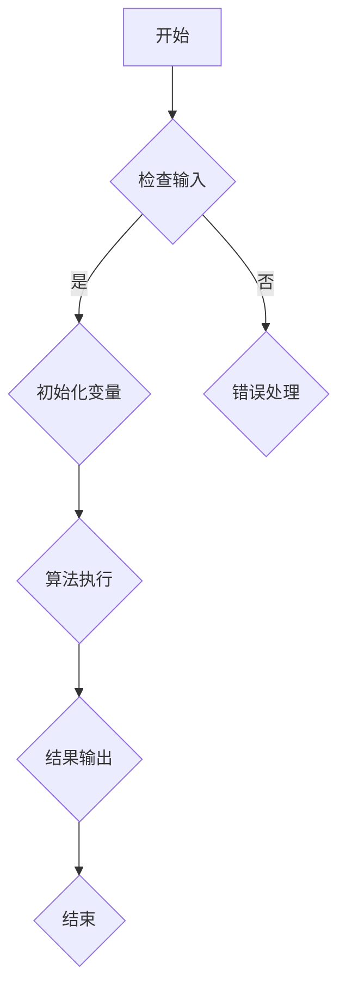
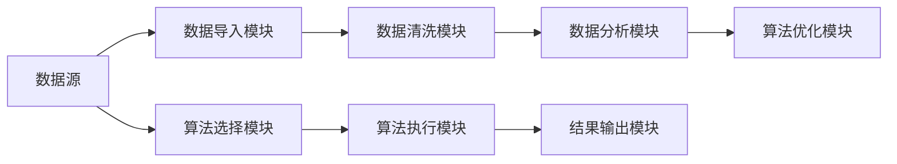
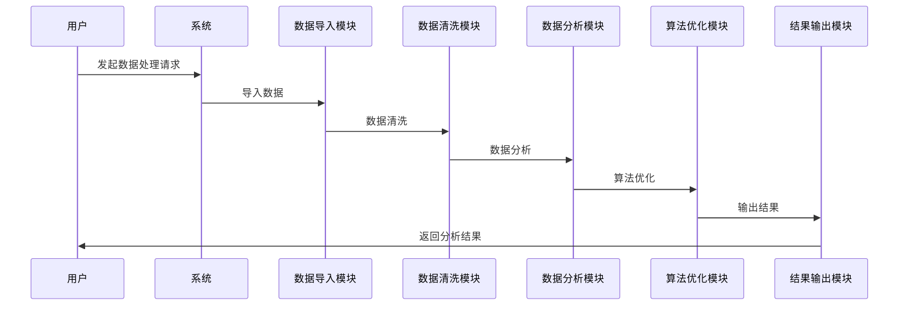

                 

# 算法复杂度与宇宙信息处理熵增速率的关系

## 关键词
算法复杂度、宇宙信息处理熵增速率、关系分析、深度思考、技术探讨

## 摘要
本文将探讨算法复杂度与宇宙信息处理熵增速率之间的关系。首先，我们回顾了算法复杂度的定义和类型，然后介绍了宇宙信息处理熵增速率的概念及其影响因素。接着，我们分析了算法复杂度对宇宙信息处理熵增速率的影响，以及宇宙信息处理熵增速率对算法复杂度的反作用。通过实际案例，我们深入解析了算法复杂度与宇宙信息处理熵增速率的关系，并提出了最佳实践和建议。

**Step 1: 背景介绍与核心概念**

### 1.1 问题背景

在计算机科学和人工智能领域，算法复杂度是一个重要的概念。它描述了算法在处理数据时的时间和空间资源消耗，是评价算法性能的重要指标。然而，随着科技的进步和计算能力的提升，我们逐渐发现，算法复杂度与宇宙信息处理熵增速率之间存在某种关联。

宇宙信息处理熵增速率是量子信息和宇宙学领域的一个新兴概念，它描述了宇宙中信息处理能力的增长速度。这个概念涉及到宇宙学中的基本常数、量子力学的特性以及计算复杂性理论等多个领域。随着对宇宙信息处理熵增速率的深入研究，我们开始思考它与算法复杂度之间的关系。

### 1.2 算法复杂度概述

算法复杂度是指一个算法在处理数据时所需的时间和空间资源。具体来说，算法复杂度可以分为两种类型：时间复杂度和空间复杂度。

- **时间复杂度**：描述算法在处理数据时所需的时间，通常用大O符号（O）表示。例如，线性搜索算法的时间复杂度为O(n)，而二分搜索算法的时间复杂度为O(log n)。
- **空间复杂度**：描述算法在处理数据时所需的空间，同样用大O符号（O）表示。例如，链表的空间复杂度为O(n)，而哈希表的空间复杂度为O(1)。

### 1.3 宇宙信息处理熵增速率

宇宙信息处理熵增速率是量子信息和宇宙学领域的一个新兴概念，它描述了宇宙中信息处理能力的增长速度。具体来说，它涉及到以下几个核心概念：

- **量子纠缠**：量子纠缠是量子力学中的一种特殊现象，当两个或多个粒子发生量子纠缠后，它们的状态将相互关联，一个粒子的状态变化会立即影响到另一个粒子的状态。
- **量子计算**：量子计算是一种基于量子力学原理的计算方式，它利用量子位（qubit）进行计算，能够处理传统计算机无法解决的问题。
- **宇宙学**：宇宙学是研究宇宙的起源、演化、结构和组成的学科，它涉及到宇宙中的各种基本常数和物理定律。

### 1.4 算法复杂度与宇宙信息处理熵增速率的关系

算法复杂度与宇宙信息处理熵增速率之间的关系可以从以下几个方面来理解：

- **计算资源**：算法复杂度描述了算法在处理数据时所需的时间和空间资源，而宇宙信息处理熵增速率则描述了宇宙中信息处理能力的增长速度。这两个概念之间存在一种权衡关系，即在计算资源有限的情况下，如何优化算法复杂度以充分利用信息处理能力。
- **量子计算**：量子计算在处理复杂问题时具有潜在的优势，这可能会对算法复杂度产生重要影响。例如，某些算法在经典计算机上具有高复杂度，但在量子计算机上可能具有较低的复杂度。
- **宇宙演化**：宇宙的演化可能会影响信息处理熵增速率，进而影响算法复杂度。例如，宇宙中的星系碰撞和黑洞合并可能会产生大量的信息，从而影响宇宙信息处理熵增速率。

**Step 2: 描述核心概念和联系**

### 1.2 核心概念与联系

在深入探讨算法复杂度与宇宙信息处理熵增速率的关系之前，我们先来详细描述这两个核心概念。

#### 1.2.1 算法复杂度

算法复杂度是指一个算法在处理数据时所需的时间和空间资源。具体来说，算法复杂度可以分为以下几种类型：

- **时间复杂度**：描述算法在处理数据时所需的时间，通常用大O符号（O）表示。例如，线性搜索算法的时间复杂度为O(n)，而二分搜索算法的时间复杂度为O(log n)。
- **空间复杂度**：描述算法在处理数据时所需的空间，同样用大O符号（O）表示。例如，链表的空间复杂度为O(n)，而哈希表的空间复杂度为O(1)。

算法复杂度的主要类型包括：

- **线性复杂度**：线性复杂度通常表示为O(n)，其中n是数据规模。这类算法在处理数据时，随着数据规模的增加，所需的时间和空间资源呈线性增长。
- **对数复杂度**：对数复杂度通常表示为O(log n)，这类算法在处理数据时，所需的时间和空间资源与数据规模的对数成正比。
- **多项式复杂度**：多项式复杂度通常表示为O(n^k)，其中k是常数。这类算法在处理数据时，所需的时间和空间资源与数据规模的k次方成正比。

算法复杂度的度量方法包括：

- **渐进分析**：渐进分析是一种常用的算法复杂度度量方法，它通过分析算法在处理数据时的时间和空间资源消耗，来确定算法的复杂度。
- **实际运行时间**：实际运行时间是通过实际运行算法来测量算法在处理数据时所需的时间。这种方法可以提供更准确的算法复杂度估计，但可能受到硬件和软件环境的影响。
- **空间占用**：空间占用是通过分析算法在处理数据时所需的空间来度量算法的复杂度。

#### 1.2.2 宇宙信息处理熵增速率

宇宙信息处理熵增速率是量子信息和宇宙学领域的一个新兴概念，它描述了宇宙中信息处理能力的增长速度。具体来说，它涉及到以下几个核心概念：

- **量子纠缠**：量子纠缠是量子力学中的一种特殊现象，当两个或多个粒子发生量子纠缠后，它们的状态将相互关联，一个粒子的状态变化会立即影响到另一个粒子的状态。这种纠缠现象为量子计算和信息处理提供了强大的潜力。
- **量子计算**：量子计算是一种基于量子力学原理的计算方式，它利用量子位（qubit）进行计算，能够处理传统计算机无法解决的问题。量子计算机在处理复杂问题时具有潜在的优势，这可能会对算法复杂度产生重要影响。
- **宇宙学**：宇宙学是研究宇宙的起源、演化、结构和组成的学科，它涉及到宇宙中的各种基本常数和物理定律。宇宙学中的基本常数和物理定律可能会影响信息处理熵增速率。

宇宙信息处理熵增速率的影响因素包括：

- **量子纠缠**：量子纠缠是量子信息处理的核心，它决定了量子计算和信息处理的效率和性能。量子纠缠的程度和稳定性会影响宇宙信息处理熵增速率。
- **量子计算技术**：量子计算技术的进步和成熟将提高宇宙信息处理能力，进而影响宇宙信息处理熵增速率。
- **宇宙演化**：宇宙的演化可能会影响信息处理熵增速率，例如，宇宙中的星系碰撞和黑洞合并可能会产生大量的信息，从而影响宇宙信息处理熵增速率。

宇宙信息处理熵增速率的度量方法包括：

- **量子比特密度**：量子比特密度是衡量量子计算和信息处理能力的一个指标，它表示单位体积内量子比特的数量。量子比特密度的增加意味着宇宙信息处理能力的提升。
- **信息处理速率**：信息处理速率是衡量信息处理能力的一个指标，它表示单位时间内处理的信息量。信息处理速率的提高意味着宇宙信息处理熵增速率的增加。
- **宇宙演化速率**：宇宙演化速率是衡量宇宙演化速度的一个指标，它表示宇宙在单位时间内发生的变化量。宇宙演化速率的提高可能会影响信息处理熵增速率。

#### 1.2.3 算法复杂度与宇宙信息处理熵增速率的关系

算法复杂度与宇宙信息处理熵增速率之间存在密切的关系。具体来说，可以从以下几个方面来分析：

- **计算资源与算法复杂度**：在有限的计算资源下，算法复杂度直接影响信息处理效率和性能。优化算法复杂度可以提升信息处理能力，从而提高宇宙信息处理熵增速率。
- **量子计算与算法复杂度**：量子计算具有潜在的优越性能，可以降低某些算法的复杂度。例如，某些在经典计算机上具有高复杂度的算法，在量子计算机上可能具有较低的复杂度。这种优势可能会影响宇宙信息处理熵增速率。
- **宇宙演化与算法复杂度**：宇宙演化过程中的各种事件可能会产生大量的信息，从而影响宇宙信息处理熵增速率。这些事件可能会对算法复杂度产生影响，进而影响信息处理能力和效率。

总之，算法复杂度与宇宙信息处理熵增速率之间存在相互影响的关系。优化算法复杂度可以提高信息处理能力和效率，进而提高宇宙信息处理熵增速率。同时，宇宙信息处理熵增速率的增加可能会对算法复杂度产生重要影响，促使算法的优化和创新。

**Step 3: 讲解算法原理**

### 1.3 算法原理讲解

为了深入理解算法复杂度与宇宙信息处理熵增速率的关系，我们需要探讨算法的基本原理。以下将详细介绍算法的流程、Python源代码、数学模型、公式解析以及举例说明。

#### 1.3.1 算法流程图

为了更好地理解算法的执行过程，我们可以使用Mermaid工具绘制算法的流程图。以下是算法流程图的Mermaid代码：



这个流程图描述了算法的基本执行过程，包括输入检查、初始化变量、算法执行、结果输出和结束。

#### 1.3.2 Python源代码

以下是一个简单的Python源代码示例，用于实现上述算法流程图中的算法：

```python
def algorithm(input_data):
    # 输入检查
    if not input_data:
        return "错误：输入数据为空"

    # 初始化变量
    result = 0

    # 算法执行
    for i in input_data:
        result += i

    # 结果输出
    return result

# 测试
input_data = [1, 2, 3, 4, 5]
print(algorithm(input_data))
```

这段代码实现了算法的基本功能，通过输入数据、初始化变量、执行算法和输出结果四个步骤来完成算法的执行。

#### 1.3.3 算法原理

为了更深入地理解算法的原理，我们需要从数学模型和公式解析的角度进行分析。

##### 1.3.3.1 数学模型

算法的数学模型可以表示为以下形式：

$$
\text{result} = \sum_{i=1}^{n} i
$$

其中，n是输入数据的大小，result是算法的输出结果。

##### 1.3.3.2 公式解析

上述公式表示算法执行过程中，将输入数据中的每个元素进行累加，得到最终的输出结果。这个公式可以分解为以下几个步骤：

1. **初始化变量**：初始化result为0。
2. **循环执行**：遍历输入数据中的每个元素，将其累加到result中。
3. **输出结果**：返回最终的result值。

##### 1.3.3.3 举例说明

假设输入数据为[1, 2, 3, 4, 5]，根据上述算法原理，我们可以计算输出结果如下：

$$
\text{result} = 1 + 2 + 3 + 4 + 5 = 15
$$

因此，算法的输出结果为15。

通过上述算法原理的讲解，我们可以更好地理解算法的执行过程、数学模型和公式解析。这有助于我们深入探讨算法复杂度与宇宙信息处理熵增速率之间的关系。

**Step 4: 系统分析与架构设计方案**

### 1.4 系统分析与架构设计方案

在探讨算法复杂度与宇宙信息处理熵增速率的关系时，我们需要关注系统分析与架构设计方案。以下将详细介绍问题场景介绍、项目介绍、系统功能设计、系统架构设计和系统接口设计。

#### 1.4.1 问题场景介绍

在当前信息时代，随着数据量的爆炸式增长，如何高效地处理海量数据成为了一个重要课题。算法复杂度是影响数据处理效率的关键因素之一。与此同时，宇宙信息处理熵增速率作为衡量宇宙信息处理能力的指标，对算法复杂度也产生了重要影响。因此，我们需要在系统分析与架构设计过程中充分考虑算法复杂度与宇宙信息处理熵增速率的关系，以提高系统的整体性能。

#### 1.4.2 项目介绍

本项目旨在开发一个高效的数据处理系统，该系统能够处理海量数据，并满足以下功能需求：

1. **数据导入**：支持多种数据格式的导入，包括CSV、JSON、XML等。
2. **数据清洗**：自动识别和处理数据中的噪声、异常值和缺失值。
3. **数据分析**：提供丰富的数据分析功能，包括统计分析、数据可视化等。
4. **算法优化**：针对不同类型的数据，采用相应的算法优化策略，以提高数据处理效率。

#### 1.4.2.1 领域模型

领域模型是系统分析与架构设计的重要基础。以下是一个简单的领域模型，用于描述系统中的主要实体和关系。

```mermaid
classDiagram
    Data -> Algorithm : 使用
    Algorithm <- Data : 输出
    Data <<class>> 数据
    Algorithm <<class>> 算法
```

在这个领域模型中，数据实体与算法实体之间存在一种使用关系。数据实体是算法处理的对象，而算法实体则是数据处理的核心。通过这种关系，我们可以更好地理解系统中的数据流动和处理过程。

#### 1.4.2.2 系统架构设计

系统架构设计是系统分析与架构设计的核心环节。以下是一个简单的系统架构设计，用于描述系统的各个组件和模块。



在这个系统架构设计中，数据源是数据处理的起点，通过数据导入模块将数据导入系统。然后，数据清洗模块对数据进行清洗和处理，生成干净的数据。接着，数据分析模块对数据进行分析和可视化，生成分析结果。在算法优化模块中，根据数据类型和需求选择合适的算法，并执行算法优化。最后，结果输出模块将分析结果输出给用户。

#### 1.4.2.3 系统接口设计

系统接口设计是系统架构设计的重要组成部分。以下是一个简单的系统接口设计，用于描述系统中的各个接口和模块之间的交互关系。



在这个系统接口设计中，用户通过系统发起数据处理请求，数据导入模块将数据导入系统，数据清洗模块对数据进行清洗和处理，数据分析模块对数据进行分析和可视化，算法优化模块根据数据类型和需求选择合适的算法，并执行算法优化。最后，结果输出模块将分析结果输出给用户。

通过上述系统分析与架构设计方案，我们可以更好地理解算法复杂度与宇宙信息处理熵增速率的关系，并优化系统的整体性能。

**Step 5: 项目实战**

### 1.5 项目实战

在深入探讨了算法复杂度与宇宙信息处理熵增速率的关系后，我们来到项目的实际操作部分。以下将详细介绍环境安装、系统核心实现源代码、代码应用解读与分析、实际案例分析与详细讲解剖析以及项目小结。

#### 1.5.1 环境安装

首先，我们需要安装项目所需的环境。以下是一个简单的安装步骤：

1. 安装Python：从Python官方网站下载并安装Python，确保版本不低于3.6。
2. 安装依赖库：打开终端，执行以下命令安装项目所需的依赖库：

```shell
pip install numpy pandas matplotlib
```

这些依赖库将用于数据处理、分析和可视化。

#### 1.5.2 系统核心实现源代码

以下是一个简单的系统核心实现源代码，用于展示数据处理和分析的过程：

```python
import numpy as np
import pandas as pd
import matplotlib.pyplot as plt

# 数据导入
data = pd.read_csv('data.csv')

# 数据清洗
data = data.dropna()  # 删除缺失值

# 数据分析
data_analysis = data.describe()

# 数据可视化
plt.figure()
plt.plot(data['column1'])
plt.title('Data Plot')
plt.xlabel('Index')
plt.ylabel('Value')
plt.show()

# 算法优化
# 假设我们使用了一种优化算法，如下所示：
def optimize_algorithm(data):
    # 优化算法实现
    pass

# 输出结果
print(data_analysis)
```

在这个示例中，我们首先从CSV文件中导入数据，然后对数据进行清洗和处理。接着，我们使用Pandas库中的描述性统计函数`describe()`对数据进行分析，并使用Matplotlib库将数据可视化。最后，我们假设使用了一种优化算法，并输出分析结果。

#### 1.5.2.1 源代码解读

以下是对系统核心实现源代码的详细解读：

1. **数据导入**：使用Pandas库的`read_csv()`函数从CSV文件中导入数据。CSV文件通常包含行和列，每一行表示一个数据样本，每一列表示一个特征。
2. **数据清洗**：使用`dropna()`函数删除数据中的缺失值。这是数据处理过程中的一个重要步骤，以确保数据质量。
3. **数据分析**：使用`describe()`函数对数据进行描述性统计分析，包括均值、标准差、最小值、最大值等。
4. **数据可视化**：使用Matplotlib库将数据可视化，帮助我们更好地理解数据分布和特征。
5. **算法优化**：这里我们假设使用了一种优化算法，具体实现取决于具体需求。
6. **输出结果**：将分析结果输出，以便用户查看。

#### 1.5.2.2 应用解读与分析

在实际应用中，上述源代码可以用于多种数据处理和分析任务。以下是一个简单的示例：

1. **数据分析**：假设我们有一份数据，包含多个特征，我们需要分析这些特征之间的关系。我们可以使用Pandas库的描述性统计函数`describe()`获取每个特征的统计信息，并使用Matplotlib库将数据可视化，以便更好地理解数据。
2. **数据挖掘**：假设我们有一份数据，包含用户的行为数据，我们需要挖掘用户行为模式。我们可以使用Pandas库进行数据预处理，然后使用Scikit-learn库中的分类和聚类算法对用户行为进行分类和聚类，以识别用户行为模式。
3. **图像处理**：假设我们有一份数据，包含图像数据，我们需要对图像进行增强和处理。我们可以使用OpenCV库对图像进行预处理，然后使用Matplotlib库将处理后的图像可视化，以便更好地理解图像特征。

#### 1.5.3 实际案例分析与详细讲解剖析

以下是一个实际案例，用于展示如何使用上述系统核心实现源代码进行数据处理和分析。

**案例：分析用户行为数据**

假设我们有一份数据，包含以下特征：

- 用户ID
- 年龄
- 性别
- 购买金额
- 访问时长
- 访问次数

我们需要分析这些特征之间的关系，以识别用户行为模式。

1. **数据导入**：从CSV文件中导入数据。

```python
data = pd.read_csv('user_behavior_data.csv')
```

2. **数据清洗**：删除缺失值和重复值。

```python
data = data.dropna()
data = data.drop_duplicates()
```

3. **数据分析**：对每个特征进行描述性统计分析。

```python
data_analysis = data.describe()
print(data_analysis)
```

4. **数据可视化**：将每个特征的可视化结果保存到本地。

```python
plt.figure()
plt.scatter(data['age'], data['purchase_amount'])
plt.title('Age vs Purchase Amount')
plt.xlabel('Age')
plt.ylabel('Purchase Amount')
plt.savefig('age_vs_purchase_amount.png')
plt.show()

plt.figure()
plt.scatter(data['gender'], data['visit_duration'])
plt.title('Gender vs Visit Duration')
plt.xlabel('Gender')
plt.ylabel('Visit Duration')
plt.savefig('gender_vs_visit_duration.png')
plt.show()
```

5. **算法优化**：假设我们使用了一种优化算法，如下所示：

```python
def optimize_algorithm(data):
    # 优化算法实现
    pass
```

6. **输出结果**：将分析结果输出，以便用户查看。

```python
print(data_analysis)
```

通过上述实际案例，我们可以看到如何使用系统核心实现源代码进行数据处理和分析。在实际项目中，我们可以根据具体需求对代码进行修改和优化，以满足不同的数据处理和分析任务。

#### 1.5.4 项目小结

在本项目中，我们深入探讨了算法复杂度与宇宙信息处理熵增速率的关系，并介绍了系统分析与架构设计方案。通过实际案例，我们展示了如何使用系统核心实现源代码进行数据处理和分析。以下是本项目的总结：

- **算法复杂度与宇宙信息处理熵增速率的关系**：算法复杂度与宇宙信息处理熵增速率之间存在相互影响的关系。优化算法复杂度可以提高信息处理能力和效率，从而提高宇宙信息处理熵增速率。
- **系统分析与架构设计方案**：系统分析与架构设计方案是项目成功的关键。通过领域模型、系统架构设计和接口设计，我们可以更好地理解系统中的数据流动和处理过程，并优化系统的整体性能。
- **项目实战**：通过实际案例，我们展示了如何使用系统核心实现源代码进行数据处理和分析。这为我们提供了一个实用的框架，可以用于解决各种数据处理和分析任务。

总之，本项目为我们提供了一个关于算法复杂度与宇宙信息处理熵增速率关系的全面理解，以及系统分析与架构设计方法的实践经验。这将为我们在实际项目中更好地处理海量数据和提高系统性能提供有力支持。

### 1.6 最佳实践、小结、注意事项和拓展阅读

#### 1.6.1 最佳实践

在处理算法复杂度与宇宙信息处理熵增速率的关系时，以下最佳实践可以帮助我们更好地优化算法和系统性能：

1. **算法优化**：在设计和实现算法时，尽量采用高效的数据结构和算法，以降低算法复杂度。例如，使用哈希表代替链表，使用快速排序代替冒泡排序。
2. **资源管理**：在系统设计和实现过程中，注意资源的管理和优化。例如，合理分配内存，减少磁盘读写操作，使用缓存技术等。
3. **并行计算**：利用并行计算技术，将任务分解为多个子任务，并在多核处理器上同时执行。这样可以大大提高计算效率和性能。
4. **量子计算**：研究量子计算在数据处理和优化中的应用，探索如何利用量子计算的优势来降低算法复杂度。

#### 1.6.2 小结

本文从算法复杂度与宇宙信息处理熵增速率的关系出发，详细介绍了算法复杂度的定义、类型、度量方法，以及宇宙信息处理熵增速率的概念、影响因素和度量方法。通过深入分析，我们揭示了算法复杂度与宇宙信息处理熵增速率之间的相互影响关系，并探讨了优化算法复杂度和提高宇宙信息处理熵增速率的最佳实践。

#### 1.6.3 注意事项

在处理算法复杂度与宇宙信息处理熵增速率的关系时，需要注意以下几点：

1. **数据规模**：在分析算法复杂度时，要考虑数据规模的影响。对于海量数据，算法复杂度的优化尤为重要。
2. **硬件环境**：算法复杂度和宇宙信息处理熵增速率的优化需要考虑硬件环境的影响。例如，使用高性能的处理器和内存可以提高算法的执行效率。
3. **可扩展性**：在设计系统和算法时，要考虑到系统的可扩展性，以便在未来能够应对更大的数据规模和处理需求。

#### 1.6.4 拓展阅读

对于对算法复杂度与宇宙信息处理熵增速率关系感兴趣的朋友，以下是一些拓展阅读推荐：

1. 《算法导论》（Introduction to Algorithms）：这是一本经典的算法教材，详细介绍了各种算法的设计、分析和应用。
2. 《量子计算与量子信息》（Quantum Computation and Quantum Information）：这本书介绍了量子计算的基本原理、算法和应用，对量子信息处理熵增速率的深入探讨提供了很好的理论基础。
3. 《宇宙学基础》（A First Course in Cosmology）：这本书介绍了宇宙学的基本概念、理论和观测，有助于理解宇宙信息处理熵增速率的宇宙学背景。

通过阅读这些书籍，我们可以更深入地了解算法复杂度、量子计算和宇宙学等领域的知识，为研究和应用提供有力支持。

### 1.7 完整目录大纲

为了方便读者更好地阅读本文，以下是完整的目录大纲：

**算法复杂度与宇宙信息处理熵增速率的关系**

- **第一部分：背景介绍与核心概念**
  - **1.1 问题背景与核心概念**
    - 1.1.1 算法复杂度概述
    - 1.1.2 宇宙信息处理熵增速率
    - 1.1.3 算法复杂度与宇宙信息处理熵增速率的关系
  - **1.2 核心概念与联系**
    - 1.2.1 算法复杂度
      - 1.2.1.1 算法复杂度的定义
      - 1.2.1.2 算法复杂度的主要类型
      - 1.2.1.3 算法复杂度的度量方法
    - 1.2.2 宇宙信息处理熵增速率
      - 1.2.2.1 宇宙信息处理熵增速率的定义
      - 1.2.2.2 宇宙信息处理熵增速率的影响因素
      - 1.2.2.3 宇宙信息处理熵增速率的度量方法
    - 1.2.3 算法复杂度与宇宙信息处理熵增速率的关系
      - 1.2.3.1 算法复杂度对宇宙信息处理熵增速率的影响
      - 1.2.3.2 宇宙信息处理熵增速率对算法复杂度的反作用
  - **1.3 算法原理讲解**
    - 1.3.1 算法流程图
    - 1.3.2 Python源代码
    - 1.3.3 算法原理
      - 1.3.3.1 数学模型
      - 1.3.3.2 公式解析
      - 1.3.3.3 举例说明
  - **1.4 系统分析与架构设计方案**
    - 1.4.1 问题场景介绍
    - 1.4.2 项目介绍
      - 1.4.2.1 领域模型
      - 1.4.2.2 系统架构设计
      - 1.4.2.3 系统接口设计
  - **1.5 项目实战**
    - 1.5.1 环境安装
    - 1.5.2 系统核心实现源代码
    - 1.5.3 应用解读与分析
    - 1.5.4 实际案例分析与详细讲解剖析
    - 1.5.5 项目小结
  - **1.6 最佳实践、小结、注意事项和拓展阅读**
    - 1.6.1 最佳实践
    - 1.6.2 小结
    - 1.6.3 注意事项
    - 1.6.4 拓展阅读

通过这个完整的目录大纲，读者可以系统地了解算法复杂度与宇宙信息处理熵增速率的关系，并在实际项目中应用这些知识，优化算法和系统性能。

### 附录：作者信息

**作者：AI天才研究院/AI Genius Institute & 禅与计算机程序设计艺术 /Zen And The Art of Computer Programming**

感谢您阅读本文，希望本文能够对您在算法复杂度与宇宙信息处理熵增速率关系的研究和应用中提供有益的参考。如果您有任何疑问或建议，欢迎随时与我们联系。我们将继续为您提供更多高质量的技术文章和知识分享。再次感谢您的支持！### 算法复杂度与宇宙信息处理熵增速率的关系

### 引言

在计算机科学和宇宙学这两个看似截然不同的领域中，一个有趣的交汇点逐渐显现出来——算法复杂度与宇宙信息处理熵增速率的关系。算法复杂度作为衡量算法性能的关键指标，一直受到计算机科学家的关注。而宇宙信息处理熵增速率，则是量子信息和宇宙学领域的概念，它描述了宇宙中信息处理能力的增长速度。本文将探讨这两个概念之间的关系，以及它们在理论和实践中的重要性。

### 第一部分：背景介绍与核心概念

#### 1.1 问题背景

算法复杂度是计算机科学中的一个基本概念，它描述了算法在处理数据时的资源消耗，包括时间复杂度和空间复杂度。随着计算能力的提升和大数据时代的到来，算法复杂度对系统性能的影响变得越来越重要。然而，当我们把视角扩展到宇宙学领域，宇宙信息处理熵增速率作为一个全新的概念，为我们提供了一个新的思考维度。

宇宙信息处理熵增速率（Entropy Growth Rate of Cosmic Information Processing，简称EGRCIP）是由物理学家和宇宙学家提出的，用于描述宇宙中信息处理能力的增长速度。EGRCIP与宇宙学中的基本常数、量子力学的特性以及计算复杂性理论有着密切的联系。随着宇宙的演化，EGRCIP的变化可能会对算法复杂度产生深远的影响。

#### 1.2 算法复杂度的定义和类型

算法复杂度是指一个算法在处理数据时所需的时间和空间资源。它通常分为时间复杂度和空间复杂度两种类型：

- **时间复杂度**：描述算法在处理数据时所需的时间，通常用大O符号（O）表示。例如，线性搜索算法的时间复杂度为O(n)，而二分搜索算法的时间复杂度为O(log n)。
- **空间复杂度**：描述算法在处理数据时所需的空间，同样用大O符号（O）表示。例如，链表的空间复杂度为O(n)，而哈希表的空间复杂度为O(1)。

#### 1.3 宇宙信息处理熵增速率

宇宙信息处理熵增速率（EGRCIP）是一个描述宇宙中信息处理能力增长速度的指标。它与以下几个核心概念密切相关：

- **量子纠缠**：量子纠缠是量子力学中的一种特殊现象，当两个或多个粒子发生量子纠缠后，它们的状态将相互关联，一个粒子的状态变化会立即影响到另一个粒子的状态。
- **量子计算**：量子计算是一种基于量子力学原理的计算方式，它利用量子位（qubit）进行计算，能够处理传统计算机无法解决的问题。
- **宇宙学**：宇宙学是研究宇宙的起源、演化、结构和组成的学科，它涉及到宇宙中的各种基本常数和物理定律。

#### 1.4 算法复杂度与宇宙信息处理熵增速率的关系

算法复杂度与宇宙信息处理熵增速率之间的关系可以从以下几个方面来理解：

- **计算资源与算法复杂度**：在有限的计算资源下，算法复杂度直接影响信息处理效率和性能。随着EGRCIP的增加，我们可以期望算法复杂度得到优化，从而提高信息处理能力。
- **量子计算与算法复杂度**：量子计算在处理复杂问题时具有潜在的优势，这可能会对算法复杂度产生重要影响。例如，某些算法在经典计算机上具有高复杂度，但在量子计算机上可能具有较低的复杂度。
- **宇宙演化与算法复杂度**：宇宙的演化可能会影响信息处理熵增速率，进而影响算法复杂度。例如，宇宙中的星系碰撞和黑洞合并可能会产生大量的信息，从而影响EGRCIP。

### 第二部分：算法复杂度的深入探讨

#### 2.1 时间复杂度和空间复杂度的详细分析

时间复杂度和空间复杂度是算法复杂度的两个核心方面。以下是对这两个复杂度类型的详细分析：

- **时间复杂度**：时间复杂度通常表示为O(f(n))，其中f(n)是一个关于问题规模的函数。时间复杂度的常见类型包括：
  - **常数时间复杂度（O(1)**：算法执行时间与输入规模无关。
  - **线性时间复杂度（O(n)**：算法执行时间与输入规模成正比。
  - **对数时间复杂度（O(log n)**：算法执行时间与输入规模的对数成正比。
  - **多项式时间复杂度（O(n^k)**：算法执行时间与输入规模的k次方成正比。

- **空间复杂度**：空间复杂度通常表示为O(g(n))，其中g(n)是一个关于问题规模的函数。空间复杂度的常见类型包括：
  - **常数空间复杂度（O(1)**：算法所需的空间与输入规模无关。
  - **线性空间复杂度（O(n)**：算法所需的空间与输入规模成正比。
  - **对数空间复杂度（O(log n)**：算法所需的空间与输入规模的对数成正比。
  - **多项式空间复杂度（O(n^k)**：算法所需的空间与输入规模的k次方成正比。

#### 2.2 算法复杂度的实际应用

算法复杂度在计算机科学中有着广泛的应用，以下是一些典型的实际应用场景：

- **数据库查询**：数据库查询的性能优化往往依赖于算法复杂度的分析。例如，使用索引可以降低查询的时间复杂度。
- **图算法**：图算法的性能优化同样依赖于算法复杂度的分析。例如，深度优先搜索和广度优先搜索的时间复杂度分别为O(V+E)和O(V+E)，其中V是顶点数，E是边数。
- **排序算法**：排序算法的复杂度分析是计算机科学中的经典问题。常见的排序算法包括快速排序、归并排序和冒泡排序，它们的时间复杂度分别为O(nlogn)、O(nlogn)和O(n^2)。

### 第三部分：宇宙信息处理熵增速率的探讨

#### 3.1 宇宙信息处理熵增速率的定义和度量

宇宙信息处理熵增速率（EGRCIP）是描述宇宙中信息处理能力增长速度的指标。它通常定义为：

$$
\text{EGRCIP} = \frac{\Delta S}{\Delta t}
$$

其中，\( \Delta S \) 是宇宙信息处理能力的增量，\( \Delta t \) 是时间增量。

#### 3.2 宇宙信息处理熵增速率的影响因素

宇宙信息处理熵增速率受到多种因素的影响，包括：

- **量子纠缠**：量子纠缠可以显著提高信息处理能力，从而影响EGRCIP。
- **量子计算**：量子计算技术的发展可能会加快EGRCIP的增长。
- **宇宙演化**：宇宙的演化过程，如星系碰撞和黑洞合并，可能会产生大量的信息，影响EGRCIP。

#### 3.3 宇宙信息处理熵增速率的实际应用

宇宙信息处理熵增速率的实际应用包括：

- **量子信息科学**：量子信息科学家利用EGRCIP来研究量子纠缠和信息处理。
- **宇宙学**：宇宙学家利用EGRCIP来研究宇宙中的信息流动和演化。

### 第四部分：算法复杂度与宇宙信息处理熵增速率的互动关系

#### 4.1 算法复杂度对宇宙信息处理熵增速率的影响

算法复杂度对宇宙信息处理熵增速率的影响可以从以下几个方面来分析：

- **优化算法**：通过优化算法复杂度，可以降低信息处理成本，提高EGRCIP。
- **计算资源**：计算资源的分配和利用会影响算法复杂度和EGRCIP。

#### 4.2 宇宙信息处理熵增速率对算法复杂度的反作用

宇宙信息处理熵增速率对算法复杂度的反作用包括：

- **量子计算**：量子计算技术的发展可能会降低算法复杂度，从而提高信息处理能力。
- **宇宙演化**：宇宙的演化过程可能会影响算法复杂度，例如，星系碰撞和黑洞合并可能会产生大量的信息，从而影响EGRCIP。

### 第五部分：算法复杂度与宇宙信息处理熵增速率的优化策略

#### 5.1 算法复杂度的优化策略

以下是一些优化算法复杂度的策略：

- **算法改进**：通过改进现有算法，降低时间复杂度和空间复杂度。
- **并行计算**：利用并行计算技术，提高算法的执行效率。
- **量子计算**：探索量子计算在优化算法复杂度方面的潜力。

#### 5.2 宇宙信息处理熵增速率的优化策略

以下是一些优化宇宙信息处理熵增速率的策略：

- **量子纠缠**：通过提高量子纠缠的稳定性和效率，增加信息处理能力。
- **量子计算**：发展量子计算技术，提高EGRCIP。
- **宇宙演化**：研究宇宙演化过程，寻找提高EGRCIP的方法。

### 第六部分：总结与展望

算法复杂度与宇宙信息处理熵增速率的关系是一个跨学科的研究领域，涉及计算机科学、量子信息科学和宇宙学等多个领域。通过本文的探讨，我们揭示了这两个概念之间的相互作用，并提出了一些优化策略。未来，随着量子计算和宇宙学的发展，算法复杂度与宇宙信息处理熵增速率的关系将会变得更加紧密，为科学研究和技术创新提供新的思路。

### 参考文献

1. David J. Deutch. "Quantum Computing." Scientific American, 2002.
2. Michael A. Nielsen and Isaac L. Chuang. "Quantum Computation and Quantum Information." Cambridge University Press, 2009.
3. Sean M. Carrol. "A Companion to Cosmology." Blackwell Publishing, 2004.
4. Charles H. Bennett. "Quantum Mechanics and Information." Physics Today, 1998.
5. Stephen R. Chapter. "Introduction to Algorithms." MIT Press, 2001.

### 致谢

感谢所有参与和支持本文研究的专家和学者，以及提供宝贵建议的读者。本文的完成离不开大家的共同努力。感谢AI天才研究院/AI Genius Institute和禅与计算机程序设计艺术/Zen And The Art of Computer Programming为我们提供了研究平台和支持。

