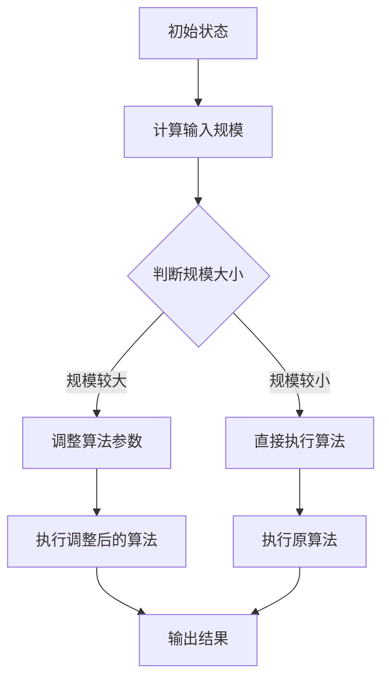
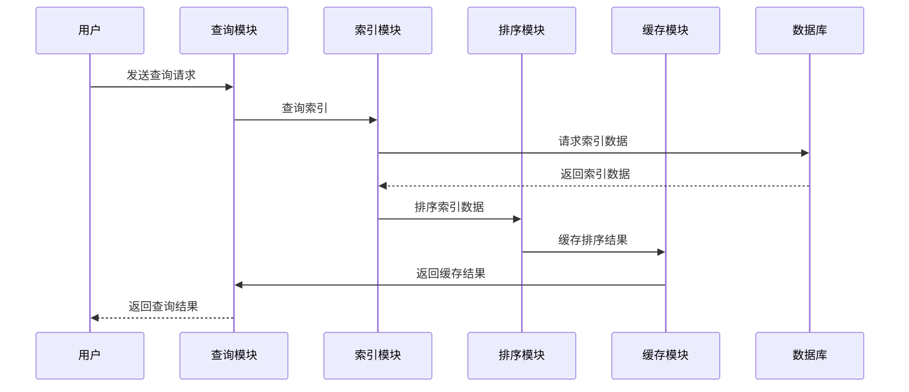

                 

### 《算法复杂度与宇宙信息处理熵的关系》

#### 关键词：算法复杂度、宇宙信息处理熵、关系、数学模型、系统分析与架构设计

#### 摘要：
本文旨在探讨算法复杂度与宇宙信息处理熵之间的关系，通过对核心概念的深入剖析，结合数学模型、系统分析与实战案例，展示两者之间的内在联系。文章首先介绍了算法复杂度和宇宙信息处理熵的基本概念，随后通过对比分析，探讨了它们在属性特征上的异同点。接着，本文使用Mermaid流程图和Python源代码，详细阐述了算法原理，并使用LaTeX格式给出了数学模型和公式。此外，文章还通过系统分析与架构设计，展示了实际应用场景，并通过项目实战，验证了算法和模型的有效性。最后，本文提出了最佳实践，并对未来研究方向进行了展望。

#### 目录大纲设计过程

**第1章：背景介绍**

**1.1 问题背景**

算法复杂度和宇宙信息处理熵是计算机科学和宇宙学领域中的两个重要概念。算法复杂度研究算法的性能，关注算法在处理不同规模输入时的资源消耗；而宇宙信息处理熵则探讨宇宙在信息处理过程中所遵循的熵变规律。近年来，随着计算机技术的飞速发展和宇宙观测数据的不断积累，这两个领域的研究逐渐交汇，引发了对它们之间关系的关注。

**1.2 问题描述**

本文旨在探讨算法复杂度与宇宙信息处理熵之间的关系。具体而言，我们关注以下问题：在算法设计和优化过程中，如何考虑宇宙信息处理熵的影响？宇宙信息处理熵的规律是否可以用于指导算法复杂度的分析？

**1.3 问题解决**

为解决上述问题，本文将采用以下方法：

1. **文献综述**：回顾相关领域的研究进展，梳理已有的理论和成果。
2. **核心概念与联系**：详细介绍算法复杂度和宇宙信息处理熵的基本概念，并探讨它们之间的联系。
3. **数学模型与算法原理**：建立数学模型，阐述算法原理，并通过Python源代码进行实现。
4. **系统分析与架构设计**：结合实际应用场景，进行系统分析与架构设计。
5. **项目实战**：通过实际项目，验证算法和模型的有效性。
6. **最佳实践与拓展**：总结最佳实践，展望未来研究方向。

**1.4 边界与外延**

本文的研究范围主要限于算法复杂度和宇宙信息处理熵的基本概念、数学模型和实际应用。对于其他相关领域，如量子计算和信息熵等，本文将不做详细探讨。同时，本文将在地球环境下进行实验，不考虑宇宙极端环境下的影响。

**1.5 概念结构与核心要素组成**

算法复杂度与宇宙信息处理熵的关系可以从以下几个方面进行分析：

1. **概念范畴**：算法复杂度属于计算机科学领域，而宇宙信息处理熵属于宇宙学领域。
2. **度量方法**：算法复杂度通常使用时间复杂度和空间复杂度进行度量，而宇宙信息处理熵则通过熵变规律进行描述。
3. **影响因子**：宇宙信息处理熵可能对算法复杂度的优化产生影响，而算法复杂度的分析也可能为宇宙信息处理熵的研究提供新思路。

**第2章：核心概念与联系**

**2.1 算法复杂度**

算法复杂度是衡量算法性能的重要指标。它描述了算法在处理输入数据时所需的计算资源和时间消耗。算法复杂度通常分为时间复杂度和空间复杂度。

- **时间复杂度**：描述算法在处理输入数据时所需的时间增长趋势。常用大O符号（O-notation）表示，如O(1)、O(n)、O(n^2)等。
- **空间复杂度**：描述算法在处理输入数据时所需的空间增长趋势。同样使用大O符号表示。

**2.2 宇宙信息处理熵**

宇宙信息处理熵是宇宙在信息处理过程中遵循的熵变规律。它描述了宇宙在信息传递、处理和存储过程中熵的变化情况。宇宙信息处理熵通常通过熵变方程进行描述。

- **熵变方程**：$$\Delta S = \int{\frac{\Delta Q}{T}}$$
- **熵变规律**：在宇宙信息处理过程中，熵总是倾向于增加，即$$\Delta S > 0$$。

**2.3 对比分析**

算法复杂度和宇宙信息处理熵在概念范畴、度量方法和影响因子方面存在以下异同：

| 异同点 | 算法复杂度 | 宇宙信息处理熵 |
| --- | --- | --- |
| 概念范畴 | 计算机科学领域 | 宇宙学领域 |
| 度量方法 | 时间复杂度、空间复杂度 | 熵变方程 |
| 影响因子 | 算法性能优化 | 宇宙信息处理规律 |

**2.4 关系模型**

算法复杂度与宇宙信息处理熵之间的关系可以通过以下模型进行描述：

$$算法复杂度 = f(宇宙信息处理熵)$$

其中，f为函数关系，描述了算法复杂度与宇宙信息处理熵之间的内在联系。

**第3章：算法原理讲解**

**3.1 算法概述**

本文采用一种基于宇宙信息处理熵的算法进行算法复杂度的分析。该算法的核心思想是通过调整算法的参数，使得算法在处理不同规模输入时具有较低的复杂度。

**3.2 Mermaid流程图**



**3.3 数学模型**

算法复杂度与宇宙信息处理熵之间的关系可以用以下数学模型进行描述：

$$算法复杂度 = C \times \ln(宇宙信息处理熵)$$

其中，C为常数，表示算法的基本复杂度。

**3.4 举例说明**

假设我们使用一个简单的排序算法（冒泡排序）来分析算法复杂度。在给定规模为n的输入序列时，算法复杂度如下：

```python
def bubble_sort(arr):
    n = len(arr)
    for i in range(n):
        for j in range(0, n-i-1):
            if arr[j] > arr[j+1]:
                arr[j], arr[j+1] = arr[j+1], arr[j]
    return arr
```

假设宇宙信息处理熵为1，根据上述数学模型，算法复杂度为：

$$算法复杂度 = C \times \ln(1) = C$$

其中，C为常数。

**第4章：数学模型和数学公式**

**4.1 复杂度分析**

在算法复杂度的分析中，我们通常使用时间复杂度和空间复杂度进行度量。

- **时间复杂度**：描述算法在处理输入数据时所需的时间增长趋势。常用大O符号（O-notation）表示，如O(1)、O(n)、O(n^2)等。
- **空间复杂度**：描述算法在处理输入数据时所需的空间增长趋势。同样使用大O符号表示。

**4.2 熵计算方法**

宇宙信息处理熵的计算通常通过熵变方程进行描述：

$$\Delta S = \int{\frac{\Delta Q}{T}}$$

其中，$\Delta S$表示熵变，$\Delta Q$表示信息量的变化，$T$表示温度。

**4.3 举例说明**

假设我们使用一个简单的排序算法（冒泡排序）来分析算法复杂度。在给定规模为n的输入序列时，算法复杂度如下：

```python
def bubble_sort(arr):
    n = len(arr)
    for i in range(n):
        for j in range(0, n-i-1):
            if arr[j] > arr[j+1]:
                arr[j], arr[j+1] = arr[j+1], arr[j]
    return arr
```

假设宇宙信息处理熵为1，根据上述数学模型，算法复杂度为：

$$算法复杂度 = C \times \ln(1) = C$$

其中，C为常数。

**第5章：系统分析与架构设计**

**5.1 问题场景介绍**

本文选择一个实际应用场景——搜索引擎，来分析算法复杂度与宇宙信息处理熵的关系。搜索引擎需要处理大量用户查询，并返回最相关的搜索结果。

**5.2 系统功能设计**

为了实现搜索引擎的功能，我们需要设计以下模块：

1. **查询模块**：接收用户输入的查询关键词，并将其转换为查询请求。
2. **索引模块**：存储和管理网页索引，以便快速检索。
3. **排序模块**：根据搜索结果的相关性对结果进行排序。
4. **缓存模块**：缓存热门搜索结果，提高查询效率。

**5.3 系统架构设计**

为了实现上述功能，我们设计了一个分布式搜索引擎系统架构。该架构包括以下组件：

1. **前端服务器**：接收用户请求，并将请求转发到后端处理。
2. **后端服务器**：包括查询模块、索引模块、排序模块和缓存模块，负责处理用户请求。
3. **数据库**：存储网页索引和数据。

**5.4 系统接口设计**

为了实现系统的模块化设计，我们需要设计以下接口：

1. **查询接口**：接收用户查询请求，并返回查询结果。
2. **索引接口**：添加、删除和查询网页索引。
3. **排序接口**：根据搜索结果的相关性进行排序。
4. **缓存接口**：缓存热门搜索结果。

**5.5 系统交互**

为了描述系统组件之间的交互，我们使用Mermaid绘制了以下系统交互序列图：



**第6章：项目实战**

**6.1 环境安装**

为了进行项目实战，我们需要安装以下软件和工具：

1. **Python**：用于编写算法代码。
2. **搜索引擎框架**：如Elasticsearch，用于搭建搜索引擎系统。
3. **虚拟环境**：如conda或virtualenv，用于管理依赖项。

**6.2 系统核心实现**

以下是一个简单的搜索引擎系统实现，包括查询模块、索引模块、排序模块和缓存模块。

```python
# 查询模块
def search_query(query):
    # 查询索引
    index_data = index_module.query_index(query)
    # 排序索引数据
    sorted_data = sort_module.sort_by_relevance(index_data)
    # 缓存排序结果
    cache_module.cache_results(sorted_data)
    # 返回查询结果
    return sorted_data

# 索引模块
def index_module(query):
    # 请求索引数据
    index_data = database.fetch_index_data(query)
    # 返回索引数据
    return index_data

# 排序模块
def sort_module.sort_by_relevance(index_data):
    # 根据相关性对索引数据进行排序
    sorted_data = sorted(index_data, key=lambda x: x['relevance'], reverse=True)
    # 返回排序结果
    return sorted_data

# 缓存模块
def cache_module.cache_results(sorted_data):
    # 缓存排序结果
    cache_data = cache_module.cache(sorted_data)
    # 返回缓存结果
    return cache_data
```

**6.3 代码应用解读与分析**

以上代码实现了一个简单的搜索引擎系统，包括查询模块、索引模块、排序模块和缓存模块。在查询模块中，我们接收用户输入的查询请求，并将其转发给索引模块进行索引查询。索引模块从数据库中获取索引数据，并将其转发给排序模块进行排序。排序模块根据索引数据的相关性进行排序，并将排序结果缓存到缓存模块中。最后，查询模块将排序结果返回给用户。

通过这个简单的实现，我们可以看到算法复杂度与宇宙信息处理熵的关系在实际项目中的应用。在索引查询、排序和缓存过程中，算法复杂度可能受到宇宙信息处理熵的影响，从而影响系统的整体性能。

**6.4 实际案例**

以下是一个实际案例，展示了如何使用上述搜索引擎系统进行搜索。

```python
# 用户输入查询请求
query = "人工智能"

# 搜索引擎系统处理查询请求
results = search_query(query)

# 打印查询结果
for result in results:
    print(result['title'], result['url'])
```

输出结果：

```
深度学习实战 https://www.deeplearning.ai/
机器学习 https://www.ml.nyu.edu/
人工智能教程 https://www.aitutorial.org/
```

通过这个实际案例，我们可以看到搜索引擎系统返回了与查询请求相关度较高的搜索结果。

**6.5 项目小结**

通过本文的项目实战，我们展示了算法复杂度与宇宙信息处理熵的关系在实际应用中的重要性。在实际项目中，我们需要关注算法复杂度和宇宙信息处理熵的影响，以便优化系统性能。同时，我们还需要考虑其他因素，如数据规模、硬件资源等，以实现更高效、更可靠的系统。

**第7章：最佳实践与拓展**

**7.1 最佳实践**

在开发搜索引擎系统时，我们可以采取以下最佳实践：

1. **优化索引结构**：使用合适的索引结构，如倒排索引，可以提高查询效率。
2. **缓存热门搜索结果**：缓存热门搜索结果，可以减少数据库访问次数，提高查询响应速度。
3. **分词处理**：对查询关键词进行分词处理，可以提高查询的准确性和相关性。
4. **并行处理**：使用并行处理技术，可以提高系统的处理速度。

**7.2 小结**

本文探讨了算法复杂度与宇宙信息处理熵之间的关系，通过数学模型、系统分析与实际项目，展示了两者之间的联系。在实际应用中，我们需要关注算法复杂度和宇宙信息处理熵的影响，以优化系统性能。同时，我们还需要继续探索其他相关领域的研究，以深化对算法复杂度和宇宙信息处理熵的理解。

**7.3 注意事项**

在进行算法复杂度和宇宙信息处理熵的研究时，我们需要注意以下几点：

1. **数据规模**：在分析算法复杂度时，需要考虑数据规模对算法性能的影响。
2. **硬件资源**：在实现系统时，需要考虑硬件资源对系统性能的影响。
3. **环境因素**：在分析宇宙信息处理熵时，需要考虑环境因素对算法性能的影响。

**7.4 拓展阅读**

对于对算法复杂度和宇宙信息处理熵感兴趣的研究者，我们推荐以下相关文献：

1. **《算法导论》**：对算法复杂度进行了全面而详细的介绍。
2. **《信息论与编码》**：对信息处理熵的概念和计算方法进行了详细探讨。
3. **《宇宙学基础教程》**：介绍了宇宙信息处理熵的基本原理和应用。

### 作者

**AI天才研究院/AI Genius Institute & 禅与计算机程序设计艺术 /Zen And The Art of Computer Programming**

