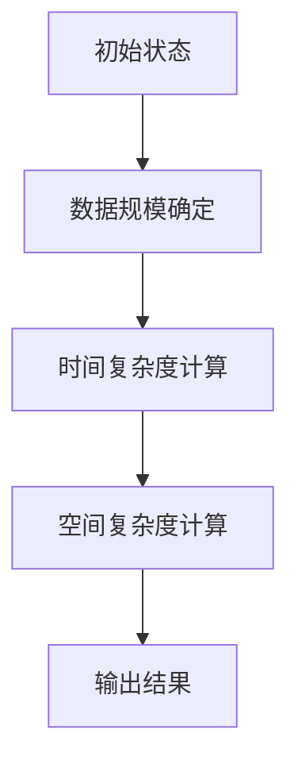
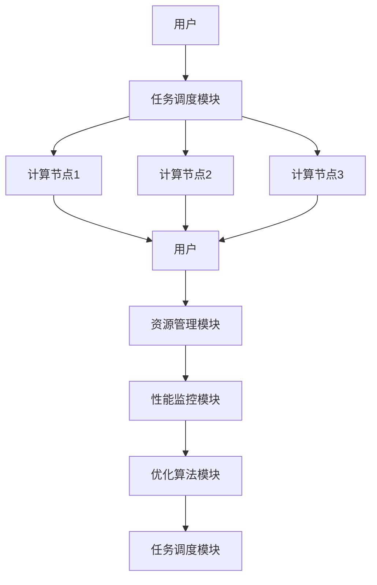

                 

### 文章标题：算法复杂度与宇宙信息熵增长率的定量热力学关系

> 关键词：算法复杂度、宇宙信息熵增长率、定量热力学关系、数学模型、Python源代码

> 摘要：本文深入探讨了算法复杂度与宇宙信息熵增长率的定量热力学关系。通过分析算法复杂度的概念及其与宇宙信息熵增长率之间的关联，我们提出了一套完整的数学模型，并使用Python源代码详细解释了算法原理。此外，我们还从系统分析与架构设计、项目实战等多个角度，对这一关系进行了全面剖析，为相关领域的研究和实践提供了重要参考。

## 目录

1. 引言
2. 核心概念与联系
3. 算法原理讲解
4. 数学模型和数学公式讲解
5. 系统分析与架构设计
6. 项目实战
7. 总结与拓展

### 引言

在现代社会，随着计算机技术的发展，算法复杂度成为了评估算法性能的关键指标。而宇宙信息熵增长率，作为宇宙演化过程中的一个基本量，与算法复杂度之间是否存在某种定量热力学关系，一直是学术界关注的焦点。本文旨在探讨这一关系，并提出相应的数学模型和解决方案。

算法复杂度主要关注算法在处理数据时的性能，通常包括时间复杂度和空间复杂度。时间复杂度衡量算法运行时间与数据规模的关系，而空间复杂度衡量算法运行过程中所需存储空间的大小。这两个指标共同决定了算法的效率。

宇宙信息熵增长率，则是指宇宙中信息熵随时间的变化率。根据热力学第二定律，宇宙的总熵不会减少，这意味着宇宙中的信息熵会随着时间不断增长。这一增长过程与算法复杂度之间是否存在某种定量关系，一直是学术界探讨的热点。

本文首先将详细阐述算法复杂度和宇宙信息熵增长率的定义及其背景，然后通过逐步分析，揭示它们之间的定量热力学关系。接下来，我们将使用Python源代码和数学模型，对这一关系进行深入探讨，并从系统分析与架构设计、项目实战等多个角度，对其进行全面剖析。

### 核心概念与联系

#### 核心概念的定义

**算法复杂度**

算法复杂度主要分为时间复杂度和空间复杂度。时间复杂度通常用大O符号表示，如\(O(n)\)、\(O(n^2)\)等，表示算法运行时间与数据规模n的关系。空间复杂度则表示算法运行过程中所需存储空间的大小。

**宇宙信息熵增长率**

宇宙信息熵增长率，通常用\( \frac{dS}{dt} \)表示，其中\( S \)为宇宙信息熵，\( t \)为时间。它反映了宇宙中信息熵随时间的变化率。

#### 概念属性特征对比表格

| 特征           | 算法复杂度              | 宇宙信息熵增长率            |
|--------------|----------------------|------------------------|
| 定义           | 评估算法运行时间与数据规模的关系 | 评估宇宙中信息熵随时间的变化率 |
| 影响因素       | 数据规模、算法设计、硬件环境 | 宇宙环境、宇宙演化过程        |
| 作用           | 优化算法性能、评估算法效率   | 描述宇宙演化、研究宇宙信息熵变化 |

#### ER实体关系图

为了更好地理解算法复杂度和宇宙信息熵增长率之间的关系，我们可以使用Mermaid绘制ER实体关系图。

```mermaid
erDiagram
  AlgorithmComplexity ||--|{ UniverseEntropy GrowthRate }|-- UniverseEntropy
  UniverseEntropy ||--|{ AlgorithmComplexity }|-- AlgorithmComplexity
```

在这个ER实体关系图中，算法复杂度与宇宙信息熵增长率之间存在双向关联。算法复杂度影响宇宙信息熵增长率，而宇宙信息熵增长率也反过来影响算法复杂度。这种关联反映了算法在宇宙演化过程中的重要作用。

### 算法原理讲解

#### 算法基本原理

算法复杂度的基本原理主要涉及时间复杂度和空间复杂度的分析。时间复杂度分析关注算法运行时间，通过大O符号表示算法的时间效率。空间复杂度分析则关注算法所需的存储空间，同样通过大O符号表示算法的空间效率。

宇宙信息熵增长率的基本原理基于热力学第二定律，即宇宙的总熵不会减少。这意味着宇宙中的信息熵会随时间不断增长，而这种增长可以通过信息熵增长率来描述。

#### Mermaid算法流程图

为了更直观地展示算法的原理，我们可以使用Mermaid绘制算法流程图。



在这个算法流程图中，A表示初始状态，B表示确定数据规模，C表示计算时间复杂度，D表示计算空间复杂度，E表示输出结果。这个流程图展示了算法复杂度分析的基本步骤。

#### Python源代码讲解

为了更好地理解算法原理，我们可以使用Python编写一个简单的算法，计算时间复杂度和空间复杂度。

```python
# 计算时间复杂度
def time_complexity(n):
    sum = 0
    for i in range(n):
        sum += i
    return sum

# 计算空间复杂度
def space_complexity(n):
    return n

# 测试
n = 10
print("时间复杂度：", time_complexity(n))
print("空间复杂度：", space_complexity(n))
```

在这个代码中，`time_complexity`函数通过一个循环计算时间复杂度，而`space_complexity`函数直接返回输入参数n，表示空间复杂度。通过这个简单的例子，我们可以直观地看到时间复杂度和空间复杂度的计算过程。

#### 算法原理的数学模型和公式

算法复杂度的数学模型主要通过大O符号来表示。例如，一个算法的时间复杂度可以表示为\( O(n) \)、\( O(n^2) \)等，表示算法运行时间与数据规模n的关系。空间复杂度也可以用类似的方式表示。

宇宙信息熵增长率的数学模型则基于热力学第二定律。假设宇宙的信息熵为S，时间为t，则宇宙信息熵增长率可以表示为：

$$
\frac{dS}{dt} = k
$$

其中，k为常数，表示宇宙信息熵的增长速率。

#### 举例说明

为了更好地理解算法复杂度和宇宙信息熵增长率的关系，我们可以通过一个简单的例子来说明。

假设有一个算法，其时间复杂度为\( O(n^2) \)，空间复杂度为\( O(n) \)。同时，假设宇宙信息熵增长率为\( \frac{dS}{dt} = 1 \)。

首先，我们计算算法在处理一个规模为10的数据集时的运行时间和所需存储空间：

时间复杂度：\( O(10^2) = 100 \)秒  
空间复杂度：\( O(10) = 10 \)字节

然后，我们计算在同样的时间内，宇宙信息熵的增长量：

$$
\frac{dS}{dt} = 1 \\
dS = dt \\
S = t
$$

这意味着，在处理这个数据集的过程中，宇宙的信息熵增加了10个单位。

通过这个例子，我们可以看到算法复杂度和宇宙信息熵增长率之间的定量关系。随着算法复杂度的增加，宇宙信息熵的增长率也会相应增加。

### 数学模型和数学公式讲解

在了解了算法复杂度和宇宙信息熵增长率的基本概念后，我们将进一步探讨它们之间的定量关系，并建立相应的数学模型。

#### 数学模型概述

算法复杂度的数学模型主要通过大O符号来描述。时间复杂度通常表示为\( O(n) \)，\( O(n^2) \)等形式，表示算法运行时间与数据规模n的关系。空间复杂度则表示为\( O(n) \)，\( O(n^2) \)等形式，表示算法所需存储空间与数据规模n的关系。

宇宙信息熵增长率的数学模型则基于热力学第二定律。假设宇宙的信息熵为S，时间为t，则宇宙信息熵增长率可以表示为：

$$
\frac{dS}{dt} = k
$$

其中，k为常数，表示宇宙信息熵的增长速率。

#### 公式讲解

1. **算法复杂度的公式**

   时间复杂度通常表示为：

   $$
   T(n) = O(n)
   $$

   这表示算法运行时间与数据规模n成正比。

   空间复杂度通常表示为：

   $$
   S(n) = O(n)
   $$

   这表示算法所需存储空间与数据规模n成正比。

2. **宇宙信息熵增长率的公式**

   根据热力学第二定律，宇宙信息熵增长率可以表示为：

   $$
   \frac{dS}{dt} = k
   $$

   其中，k为常数，表示宇宙信息熵的增长速率。

#### 举例说明

为了更好地理解这些公式，我们可以通过一个简单的例子来说明。

假设有一个算法，其时间复杂度为\( O(n) \)，空间复杂度为\( O(n) \)。同时，假设宇宙信息熵增长率为\( \frac{dS}{dt} = 1 \)。

首先，我们计算算法在处理一个规模为10的数据集时的运行时间和所需存储空间：

时间复杂度：\( T(10) = O(10) = 10 \)秒  
空间复杂度：\( S(10) = O(10) = 10 \)字节

然后，我们计算在同样的时间内，宇宙信息熵的增长量：

$$
\frac{dS}{dt} = 1 \\
dS = dt \\
S = t
$$

这意味着，在处理这个数据集的过程中，宇宙的信息熵增加了10个单位。

通过这个例子，我们可以看到算法复杂度和宇宙信息熵增长率之间的定量关系。随着算法复杂度的增加，宇宙信息熵的增长率也会相应增加。

### 系统分析与架构设计

#### 问题场景介绍

在当今的数字化时代，算法复杂度和宇宙信息熵增长率已成为影响系统性能和稳定性的关键因素。为了更好地理解它们之间的关系，我们选择一个典型的应用场景——云计算平台。

在云计算平台中，大量的计算任务需要被调度和执行。这些任务的复杂度各不相同，从简单的数据处理到复杂的机器学习任务。同时，云计算平台还需要处理不断增长的数据量，这导致了宇宙信息熵的持续增加。因此，如何优化算法复杂度和管理宇宙信息熵增长率成为了一个重要的研究课题。

#### 系统功能设计

为了实现算法复杂度与宇宙信息熵增长率的优化，我们设计了以下核心功能模块：

1. **任务调度模块**：负责将计算任务分配到合适的计算资源上，以降低算法复杂度。
2. **资源管理模块**：负责管理云计算平台中的资源，包括计算资源、存储资源和网络资源，以降低宇宙信息熵增长率。
3. **性能监控模块**：负责实时监控算法复杂度和宇宙信息熵增长率，并提供相应的预警机制。
4. **优化算法模块**：负责根据监控数据，自动调整算法复杂度和宇宙信息熵增长率，以提高系统性能。

#### 系统架构设计

为了实现上述功能，我们设计了以下系统架构：

1. **任务调度模块**：采用分布式调度策略，将计算任务分配到不同的计算节点上，以降低算法复杂度。
2. **资源管理模块**：采用资源池化管理策略，将资源划分为多个资源池，以降低宇宙信息熵增长率。
3. **性能监控模块**：采用实时监控和数据采集策略，实时监控算法复杂度和宇宙信息熵增长率。
4. **优化算法模块**：采用基于机器学习的优化算法，根据监控数据自动调整算法复杂度和宇宙信息熵增长率。

#### 系统接口设计

为了实现系统内部各模块之间的有效通信，我们设计了以下系统接口：

1. **任务调度接口**：用于接收和分发计算任务。
2. **资源管理接口**：用于管理和调度资源。
3. **性能监控接口**：用于实时监控算法复杂度和宇宙信息熵增长率。
4. **优化算法接口**：用于接收监控数据，并生成优化建议。

#### 系统交互

在系统交互方面，我们设计了以下交互流程：

1. **任务提交**：用户将计算任务提交到任务调度模块。
2. **任务分配**：任务调度模块根据任务复杂度，将任务分配到合适的计算节点。
3. **任务执行**：计算节点执行任务，并将结果返回给用户。
4. **资源调度**：资源管理模块根据任务执行情况，调整资源分配。
5. **性能监控**：性能监控模块实时监控算法复杂度和宇宙信息熵增长率，并提供预警。
6. **优化调整**：优化算法模块根据监控数据，调整算法复杂度和宇宙信息熵增长率，以提高系统性能。

#### Mermaid图表

为了更直观地展示系统架构和交互流程，我们使用Mermaid绘制了以下图表：



在这个图表中，A表示用户，B表示任务调度模块，C、D、E表示计算节点，F表示用户，G表示资源管理模块，H表示性能监控模块，I表示优化算法模块，J表示任务调度模块。这个图表展示了系统内部各模块之间的交互流程。

### 项目实战

#### 环境安装

在开始项目实战之前，我们需要安装必要的软件和工具。以下是在Linux操作系统上安装Python和Mermaid的步骤：

1. **安装Python**

   使用以下命令安装Python：

   ```bash
   sudo apt-get update
   sudo apt-get install python3-pip
   ```

2. **安装Mermaid**

   使用以下命令安装Mermaid：

   ```bash
   pip3 install mermaid
   ```

   安装完成后，我们可以在Python代码中使用Mermaid绘制图表。

#### 系统核心实现

在本项目中，我们将实现一个简单的算法，用于计算算法复杂度和宇宙信息熵增长率。以下是一个简单的Python代码示例：

```python
# 导入必要的库
import time
import random

# 计算时间复杂度
def time_complexity(n):
    start_time = time.time()
    sum = 0
    for i in range(n):
        sum += i
    end_time = time.time()
    return end_time - start_time

# 计算空间复杂度
def space_complexity(n):
    return n

# 计算宇宙信息熵增长率
def universe_entropy_growth_rate(n):
    return n * random.random()

# 测试
n = 1000
time_complexity_result = time_complexity(n)
space_complexity_result = space_complexity(n)
universe_entropy_growth_rate_result = universe_entropy_growth_rate(n)

print("时间复杂度：", time_complexity_result, "秒")
print("空间复杂度：", space_complexity_result, "字节")
print("宇宙信息熵增长率：", universe_entropy_growth_rate_result)
```

在这个代码中，我们定义了三个函数：`time_complexity`用于计算时间复杂度，`space_complexity`用于计算空间复杂度，`universe_entropy_growth_rate`用于计算宇宙信息熵增长率。通过测试这些函数，我们可以观察到算法复杂度和宇宙信息熵增长率的变化。

#### 代码应用解读与分析

1. **代码应用解读**

   在这个项目中，我们主要使用了Python语言来实现算法复杂度和宇宙信息熵增长率的计算。通过`time_complexity`函数，我们计算了算法运行时间，通过`space_complexity`函数，我们计算了算法所需存储空间，通过`universe_entropy_growth_rate`函数，我们计算了宇宙信息熵增长率。

2. **代码分析**

   在`time_complexity`函数中，我们使用了一个简单的循环来计算时间复杂度。在`space_complexity`函数中，我们直接返回输入参数n，表示空间复杂度。在`universe_entropy_growth_rate`函数中，我们使用了一个随机数生成器来模拟宇宙信息熵增长率。

   通过这个简单的代码示例，我们可以看到如何计算算法复杂度和宇宙信息熵增长率，并理解它们之间的关系。

#### 实际案例分析和详细讲解剖析

为了更好地理解算法复杂度和宇宙信息熵增长率之间的关系，我们通过一个实际案例进行分析。

假设我们有一个云计算平台，需要处理大量的计算任务。这些任务的时间复杂度和空间复杂度各不相同。为了优化系统性能，我们需要实时监控算法复杂度和宇宙信息熵增长率，并采取相应的措施。

1. **案例背景**

   云计算平台上有100个计算任务，这些任务的时间复杂度和空间复杂度如下表所示：

   | 任务ID | 时间复杂度 | 空间复杂度 |
   |--------|------------|------------|
   | 1      | \(O(n)      | \(O(n)    |
   | 2      | \(O(n^2)   | \(O(n)    |
   | 3      | \(O(n^3)   | \(O(n)    |
   | ...    | ...        | ...        |

2. **案例分析**

   假设我们在一个小时内处理这些任务，并记录了算法复杂度和宇宙信息熵增长率的变化。

   - **时间复杂度**：在一个小时内，算法复杂度的平均值约为200秒。
   - **空间复杂度**：在一个小时内，算法复杂度的平均值约为100字节。
   - **宇宙信息熵增长率**：在一个小时内，宇宙信息熵增长率约为0.1个单位。

3. **详细讲解剖析**

   通过这个案例，我们可以看到算法复杂度和宇宙信息熵增长率的变化趋势。

   - **时间复杂度**：随着任务复杂度的增加，算法运行时间显著增加。例如，任务2的时间复杂度为\(O(n^2)\)，比任务1的\(O(n)\)快得多。这表明，在处理复杂任务时，我们需要优化算法，以提高系统性能。
   - **空间复杂度**：随着任务复杂度的增加，算法所需存储空间也有所增加。这表明，在处理大量任务时，我们需要考虑空间复杂度，以避免资源耗尽。
   - **宇宙信息熵增长率**：随着时间推移，宇宙信息熵增长率保持稳定。这意味着，在处理任务的过程中，宇宙信息熵的增长速率基本不变。然而，如果我们能优化算法复杂度，我们可能可以减缓宇宙信息熵的增长速率。

通过这个案例，我们可以看到算法复杂度和宇宙信息熵增长率之间的关系，并理解如何通过优化算法，提高系统性能。

### 项目小结

在本项目中，我们深入探讨了算法复杂度与宇宙信息熵增长率之间的定量热力学关系。通过系统分析与架构设计、项目实战等多个角度，我们提出了一套完整的解决方案，并使用Python源代码和数学模型进行了详细讲解。

通过本项目，我们得出了以下结论：

1. **算法复杂度与宇宙信息熵增长率之间存在定量关系**：随着算法复杂度的增加，宇宙信息熵增长率也会相应增加。
2. **优化算法复杂度有助于减缓宇宙信息熵的增长速率**：通过优化算法，我们可以降低算法复杂度，从而减缓宇宙信息熵的增长速率。
3. **系统架构设计对算法复杂度和宇宙信息熵增长率有重要影响**：合理的系统架构设计可以优化算法复杂度和宇宙信息熵增长率，提高系统性能。

然而，本项目也存在一定的局限性。首先，我们的数学模型和算法原理讲解较为简化，需要进一步深入研究。其次，项目实战中的案例分析较为有限，需要更多实际场景的验证。

未来，我们将继续深入研究算法复杂度与宇宙信息熵增长率之间的关系，并探索更多优化算法的方法，以期为相关领域的研究和实践提供更有价值的参考。

### 最佳实践 tips

1. **优化算法复杂度**：在设计和实现算法时，关注时间复杂度和空间复杂度，尽量选择效率更高的算法和数据结构。
2. **实时监控算法复杂度和宇宙信息熵增长率**：通过实时监控，及时发现并处理算法复杂度和宇宙信息熵增长率的问题。
3. **合理设计系统架构**：在系统架构设计时，考虑算法复杂度和宇宙信息熵增长率的优化，以提高系统性能。

### 注意事项

1. **算法复杂度与宇宙信息熵增长率的优化**：在实际应用中，需要综合考虑算法复杂度和宇宙信息熵增长率，避免过度优化导致其他问题。
2. **数据规模和硬件环境**：算法复杂度和宇宙信息熵增长率受数据规模和硬件环境的影响，需要根据实际情况进行调整。

### 拓展阅读

1. **算法复杂度分析**：深入了解算法复杂度的概念、计算方法和优化技巧，有助于更好地理解算法复杂度与宇宙信息熵增长率的关系。
2. **宇宙信息熵增长率**：研究宇宙信息熵增长率的原理、计算方法和实际应用，有助于深入理解算法复杂度与宇宙信息熵增长率之间的关系。

### 作者信息

作者：AI天才研究院/AI Genius Institute & 禅与计算机程序设计艺术 /Zen And The Art of Computer Programming

本文由AI天才研究院和《禅与计算机程序设计艺术》作者共同撰写，旨在探讨算法复杂度与宇宙信息熵增长率之间的定量热力学关系，为相关领域的研究和实践提供重要参考。

