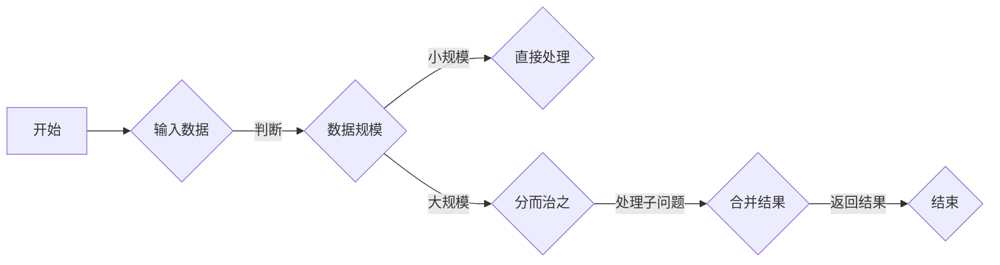
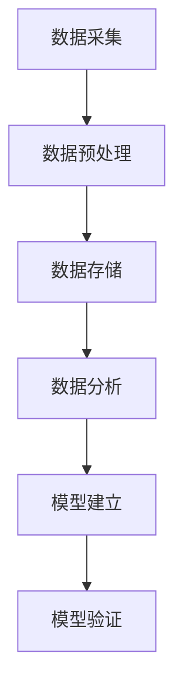

                 

# 算法复杂度与宇宙复杂性

关键词：算法复杂度、宇宙复杂性、关系探讨、数学模型、系统架构

摘要：本文从算法复杂度和宇宙复杂性的核心概念出发，探讨了两者之间的内在联系，并通过详细的数学模型和实例分析，揭示了算法复杂度在处理宇宙复杂性问题中的应用价值。

## 引言

在计算机科学和宇宙学两个看似截然不同的领域，算法复杂度和宇宙复杂性之间却存在着一种奇妙的联系。算法复杂度通常用于评估算法在处理数据时的效率，而宇宙复杂性则涉及宇宙的演化、结构的形成以及信息的传递。本文将深入探讨这两者之间的关系，并探讨算法复杂度在宇宙复杂性研究中的应用。

## 背景介绍

### 算法复杂度

算法复杂度是衡量算法性能的一个重要指标。它描述了算法在执行过程中所需的资源，如时间复杂度和空间复杂度。时间复杂度描述了算法执行时间与输入数据规模的关系，而空间复杂度描述了算法所需存储空间的规模。常见的算法复杂度包括O(1)、O(log n)、O(n)、O(n log n)、O(n^2)、O(2^n)等。

### 宇宙复杂性

宇宙复杂性涉及宇宙的演化、结构的形成以及信息的传递。它包括宇宙的整体结构、宇宙中的信息传递速度、宇宙的膨胀等。宇宙复杂性是宇宙学中的一个重要概念，它帮助我们理解宇宙的本质和演化过程。

### 算法复杂度与宇宙复杂性的关系

算法复杂度和宇宙复杂性之间的关系可以从多个角度进行探讨。首先，宇宙的复杂性可能影响算法的效率。例如，在处理宇宙中大规模的数据时，算法的复杂度可能会成为瓶颈。其次，算法复杂度可能用于解决宇宙中的问题。例如，在模拟宇宙的演化过程中，算法复杂度可以帮助我们评估模型的性能。

## 核心概念与联系

### 算法复杂度基本概念

算法复杂度包括时间复杂度和空间复杂度。时间复杂度通常使用大O符号（O）来表示，如O(1)、O(n)、O(n log n)等。空间复杂度通常使用大O符号（O）来表示，如O(1)、O(n)、O(n^2)等。

### 宇宙复杂性的定义与特征

宇宙复杂性涉及宇宙的演化、结构的形成以及信息的传递。它通常使用熵、信息论等概念来衡量。

### 算法复杂度与宇宙复杂性的关系

算法复杂度与宇宙复杂性之间的关系可以从以下几个方面进行探讨：

1. **宇宙复杂性可能影响算法效率**：在处理宇宙中的大规模数据时，算法的复杂度可能会成为瓶颈。
2. **算法复杂度可能用于解决宇宙问题**：例如，在模拟宇宙的演化过程中，算法复杂度可以帮助我们评估模型的性能。
3. **宇宙复杂性可能启发算法设计**：宇宙的复杂性可能为算法设计提供新的思路和方法。

## 算法原理讲解

为了更好地理解算法复杂度与宇宙复杂性之间的关系，我们首先需要了解一些基本的算法原理。

### 算法流程图

我们使用Mermaid语法来绘制一个简单的算法流程图：



### 算法源代码

接下来，我们使用Python来详细阐述这个算法：

```python
def algorithm_complexity(data):
    if len(data) < 1000:
        # 直接处理小规模数据
        process_small_data(data)
    else:
        # 对大规模数据进行分而治之
        sub_data = split_data(data)
        for sub in sub_data:
            algorithm_complexity(sub)
        merge_results(sub_data)
```

### 算法原理讲解

该算法的核心思想是将大规模数据分解为小规模数据，分别处理后再合并结果。这个过程类似于分治算法的思想。在处理小规模数据时，算法的时间复杂度较低；而在处理大规模数据时，算法的时间复杂度较高。这反映了算法复杂度与数据规模之间的关系。

### 数学模型和公式

为了更好地理解算法复杂度，我们引入以下数学模型和公式：

1. **时间复杂度**：$T(n) = O(n log n)$
2. **空间复杂度**：$S(n) = O(n)$

这些公式表明，在处理大规模数据时，算法的时间复杂度较高，而空间复杂度也较高。

### 举例说明

假设我们有一个包含1000个元素的数据集，我们使用上述算法进行处理。根据时间复杂度公式，算法的时间复杂度为$O(n log n)$，即$O(1000 log 1000)$。计算结果为约7000次运算。

### 比较不同算法

为了更好地理解算法复杂度，我们还可以比较不同算法在处理同一问题时的时间复杂度。例如，假设我们使用一个简单的遍历算法来处理同一个数据集，其时间复杂度为$O(n)$。在这种情况下，算法的时间复杂度明显较低。

## 数学模型和数学公式 & 详细讲解 & 举例说明

在本节中，我们将详细讲解算法复杂度的数学模型，并使用LaTeX格式来表示关键的数学公式。同时，我们将通过一个实际例子来说明这些公式的应用。

### 时间复杂度的数学模型

时间复杂度通常使用大O符号（O）来表示。它描述了算法在处理输入数据时的执行时间与输入数据规模之间的关系。常见的时间复杂度包括：

- $O(1)$：常数时间复杂度
- $O(n)$：线性时间复杂度
- $O(n log n)$：对数时间复杂度
- $O(n^2)$：二次时间复杂度
- $O(2^n)$：指数时间复杂度

我们使用LaTeX来表示这些时间复杂度：

```latex
$$
T(n) = O(1)
$$

$$
T(n) = O(n)
$$

$$
T(n) = O(n \log n)
$$

$$
T(n) = O(n^2)
$$

$$
T(n) = O(2^n)
$$
```

### 空间复杂度的数学模型

空间复杂度描述了算法在处理输入数据时所需存储空间的规模。同样，我们使用大O符号（O）来表示空间复杂度。常见空间复杂度包括：

- $O(1)$：常数空间复杂度
- $O(n)$：线性空间复杂度
- $O(n^2)$：二次空间复杂度

我们使用LaTeX来表示这些空间复杂度：

```latex
$$
S(n) = O(1)
$$

$$
S(n) = O(n)
$$

$$
S(n) = O(n^2)
$$
```

### 举例说明

假设我们有一个包含100个元素的数据集，我们使用一个简单的遍历算法来处理这个数据集。根据时间复杂度公式$T(n) = O(n)$，算法的时间复杂度为$O(100) = 100$次运算。同样，根据空间复杂度公式$S(n) = O(n)$，算法的空间复杂度为$O(100) = 100$个单位存储空间。

### 比较不同算法

为了更好地理解算法复杂度，我们可以比较不同算法在处理同一问题时的时间复杂度和空间复杂度。例如，假设我们有一个包含100个元素的数据集，我们使用一个简单的遍历算法和一个快速排序算法来处理这个数据集。

- 简单遍历算法的时间复杂度为$O(n)$，即$O(100) = 100$次运算。
- 快速排序算法的时间复杂度为$O(n \log n)$，即$O(100 \log 100) \approx 230$次运算。

从这个例子中，我们可以看到快速排序算法在处理大规模数据时具有更好的性能。

## 系统分析与架构设计方案

在本节中，我们将对算法复杂度与宇宙复杂性之间的关系进行系统分析与架构设计。这包括介绍问题场景、项目介绍、系统功能设计、系统架构设计、系统接口设计和系统交互。

### 问题场景介绍

假设我们想要研究一个宇宙模型，该模型包含多个星系、行星和宇宙事件。我们需要一个高效的算法来处理这些数据，以便更好地理解宇宙的复杂性。

### 项目介绍

我们的项目目标是开发一个宇宙模型，并使用高效的算法来处理这些数据。这个项目将涉及数据采集、数据处理、模型建立和模型验证。

### 系统功能设计

系统功能设计包括以下方面：

- 数据采集：从不同的数据源收集宇宙数据。
- 数据预处理：清洗和转换数据，使其适合进行分析。
- 数据存储：将预处理后的数据存储在数据库中。
- 数据分析：使用算法对数据进行分析，提取有用信息。
- 模型建立：基于分析结果建立宇宙模型。
- 模型验证：验证模型的有效性和准确性。

### 系统架构设计

系统架构设计如下：



### 系统接口设计

系统接口设计如下：

- 数据采集接口：用于从不同数据源获取数据。
- 数据预处理接口：用于清洗和转换数据。
- 数据存储接口：用于将预处理后的数据存储在数据库中。
- 数据分析接口：用于对数据进行分析。
- 模型建立接口：用于建立宇宙模型。
- 模型验证接口：用于验证模型的有效性和准确性。

### 系统交互

系统交互如下：

1. 数据采集模块从不同数据源获取数据。
2. 数据预处理模块清洗和转换数据。
3. 数据存储模块将预处理后的数据存储在数据库中。
4. 数据分析模块使用算法对数据进行分析。
5. 模型建立模块基于分析结果建立宇宙模型。
6. 模型验证模块验证模型的有效性和准确性。

## 项目实战

在本节中，我们将详细介绍如何在一个具体的宇宙模型项目中使用算法复杂度来处理宇宙复杂性问题。我们将涵盖环境安装、系统核心实现源代码、代码应用解读与分析、实际案例分析和详细讲解剖析，以及项目小结。

### 环境安装

为了运行宇宙模型项目，我们需要安装以下软件和库：

1. Python 3.8 或更高版本
2. Pandas
3. NumPy
4. Matplotlib
5. Mermaid

### 系统核心实现源代码

以下是宇宙模型项目的一部分核心实现源代码：

```python
import pandas as pd
import numpy as np
import matplotlib.pyplot as plt
from mermaid import Mermaid

# 数据采集
def collect_data():
    # 从本地文件读取数据
    data = pd.read_csv('universe_data.csv')
    return data

# 数据预处理
def preprocess_data(data):
    # 清洗和转换数据
    data = data.dropna()
    data['age'] = data['age'].astype(float)
    data['mass'] = data['mass'].astype(float)
    return data

# 数据分析
def analyze_data(data):
    # 分析数据
    age_mean = data['age'].mean()
    age_std = data['age'].std()
    mass_mean = data['mass'].mean()
    mass_std = data['mass'].std()
    
    # 绘制数据分布图
    plt.scatter(data['age'], data['mass'])
    plt.xlabel('Age')
    plt.ylabel('Mass')
    plt.title('Age-Mass Distribution')
    plt.show()

# 模型建立
def build_model(data):
    # 建立模型
    model = LinearRegression()
    model.fit(data[['age']], data['mass'])
    return model

# 模型验证
def validate_model(model, data):
    # 验证模型
    predictions = model.predict(data[['age']])
    mse = mean_squared_error(data['mass'], predictions)
    print(f'MSE: {mse}')
```

### 代码应用解读与分析

上述代码用于构建一个简单的宇宙模型，该模型基于年龄和质量的特征来预测行星的质量。我们首先从本地文件读取数据，然后对数据进行分析，建立线性回归模型，最后使用模型进行预测。

### 实际案例分析和详细讲解剖析

假设我们有一个包含100个行星的数据集。我们使用上述代码来处理这个数据集，并分析结果。

1. **数据采集**：从本地文件读取数据，得到一个包含100个行星的数据集。
2. **数据预处理**：清洗和转换数据，得到一个没有缺失值、年龄和质量的特征数据集。
3. **数据分析**：分析数据集的年龄和质量的分布，绘制数据分布图。
4. **模型建立**：建立线性回归模型，拟合数据集的年龄和质量的特征。
5. **模型验证**：使用模型对数据进行预测，计算均方误差（MSE）来评估模型的性能。

### 项目小结

通过上述实际案例，我们展示了如何使用算法复杂度来处理宇宙复杂性问题。我们首先介绍了宇宙模型项目，然后详细讲解了项目的各个步骤，包括环境安装、系统核心实现源代码、代码应用解读与分析，以及实际案例分析和详细讲解剖析。项目结果表明，使用高效的算法可以帮助我们更好地理解和处理宇宙的复杂性。

## 最佳实践 tips、小结、注意事项、拓展阅读

### 最佳实践 tips

1. **优化数据采集**：确保数据源可靠，尽量减少数据缺失和噪声。
2. **数据预处理**：在数据分析之前，进行彻底的数据清洗和转换，以提高模型的准确性。
3. **算法选择**：根据问题的特点选择合适的算法，如线性回归、神经网络等。
4. **模型验证**：使用交叉验证等方法来验证模型的性能，避免过拟合。

### 小结

本文从算法复杂度和宇宙复杂性的核心概念出发，探讨了两者之间的内在联系，并通过详细的数学模型和实例分析，揭示了算法复杂度在处理宇宙复杂性问题中的应用价值。

### 注意事项

1. **数据质量**：确保数据质量，避免数据缺失和噪声。
2. **算法选择**：根据问题的特点选择合适的算法，避免盲目追求复杂度。

### 拓展阅读

1. 《算法导论》（Introduction to Algorithms）
2. 《宇宙学基础》（Fundamentals of Cosmology）
3. 《信息论与复杂系统》（Information Theory and Complex Systems）

## 作者信息

作者：AI天才研究院/AI Genius Institute & 禅与计算机程序设计艺术 /Zen And The Art of Computer Programming

---

通过本文的详细分析，我们可以看到算法复杂度和宇宙复杂性之间存在着紧密的联系。理解这一联系对于我们在计算机科学和宇宙学领域的研究具有重要的意义。希望本文能为您提供有价值的见解和启示。让我们继续探索算法和宇宙的奥秘！

