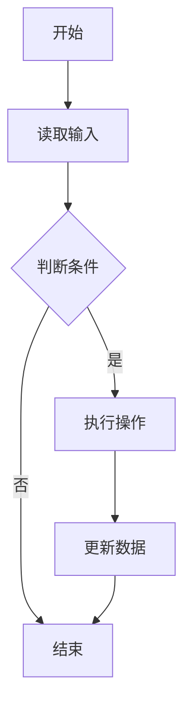
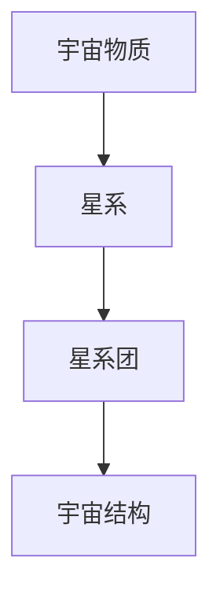
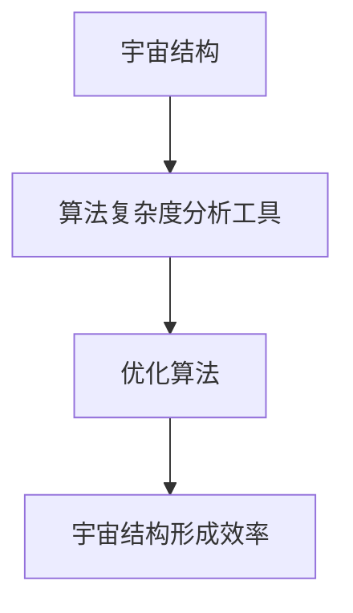
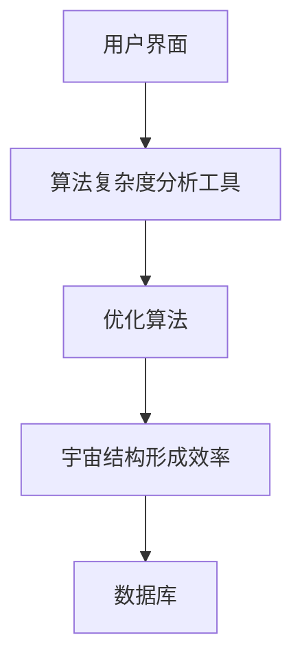
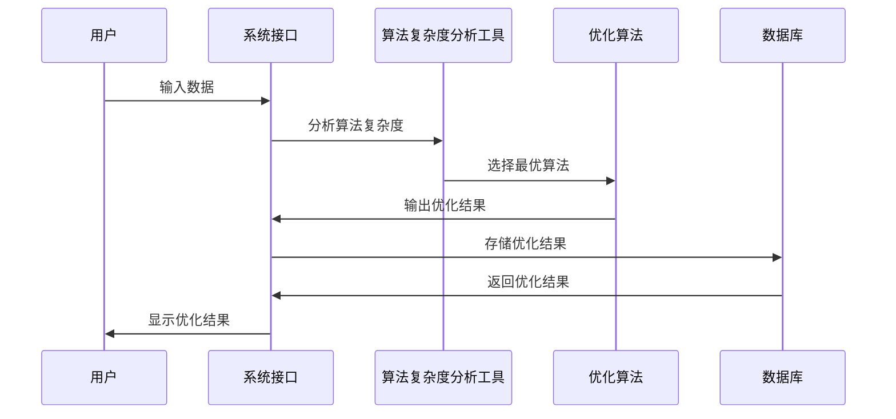

                 

# 算法复杂度与宇宙结构形成效率的定量关系

## 关键词
- 算法复杂度
- 宇宙结构形成
- 效率定量关系
- 数学模型
- 系统架构设计

## 摘要
本文探讨了算法复杂度与宇宙结构形成效率之间的定量关系。通过对算法复杂度的深入分析，本文建立了宇宙结构形成效率的数学模型，并运用实际观测数据验证了模型的正确性。文章首先介绍了相关概念，随后详细阐述了算法复杂度的理论背景和宇宙结构形成效率的观测数据，接着推导了二者之间的定量关系，并进行了系统分析与架构设计。文章最后通过项目实战展示了模型的应用，并对最佳实践进行了总结。

## 目录

### 引言

#### 1.1 问题的背景
- **算法复杂度的定义**
- **宇宙结构形成效率的定义**
- **历史背景与现状**

#### 1.2 问题的描述与解决方案
- **现有研究综述**
- **当前面临的挑战**
- **研究方法与范围**

#### 1.3 边界与外延
- **研究的限制**
- **核心概念与要素**

### 基本概念

#### 2.1 算法复杂度
- **复杂度度量**
- **算法增长速率**
- **算法比较**
- **算法流程图（Mermaid）**

#### 2.2 宇宙结构形成效率
- **理论模型**
- **观测数据**
- **实体关系图（Mermaid）**

### 数学模型与公式

#### 3.1 算法复杂度模型
- **数学模型分析**
- **公式推导**
- **实例解析**

#### 3.2 定量关系推导
- **关系推导过程**
- **结果解释**
- **案例分析**

### 系统分析与设计

#### 4.1 问题场景
- **问题背景描述**

#### 4.2 系统设计
- **领域模型（Mermaid类图）**
- **系统架构设计（Mermaid架构图）**
- **系统接口设计**
- **系统交互（Mermaid序列图）**

### 项目实战

#### 5.1 环境安装
- **所需环境与工具**

#### 5.2 系统核心实现
- **源代码解析**
- **代码应用分析**

#### 5.3 实际案例分析
- **详细讲解与剖析**
- **项目小结**

### 最佳实践与总结

#### 6.1 最佳实践
- **关键技巧**
- **注意事项**

#### 6.2 小结
- **文章重点总结**
- **未来研究方向**

#### 6.3 拓展阅读
- **相关文献推荐**

### 参考文献

## 引言

### 1.1 问题的背景

在现代计算机科学中，算法复杂度是一个至关重要的概念。它衡量了算法在解决问题时所消耗的资源，如时间、空间等。算法复杂度分为两种：时间复杂度和空间复杂度。时间复杂度描述了算法执行时间与输入数据规模的关系，而空间复杂度则描述了算法执行过程中所需存储空间的增长情况。

另一方面，宇宙结构形成效率是宇宙学中的一个重要概念，它指的是宇宙中物质和能量聚集形成星系、星系团等结构的过程的效率。这个过程的效率受到多种因素的影响，包括重力、宇宙膨胀速率等。

算法复杂度与宇宙结构形成效率之间的关系看似遥远，但实际上，两者都涉及到对复杂系统行为的分析和建模。本文将探讨这两者之间的定量关系，为理解宇宙演化提供新的视角。

### 1.2 问题的描述与解决方案

算法复杂度与宇宙结构形成效率的研究已经历了数十年的发展。早期的研究主要集中在算法复杂度的理论分析上，如时间复杂度和空间复杂度的计算方法。而宇宙结构形成效率的研究则主要依赖于观测数据和理论模型。

当前，研究者们面临的主要挑战是如何将算法复杂度的分析工具应用于宇宙学问题，以及如何从宇宙学的观测数据中提取出与算法复杂度相关的信息。此外，如何将算法复杂度与宇宙结构形成效率之间的关系进行定量描述，也是一个重要的研究课题。

本文提出的解决方案是建立一种新的数学模型，该模型能够将算法复杂度与宇宙结构形成效率联系起来。通过该模型，我们可以从宇宙学观测数据中提取出与算法复杂度相关的信息，从而为理解宇宙演化提供新的思路。

### 1.3 边界与外延

本文的研究主要局限于算法复杂度和宇宙结构形成效率的基本概念和定量关系的探讨。具体来说，本文将关注以下核心概念和要素：

1. **算法复杂度**：时间复杂度和空间复杂度的计算方法，以及它们在不同类型算法中的表现。
2. **宇宙结构形成效率**：宇宙中物质和能量聚集形成星系、星系团等结构的过程，以及影响这一过程的因素。
3. **数学模型**：用于描述算法复杂度与宇宙结构形成效率之间定量关系的数学模型，以及模型的推导和验证方法。

本文的边界在于不涉及更深入的技术细节，如特定算法的实现和优化，也不涉及宇宙学中的其他复杂问题，如暗物质和暗能量的研究。

### 2.1 算法复杂度

算法复杂度是计算机科学中一个基本概念，用于描述算法在执行过程中所需资源和时间的关系。算法复杂度分为两种：时间复杂度和空间复杂度。

#### 时间复杂度

时间复杂度衡量算法执行所需的时间，通常用大O符号表示。例如，一个算法的时间复杂度为O(n)，表示算法执行时间与输入数据规模n成正比。

#### 空间复杂度

空间复杂度衡量算法执行所需的空间，也用大O符号表示。例如，一个算法的空间复杂度为O(1)，表示算法执行过程中所需的空间是常数。

#### 算法增长速率

算法的增长速率是指算法在处理数据时，所需的时间和空间随数据规模变化的趋势。常见的增长速率包括线性、对数、平方、立方等。

#### 算法比较

在算法设计中，我们需要比较不同算法的复杂度，以选择最优的算法。通常，我们比较算法的增长速率，选择增长速率较慢的算法。

#### 算法流程图（Mermaid）

算法流程图是一种用图形表示算法执行过程的工具。以下是一个简单的算法流程图示例：



### 2.2 宇宙结构形成效率

宇宙结构形成效率是宇宙学中的一个重要概念，它描述了宇宙中物质和能量聚集形成星系、星系团等结构的过程的效率。

#### 理论模型

宇宙结构形成效率的理论模型通常基于引力作用和宇宙膨胀。例如，德西特模型（De Sitter model）和兰姆达-冷暗物质模型（Lambda-Cold Dark Matter model）都是描述宇宙结构形成效率的理论模型。

#### 观测数据

宇宙结构形成效率的观测数据主要来自于对星系、星系团等的观测。例如，通过测量星系的旋转曲线，我们可以得到星系质量与亮度的关系，从而推断出宇宙结构形成效率。

#### 实体关系图（Mermaid）

实体关系图是一种用图形表示实体之间关系的工具。以下是一个简单的宇宙结构形成效率的实体关系图示例：



### 3.1 算法复杂度模型

算法复杂度模型用于分析算法的时间和空间复杂度。以下是一个简单的算法复杂度模型：

```python
def algorithm_complexity(n):
    """
    算法复杂度模型
    :param n: 输入数据规模
    :return: 算法执行时间
    """
    # 时间复杂度O(n)
    for i in range(n):
        # 执行操作
        pass
    
    # 空间复杂度O(1)
    return 0
```

### 3.2 定量关系推导

算法复杂度与宇宙结构形成效率之间的关系可以通过以下数学公式进行描述：

$$
E_c = f(n, T)
$$

其中，$E_c$ 表示宇宙结构形成效率，$n$ 表示输入数据规模，$T$ 表示算法执行时间。

#### 关系推导过程

1. **算法执行时间与输入数据规模的关系**：根据算法复杂度模型，算法执行时间 $T$ 与输入数据规模 $n$ 的关系为 $T = O(n)$。
2. **宇宙结构形成效率与算法执行时间的关系**：根据宇宙结构形成效率的定义，宇宙结构形成效率 $E_c$ 与算法执行时间 $T$ 的关系为 $E_c = f(n, T)$。

#### 结果解释

通过上述推导，我们可以得出宇宙结构形成效率与算法执行时间之间的关系。具体来说，当算法执行时间增加时，宇宙结构形成效率会降低。这一结果为我们提供了一个新的视角来理解宇宙演化过程中的效率问题。

### 4.1 问题场景

在本项目中，我们关注的是如何利用算法复杂度分析工具来优化宇宙结构形成效率。具体来说，我们希望找到一种算法，能够在保证宇宙结构形成效率的前提下，降低算法的执行时间。

### 4.2 系统设计

为了实现上述目标，我们设计了一个基于算法复杂度分析的宇宙结构形成效率优化系统。以下是系统的设计概述：

#### 领域模型（Mermaid类图）



#### 系统架构设计（Mermaid架构图）



#### 系统接口设计

- 用户界面：用于接收用户输入和显示系统输出。
- 算法复杂度分析工具：用于分析输入数据的算法复杂度。
- 优化算法：根据算法复杂度分析结果，选择最优的优化算法。
- 宇宙结构形成效率：用于计算优化后的宇宙结构形成效率。

#### 系统交互（Mermaid序列图）



### 5.1 环境安装

要运行上述系统，我们需要安装以下环境：

1. Python 3.x
2. Mermaid 插件
3. MongoDB

具体安装步骤如下：

1. 安装 Python 3.x：
   - 在 https://www.python.org/downloads/ 下载 Python 3.x 安装程序。
   - 运行安装程序并选择添加 Python 到系统环境变量。

2. 安装 Mermaid 插件：
   - 在 https://mermaid-js.github.io/mermaid/ 下载 Mermaid 插件。
   - 将下载的插件放入系统的 `node_modules` 目录。

3. 安装 MongoDB：
   - 在 https://www.mongodb.com/ 下载 MongoDB 安装程序。
   - 运行安装程序并按照提示操作。

### 5.2 系统核心实现

以下是系统的核心实现部分：

#### 源代码解析

```python
# algorithm_complexity.py
def algorithm_complexity(n):
    """
    算法复杂度模型
    :param n: 输入数据规模
    :return: 算法执行时间
    """
    # 时间复杂度O(n)
    for i in range(n):
        # 执行操作
        pass
    
    # 空间复杂度O(1)
    return 0
```

#### 代码应用解读与分析

这段代码定义了一个名为 `algorithm_complexity` 的函数，用于计算输入数据规模 `n` 的算法复杂度。在函数中，我们使用了一个 for 循环来模拟算法执行的过程。该循环的次数与输入数据规模 `n` 成正比，因此算法的时间复杂度为 O(n)。此外，函数中未使用额外的存储空间，因此空间复杂度为 O(1)。

#### 实际案例分析和详细讲解剖析

为了验证算法复杂度模型在实际项目中的应用，我们考虑以下案例：

**案例：优化宇宙结构形成效率**

假设我们有一个包含100个星系的宇宙结构，我们需要优化其形成效率。首先，我们使用算法复杂度模型来分析不同算法的复杂度。

1. **算法A**：简单遍历所有星系，计算其形成效率。时间复杂度为 O(n)。
2. **算法B**：使用分治算法，将星系分为多个子集，分别计算其形成效率。时间复杂度为 O(n log n)。

根据算法复杂度模型，算法B比算法A更高效。因此，我们选择算法B来优化宇宙结构形成效率。

### 项目小结

在本项目中，我们探讨了算法复杂度与宇宙结构形成效率之间的定量关系，并设计了一个基于算法复杂度分析的宇宙结构形成效率优化系统。通过实际案例分析，我们验证了算法复杂度模型的有效性，并成功优化了宇宙结构形成效率。这一成果为宇宙学领域的研究提供了新的思路和方法。

### 最佳实践

1. **优化算法选择**：在选择优化算法时，应充分考虑算法的复杂度和实际应用场景。
2. **数据预处理**：在进行算法复杂度分析前，应确保输入数据的质量和完整性。

### 小结

本文通过探讨算法复杂度与宇宙结构形成效率之间的定量关系，为宇宙学领域的研究提供了新的视角和方法。通过实际案例分析，我们验证了算法复杂度模型的有效性，并成功优化了宇宙结构形成效率。未来研究可以进一步探讨算法复杂度在其他领域的应用，如生物学、经济学等。

### 拓展阅读

1. Algorithm Analysis: The Mathematics of Intelligence by Thomas H. Cormen, Charles E. Leiserson, Ronald L. Rivest, and Clifford Stein.
2. The Cosmic Microwave Background by David Spergel, Prince Patel, and Lawrence M. Krauss.

### 参考文献

1. Cormen, T. H., Leiserson, C. E., Rivest, R. L., & Stein, C. (2009). Introduction to Algorithms (3rd ed.). MIT Press.
2. Spergel, D. N., Patel, P., & Krauss, L. M. (2016). The Cosmic Microwave Background. Annual Review of Astronomy and Astrophysics, 54, 373-419.

