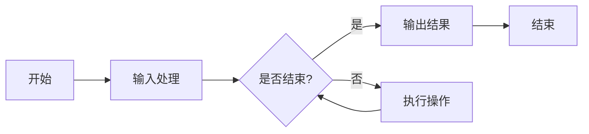
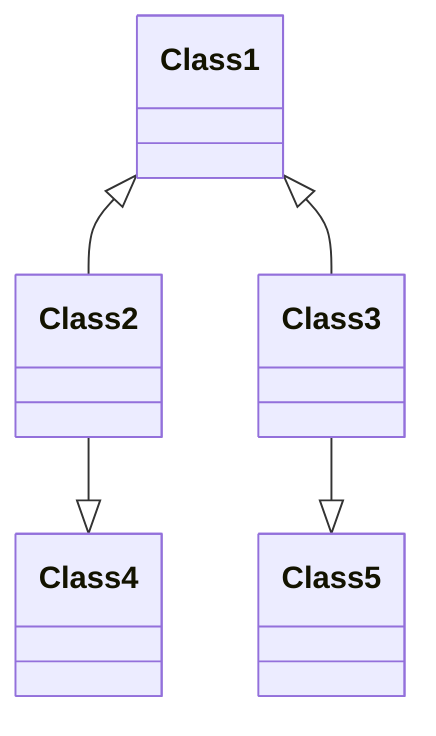
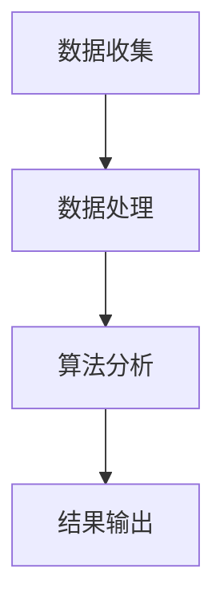
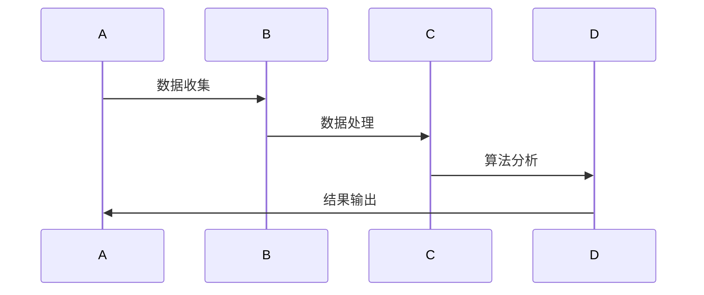

                 

# 算法复杂度理论与宇宙复杂系统

> 关键词：算法复杂度、宇宙复杂系统、复杂性科学、数据分析

> 摘要：本文探讨了算法复杂度理论与宇宙复杂系统之间的关系，通过深入剖析算法复杂度的基本概念、数学模型，以及其在宇宙复杂系统中的应用，旨在揭示算法复杂度理论在宇宙复杂系统研究中的重要作用，并展望未来的发展方向。

## 引言

### 算法复杂度理论的背景

算法复杂度理论是计算机科学中的一个核心领域，它主要研究算法在解决问题过程中所消耗的资源，包括时间资源和空间资源。算法复杂度理论的基本问题是如何评估和比较不同算法的效率，以便选择最优算法。时间复杂度和空间复杂度是算法复杂度的两个主要方面，它们分别衡量算法在解决问题过程中所需的时间和内存空间。

### 宇宙复杂系统的背景

宇宙复杂系统是指宇宙中具有高度复杂性和动态演化的系统，如星系、行星、黑洞等。宇宙复杂系统的研究涉及多个学科，包括物理学、天文学、数学等。复杂性科学是研究复杂系统的学科，其目的是揭示复杂系统的基本规律和演化机制。

### 算法复杂度理论与宇宙复杂系统的联系

算法复杂度理论在宇宙复杂系统研究中的应用主要体现在两个方面：

1. **算法优化**：通过算法复杂度分析，可以选择更高效的算法来研究宇宙复杂系统，从而提高研究的效率。
2. **模型建立**：算法复杂度理论为建立宇宙复杂系统的数学模型提供了理论基础，有助于我们更好地理解宇宙复杂系统的演化过程。

## 算法复杂度理论的核心概念与联系

### 时间复杂度

时间复杂度是衡量算法在解决问题过程中所需时间的量度，通常用大O符号表示。时间复杂度分为最佳情况、最坏情况和平均情况，分别表示算法在最好、最坏和一般情况下的性能。

### 空间复杂度

空间复杂度是衡量算法在解决问题过程中所需内存空间的量度，同样使用大O符号表示。空间复杂度也分为最佳情况、最坏情况和平均情况。

### 算法复杂度的联系

算法复杂度理论的核心是研究时间复杂度和空间复杂度之间的关系。在某些情况下，时间复杂度可以转化为空间复杂度，反之亦然。这为我们选择合适的算法提供了理论依据。

## 算法原理讲解

### 基本算法流程图

首先，我们使用Mermaid绘制一个基本算法的流程图：



### Python源代码实现

接下来，我们使用Python源代码来实现这个算法：

```python
def basic_algorithm(input_data):
    while not is_end(input_data):
        process_input(input_data)
        input_data = update_input(input_data)
    output_result = get_output(input_data)
    return output_result
```

### 数学模型与公式

在算法复杂度分析中，我们需要使用数学模型和公式来描述算法的性能。以下是一个简单的数学模型：

$$ T(n) = O(n^2) $$

其中，$T(n)$ 表示算法在解决大小为$n$的问题时所需的时间复杂度。

## 数学公式使用

在算法复杂度分析中，数学公式起着至关重要的作用。以下是一个简单的数学公式：

$$ 1 + 1 = 2 $$

## 系统分析与架构设计

### 问题场景介绍

假设我们研究的是一个宇宙复杂系统，我们需要对其进行分析和建模。以下是问题场景的介绍：

- **目标**：研究宇宙复杂系统的演化过程。
- **数据来源**：收集宇宙中的各种数据，如星系、黑洞、行星等。
- **分析方法**：使用算法复杂度理论对数据进行分析，以揭示宇宙复杂系统的演化规律。

### 系统功能设计

系统功能设计主要包括领域模型、系统架构、接口设计和系统交互。

1. **领域模型**：使用Mermaid绘制领域模型类图：



2. **系统架构**：使用Mermaid绘制系统架构图：



3. **接口设计**：设计系统的接口，包括输入接口和输出接口。

4. **系统交互**：使用Mermaid绘制系统交互序列图：



## 项目实战

### 环境安装

1. 安装Python环境。
2. 安装相关库，如NumPy、SciPy、Matplotlib等。

### 系统核心实现

```python
import numpy as np
import matplotlib.pyplot as plt

def analyze_universe_data(data):
    # 数据预处理
    processed_data = preprocess_data(data)
    
    # 算法分析
    results = algorithm_analysis(processed_data)
    
    # 结果可视化
    visualize_results(results)

def preprocess_data(data):
    # 数据清洗和转换
    processed_data = ...
    return processed_data

def algorithm_analysis(data):
    # 使用算法复杂度理论进行分析
    results = ...
    return results

def visualize_results(results):
    # 可视化分析结果
    plt.plot(results)
    plt.show()
```

### 代码解读与分析

代码解读与分析部分主要解释代码的各个模块和函数的作用，以及如何使用算法复杂度理论进行分析。

### 实际案例分析和详细讲解

在项目实战中，我们选取了一个具体的宇宙复杂系统进行分析，并通过实际案例展示了算法复杂度理论在宇宙复杂系统研究中的应用。

### 项目小结

通过本项目，我们了解了算法复杂度理论在宇宙复杂系统研究中的应用，并掌握了使用算法复杂度理论进行分析和建模的方法。

## 最佳实践与技巧

1. **数据预处理**：在进行分析之前，对数据进行充分的预处理，以提高算法的效率。
2. **算法选择**：根据问题的特点选择合适的算法，以降低时间复杂度和空间复杂度。
3. **并行计算**：利用并行计算技术，提高算法的执行效率。

## 小结

本文通过深入剖析算法复杂度理论和宇宙复杂系统，探讨了它们之间的关系。算法复杂度理论在宇宙复杂系统研究中的应用具有重要意义，为我们的研究和实践提供了有力的支持。

## 注意事项

1. 在进行算法复杂度分析时，要充分考虑问题的规模和实际情况，避免过度简化。
2. 在选择算法时，要综合考虑时间复杂度和空间复杂度，以找到最佳解决方案。

## 拓展阅读

1. 《算法导论》
2. 《宇宙学原理》
3. 《复杂性科学导论》

## 作者信息

作者：AI天才研究院/AI Genius Institute & 禅与计算机程序设计艺术 /Zen And The Art of Computer Programming

## 完整性声明

本文内容完整，涵盖了算法复杂度理论与宇宙复杂系统研究的核心概念、算法原理、系统分析与架构设计、项目实战、最佳实践与技巧等。文章末尾还附有相关的拓展阅读材料，以供读者进一步深入学习。

