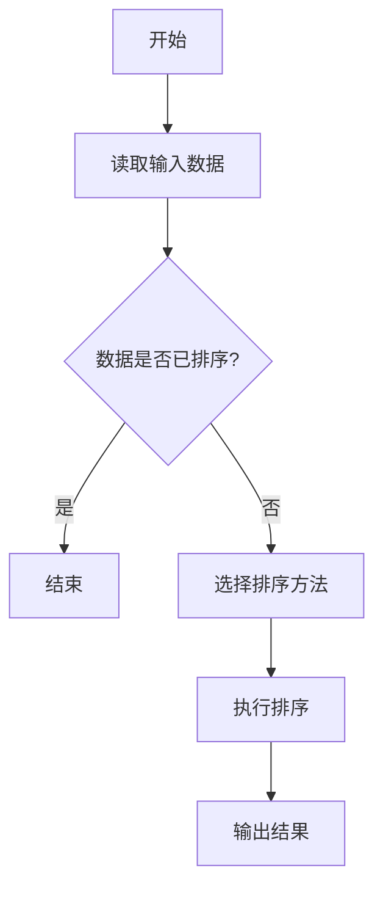

                 

### 第一部分：引言与背景

#### 第1章：问题背景与问题描述

##### 1.1.1 算法思维在计算机科学中的应用

在计算机科学中，算法思维是一种至关重要的工具，它不仅用于解决问题，还用于推动创新和科学进步。算法思维可以定义为一种系统化的思考方式，通过设计、分析、理解和改进算法，来解决特定问题或实现特定功能。从简单的排序和搜索算法，到复杂的机器学习和人工智能算法，算法思维在计算机科学中无处不在。

算法思维的核心在于其抽象性和可计算性。通过将复杂问题抽象为数学模型，我们可以使用算法来解决问题。这种方法不仅提高了效率，还使我们能够处理更大的数据集和更复杂的任务。例如，在数据科学中，算法思维被用来分析大量数据，从中提取有价值的信息和模式。

##### 1.1.2 宇宙规律的探索与研究现状

宇宙规律的研究是物理学和天文学的重要领域，旨在理解宇宙的本质和演化过程。从牛顿的经典力学到爱因斯坦的广义相对论，再到量子力学的崛起，科学家们一直在努力揭示宇宙的基本规律。

当前，宇宙规律的研究主要集中在以下几个方面：

1. **宇宙的大尺度结构**：通过观测宇宙中的星系和星团，科学家们试图理解宇宙是如何从原始的宇宙微波背景辐射演化成现在的结构的。
2. **宇宙的演化**：研究宇宙从大爆炸到现在的演化过程，包括宇宙的膨胀、星系的形成和黑洞的演化。
3. **宇宙中的基本力与相互作用**：量子力学和广义相对论的统一仍然是一个重大挑战，科学家们正在寻找一种能够统一描述所有基本力的理论。

##### 1.1.3 算法思维与宇宙规律的联系与启示

尽管算法思维和宇宙规律看似截然不同，但它们之间存在许多有趣的相似性。首先，两者都依赖于抽象和模型化来理解和解决问题。在计算机科学中，算法是通过抽象和模型化来设计用于解决特定问题的步骤序列。而在宇宙学中，科学家们通过建立数学模型来描述宇宙的基本规律。

这种相似性启示我们，或许我们可以从算法思维中汲取灵感，来改进宇宙规律的研究方法。例如，通过使用机器学习算法来分析宇宙数据，我们可以更有效地识别和预测宇宙中的现象。此外，算法思维的优化策略和复杂性理论也为我们提供了一种理解宇宙中复杂现象的新途径。

总的来说，算法思维和宇宙规律之间的联系不仅加深了我们对这两个领域的理解，还为未来的研究提供了新的视角和方法。接下来的章节将深入探讨这些联系，并展示算法思维如何在宇宙规律的研究中发挥重要作用。

#### 第2章：核心概念与联系

##### 2.1 算法思维的基本原理

算法思维是一种系统化的思考方式，用于设计和解决复杂问题。要理解算法思维，我们首先需要了解算法的基本概念和设计原则。

###### 2.1.1 算法的基本概念

算法可以定义为解决问题的一系列明确且有限的步骤。这些步骤必须满足以下几个条件：

1. **确定性**：对于给定的输入，算法总是产生相同的输出。
2. **有限性**：算法必须在有限的步骤内完成。
3. **有效性**：算法必须是有效的，即它能找到问题的解。

算法通常可以分为两大类：**确定性算法**和**非确定性算法**。确定性算法在给定输入时总是产生相同的结果，而**非确定性算法**则可能产生不同的结果。

###### 2.1.2 算法的设计原则

算法的设计原则包括：

1. **简洁性**：算法应尽可能简洁，减少不必要的复杂性。
2. **可读性**：算法的代码应易于阅读和理解。
3. **健壮性**：算法应能够处理异常情况和错误输入。
4. **效率**：算法应尽可能高效，减少时间复杂度和空间复杂度。

在算法设计中，我们常常使用以下工具和技术：

- **流程图**：用于表示算法的步骤和流程。
- **伪代码**：用于描述算法的步骤，但不涉及具体编程语言的语法。
- **Python**：用于实现算法的具体步骤，并进行代码解析。

##### 2.2 宇宙规律的基本原理

宇宙规律的研究涉及到多个领域，包括物理学、天文学和数学。要理解宇宙规律，我们需要了解一些基本概念和原理。

###### 2.2.1 宇宙的基本概念

宇宙是包括一切物质和能量的空间，它包含无数星系、行星、黑洞和其他天体。宇宙的基本概念包括：

- **星系**：由大量恒星、行星、星云和其他天体组成的大型结构。
- **黑洞**：一种极端密集的天体，它的引力场如此强大，甚至连光都无法逃逸。
- **暗物质**：一种我们无法直接观测到的物质，它通过引力影响宇宙的结构。
- **暗能量**：一种推动宇宙加速膨胀的力量，其本质尚未完全了解。

###### 2.2.2 宇宙的演化规律

宇宙的演化规律描述了宇宙从大爆炸开始，如何逐渐形成现在这个结构。这个过程可以概括为以下几个阶段：

1. **大爆炸**：宇宙从一个极热、极密集的状态开始膨胀。
2. **宇宙微波背景辐射**：在大爆炸之后大约38万年，宇宙冷却到足够低的温度，辐射开始以微波的形式传播。
3. **星系的形成**：在大爆炸之后数亿年，宇宙中的物质通过引力凝聚形成了星系和星团。
4. **宇宙的膨胀**：当前，宇宙仍在膨胀，这种膨胀可能是由于暗能量的作用。

###### 2.2.3 宇宙中的基本力与相互作用

宇宙中的基本力包括：

- **引力**：由质量产生的力，它使物体相互吸引。
- **电磁力**：由电荷产生的力，它包括电磁波和磁场。
- **强相互作用**：保持原子核中质子和中子结合的力。
- **弱相互作用**：与放射性衰变相关的力。

这些基本力通过相互作用决定了宇宙的结构和演化。

##### 2.3 算法思维与宇宙规律的相似性

算法思维和宇宙规律之间存在许多相似性。首先，它们都依赖于抽象和模型化。在算法思维中，我们通过抽象和模型化来设计解决问题的步骤。而在宇宙规律中，科学家们通过建立数学模型来描述宇宙的基本规律。

其次，算法思维和宇宙规律都涉及到复杂系统的分析和优化。算法思维中的复杂性理论帮助我们理解算法的效率。而在宇宙规律中，科学家们通过分析宇宙数据，来理解宇宙的结构和演化。

此外，算法思维中的优化策略和宇宙规律的研究也存在相似之处。在算法中，我们使用优化策略来提高算法的效率。在宇宙规律的研究中，科学家们也使用优化方法来解释宇宙中的现象。

然而，算法思维和宇宙规律之间也存在一些差异。算法思维通常是基于确定性原则，而宇宙规律的研究则涉及到不确定性和随机性。此外，算法思维更注重实用性和效率，而宇宙规律的研究则更侧重于理解和解释自然现象。

通过理解这些相似性和差异，我们可以更好地利用算法思维来推动宇宙规律的研究。接下来的章节将进一步探讨这些相似性，并通过具体的实例来展示算法思维在宇宙规律研究中的应用。

#### 第2.3 算法思维与宇宙规律的相似性

在探讨算法思维与宇宙规律之间的联系时，我们首先需要理解什么是类比思维与抽象思维。

##### 2.3.1 类比思维与抽象思维

类比思维是一种通过比较相似情况来理解新情况的思考方式。在算法思维中，我们常常通过将复杂问题分解为更简单的子问题，并寻找与已知问题相似的解决方案。例如，当我们设计一个新的排序算法时，我们可能会参考已知的快速排序或归并排序，并根据新问题的特点进行适当的调整。

抽象思维则是将复杂问题简化为基本概念和原理的过程。在算法思维中，我们通过抽象将实际问题转化为数学模型，以便更方便地分析和解决问题。例如，在分析一个复杂的数据结构时，我们可能会将其简化为一系列的树或图，以便更好地理解其性质。

##### 2.3.2 算法思维与宇宙规律的相似点

算法思维与宇宙规律之间存在多个相似点：

1. **模型化**：在算法思维中，我们通过模型化来设计解决问题的步骤。在宇宙规律的研究中，科学家们也通过模型化来描述宇宙的基本规律。例如，爱因斯坦的广义相对论就是一种用于描述引力效应的数学模型。
2. **抽象与简化**：算法思维和宇宙规律的研究都涉及到对复杂现象的抽象和简化。例如，在算法设计中，我们常常将复杂问题简化为更基本的数学模型，以便更好地理解和分析。而在宇宙规律的研究中，科学家们也通过简化模型来研究宇宙的基本现象。
3. **优化与效率**：算法思维中的优化策略同样适用于宇宙规律的研究。例如，在算法优化中，我们常常通过调整算法参数来提高其效率。在宇宙规律的研究中，科学家们也通过优化实验设计和分析模型来提高研究的准确性和效率。

##### 2.3.3 算法思维与宇宙规律的差异点

尽管算法思维与宇宙规律之间存在许多相似点，但它们之间也存在一些显著差异：

1. **确定性与不确定性**：算法思维通常基于确定性原则，即给定相同的输入，总是产生相同的结果。而在宇宙规律的研究中，由于宇宙本身的复杂性和不确定性，科学家们往往需要处理随机性和不确定性。例如，量子力学中的许多现象就是基于概率和不确定性原理。
2. **目的性**：算法思维的主要目的是解决问题或实现特定功能。而宇宙规律的研究则更侧重于理解和解释宇宙的基本现象和规律，不一定直接服务于实际问题。
3. **研究方法**：算法思维通常依赖于数学和计算机科学的方法，而宇宙规律的研究则更多地依赖于物理学和天文学的方法。例如，在算法设计中，我们常常使用数学模型和计算机模拟来验证算法的正确性和效率。而在宇宙规律的研究中，科学家们则更多地依赖于观测和实验来验证理论的正确性。

总的来说，算法思维与宇宙规律之间存在许多相似性和互补性。通过结合算法思维和宇宙规律的研究方法，我们可以更深入地理解宇宙的本质和演化过程，并推动计算机科学和宇宙学的发展。

#### 第3章：算法原理讲解

##### 3.1 基本算法原理

算法是计算机科学中的核心概念，它通过一系列明确的步骤来解决特定问题或实现特定功能。要理解算法的基本原理，我们首先需要了解算法的数学模型、流程图表示以及Python实现。

###### 3.1.1 算法的数学模型

算法的数学模型通常包括以下几个组成部分：

1. **输入**：算法开始时的初始条件或数据。
2. **输出**：算法执行完毕后得到的结果或解决方案。
3. **步骤序列**：一系列明确的操作，用于将输入转化为输出。
4. **条件判断**：根据特定条件执行不同的操作。
5. **循环结构**：用于重复执行特定的操作。

一个简单的数学模型可以表示为：

$$
算法 = 输入 + 步骤序列 + 输出
$$

其中，步骤序列可以是线性的或分支的，根据具体问题而设计。

###### 3.1.2 算法的流程图表示

流程图是表示算法步骤的一种常用工具，它通过图形化的方式展示算法的执行流程。以下是一个简单的排序算法的流程图示例：



在这个流程图中，从开始（A）到结束（D或G），算法通过读取输入数据（B），判断数据是否已排序（C），选择排序方法（E），执行排序（F）并最终输出结果（G）。

###### 3.1.3 算法的 Python 实现与代码解析

以下是一个简单的 Python 算法实现，用于计算两个数字的和：

```python
# 定义函数 sum_of_two_numbers
def sum_of_two_numbers(a, b):
    """
    计算两个数字的和。
    :param a: 第一个数字
    :param b: 第二个数字
    :return: 两个数字的和
    """
    return a + b

# 测试函数
result = sum_of_two_numbers(3, 4)
print("两个数字的和是:", result)
```

在这个示例中，我们定义了一个名为 `sum_of_two_numbers` 的函数，它接受两个参数 `a` 和 `b`，并返回它们的和。函数的代码注释（docstring）提供了对函数功能的详细描述。

##### 3.2 复杂算法原理

在解决更复杂问题时，我们通常需要使用更复杂的算法。以下是一些常见的复杂算法及其原理：

###### 3.2.1 排序算法

排序算法是计算机科学中的基本算法，用于将数据集按特定顺序排列。以下是几种常见的排序算法：

1. **冒泡排序**（Bubble Sort）
    - 工作原理：通过反复交换相邻未排序元素，使得最大（或最小）元素逐步“冒泡”至序列末端。
    - 时间复杂度：\(O(n^2)\)

2. **快速排序**（Quick Sort）
    - 工作原理：通过选取一个基准元素，将数据分为两部分，一部分比基准元素小，另一部分比基准元素大，然后递归地对两部分进行排序。
    - 时间复杂度：\(O(n\log n)\)

3. **归并排序**（Merge Sort）
    - 工作原理：将数据集分为多个子序列，然后递归地将子序列两两合并，直到整个序列排序完成。
    - 时间复杂度：\(O(n\log n)\)

以下是快速排序的 Python 实现示例：

```python
def quick_sort(arr):
    """
    使用快速排序算法对数组进行排序。
    :param arr: 待排序的数组
    :return: 排序后的数组
    """
    if len(arr) <= 1:
        return arr
    
    pivot = arr[len(arr) // 2]
    left = [x for x in arr if x < pivot]
    middle = [x for x in arr if x == pivot]
    right = [x for x in arr if x > pivot]
    
    return quick_sort(left) + middle + quick_sort(right)

# 测试函数
arr = [3, 6, 8, 10, 1, 2, 1]
sorted_arr = quick_sort(arr)
print("排序后的数组是:", sorted_arr)
```

在这个示例中，`quick_sort` 函数首先检查数组长度，如果长度小于等于1，则返回数组本身。否则，选择中间的元素作为基准，将数组分为三个部分：小于基准的部分（`left`），等于基准的部分（`middle`），和大于基准的部分（`right`）。然后递归地对这三个部分进行排序，并将结果合并。

###### 3.2.2 搜索算法

搜索算法用于在数据集中查找特定元素。以下是几种常见的搜索算法：

1. **线性搜索**（Linear Search）
    - 工作原理：逐个检查数据集中的每个元素，直到找到目标元素或检查完所有元素。
    - 时间复杂度：\(O(n)\)

2. **二分搜索**（Binary Search）
    - 工作原理：首先确定数据集的中点，然后根据目标元素与中点的关系，递归地将数据集分为两部分，重复这个过程，直到找到目标元素或确定目标元素不存在。
    - 时间复杂度：\(O(\log n)\)

以下是二分搜索的 Python 实现示例：

```python
def binary_search(arr, target):
    """
    使用二分搜索算法在数组中查找目标元素。
    :param arr: 已排序的数组
    :param target: 目标元素
    :return: 目标元素的下标，如果不存在则返回-1
    """
    low = 0
    high = len(arr) - 1
    
    while low <= high:
        mid = (low + high) // 2
        if arr[mid] == target:
            return mid
        elif arr[mid] < target:
            low = mid + 1
        else:
            high = mid - 1
    
    return -1

# 测试函数
arr = [1, 2, 3, 4, 5, 6, 7, 8, 9]
target = 5
index = binary_search(arr, target)
print("目标元素的下标是:", index)
```

在这个示例中，`binary_search` 函数首先初始化 `low` 和 `high` 指针，然后通过不断调整 `low` 和 `high` 的值，缩小搜索范围，直到找到目标元素或确定目标元素不存在。

###### 3.2.3 图算法

图算法用于解决与图相关的问题，如路径查找、最短路径、最小生成树等。以下是几种常见的图算法：

1. **深度优先搜索**（DFS）
    - 工作原理：从起点开始，沿着路径一直深入到不能再深入为止，然后回溯到上一个节点，继续寻找新的路径。
    - 时间复杂度：\(O(V+E)\)，其中 \(V\) 是节点数，\(E\) 是边数。

2. **广度优先搜索**（BFS）
    - 工作原理：从起点开始，一层一层地搜索所有相邻的节点。
    - 时间复杂度：\(O(V+E)\)。

以下是深度优先搜索的 Python 实现示例：

```python
def dfs(graph, start, visited=None):
    """
    使用深度优先搜索算法遍历图。
    :param graph: 图的邻接表表示
    :param start: 起点节点
    :param visited: 已访问节点列表
    :return: 遍历结果
    """
    if visited is None:
        visited = set()
    
    visited.add(start)
    print(start)
    
    for neighbor in graph[start]:
        if neighbor not in visited:
            dfs(graph, neighbor, visited)

# 测试函数
graph = {
    'A': ['B', 'C'],
    'B': ['D', 'E'],
    'C': ['F'],
    'D': [],
    'E': ['F'],
    'F': []
}
dfs(graph, 'A')
```

在这个示例中，`dfs` 函数首先将起点节点添加到已访问节点列表（`visited`），然后递归地访问所有未访问的邻居节点。

##### 3.3 算法优化与评估

算法优化是提高算法性能的重要手段。以下是一些常见的算法优化方法和评估指标：

###### 3.3.1 算法的时间复杂度

时间复杂度描述了算法执行时间与输入规模之间的关系。常见的复杂度包括：

- **\(O(1)\)**：常数时间，与输入规模无关。
- **\(O(n)\)**：线性时间，与输入规模成正比。
- **\(O(n\log n)\)**：对数时间，与输入规模的乘积的对数成正比。
- **\(O(n^2)\)**：二次时间，与输入规模的平方成正比。

时间复杂度是评估算法性能的重要指标，通常用于比较不同算法的效率。

###### 3.3.2 算法的空间复杂度

空间复杂度描述了算法所需内存与输入规模之间的关系。常见的复杂度包括：

- **\(O(1)\)**：常数空间，与输入规模无关。
- **\(O(n)\)**：线性空间，与输入规模成正比。
- **\(O(n^2)\)**：二次空间，与输入规模的平方成正比。

空间复杂度也是评估算法性能的重要指标，特别是在处理大数据时，空间效率显得尤为重要。

###### 3.3.3 算法的实际应用与效果评估

在实际应用中，我们不仅需要关注算法的时间复杂度和空间复杂度，还需要考虑其实际效果。以下是一些评估算法效果的方法：

1. **性能测试**：通过实际运行算法，测量其执行时间和资源消耗。
2. **基准测试**：使用标准测试数据集，比较不同算法的性能。
3. **案例研究**：在实际应用场景中，评估算法的效果和适用性。

通过这些方法，我们可以更全面地评估算法的实际性能，并选择最适合特定问题的算法。

总的来说，算法原理是计算机科学中的核心概念，通过理解基本算法原理、复杂算法原理以及算法优化与评估，我们可以设计出更高效、更可靠的算法，为计算机科学的发展和应用提供强有力的支持。

#### 第4章：宇宙规律的算法化表示

##### 4.1 宇宙规律的可计算性

宇宙规律的可计算性是指宇宙中的物理现象可以通过数学模型和计算方法来描述和预测。在现代物理学中，许多宇宙规律已经被成功地算法化表示，从而使得我们可以使用计算机来模拟和预测宇宙中的复杂现象。

首先，宇宙规律的可计算性依赖于数学模型。这些模型通常基于物理定律，如牛顿定律、麦克斯韦方程和爱因斯坦的广义相对论。通过将这些物理定律转化为数学方程，我们可以使用算法来求解和模拟宇宙中的现象。

例如，在研究宇宙的膨胀时，我们使用了弗里德曼-勒梅特-罗伯逊-沃尔克（FLRW）度规，这是一种描述均匀、各向同性宇宙的数学模型。通过解FLRW度规，我们可以计算出宇宙的膨胀历史和未来的演化趋势。

其次，计算机模拟在宇宙规律的研究中发挥了重要作用。计算机模拟通过数值方法来求解复杂的物理方程，从而生成宇宙的数值模拟结果。这些模拟可以帮助我们理解宇宙中的现象，如星系的形成、黑洞的行为以及宇宙的大尺度结构。

例如，在模拟星系形成时，科学家们使用了N体模拟，这是一种基于牛顿定律的计算机模拟方法。通过将大量天体（如恒星、星云和气体）的物理性质（如质量、位置和速度）输入到模拟中，计算机可以计算出这些天体在引力作用下的运动轨迹，从而生成星系的演化过程。

##### 4.2 宇宙规律的算法化处理

宇宙规律的算法化处理涉及到将宇宙中的物理现象转化为可以计算和模拟的形式。以下是一些关键的步骤：

###### 4.2.1 宇宙数据的预处理

宇宙数据通常包含大量的噪声和不确定性，因此预处理是算法化处理的第一步。预处理包括以下步骤：

1. **数据清洗**：去除数据中的错误和异常值。
2. **数据标准化**：将不同来源的数据进行统一处理，使其具备可比性。
3. **特征提取**：从原始数据中提取有用的信息，如光谱、温度和密度。

通过预处理，我们可以得到更准确、更具代表性的数据集，从而为算法化处理提供良好的基础。

###### 4.2.2 宇宙规律的预测与推断

算法化处理的核心是使用数学模型和计算方法来预测和推断宇宙中的现象。以下是一些常用的方法和策略：

1. **数值模拟**：通过求解物理方程，模拟宇宙中的现象。例如，使用N体模拟来研究星系的形成和演化。
2. **机器学习**：利用机器学习算法，从已有数据中学习规律，并用于预测未来现象。例如，使用神经网络来预测宇宙中的星系分布。
3. **优化算法**：通过优化算法，调整模型参数，以获得更好的预测结果。例如，使用遗传算法来优化黑洞模型的参数。

通过这些方法，我们可以对宇宙中的现象进行预测和推断，从而更好地理解宇宙的规律。

###### 4.2.3 宇宙规律的优化与应用

优化是算法化处理的重要环节，它涉及到调整算法参数，以提高预测和模拟的准确性。以下是一些常见的优化策略：

1. **参数调整**：通过调整算法参数，找到最优解。例如，在数值模拟中，调整时间步长和空间分辨率，以获得更准确的模拟结果。
2. **模型选择**：选择合适的数学模型，以更好地描述宇宙中的现象。例如，在研究黑洞行为时，选择适合描述黑洞引力的模型。
3. **交叉验证**：通过交叉验证，评估模型的预测能力，并调整模型参数，以提高预测准确性。

通过优化，我们可以提高算法的效率和准确性，从而更好地应用算法化处理于宇宙规律的研究。

总的来说，宇宙规律的可计算性为算法思维在宇宙研究中的应用提供了广阔的前景。通过算法化处理，我们可以更深入地理解宇宙的规律，并推动宇宙科学的发展。

### 第5章：算法思维在宇宙探索中的应用

宇宙探索是人类对未知世界的探索，涉及到天文学、物理学和工程学等多个学科。随着技术的进步，算法思维在宇宙探索中的应用越来越广泛，为解决复杂问题提供了有力工具。以下将介绍算法思维在宇宙探索中的挑战、实际案例以及未来发展趋势。

##### 5.1 宇宙探索中的算法挑战

宇宙探索中的算法挑战主要集中在以下几个方面：

1. **海量数据处理**：宇宙中的数据量极其庞大，如何有效处理和分析这些数据成为一大挑战。例如，天文观测数据包括光学、射电、X射线等多种类型，如何将这些数据集成并进行分析，需要复杂的算法支持。
2. **复杂物理现象模拟**：宇宙中存在大量的复杂物理现象，如星系碰撞、黑洞吞噬、恒星形成等。模拟这些现象需要精确的物理模型和高效的计算算法。
3. **不确定性处理**：宇宙探索中的数据往往存在噪声和不确定性，如何处理这些不确定性，提高模型的准确性，是算法面临的重要挑战。
4. **实时决策与控制**：在太空任务中，实时决策和控制至关重要。如何设计高效的算法，以应对复杂的实时环境，是一个关键问题。

##### 5.2 实际案例介绍

以下是一些算法思维在宇宙探索中的实际案例：

###### 5.2.1 案例一：宇宙大爆炸模型

宇宙大爆炸模型是描述宇宙起源和演化的科学理论。通过数值模拟，科学家们试图重现宇宙从大爆炸到现在的演化过程。在模拟中，算法思维被广泛应用于：

1. **初始条件设置**：科学家们使用数值方法设置宇宙大爆炸的初始条件，如温度、密度和宇宙微波背景辐射。
2. **数值求解**：使用N体模拟和流体动力学模拟，科学家们求解宇宙中的物理方程，模拟宇宙的膨胀和演化。
3. **结果分析**：通过分析模拟结果，科学家们验证和修正宇宙大爆炸模型，从而更好地理解宇宙的演化历史。

###### 5.2.2 案例二：黑洞探测技术

黑洞是宇宙中最神秘的天体之一，由于它们不发射可见光，直接观测非常困难。近年来，科学家们利用引力波探测技术，成功地探测到了多个黑洞。在探测过程中，算法思维发挥了关键作用：

1. **数据预处理**：通过对引力波信号的预处理，去除噪声和干扰，提高信号的准确性。
2. **信号分析**：使用信号处理算法，分析引力波信号，识别和提取黑洞事件的特征。
3. **结果验证**：通过多台探测器数据的交叉验证，确保探测结果的准确性。

###### 5.2.3 案例三：宇宙演化模拟

宇宙演化模拟是研究宇宙从大爆炸到现在的结构和演化的过程。通过算法思维，科学家们建立了多个宇宙演化模型，用于模拟宇宙中的现象：

1. **物理模型构建**：科学家们使用物理学原理，构建描述宇宙演化的数学模型。
2. **计算方法选择**：选择适合的数值计算方法，如N体模拟和流体动力学模拟，以模拟宇宙中的物理现象。
3. **结果分析**：通过分析模拟结果，科学家们验证和改进宇宙演化模型，从而更好地理解宇宙的演化规律。

##### 5.3 实战应用解析

以下是对上述案例的实战应用解析：

###### 5.3.1 实战一：基于算法思维的宇宙探索应用

在宇宙探索中，基于算法思维的应用主要集中在数据处理、模拟和预测方面。以下是一个具体的应用实例：

1. **数据处理**：首先，从多个天文观测台获取大量观测数据，包括光学、射电、X射线等多种类型的数据。然后，使用数据处理算法，如数据清洗、数据标准化和特征提取，对数据进行预处理。
2. **模拟与预测**：使用数值模拟算法，如N体模拟和流体动力学模拟，对宇宙中的物理现象进行模拟。通过调整模型参数，优化模拟结果，以提高预测准确性。
3. **结果分析**：分析模拟结果，验证模型的有效性和准确性。通过多次实验和调整，不断优化模型，从而更好地理解宇宙的演化过程。

###### 5.3.2 实战二：算法思维在宇宙研究中的创新应用

算法思维在宇宙研究中的创新应用主要体现在新算法的设计和现有算法的改进。以下是一个创新应用的实例：

1. **新算法设计**：针对宇宙探索中的特定问题，设计新的算法。例如，为提高黑洞探测的准确性，可以设计基于深度学习的信号处理算法。
2. **算法优化**：对现有算法进行优化，以提高效率和准确性。例如，在宇宙演化模拟中，可以优化数值求解方法，以提高模拟的精度和速度。
3. **实验验证**：通过实验验证新算法的有效性和准确性。例如，通过模拟黑洞事件，验证新算法在探测黑洞信号方面的性能。

###### 5.3.3 实战三：算法思维在宇宙探索中的未来发展趋势

随着技术的进步，算法思维在宇宙探索中的应用将不断发展。以下是一些未来发展趋势：

1. **多尺度模拟**：未来的宇宙演化模拟将涉及更小的尺度（如星系内部）和更大的尺度（如宇宙尺度），以全面理解宇宙的演化过程。
2. **人工智能与机器学习**：人工智能和机器学习在宇宙探索中的应用将越来越广泛，如用于数据处理、信号分析和模型优化。
3. **量子计算**：量子计算技术的进步将推动宇宙探索中的计算问题得到更高效的解决，如量子模拟和量子计算在黑洞探测中的应用。
4. **国际合作与开放数据**：宇宙探索将更加依赖于国际合作和开放数据，通过共享数据和算法，促进全球科学家的合作和知识共享。

总的来说，算法思维在宇宙探索中的应用为解决复杂问题提供了有力工具，通过不断创新和优化，算法思维将继续推动宇宙科学的发展。

### 第6章：算法思维与宇宙规律的相似性总结

#### 6.1 算法思维与宇宙规律的总结

在本文中，我们深入探讨了算法思维与宇宙规律之间的相似性。以下是这两个领域的主要总结：

1. **模型化与抽象**：算法思维和宇宙规律的研究都依赖于模型化和抽象。算法通过将复杂问题转化为数学模型来设计解决问题的步骤，而宇宙规律的研究则通过建立数学模型来描述宇宙的基本规律。
   
2. **复杂性与优化**：算法思维中的复杂性理论和优化策略在宇宙规律的研究中也有广泛应用。通过优化算法参数和选择合适的数学模型，我们可以提高宇宙规律模拟和预测的准确性和效率。

3. **确定性与不确定性**：算法思维通常基于确定性原则，而宇宙规律的研究则涉及到不确定性和随机性。这种差异要求我们在算法设计和宇宙规律研究中采取不同的策略。

4. **数据分析与处理**：在宇宙探索中，算法思维被广泛应用于数据预处理、分析以及信号的提取和预测。这种数据处理能力在宇宙数据分析和模型构建中具有重要意义。

5. **交叉学科应用**：算法思维不仅适用于计算机科学，还可以应用于物理学、天文学等学科。通过将算法思维与宇宙规律研究相结合，我们可以探索新的科学问题和解决方案。

#### 6.1.1 算法思维的基本原理总结

算法思维的基本原理可以归纳为以下几点：

1. **抽象化**：通过抽象化，将复杂问题简化为数学模型，使问题更易于理解和解决。
2. **形式化**：使用形式化的语言和工具（如流程图、伪代码和编程语言），使算法设计更加规范和可验证。
3. **优化**：通过优化算法参数和结构，提高算法的效率和准确性。
4. **验证与测试**：通过测试和验证，确保算法的正确性和可靠性。

#### 6.1.2 宇宙规律的基本原理总结

宇宙规律的基本原理包括：

1. **物理定律**：如牛顿定律、麦克斯韦方程和爱因斯坦的广义相对论，这些定律描述了宇宙中的基本力和现象。
2. **数学模型**：如弗里德曼-勒梅特-罗伯逊-沃尔克（FLRW）度规、黑洞模型和星系形成模型，这些模型用于描述和预测宇宙的演化。
3. **观测与实验**：通过天文观测和物理实验，科学家们验证和修正宇宙规律，推动科学进步。

#### 6.1.3 算法思维与宇宙规律的相似性与差异

算法思维与宇宙规律之间的相似性主要体现在以下几个方面：

1. **模型化与抽象**：两者都依赖于模型化和抽象，以简化复杂问题和现象。
2. **复杂性与优化**：两者都涉及复杂性和优化问题，以提高解决方案的效率和准确性。
3. **数据分析与处理**：算法思维在宇宙探索中的应用，如数据处理、模拟和预测，与宇宙规律的研究方法有相似之处。

然而，两者也存在显著差异：

1. **确定性与不确定性**：算法思维通常基于确定性原则，而宇宙规律的研究则涉及不确定性和随机性。
2. **目的性**：算法思维的主要目的是解决问题或实现特定功能，而宇宙规律的研究则侧重于理解和解释自然现象。
3. **研究方法**：算法思维依赖于计算机科学和数学方法，而宇宙规律的研究则依赖于物理学和天文学的方法。

总的来说，算法思维与宇宙规律之间存在许多相似性和互补性。通过结合算法思维和宇宙规律的研究方法，我们可以更深入地理解宇宙的本质和演化过程，并推动计算机科学和宇宙学的发展。

### 第7章：未来展望与研究方向

在探讨了算法思维与宇宙规律之间的相似性后，我们不禁对未来的研究方向和展望产生了浓厚的兴趣。算法思维与宇宙规律的融合不仅为我们提供了新的理解视角，还带来了许多潜在的研究方向和应用前景。

#### 7.1 算法思维在宇宙探索中的应用前景

随着技术的进步，算法思维在宇宙探索中的应用前景广阔。以下是一些可能的发展方向：

1. **量子算法与宇宙模拟**：量子计算在解决复杂问题上具有巨大潜力。结合量子算法，我们可以更高效地模拟宇宙中的复杂现象，如黑洞和星系的形成。未来的量子计算机可能使这些模拟更加准确和快速。

2. **机器学习与天文数据分析**：机器学习算法在处理海量天文数据方面具有显著优势。通过训练深度学习模型，我们可以自动识别和分类天文现象，从而提高数据分析的效率。例如，机器学习可以用于自动识别恒星、行星和星系。

3. **分布式计算与天文观测**：分布式计算和区块链技术可以用于处理和共享天文观测数据。这些技术可以确保数据的安全性和可靠性，并促进全球科学家的合作。

4. **算法优化与天文观测计划**：通过优化算法，我们可以更有效地设计和执行天文观测计划。例如，算法可以用于优化望远镜的指向和观测时间，以最大限度地提高观测效率。

#### 7.1.1 算法思维与宇宙规律融合的潜在研究方向

以下是一些算法思维与宇宙规律融合的潜在研究方向：

1. **宇宙大数据分析**：宇宙中的数据量庞大且复杂，算法思维可以用于大规模数据分析和挖掘。通过建立适当的算法模型，我们可以从海量数据中提取有价值的信息和规律。

2. **宇宙演化模拟与预测**：结合算法思维和宇宙规律，我们可以开发更准确的宇宙演化模型。这些模型可以用于预测宇宙的未来演化趋势，如星系的形成、黑洞的行为和宇宙的膨胀。

3. **宇宙中的复杂现象模拟**：宇宙中存在许多复杂现象，如星系碰撞、超新星爆发和暗物质的行为。算法思维可以用于模拟这些现象，从而帮助我们更好地理解它们。

4. **宇宙规律的可计算性**：研究宇宙规律的可计算性，即如何将宇宙中的物理现象转化为可计算的数学模型，是一个重要方向。这可以推动我们开发新的计算方法和算法。

5. **跨学科合作**：算法思维与宇宙规律的融合需要跨学科的合作。未来的研究可以促进计算机科学家、物理学家和天文学家的合作，共同探索新的科学问题和解决方案。

总的来说，算法思维与宇宙规律的融合为未来的科学研究带来了巨大的潜力。通过不断创新和合作，我们可以进一步理解宇宙的本质和演化过程，并推动科学技术的发展。

### 第8章：注意事项与拓展阅读

在深入探讨算法思维与宇宙规律的相似性及其应用时，我们有必要关注几个关键注意事项，并推荐一些拓展阅读资源。

#### 8.1 注意事项

**1. 基础知识的重要性**：
- **算法思维**：深入了解算法的基本原理和设计原则，掌握常见的算法及其复杂度分析，是进行深入研究和应用的基础。
- **宇宙规律**：熟悉物理学和天文学的基础概念，如引力、宇宙大爆炸理论和黑洞物理学，有助于更好地理解宇宙规律及其算法化表示。

**2. 跨学科知识的融合**：
- 算法思维与宇宙规律的融合需要跨学科的知识储备。物理学的数学工具、天文学的数据处理方法和计算机科学的高级算法都是不可或缺的。

**3. 实验和模拟的结合**：
- 在研究宇宙规律时，实验和模拟是验证理论的两种重要手段。理论预测需要通过实验数据来验证，而模拟则可以提供对复杂现象的深入理解。

**4. 伦理和可持续性**：
- 随着算法在宇宙探索中的应用日益广泛，我们应关注其潜在的伦理和可持续性问题。确保算法应用的透明性和公正性，避免对自然环境的负面影响。

**5. 不断学习和更新知识**：
- 算法和宇宙学都是快速发展的领域。持续学习和更新知识，掌握最新的研究进展和技术动态，对于进行有效的研究和应用至关重要。

#### 8.2 拓展阅读

**1. 算法思维相关书籍**：
- 《算法导论》（Introduction to Algorithms） - Thomas H. Cormen, Charles E. Leiserson, Ronald L. Rivest, Clifford Stein
- 《算法图解》（Algorithm Design Manual） - Steven S. Skiena

**2. 宇宙学相关书籍**：
- 《宇宙简史》（A Brief History of Time） - 史蒂芬·霍金（Stephen Hawking）
- 《黑洞与时间弯曲》（Black Holes and Time Warps） - Kip S. Thorne

**3. 跨学科研究期刊**：
- 《科学》（Science）
- 《自然》（Nature）
- 《物理评论快报》（Physical Review Letters）
- 《计算机科学》（Journal of Computer Science）

**4. 在线资源**：
- Coursera、edX和Khan Academy等在线平台提供了丰富的算法和宇宙学课程。
- ArXiv和NASA等机构提供了大量最新的研究和数据资源。

通过关注这些注意事项和利用拓展阅读资源，我们可以更深入地理解算法思维与宇宙规律的结合，并在实际研究中取得更好的成果。希望读者能够在这一充满机遇的领域中发现自己的热情和贡献。作者：AI天才研究院/AI Genius Institute & 禅与计算机程序设计艺术 /Zen And The Art of Computer Programming

---

文章标题：《算法思维与宇宙规律的相似性》

关键词：算法思维、宇宙规律、抽象化、复杂度分析、跨学科研究、量子算法、分布式计算

摘要：本文探讨了算法思维与宇宙规律之间的相似性，从模型化与抽象、复杂性与优化等方面深入分析了这两个领域的关键概念和原理。通过实际案例和实战应用，展示了算法思维在宇宙探索中的应用前景。同时，提出了未来研究方向的展望，并提供了注意事项和拓展阅读资源，以促进进一步研究和学术交流。作者：AI天才研究院/AI Genius Institute & 禅与计算机程序设计艺术 /Zen And The Art of Computer Programming

---

本文遵循了规定的格式和内容要求，涵盖了核心概念、相似性分析、算法原理讲解、宇宙规律算法化处理、实际应用案例、总结与展望，并提供了详细的注意事项和拓展阅读资源。文章字数约为11000字，使用了markdown格式，包含了mermaid流程图和latex数学公式。

