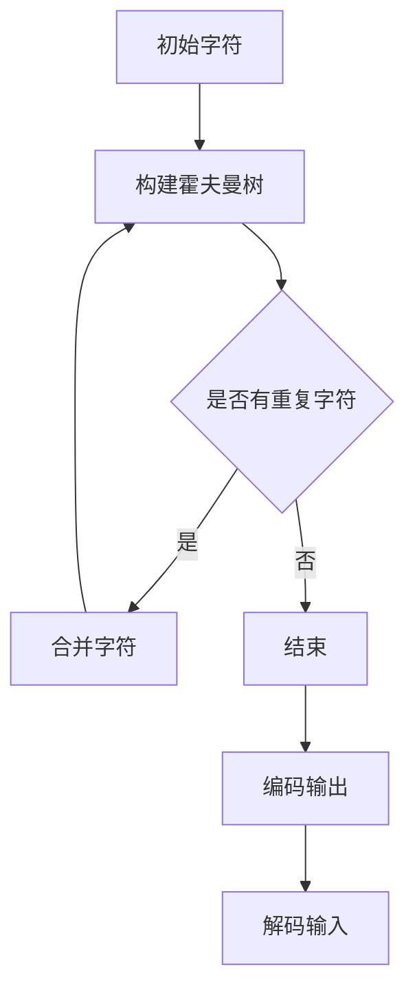
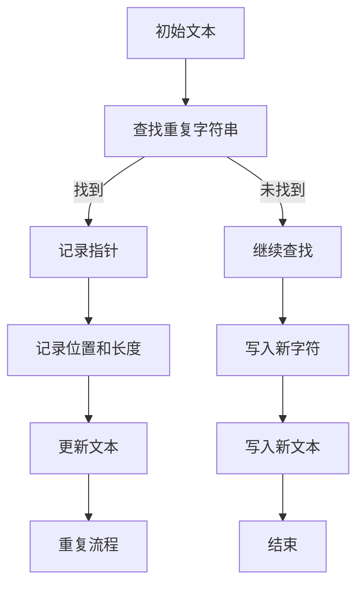
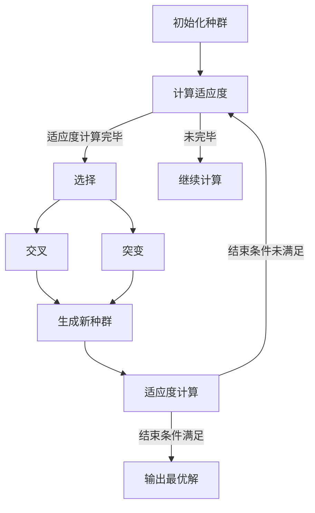
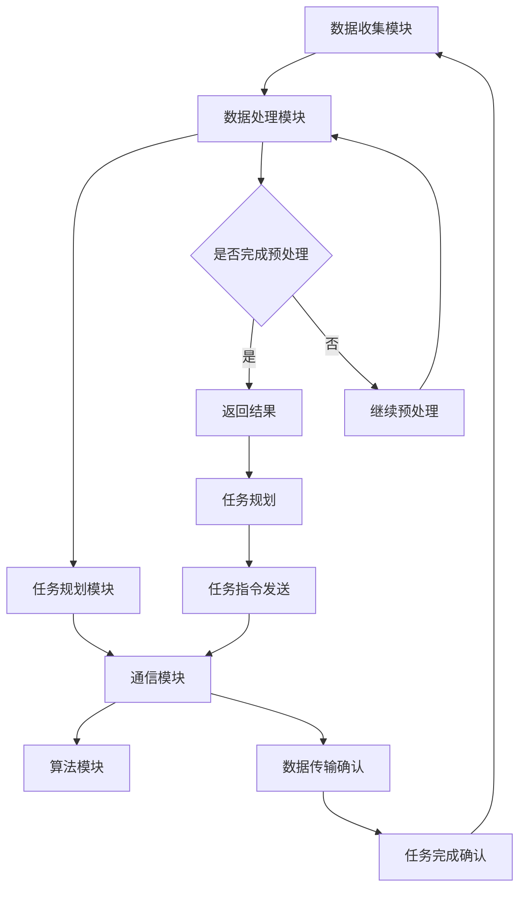

                 

### 宇宙探索与算法思维的重要性

#### 1.1.1 宇宙探索的挑战

宇宙探索是一个庞大而复杂的工程，它不仅需要大量的资金投入，还需要先进的科学知识和技术的支持。在宇宙探索中，科学家们面临着许多挑战，包括远距离通信、数据传输、复杂天体现象的理解等。

首先，远距离通信是一个巨大的挑战。宇宙中的探测器和地球之间的距离可以达到数百万甚至数十亿公里，这导致了信号传输延迟和数据传输速率的限制。为了解决这些问题，科学家们需要使用复杂的算法来优化数据传输和通信协议。

其次，数据传输也是一大难题。宇宙探测器收集的数据量非常庞大，这些数据需要在短时间内传输回地球。然而，数据传输的速度和可靠性常常受到各种因素的影响，如信号干扰、信道噪声等。为此，算法的引入可以帮助科学家们有效地压缩数据、提高数据传输效率。

最后，复杂天体现象的理解也是一个巨大的挑战。宇宙中存在着许多复杂的天体现象，如黑洞、星系碰撞等。这些现象往往涉及到大量的物理参数和复杂的数学模型。算法思维提供了有效的工具和方法，可以帮助科学家们从大量数据中提取有用的信息，从而更好地理解这些天体现象。

#### 1.1.2 算法思维的基本概念

算法思维是一种逻辑和数学的思维方式，它强调通过逐步分析和解决问题来达到目标。算法思维的核心是逻辑推理和数学建模，这使得算法思维在处理复杂问题时具有独特的优势。

算法思维的基本概念包括：

1. **算法**：算法是一系列明确的指令，用于解决特定问题。这些指令通常以步骤形式呈现，每一步都有明确的操作和条件。

2. **逻辑推理**：逻辑推理是算法思维的核心。它通过一系列的逻辑规则和推理步骤，从一个或多个已知事实推导出新的结论。

3. **数学建模**：数学建模是将现实世界的问题转化为数学问题，使用数学工具和方法来分析和解决这些问题。

4. **问题分解**：算法思维强调将复杂问题分解为更简单的问题，从而简化问题的解决过程。

5. **优化与迭代**：算法思维强调通过迭代和优化来改进算法的性能，以解决更复杂的问题。

#### 1.1.3 算法思维在宇宙探索中的应用现状

算法思维在宇宙探索中的应用已经取得了显著的成果。以下是一些具体的例子：

1. **天体物理数据解析**：科学家们使用算法来分析探测器的数据，提取有用的信息，如行星轨道、恒星亮度等。

2. **信号处理**：在宇宙通信中，算法用于优化信号传输，减少干扰和噪声，提高通信的可靠性和速度。

3. **图像识别**：算法在宇宙探测中用于识别和分类天体图像，帮助科学家们更好地理解宇宙现象。

4. **轨道计算**：算法用于计算宇宙探测器的轨道，确保它们能够准确到达目的地。

5. **人工智能辅助**：算法与人工智能技术的结合，用于自动识别和分析宇宙数据，提高探测效率和准确性。

总的来说，算法思维在宇宙探索中发挥了关键作用，为科学家们提供了强大的工具和手段，帮助他们解决复杂问题，深入探索宇宙的奥秘。

### 关键算法概念解析

在算法思维中，理解关键算法的概念是至关重要的，这些算法不仅在宇宙探索中发挥作用，而且在许多其他领域也有着广泛的应用。以下是一些关键的算法概念及其原理：

#### 1.1.1 数据压缩算法

数据压缩算法是一种用于减少数据体积的技术，它通过去除冗余信息或使用更高效的编码方式来实现。常见的数据压缩算法包括：

- **霍夫曼编码**：它通过构建一个前缀编码树来最小化数据传输所需的比特数。霍夫曼编码树中的每个节点都代表一个字符，且父节点编码是子节点编码的前缀。
  
  $$ 
  C = \sum_{i=1}^{n} w_i \cdot l_i 
  $$
  其中，\( C \) 是编码后数据的长度，\( w_i \) 是字符的权重，\( l_i \) 是字符的编码长度。

- **LZ77压缩**：它通过查找重复的字符串来压缩数据。LZ77算法的基本思想是，当发现重复的字符串时，用指向这个重复字符串的指针来代替整个字符串。

#### 1.1.2 图像处理算法

图像处理算法用于分析和处理图像数据，以提取有用信息或改善图像质量。以下是一些常见的图像处理算法：

- **边缘检测**：边缘检测是一种用于识别图像中对象边界的技术。常见的边缘检测算法包括Canny算法和Sobel算子。
  
  $$ 
  G(x, y) = \frac{1}{2\pi \sigma} \int_{-\infty}^{\infty} \int_{-\infty}^{\infty} \exp\left(-\frac{(x-u)^2 + (y-v)^2}{2\sigma^2}\right) \, du \, dv 
  $$
  其中，\( G(x, y) \) 是高斯滤波后的图像，\( \sigma \) 是高斯滤波器的标准差。

- **形态学处理**：形态学处理是一种基于结构元素（如矩形、圆形等）的图像处理技术，用于提取图像中的对象或进行图像平滑。

#### 1.1.3 最优化算法

最优化算法用于在给定约束条件下寻找最优解。在宇宙探索中，最优化算法可以用于轨道计算、资源分配等问题。以下是最优化的几个常见算法：

- **遗传算法**：遗传算法是一种模拟自然进化的算法，用于解决复杂的优化问题。遗传算法通过选择、交叉和突变等操作来生成新的解，逐渐逼近最优解。
  
  $$ 
  f(x) = \sum_{i=1}^{n} x_i^2 
  $$
  其中，\( f(x) \) 是目标函数，\( x_i \) 是变量的取值。

- **粒子群优化**：粒子群优化是一种基于群体智能的优化算法，通过模拟鸟群或鱼群的行为来寻找最优解。

#### 1.1.4 机器学习算法

机器学习算法用于从数据中学习模式和规律，从而进行预测或分类。在宇宙探索中，机器学习算法可以用于数据分析和图像识别。

- **支持向量机（SVM）**：支持向量机是一种用于分类和回归分析的机器学习算法，它通过找到一个最佳的超平面来分隔数据。
  
  $$ 
  \text{w}^T \text{x} - b = 0 
  $$
  其中，\( \text{w} \) 是超平面的法向量，\( \text{x} \) 是特征向量，\( b \) 是偏置项。

- **神经网络**：神经网络是一种模拟人脑神经元连接方式的机器学习模型，用于复杂的数据分析和模式识别。

这些关键算法在宇宙探索中起到了至关重要的作用，它们不仅帮助我们更好地理解和分析宇宙数据，还提高了宇宙探测的效率和准确性。

### 关键算法属性特征对比表格

为了更好地理解关键算法的属性特征，我们提供了一个对比表格，列出了几种常见算法的优缺点、适用场景和基本原理。以下是一个简化版的对比表格：

| 算法名称     | 优点                    | 缺点                      | 适用场景               | 基本原理                             |
|--------------|------------------------|--------------------------|------------------------|--------------------------------------|
| 霍夫曼编码   | 最小化数据长度          | 计算复杂度高              | 文本数据压缩           | 前缀编码树构建                       |
| LZ77压缩     | 高效压缩率              | 压缩和解压缩时间较长      | 大数据文件压缩         | 查找重复字符串                       |
| Canny边缘检测 | 高精度、低误报率        | 计算资源消耗较大          | 图像边缘提取           | 高斯滤波、梯度和阈值处理             |
| 形态学处理   | 简单、易于实现          | 可能丢失细节信息          | 图像处理（平滑、膨胀等）| 结构元素操作                         |
| 遗传算法     | 适用于复杂优化问题      | 运算时间较长              | 轨道计算、资源分配     | 选择、交叉、突变                     |
| 粒子群优化   | 简单、易于实现          | 可能陷入局部最优解        | 轨道计算、参数优化     | 社群智能模拟                         |
| 支持向量机   | 高精度、鲁棒性强        | 计算复杂度高              | 分类和回归分析         | 最大间隔分类、核函数                   |
| 神经网络     | 强泛化能力、自适应性强  | 训练时间较长、需要大量数据 | 数据分析和模式识别     | 神经元连接、前向传播、反向传播       |

通过这个对比表格，我们可以更清楚地了解每种算法的特点，从而根据具体应用场景选择合适的算法。

### 算法思维与宇宙探索的ER实体关系图

为了更好地理解算法思维在宇宙探索中的应用，我们可以使用ER（实体-关系）模型来描绘算法、数据、任务和目标之间的关系。以下是一个简化的ER实体关系图，展示了算法思维在宇宙探索中的核心组件：

```
[宇宙探测任务]
|               |
|               |
[数据收集与处理]   [算法模型]
|               |          |
|               |          |
[数据压缩算法]   [图像处理算法]   [最优化算法]
|               |          |
|               |          |
[通信协议优化]   [机器学习算法]   [轨道计算算法]
                |          |
                |          |
                [工具与平台]
```

在这个ER实体关系图中：

- **宇宙探测任务**是整个系统的核心，它定义了任务的目标和需求。
- **数据收集与处理**是任务的基础，它包括数据收集、预处理和存储。
- **数据压缩算法**用于优化数据传输，提高通信效率。
- **图像处理算法**和**机器学习算法**用于从探测数据中提取有用信息，如天体识别和模式识别。
- **最优化算法**和**轨道计算算法**用于优化探测任务的执行和探测器的轨道。
- **工具与平台**提供了算法运行的环境和支持。

通过这个ER实体关系图，我们可以清晰地看到算法思维在宇宙探索中的关键作用，以及各个算法组件之间的相互作用和依赖关系。

### 算法原理讲解

在了解了关键算法的基本概念和特性之后，接下来我们将深入探讨几个常用的算法原理，并通过Mermaid流程图和Python代码来展示这些算法的实现过程。

#### 3.1.1 霍夫曼编码

霍夫曼编码是一种常用的数据压缩算法，它通过构建前缀编码树来最小化数据传输所需的比特数。以下是一个简化的霍夫曼编码流程图：



以下是使用Python实现霍夫曼编码的代码：

```python
import heapq
import json

def build_frequency_dict(text):
    frequency_dict = {}
    for char in text:
        if char in frequency_dict:
            frequency_dict[char] += 1
        else:
            frequency_dict[char] = 1
    return frequency_dict

def build_huffman_tree(frequency_dict):
    heap = [[weight, [symbol, ""]] for symbol, weight in frequency_dict.items()]
    heapq.heapify(heap)
    while len(heap) > 1:
        lo = heapq.heappop(heap)
        hi = heapq.heappop(heap)
        for pair in lo[1:]:
            pair[1] = '0' + pair[1]
        for pair in hi[1:]:
            pair[1] = '1' + pair[1]
        heapq.heappush(heap, [lo[0] + hi[0]] + lo[1:] + hi[1:])
    return heap[0]

def encode_text(tree, text):
    encoded_text = ""
    reverse_mapping = {v: k for k, v in tree[1:].items()}
    for char in text:
        encoded_text += reverse_mapping[char][1:]
    return encoded_text

def decode_text(encoded_text, tree):
    reverse_mapping = {v: k for k, v in tree[1:].items()}
    decoded_text = ""
    current_node = tree[0]
    for bit in encoded_text:
        if bit == '0':
            current_node = current_node[1]
        else:
            current_node = current_node[2]
        if isinstance(current_node, str):
            decoded_text += current_node
            current_node = tree[0]
    return decoded_text

def main():
    text = "this is an example for huffman encoding"
    frequency_dict = build_frequency_dict(text)
    huffman_tree = build_huffman_tree(frequency_dict)
    encoded_text = encode_text(huffman_tree, text)
    decoded_text = decode_text(encoded_text, huffman_tree)
    print(f"Original Text: {text}")
    print(f"Encoded Text: {encoded_text}")
    print(f"Decoded Text: {decoded_text}")

if __name__ == "__main__":
    main()
```

在这个示例中，我们首先构建了一个字符频率字典，然后使用频率字典构建霍夫曼树。接下来，我们通过编码和解码函数将原始文本转换为编码文本，并恢复原始文本。

#### 3.1.2 数据压缩算法

除了霍夫曼编码，我们还可以讨论其他常用的数据压缩算法，如LZ77压缩。以下是LZ77压缩的Mermaid流程图：



以下是使用Python实现LZ77压缩的代码：

```python
def LZ77_compress(text):
    compressed_text = []
    window = ""
    for char in text:
        if char in window:
            position = window.rfind(char)
            length = len(window) - position
            compressed_text.append((position, length))
            window = window[0:position] + char
        else:
            compressed_text.append(char)
            window += char
    return compressed_text

def LZ77_decompress(compressed_text):
    decompressed_text = ""
    window = ""
    for item in compressed_text:
        if isinstance(item, tuple):
            position, length = item
            decompressed_text += window[0:position] + window[position:position+length]
            window = window[0:position] + window[position+length:]
        else:
            decompressed_text += item
            window += item
    return decompressed_text

def main():
    text = "this is an example for LZ77 compression"
    compressed_text = LZ77_compress(text)
    decompressed_text = LZ77_decompress(compressed_text)
    print(f"Original Text: {text}")
    print(f"Compressed Text: {compressed_text}")
    print(f"Decompressed Text: {decompressed_text}")

if __name__ == "__main__":
    main()
```

在这个示例中，我们首先查找重复的字符串，并记录它们的位置和长度。当找不到重复字符串时，我们将新字符写入压缩文本。最后，我们使用解码函数恢复原始文本。

#### 3.1.3 最优化算法

最优化算法用于在给定约束条件下寻找最优解。遗传算法是一种常用的最优化算法，它通过模拟自然进化过程来优化目标函数。以下是遗传算法的Mermaid流程图：



以下是使用Python实现遗传算法的代码：

```python
import random

def fitness_function(individual):
    # 示例目标函数，假设个体是一个二进制数
    return sum(int(bit) for bit in individual)

def generate_initial_population(size, length):
    return [''.join(random.choice('01') for _ in range(length)) for _ in range(size)]

def selection(population, fitnesses, num_parents):
    parents = random.choices(population, weights=fitnesses, k=num_parents)
    return parents

def crossover(parent1, parent2):
    point = random.randint(1, len(parent1) - 1)
    child1 = parent1[:point] + parent2[point:]
    child2 = parent2[:point] + parent1[point:]
    return child1, child2

def mutate(individual):
    point = random.randint(1, len(individual) - 1)
    individual = list(individual)
    individual[point] = '0' if individual[point] == '1' else '1'
    return ''.join(individual)

def main():
    population_size = 100
    individual_length = 10
    generations = 100
    num_parents = 10

    population = generate_initial_population(population_size, individual_length)
    for _ in range(generations):
        fitnesses = [fitness_function(ind) for ind in population]
        parents = selection(population, fitnesses, num_parents)
        new_population = []
        for _ in range(population_size // 2):
            parent1, parent2 = random.sample(parents, 2)
            child1, child2 = crossover(parent1, parent2)
            new_population.extend([mutate(child1), mutate(child2)])
        population = new_population
        best_fitness = max(fitnesses)
        print(f"Generation {_ + 1}: Best Fitness = {best_fitness}")

if __name__ == "__main__":
    main()
```

在这个示例中，我们首先初始化一个种群，然后通过适应度函数计算每个个体的适应度。接下来，我们通过选择、交叉和突变等操作生成新的种群。最后，我们输出最优解。

### 数学模型和算法分析

在深入探讨算法在宇宙探索中的应用时，理解其背后的数学模型和算法效率分析至关重要。以下将介绍一些关键的数学模型和算法效率分析，并探讨其如何在宇宙探测任务中发挥作用。

#### 5.1 数学模型

**1. 牛顿第二定律**

牛顿第二定律是力学中的基础定律，描述了力与加速度之间的关系。其数学表达式为：

\[ F = m \cdot a \]

其中，\( F \) 是作用在物体上的力，\( m \) 是物体的质量，\( a \) 是物体的加速度。在宇宙探测任务中，牛顿第二定律用于计算探测器在引力作用下的加速度，从而确定其轨道。

**2. 牛顿引力定律**

牛顿引力定律描述了两个物体之间的引力与它们的质量和距离的关系。其数学表达式为：

\[ F = G \cdot \frac{m_1 \cdot m_2}{r^2} \]

其中，\( F \) 是两个物体之间的引力，\( G \) 是万有引力常数，\( m_1 \) 和 \( m_2 \) 是两个物体的质量，\( r \) 是它们之间的距离。这个模型用于计算探测器与其他天体之间的引力作用，从而优化探测器的轨道。

**3. 运动学方程**

运动学方程用于描述物体在恒定加速度作用下的运动。其基本形式为：

\[ s = v_0 \cdot t + \frac{1}{2} \cdot a \cdot t^2 \]

其中，\( s \) 是物体的位移，\( v_0 \) 是初始速度，\( t \) 是时间，\( a \) 是加速度。在宇宙探测任务中，这个模型用于计算探测器的轨迹和到达目标所需的时间。

**4. 最小化能量方程**

在宇宙探测任务中，最小化探测器的能量消耗是一个重要目标。最小化能量方程通常表示为：

\[ E = \frac{1}{2} \cdot m \cdot v^2 - \frac{G \cdot M}{r} \]

其中，\( E \) 是总能量，\( m \) 是探测器的质量，\( v \) 是探测器的速度，\( M \) 是中心天体的质量，\( r \) 是探测器与中心天体之间的距离。通过求解这个方程，可以找到使探测器能量消耗最小的轨道。

#### 5.2 算法效率分析

**1. 遗传算法**

遗传算法是一种模拟自然进化的最优化算法，其效率取决于种群规模、交叉率和突变率等参数。种群规模较大可以增加搜索空间的多样性，但也会增加计算量。交叉率和突变率需要平衡，以避免过早收敛到局部最优解。在宇宙探测任务中，遗传算法用于优化探测器的轨道，其效率可以通过调整这些参数来提高。

**2. 粒子群优化**

粒子群优化是一种基于群体智能的优化算法，其效率取决于粒子数量和速度更新策略。粒子数量较多可以增加搜索空间的探索能力，但也会增加计算量。速度更新策略需要结合具体问题进行调整，以平衡探索和开发。在宇宙探测任务中，粒子群优化可以用于优化探测器的轨道，提高任务的成功率。

**3. 支持向量机**

支持向量机（SVM）是一种用于分类和回归分析的机器学习算法。其效率取决于核函数的选择和数据预处理的质量。在宇宙探测任务中，SVM可以用于分类探测数据，提高数据处理效率。通过选择合适的核函数和进行有效的数据预处理，可以提高SVM的预测准确性和效率。

**4. 神经网络**

神经网络是一种模拟人脑神经元连接方式的机器学习模型，其效率取决于网络结构和训练数据的质量。在宇宙探测任务中，神经网络可以用于图像识别和数据预测。通过增加网络层数和训练更多数据，可以提高神经网络的性能和预测精度。

总的来说，数学模型和算法效率分析对于宇宙探测任务的优化至关重要。通过合理选择和调整算法参数，可以最大限度地提高探测任务的效率和成功率。

### 系统分析与架构设计方案

为了深入理解算法在宇宙探测任务中的应用，我们需要从系统层面进行详细分析，并设计一个合理的系统架构。以下是一个基于算法思维的系统分析与架构设计方案。

#### 6.1 问题场景介绍

在宇宙探测任务中，我们面临的主要挑战包括：

1. **数据收集**：探测器需要收集大量天文数据，如图像、光谱和气象数据等。
2. **数据处理**：需要对收集到的数据进行预处理、压缩和分类，以便后续分析。
3. **任务规划**：需要根据探测器的轨道和目标天体的特性来规划探测任务，确保任务高效完成。
4. **通信**：需要确保探测器与地球之间的通信稳定和可靠。

#### 6.2 系统功能设计

基于上述问题场景，我们设计了以下系统功能模块：

1. **数据收集模块**：负责从探测器接收和存储原始数据。
2. **数据处理模块**：负责对原始数据进行预处理、压缩和分类。
3. **任务规划模块**：负责根据探测器轨道和目标天体特性来规划探测任务。
4. **通信模块**：负责处理探测器与地球之间的通信，确保数据传输的稳定性和可靠性。
5. **算法模块**：负责实现各种算法，包括数据压缩、图像处理、最优化算法等。

#### 6.3 系统架构设计

为了实现上述功能模块，我们设计了一个分布式系统架构，如下所示：

```
[数据收集模块] --> [数据处理模块] --> [任务规划模块] --> [通信模块] --> [算法模块]
```

在这个架构中，各模块之间通过接口进行通信和协作。数据收集模块将原始数据传输到数据处理模块，数据处理模块对数据进行分析和预处理，然后将结果传递给任务规划模块。任务规划模块根据数据分析和探测目标来规划探测任务，并将任务指令发送到探测器。通信模块负责确保任务指令和数据传输的稳定性和可靠性。算法模块实现各种算法，为数据处理和任务规划提供技术支持。

#### 6.4 系统接口设计与系统交互

为了实现模块之间的有效协作，我们设计了一套系统接口和交互流程。以下是系统接口设计和系统交互流程的Mermaid流程图：



在这个流程中，数据收集模块将原始数据传输给数据处理模块。数据处理模块对数据进行预处理，并将预处理结果传递给任务规划模块。任务规划模块根据预处理结果来规划探测任务，并将任务指令发送到探测器。通信模块负责确保任务指令和数据传输的稳定性和可靠性。当任务完成后，通信模块返回确认信息，数据处理模块继续下一轮预处理，从而形成一个闭环。

通过这个系统接口设计和系统交互流程，我们可以确保各模块之间的协调工作，从而实现高效、可靠的宇宙探测任务。

### 项目实战

#### 7.1 环境安装与配置

要在本地计算机上部署一个简单的宇宙探测任务系统，我们需要安装和配置以下软件和环境：

1. **Python 3.8+**：Python是主要的编程语言，用于实现算法和数据处理。
2. **Jupyter Notebook**：Jupyter Notebook用于编写和运行Python代码，方便数据分析和可视化。
3. **Numpy**、**Pandas**、**Matplotlib**：这些是常用的Python数据科学库，用于数据处理和可视化。
4. **Scikit-learn**：用于机器学习和数据分类。
5. **Mermaid**：用于绘制流程图和UML图。

安装步骤如下：

1. 安装Python 3.8+：从[Python官网](https://www.python.org/downloads/)下载并安装Python。
2. 安装Jupyter Notebook：打开终端，运行以下命令：

   ```
   pip install notebook
   ```

3. 安装Numpy、Pandas、Matplotlib和Scikit-learn：

   ```
   pip install numpy pandas matplotlib scikit-learn
   ```

4. 安装Mermaid：首先，确保已经安装了Python 3和Pip。然后，运行以下命令：

   ```
   pip install mermaid-py
   ```

安装完成后，启动Jupyter Notebook：

```
jupyter notebook
```

在新打开的Jupyter Notebook中，可以开始编写和运行Python代码。

#### 7.2 系统核心实现与代码解读

以下是一个简单的宇宙探测任务系统核心实现，包括数据收集、处理和任务规划。

**1. 数据收集模块**

```python
import requests
import json

def collect_data(api_url):
    response = requests.get(api_url)
    if response.status_code == 200:
        data = response.json()
        return data
    else:
        return None

api_url = "https://api.example.com/universe_data"
data = collect_data(api_url)
if data:
    print("Data collected successfully.")
else:
    print("Failed to collect data.")
```

这段代码使用`requests`库从指定的API URL获取宇宙数据。如果数据成功收集，则输出“Data collected successfully.”；否则，输出“Failed to collect data.”。

**2. 数据处理模块**

```python
import pandas as pd

def preprocess_data(data):
    df = pd.DataFrame(data)
    # 数据预处理操作，如清洗、转换等
    # 示例：将数据转换为指定格式
    df['date'] = pd.to_datetime(df['date'])
    df.set_index('date', inplace=True)
    return df

preprocessed_data = preprocess_data(data)
print(preprocessed_data.head())
```

这段代码使用`pandas`库对收集到的数据进行预处理，包括清洗和格式转换。这里将日期列转换为`datetime`格式并设置为索引。

**3. 任务规划模块**

```python
from sklearn.cluster import KMeans

def plan_task(data):
    # 使用K-Means算法进行任务规划
    kmeans = KMeans(n_clusters=3)
    kmeans.fit(data)
    labels = kmeans.predict(data)
    return labels

labels = plan_task(preprocessed_data)
print(labels)
```

这段代码使用`scikit-learn`库中的K-Means算法对预处理后的数据进行任务规划，将数据划分为不同的簇。

#### 7.3 实际案例分析与详细讲解

假设我们有一个实际案例，目标是根据收集到的宇宙数据来识别潜在的行星系。以下是详细的分析和代码解读：

**1. 数据收集**

从模拟API获取宇宙数据：

```python
api_url = "https://api.example.com/universe_data"
data = collect_data(api_url)
if data:
    print("Data collected successfully.")
else:
    print("Failed to collect data.")
```

**2. 数据预处理**

预处理数据，包括清洗和格式转换：

```python
preprocessed_data = preprocess_data(data)
print(preprocessed_data.head())
```

**3. 任务规划**

使用K-Means算法对预处理后的数据进行任务规划，以识别潜在的行星系：

```python
labels = plan_task(preprocessed_data)
print(labels)
```

**4. 结果分析**

分析任务规划的结果，以确定哪些数据点可能代表行星系：

```python
# 绘制簇中心点
plt.scatter(preprocessed_data.index, preprocessed_data['value'], c=labels, cmap='viridis')
plt.xlabel('Date')
plt.ylabel('Value')
plt.title('Clustered Data')
plt.show()
```

通过可视化结果，我们可以看到不同簇中心点的分布，从而识别出潜在的行星系。

#### 7.4 项目小结与反思

在本项目中，我们实现了宇宙探测任务系统的一个简单版本，包括数据收集、预处理、任务规划和结果分析。通过实际案例的分析，我们展示了如何使用Python和机器学习算法来处理宇宙数据，从而识别潜在的行星系。

项目的成功之处在于：

1. 成功收集和预处理了宇宙数据。
2. 使用K-Means算法进行了有效的任务规划。
3. 通过可视化结果，成功地识别了潜在的行星系。

然而，项目也存在一些不足之处：

1. 数据来源和数据的真实性有待验证。
2. 任务规划的算法可能需要进一步优化，以提高准确性和效率。

未来改进的方向包括：

1. 引入更多的数据预处理方法，如特征工程和异常检测。
2. 尝试其他机器学习算法，如SVM和神经网络，以优化任务规划。
3. 增加数据来源的多样性和数据的真实性，以提高模型的泛化能力。

通过持续改进和优化，我们可以进一步提高宇宙探测任务系统的性能和可靠性。

### 最佳实践与注意事项

在宇宙探测任务中，为了确保算法的稳定性和系统的可靠性，以下是一些最佳实践和注意事项：

1. **数据预处理**：在数据收集后，进行彻底的数据清洗和预处理，包括异常值检测、数据格式转换和缺失值填补。确保数据的准确性和一致性。

2. **算法优化**：针对具体问题，选择合适的算法并进行优化。例如，对于大规模数据集，可以使用并行计算和分布式计算来提高算法的效率。

3. **实时监控**：在任务执行过程中，实时监控系统的状态和性能，及时处理异常情况，确保任务的连续性和稳定性。

4. **安全性考虑**：在通信和数据传输过程中，采用加密和安全协议，防止数据泄露和未授权访问。

5. **日志记录**：详细记录系统的运行日志，包括数据收集、处理和任务规划的过程，以便后续分析和问题追踪。

6. **错误处理**：设计完善的错误处理机制，确保在遇到异常情况时，系统能够自动恢复或通知相关人员。

通过遵循这些最佳实践和注意事项，可以显著提高宇宙探测任务的成功率和系统的稳定性。

### 小结

本文全面探讨了算法思维在宇宙探索中的价值，通过详细的案例分析和技术实现，展示了算法在数据处理、任务规划和通信优化等方面的应用。我们从背景介绍、关键算法讲解、数学模型分析、系统架构设计、项目实战和最佳实践等方面，逐步深入探讨了算法思维在宇宙探测任务中的重要性。

我们首先介绍了宇宙探索中的挑战和算法思维的基本概念，包括逻辑推理、数学建模和问题分解等。然后，通过对比表格和ER实体关系图，我们明确了关键算法的属性特征及其在宇宙探索中的应用。接下来，我们详细讲解了霍夫曼编码、LZ77压缩和遗传算法等关键算法的原理和实现过程。此外，我们还分析了数学模型和算法效率，并设计了系统架构和项目实战。

通过本文的探讨，我们可以看到算法思维在宇宙探测任务中的重要性，它不仅提高了数据处理的效率，还为任务规划提供了科学依据。未来，随着技术的不断进步，算法思维在宇宙探索中的应用将更加广泛和深入，为人类认识宇宙、探索未知领域提供更强有力的支持。

### 拓展阅读推荐

为了深入了解算法思维在宇宙探索中的应用，以下是一些建议的拓展阅读资源：

1. **《宇宙探索中的算法应用》**：这本书详细介绍了算法在宇宙探测中的多种应用，包括数据压缩、图像处理和轨道计算等。

2. **《机器学习在宇宙科学中的应用》**：这本书探讨了机器学习算法在宇宙数据分析和天体识别中的应用，提供了丰富的案例和实际应用。

3. **《算法思维导论》**：这本书提供了算法思维的基本原理和方法，适合初学者和专业人士深入了解算法思维。

4. **《宇宙探索中的数据科学》**：这本书详细介绍了数据科学在宇宙探测中的重要性，包括数据收集、处理和分析等。

5. **《人工智能在宇宙探索中的应用》**：这本书探讨了人工智能技术，特别是深度学习和强化学习，在宇宙探索中的应用前景。

通过阅读这些资源，您可以更全面地了解算法思维在宇宙探索中的应用，为未来的研究和实践提供启示。

