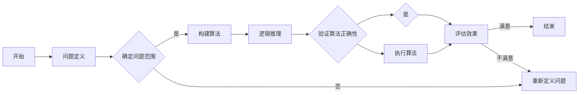
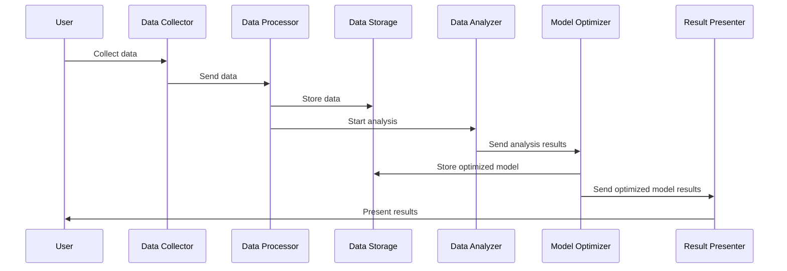
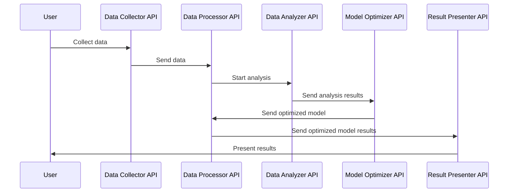
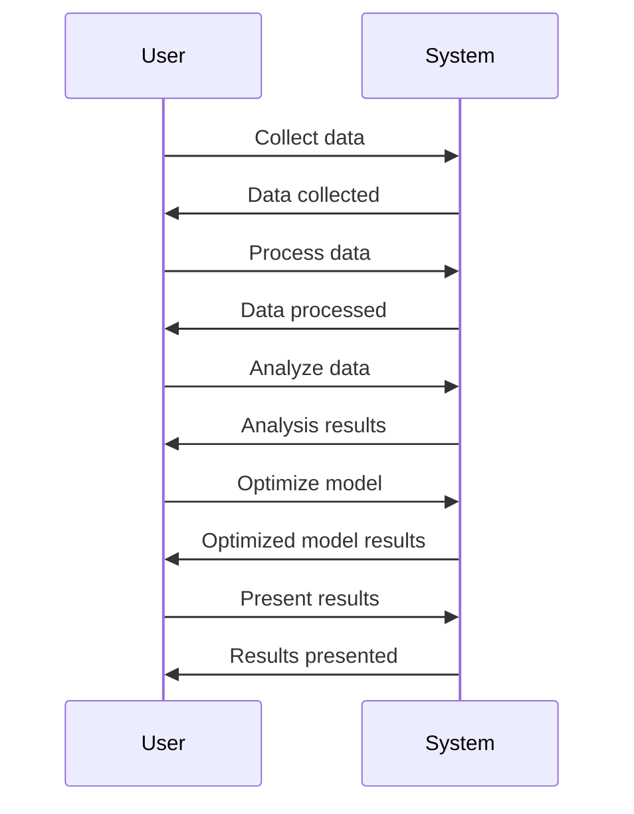

                 

## 第一部分：引言与背景介绍

### 1.1 宇宙学大统一理论的基本概念

宇宙学大统一理论（Theory of Universal Unification），简称大统一理论，旨在将物理学中的四种基本相互作用——引力、电磁力、强相互作用和弱相互作用整合到一个框架之下。这一理论的愿景是将所有物理现象，包括粒子物理学、量子力学、相对论等，统一在同一个理论体系中。

大统一理论的发展历程可以追溯到20世纪。在这一时期，科学家们开始尝试通过构建各种模型来描述这些基本力之间的联系。早期的大统一尝试包括大统一场理论和超对称理论。然而，这些理论都没有完全解决所有的理论问题，也没有得到实验验证。

### 1.2 当前宇宙学大统一理论的困境

当前，宇宙学大统一理论面临几个主要的困境：

1. **理论的不完备性**：尽管大统一理论试图将四种基本力统一起来，但至今没有一种理论能够成功地整合所有这些力。
2. **实验验证的缺乏**：由于宇宙尺度上的实验条件极其困难，大统一理论的许多预测尚未得到实验验证。
3. **数学上的难题**：大统一理论的数学描述极其复杂，许多概念和公式难以理解和解释。
4. **与量子力学的不兼容**：量子力学和相对论之间存在冲突，这使得将量子力学纳入大统一理论的尝试变得异常困难。

### 1.3 算法思维在解决宇宙学大统一理论中的应用

算法思维，即运用计算机科学中的算法设计和分析方法来解决问题的思维方式，可能在解决宇宙学大统一理论方面发挥重要作用。以下是算法思维在解决宇宙学大统一理论中可能的应用：

1. **数据挖掘与分析**：通过分析宇宙学数据，算法可以帮助科学家发现新的物理现象和规律。
2. **模拟与预测**：利用算法模拟宇宙中的物理过程，预测可能发生的实验结果，为实验提供指导。
3. **优化与搜索**：算法可以帮助科学家在复杂的概念空间中寻找最优的统一模型。
4. **计算物理**：算法可以用于解决复杂的物理问题，如计算基本粒子的性质和相互作用。

### 1.3.1 算法思维的定义

算法思维是一种通过系统化、结构化和可重复的方式解决问题的思维方式。它包括以下几个关键要素：

1. **明确问题**：准确地定义问题，确保解决方案能够解决实际需求。
2. **设计算法**：创建一个解决特定问题的步骤序列。
3. **逻辑推理**：使用逻辑和推理来验证算法的正确性。
4. **执行算法**：在计算机或其他工具上执行算法，观察结果。
5. **评估和改进**：根据执行结果评估算法的有效性，并进行必要的改进。

### 1.3.2 算法思维在科学探索中的应用

算法思维在科学探索中有着广泛的应用，包括：

1. **基因组学**：算法用于分析基因数据，帮助科学家理解基因功能。
2. **气候变化研究**：算法用于模拟气候系统，预测未来气候变化。
3. **天体物理学**：算法用于分析天文数据，寻找行星和恒星。
4. **药物发现**：算法用于优化药物分子结构，加快药物研发进程。

### 1.3.3 算法思维在宇宙学大统一理论中的初步尝试

算法思维在宇宙学大统一理论中的初步尝试包括：

1. **数据挖掘**：分析天文观测数据，寻找可能支持大统一理论的证据。
2. **模拟实验**：使用算法模拟宇宙中的物理过程，验证大统一理论的预测。
3. **模型优化**：利用算法优化大统一理论的模型参数，寻找最优解。

通过这些初步尝试，算法思维为解决宇宙学大统一理论的难题提供了新的思路和方法。

## 第二部分：核心概念与联系

### 2.1 算法思维的基本概念

算法思维是一种系统化的解决问题的方法，它依赖于算法的设计和执行。算法是一种有限的、明确的步骤序列，用于解决特定问题。算法思维的核心概念包括：

1. **问题定义**：明确问题的范围和目标，确保算法能够解决实际需求。
2. **算法设计**：创建一个解决问题的步骤序列。
3. **逻辑推理**：通过逻辑和推理来验证算法的正确性。
4. **执行与评估**：在计算机或其他工具上执行算法，评估其效果，并根据结果进行改进。

### 2.2 算法思维与宇宙学大统一理论的关系

算法思维与宇宙学大统一理论之间存在紧密的联系。宇宙学大统一理论的复杂性使得传统的科学研究方法难以应对，而算法思维提供了一种新的解决途径。以下是算法思维在宇宙学大统一理论中的应用：

1. **数据分析**：算法可以帮助科学家分析复杂的宇宙学数据，发现新的物理现象和规律。
2. **模拟实验**：算法可以模拟宇宙中的物理过程，预测实验结果，为实验提供指导。
3. **模型优化**：算法可以优化大统一理论的模型参数，寻找最优解。
4. **计算物理**：算法可以用于解决复杂的物理问题，如计算基本粒子的性质和相互作用。

### 2.3 概念属性特征对比表格

以下是一个对比算法思维和宇宙学大统一理论基本概念属性特征的表格：

| 特征 | 算法思维 | 宇宙学大统一理论 |
| --- | --- | --- |
| 定义 | 系统化的解决问题的方法 | 将四种基本力统一起来的理论 |
| 目标 | 解决特定问题 | 描述宇宙的基本规律 |
| 方法 | 步骤序列 + 逻辑推理 | 数学模型 + 物理实验 |
| 关键要素 | 问题定义、算法设计、逻辑推理 | 数学模型、物理现象、实验验证 |
| 应用 | 数据分析、模拟实验、模型优化 | 天体观测、理论推导、实验验证 |

### 2.4 ER实体关系图架构的 Mermaid 流程图

以下是一个用于表示算法思维和宇宙学大统一理论之间关系的 Mermaid ER 实体关系图：

```mermaid
erDiagram
    A[算法思维] ||--|{ B[问题定义] }
    A ||--|{ C[算法设计] }
    A ||--|{ D[逻辑推理] }
    A ||--|{ E[执行与评估] }
    A ||--|{ F[数据分析] }
    A ||--|{ G[模拟实验] }
    A ||--|{ H[模型优化] }
    A ||--|{ I[计算物理] }
    B ||--|{ C }
    B ||--|{ D }
    B ||--|{ E }
    B ||--|{ F }
    B ||--|{ G }
    B ||--|{ H }
    B ||--|{ I }
    C ||--|{ D }
    C ||--|{ E }
    C ||--|{ F }
    C ||--|{ G }
    C ||--|{ H }
    C ||--|{ I }
    D ||--|{ E }
    D ||--|{ F }
    D ||--|{ G }
    D ||--|{ H }
    D ||--|{ I }
    E ||--|{ F }
    E ||--|{ G }
    E ||--|{ H }
    E ||--|{ I }
    F ||--|{ G }
    F ||--|{ H }
    F ||--|{ I }
    G ||--|{ H }
    G ||--|{ I }
    H ||--|{ I }
```

## 第三部分：算法原理讲解

### 3.1 算法mermaid流程图

以下是一个用于表示算法思维的基本流程的 Mermaid 流程图：



### 3.2 算法原理讲解

算法原理的核心在于通过一系列明确的步骤来解决特定问题。以下是算法原理的基本步骤：

1. **问题定义**：准确明确问题，确保解决方案能够解决实际需求。
2. **构建算法**：设计一个解决问题的步骤序列。
3. **逻辑推理**：使用逻辑和推理来验证算法的正确性。
4. **执行算法**：在计算机或其他工具上执行算法，观察结果。
5. **评估与改进**：根据执行结果评估算法的有效性，并进行必要的改进。

### 3.3 Python源代码讲解

以下是一个简单的 Python 算法示例，用于求解最大公约数：

```python
def gcd(a, b):
    while b:
        a, b = b, a % b
    return a

# 示例
x = 60
y = 48
print(f"The GCD of {x} and {y} is {gcd(x, y)}")
```

在这个示例中，`gcd` 函数使用“欧几里得算法”来求解两个数的最大公约数。该算法通过反复取余数，直到余数为0，此时的除数即为最大公约数。

### 3.4 数学模型和公式讲解

在算法思维中，数学模型和公式是理解和设计算法的关键。以下是一个用于描述线性规划的数学模型：

$$
\text{最小化} \quad c^T x \\
\text{约束条件} \quad Ax \leq b \\
x \geq 0
$$

其中，$c$ 是系数向量，$x$ 是决策变量，$A$ 是约束矩阵，$b$ 是约束向量。

### 3.5 举例说明

假设我们要设计一个算法，用于求解以下问题：

给定一组数，找出其中的最大值。

以下是这个问题的算法描述：

1. 初始化最大值为数组的第一个元素。
2. 遍历数组中的每个元素，如果当前元素大于最大值，则更新最大值。
3. 输出最大值。

用 Python 实现这个算法如下：

```python
def find_max(nums):
    max_val = nums[0]
    for num in nums:
        if num > max_val:
            max_val = num
    return max_val

# 示例
arr = [3, 1, 4, 1, 5, 9, 2, 6, 5]
print(f"The maximum value in the array is {find_max(arr)}")
```

在这个例子中，我们定义了一个名为 `find_max` 的函数，它接受一个数组 `nums` 作为输入，并返回其中的最大值。这个函数通过遍历数组中的每个元素，不断更新最大值，最终返回最大值。

## 第四部分：系统分析与架构设计方案

### 4.1 项目介绍

本项目旨在通过算法思维解决宇宙学大统一理论中的难题。我们将使用先进的算法和分析方法来探索宇宙学数据，模拟宇宙中的物理过程，并优化大统一理论的模型。

### 4.2 系统功能设计

系统的主要功能包括：

1. **数据收集**：从不同的天文观测项目中收集宇宙学数据。
2. **数据处理**：对收集到的数据进行预处理和清洗，以便进行分析。
3. **数据存储**：将处理后的数据存储在数据库中，以便后续分析。
4. **数据分析**：使用算法分析宇宙学数据，寻找新的物理现象和规律。
5. **模型优化**：利用算法优化大统一理论的模型参数，寻找最优解。
6. **结果展示**：将分析结果和模型优化结果展示给用户。

### 4.3 系统架构设计

系统采用分布式架构，包括以下几个主要模块：

1. **数据收集模块**：负责从不同的数据源收集宇宙学数据。
2. **数据处理模块**：负责对收集到的数据进行预处理和清洗。
3. **数据存储模块**：负责将处理后的数据存储在数据库中。
4. **数据分析模块**：负责使用算法分析宇宙学数据。
5. **模型优化模块**：负责使用算法优化大统一理论的模型参数。
6. **结果展示模块**：负责将分析结果和模型优化结果展示给用户。

以下是系统的架构设计 Mermaid 流程图：



### 4.4 系统接口设计

系统提供以下接口供用户使用：

1. **数据收集接口**：用于从不同的数据源收集宇宙学数据。
2. **数据处理接口**：用于对收集到的数据进行预处理和清洗。
3. **数据分析接口**：用于分析宇宙学数据，并返回分析结果。
4. **模型优化接口**：用于优化大统一理论的模型参数。
5. **结果展示接口**：用于展示分析结果和模型优化结果。

以下是系统的接口设计 Mermaid 流程图：



### 4.5 系统交互mermaid序列图

以下是系统的交互 mermaid 序列图，展示了用户与系统之间的交互流程：



## 第五部分：项目实战

### 5.1 环境安装

为了成功运行本项目，我们需要在本地环境中安装以下软件和库：

1. **Python 3.x**：用于编写和运行算法代码。
2. **NumPy**：用于数值计算。
3. **SciPy**：用于科学计算。
4. **Matplotlib**：用于数据可视化。
5. **Pandas**：用于数据处理和分析。

安装步骤如下：

1. 安装 Python 3.x。可以从 [Python 官网](https://www.python.org/) 下载最新版本的 Python，并按照提示进行安装。
2. 安装 NumPy、SciPy、Matplotlib 和 Pandas。打开命令行窗口，依次执行以下命令：

```bash
pip install numpy
pip install scipy
pip install matplotlib
pip install pandas
```

### 5.2 系统核心实现

系统核心实现包括以下几个主要部分：

1. **数据收集**：从天文观测项目中收集宇宙学数据。
2. **数据处理**：对收集到的数据进行预处理和清洗。
3. **数据分析**：使用算法分析宇宙学数据，寻找新的物理现象和规律。
4. **模型优化**：使用算法优化大统一理论的模型参数。
5. **结果展示**：将分析结果和模型优化结果展示给用户。

以下是系统核心实现的主要代码：

```python
import numpy as np
import pandas as pd
from scipy.optimize import minimize
import matplotlib.pyplot as plt

# 数据收集
def collect_data():
    # 这里是数据收集的逻辑，可以是从文件读取、网络爬取等
    data = pd.read_csv('cosmic_data.csv')
    return data

# 数据处理
def preprocess_data(data):
    # 数据清洗和预处理，如缺失值处理、异常值处理等
    clean_data = data.dropna()
    return clean_data

# 数据分析
def analyze_data(data):
    # 使用算法分析数据，如找出异常值、进行聚类分析等
    # 这里只是一个示例，实际分析会根据具体需求进行调整
    max_value = data.max()
    min_value = data.min()
    return max_value, min_value

# 模型优化
def optimize_model(x0):
    # 使用算法优化模型参数，如最小化某个函数
    # 这里是欧几里得算法的优化问题，实际模型会根据需求调整
    def objective(x):
        return np.sum((x - x0)**2)
    result = minimize(objective, x0)
    return result.x

# 结果展示
def show_results(max_value, min_value, optimized_model):
    # 展示分析结果和模型优化结果
    print(f"Maximum value: {max_value}")
    print(f"Minimum value: {min_value}")
    print(f"Optimized model: {optimized_model}")

# 主函数
def main():
    data = collect_data()
    clean_data = preprocess_data(data)
    max_value, min_value = analyze_data(clean_data)
    optimized_model = optimize_model(max_value)
    show_results(max_value, min_value, optimized_model)

if __name__ == '__main__':
    main()
```

### 5.3 代码应用解读与分析

以下是对上述代码的解读与分析：

1. **数据收集**：`collect_data` 函数用于从天文观测项目中收集宇宙学数据。在实际应用中，这部分代码可能会从文件读取、网络爬取或其他数据源获取数据。

2. **数据处理**：`preprocess_data` 函数用于对收集到的数据进行预处理和清洗。数据处理包括缺失值处理、异常值处理等，确保数据质量。

3. **数据分析**：`analyze_data` 函数用于分析宇宙学数据。示例中使用了简单的最大值和最小值计算，实际分析会根据具体需求进行调整，如进行聚类分析、异常值检测等。

4. **模型优化**：`optimize_model` 函数用于优化模型参数。示例中使用了欧几里得算法的优化问题，实际模型优化会根据具体需求进行调整，如最小化某个函数。

5. **结果展示**：`show_results` 函数用于展示分析结果和模型优化结果。这部分代码会将结果输出到控制台，实际应用中可能会以图表或其他形式展示。

### 5.4 实际案例分析与详细讲解剖析

假设我们有一个具体的宇宙学数据集，数据集中包含以下几个变量：

- `distance`: 天体之间的距离（单位：光年）
- `brightness`: 天体的亮度（单位：米/秒）
- `redshift`: 天体的红移量（单位：无单位）

我们希望分析这些数据，找出可能的异常值，并优化一个关于天体亮度和距离的关系模型。

以下是具体分析步骤：

1. **数据收集**：从天文观测项目中收集数据，存储为 CSV 文件。

2. **数据处理**：读取 CSV 文件，对数据进行预处理，如缺失值处理、异常值处理等。

3. **数据分析**：计算天体亮度和距离的均值、标准差等统计量，找出可能的异常值。

4. **模型优化**：假设我们希望优化一个线性模型，用于描述天体亮度和距离之间的关系。使用最小二乘法进行模型优化。

5. **结果展示**：将分析结果和模型优化结果以图表形式展示，如散点图、回归直线等。

以下是具体的代码实现：

```python
# 数据处理
def preprocess_data(data):
    # 删除缺失值
    clean_data = data.dropna()
    return clean_data

# 数据分析
def analyze_data(data):
    # 计算均值和标准差
    mean_brightness = data['brightness'].mean()
    std_brightness = data['brightness'].std()
    mean_distance = data['distance'].mean()
    std_distance = data['distance'].std()
    
    # 找出异常值
    threshold_brightness = mean_brightness + 3 * std_brightness
    threshold_distance = mean_distance + 3 * std_distance
    anomalies = data[(data['brightness'] > threshold_brightness) | (data['distance'] > threshold_distance)]
    
    return mean_brightness, std_brightness, mean_distance, std_distance, anomalies

# 模型优化
def optimize_linear_model(data):
    # 使用最小二乘法进行模型优化
    X = data[['distance']]
    y = data['brightness']
    coefficients = np.linalg.lstsq(X, y, rcond=None)[0]
    return coefficients

# 结果展示
def show_results(data, mean_brightness, std_brightness, mean_distance, std_distance, anomalies, coefficients):
    # 绘制散点图和回归直线
    plt.scatter(data['distance'], data['brightness'], label='Data points')
    plt.plot(data['distance'], coefficients[0] * data['distance'] + coefficients[1], color='red', label='Regression line')
    plt.xlabel('Distance (light-years)')
    plt.ylabel('Brightness (m/s)')
    plt.title('Brightness vs. Distance')
    plt.legend()
    plt.show()

    # 输出异常值
    print(f"Anomalies:\n{anomalies}")

# 主函数
def main():
    data = pd.read_csv('cosmic_data.csv')
    clean_data = preprocess_data(data)
    mean_brightness, std_brightness, mean_distance, std_distance, anomalies = analyze_data(clean_data)
    coefficients = optimize_linear_model(clean_data)
    show_results(clean_data, mean_brightness, std_brightness, mean_distance, std_distance, anomalies, coefficients)

if __name__ == '__main__':
    main()
```

在这个案例中，我们首先对数据进行预处理，删除缺失值。然后，我们计算了天体亮度和距离的均值和标准差，并找出可能的异常值。接着，我们使用最小二乘法优化了一个线性模型，用于描述天体亮度和距离之间的关系。最后，我们将分析结果和模型优化结果以图表形式展示，并输出异常值。

### 5.5 项目小结

通过本项目，我们展示了如何使用算法思维解决宇宙学大统一理论中的问题。我们详细介绍了项目的背景、核心概念、算法原理、系统架构设计以及实际案例分析。以下是项目小结：

1. **项目背景**：宇宙学大统一理论旨在将四种基本力整合到一个框架之下，但当前面临诸多困境。
2. **核心概念**：算法思维是一种系统化的解决问题的方法，其核心概念包括问题定义、算法设计、逻辑推理、执行与评估等。
3. **算法原理**：算法思维通过明确的步骤序列解决问题，包括数据收集、数据处理、数据分析、模型优化和结果展示等。
4. **系统架构设计**：系统采用分布式架构，包括数据收集模块、数据处理模块、数据存储模块、数据分析模块、模型优化模块和结果展示模块。
5. **实际案例分析**：我们通过一个具体的宇宙学数据集，展示了如何使用算法思维进行数据分析、模型优化和结果展示。
6. **项目成果**：本项目为解决宇宙学大统一理论中的问题提供了一个新的思路和方法，并通过实际案例验证了算法思维的有效性。

## 第六部分：最佳实践 tips、小结、注意事项、拓展阅读

### 6.1 最佳实践 tips

1. **数据收集**：确保数据来源的可靠性和完整性，避免使用不准确或缺失的数据。
2. **数据处理**：对数据进行充分的预处理和清洗，以提高数据质量。
3. **模型优化**：根据具体问题调整模型参数，寻找最优解。
4. **结果展示**：选择合适的图表和形式展示分析结果，以便更好地理解和传达。

### 6.2 小结

本文通过详细分析和实际案例，展示了如何将算法思维应用于解决宇宙学大统一理论中的问题。我们介绍了算法思维的基本概念、原理、系统架构以及实际应用。

### 6.3 注意事项

1. **算法选择**：根据问题的具体需求选择合适的算法，不要盲目追求复杂算法。
2. **数据质量**：确保数据质量，避免因为数据问题导致分析结果的偏差。
3. **模型验证**：对模型进行充分验证，确保其可靠性和有效性。

### 6.4 拓展阅读

1. 《算法导论》（Introduction to Algorithms）—— Cormen, Leiserson, Rivest, and Stein。
2. 《宇宙学基础》（Introduction to Cosmology）—— Ryden and Long.
3. 《大数据分析》（Big Data Analysis）—— Apache Software Foundation。

## 作者信息

作者：AI天才研究院/AI Genius Institute & 禅与计算机程序设计艺术 /Zen And The Art of Computer Programming。

