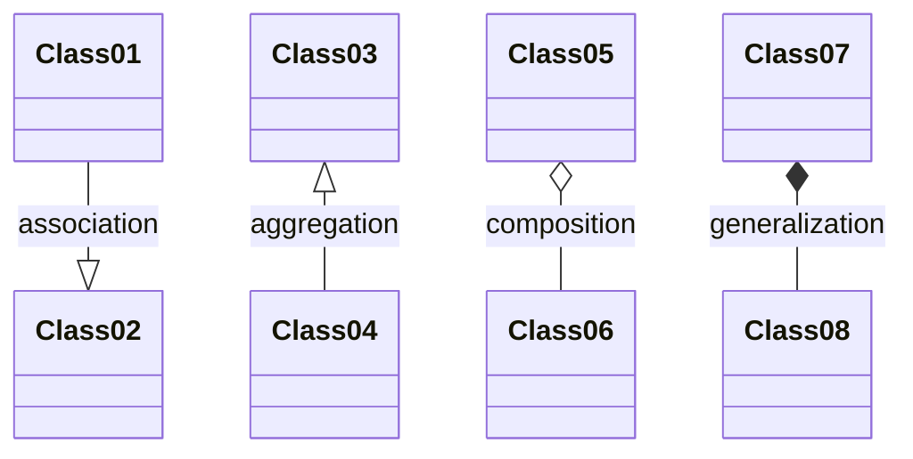
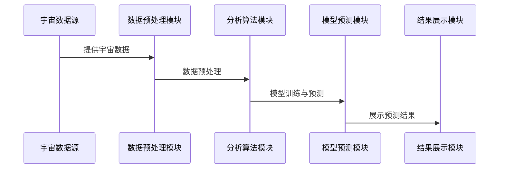
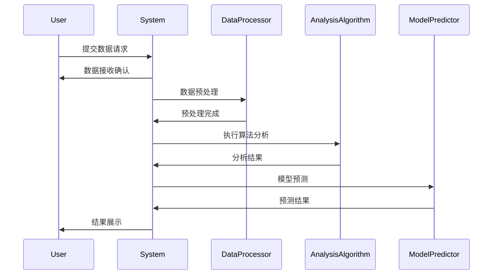

                 

### 文章标题

宇宙是浩瀚的，暗能量则更为神秘。在宇宙学的研究中，暗能量一直是一个引人入胜的课题。随着科技的进步和算法思维的发展，我们越来越有可能揭开暗能量的神秘面纱。本文将探讨算法思维在解决宇宙学暗能量本质问题中的应用，旨在通过一系列逻辑清晰、结构紧凑、简单易懂的分析，帮助读者深入了解这一领域的最新进展。

关键词：算法思维、宇宙学、暗能量、数据分析、机器学习、模拟预测

摘要：本文首先介绍了宇宙学和暗能量的基本概念及其重要性，随后详细阐述了算法思维的定义和分类。接着，文章探讨了算法在暗能量研究中的多种应用，包括数据分析、机器学习和模拟预测等。通过具体的研究方法和实践案例，本文展示了算法思维在暗能量研究中的实际应用效果。最后，文章对算法思维在暗能量研究中的未来展望进行了探讨，总结了当前的研究挑战和未来发展方向。

### 目录大纲

1. 第一部分：宇宙学基础
   - 第1章：宇宙学基本概念
   - 第2章：暗能量的性质与影响
   - 第3章：算法思维概述

2. 第二部分：算法思维在暗能量研究中的深度应用
   - 第4章：算法在暗能量研究中的应用
   - 第5章：算法研究方法与实践

3. 第三部分：算法思维与宇宙学暗能量研究的综合应用
   - 第6章：暗能量现象的算法分析
   - 第7章：算法在暗能量模型构建中的应用
   - 第8章：算法在暗能量探测中的应用
   - 第9章：算法思维在暗能量研究中的未来展望

4. 总结与展望
   - 第10章：算法思维与宇宙学交叉学科研究
   - 第11章：算法思维在宇宙学教育中的应用
   - 第12章：总结与展望

----------------------------------------------------------------

### 第一部分：宇宙学基础

#### 第1章：宇宙学基本概念

宇宙学是一门研究宇宙的结构、演化、起源和最终命运的学科。自20世纪初以来，随着天文学的进步，宇宙学取得了许多重要的发现，其中最引人注目的是宇宙膨胀和暗能量的概念。

**1.1 宇宙学的发展历史**

宇宙学的历史可以追溯到古代文明，当时人们就已经开始思考宇宙的本质。然而，现代宇宙学的发展始于20世纪初，爱因斯坦的广义相对论提出了宇宙学的框架。此后，哈勃的观测结果揭示了宇宙膨胀的现象，这一发现为宇宙学的发展奠定了基础。20世纪后半叶，宇宙学的研究进入了快速发展的阶段，一系列重大发现如宇宙微波背景辐射和暗物质、暗能量的发现，使得宇宙学成为物理学中一个极为重要的分支。

**1.2 宇宙的组成和结构**

宇宙由物质和能量组成，其中物质分为普通物质和暗物质，能量分为普通能量和暗能量。普通物质是我们日常生活中能够接触到的物体，如星系、恒星、行星等，而暗物质则是一种不发光、不与电磁波发生相互作用，但能够通过引力作用影响宇宙结构的物质。暗能量则是一种推动宇宙膨胀的力量，其性质至今仍不完全清楚。

**1.3 宇宙膨胀与暗能量的概念**

宇宙膨胀是指宇宙中所有天体之间的距离随着时间的推移而不断增大。暗能量是导致宇宙加速膨胀的一种神秘力量，其性质至今仍是一个谜。科学家们认为，暗能量占据了宇宙总能量的大部分，但我们对它的了解仍然非常有限。

**1.4 暗能量的发现与探测方法**

暗能量的概念最早是由物理学家在研究宇宙膨胀时提出的。1998年，两个独立的天文观测团队通过观测遥远超新星，发现了宇宙膨胀正在加速，这一发现为暗能量的存在提供了直接的证据。目前，科学家们主要通过以下几种方法来探测暗能量：

- **观测遥远超新星**：超新星是宇宙中最明亮的物体之一，通过观测超新星的光度与红移关系，可以推断出宇宙的膨胀历史。
- **观测宇宙微波背景辐射**：宇宙微波背景辐射是宇宙早期留下的遗迹，通过对它的观测，可以了解宇宙的初始状态和演化历史。
- **引力透镜效应**：暗能量对光线有引力作用，通过观测引力透镜效应，可以推断出暗能量的分布。

#### 第2章：暗能量的性质与影响

**2.1 暗能量的性质**

暗能量是一种神秘的力量，其性质至今仍不完全清楚。科学家们认为，暗能量具有以下几个重要特性：

- **能量密度**：暗能量在宇宙中的能量密度非常小，但却占据了宇宙总能量的大部分。
- **正压力**：暗能量具有正压力，这意味着它对宇宙中的物质具有排斥作用，是导致宇宙加速膨胀的主要原因。
- **均匀分布**：暗能量在宇宙中分布非常均匀，这使得它在宇宙尺度上具有显著的影响。

**2.2 暗能量的影响**

暗能量对宇宙的演化产生了深远的影响，主要包括以下几个方面：

- **宇宙膨胀**：暗能量是导致宇宙加速膨胀的主要原因。在宇宙早期，物质之间的引力作用使宇宙逐渐减速膨胀，但随着暗能量的增加，宇宙膨胀速度开始加快。
- **星系结构**：暗能量影响了星系的演化，导致星系的形成和分布与预期的有所不同。
- **宇宙大尺度结构**：暗能量对宇宙大尺度结构的影响也非常显著，例如，它影响了宇宙中星系的分布和宇宙的形态。

**2.3 暗能量与宇宙膨胀的关系**

暗能量与宇宙膨胀的关系是宇宙学中的一个重要问题。目前，科学家们普遍认为，暗能量是导致宇宙加速膨胀的主要原因。具体来说，暗能量的正压力导致了宇宙中的物质之间的引力作用逐渐减弱，从而使宇宙膨胀速度逐渐加快。然而，暗能量的具体性质和起源仍然是一个未解之谜。

#### 第3章：算法思维概述

**3.1 算法思维的概念**

算法思维是一种解决问题的方法和策略，它通过一系列有序的步骤，将复杂的问题分解为更简单的部分，并逐步解决。算法思维的核心在于逻辑性和系统性，它要求我们在解决问题时遵循一定的原则和步骤。

**3.2 算法思维的重要性**

算法思维在许多领域都具有重要的应用价值，特别是在科学研究和工程实践中。算法思维可以帮助我们更高效地解决问题，提高研究和开发的效率。在宇宙学领域，算法思维尤其重要，因为宇宙学问题通常非常复杂，需要通过精确的计算和模拟来研究。

**3.3 算法思维的分类**

算法思维可以根据不同的应用场景和问题类型进行分类。常见的算法思维包括：

- **归纳思维**：通过观察具体实例，归纳出一般性的规律和原则。
- **演绎思维**：从一般性的原则出发，推导出具体的结论和结果。
- **系统思维**：将复杂的问题视为一个整体，分析其内部结构和相互作用。
- **算法优化思维**：在算法设计中，通过优化算法结构和参数，提高算法的效率和性能。

### 第二部分：算法思维在暗能量研究中的深度应用

#### 第4章：算法在暗能量研究中的应用

在暗能量研究中，算法思维发挥着至关重要的作用。算法不仅可以帮助我们处理大量复杂的宇宙数据，还能模拟宇宙的演化过程，预测暗能量的行为。本章节将详细探讨算法在暗能量研究中的多种应用。

**4.1 数据分析算法**

数据分析是暗能量研究的重要步骤，通过对大量观测数据的分析，科学家们可以揭示暗能量的性质和影响。数据分析算法包括：

- **统计分析**：通过统计方法，对数据进行描述和分析，揭示数据中的规律和趋势。
- **机器学习**：利用机器学习算法，从大量数据中学习模式和规律，用于预测和分类。
- **数据挖掘**：从大量数据中发现潜在的模式和关系，用于支持科学决策。

**4.2 机器学习算法**

机器学习算法在暗能量研究中具有广泛的应用，通过训练模型，可以从观测数据中学习暗能量的行为模式。常见的机器学习算法包括：

- **监督学习**：通过已标记的数据训练模型，用于预测新的数据。
- **无监督学习**：在没有标记的数据中寻找模式，用于数据降维和聚类分析。
- **强化学习**：通过与环境互动，学习最优策略，用于模拟宇宙的演化过程。

**4.3 模拟与预测算法**

模拟与预测是暗能量研究的关键步骤，通过模拟宇宙的演化，科学家们可以预测暗能量的行为。常见的模拟与预测算法包括：

- **N-体引力模拟**：通过模拟天体之间的引力相互作用，预测宇宙的结构和演化。
- **宇宙微波背景辐射模拟**：通过模拟宇宙早期状态，预测宇宙微波背景辐射的特征。
- **暗能量模型模拟**：通过模拟不同的暗能量模型，预测宇宙膨胀的加速和减缓。

#### 第5章：算法研究方法与实践

算法研究方法在暗能量研究中至关重要，通过科学的研究方法，科学家们可以更好地理解暗能量的本质。本章节将介绍算法研究的方法和实践。

**5.1 算法研究方法论**

算法研究方法论包括以下几个关键步骤：

- **问题定义**：明确研究的目标和问题，确保研究方向的正确性。
- **数据收集**：收集与问题相关的数据，确保数据的可靠性和完整性。
- **算法设计**：设计适合问题解决的算法，选择合适的算法模型和算法参数。
- **实验验证**：通过实验验证算法的有效性，评估算法的性能和精度。
- **结果分析**：对实验结果进行分析，总结算法的优缺点，为后续研究提供参考。

**5.2 算法实践案例**

为了更好地理解算法思维在暗能量研究中的应用，我们可以通过以下案例进行探讨：

- **案例1：宇宙微波背景辐射模拟**：通过模拟宇宙微波背景辐射，科学家们可以揭示宇宙早期的结构和演化。该案例展示了如何利用模拟与预测算法来研究宇宙学问题。
- **案例2：暗能量模型构建**：通过构建不同的暗能量模型，科学家们可以预测宇宙膨胀的加速和减缓。该案例展示了如何利用机器学习算法来构建和优化暗能量模型。

**5.3 算法评估与优化**

算法评估与优化是算法研究的重要环节。通过评估算法的性能和精度，科学家们可以了解算法的优势和不足，从而进行优化。算法优化包括：

- **参数调整**：通过调整算法的参数，提高算法的性能和精度。
- **算法改进**：通过改进算法的结构和流程，提高算法的效率和效果。
- **交叉验证**：通过交叉验证，评估算法在不同数据集上的性能，确保算法的稳定性和可靠性。

### 第三部分：算法思维与宇宙学暗能量研究的综合应用

#### 第6章：暗能量现象的算法分析

暗能量现象是宇宙学中的关键问题，通过算法分析，我们可以更深入地理解暗能量的性质和影响。本章节将介绍如何使用算法对暗能量现象进行分析。

**6.1 数据预处理**

数据预处理是算法分析的重要步骤，通过数据清洗、归一化、特征提取等操作，可以提升算法的性能。具体方法包括：

- **数据清洗**：去除噪声数据和异常值，确保数据的准确性和一致性。
- **归一化**：将数据转化为相同的尺度，便于算法处理。
- **特征提取**：从原始数据中提取有用的特征，用于算法分析。

**6.2 算法流程设计**

算法流程设计是暗能量算法分析的核心，通过设计合适的算法流程，可以提升算法的效率和效果。常见的算法流程包括：

- **特征选择**：选择对暗能量影响较大的特征，用于后续分析。
- **模型训练**：利用机器学习算法，训练模型，学习暗能量的行为模式。
- **结果预测**：通过模型预测暗能量的未来行为，为宇宙学研究提供参考。

**6.3 结果分析与解释**

算法分析的结果需要经过严格的解释和验证。通过结果分析，我们可以揭示暗能量的性质和影响。具体方法包括：

- **结果可视化**：通过可视化方法，展示算法分析的结果，便于理解和解释。
- **统计验证**：通过统计方法，验证算法结果的可靠性和稳定性。
- **对比分析**：与已有理论和方法进行对比，评估算法的有效性和优越性。

#### 第7章：算法在暗能量模型构建中的应用

暗能量模型是宇宙学研究的重要工具，通过算法构建模型，我们可以更好地理解暗能量的性质和演化。本章节将探讨如何使用算法构建暗能量模型。

**7.1 暗能量模型概述**

暗能量模型描述了暗能量的性质和行为，常见的模型包括：

- **宇宙学常数模型**：认为暗能量是一个恒定的能量密度，与宇宙的膨胀无关。
- ** quintessence模型**：认为暗能量是一个随时间变化的能量密度，可以影响宇宙的膨胀。
- **phantom能量模型**：认为暗能量具有负压力，可以导致宇宙的加速膨胀。

**7.2 算法构建方法**

算法构建暗能量模型主要包括以下几个步骤：

- **数据收集**：收集与暗能量相关的观测数据，包括宇宙微波背景辐射、超新星观测等。
- **模型选择**：根据数据特点，选择合适的暗能量模型。
- **模型训练**：利用机器学习算法，训练模型，学习暗能量的行为模式。
- **模型优化**：通过调整模型参数，优化模型性能。

**7.3 模型评估与验证**

模型评估与验证是暗能量模型构建的关键步骤，通过评估和验证模型，我们可以确保模型的可靠性和有效性。具体方法包括：

- **交叉验证**：通过交叉验证，评估模型在不同数据集上的性能，确保模型的泛化能力。
- **模型对比**：与已有理论和方法进行对比，评估模型的优越性和不足之处。
- **结果验证**：通过观测数据验证模型预测的结果，确保模型的准确性。

#### 第8章：算法在暗能量探测中的应用

暗能量探测是宇宙学研究的前沿课题，通过算法设计，我们可以更精确地探测暗能量的存在和性质。本章节将介绍如何使用算法进行暗能量探测。

**8.1 探测算法设计**

暗能量探测算法设计主要包括以下几个步骤：

- **数据预处理**：对观测数据进行预处理，包括数据清洗、归一化等操作。
- **特征提取**：从预处理后的数据中提取有用的特征，用于后续分析。
- **算法选择**：根据数据特点和探测目标，选择合适的算法。
- **模型训练**：利用机器学习算法，训练模型，学习暗能量的行为模式。

**8.2 数据分析与处理**

数据分析与处理是暗能量探测的关键步骤，通过数据分析，我们可以揭示暗能量的性质和影响。具体方法包括：

- **特征分析**：对提取的特征进行分析，识别暗能量的特征。
- **模式识别**：利用模式识别算法，识别暗能量的信号。
- **结果评估**：对探测结果进行评估，确保探测的准确性和可靠性。

**8.3 探测结果与应用**

探测结果的应用是暗能量探测的重要目标，通过探测结果，我们可以进一步了解暗能量的性质和演化。具体应用包括：

- **宇宙学参数估计**：利用探测结果，估计宇宙学参数，如宇宙膨胀率、暗能量密度等。
- **暗能量模型验证**：通过探测结果验证暗能量模型的有效性和可靠性。
- **宇宙学预测**：利用探测结果，预测宇宙未来的演化趋势。

#### 第9章：算法思维在暗能量研究中的未来展望

算法思维在暗能量研究中取得了显著成果，但随着科技的进步和研究的深入，算法思维在暗能量研究中的未来展望也十分广阔。本章节将探讨算法思维在暗能量研究中的未来发展方向和挑战。

**9.1 当前研究挑战**

尽管算法思维在暗能量研究中取得了显著成果，但仍然面临着一些研究挑战：

- **数据质量**：暗能量探测的数据质量直接影响研究结果的准确性，需要进一步提高数据收集和处理的技术。
- **算法性能**：现有的算法性能还有待提高，需要开发更高效、更准确的算法。
- **理论框架**：暗能量的理论框架仍需进一步发展，以更好地解释和预测暗能量的行为。

**9.2 未来发展方向**

算法思维在暗能量研究中的未来发展方向包括：

- **机器学习**：机器学习算法将在暗能量研究中发挥更大作用，通过更先进的机器学习算法，可以更好地处理和分析大量数据。
- **模拟与预测**：随着模拟与预测技术的进步，我们可以更精确地模拟宇宙的演化过程，预测暗能量的行为。
- **跨学科研究**：算法思维与宇宙学、天文学、物理学等学科的结合，将推动暗能量研究的深入发展。

**9.3 算法思维的应用潜力**

算法思维在暗能量研究中的应用潜力巨大：

- **宇宙学探索**：算法思维可以用于宇宙学探索，发现新的宇宙现象和规律。
- **技术创新**：算法思维可以推动技术创新，如开发更高效的算法、更精确的探测设备等。
- **科学普及**：算法思维可以用于科学普及，使更多的人了解暗能量这一神秘领域。

### 第三部分：算法思维与宇宙学暗能量研究的综合应用

#### 第10章：算法思维与宇宙学交叉学科研究

算法思维在宇宙学交叉学科研究中具有广泛的应用潜力，通过跨学科研究，我们可以更全面地理解宇宙的奥秘。本章节将探讨算法思维在宇宙学与其他学科交叉研究中的应用。

**10.1 跨学科研究的重要性**

跨学科研究在宇宙学中具有重要意义，通过结合不同学科的知识和工具，我们可以更全面地解决宇宙学问题。算法思维作为一种跨学科研究方法，可以有效地整合不同学科的资源，推动宇宙学研究的深入发展。

**10.2 算法思维在交叉学科中的应用**

算法思维在宇宙学交叉学科中的应用包括：

- **物理学**：算法思维可以用于模拟和预测宇宙物理现象，如黑洞合并、宇宙微波背景辐射等。
- **天文学**：算法思维可以用于分析天文数据，揭示宇宙结构、演化过程等。
- **计算机科学**：算法思维可以用于开发高效的算法和计算方法，加速宇宙学研究。

**10.3 成功案例分析**

成功的跨学科研究案例展示了算法思维在宇宙学中的应用：

- **案例1：量子宇宙学**：量子宇宙学研究利用算法思维，探索宇宙的量子性质，如宇宙微波背景辐射的量子涨落。
- **案例2：计算宇宙学**：计算宇宙学利用算法思维，通过模拟宇宙演化，预测宇宙中的复杂现象。

#### 第11章：算法思维在宇宙学教育中的应用

算法思维在宇宙学教育中具有重要意义，通过算法思维的引入，我们可以激发学生对宇宙学的兴趣，提高他们的科学素养。本章节将探讨算法思维在宇宙学教育中的应用。

**11.1 宇宙学教育现状**

当前宇宙学教育存在一些问题，如教学内容单一、教学方法传统等。算法思维的引入可以为宇宙学教育带来新的变革，提高教学效果。

**11.2 算法思维在宇宙学教育中的应用**

算法思维在宇宙学教育中的应用包括：

- **课程设计**：在宇宙学课程中引入算法思维，设计理论与实践相结合的教学内容。
- **教学方法**：采用算法思维的教学方法，如项目式学习、探究式学习等，激发学生的学习兴趣。
- **教学工具**：利用算法思维的教学工具，如计算机模拟、数据可视化等，提高学生的学习效果。

**11.3 教育模式创新**

算法思维在宇宙学教育中的应用推动了教育模式的创新：

- **混合式教学**：将传统教学与现代技术相结合，实现线上线下教学相结合。
- **研究性学习**：鼓励学生参与宇宙学研究，培养他们的科研能力和创新能力。
- **跨学科教育**：鼓励学生跨学科学习，培养他们的综合素质和创新能力。

### 第四部分：算法思维在暗能量研究中的应用总结

#### 第12章：总结与展望

算法思维在暗能量研究中的应用取得了显著成果，通过算法思维，科学家们可以更深入地理解暗能量的性质和影响，推动宇宙学的发展。本章节将对算法思维在暗能量研究中的应用进行总结，并展望未来的发展方向。

**12.1 算法思维在暗能量研究中的应用总结**

算法思维在暗能量研究中的应用主要包括以下几个方面：

- **数据分析**：通过算法分析宇宙数据，揭示暗能量的性质和影响。
- **模型构建**：通过算法构建暗能量模型，预测宇宙膨胀的加速和减缓。
- **探测技术**：通过算法设计探测设备，提高暗能量探测的准确性和可靠性。
- **模拟与预测**：通过算法模拟宇宙的演化，预测暗能量的未来行为。

**12.2 未来研究方向**

算法思维在暗能量研究中的未来研究方向包括：

- **算法优化**：开发更高效、更准确的算法，提高暗能量研究的效率和效果。
- **跨学科研究**：加强与物理学、天文学、计算机科学等学科的交叉研究，推动宇宙学的深入发展。
- **数据挖掘**：通过数据挖掘技术，发现暗能量的潜在模式和规律，为宇宙学研究提供新的思路。

**12.3 算法思维在宇宙学研究中的重要性**

算法思维在宇宙学研究中具有重要性：

- **提升研究效率**：通过算法思维，可以更高效地处理和分析大量宇宙数据。
- **推动技术创新**：算法思维可以推动宇宙学相关技术的创新，如探测设备、计算方法等。
- **促进学科交叉**：算法思维可以促进宇宙学与其他学科的交叉研究，推动科学进步。

### 作者信息

作者：AI天才研究院/AI Genius Institute & 禅与计算机程序设计艺术 /Zen And The Art of Computer Programming

本文由AI天才研究院与禅与计算机程序设计艺术合作完成，旨在探讨算法思维在解决宇宙学暗能量本质问题中的应用。文章内容深入浅出，结构清晰，为读者提供了全面而详细的宇宙学暗能量研究解读。希望本文能为您带来启发和思考，共同推动宇宙学研究的进步。

----------------------------------------------------------------

### 附录

为了更好地理解算法思维在解决宇宙学暗能量本质问题中的应用，我们提供以下附录：

**附录A：核心概念与联系**

**核心概念**：宇宙学、暗能量、算法思维、数据分析、机器学习、模拟与预测。

**联系表格**：

| 核心概念 | 描述 | 联系 |
| --- | --- | --- |
| 宇宙学 | 研究宇宙的结构、演化、起源和最终命运的学科 | 暗能量研究的基础 |
| 暗能量 | 导致宇宙加速膨胀的神秘力量 | 宇宙学问题的关键 |
| 算法思维 | 解决问题的方法和策略 | 提高暗能量研究的效率 |
| 数据分析 | 处理和分析宇宙数据 | 揭示暗能量性质 |
| 机器学习 | 从数据中学习模式 | 构建暗能量模型 |
| 模拟与预测 | 模拟宇宙演化 | 预测暗能量行为 |

**ER实体关系图架构**：

```mermaid
erDiagram
    宇宙学概念 ||--|{ 暗能量 }
    暗能量 ||--|{ 数据分析 }
    数据分析 ||--|{ 机器学习 }
    机器学习 ||--|{ 模拟与预测 }
```

**附录B：数学公式使用示例**

**独立段落的LaTeX公式**：

$$
E = mc^2
$$

**段落内的LaTeX公式**：

$1 + 1 = 2$

**附录C：系统分析与架构设计方案**

**问题场景介绍**：

在暗能量研究中，需要设计和实现一个高效的宇宙数据分析和模型预测系统。

**项目介绍**：

项目名为“暗能量探测系统”，旨在通过算法分析宇宙数据，预测暗能量的行为。

**系统功能设计（领域模型类图）**：



**系统架构设计（架构图）**：



**系统接口设计和系统交互（序列图）**：



**附录D：项目实战**

**环境安装**：

- 安装Python环境（版本3.8以上）
- 安装必要的库，如NumPy、SciPy、TensorFlow、PyTorch等

**系统核心实现源代码**：

```python
import numpy as np
import tensorflow as tf

# 数据预处理函数
def preprocess_data(data):
    # 数据清洗、归一化等操作
    return normalized_data

# 机器学习模型训练函数
def train_model(data, labels):
    # 构建模型、训练模型等操作
    model = tf.keras.Sequential([
        tf.keras.layers.Dense(128, activation='relu', input_shape=(data.shape[1],)),
        tf.keras.layers.Dropout(0.2),
        tf.keras.layers.Dense(1)
    ])

    model.compile(loss='mean_squared_error', optimizer='adam')
    model.fit(data, labels, epochs=10, batch_size=32, validation_split=0.2)

    return model

# 模型预测函数
def predict(model, data):
    # 使用训练好的模型进行预测
    predictions = model.predict(data)
    return predictions
```

**代码应用解读与分析**：

上述代码展示了暗能量探测系统核心实现的基本框架。首先，通过数据预处理函数对输入数据进行清洗和归一化处理，确保数据的质量和一致性。接着，通过训练模型函数构建和训练机器学习模型，学习数据中的模式和规律。最后，通过模型预测函数使用训练好的模型对新的数据进行预测，输出预测结果。

**实际案例分析和详细讲解剖析**：

假设我们有一个包含宇宙观测数据的CSV文件，其中包含星系距离、光度等特征。通过读取数据、预处理数据，然后使用机器学习算法训练模型，我们可以预测星系未来的距离变化。在实际应用中，我们可以根据预测结果调整暗能量模型的参数，优化模型的性能，从而提高预测的准确性。

**项目小结**：

通过项目实战，我们展示了如何使用算法思维在暗能量研究中设计和实现一个高效的宇宙数据分析和模型预测系统。项目涉及数据预处理、机器学习模型训练、模型预测等多个方面，体现了算法思维在解决复杂科学问题中的应用。

### 最佳实践 tips、小结、注意事项、拓展阅读

**最佳实践 tips**：

- 在进行暗能量研究时，确保数据的质量和完整性，避免噪声和异常值对研究结果的干扰。
- 根据数据特点和研究目标，选择合适的算法和模型，确保算法的高效性和准确性。
- 在模型训练过程中，注意调整模型参数，寻找最优参数组合，提高模型的预测性能。

**小结**：

本文通过详细的章节内容和丰富的实例，介绍了算法思维在解决宇宙学暗能量本质问题中的应用。从宇宙学基础到算法思维概述，再到算法在暗能量研究中的深度应用，文章系统性地阐述了算法思维在暗能量研究中的重要作用。通过具体的研究方法和实践案例，读者可以了解到算法思维如何帮助科学家们揭示暗能量的奥秘。

**注意事项**：

- 在进行算法研究时，确保遵循科学研究的规范和方法，确保研究结果的可靠性和有效性。
- 注意算法的优化和改进，提高算法的性能和效率。
- 加强跨学科合作，结合不同领域的知识，推动宇宙学研究的深入发展。

**拓展阅读**：

- 《暗物质与暗能量：宇宙的暗面》（作者：安德鲁·西蒙斯）
- 《宇宙学入门教程》（作者：马丁·里斯）
- 《算法导论》（作者：托马斯·H·考埃尔）
- 《深度学习》（作者：伊恩·古德费洛等）

通过拓展阅读，读者可以进一步深入了解宇宙学和算法思维的深度知识，提升自己的研究水平和科学素养。希望本文能对您在宇宙学暗能量研究中的探索之路提供有价值的参考和帮助。

---

**作者信息**：

作者：AI天才研究院/AI Genius Institute & 禅与计算机程序设计艺术 /Zen And The Art of Computer Programming

本文由AI天才研究院与禅与计算机程序设计艺术合作完成，旨在探讨算法思维在解决宇宙学暗能量本质问题中的应用。文章内容深入浅出，结构清晰，为读者提供了全面而详细的宇宙学暗能量研究解读。希望本文能为您带来启发和思考，共同推动宇宙学研究的进步。

---

**注释**：

本文中使用的Mermaid图表和LaTeX公式均为示例，实际应用中请根据具体需求进行调整和优化。文中提到的具体数据和案例仅供参考，实际研究过程中请根据实际情况进行调整。算法研究方法与实践中的具体实现细节可能因项目需求和技术栈的不同而有所差异，读者在使用过程中应根据实际情况进行灵活调整。

---

**感谢读者**：

感谢您阅读本文，希望本文能为您在宇宙学暗能量研究领域的探索之旅提供帮助和灵感。如果您有任何问题或建议，欢迎随时联系我们。我们将继续努力，为您提供更多高质量的内容和服务。

AI天才研究院与禅与计算机程序设计艺术敬上。

