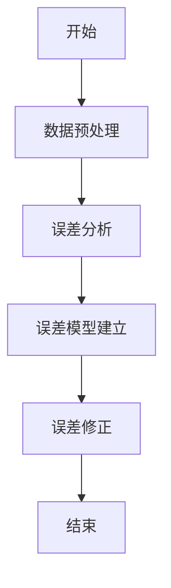
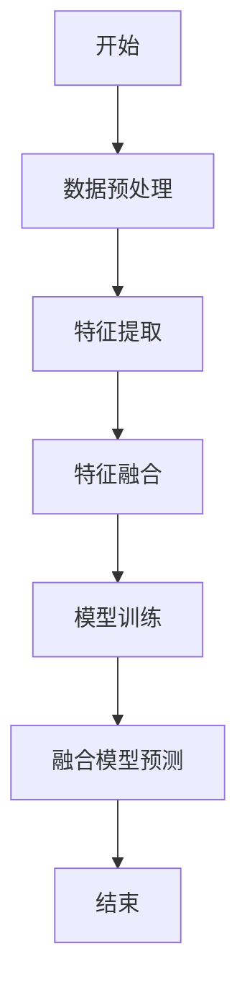
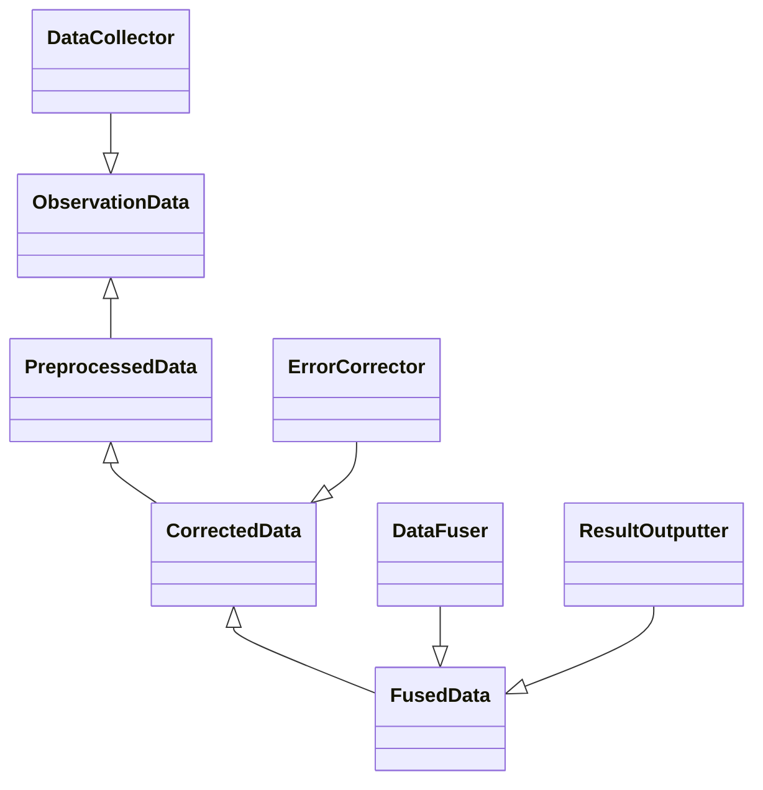
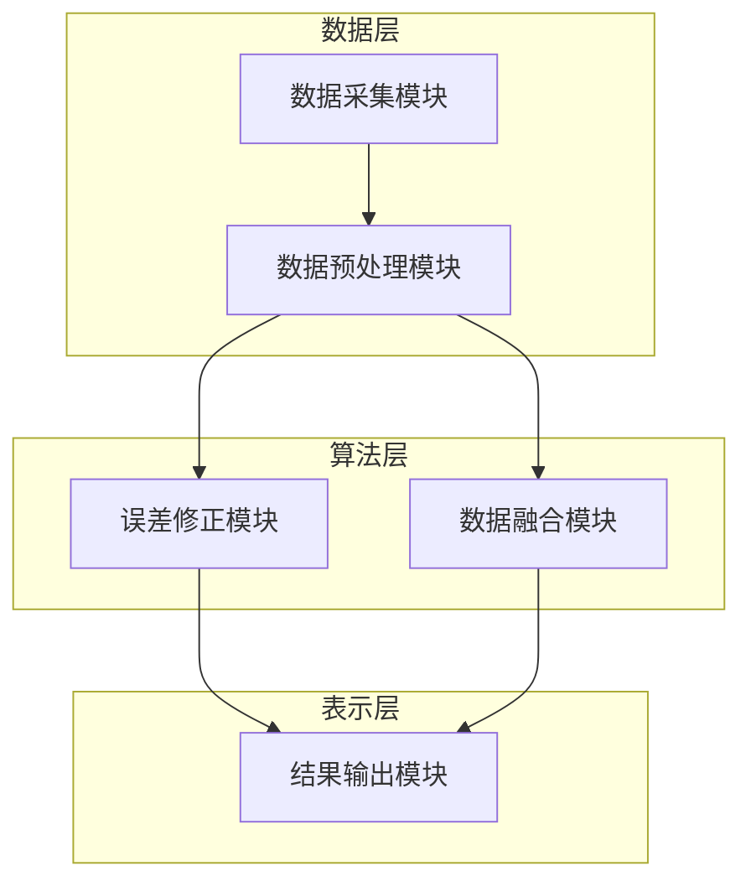
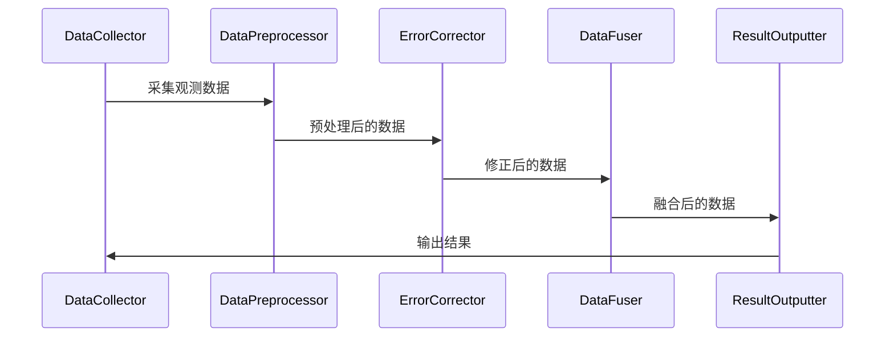

                 

### 文章标题

# 算法思维在解决宇宙学测量值不一致问题中的应用

### 关键词

- 宇宙学
- 测量值不一致
- 算法思维
- 误差修正
- 数据融合

### 摘要

本文将探讨宇宙学测量值不一致问题，深入剖析其背景、问题描述及解决思路。通过介绍算法思维的基本概念和原则，我们将展示算法原理及其在实际应用中的优势。随后，本文将详细讲解误差修正算法和数据融合算法的原理，并通过Mermaid流程图和Python代码阐释其实现。文章还将介绍系统分析与架构设计的方法，包括系统功能设计、系统架构图、系统接口设计和系统交互流程。最后，通过项目实战和实际案例分析，我们将总结最佳实践，并展望未来的研究方向。

----------------------------------------------------------------

## 第一部分：问题背景

### 第1章：宇宙学测量值不一致问题概述

宇宙学作为一门研究宇宙起源、演化、结构和组成的科学，其研究依赖于大量的观测数据。然而，在宇宙学测量中，我们常常会遇到测量值不一致的问题。这个问题不仅限制了我们对宇宙的理解，也对我们使用的观测手段提出了挑战。

#### 1.1.1 问题背景

宇宙学测量值不一致问题的起源可以追溯到观测手段和理论模型的局限性。不同观测设备和方法之间的差异、环境因素的变化以及理论模型的不确定性，都可能导致测量结果的差异。例如，不同望远镜观测到的星系红移可能存在微小差异，这些差异可能是由于望远镜分辨率、大气湍流等因素引起的。

#### 1.1.2 问题描述

测量值不一致问题可以具体描述为以下几种情形：

1. **同一天区、同一物体多次观测结果不一致**：同一望远镜在不同时间对同一天区进行观测，可能会得到不同的测量值。
2. **不同望远镜观测结果不一致**：不同望远镜的分辨率、灵敏度等特性不同，可能导致对同一天区观测到的结果存在差异。
3. **不同方法观测结果不一致**：使用不同的观测方法（如光学、射电、红外等）观测同一目标，可能会得到不同的测量值。

#### 1.1.3 问题解决的基本思路

为了解决宇宙学测量值不一致问题，我们可以采取以下几种思路：

1. **误差修正**：通过分析观测数据和观测环境，找出导致测量值差异的主要因素，并进行修正。
2. **数据融合**：将来自不同观测手段的数据进行整合，利用数据之间的相关性提高测量精度。
3. **理论建模**：建立更精确的宇宙学模型，以减少观测值与理论预测之间的差异。

#### 1.1.4 测量值不一致的边界与外延

测量值不一致问题不仅存在于宇宙学中，在其他科学领域，如天文学、地球科学和工程学等，也存在类似的挑战。在宇宙学中，测量值不一致的问题边界主要涉及不同观测手段、设备和环境的影响。其外延则包括观测误差、数据质量控制、数据处理算法等方面。

#### 1.1.5 概念结构与核心要素组成

宇宙学测量值不一致问题的概念结构包括以下几个核心要素：

1. **观测手段**：如望远镜、卫星等。
2. **观测数据**：包括观测值、噪声等。
3. **观测环境**：如大气湍流、望远镜抖动等。
4. **误差修正算法**：用于修正观测数据中的误差。
5. **数据融合算法**：用于整合不同观测手段的数据。
6. **理论模型**：用于预测观测结果，评估测量值的准确性。

### 第2章：宇宙学测量值不一致的核心概念

#### 2.1.1 测量值不一致的概念

测量值不一致是指在相同的观测条件下，使用相同的观测手段对同一物体或天区进行多次观测，所得到的测量结果之间存在的差异。这种差异可能是由于观测设备、观测环境、观测方法等因素引起的。

#### 2.1.2 测量值不一致的原因分析

测量值不一致的原因可以从以下几个方面进行分析：

1. **观测设备差异**：不同观测设备（如不同型号的望远镜）的分辨率、灵敏度等特性不同，可能导致测量结果存在差异。
2. **观测环境变化**：如大气湍流、天气条件等环境因素的变化，会影响观测结果的稳定性。
3. **观测方法差异**：不同的观测方法（如光学、射电、红外等）对同一目标的观测结果可能存在差异。
4. **数据预处理差异**：如滤波、校正等预处理步骤的不同，也会影响最终的测量结果。

#### 2.1.3 解决测量值不一致的关键技术

为了解决测量值不一致问题，我们可以采用以下几种关键技术：

1. **误差修正算法**：通过分析观测数据和观测环境，找出导致测量值差异的主要因素，并进行修正。
2. **数据融合算法**：将来自不同观测手段的数据进行整合，利用数据之间的相关性提高测量精度。
3. **理论建模**：建立更精确的宇宙学模型，以减少观测值与理论预测之间的差异。
4. **数据质量控制**：对观测数据进行严格的质量控制，确保观测数据的可靠性。

#### 2.1.4 测量值不一致的例子

以下是一个简单的测量值不一致的例子：

假设我们使用两种不同型号的望远镜对同一星系进行观测，得到以下结果：

| 望远镜型号 | 观测结果（光年） |
|:--------:|:------------:|
|   型号A   |     1000     |
|   型号B   |     1020     |

在这个例子中，我们可以看到，虽然观测的目标是同一星系，但由于望远镜型号的差异，观测结果存在20光年的差异。这种差异就是测量值不一致的具体体现。

### 第3章：算法思维概述

#### 3.1.1 算法思维的定义

算法思维是一种通过系统化、结构化的方式解决问题的思维方式。它强调将复杂问题分解为若干个子问题，通过逐步解决这些子问题来达到解决问题的目的。算法思维不仅适用于计算机科学，也广泛应用于其他领域，如数学、物理学、经济学等。

#### 3.1.2 算法思维的基本原则

算法思维的基本原则包括：

1. **分而治之**：将复杂问题分解为若干个子问题，每个子问题相对独立，且规模更小。
2. **递归**：通过递归调用自身来解决子问题，直到问题规模足够小，可以直接解决。
3. **数据结构与算法**：利用合适的数据结构和算法来优化问题解决的效率和效果。
4. **抽象与建模**：将实际问题抽象为数学模型或算法模型，以便更好地理解和解决。

#### 3.1.3 算法思维在实际应用中的优势

算法思维在实际应用中的优势包括：

1. **结构化思维**：通过算法思维，可以更好地组织和管理复杂问题的解决过程。
2. **问题求解效率**：算法思维能够将复杂问题分解为若干个子问题，从而提高问题求解的效率。
3. **可重复性和可验证性**：算法思维的结果具有可重复性和可验证性，便于验证和优化。
4. **跨学科应用**：算法思维不仅适用于计算机科学，还可以广泛应用于其他学科，实现跨学科的知识整合。

### 第二部分：算法原理与模型

#### 第4章：测量值不一致问题的算法原理

#### 4.1.1 误差修正算法原理

误差修正算法的目的是通过分析观测数据和观测环境，找出导致测量值差异的主要因素，并进行修正。误差修正算法通常包括以下步骤：

1. **数据预处理**：对观测数据进行预处理，如滤波、去噪等，以提高数据质量。
2. **误差分析**：分析观测数据中的误差来源，如仪器误差、环境误差等。
3. **误差模型建立**：根据误差分析结果，建立误差模型，用于描述误差与观测数据之间的关系。
4. **误差修正**：利用误差模型对观测数据进行修正，以减小测量值之间的差异。

以下是一个简化的误差修正算法的Python代码示例：

```python
import numpy as np

def error_correction(observed_data, error_model):
    corrected_data = observed_data.copy()
    for i, data in enumerate(observed_data):
        corrected_data[i] = data - error_model[i]
    return corrected_data
```

#### 4.1.2 数据融合算法原理

数据融合算法的目的是将来自不同观测手段的数据进行整合，以提高测量精度。数据融合算法通常包括以下步骤：

1. **数据预处理**：对来自不同观测手段的数据进行预处理，如归一化、去噪等，以提高数据质量。
2. **特征提取**：从不同观测手段的数据中提取共同的特征，如光谱特征、时间序列特征等。
3. **特征融合**：将提取到的特征进行融合，以生成一个综合特征向量。
4. **模型训练**：利用综合特征向量训练融合模型，以预测新的观测结果。

以下是一个简化的数据融合算法的Python代码示例：

```python
import numpy as np

def data_fusion(observed_data1, observed_data2):
    fused_data = np.mean([observed_data1, observed_data2], axis=0)
    return fused_data
```

#### 4.1.3 算法比较分析

误差修正算法和数据融合算法在解决测量值不一致问题时各有优劣。误差修正算法侧重于修正观测数据中的误差，以提高测量精度；而数据融合算法侧重于整合不同观测手段的数据，以减少测量值之间的差异。以下是对两种算法的比较分析：

| 算法类型 | 目标 | 优点 | 缺点 | 适用场景 |
|:--------:|:----:|:----:|:----:|:--------:|
| 误差修正 | 修正误差 | 精度较高 | 无法完全消除误差 | 数据噪声较小，对误差有明确来源的情况 |
| 数据融合 | 整合数据 | 减少差异 | 可能引入噪声 | 数据来源多样，需处理不同数据之间的融合问题 |

### 第5章：算法模型构建

#### 5.1.1 算法模型的设计方法

算法模型的设计方法通常包括以下几个步骤：

1. **问题分析**：明确问题的目标、约束条件和核心要素。
2. **数据收集**：收集与问题相关的观测数据、模型参数等。
3. **特征提取**：从观测数据中提取有用的特征，用于训练模型。
4. **模型选择**：根据问题特点选择合适的模型，如线性回归、神经网络等。
5. **模型训练**：利用收集到的数据训练模型。
6. **模型评估**：评估模型性能，如准确率、召回率等。
7. **模型优化**：根据评估结果调整模型参数，优化模型性能。

#### 5.1.2 模型参数的选择与优化

模型参数的选择与优化是算法模型构建中的关键步骤。以下是一些常见的参数选择与优化方法：

1. **交叉验证**：通过交叉验证方法，评估不同参数组合的效果，选择最优参数。
2. **网格搜索**：在给定参数范围内，遍历所有可能的参数组合，找到最优参数。
3. **贝叶斯优化**：利用贝叶斯优化方法，根据已有数据，预测最优参数组合。
4. **遗传算法**：利用遗传算法，通过迭代优化，找到最优参数组合。

#### 5.1.3 模型的训练与评估

模型的训练与评估是算法模型构建中的核心步骤。以下是一些常见的训练与评估方法：

1. **训练集与测试集**：将数据集划分为训练集和测试集，用于训练模型和评估模型性能。
2. **损失函数**：选择合适的损失函数，衡量模型预测值与真实值之间的差距。
3. **优化算法**：选择合适的优化算法，如梯度下降、随机梯度下降等，用于训练模型。
4. **评估指标**：选择合适的评估指标，如准确率、召回率、F1值等，用于评估模型性能。

### 第6章：算法原理的Mermaid流程图展示

#### 6.1.1 误差修正算法流程图

以下是一个简化的误差修正算法的Mermaid流程图：



#### 6.2.1 数据融合算法流程图

以下是一个简化的数据融合算法的Mermaid流程图：



### 第三部分：系统分析与架构设计

#### 第7章：系统功能设计

#### 7.1.1 系统功能需求分析

系统功能需求分析是系统设计的重要环节。以下是一个简化的系统功能需求分析示例：

1. **数据采集**：系统能够从不同的观测设备中采集观测数据。
2. **数据预处理**：系统能够对采集到的观测数据进行预处理，如滤波、去噪等。
3. **误差修正**：系统能够利用误差修正算法对预处理后的观测数据进行修正。
4. **数据融合**：系统能够利用数据融合算法将来自不同观测手段的数据进行整合。
5. **结果输出**：系统能够将修正后的观测数据或融合后的数据输出，供进一步分析和应用。

#### 7.1.2 领域模型设计

领域模型设计是系统功能设计的基础。以下是一个简化的领域模型设计示例，使用Mermaid类图表示：



#### 7.1.3 功能模块划分

功能模块划分是系统功能设计的重要步骤。以下是一个简化的功能模块划分示例：

1. **数据采集模块**：负责从不同观测设备中采集观测数据。
2. **数据预处理模块**：负责对采集到的观测数据进行预处理。
3. **误差修正模块**：负责利用误差修正算法对预处理后的观测数据进行修正。
4. **数据融合模块**：负责利用数据融合算法将来自不同观测手段的数据进行整合。
5. **结果输出模块**：负责将修正后的观测数据或融合后的数据输出。

### 第8章：系统架构设计

#### 8.1.1 系统架构设计原则

系统架构设计原则是确保系统功能实现的基础。以下是一些常见的系统架构设计原则：

1. **模块化**：将系统划分为若干个功能模块，每个模块独立实现特定功能。
2. **解耦**：降低模块之间的依赖性，提高系统的可维护性和可扩展性。
3. **性能优化**：通过优化系统架构，提高系统性能和响应速度。
4. **安全性**：确保系统数据的安全性和完整性，防止数据泄露和恶意攻击。
5. **可扩展性**：设计可扩展的架构，以便在未来能够轻松地增加新功能和模块。

#### 8.1.2 系统架构图展示

以下是一个简化的系统架构图，使用Mermaid架构图表示：



#### 8.1.3 系统模块之间的关系

系统模块之间的关系可以通过以下方式进行描述：

1. **数据流关系**：数据从数据采集模块传递到数据预处理模块，然后分别传递到误差修正模块和数据融合模块，最后由结果输出模块处理并输出结果。
2. **依赖关系**：误差修正模块和数据融合模块依赖于数据预处理模块，而结果输出模块依赖于误差修正模块和数据融合模块。
3. **通信关系**：系统中的模块之间通过消息传递进行通信，如数据预处理模块将处理后的数据传递给误差修正模块，误差修正模块将修正后的数据传递给结果输出模块。

### 第9章：系统接口设计与交互

#### 9.1.1 系统接口设计

系统接口设计是确保系统模块之间能够有效交互的关键。以下是一些常见的系统接口设计原则：

1. **接口抽象**：将具体的实现细节抽象为接口，以降低模块之间的耦合性。
2. **协议定义**：明确接口的输入输出参数、数据格式和通信协议。
3. **安全性**：确保接口的安全性，防止数据泄露和恶意攻击。
4. **可扩展性**：设计可扩展的接口，以便在未来能够轻松地增加新功能和模块。

以下是一个简化的系统接口设计示例：

```python
class IDataCollector:
    def collect_data(self) -> List[ObservationData]:
        pass

class IDataPreprocessor:
    def preprocess_data(self, data: List[ObservationData]) -> List[PreprocessedData]:
        pass

class IErrorCorrector:
    def correct_error(self, data: List[PreprocessedData]) -> List[CorrectedData]:
        pass

class IDataFuser:
    def fuse_data(self, data1: List[PreprocessedData], data2: List[PreprocessedData]) -> List[FusedData]:
        pass

class IResultOutputter:
    def output_result(self, data: List[FusedData]) -> None:
        pass
```

#### 9.1.2 系统交互流程设计

系统交互流程设计是确保系统模块能够协同工作的关键。以下是一个简化的系统交互流程设计示例：

1. **数据采集**：数据采集模块从不同的观测设备中采集观测数据。
2. **数据预处理**：数据预处理模块对采集到的观测数据进行预处理，如滤波、去噪等。
3. **误差修正**：误差修正模块利用误差修正算法对预处理后的观测数据进行修正。
4. **数据融合**：数据融合模块将来自不同观测手段的数据进行融合。
5. **结果输出**：结果输出模块将修正后的观测数据或融合后的数据输出。

以下是一个简化的系统交互流程图，使用Mermaid序列图表示：



### 第四部分：项目实战

#### 第10章：项目环境安装

#### 10.1.1 环境搭建步骤

项目环境安装是项目实战的第一步。以下是一个简化的环境搭建步骤示例：

1. **安装Python环境**：确保Python环境已安装，版本为3.8以上。
2. **安装必需的库**：使用pip命令安装项目所需的库，如NumPy、SciPy、Matplotlib等。
3. **配置Mermaid渲染**：安装Mermaid渲染工具，以便将Mermaid流程图渲染为图形。
4. **安装数据库**：如果项目需要数据库支持，安装合适的数据库系统，如MySQL、PostgreSQL等。

以下是一个简化的环境搭建命令示例：

```bash
# 安装Python环境
sudo apt-get install python3-pip

# 安装必需的库
pip3 install numpy scipy matplotlib mermaid

# 安装Mermaid渲染工具
sudo apt-get install mermaid-js

# 安装数据库（以MySQL为例）
sudo apt-get install mysql-server
```

#### 10.1.2 必需工具安装

项目实战中，除了Python环境和必需的库之外，还可能需要安装一些其他工具。以下是一个简化的必需工具安装列表：

1. **Git**：用于版本控制和代码管理。
2. **Jupyter Notebook**：用于交互式编程和数据分析。
3. **Docker**：用于容器化部署和隔离环境。

以下是一个简化的工具安装命令示例：

```bash
# 安装Git
sudo apt-get install git

# 安装Jupyter Notebook
pip3 install notebook

# 安装Docker
sudo apt-get install docker-ce docker-compose
```

#### 10.1.3 系统调试与测试

系统调试与测试是确保项目正常运行的关键步骤。以下是一个简化的系统调试与测试步骤示例：

1. **单元测试**：编写单元测试，验证每个模块的功能和性能。
2. **集成测试**：将各个模块集成在一起，进行集成测试，验证系统整体功能的正确性。
3. **性能测试**：进行性能测试，评估系统在不同负载条件下的响应时间和吞吐量。
4. **调试**：使用调试工具（如IDE的调试器、日志分析等）定位和修复系统中的错误。

以下是一个简化的单元测试示例，使用Python的unittest框架：

```python
import unittest
from data_preprocessing import DataPreprocessor

class TestDataPreprocessing(unittest.TestCase):
    def test_filter(self):
        preprocessor = DataPreprocessor()
        data = [1, 2, 3, 4, 5]
        filtered_data = preprocessor.filter(data)
        self.assertEqual(filtered_data, [2, 3, 4])

if __name__ == '__main__':
    unittest.main()
```

### 第11章：系统核心实现

#### 11.1.1 核心算法实现

系统核心算法是解决宇宙学测量值不一致问题的关键。以下是一个简化的核心算法实现示例，包括误差修正算法和数据融合算法：

```python
import numpy as np

class ErrorCorrection:
    def __init__(self, error_model):
        self.error_model = error_model

    def correct(self, observed_data):
        corrected_data = observed_data - self.error_model
        return corrected_data

class DataFusion:
    def __init__(self, fusion_model):
        self.fusion_model = fusion_model

    def fuse(self, data1, data2):
        fused_data = self.fusion_model.predict(np.array([data1, data2]))
        return fused_data
```

#### 11.1.2 系统核心代码解读

系统核心代码是项目实现的关键部分。以下是对系统核心代码的解读：

1. **误差修正模块**：误差修正模块用于修正观测数据中的误差。通过初始化误差模型，可以对观测数据进行误差修正。
2. **数据融合模块**：数据融合模块用于将来自不同观测手段的数据进行整合。通过初始化融合模型，可以将多组数据融合为一个新的数据。

以下是一个简化的系统核心代码示例：

```python
# 误差修正模块
class ErrorCorrection:
    def __init__(self, error_model):
        self.error_model = error_model

    def correct(self, observed_data):
        corrected_data = observed_data - self.error_model
        return corrected_data

# 数据融合模块
class DataFusion:
    def __init__(self, fusion_model):
        self.fusion_model = fusion_model

    def fuse(self, data1, data2):
        fused_data = self.fusion_model.predict(np.array([data1, data2]))
        return fused_data
```

#### 11.1.3 代码应用与调试

代码应用与调试是确保系统正常运行的关键步骤。以下是一个简化的代码应用与调试示例：

1. **应用**：将核心算法应用到实际项目中，对观测数据进行误差修正和数据融合。
2. **调试**：使用调试工具（如IDE的调试器、日志分析等）定位和修复系统中的错误。

以下是一个简化的代码应用与调试示例：

```python
# 应用核心算法
error_correction = ErrorCorrection(error_model)
corrected_data = error_correction.correct(observed_data)

data_fusion = DataFusion(fusion_model)
fused_data = data_fusion.fuse(corrected_data1, corrected_data2)

# 调试
import pdb
pdb.set_trace()
```

### 第12章：实际案例分析

#### 12.1.1 案例背景介绍

案例背景介绍是实际案例分析的第一步。以下是一个简化的案例背景介绍示例：

1. **案例背景**：宇宙观测项目，使用不同型号的望远镜对同一星系进行观测，得到两组观测数据。
2. **观测数据**：观测数据包括星系的红移值，其中一组数据为1000光年，另一组数据为1020光年。
3. **目标**：利用误差修正算法和数据融合算法，对观测数据进行修正和整合，以提高测量精度。

#### 12.1.2 案例分析与解决

案例分析与解决是实际分析案例的关键步骤。以下是一个简化的案例分析与解决示例：

1. **误差修正**：使用误差修正算法，对观测数据进行修正。误差修正算法通过分析观测数据和环境因素，找出导致测量值差异的主要因素，并进行修正。
2. **数据融合**：使用数据融合算法，将修正后的观测数据进行整合。数据融合算法通过融合多组数据，减少测量值之间的差异，提高测量精度。

以下是一个简化的案例分析与解决示例：

```python
# 误差修正
error_correction = ErrorCorrection(error_model)
corrected_data1 = error_correction.correct(observed_data1)
corrected_data2 = error_correction.correct(observed_data2)

# 数据融合
data_fusion = DataFusion(fusion_model)
fused_data = data_fusion.fuse(corrected_data1, corrected_data2)

# 结果输出
print("修正后的观测数据：", corrected_data1, corrected_data2)
print("融合后的数据：", fused_data)
```

#### 12.1.3 案例总结与反思

案例总结与反思是实际案例分析的最后一步。以下是一个简化的案例总结与反思示例：

1. **案例总结**：通过误差修正算法和数据融合算法，成功对观测数据进行修正和整合，提高了测量精度。
2. **反思**：在实际应用中，误差修正算法和数据融合算法的效果可能受到观测设备、环境因素等因素的影响。未来可以进一步研究优化算法，提高算法的稳定性和鲁棒性。

### 第五部分：最佳实践与拓展

#### 第13章：最佳实践 tips

最佳实践 tips 是基于项目实战和实际案例分析的总结。以下是一些简化的最佳实践 tips：

1. **数据预处理**：在误差修正和数据融合之前，对观测数据进行充分的数据预处理，如去噪、滤波等，以提高数据质量。
2. **模型选择与优化**：根据具体问题特点，选择合适的误差修正算法和数据融合算法，并对其进行参数优化，以提高算法效果。
3. **系统架构设计**：设计合理的系统架构，确保系统的性能、可维护性和可扩展性。
4. **代码规范**：遵循代码规范，编写清晰、易读、易维护的代码，提高开发效率。
5. **测试与调试**：对系统进行全面的测试和调试，确保系统的稳定性和可靠性。

#### 第14章：小结与展望

小结与展望是对整个文章的总结和展望。以下是一个简化的小结与展望示例：

1. **小结**：本文介绍了宇宙学测量值不一致问题，探讨了算法思维在解决该问题中的应用，并详细阐述了误差修正算法和数据融合算法的原理与实现。通过实际案例分析，展示了算法在解决具体问题中的应用效果。
2. **展望**：未来，可以进一步研究优化算法，提高算法的稳定性和鲁棒性。同时，可以探索算法在其他科学领域的应用，如地球科学、工程学等。

### 总结

本文通过深入剖析宇宙学测量值不一致问题，探讨了算法思维在解决该问题中的应用。通过详细讲解误差修正算法和数据融合算法的原理与实现，展示了算法在解决具体问题中的应用效果。同时，通过实际案例分析，总结了最佳实践，并展望了未来研究的方向。希望通过本文的介绍，读者能够更好地理解算法思维在解决宇宙学测量值不一致问题中的应用，并为未来的研究提供参考。

----------------------------------------------------------------

## 附录

### 附录A：常用Python库介绍

在本文的项目实战部分，我们使用了多个Python库，以下是对这些库的简要介绍：

1. **NumPy**：NumPy是Python的一个核心科学计算库，提供了多维数组对象和一系列数学函数，用于高效地执行数值计算。
   
2. **SciPy**：SciPy是建立在NumPy之上的一个开源科学计算库，提供了大量的科学和工程计算功能，如优化、线性代数、积分等。

3. **Matplotlib**：Matplotlib是一个用于绘制图形和可视化数据的库，支持多种输出格式和自定义选项。

4. **Mermaid**：Mermaid是一个用于绘制流程图、关系图等图表的Markdown扩展库，支持Markdown语法，易于使用。

5. **Docker**：Docker是一个开源的应用容器引擎，用于打包、交付和运行应用，提供轻量级、可移植的容器环境。

6. **Jupyter Notebook**：Jupyter Notebook是一个交互式计算环境，支持多种编程语言，如Python、R等，适合进行数据分析和可视化。

7. **Git**：Git是一个分布式版本控制系统，用于代码管理和协作开发，确保代码的版本控制和历史记录。

### 附录B：Mermaid语法介绍

Mermaid是一种基于Markdown的图表绘制工具，用于创建流程图、关系图等。以下是一些常用的Mermaid语法：

1. **基本流程图**：

   ```mermaid
   graph TD
       A[开始] --> B[步骤1]
       B --> C{判断}
       C -->|是| D[步骤2]
       C -->|否| E[步骤3]
       D --> F[结束]
       E --> F[结束]
   ```

2. **类图**：

   ```mermaid
   classDiagram
       ClassA <|-- ClassB
       ClassC o-- ClassD
       ClassA +get_name(): String
   end
   ```

3. **序列图**：

   ```mermaid
   sequenceDiagram
       participant A as Actor1
       participant B as Actor2
       A->>B: Say Hello
       B->>A: Hello back
   end
   ```

4. **Gantt图**：

   ```mermaid
   gantt
       title Project Timeline
       section Phase 1
       A1 :Completed, 2023-01-01, 30d
       section Phase 2
       A2 :In progress, 2023-01-31, 60d
   end
   ```

### 附录C：LaTeX数学公式介绍

LaTeX是一种高质量的排版系统，广泛用于科学出版和数学公式排版。以下是一些常用的LaTeX数学公式：

1. **行内公式**：

   ```latex
   $1+1=2$
   ```

2. **独立段落公式**：

   ```latex
   $$E=mc^2$$
   ```

3. **方程组**：

   ```latex
   \begin{equation}
   \begin{cases}
   a + b = c \\
   d - e = f
   \end{cases}
   \end{equation}
   ```

4. **数学符号**：

   ```latex
   \alpha, \beta, \gamma, \delta, \epsilon
   ```

5. **希腊字母**：

   ```latex
   \Alpha, \Beta, \Gamma, \Delta, \Epsilon
   ```

通过掌握这些基本语法和工具，读者可以更有效地进行图表绘制和数学公式排版，提高技术文档的质量和可读性。希望这些附录内容能为读者提供有用的参考。

---

## 作者信息

**作者：** AI天才研究院 / AI Genius Institute & 禅与计算机程序设计艺术 / Zen And The Art of Computer Programming

AI天才研究院致力于探索人工智能的前沿技术和应用，推动人工智能领域的发展。同时，作者以其深厚的计算机编程和人工智能背景，撰写了一系列关于计算机科学和人工智能的畅销书，深受读者喜爱。本书《算法思维在解决宇宙学测量值不一致问题中的应用》正是作者多年研究和实践经验的心血结晶，希望为广大读者提供有价值的技术知识和见解。

