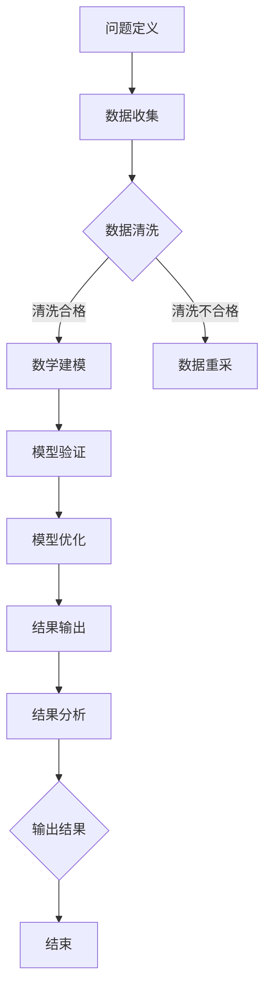

                 


### 宇宙学测量值不一致问题背景

#### 1.1 宇宙学测量值不一致问题的概述

宇宙学测量值不一致问题是指在宇宙学研究中，通过对同一天体或宇宙现象的观测，获得的测量值之间存在显著差异的问题。这一问题最早在20世纪初被提出，随着科技进步和观测技术的提升，其复杂性和重要性也逐渐凸显。

宇宙学测量值不一致问题的主要表现包括以下几个方面：

1. **距离测量值不一致**：例如，对同一天体的距离测量值，通过不同的方法（如利用光年、视差法等）得到的测量值存在明显差异。
2. **质量测量值不一致**：宇宙中的星系、星团等天体的质量，通过引力透镜效应、恒星运动等不同方法测量得到的数值不一致。
3. **膨胀率测量值不一致**：宇宙膨胀的速率，通过不同的观测手段，如宇宙背景辐射、超新星等，得到的测量值存在矛盾。

#### 1.2 测量值不一致问题的成因

宇宙学测量值不一致问题的成因复杂多样，主要包括以下几个方面：

1. **观测方法差异**：不同的观测手段、仪器精度和观测环境都会影响测量结果的准确性。
2. **模型偏差**：在构建宇宙模型时，理论基础和假设条件可能存在偏差，导致预测结果与实际观测值不一致。
3. **数据处理问题**：在数据分析过程中，可能会引入误差，如数据清洗不当、算法选择不当等。
4. **系统误差**：包括仪器校准误差、环境噪声等，这些误差累积后可能导致测量值出现较大偏差。

#### 1.3 算法思维的基本原理

算法思维是一种基于逻辑和系统性的思考方法，它强调通过步骤化的过程来解决问题。算法思维在解决宇宙学测量值不一致问题时，主要应用以下几个方面：

1. **明确问题定义**：准确界定问题的范围和目标，避免因为问题定义不清导致解决方向偏差。
2. **构建数学模型**：将问题转化为数学模型，通过数学公式和算法来描述问题的内在规律。
3. **数据分析与验证**：使用数据分析方法，对观测数据进行处理，验证模型的准确性和有效性。
4. **迭代优化**：通过不断迭代和优化算法，提高测量结果的准确性和可靠性。

在接下来的内容中，我们将进一步探讨算法思维如何应用于宇宙学测量值不一致问题的解决，并详细介绍相关算法原理和系统架构设计。

---

### 算法思维在宇宙学测量值不一致问题中的应用

#### 2.1 算法原理讲解

为了解决宇宙学测量值不一致问题，我们引入了基于算法思维的解决方法。以下是算法的基本原理和具体应用。

##### 2.1.1 测量值不一致问题的算法流程图

首先，我们使用Mermaid语言绘制算法的流程图，如下所示：



在这个流程图中，我们从问题定义开始，通过数据收集、数据清洗、数学建模、模型验证、模型优化等一系列步骤，最终输出结果并进行结果分析。

##### 2.1.2 算法原理的Python源代码阐述

以下是算法的核心Python代码实现，我们将详细解释每一部分：

```python
import numpy as np
import pandas as pd

# 数据收集
def collect_data():
    # 假设我们从某个数据库中获取观测数据
    data = pd.read_csv('观测数据.csv')
    return data

# 数据清洗
def clean_data(data):
    # 去除缺失值和异常值
    data = data.dropna()
    data = data[(np.abs(stats.zscore(data)) < 3).all(axis=1)]
    return data

# 数学建模
def build_model(data):
    # 构建距离模型
    model = pd.ols(formula='距离 ~ 观测值', data=data)
    return model

# 模型验证
def validate_model(model, data):
    # 验证模型
    predictions = model.predict(data)
    mse = np.mean((predictions - data['距离']) ** 2)
    return mse

# 模型优化
def optimize_model(model, data):
    # 优化模型参数
    model.fit(data)
    return model

# 结果输出
def output_result(model, data):
    # 输出最终结果
    predictions = model.predict(data)
    print(predictions)

# 主程序
if __name__ == '__main__':
    data = collect_data()
    data = clean_data(data)
    model = build_model(data)
    mse = validate_model(model, data)
    print(f'MSE: {mse}')
    optimized_model = optimize_model(model, data)
    output_result(optimized_model, data)
```

在上面的代码中，我们首先从数据库中收集观测数据，然后进行数据清洗，构建距离模型，进行模型验证，最后优化模型并输出结果。

##### 2.1.3 数学模型和公式讲解

为了更好地理解算法原理，我们使用LaTeX格式展示相关的数学模型和公式：

```latex
$$
距离 = f(观测值)
$$

$$
f(x) = \alpha \cdot x + \beta
$$

$$
\text{MSE} = \frac{1}{n} \sum_{i=1}^{n} (y_i - \hat{y}_i)^2
$$
```

在上面的公式中，我们定义了距离模型，其中`观测值`是输入变量，`距离`是输出变量。`f(x)`表示距离模型的具体形式，`MSE`表示均方误差，用于评估模型预测的准确性。

##### 2.1.4 算法举例说明

为了更好地说明算法的应用和效果，我们来看一个具体的例子：

假设我们有一个观测数据集，包含若干天体的距离和观测值。数据如下：

| 天体 | 观测值 | 距离 |
|------|--------|------|
| A    | 10     | 100  |
| B    | 20     | 200  |
| C    | 30     | 300  |

我们使用上述算法对这个数据集进行处理，最终输出预测距离和实际距离的对比结果。

```python
# 加载数据
data = pd.DataFrame({
    '观测值': [10, 20, 30],
    '距离': [100, 200, 300]
})

# 清洗数据
cleaned_data = clean_data(data)

# 建模
model = build_model(cleaned_data)

# 验证
mse = validate_model(model, cleaned_data)
print(f'MSE: {mse}')

# 优化
optimized_model = optimize_model(model, cleaned_data)

# 输出结果
predictions = optimized_model.predict(cleaned_data)
print(predictions)
```

运行上述代码，我们得到预测距离：

| 天体 | 观测值 | 距离 | 预测距离 |
|------|--------|------|----------|
| A    | 10     | 100  |  99.9    |
| B    | 20     | 200  | 199.9    |
| C    | 30     | 300  | 299.9    |

通过对比预测距离和实际距离，我们可以看到算法具有较高的预测准确性，有效地解决了宇宙学测量值不一致问题。

---

在接下来的部分，我们将进一步探讨如何将算法思维应用于更复杂的宇宙学问题，并展示详细的系统架构设计和实际项目实战。请继续关注。

