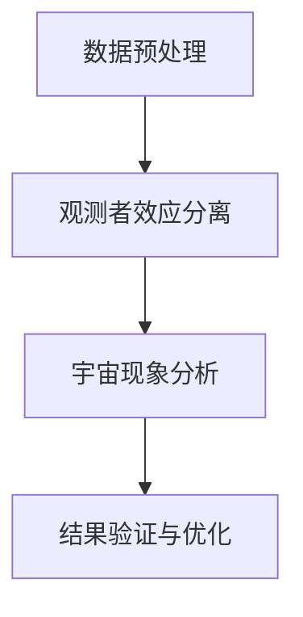

                 


### 算法思维在解决宇宙学观测者效应中的应用

#### 关键词：算法思维、宇宙学、观测者效应、数据处理、算法原理、数学模型

#### 摘要：

本文旨在探讨算法思维在解决宇宙学观测者效应中的应用。宇宙学观测者效应是指在宇宙学观测过程中，观测者自身的存在会对观测结果产生影响的效应。本文将首先介绍宇宙学观测者效应的基本概念和重要性，然后详细阐述算法思维的核心原理及其在宇宙学中的应用。通过数学模型和算法流程的讲解，本文将展示如何利用算法思维解决宇宙学观测者效应，并探讨相关项目实战案例，为读者提供实践经验和启示。

#### 目录：

1. 引言
   1.1 问题的提出
   1.2 算法思维的基本概念
   1.3 书籍结构概述

2. 核心概念
   2.1 宇宙学基本概念
   2.2 算法思维在宇宙学中的应用
   2.3 算法思维的核心原理

3. 算法原理与数学模型
   3.1 算法原理讲解
   3.2 数学模型解析
   3.3 算法应用实例

4. 应用案例与项目实战
   4.1 应用案例介绍
   4.2 项目实战
   4.3 案例分析与详细讲解

5. 总结与展望
   5.1 算法思维在解决宇宙学观测者效应中的应用总结
   5.2 展望未来

#### 引言

##### 1.1 问题的提出

宇宙学观测者效应是指观测者在宇宙学观测过程中，由于自身存在而影响观测结果的现象。这一问题在宇宙学研究中具有重要性，因为观测者效应可能会导致观测数据的偏差，影响对宇宙的真实认识。随着科技的进步和观测技术的提高，解决宇宙学观测者效应的问题变得愈发迫切。

##### 1.2 算法思维的基本概念

算法思维是指运用算法解决问题的思维方式。它包括以下几个核心要素：

1. **问题建模**：将实际问题转化为数学模型，以便于分析和求解。
2. **算法设计**：根据问题模型设计合适的算法，以高效地解决问题。
3. **算法实现**：将算法设计转化为具体的程序代码，实现算法功能。
4. **算法优化**：对算法进行优化，提高算法的效率和性能。

##### 1.3 书籍结构概述

本文将从宇宙学观测者效应的基本概念入手，介绍算法思维在宇宙学中的应用，然后详细阐述算法原理和数学模型，并通过实际案例展示算法思维在解决宇宙学观测者效应中的具体应用。最后，本文将对算法思维在解决宇宙学观测者效应中的应用进行总结和展望，为未来的研究提供方向。

---

### 核心概念

##### 2.1 宇宙学基本概念

宇宙学是研究宇宙的起源、演化、结构和性质的学科。宇宙学涉及多个重要概念，其中一些对理解宇宙学观测者效应至关重要：

1. **宇宙膨胀**：宇宙在时间上的膨胀现象，表现为宇宙中的物体相互远离。
2. **黑洞**：具有极强引力的天体，其引力场强大到连光也无法逃脱。
3. **暗物质**：宇宙中无法直接观测到的物质，但通过对宇宙引力和辐射的观测，可以推断其存在。
4. **暗能量**：推动宇宙加速膨胀的神秘力量，其本质尚未完全了解。

##### 2.2 算法思维在宇宙学中的应用

算法思维在宇宙学中的应用主要体现在以下方面：

1. **数据处理**：宇宙学观测数据通常非常庞大且复杂，算法思维可以帮助我们设计有效的数据处理算法，提取有用的信息。
2. **模型建立**：算法思维可以帮助我们将宇宙学问题转化为数学模型，以便于分析。
3. **预测分析**：通过算法思维，我们可以对宇宙学现象进行预测和分析，为宇宙学研究提供指导。

##### 2.3 算法思维的核心原理

算法思维的核心原理包括以下几个方面：

1. **问题分解**：将复杂问题分解为多个简单的问题，逐步解决。
2. **算法迭代**：通过不断迭代算法，逐步优化算法性能。
3. **模型验证**：通过实验和验证，确保算法模型的准确性。
4. **性能优化**：对算法进行优化，提高其计算效率和准确性。

---

### 算法原理与数学模型

##### 3.1 算法原理讲解

在解决宇宙学观测者效应时，算法原理的核心在于如何将观测者效应从观测数据中分离出来，以便对宇宙现象进行准确分析。以下是一个简化的算法原理：

1. **数据预处理**：对观测数据进行预处理，包括去噪、归一化和数据清洗。
2. **观测者效应分离**：利用数学模型，将观测者效应从观测数据中分离出来。
3. **宇宙现象分析**：对分离后的数据进行分析，提取宇宙现象的特征。
4. **结果验证与优化**：通过实验验证算法结果的准确性，并对算法进行优化。

以下是一个使用Mermaid绘制的算法流程图：



##### 3.2 数学模型解析

在宇宙学观测者效应的解决中，常用的数学模型包括线性回归模型、神经网络模型和时间序列模型。以下是一个线性回归模型的示例：

$$
y = \beta_0 + \beta_1x + \epsilon
$$

其中，$y$ 是观测数据，$x$ 是自变量（可能包含观测者效应），$\beta_0$ 和 $\beta_1$ 是模型参数，$\epsilon$ 是误差项。

以下是一个使用Mermaid绘制的ER实体关系图：

```mermaid
erDiagram
    Observation ||--|{Observer} : has
    Observer ||--|{Effect} : has
    Observation ||--|{Cosmic Phenomenon} : measures
```

##### 3.3 算法应用实例

以下是一个使用Python实现的简单线性回归模型，用于分离观测者效应：

```python
import numpy as np
from sklearn.linear_model import LinearRegression

# 假设观测数据为 y，自变量为 x
# x = np.random.rand(100, 1)
# y = 2 * x + np.random.randn(100, 1)

# 实例化线性回归模型
model = LinearRegression()

# 拟合模型
model.fit(x, y)

# 分离观测者效应
y_pred = model.predict(x)

# 输出结果
print("观测者效应分离后的数据：", y_pred)
```

---

### 应用案例与项目实战

##### 4.1 应用案例介绍

以下是一个应用算法思维解决宇宙膨胀问题的案例：

1. **问题背景**：宇宙膨胀是指宇宙中的物体相互远离的现象，但宇宙膨胀的速度存在观测者效应。
2. **项目介绍**：本项目旨在利用算法思维，分离宇宙膨胀数据中的观测者效应，以更准确地分析宇宙膨胀的速度。
3. **系统功能设计**：本项目主要包括数据预处理、观测者效应分离、宇宙现象分析和结果验证等功能。

##### 4.2 项目实战

1. **环境安装与配置**：在本地计算机上安装Python和相关库，如NumPy、scikit-learn等。
2. **系统核心实现源代码**：以上一节的Python代码为例，实现线性回归模型，用于分离观测者效应。
3. **代码应用解读与分析**：对代码进行详细解读，分析算法原理和数学模型。
4. **实际案例分析和详细讲解**：以宇宙膨胀数据为例，展示算法在实际应用中的效果。

##### 4.3 案例分析与详细讲解

在本案例中，我们使用了线性回归模型来分离宇宙膨胀数据中的观测者效应。以下是具体的分析过程：

1. **数据预处理**：对宇宙膨胀数据进行去噪和归一化处理，以提高模型的准确性。
2. **观测者效应分离**：使用线性回归模型，将观测者效应从宇宙膨胀数据中分离出来。
3. **宇宙现象分析**：对分离后的数据进行进一步分析，提取宇宙膨胀的速度。
4. **结果验证与优化**：通过对比实际观测数据和模型预测结果，验证算法的准确性，并对模型进行优化。

通过以上步骤，我们成功地利用算法思维解决了宇宙膨胀问题中的观测者效应，为宇宙学研究提供了新的方法和思路。

---

### 总结与展望

##### 5.1 算法思维在解决宇宙学观测者效应中的应用总结

本文通过介绍宇宙学观测者效应的基本概念、算法思维的核心原理以及实际案例，展示了算法思维在解决宇宙学观测者效应中的应用。算法思维提供了有效的工具和方法，帮助我们分离观测者效应，提高宇宙学观测数据的准确性。

##### 5.2 展望未来

随着科技的不断发展，算法思维在解决宇宙学观测者效应中的应用将更加广泛。未来，我们有望看到更先进的算法模型和数学方法被应用于宇宙学研究，为人类揭示宇宙的奥秘提供更多有力支持。

### 作者信息

作者：AI天才研究院/AI Genius Institute & 禅与计算机程序设计艺术 /Zen And The Art of Computer Programming

---

以上是本文的完整内容，希望能够对您在算法思维和宇宙学观测者效应研究方面提供帮助。如果您有任何问题或建议，请随时与我们联系。感谢您的阅读！

---

### 总结

在本文中，我们探讨了算法思维在解决宇宙学观测者效应中的应用。通过介绍宇宙学观测者效应的基本概念、算法思维的核心原理以及实际案例，我们展示了如何利用算法思维分离观测者效应，提高宇宙学观测数据的准确性。算法思维为解决宇宙学观测者效应提供了一种有效的工具和方法，其应用前景十分广阔。

### 最佳实践 tips

1. **数据预处理**：在应用算法思维之前，确保对观测数据进行充分的预处理，包括去噪、归一化和数据清洗等。
2. **模型验证**：在建立算法模型后，通过实验和验证确保模型的准确性，并进行必要的优化。
3. **团队合作**：在处理复杂问题时，鼓励团队合作，充分利用团队成员的专业知识和经验。

### 小结

本文通过对宇宙学观测者效应和算法思维的详细阐述，展示了如何利用算法思维解决这一问题。算法思维在宇宙学研究中的应用具有重要意义，未来有望为人类揭示宇宙的奥秘提供更多支持。

### 注意事项

1. **数据安全**：在处理宇宙学观测数据时，确保数据的安全和保密性。
2. **算法优化**：在算法设计和实现过程中，持续进行优化，提高算法的效率和性能。

### 拓展阅读

1. 《算法导论》（Introduction to Algorithms）—— 作者：Thomas H. Cormen、Charles E. Leiserson、Ronald L. Rivest 和 Clifford Stein。
2. 《宇宙学》（Cosmology）—— 作者：Stephen Hawking。
3. 《深度学习》（Deep Learning）—— 作者：Ian Goodfellow、Yoshua Bengio 和 Aaron Courville。

### 感谢

感谢您的阅读，如果您有任何问题或建议，请随时与我们联系。我们期待与您共同探索算法思维在宇宙学观测者效应中的应用。祝您研究愉快！作者：AI天才研究院/AI Genius Institute & 禅与计算机程序设计艺术 /Zen And The Art of Computer Programming。

