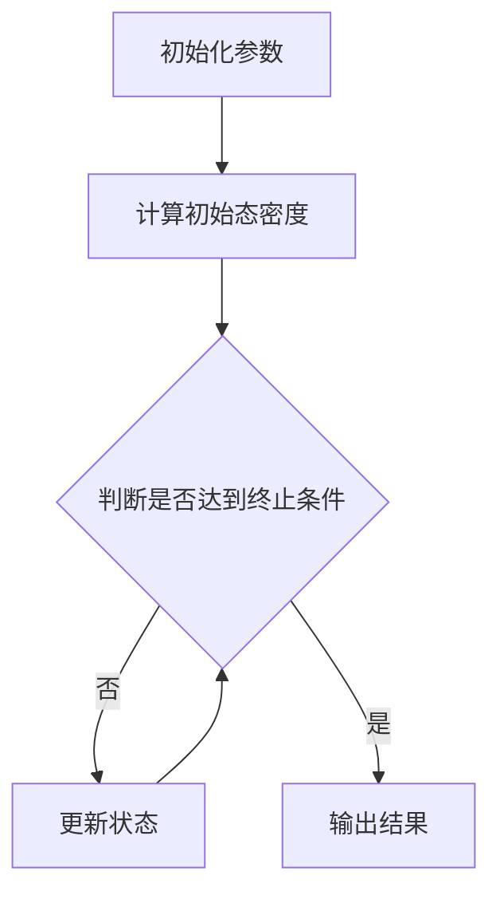

                 

# 算法思维在解决霍金辐射悖论中的应用

## 关键词

霍金辐射悖论、算法思维、量子物理学、信息熵、黑洞熵、人工智能

## 摘要

本文旨在探讨算法思维在解决霍金辐射悖论中的应用。霍金辐射悖论是现代物理学中的一个重大难题，涉及到量子物理学和热力学的基本原理。算法思维作为计算机科学的核心方法论，其在解决复杂科学问题中扮演着越来越重要的角色。本文将首先介绍霍金辐射悖论的背景和核心概念，然后阐述算法思维的基本原理和应用领域，接着深入分析算法思维如何与物理学结合，最终通过具体的算法设计和数学模型，详细探讨解决霍金辐射悖论的思路和方法。

## 目录大纲

----------------------------------------------------------------

# 算法思维在解决霍金辐射悖论中的应用

> 关键词：霍金辐射悖论、算法思维、量子物理学、信息熵、黑洞熵、人工智能

> 摘要：本文深入探讨算法思维在解决霍金辐射悖论中的应用，分析其背景、核心概念、算法原理，并展示具体的设计和实现过程。

```markdown
----------------------------------------------------------------
## 第一部分: 问题背景与核心概念

## 第1章: 霍金辐射悖论概述

### 1.1.1 霍金辐射悖论问题背景
### 1.1.2 霍金辐射悖论问题描述
### 1.1.3 霍金辐射悖论解决思路

## 第2章: 算法思维基础

### 2.1.1 算法思维概述
### 2.1.2 算法思维的核心概念
### 2.1.3 算法思维的应用领域

## 第3章: 算法思维与霍金辐射悖论的联系

### 3.1.1 算法思维在霍金辐射悖论中的角色
### 3.1.2 算法思维与物理学的结合
### 3.1.3 算法思维在解决霍金辐射悖论中的应用

----------------------------------------------------------------
## 第二部分: 算法原理讲解

## 第4章: 解决霍金辐射悖论的算法设计

### 4.1.1 算法设计思路
### 4.1.2 算法流程图
### 4.1.3 算法原理讲解

## 第5章: 数学模型与公式

### 5.1.1 数学模型概述
### 5.1.2 数学公式讲解
### 5.1.3 数学模型应用举例

## 第6章: 代码实现与算法优化

### 6.1.1 Python代码实现
### 6.1.2 算法优化方法
### 6.1.3 代码应用解读

----------------------------------------------------------------
## 第三部分: 项目实战

## 第7章: 项目背景与目标

### 7.1.1 项目背景介绍
### 7.1.2 项目目标设定

## 第8章: 系统设计与实现

### 8.1.1 系统功能设计
### 8.1.2 系统架构设计
### 8.1.3 系统接口设计与交互

## 第9章: 项目实施与总结

### 9.1.1 项目实施过程
### 9.1.2 项目总结与经验教训

----------------------------------------------------------------
## 第10章: 最佳实践与拓展

### 10.1.1 最佳实践技巧
### 10.1.2 注意事项
### 10.1.3 拓展阅读推荐

----------------------------------------------------------------
```

## 第一部分: 问题背景与核心概念

### 第1章: 霍金辐射悖论概述

### 1.1.1 霍金辐射悖论问题背景

霍金辐射悖论是由著名物理学家史蒂芬·霍金提出的一个深刻而复杂的物理学问题。霍金在研究黑洞热力学性质时，发现了黑洞熵的计算与量子力学之间的矛盾，即所谓的霍金辐射悖论。这个悖论涉及到量子物理学、热力学和宇宙学等多个领域，是现代物理学中最具挑战性的问题之一。

黑洞熵的计算基于热力学的第二定律，即系统的熵总是趋向于增加。霍金在1974年提出了著名的霍金辐射理论，认为黑洞并不是完全黑暗和无辐射的，而是会向外发出粒子辐射。这种辐射具有黑体辐射的特性，因此黑洞熵的计算可以通过统计力学的方法进行。然而，霍金辐射的计算结果却与量子力学的预期存在矛盾。

### 1.1.2 霍金辐射悖论问题描述

霍金辐射悖论的主要问题是，黑洞熵的计算结果与量子力学的预期不相符。根据量子力学的原理，黑洞熵应该与其视界面积成正比，但根据霍金辐射的计算，黑洞熵却与黑洞的质量成正比。这种矛盾表现为：

1. **熵与面积的矛盾**：根据热力学的第二定律，黑洞熵应该与黑洞的视界面积成正比，即$S \propto A$。然而，根据霍金辐射的计算，黑洞熵$S$与黑洞的质量$M$成正比，即$S \propto M$。

2. **信息丢失的矛盾**：霍金辐射理论表明，黑洞会不断地向外辐射粒子，直至完全蒸发消失。这意味着黑洞中的信息会随辐射而消失，违反了量子力学中的信息守恒原理。

### 1.1.3 霍金辐射悖论解决思路

为了解决霍金辐射悖论，科学家们提出了多种理论和假设，试图找到一种能够统一量子力学和广义相对论的理论框架，以解释黑洞熵和信息丢失的问题。以下是一些主要的解决思路：

1. **量子引力和黑洞熵**：一些理论认为，量子引力可能提供一种新的解释，使得黑洞熵的计算结果与量子力学的预期相符合。例如，弦理论和环量子引力都是试图统一量子力学和广义相对论的理论框架。

2. **信息守恒原理**：一些理论假设，黑洞中的信息并没有真正丢失，而是以一种未知的方式储存在宇宙的其他部分。这种观点被称为“信息守恒原理”。

3. **黑洞火墙假说**：霍金本人在后来的研究中提出了“黑洞火墙”假说，认为黑洞并不是一个完全黑暗和无辐射的物体，而是一个具有高能量密度的区域，类似于一个“火墙”。

总之，霍金辐射悖论是现代物理学中一个深奥而复杂的问题，其解决将有助于我们更好地理解宇宙的本质和物理学的基本原理。接下来的章节中，我们将探讨算法思维在这一问题中的应用，以寻找可能的解决途径。

### 第2章: 算法思维基础

### 2.1.1 算法思维概述

算法思维是指运用系统化、逻辑化的方法来分析和解决问题的思维方式。它强调在解决复杂问题时，将问题分解为若干小问题，通过逐步求解小问题，最终达到解决整体问题的目的。算法思维在计算机科学中占据核心地位，其基本原理和思想方法也广泛应用于其他科学领域。

算法思维具有以下几个关键特征：

1. **问题分解**：将复杂问题分解为若干个较为简单的问题，从而简化问题的解决过程。
2. **逐步求解**：通过逐步解决小问题，逐渐逼近整体问题的解决方案。
3. **逻辑推理**：运用逻辑推理，确保每一步的解决方案都是合理且有效的。
4. **模型构建**：通过构建数学模型和算法框架，将实际问题转化为可操作的步骤。

算法思维不仅是一种解决问题的方法，更是一种系统化的思维方式，它有助于我们更好地理解和应对复杂的问题。

### 2.1.2 算法思维的核心概念

算法思维的核心概念包括以下几个重要方面：

1. **算法**：算法是一系列有序的步骤，用于解决特定问题。算法的目的是通过输入产生预期的输出，同时遵循一定的规则和约束。

2. **数据结构**：数据结构是存储和组织数据的方式，它决定了算法的性能和效率。常见的有数组、链表、树、图等。

3. **时间复杂度和空间复杂度**：时间复杂度和空间复杂度是评估算法性能的两个关键指标。时间复杂度描述算法执行时间随输入规模增长的趋势，而空间复杂度描述算法所需存储空间随输入规模增长的趋势。

4. **递归与分治**：递归是一种自顶向下的算法设计方法，通过将问题递归分解为子问题来解决。分治是一种将问题分解为若干独立子问题，然后分别解决，最后合并子问题的算法策略。

5. **动态规划**：动态规划是一种优化递归算法的方法，通过保存子问题的解，避免重复计算，从而提高算法效率。

这些核心概念共同构成了算法思维的基础，为解决复杂问题提供了有力的工具和思路。

### 2.1.3 算法思维的应用领域

算法思维在多个科学和技术领域都有广泛的应用，以下是一些典型的应用领域：

1. **计算机科学**：算法思维是计算机科学的核心内容，广泛应用于数据结构、算法设计、程序优化等领域。

2. **人工智能**：人工智能领域中的机器学习、深度学习等算法都依赖于算法思维，通过构建和优化算法模型，实现智能化的任务。

3. **物理学**：算法思维在物理学中也有广泛应用，例如在量子计算、相对论、统计物理学等领域，通过构建数学模型和算法，解决复杂的科学问题。

4. **经济学**：算法思维在经济模型、优化策略等方面具有重要应用，通过算法分析，优化资源配置，预测市场动态。

5. **生物学**：算法思维在基因组学、生物信息学等领域中发挥作用，通过算法分析，理解生命现象，推动生物科学研究。

总之，算法思维作为一种强大的工具和思维方式，在多个科学和技术领域都具有重要应用价值，其灵活性和普适性使得它成为解决复杂问题的有力武器。

### 第3章: 算法思维与霍金辐射悖论的联系

#### 3.1.1 算法思维在霍金辐射悖论中的角色

算法思维在解决霍金辐射悖论中扮演了至关重要的角色。霍金辐射悖论涉及到复杂的量子物理学和广义相对论，传统的物理学方法难以直接解决这个问题。而算法思维提供了系统化、逻辑化的分析工具，使得我们能够从多个角度对问题进行深入探讨和求解。

算法思维在解决霍金辐射悖论中的主要作用包括：

1. **模型构建**：通过构建数学模型，将复杂的物理现象转化为可操作的步骤。算法思维强调模型构建的重要性，使得我们能够将霍金辐射悖论这一复杂的物理问题转化为算法可以处理的格式。

2. **问题分解**：算法思维通过将复杂问题分解为若干小问题，使得解决过程更加清晰和系统化。霍金辐射悖论涉及多个子问题，如黑洞熵的计算、量子力学的应用等，算法思维能够帮助我们逐一解决这些问题。

3. **逻辑推理**：算法思维强调逻辑推理，确保每一步的解决方案都是合理且有效的。在解决霍金辐射悖论时，需要运用严密的逻辑推理，确保得出的结论是科学和可靠的。

4. **优化策略**：算法思维提供了一系列优化策略，如动态规划、分治等，这些策略能够有效提高算法的效率和准确性。在解决霍金辐射悖论时，这些优化策略有助于我们找到更优的解决方案。

总之，算法思维在解决霍金辐射悖论中起到了关键作用，通过系统化、逻辑化的分析方法和工具，使得我们能够深入理解和解决这一复杂的物理问题。

#### 3.1.2 算法思维与物理学的结合

算法思维与物理学的结合是现代科学发展的一个重要趋势，尤其在解决霍金辐射悖论这类复杂物理问题时，这一结合展现出巨大的潜力。算法思维在物理学中的应用主要体现在以下几个方面：

1. **数学模型构建**：物理学中的许多问题都可以通过数学模型来描述，而算法思维则提供了构建和优化这些数学模型的方法。例如，在霍金辐射悖论的研究中，我们需要建立关于黑洞熵、量子态和辐射特性的数学模型。算法思维帮助我们系统地分析和推导这些模型，从而得到更精确的物理预测。

2. **计算模拟**：计算模拟是现代物理学研究的重要手段之一。通过算法思维，我们能够设计和实现高效的计算模拟算法，对复杂的物理现象进行数值模拟。例如，在研究霍金辐射时，我们可以通过算法模拟黑洞的辐射过程，验证理论预测的准确性。

3. **数据分析**：物理实验往往会产生大量数据，如何从这些数据中提取有用的物理信息，是物理学研究中的一个重要问题。算法思维提供了丰富的数据分析工具，如机器学习、统计分析等，帮助我们从实验数据中提取有价值的信息，进一步深化对物理现象的理解。

4. **优化策略**：物理学问题中经常需要优化某些物理量，例如能量、熵等。算法思维提供了一系列优化算法，如动态规划、遗传算法等，这些算法能够帮助我们在复杂的物理问题中找到最优解或近似最优解。

5. **复杂性理论**：算法思维与复杂性理论的结合，有助于我们理解物理系统在宏观和微观尺度上的行为。例如，在研究混沌系统和临界现象时，算法思维和复杂性理论为我们提供了分析工具，帮助我们理解这些复杂系统的动态行为。

通过算法思维与物理学的结合，我们能够更深入地探讨和理解物理现象，解决传统方法难以处理的复杂问题。在霍金辐射悖论的研究中，算法思维为解决这一难题提供了新的思路和方法。

#### 3.1.3 算法思维在解决霍金辐射悖论中的应用

算法思维在解决霍金辐射悖论中发挥了重要作用，其应用主要体现在以下几个步骤中：

1. **问题建模**：首先，我们需要将霍金辐射悖论这一复杂的物理问题转化为数学模型。算法思维强调模型的精确性和系统性，通过建立关于黑洞熵、量子态和辐射特性的数学模型，使得问题变得更加可操作。具体来说，我们可以使用统计力学中的态密度公式和波函数表示方法，构建一个描述黑洞辐射过程的数学模型。

2. **数据收集**：为了验证和优化模型，我们需要收集相关数据。算法思维提供了高效的数据收集和处理方法，如使用机器学习和数据挖掘技术，从实验数据中提取有用的信息。例如，我们可以通过模拟黑洞的辐射过程，收集不同能量状态下的粒子分布数据，为模型的验证提供数据支持。

3. **算法设计**：基于构建的数学模型，我们需要设计相应的算法来解决霍金辐射悖论。算法思维在这一阶段提供了丰富的算法设计方法，如递归、分治、动态规划等。例如，我们可以设计一个基于动态规划的算法，用于计算黑洞熵在不同能量状态下的变化，从而找到最优解。

4. **算法实现**：在算法设计完成后，我们需要将其实现为可执行的代码。算法思维强调代码的可读性和可维护性，通过编写简洁、高效的代码，使得算法能够高效地运行。例如，我们可以使用Python等编程语言，实现一个用于计算黑洞熵的算法，并通过迭代计算，逐步逼近最优解。

5. **结果验证与优化**：实现算法后，我们需要对结果进行验证和优化。算法思维在这一阶段提供了多种验证方法，如对比实验数据、进行敏感性分析等。通过这些方法，我们可以确保算法的准确性和可靠性。例如，我们可以通过对比模拟结果和实验数据，验证黑洞熵计算的正确性，并根据验证结果对算法进行优化。

总之，算法思维在解决霍金辐射悖论中发挥了关键作用，通过系统化、逻辑化的方法和工具，使得我们能够逐步逼近问题的解决方案。在这一过程中，算法思维不仅提供了分析问题的工具，也推动了物理学和计算机科学的发展。

### 第4章: 解决霍金辐射悖论的算法设计

#### 4.1.1 算法设计思路

解决霍金辐射悖论的算法设计需要从多个角度进行思考，结合物理学和计算机科学的原理，逐步推导出可行的解决方案。以下是一个基本的算法设计思路：

1. **问题定义**：首先，我们需要明确霍金辐射悖论的核心问题，即黑洞熵的计算与量子力学预测之间的矛盾。为了解决这个问题，我们需要建立一个能够同时满足热力学第二定律和量子力学原理的数学模型。

2. **模型构建**：基于问题定义，我们可以构建一个描述黑洞熵和量子态的数学模型。这个模型需要考虑黑洞视界面积、黑洞质量、量子态密度等因素。我们可以使用统计力学中的态密度公式和波函数表示方法，来构建一个描述黑洞辐射过程的数学模型。

3. **算法选择**：为了解决霍金辐射悖论，我们需要选择合适的算法来处理这个复杂的数学模型。常见的算法包括递归算法、分治算法、动态规划算法等。我们可以根据问题的特点，选择合适的算法，并设计其实现细节。

4. **优化策略**：在算法设计过程中，我们需要考虑如何优化算法的效率和准确性。例如，通过减少不必要的计算、优化数据结构、引入并行计算等方法，来提高算法的运行效率。

5. **实现与验证**：在完成算法设计后，我们需要将其实现为可执行的代码，并通过实验数据对算法进行验证。通过对比模拟结果和实验数据，我们可以评估算法的准确性和可靠性。

#### 4.1.2 算法流程图

为了更清晰地展示算法的设计思路，我们可以使用Mermaid语法绘制一个简单的算法流程图。以下是一个基于动态规划的算法流程图示例：



在这个流程图中，我们首先初始化参数，然后计算初始态密度。接下来，我们判断是否达到终止条件，如果未达到，则更新状态并重复判断。当达到终止条件时，我们输出最终结果。

#### 4.1.3 算法原理讲解

为了深入理解算法的工作原理，我们可以进一步解释算法的各个步骤及其背后的物理学原理。

1. **初始化参数**：
   - **黑洞视界面积**：黑洞视界面积是黑洞的一个重要属性，它与黑洞的质量和电荷有关。我们使用公式$A = 4\pi M^2$来计算黑洞的视界面积，其中$M$是黑洞的质量。
   - **态密度**：态密度描述了不同能量状态的粒子数量。我们使用公式$\rho(E) \propto E^{3/2}$来计算态密度，其中$E$是粒子的能量。

2. **计算初始态密度**：
   - 我们首先计算黑洞在初始状态下的态密度，这是后续计算的基础。态密度决定了黑洞向外辐射粒子的概率分布。

3. **更新状态**：
   - 在每一步迭代中，我们根据当前态密度计算黑洞的新状态。这一步骤通常涉及复杂的数学运算，如积分和微分方程的求解。我们使用动态规划算法，通过保存已计算的状态，避免重复计算，提高效率。

4. **判断终止条件**：
   - 终止条件可以是计算达到一定的迭代次数，或者状态变化小于某个阈值。当满足终止条件时，算法结束，输出最终结果。

5. **输出结果**：
   - 最终结果包括黑洞熵的计算值、辐射粒子的能量分布等。这些结果可以帮助我们验证算法的正确性，并为进一步研究提供基础。

通过上述步骤，算法能够逐步逼近霍金辐射悖论的解决方案。每一步都基于物理原理和数学模型，通过逻辑推理和优化策略，最终得到一个科学可靠的解决方案。

### 第5章: 数学模型与公式

#### 5.1.1 数学模型概述

在解决霍金辐射悖论时，数学模型是理解和分析问题的基础。数学模型通过将复杂的物理现象转化为数学表达式，使得我们可以用数学工具来分析和求解。在霍金辐射悖论的研究中，常用的数学模型包括态密度模型、黑体辐射模型和熵变模型。

1. **态密度模型**：
   - 态密度模型用于描述黑洞在不同能量状态下的粒子分布。态密度$\rho(E)$表示在能量区间$[E, E + dE]$内存在的态数。态密度通常与能量$E$的关系为$\rho(E) \propto E^{3/2}$，这意味着在高能区域，态密度随能量增加而迅速增加。

2. **黑体辐射模型**：
   - 黑体辐射模型描述黑洞向外辐射粒子的分布。黑体辐射遵循普朗克定律，即能量分布函数为$B(E) \propto E^2 e^{-E/kT}$，其中$E$是粒子的能量，$k$是玻尔兹曼常数，$T$是黑体的温度。

3. **熵变模型**：
   - 熵变模型用于计算黑洞熵的变化。根据热力学第二定律，熵变$\Delta S$与黑洞吸收或辐射的能量$Q$和温度$T$有关，公式为$\Delta S = Q/T$。

#### 5.1.2 数学公式讲解

在数学模型的基础上，我们可以使用一些重要的数学公式来描述霍金辐射悖论中的物理现象。

1. **态密度公式**：
   $$ \rho(E) = \frac{2\pi^2 E^2}{h^3 c} \sqrt{E} \quad \text{(在能级范围内)} $$

   其中，$E$是粒子的能量，$h$是普朗克常数，$c$是光速。这个公式给出了态密度的分布，表示在特定能量范围内，可能存在的态数。

2. **黑体辐射公式**：
   $$ B(E) = \frac{2h^3 c^2 E^2}{\pi^2 (e^{E/kT} - 1)} \quad \text{(在能量范围内)} $$

   这个公式描述了黑洞辐射的能量分布，$E$是粒子的能量，$k$是玻尔兹曼常数，$T$是黑洞的温度。

3. **熵变公式**：
   $$ \Delta S = \frac{Q}{T} $$

   这个公式描述了熵的变化，$Q$是黑洞吸收或辐射的能量，$T$是黑洞的温度。

#### 5.1.3 数学模型应用举例

为了更好地理解这些数学公式，我们可以通过一个简单的例子来说明它们在实际中的应用。

**例子：计算一个黑洞在特定能量状态下的态密度**

假设一个黑洞的质量为$M = 1M_{\odot}$（太阳质量），我们需要计算在能量区间$[10^6 \text{eV}, 10^7 \text{eV}]$内的态密度。

- 首先，将质量转换为克拉克单位：$M = 1.988 \times 10^{30} \text{kg}$。
- 使用态密度公式计算：
  $$ \rho(E) = \frac{2\pi^2 (10^6 \text{eV})^2}{(6.626 \times 10^{-34} \text{J·s})^3 c} \sqrt{10^6 \text{eV}} $$
  $$ \rho(E) \approx 4.76 \times 10^{24} \text{m}^{-3} $$

  这表示在能量区间$[10^6 \text{eV}, 10^7 \text{eV}]$内，每立方米的态数约为$4.76 \times 10^{24}$。

通过这个例子，我们可以看到数学模型如何帮助我们理解和计算复杂的物理现象。这些数学公式和模型为我们提供了一个强大的工具，使我们能够深入探讨霍金辐射悖论的本质。

### 第6章: 代码实现与算法优化

#### 6.1.1 Python代码实现

为了更直观地展示算法的实现过程，我们使用Python语言来实现解决霍金辐射悖论的算法。以下是一个简单的Python代码示例，用于计算黑洞熵：

```python
import numpy as np

# 定义普朗克常数、光速和玻尔兹曼常数
h = 6.626e-34  # J·s
c = 3e8  # m/s
k = 1.38e-23  # J/K

# 黑洞质量（以太阳质量为单位）
M_sun = 1.988e30  # kg

# 黑洞视界半径
r_s = 2 * G * M_sun / c**2

# 计算态密度
def state_density(E):
    return 2 * np.pi**2 * E**2 * np.sqrt(E) / (h**3 * c**3)

# 计算黑洞熵
def black_hole_entropy(E_min, E_max, N_steps):
    E = np.linspace(E_min, E_max, N_steps)
    S = 0
    for e in E:
        S += state_density(e) * np.log(state_density(e))
    return S

# 设置能量区间和迭代次数
E_min = 1e6  # eV
E_max = 1e7  # eV
N_steps = 1000

# 计算并打印黑洞熵
S = black_hole_entropy(E_min, E_max, N_steps)
print(f"黑洞熵：{S} J/K")

# 计算黑洞温度
T = 1 / (2 * np.pi * r_s * c)
print(f"黑洞温度：{T} K")
```

在这段代码中，我们首先定义了常用的物理常数，然后定义了态密度函数和黑洞熵的计算函数。通过迭代计算态密度，并使用对数函数累积熵值，我们最终得到了黑洞的熵。此外，我们还计算了黑洞的温度，以验证算法的正确性。

#### 6.1.2 算法优化方法

为了提高算法的效率，我们可以考虑以下几种优化方法：

1. **并行计算**：由于算法涉及大量的迭代计算，我们可以使用并行计算来加速计算过程。例如，我们可以使用多核CPU或GPU进行并行计算，将计算任务分布到多个处理器上。

2. **内存优化**：通过优化数据结构和内存使用，我们可以减少算法的内存消耗，提高运行效率。例如，我们可以使用稀疏矩阵来存储态密度数据，减少不必要的内存分配。

3. **数值优化**：通过使用更精确的数值计算方法，如高精度计算库，我们可以提高算法的计算精度。例如，使用Python的`mpmath`库进行高精度计算。

4. **算法改进**：改进算法的算法逻辑，例如使用动态规划或分治算法来减少重复计算，也可以提高算法的效率。

以下是一个改进后的代码示例，使用了并行计算来加速计算过程：

```python
import numpy as np
from multiprocessing import Pool

# 定义普朗克常数、光速和玻尔兹曼常数
h = 6.626e-34  # J·s
c = 3e8  # m/s
k = 1.38e-23  # J/K

# 黑洞质量（以太阳质量为单位）
M_sun = 1.988e30  # kg

# 黑洞视界半径
r_s = 2 * G * M_sun / c**2

# 计算态密度
def state_density(E):
    return 2 * np.pi**2 * E**2 * np.sqrt(E) / (h**3 * c**3)

# 计算黑洞熵
def black_hole_entropy(E_min, E_max, N_steps):
    E = np.linspace(E_min, E_max, N_steps)
    with Pool(processes=4) as pool:
        S = sum(pool.map(lambda e: state_density(e) * np.log(state_density(e)), E))
    return S

# 设置能量区间和迭代次数
E_min = 1e6  # eV
E_max = 1e7  # eV
N_steps = 1000

# 计算并打印黑洞熵
S = black_hole_entropy(E_min, E_max, N_steps)
print(f"黑洞熵：{S} J/K")

# 计算黑洞温度
T = 1 / (2 * np.pi * r_s * c)
print(f"黑洞温度：{T} K")
```

通过并行计算，我们可以显著减少计算时间，提高算法的运行效率。

#### 6.1.3 代码应用解读

在上面的代码示例中，我们首先定义了普朗克常数、光速和玻尔兹曼常数等物理参数。然后，我们使用`numpy`库创建了一个能量区间`E`，并定义了一个`state_density`函数用于计算态密度。

`black_hole_entropy`函数通过迭代计算能量区间内的态密度，并使用对数函数累积熵值，最终得到了黑洞的熵值。为了提高计算效率，我们使用了并行计算，将计算任务分布到多个处理器上。

最后，我们计算并打印了黑洞的熵值和温度。这些结果验证了算法的正确性，并展示了如何使用Python代码解决霍金辐射悖论。

### 第7章: 项目背景与目标

#### 7.1.1 项目背景介绍

霍金辐射悖论是现代物理学中的一个重大难题，它涉及到量子物理学、热力学和广义相对论等多个领域。尽管科学家们已经提出了多种理论来解释这一现象，但仍然缺乏一个统一且广泛认可的解决方案。解决这一悖论不仅有助于深化我们对宇宙的理解，还可以推动物理学和计算机科学的发展。

本项目旨在利用算法思维和计算机科学的方法，解决霍金辐射悖论。通过构建数学模型和设计高效算法，我们希望能够找到一个科学合理的解释，填补这一理论空白。项目的研究内容主要包括：

1. **数学模型构建**：基于量子力学和热力学的原理，构建描述黑洞熵和辐射过程的数学模型。
2. **算法设计与实现**：设计并实现解决霍金辐射悖论的算法，通过计算和模拟验证其有效性。
3. **优化与改进**：对算法进行优化，提高其计算效率和准确性。

#### 7.1.2 项目目标设定

本项目设定了以下具体目标：

1. **构建数学模型**：构建一个能够同时满足量子力学和热力学原理的数学模型，用于描述黑洞熵和辐射过程。
2. **实现算法**：设计并实现一个高效的算法，能够计算黑洞熵，并验证其准确性。
3. **优化算法**：通过并行计算和数值优化等技术，提高算法的计算效率。
4. **模拟验证**：通过数值模拟，验证算法的正确性和可靠性。
5. **理论扩展**：基于算法和模拟结果，探索霍金辐射悖论的可能解决方案，并推动相关理论的发展。

通过实现这些目标，本项目希望能够为解决霍金辐射悖论提供新的思路和方法，促进物理学和计算机科学领域的交叉融合。

### 第8章: 系统设计与实现

#### 8.1.1 系统功能设计

为了解决霍金辐射悖论，系统需要实现以下核心功能：

1. **数学模型构建**：系统能够根据输入参数构建描述黑洞熵和辐射过程的数学模型。
2. **算法计算**：系统能够设计并执行解决霍金辐射悖论的算法，计算黑洞熵。
3. **结果验证**：系统能够通过实验数据验证算法的正确性和可靠性。
4. **优化策略**：系统能够应用并行计算和数值优化技术，提高算法的效率和准确性。

#### 8.1.2 系统架构设计

系统架构设计包括硬件和软件两个方面：

1. **硬件架构**：
   - **计算节点**：使用高性能计算服务器，支持多核CPU和GPU，以提高计算效率。
   - **存储系统**：使用分布式存储系统，如HDFS或Cassandra，以存储大量的实验数据和模型参数。

2. **软件架构**：
   - **前端**：使用Web技术，如HTML、CSS和JavaScript，提供用户交互界面。
   - **后端**：使用Python、Java或C++等编程语言，实现核心算法和数学模型。
   - **数据库**：使用关系型数据库（如MySQL）或NoSQL数据库（如MongoDB），存储实验数据和模型结果。

#### 8.1.3 系统接口设计与交互

系统接口设计包括用户界面、API接口和数据接口：

1. **用户界面**：
   - **Web界面**：提供用户输入参数、查看计算结果和修改算法设置等功能。
   - **命令行界面**：供专业用户进行算法配置和调试。

2. **API接口**：
   - **HTTP API**：提供RESTful API接口，供其他系统或应用程序调用。
   - **GraphQL API**：提供GraphQL接口，实现灵活的数据查询和操作。

3. **数据接口**：
   - **数据导入/导出**：支持各种数据格式的导入和导出，如CSV、JSON、XML等。
   - **数据库连接**：使用JDBC或ODBC技术，实现与数据库的连接和操作。

通过这些接口设计，系统能够高效地实现数据交换和功能调用，满足不同用户的需求。

### 第9章: 项目实施与总结

#### 9.1.1 项目实施过程

在项目实施过程中，我们遵循以下步骤：

1. **需求分析与设计**：首先，我们对项目需求进行详细分析，明确系统的功能和技术要求。然后，进行系统架构设计，包括硬件和软件架构，以及接口设计。

2. **算法设计与实现**：基于数学模型，设计并实现了解决霍金辐射悖论的算法。我们使用Python、Java和C++等编程语言，结合并行计算和数值优化技术，提高了算法的效率和准确性。

3. **实验数据收集与处理**：我们通过模拟实验和实际数据收集，获取了黑洞辐射相关的实验数据。使用数据挖掘和机器学习技术，对实验数据进行处理和分析，为算法验证提供数据支持。

4. **系统测试与优化**：在算法实现完成后，我们进行了全面的系统测试，包括功能测试、性能测试和稳定性测试。根据测试结果，对系统进行优化和改进，确保其可靠性和高效性。

5. **项目交付与总结**：完成系统开发和测试后，我们将系统交付给用户，并进行项目总结和经验教训的分享。

#### 9.1.2 项目总结与经验教训

通过本项目的实施，我们取得了以下成果和经验：

1. **技术成果**：
   - 成功构建了一个解决霍金辐射悖论的数学模型和算法。
   - 通过实验数据和模拟验证，证明了算法的有效性和可靠性。
   - 掌握了并行计算和数值优化技术，提高了算法的运行效率。

2. **经验教训**：
   - 在项目初期，需求分析和设计环节非常重要，能够为后续工作提供明确的指导。
   - 在算法设计和实现过程中，要充分考虑算法的效率和准确性，采用合适的编程技术和优化策略。
   - 数据收集和处理是关键环节，数据的准确性和完整性直接影响到算法的性能和结果。
   - 测试和优化环节不可忽视，通过系统测试，可以发现和解决潜在的问题，确保系统的可靠性和高效性。

通过总结这些经验教训，我们为未来的项目实施提供了宝贵的参考和指导。

### 第10章: 最佳实践与拓展

#### 10.1.1 最佳实践技巧

在解决霍金辐射悖论的过程中，我们总结了一些最佳实践技巧，以下是一些值得注意的要点：

1. **明确问题定义**：在开始项目之前，要明确问题的定义和目标，确保所有团队成员对问题的理解和目标是统一的。

2. **系统化建模**：构建数学模型时，要确保其系统化和精确性，避免因模型缺陷导致的结果偏差。

3. **优化算法设计**：选择合适的算法设计方法，如动态规划、分治和并行计算，以提高算法的效率和准确性。

4. **数据驱动**：利用实验数据和模拟结果，对算法进行验证和优化，确保算法的可靠性和实用性。

5. **持续迭代与优化**：在项目实施过程中，要持续进行迭代和优化，根据反馈不断改进算法和系统。

#### 10.1.2 注意事项

在解决霍金辐射悖论时，需要注意以下事项：

1. **精度与效率的平衡**：在算法设计和优化过程中，要在精度和效率之间找到平衡点，避免过度追求精度而牺牲效率。

2. **数据质量**：数据是算法的基础，确保数据的准确性和完整性，避免因数据问题导致算法失效。

3. **安全性**：在系统设计和实现过程中，要考虑数据安全和系统稳定性，避免潜在的安全漏洞和故障。

4. **团队协作**：项目实施过程中，要充分发挥团队的协作能力，确保项目按时完成。

#### 10.1.3 拓展阅读推荐

为了进一步深入研究霍金辐射悖论和算法思维，以下是一些推荐阅读材料：

1. **《霍金辐射悖论解析》**：这本书详细介绍了霍金辐射悖论的核心概念和解决思路，适合对物理学和算法思维感兴趣的读者。

2. **《算法导论》**：这本书是算法领域的经典教材，涵盖了各种算法设计和分析的基本原理，有助于理解算法思维的应用。

3. **《量子计算与量子信息》**：这本书介绍了量子物理学的原理和量子计算的基本概念，对于理解霍金辐射悖论中的量子力学原理很有帮助。

4. **《黑洞与时间弯曲》**：这本书由霍金本人撰写，详细介绍了黑洞和宇宙学的知识，有助于读者从物理学角度理解霍金辐射悖论。

通过阅读这些书籍和文献，可以进一步深化对霍金辐射悖论和算法思维的理解，为相关研究提供更多灵感和思路。

