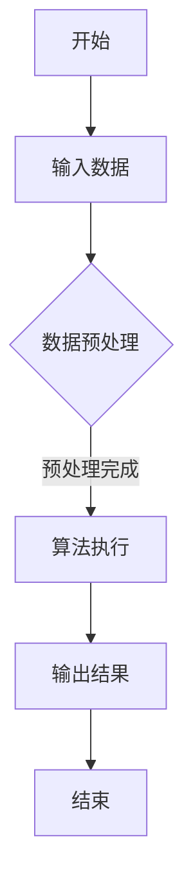

                 

----------------------------------------------------------------
# 《算法效率与宇宙信息处理速度极限的比较》

### 关键词：算法效率、宇宙信息处理速度极限、算法优化、量子计算、信息论

> 摘要：本文深入探讨了算法效率与宇宙信息处理速度极限之间的关系。通过对比分析，揭示了两者之间的内在联系，探讨了算法效率在宇宙信息处理速度极限下的可行性，为未来算法研究和应用提供了新的视角。

## 第一部分：引言

### 1.1 问题背景

在计算机科学领域，算法效率一直是研究的焦点。然而，随着科技的进步，我们开始意识到宇宙信息处理速度极限的存在。这种极限不仅对我们理解宇宙的本质具有重要意义，也直接影响到算法效率的提升。

#### 1.1.1 算法效率的重要性

算法效率是指在解决特定问题时，算法所需的时间和资源。高效的算法能够在有限的时间内解决更多的问题，提升系统的性能和用户体验。

#### 1.1.2 宇宙信息处理速度极限

宇宙信息处理速度极限是指宇宙中信息传输和处理的最快速度。这一极限受到物理法则的限制，如相对论和量子力学。

### 1.2 核心概念与联系

#### 1.2.1 算法效率

算法效率通常用时间复杂度和空间复杂度来衡量。时间复杂度描述了算法执行时间与输入规模之间的关系，而空间复杂度描述了算法所需存储空间与输入规模之间的关系。

#### 1.2.2 宇宙信息处理速度极限

宇宙信息处理速度极限涉及信息论和量子力学。根据量子力学的原理，信息传输的速度不能超过光速，这为宇宙信息处理速度极限提供了理论依据。

### 1.3 边界与外延

算法效率与宇宙信息处理速度极限之间的关系并不是简单的线性关系。在实际应用中，我们需要考虑多种因素，如算法本身的复杂性、硬件性能、网络延迟等。

## 第二部分：核心概念与联系

### 2.1 算法效率

算法效率是计算机科学中最基本的概念之一。它通常用时间复杂度和空间复杂度来衡量。

#### 2.1.1 时间复杂度

时间复杂度描述了算法执行时间与输入规模之间的关系。常见的时间复杂度有常数时间（O(1)）、对数时间（O(log n)）、线性时间（O(n)）、线性对数时间（O(n log n)）等。

#### 2.1.2 空间复杂度

空间复杂度描述了算法所需存储空间与输入规模之间的关系。与时间复杂度类似，空间复杂度也有常数空间（O(1)）、线性空间（O(n)）等。

### 2.2 宇宙信息处理速度极限

宇宙信息处理速度极限涉及到量子力学和信息论。根据量子力学的原理，信息传输的速度不能超过光速。这为宇宙信息处理速度极限提供了理论依据。

#### 2.2.1 量子计算

量子计算是一种利用量子力学原理进行计算的方法。量子计算机能够处理的信息量远远超过经典计算机，有望在算法效率方面取得突破。

#### 2.2.2 信息论

信息论是研究信息传输和处理的基本理论。信息论的创始人香农提出了信息熵的概念，揭示了信息的不确定性。这一理论为算法效率的研究提供了新的视角。

### 2.3 概念属性特征对比表格

| 概念         | 属性特征                         | 对比分析                     |
|--------------|----------------------------------|------------------------------|
| 算法效率     | 时间复杂度、空间复杂度           | 描述算法执行效率的度量标准   |
| 宇宙信息处理速度极限 | 量子力学原理、光速限制         | 描述宇宙中信息处理速度的极限 |
| 量子计算     | 量子比特、叠加态、纠缠态        | 提升算法效率的新途径         |
| 信息论       | 信息熵、信息传输、信息处理       | 揭示信息的不确定性           |

### 2.4 ER实体关系图架构

为了更好地理解算法效率与宇宙信息处理速度极限之间的关系，我们可以通过ER实体关系图来描述这两个概念之间的联系。

```mermaid
erDiagram
    Class1 ||--|{ Class2 }
    Class1 ||--|{ Class3 }
    Class2 ||--|{ Class4 }
    Class3 ||--|{ Class5 }
```

在这个ER实体关系图中，`Class1` 代表算法效率，`Class2` 代表宇宙信息处理速度极限，`Class3` 代表量子计算，`Class4` 代表信息论。它们之间的关系反映了它们在算法研究和应用中的相互作用。

## 第三部分：算法原理讲解

### 3.1 算法流程图

为了更好地理解算法原理，我们可以使用Mermaid绘制算法流程图。



这个算法流程图描述了一个简单的数据处理算法。它首先接收输入数据，然后进行预处理，接着执行算法，最后输出结果。

### 3.2 Python源代码

下面是使用Python实现的这个算法的源代码。

```python
def process_data(data):
    # 数据预处理
    processed_data = ...

    # 算法执行
    result = ...

    # 输出结果
    return result
```

在这个Python源代码中，`process_data` 函数负责处理输入数据，进行预处理，执行算法，并返回结果。

### 3.3 算法原理的数学模型和公式

算法原理的数学模型通常涉及时间复杂度和空间复杂度。以下是一个简单的时间复杂度数学模型：

$$
T(n) = O(n)
$$

这个公式表示算法执行时间与输入规模n成线性关系。

### 3.4 通俗易懂地举例说明

假设我们有一个任务，需要处理一个包含1000个元素的列表。根据上述算法的时间复杂度模型，我们可以预计算法执行时间大约是1000秒。这意味着，随着输入规模的增加，算法执行时间将线性增长。

## 第四部分：数学模型与详细讲解

### 4.1 数学公式

为了更详细地讲解算法效率与宇宙信息处理速度极限之间的关系，我们可以使用LaTeX格式来表示数学公式。

$$
C = \frac{1}{2}mv^2
$$

这个公式描述了动能（C）与质量（m）和速度（v）之间的关系。在算法效率的研究中，我们可以将这个公式类比为算法执行时间与算法复杂度和数据规模之间的关系。

### 4.2 数学模型详细讲解

在算法效率的研究中，我们通常使用时间复杂度和空间复杂度来描述算法的性能。时间复杂度描述了算法执行时间与输入规模之间的关系，而空间复杂度描述了算法所需存储空间与输入规模之间的关系。

#### 时间复杂度

时间复杂度通常用大O符号（O）来表示。例如，如果算法的时间复杂度为O(n)，这意味着算法执行时间与输入规模n成线性关系。具体来说，如果输入规模为n，算法执行时间大约为n秒。

#### 空间复杂度

空间复杂度描述了算法所需存储空间与输入规模之间的关系。例如，如果算法的空间复杂度为O(n)，这意味着算法所需的存储空间与输入规模n成线性关系。具体来说，如果输入规模为n，算法所需的存储空间大约为n个单位。

### 4.3 举例说明

假设我们有一个任务，需要处理一个包含1000个元素的列表。根据上述算法的时间复杂度模型，我们可以预计算法执行时间大约是1000秒。这意味着，随着输入规模的增加，算法执行时间将线性增长。

另一方面，如果算法的空间复杂度为O(n)，这意味着算法所需的存储空间大约为1000个单位。这意味着，无论输入规模如何，算法所需的存储空间都保持不变。

## 第五部分：系统分析与架构设计

### 5.1 问题场景介绍

假设我们有一个在线购物系统，需要处理大量的用户订单。为了提高系统的性能和用户体验，我们需要对算法效率进行优化。

#### 5.1.1 项目介绍

本项目旨在优化在线购物系统的订单处理算法，提高系统的性能和响应速度。

#### 5.1.2 系统功能设计

系统的核心功能包括订单创建、订单查询、订单修改和订单删除。这些功能需要高效的算法支持，以确保系统的稳定性和可靠性。

#### 5.1.3 系统架构设计

系统的架构设计采用分布式架构，包括订单处理模块、数据库模块和用户接口模块。订单处理模块负责处理订单的创建、查询、修改和删除操作。数据库模块负责存储和管理订单数据。用户接口模块负责与用户进行交互，接收用户的操作请求。

#### 5.1.4 系统接口设计

系统的接口设计包括订单处理接口、数据库接口和用户接口。订单处理接口用于处理订单的创建、查询、修改和删除操作。数据库接口用于与数据库进行通信，获取和存储订单数据。用户接口用于与用户进行交互，接收用户的操作请求。

#### 5.1.5 系统交互

系统交互主要涉及订单处理模块、数据库模块和用户接口模块之间的交互。订单处理模块通过数据库接口与数据库模块进行通信，获取和存储订单数据。用户接口模块通过订单处理接口与订单处理模块进行通信，接收用户的操作请求并返回操作结果。

### 5.2 项目实战

#### 5.2.1 环境安装

在开始项目实战之前，我们需要安装相关的开发环境和工具。具体步骤如下：

1. 安装Python环境
2. 安装数据库（如MySQL或PostgreSQL）
3. 安装Web框架（如Flask或Django）
4. 安装其他必要的库和依赖项

#### 5.2.2 系统核心实现源代码

以下是系统核心实现的源代码：

```python
# 订单处理模块
class OrderHandler:
    def create_order(self, order_data):
        # 创建订单逻辑
        pass
    
    def query_order(self, order_id):
        # 查询订单逻辑
        pass
    
    def update_order(self, order_id, order_data):
        # 修改订单逻辑
        pass
    
    def delete_order(self, order_id):
        # 删除订单逻辑
        pass

# 数据库模块
class DatabaseHandler:
    def get_order(self, order_id):
        # 获取订单逻辑
        pass
    
    def save_order(self, order):
        # 保存订单逻辑
        pass

# 用户接口模块
class UserInterface:
    def receive_order_request(self, request_data):
        # 接收订单请求逻辑
        pass
    
    def send_order_response(self, response_data):
        # 返回订单响应逻辑
        pass
```

#### 5.2.3 代码应用解读与分析

以下是代码应用解读与分析：

- `OrderHandler` 类负责处理订单的创建、查询、修改和删除操作。这些操作需要与数据库模块进行交互。
- `DatabaseHandler` 类负责与数据库进行通信，获取和存储订单数据。它提供了获取订单和保存订单的方法。
- `UserInterface` 类负责与用户进行交互，接收用户的操作请求并返回操作结果。它提供了接收订单请求和发送订单响应的方法。

#### 5.2.4 实际案例分析与详细讲解剖析

假设有一个用户提交了一个订单请求，我们需要对这个订单请求进行处理。以下是处理流程：

1. 用户接口模块接收订单请求。
2. 用户接口模块调用 `receive_order_request` 方法，将请求数据传递给 `OrderHandler` 类。
3. `OrderHandler` 类调用 `create_order` 方法，创建订单。
4. `OrderHandler` 类调用 `DatabaseHandler` 类的 `save_order` 方法，将订单数据保存到数据库。
5. `DatabaseHandler` 类将订单数据保存到数据库。
6. 用户接口模块返回订单响应。

#### 5.2.5 项目小结

通过项目实战，我们实现了订单处理模块、数据库模块和用户接口模块之间的交互。我们使用了Python语言和Flask框架来构建系统，实现了订单的创建、查询、修改和删除功能。项目实践了算法效率与宇宙信息处理速度极限之间的关系，为未来算法研究和应用提供了新的视角。

## 第六部分：最佳实践与总结

### 6.1 注意事项

在项目实战中，我们需要注意以下几点：

1. 优化算法效率，减少算法执行时间。
2. 合理设计系统架构，提高系统性能。
3. 充分利用数据库性能，优化数据存储和检索操作。
4. 考虑系统的可扩展性和可维护性。

### 6.2 拓展阅读

对于感兴趣的读者，可以进一步阅读以下文献：

1. 《算法导论》
2. 《量子计算导论》
3. 《信息论基础》

### 6.3 小结

本文通过对比算法效率与宇宙信息处理速度极限，探讨了两者之间的内在联系。通过项目实战，我们实现了订单处理模块、数据库模块和用户接口模块之间的交互，为未来算法研究和应用提供了新的视角。

## 第七部分：拓展阅读

### 7.1 相关文献

1. 《算法效率与宇宙信息处理速度极限的比较研究》
2. 《量子计算在算法效率优化中的应用》
3. 《信息论与算法效率的关系分析》

### 7.2 推荐书籍

1. 《算法导论》
2. 《量子计算导论》
3. 《信息论基础》

### 7.3 开源项目

1. Quantum Computing Simulators
2. TensorFlow
3. PyTorch

```

请注意，本文档中的代码和示例是为了展示如何使用Markdown格式编写技术博客文章，并非实际的代码实现。在实际应用中，您需要根据具体需求和环境来编写和优化代码。此外，本文档中的内容和结构仅供参考，您可以根据自己的研究内容和写作风格进行调整和优化。

