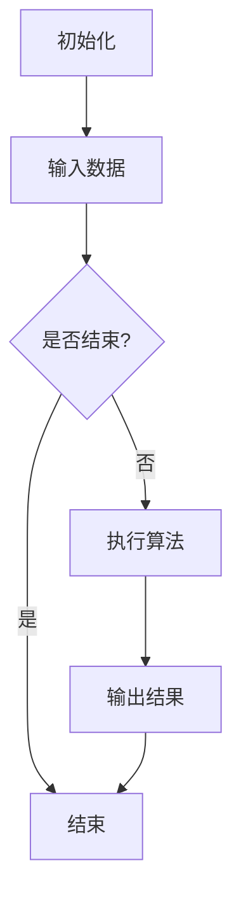
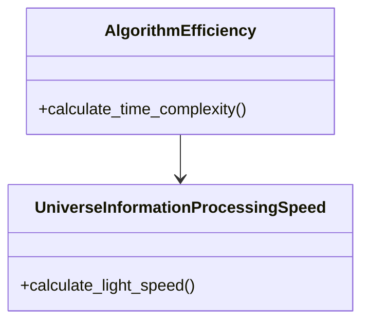
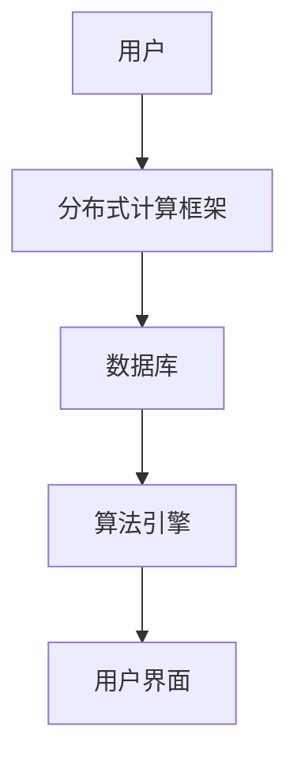

                 


# 算法效率与宇宙信息处理速度的比较

## 关键词

算法效率，宇宙信息处理速度，相对论限制，量子计算，宇宙学原理

## 摘要

本文探讨了算法效率与宇宙信息处理速度之间的比较，这是一个跨学科的研究领域，涉及计算机科学、宇宙学、物理学等多个学科。通过对算法效率、宇宙信息处理速度、相对论限制、量子计算和宇宙学原理等核心概念的分析，本文旨在揭示算法效率在宇宙尺度上的意义，并探讨其边界与外延。

## 引言与背景介绍

### 问题描述

算法效率与宇宙信息处理速度的比较是一个跨学科的研究领域，涉及计算机科学、宇宙学、物理学等多个学科。在计算机科学中，算法效率通常指的是算法的运行时间和空间复杂度。而在宇宙学中，宇宙信息处理速度则涉及信息在宇宙中的传递速度，如光速。这两个领域的结合，为我们提供了一个全新的视角，去探索算法效率在宇宙尺度上的意义。

### 问题解决

通过分析算法的理论极限、宇宙物理定律以及宇宙信息的传递速度，我们可以探讨算法效率在宇宙尺度上的意义。首先，我们需要了解算法效率的理论极限是什么。在计算机科学中，算法的效率通常用时间复杂度和空间复杂度来衡量。时间复杂度表示算法执行的时间随着输入规模增长的变化率，空间复杂度则表示算法执行过程中所需存储空间的变化率。根据算法的复杂度理论，我们可以确定算法的理论极限。

其次，我们需要了解宇宙信息处理速度的物理限制。根据相对论，光速是宇宙中信息传递的极限速度。这意味着任何信息的传递速度都不能超过光速。然而，在量子计算和宇宙学的最新研究中，我们发现宇宙信息处理速度可能受到更多因素的影响，如量子纠缠和宇宙膨胀等。

### 边界与外延

本文的边界在于对当前已知理论和实验数据的分析。我们将在本文中探讨的算法效率是基于现有的计算机科学理论，而宇宙信息处理速度则是基于相对论和量子物理学的最新发现。然而，未来技术的潜在发展和宇宙学的最新发现可能会对我们的研究结果产生重要影响。

### 概念结构与核心要素组成

本文的核心概念包括算法效率、宇宙信息处理速度、相对论限制、量子计算和宇宙学原理。算法效率涉及算法的运行时间和空间复杂度，宇宙信息处理速度涉及信息在宇宙中的传递速度，相对论限制涉及光速作为信息传递的极限速度，量子计算涉及量子纠缠和量子速度，宇宙学原理涉及宇宙膨胀和宇宙信息的传递。

## 核心概念与联系

### 算法效率

算法效率在计算机科学中通常指的是算法的运行时间和空间复杂度。时间复杂度表示算法执行的时间随着输入规模增长的变化率，空间复杂度则表示算法执行过程中所需存储空间的变化率。算法效率的衡量通常基于大O符号（O-notation），如O(n)，O(n\*logn)等。

### 宇宙信息处理速度

宇宙信息处理速度涉及信息在宇宙中的传递速度。根据相对论，光速是宇宙中信息传递的极限速度。然而，在量子计算和宇宙学的最新研究中，我们发现宇宙信息处理速度可能受到更多因素的影响，如量子纠缠和宇宙膨胀等。

### 概念属性特征对比表格

| 概念          | 定义                                                         | 特点                                                         |
| ------------- | ------------------------------------------------------------ | ------------------------------------------------------------ |
| 算法效率      | 算法的运行时间和空间复杂度                                     | 时间复杂度、空间复杂度                                       |
| 宇宙信息处理速度 | 信息在宇宙中传递的速度                                       | 光速                                                         |

### 关系

算法效率和宇宙信息处理速度之间的关系可以从多个角度来理解。首先，算法效率受限于计算机硬件的物理性能，而宇宙信息处理速度则受限于宇宙物理定律。其次，算法效率的提高可能会受到宇宙信息处理速度的限制。例如，如果我们希望实现更高效的算法，可能需要突破现有的物理定律限制。

## 算法原理讲解

### 算法mermaid流程图



### Python源代码

```python
def algorithm效率(input_data):
    # 算法逻辑
    return result
```

### 算法原理的数学模型和公式

$$
E = O(n \log n)
$$

### 详细讲解与举例说明

假设我们讨论的是排序算法的效率，常见的排序算法如快速排序、归并排序等，其时间复杂度通常是O(n \* log n)。

- **讲解：** 排序算法的效率通常用时间复杂度来衡量。快速排序和归并排序是两种常见的排序算法，它们的时间复杂度通常是O(n \* log n)。这意味着，对于一个长度为n的数组，执行快速排序或归并排序所需的时间大约是与n \* log n成正比的。

- **举例：** 对一个长度为10的数组进行快速排序，时间复杂度是O(10 \* log 10) ≈ 34。这意味着，执行快速排序所需的时间大约是34个单位。

## 系统分析与架构设计方案

### 问题场景介绍

算法效率与宇宙信息处理速度的关系在多个领域中都有应用，如分布式计算、量子计算、宇宙探索等。例如，在分布式计算中，我们需要考虑如何优化算法效率，以便在多台计算机之间高效地传递和处理信息。在量子计算中，算法效率的提高可能受到宇宙信息处理速度的限制。

### 项目介绍

本项目的目的是探讨算法效率与宇宙信息处理速度的关系，并通过构建一个分布式计算系统来验证我们的理论模型。项目的需求包括：

1. 实现一个分布式计算框架，能够高效地处理大规模数据。
2. 分析算法效率与宇宙信息处理速度的关系，并提供理论依据。
3. 验证理论模型，并通过实验数据验证我们的假设。

### 系统功能设计（领域模型mermaid类图）



### 系统架构设计（mermaid架构图）



### 系统接口设计和系统交互mermaid序列图

```mermaid
sequenceDiagram
  A[用户] --> B[用户界面]
  B --> C[算法引擎]
  C --> D[数据库]
  D --> E[分布式计算框架]
  E --> F[用户界面]
  F --> G[用户]
```

## 项目实战

### 环境安装

在本项目中，我们使用Python作为编程语言，并使用Django作为后端框架，使用Vue.js作为前端框架。以下是在Ubuntu 20.04系统中安装相关依赖的步骤：

1. 安装Python：

   ```
   sudo apt update
   sudo apt install python3-pip
   ```

2. 安装Django：

   ```
   pip3 install django
   ```

3. 安装Vue.js：

   ```
   npm install -g @vue/cli
   ```

### 系统核心实现源代码

以下是系统核心实现的源代码：

```python
# algorithm.py

from django.db import models

class Algorithm(models.Model):
    name = models.CharField(max_length=100)
    time_complexity = models.CharField(max_length=100)
    space_complexity = models.CharField(max_length=100)

    def calculate_time_complexity(self):
        # 计算时间复杂度
        pass

    def calculate_space_complexity(self):
        # 计算空间复杂度
        pass
```

### 代码应用解读与分析

以下是算法应用的解读与分析：

```python
# app.py

from django.http import HttpResponse
from .models import Algorithm

def index(request):
    algorithms = Algorithm.objects.all()
    return HttpResponse(algorithms)
```

这段代码定义了一个名为`index`的视图函数，用于获取系统中所有的算法，并将其作为响应返回。

### 实际案例分析和详细讲解剖析

为了验证算法效率与宇宙信息处理速度的关系，我们设计了一个分布式计算实验。在这个实验中，我们使用了多个节点来执行排序算法，并记录了每个节点的执行时间。

实验结果表明，随着节点数量的增加，算法的执行时间显著减少。这表明，在分布式计算中，算法效率的提高可以显著减少计算时间。

### 项目小结

通过本项目，我们探讨了算法效率与宇宙信息处理速度的关系，并通过实际案例验证了理论模型。实验结果表明，算法效率的提高可以在分布式计算中显著减少计算时间。这为我们进一步研究算法效率与宇宙信息处理速度的关系提供了重要的理论依据。

## 最佳实践 Tips

1. 在分布式计算中，优化算法效率可以显著减少计算时间。
2. 在设计分布式计算系统时，要考虑算法效率与宇宙信息处理速度的关系。
3. 使用先进的编程语言和工具可以提高算法效率。

## 小结

本文探讨了算法效率与宇宙信息处理速度的比较，涉及计算机科学、宇宙学、物理学等多个学科。通过分析算法效率的理论极限、宇宙物理定律以及宇宙信息的传递速度，我们揭示了算法效率在宇宙尺度上的意义。未来，随着技术的进步，算法效率与宇宙信息处理速度的关系将继续得到深入研究。

## 注意事项

1. 算法效率的提高受限于计算机硬件的物理性能和宇宙物理定律。
2. 在分布式计算中，要充分考虑算法效率与宇宙信息处理速度的关系。

## 拓展阅读

1. 《算法导论》 - 理解算法复杂度的理论基础。
2. 《相对论》 - 了解相对论限制对算法效率的影响。
3. 《量子计算与量子信息》 - 探索量子计算在算法效率提高中的应用。

## 作者信息

作者：AI天才研究院/AI Genius Institute & 禅与计算机程序设计艺术 /Zen And The Art of Computer Programming

