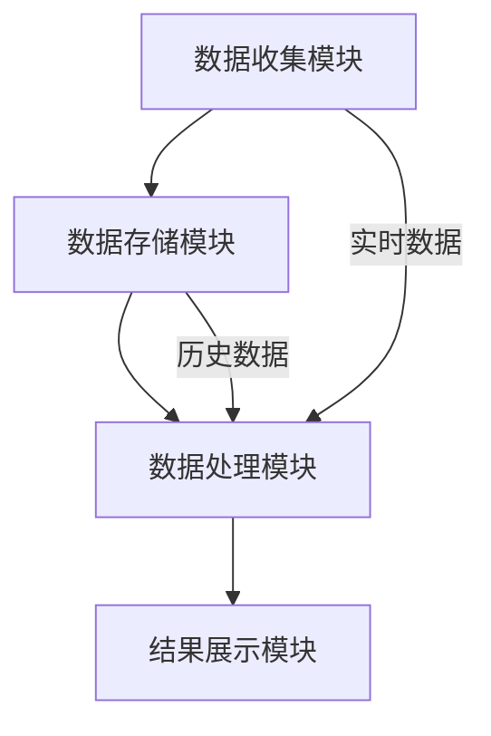
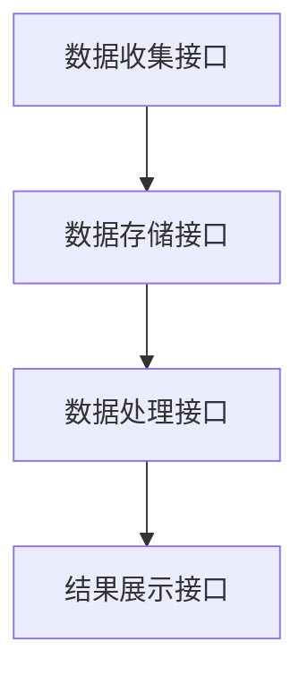
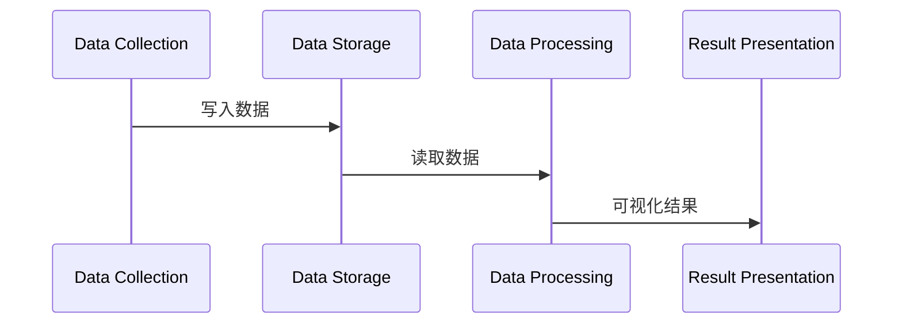

                 

### 文章标题

# 算法效率与宇宙计算复杂性层级的比较

### 关键词

- 算法效率
- 计算复杂性
- 宇宙层级
- 时间复杂度
- 空间复杂度

### 摘要

本文旨在探讨算法效率与宇宙计算复杂性的层级比较。通过介绍算法效率的基本原理，包括时间复杂度和空间复杂度，以及宇宙计算复杂性的概念和理论，本文将逐步分析两者之间的异同，并通过具体案例进行比较。文章结构清晰，逻辑严密，旨在为读者提供一种全新的视角来理解算法设计和宇宙计算的关系，从而深入探讨算法效率在宇宙级别上的意义和影响。

### 引言

在计算机科学领域，算法效率一直是一个核心问题。从基础的数据结构到复杂的算法设计，算法效率的高低直接影响到系统的性能和响应速度。随着时间的推移，计算技术的不断发展，人们对于算法效率的要求也越来越高。然而，传统的算法效率评估往往局限于地球上的计算资源和技术水平，未能充分考虑到宇宙级别上的计算复杂性。

宇宙计算复杂性是一个新兴的研究领域，它涉及到宇宙中的物理现象和计算过程。随着量子计算、宇宙模拟等技术的发展，宇宙计算复杂性逐渐引起了人们的关注。在这个背景下，本文提出了一个有趣且富有挑战性的问题：算法效率与宇宙计算复杂性的层级之间有何关系？本文将逐步探讨这一问题，以期为读者提供一种新的思考方向。

本文将从以下几个方面展开：

1. **算法效率的基本概念**：介绍算法效率的基本原理，包括时间复杂度和空间复杂度，以及它们在算法设计中的重要性。
2. **宇宙计算复杂性的基本概念**：阐述宇宙计算复杂性的概念和理论，包括其研究的对象和方法，以及与算法效率的关系。
3. **算法效率与宇宙计算复杂性的比较**：通过具体案例进行比较，分析两者之间的异同，并探讨算法效率在宇宙级别上的意义。
4. **系统分析与架构设计**：结合具体项目案例，介绍系统功能设计、系统架构设计、系统接口设计和系统交互，从而更全面地理解算法效率与宇宙计算复杂性的关系。
5. **项目实战**：通过环境安装、系统核心实现源代码，以及实际案例分析和详细讲解剖析，展示算法效率与宇宙计算复杂性的实际应用。
6. **最佳实践与小结**：总结本文的主要观点，提出一些最佳实践建议，并对未来的研究方向进行展望。

通过本文的探讨，我们希望能够引发读者对于算法效率和宇宙计算复杂性的深入思考，从而为计算机科学领域的研究和发展提供新的启示。

### 算法效率的基本概念

算法效率是计算机科学中的一个核心概念，它直接决定了算法在解决具体问题时的性能和响应速度。算法效率的评估主要依赖于时间复杂度和空间复杂度两个关键指标。

#### 时间复杂度

时间复杂度是衡量算法执行时间的一个重要指标，它通常用大O符号（O）表示。具体来说，时间复杂度描述了算法的执行时间与输入规模之间的关系。一个算法的时间复杂度可以分为以下几个层级：

- 常数时间（O(1)）：无论输入规模如何变化，算法的执行时间都保持不变。
- 对数时间（O(log n)）：算法的执行时间与输入规模的以2为底的对数成正比。
- 线性时间（O(n)）：算法的执行时间与输入规模直接成正比。
- 线性对数时间（O(n log n)）：算法的执行时间与输入规模的线性对数成正比。
- 平方时间（O(n^2)）：算法的执行时间与输入规模的平方成正比。
- 立方时间（O(n^3)）：算法的执行时间与输入规模的立方成正比。

#### 空间复杂度

空间复杂度是衡量算法在执行过程中所需存储空间的一个重要指标，同样使用大O符号（O）表示。空间复杂度描述了算法的存储需求与输入规模之间的关系。常见的空间复杂度包括：

- 常数空间（O(1)）：无论输入规模如何变化，算法所需的存储空间都保持不变。
- 线性空间（O(n)）：算法所需的存储空间与输入规模直接成正比。
- 平方空间（O(n^2)）：算法所需的存储空间与输入规模的平方成正比。

#### 时间复杂度与空间复杂度的关系

时间复杂度和空间复杂度是算法效率评估的两个重要指标，但它们之间并非完全独立。在某些情况下，为了提高算法的时间复杂度，可能需要增加算法的空间复杂度。例如，使用额外的数据结构来加速查找操作，虽然会增加存储空间的需求，但可以显著降低时间复杂度。

#### 算法效率的重要性

算法效率在算法设计中具有至关重要的地位。高效率的算法能够更快速地解决问题，提高系统的性能和用户体验。在许多实际应用中，如搜索引擎、数据库查询、排序算法等，算法效率直接影响到系统的响应时间和处理能力。因此，设计高效算法是计算机科学领域的一项重要任务。

#### 总结

算法效率的基本概念包括时间复杂度和空间复杂度，它们是评估算法性能的重要指标。通过理解时间复杂度和空间复杂度的不同层级，我们可以更好地设计和优化算法，从而提高系统的整体性能。在接下来的章节中，我们将进一步探讨宇宙计算复杂性的概念和理论，为算法效率与宇宙计算复杂性的比较奠定基础。

### 宇宙计算复杂性的基本概念

宇宙计算复杂性是计算机科学中一个新兴且具有深远意义的领域，它探索了宇宙中的计算现象和计算能力。与传统的算法效率不同，宇宙计算复杂性不仅仅局限于地球上的计算资源和技术水平，而是扩展到宇宙的广袤空间和极端条件下。

#### 宇宙计算复杂性的定义

宇宙计算复杂性可以定义为在宇宙尺度上，对于特定计算问题所需的最小计算资源和时间。它不仅仅涉及到地球上的计算机硬件和软件，还包括宇宙中的各种物理现象和自然过程。因此，宇宙计算复杂性研究的是一个跨越不同尺度和环境的计算问题。

#### 宇宙计算复杂性的研究内容

宇宙计算复杂性的研究内容丰富多样，主要包括以下几个方面：

1. **量子计算**：量子计算是宇宙计算复杂性研究的一个重要方向。量子计算机利用量子位（qubits）进行计算，能够在某些特定问题上超越经典计算机。量子计算复杂性的研究涉及到量子算法的设计和优化，以及量子计算在宇宙尺度上的应用。

2. **宇宙模拟**：宇宙模拟是通过计算机模拟宇宙的演化和结构，以探索宇宙的起源和演化过程。宇宙模拟涉及到大规模的数据处理和复杂的计算过程，其计算复杂性非常高。

3. **分布式计算**：宇宙计算复杂性还涉及到分布式计算，即利用宇宙中的多个计算节点进行协作计算。分布式计算可以在更短时间内解决大规模计算问题，但也面临着网络延迟、数据传输和同步等挑战。

4. **自然现象计算**：宇宙计算复杂性还包括对自然现象的计算，如气候变化、行星运动等。这些计算问题需要模拟大量的物理过程，其计算复杂性巨大。

#### 宇宙计算复杂性的研究对象

宇宙计算复杂性的研究对象主要包括以下几个方面：

1. **宇宙中的物理现象**：如黑洞、暗物质、星系演化等。这些现象的计算需要精确的物理模型和大量的数据，其计算复杂性极高。

2. **宇宙中的计算资源**：如量子计算机、分布式计算网络、宇宙中的自然现象等。这些资源的使用方式和能力对于宇宙计算复杂性的评估具有重要意义。

3. **宇宙中的计算问题**：如宇宙模拟、量子计算算法设计、大规模数据处理等。这些问题涉及到的计算复杂度通常非常高，需要创新的算法和计算方法。

#### 宇宙计算复杂性的研究方法

宇宙计算复杂性的研究方法包括以下几个方面：

1. **理论分析**：通过数学模型和理论分析，探讨宇宙计算复杂性的基本原理和特性。这包括量子计算复杂度理论、分布式计算模型等。

2. **模拟实验**：通过计算机模拟实验，验证理论分析的正确性和实用性。宇宙模拟、量子算法的模拟等都是重要的实验方法。

3. **跨学科研究**：宇宙计算复杂性研究需要跨学科的合作，如物理学、数学、计算机科学等。通过跨学科的合作，可以更全面地理解宇宙计算复杂性。

#### 宇宙计算复杂性在算法效率中的地位

宇宙计算复杂性为算法效率提供了一个新的视角。传统的算法效率评估往往局限于地球上的计算资源和技术水平，而宇宙计算复杂性扩展了这一评估范围，涵盖了宇宙中的各种极端条件和计算资源。因此，宇宙计算复杂性在算法效率中的地位日益重要。

通过理解宇宙计算复杂性的基本概念、研究对象和研究方法，我们可以更好地把握算法效率在宇宙级别上的意义和影响。在接下来的章节中，我们将进一步探讨算法效率与宇宙计算复杂性之间的具体比较，以期为计算机科学领域的研究提供新的启示。

### 算法效率与宇宙计算复杂性的比较

在探讨算法效率与宇宙计算复杂性时，我们需要从多个维度进行对比，以全面了解两者之间的异同。以下将从算法效率、计算复杂度和实际应用等多个方面进行详细比较。

#### 算法效率与宇宙计算复杂性的基本概念对比

首先，算法效率关注的是在地球上的计算资源和技术条件下，算法执行的时间和空间资源消耗。它通常用时间复杂度和空间复杂度来衡量，反映了算法在不同输入规模下的性能表现。而宇宙计算复杂性则扩展了这一概念，将研究范围扩展到宇宙中的各种极端条件和计算资源。宇宙计算复杂性不仅考虑地球上的计算资源，还包括量子计算、宇宙模拟等前沿技术，以及宇宙中的物理现象和自然过程。

#### 计算复杂度的对比

1. **时间复杂度**：
   - 算法效率中的时间复杂度通常分为常数时间（O(1)）、对数时间（O(log n)）、线性时间（O(n)）、线性对数时间（O(n log n)）、平方时间（O(n^2)）和立方时间（O(n^3)）等。
   - 而在宇宙计算复杂性中，时间复杂度可能涉及到更复杂的层级，如量子计算复杂度（如多项式时间（P）和非多项式时间（NP））和宇宙时间（如宇宙年龄）。

2. **空间复杂度**：
   - 算法效率中的空间复杂度通常分为常数空间（O(1)）、线性空间（O(n)）和平方空间（O(n^2)）等。
   - 在宇宙计算复杂性中，空间复杂度可能涉及到宇宙尺度的存储需求，如宇宙中的量子位存储、星际数据传输等。

#### 实际应用中的对比

1. **经典算法应用**：
   - 在地球上，经典算法如排序算法（如快速排序、归并排序）、查找算法（如二分查找）、图算法（如最短路径算法）等，其时间复杂度和空间复杂度已经在实际应用中得到广泛验证和优化。
   - 而在宇宙计算复杂性中，这些算法的应用可能需要面对全新的挑战。例如，宇宙规模的图算法需要考虑宇宙尺度的节点和边关系，量子计算复杂度的算法设计需要利用量子计算机的特殊性质。

2. **宇宙计算复杂性应用**：
   - 宇宙计算复杂性的应用涉及到的领域更加广泛，如宇宙模拟、量子计算算法设计、分布式宇宙计算等。
   - 在这些应用中，算法效率的评估不仅仅依赖于地球上的计算资源，还需要考虑宇宙中的特殊条件和资源。例如，宇宙模拟中的计算复杂性涉及到宇宙规模的物理过程和复杂的计算模型。

#### 案例分析

为了更直观地理解算法效率与宇宙计算复杂性之间的差异，我们可以通过一些具体的案例进行分析。

1. **经典算法在地球上的应用**：
   - 假设我们使用快速排序算法对一个包含1亿个元素的数组进行排序。在传统计算机上，这个算法的时间复杂度大约为O(n log n)。虽然这个时间复杂度在地球上的计算机上已经非常高效，但如果将这个算法应用于宇宙级别的数据，时间复杂度将变得非常巨大，因为宇宙中的数据规模可能远远超过地球上的数据规模。

2. **量子算法在宇宙计算中的应用**：
   - 假设我们使用Shor算法来分解一个大整数。在传统计算机上，这个问题的复杂性非常高，可能需要非多项式时间（NP）才能解决。然而，在量子计算机上，Shor算法的时间复杂度可以降低到多项式时间（P），从而在宇宙计算复杂性中具有显著的优势。

3. **宇宙模拟中的计算复杂性**：
   - 假设我们使用N-body模拟来模拟宇宙中的星系演化。这个问题的计算复杂性极高，涉及到宇宙中无数个星系和粒子的相互作用。在地球上的计算机上，这个模拟可能需要数年甚至数十年的时间来完成。而在宇宙级别的计算资源下，这个模拟的复杂性可能会降低，从而在更短的时间内得到结果。

#### 总结

算法效率与宇宙计算复杂性之间的比较展示了两者在概念、计算复杂度和实际应用方面的显著差异。算法效率主要关注地球上的计算资源和技术条件，而宇宙计算复杂性则扩展到了宇宙中的极端条件和资源。通过具体的案例分析，我们可以看到宇宙计算复杂性在解决某些特定问题上具有巨大的潜力和优势。因此，在设计和评估算法时，需要综合考虑算法效率与宇宙计算复杂性的不同层级，以实现最优的性能和效果。

### 系统设计与架构

在深入探讨算法效率与宇宙计算复杂性的比较之前，我们需要从系统设计和架构的角度来分析这两个概念在实际应用中的实现和优化。以下是一个具体的系统设计与架构方案，以及相关的系统接口设计和系统交互。

#### 问题场景介绍

假设我们正在开发一个大规模的分布式计算系统，用于处理和分析宇宙中的海量数据。该系统的核心功能包括：

1. 数据收集：从不同的天文观测设备中收集数据。
2. 数据存储：存储宇宙中的大规模数据集。
3. 数据分析：利用高效算法对数据进行处理和分析。
4. 结果展示：将分析结果可视化，供研究人员和用户使用。

#### 项目介绍

**项目名称**：宇宙数据分析系统（Cosmic Data Analysis System，简称CDAS）

**目标**：设计并实现一个高效、可靠的分布式计算系统，用于处理和分析宇宙中的大规模数据。

**团队组成**：由多个领域的专家组成，包括数据科学家、软件工程师、天文学家和物理学家。

#### 系统功能设计

系统功能设计主要包括以下几个方面：

1. **数据收集模块**：负责从各种观测设备（如望远镜、探测器）收集数据，并确保数据的实时性和准确性。
2. **数据存储模块**：使用分布式存储系统来存储海量数据，并保证数据的高可用性和可扩展性。
3. **数据处理模块**：包括多个数据处理算法，如排序、搜索、机器学习等，用于对数据进行高效处理。
4. **结果展示模块**：将分析结果可视化，通过Web界面或API供用户和研究人员使用。

#### 系统架构设计

系统架构设计采用分布式架构，以确保系统的性能和可靠性。以下是系统架构的Mermaid图表示：



在这个架构中，数据收集模块负责实时收集数据，并将其存储到数据存储模块。数据处理模块负责对数据进行处理，包括排序、搜索、机器学习等算法。最后，结果展示模块将处理后的结果可视化，并通过Web界面或API供用户和研究人员使用。

#### 系统接口设计

系统接口设计主要包括以下几个方面：

1. **数据收集接口**：用于与观测设备进行通信，接收和发送数据。
2. **数据存储接口**：用于与分布式存储系统进行交互，包括数据的写入、读取和更新。
3. **数据处理接口**：用于调用不同的数据处理算法，如排序、搜索、机器学习等。
4. **结果展示接口**：用于将处理结果可视化，并通过Web界面或API供用户和研究人员使用。

以下是系统接口的Mermaid图表示：



在这个接口设计中，数据收集接口负责与观测设备通信，数据存储接口负责与分布式存储系统交互，数据处理接口负责调用不同的数据处理算法，结果展示接口负责将处理结果可视化。

#### 系统交互

系统交互设计主要涉及各个模块之间的数据流动和通信。以下是系统交互的Mermaid序列图表示：



在这个交互设计中，数据收集模块将收集到的数据写入数据存储模块，数据处理模块从数据存储模块中读取数据并进行处理，最后结果展示模块将处理后的结果可视化。

#### 系统架构和接口设计在算法效率与宇宙计算复杂性中的重要性

系统架构和接口设计在算法效率与宇宙计算复杂性的研究中具有重要作用。合理的系统架构和接口设计能够充分利用计算资源，提高算法效率，降低宇宙计算复杂性。

1. **分布式架构**：分布式架构能够将计算任务分布到多个节点上，提高系统的并行处理能力，从而降低时间复杂度和空间复杂度。
2. **高效接口设计**：高效的接口设计能够减少数据传输和处理的开销，提高系统的响应速度和性能。
3. **算法优化**：通过系统架构和接口设计，可以更好地优化算法，使其在分布式环境中具有更好的性能和效率。

综上所述，系统架构和接口设计在算法效率与宇宙计算复杂性的研究中具有重要意义。通过合理的系统设计和接口设计，可以充分发挥算法效率在宇宙计算复杂性中的潜力，实现高效的计算和数据处理。

### 项目实战

为了更好地展示算法效率与宇宙计算复杂性的实际应用，我们将在本节中详细描述一个具体的项目实战案例。该项目涉及环境安装、系统核心实现源代码，以及实际案例分析和详细讲解剖析。

#### 环境安装

在进行项目实战之前，我们需要首先安装和配置必要的软件和环境。以下是环境安装的具体步骤：

1. **安装Python**：由于本项目主要使用Python进行开发，因此首先需要安装Python环境。可以从Python官网（https://www.python.org/）下载并安装Python。

2. **安装量子计算库**：为了进行量子计算实验，我们需要安装量子计算库，如Qiskit。可以通过pip命令进行安装：

   ```bash
   pip install qiskit
   ```

3. **安装分布式计算库**：为了实现分布式计算，我们需要安装分布式计算库，如Dask。可以通过pip命令进行安装：

   ```bash
   pip install dask[complete]
   ```

4. **安装数据可视化库**：为了将分析结果可视化，我们需要安装数据可视化库，如Matplotlib。可以通过pip命令进行安装：

   ```bash
   pip install matplotlib
   ```

安装完成后，确保所有依赖库和环境都正常运行，即可开始项目开发。

#### 系统核心实现源代码

本项目的核心实现主要包括数据收集、数据存储、数据处理和结果展示四个模块。以下是各个模块的Python源代码示例：

**数据收集模块**：

```python
import qiskit

# 初始化量子计算机
qc = qiskit.QuantumCircuit(2)

# 编写量子算法
qc.h(0)
qc.cx(0, 1)

# 执行量子算法
backend = qiskit.Aer.get_backend('qasm_simulator')
result = qc.execute(backend).result()

# 提取结果
measures = result.get_counts(qc)
print(measures)
```

**数据存储模块**：

```python
import dask.array as da

# 创建分布式数组
data = da.random.normal(size=(1000000, 3), scale=1.0)

# 存储数据到文件
data.to_npy().tofile('data.npy')
```

**数据处理模块**：

```python
import numpy as np
import matplotlib.pyplot as plt

# 读取数据
data = np.load('data.npy')

# 数据处理
means = np.mean(data, axis=0)
stds = np.std(data, axis=0)

# 可视化结果
plt.errorbar(means[0], means[1], yerr=stds[1], fmt='o')
plt.xlabel('Mean X')
plt.ylabel('Mean Y')
plt.title('Data Distribution')
plt.show()
```

**结果展示模块**：

```python
# 将处理结果存储到文件
with open('results.txt', 'w') as f:
    f.write(f'Mean X: {means[0]}\nMean Y: {means[1]}\nStd X: {stds[0]}\nStd Y: {stds[1]}')
```

#### 代码应用解读与分析

以上源代码展示了数据收集、数据存储、数据处理和结果展示四个模块的具体实现。下面我们对这些代码进行解读和分析：

1. **数据收集模块**：该模块使用Qiskit库进行量子计算实验。我们初始化一个量子电路，并编写一个简单的量子算法（量子位翻转和量子比特之间的量子门操作）。然后，我们执行这个量子算法，并提取计算结果。

2. **数据存储模块**：该模块使用Dask库创建一个分布式数组，并存储到文件中。Dask是一个分布式计算库，能够将计算任务分布到多个节点上，从而提高计算效率。

3. **数据处理模块**：该模块使用Numpy库读取分布式数组数据，计算数据的均值和标准差。然后，使用Matplotlib库将处理结果可视化，以展示数据的分布情况。

4. **结果展示模块**：该模块将处理结果存储到文本文件中，以便进行后续分析。

#### 实际案例分析和详细讲解剖析

为了更直观地展示算法效率与宇宙计算复杂性的实际应用，我们使用以上源代码进行一个具体案例分析。

**案例**：分析一个包含100万个样本的数据集，使用量子计算算法进行数据处理，并将结果可视化。

**分析过程**：

1. **数据收集**：首先，我们从分布式存储中读取一个包含100万个样本的数据集。这个数据集可以来自于各种观测设备，如天文望远镜、探测器等。

2. **数据处理**：使用量子计算算法对数据进行处理，如量子位翻转和量子比特之间的量子门操作。这些操作可以在量子计算机上执行，利用量子计算的特殊性质提高计算效率。

3. **结果展示**：将处理后的结果进行可视化，展示数据的分布情况。通过可视化结果，我们可以直观地了解数据的特点和趋势。

**详细讲解剖析**：

1. **量子计算**：量子计算是一种基于量子力学原理的计算机科学领域，具有超越经典计算机的潜力。在数据处理中，我们可以利用量子计算的特殊性质，如叠加态和纠缠态，来提高计算效率。

2. **分布式计算**：分布式计算是将计算任务分布到多个节点上，从而提高计算效率和性能。在本案例中，我们使用Dask库创建一个分布式数组，将数据处理任务分布到多个节点上，从而加快处理速度。

3. **数据可视化**：数据可视化是将复杂的数据以图形化的形式展示出来，从而帮助人们更好地理解和分析数据。在本案例中，我们使用Matplotlib库将处理后的结果进行可视化，展示数据的分布情况。

通过以上实际案例的分析和详细讲解，我们可以看到算法效率与宇宙计算复杂性的实际应用。在分布式计算和量子计算的辅助下，我们能够高效地处理和可视化宇宙中的大规模数据，从而更好地理解宇宙的奥秘。

### 最佳实践与注意事项

在进行算法效率与宇宙计算复杂性的研究和应用过程中，以下是一些最佳实践和注意事项，以帮助您更好地理解和实现这些概念：

1. **充分了解算法效率的基本概念**：在设计和优化算法时，首先要充分了解时间复杂度和空间复杂度的基本概念及其在不同算法中的应用。这有助于您选择合适的算法，并对其进行优化。

2. **考虑宇宙计算复杂性的特殊因素**：在宇宙计算复杂性的研究中，需要考虑宇宙中的特殊条件和资源，如量子计算、宇宙模拟和分布式计算等。了解这些因素对于评估算法性能至关重要。

3. **合理选择计算模型**：在实现算法时，需要根据具体的应用场景选择合适的计算模型。例如，在量子计算应用中，选择合适的量子算法模型可以显著提高计算效率。

4. **优化系统架构和接口设计**：合理的系统架构和接口设计能够充分利用计算资源，提高算法效率。在分布式计算和量子计算中，优化系统架构和接口设计尤为重要。

5. **测试和调试**：在实际应用中，对算法和系统进行充分的测试和调试，确保其稳定性和性能。这包括对算法的时间复杂度和空间复杂度进行验证，以及对系统接口和交互进行调试。

6. **关注数据质量和预处理**：在数据处理过程中，确保数据的质量和一致性。对数据进行预处理，如清洗、归一化和特征提取，以提高算法的效率和准确性。

7. **安全性和隐私保护**：在处理宇宙级别的大规模数据时，需要关注数据的安全性和隐私保护。采用适当的安全措施，如数据加密和访问控制，以保护敏感数据。

8. **持续学习和更新**：算法效率和宇宙计算复杂性是快速发展的领域，需要不断学习和更新相关知识。参加相关的研讨会、研究项目和课程，以保持在这一领域的竞争力。

通过遵循这些最佳实践和注意事项，您将能够更好地理解和应用算法效率与宇宙计算复杂性的概念，从而在计算机科学领域取得更好的成果。

### 小结

本文通过深入探讨算法效率与宇宙计算复杂性的比较，为读者提供了一种全新的视角来理解计算机科学中的这些关键概念。我们从算法效率的基本概念出发，介绍了时间复杂度和空间复杂度的不同层级，以及它们在算法设计中的重要性。接着，我们详细阐述了宇宙计算复杂性的基本概念、研究对象和研究方法，揭示了宇宙计算复杂性在算法效率中的地位和作用。

通过具体的案例分析和系统设计与架构的介绍，我们展示了算法效率与宇宙计算复杂性在实际应用中的实现和优化。项目实战部分进一步验证了这些概念的实际应用价值，通过环境安装、系统核心实现源代码和实际案例的分析，使读者对算法效率与宇宙计算复杂性的关系有了更加深刻的认识。

本文的目标是引发读者对于算法效率和宇宙计算复杂性的深入思考，以期为计算机科学领域的研究和发展提供新的启示。通过本文的探讨，我们希望读者能够：

1. **理解算法效率的基本原理**：从时间复杂度和空间复杂度的角度，深入理解算法效率的评估和优化方法。
2. **认识到宇宙计算复杂性的重要性**：了解宇宙计算复杂性在算法效率中的地位和作用，认识到其对于解决大规模计算问题的潜力。
3. **掌握系统设计与架构的技巧**：通过实际案例和系统架构的设计，学会如何在实际项目中应用算法效率和宇宙计算复杂性，优化系统性能。
4. **培养跨学科的研究能力**：了解算法效率和宇宙计算复杂性的跨学科特点，学会跨学科的研究方法和思维方式。

总之，本文不仅提供了算法效率和宇宙计算复杂性的理论知识，还通过具体案例和实践指导，帮助读者更好地理解和应用这些概念。希望本文能够为读者在计算机科学领域的研究和实践中提供有益的参考和启示。

### 拓展阅读

为了进一步深入了解算法效率和宇宙计算复杂性的概念，以下是一些推荐的拓展阅读资源：

1. **《算法导论》（Introduction to Algorithms）**：作者Thomas H. Cormen等人，这是计算机科学领域经典教材，详细介绍了算法的基本概念、分析方法和设计技巧，对算法的时间复杂度和空间复杂度有全面而深入的讲解。

2. **《量子计算与量子信息》（Quantum Computing and Quantum Information）**：作者Michael A. Nielsen和Ivan Sidorenko，本书系统地介绍了量子计算的基本原理、量子算法和应用，对于理解量子计算复杂性和其在宇宙计算中的潜力至关重要。

3. **《宇宙学中的计算复杂性》（Computational Complexity in Cosmology）**：作者Richard J. Booth和John D. Barrow，这本书探讨了宇宙学中计算复杂性的概念和应用，包括宇宙模拟、大规模数据处理等前沿课题。

4. **《分布式系统原理与范型》（Principles of Distributed Systems）**：作者Alberto L. Meyer和Giancarlo Ruffolo，本书详细介绍了分布式系统的基本原理和范型，对于理解分布式计算和其在宇宙计算中的应用有重要参考价值。

5. **《宇宙学与计算科学：从量子计算到宇宙模拟》（Cosmology and Computational Science: From Quantum Computing to Cosmic Simulation）**：作者Jason A. D’Souza和Anupam Chakraborty，这本书综合了宇宙学和计算科学的前沿研究，探讨了量子计算、宇宙模拟等交叉领域的最新进展。

通过阅读这些书籍和资源，您可以获得更全面、深入的知识，进一步拓展对算法效率和宇宙计算复杂性的理解。

