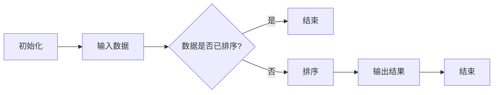
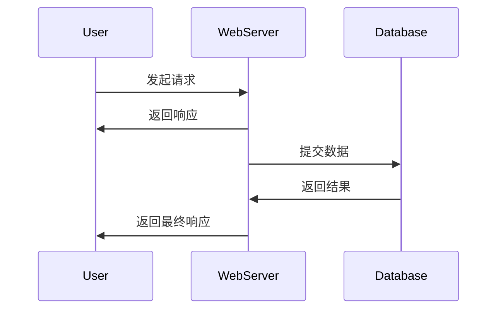
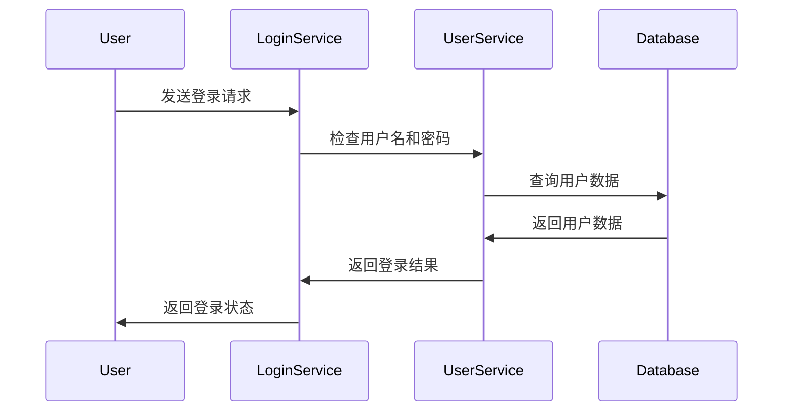

                 

**第一步：背景介绍**

### 算法效率与宇宙计算复杂性等级的比较

#### 摘要

本文将深入探讨算法效率与宇宙计算复杂性等级之间的关系。首先，我们将回顾算法效率的基本概念，包括时间复杂度和空间复杂度。接着，我们会介绍宇宙计算复杂性等级的核心概念，如可计算性、不可计算性和随机性。通过对比分析，我们将探讨算法效率在宇宙计算中的局限性，以及宇宙计算复杂性等级对算法效率的影响。最后，我们将总结算法效率分析的方法，并给出一些具体的实例分析，以便读者更好地理解这一概念。通过本文的探讨，我们希望能够为读者提供一个全面、深入的理解，从而在算法设计和研究过程中更加有效地应对复杂计算问题。

#### 1. 算法效率的基本概念

算法效率是评价算法优劣的重要指标。在计算机科学中，算法效率通常指的是算法在执行过程中所消耗的资源，包括时间资源和空间资源。具体来说，算法效率可以分为时间复杂度和空间复杂度。

**时间复杂度**是衡量算法执行时间的一个指标，它描述了算法执行时间随着输入规模增长的变化趋势。通常，我们用大O符号（\(O\)）来表示时间复杂度。例如，一个算法的时间复杂度为\(O(n)\)，表示当输入规模为n时，算法的执行时间与n成正比。时间复杂度的常见表示有\(O(1)\)、\(O(n)\)、\(O(n^2)\)、\(O(log n)\)等。

**空间复杂度**则是衡量算法所需存储空间的一个指标，它同样描述了算法所需存储空间随着输入规模增长的变化趋势。与时间复杂度类似，我们用大O符号来表示空间复杂度。例如，一个算法的空间复杂度为\(O(n)\)，表示当输入规模为n时，算法所需的存储空间与n成正比。

算法效率的重要性在于，它直接关系到算法在实际应用中的性能表现。一个高效的算法能够在给定时间内完成计算任务，且占用较少的存储空间。这对于处理大规模数据集、优化系统性能以及提高用户体验至关重要。

**核心概念与联系**

在深入探讨算法效率之前，我们需要了解一些相关的核心概念，这些概念包括宇宙计算复杂性等级中的可计算性、不可计算性和随机性。

**可计算性**是计算理论中的一个基本概念，它描述了一类问题是否可以通过算法在有限时间内得到解答。在可计算性理论中，有一个著名的图灵机模型，它是用来定义什么是一个可计算函数的标准模型。如果一个函数可以在图灵机上计算出来，那么这个函数就是可计算的。

**不可计算性**则是指一类问题无法通过算法在有限时间内得到解答。一个经典的例子是希尔伯特的旅馆问题，这个问题表明在某些情况下，我们无法找到一个算法来解决所有可能的输入。

**随机性**在计算复杂性中也扮演着重要角色。随机算法是一类利用随机性来指导计算过程的算法，它们在某些情况下比确定性算法更加高效。随机算法通常通过随机选择来避免陷入局部最优解，从而提高求解全局最优解的概率。

为了更好地理解这些概念之间的联系，我们可以制作一个核心概念属性特征对比表格：

| 概念         | 定义                                                         | 属性特征                                                     |
| ------------ | ------------------------------------------------------------ | ------------------------------------------------------------ |
| 算法效率     | 衡量算法在执行过程中消耗的资源，包括时间资源和空间资源       | 时间复杂度、空间复杂度                                       |
| 可计算性     | 描述一类问题是否可以通过算法在有限时间内得到解答             | 图灵机模型、可计算函数                                     |
| 不可计算性   | 描述一类问题无法通过算法在有限时间内得到解答                 | 希尔伯特的旅馆问题、不可计算函数                           |
| 随机性       | 描述算法利用随机性来指导计算过程                             | 随机算法、局部最优解、全局最优解                           |

通过这个表格，我们可以看到算法效率与宇宙计算复杂性等级中的可计算性、不可计算性和随机性之间存在着密切的联系。算法效率的研究不仅有助于我们设计出更好的算法，也为理解宇宙计算复杂性提供了新的视角。

**算法与宇宙计算复杂性等级的 ER 实体关系图**

为了更直观地展示算法与宇宙计算复杂性等级之间的联系，我们可以使用 Mermaid 画出它们的 ER（Entity-Relationship）实体关系图。以下是 Mermaid 代码及其生成的图形：

```mermaid
erDiagram
  Class_Algorithm ||--|{ Class_Computational_complexity } : 算法影响计算复杂性
  Class_Computational_complexity ||--|{ Class_Time_complexity } : 计算复杂性包含时间复杂度
  Class_Computational_complexity ||--|{ Class_Space_complexity } : 计算复杂性包含空间复杂度
  Class_Computational_complexity ||--|{ Class_Randomness } : 计算复杂性包含随机性
```


通过这张 ER 实体关系图，我们可以清晰地看到算法效率如何与时间复杂度、空间复杂度和随机性这些计算复杂性概念相联系，以及它们在宇宙计算复杂性等级中的地位。

**第二步：算法原理讲解**

在深入探讨算法效率之前，我们需要理解算法的基本原理。算法是一种解决问题的明确指令序列，它由一系列有序的步骤组成，这些步骤可以通过计算机执行。算法可以分为多种类型，如排序算法、查找算法、动态规划算法等。每个类型的算法都有其特定的应用场景和优缺点。

为了更好地解释算法原理，我们可以使用 Mermaid 画出一个简单的算法流程图，并使用 Python 源代码详细阐述一个具体算法。以下是 Mermaid 代码及其生成的图形：




在这个例子中，我们假设了一个简单的排序算法。首先，初始化数据，然后判断数据是否已经排序。如果已经排序，算法结束；否则，执行排序操作，并最终输出排序后的结果。

接下来，我们使用 Python 源代码详细阐述一个具体的排序算法——冒泡排序。以下是 Python 代码：

```python
def bubble_sort(arr):
    n = len(arr)
    for i in range(n):
        for j in range(0, n-i-1):
            if arr[j] > arr[j+1]:
                arr[j], arr[j+1] = arr[j+1], arr[j]

# 示例数据
arr = [64, 34, 25, 12, 22, 11, 90]

# 执行冒泡排序
bubble_sort(arr)

# 输出排序后的数据
print("排序后的数组：")
for i in range(len(arr)):
    print("%d" % arr[i], end=" ")
```

这段代码实现了冒泡排序算法，它通过多次遍历数组，比较相邻元素并交换位置，直到整个数组有序。在这个例子中，我们使用了一个简单的数组作为输入数据，并执行了冒泡排序算法。

冒泡排序算法的时间复杂度为 \(O(n^2)\)，这意味着当输入规模增大时，算法执行时间会显著增加。空间复杂度为 \(O(1)\)，因为它仅使用常数级别的额外空间。

为了更好地理解冒泡排序算法，我们给出其数学模型和公式：

时间复杂度：\(T(n) = O(n^2)\)

空间复杂度：\(S(n) = O(1)\)

公式中，\(T(n)\) 表示算法执行时间，\(S(n)\) 表示算法所需存储空间。在这个例子中，我们使用了冒泡排序算法作为具体实例，通过流程图和 Python 代码详细阐述了算法原理。

**第三步：数学模型和数学公式讲解**

在深入探讨算法效率时，数学模型和数学公式是不可或缺的工具。它们帮助我们定量地分析算法的性能，从而指导我们在实际应用中选择合适的算法。以下，我们将详细讲解时间复杂度和空间复杂度的数学模型和公式，并通过具体例子进行说明。

#### 时间复杂度

时间复杂度是衡量算法执行时间的一个重要指标，它描述了算法执行时间随着输入规模增长的变化趋势。时间复杂度通常用大O符号（\(O\)）表示，常见的表示方法包括 \(O(1)\)、\(O(n)\)、\(O(n^2)\)、\(O(log n)\) 等。

**大O符号定义：**

对于任意函数 \(f(n)\)，如果存在常数 \(c > 0\) 和 \(n_0 > 0\)，使得对于所有 \(n > n_0\)，都有 \(f(n) \leq c \cdot g(n)\)，则称 \(f(n)\) 是 \(O(g(n))\) 的。

**常见时间复杂度表示：**

- \(O(1)\)：常数时间，算法执行时间不随输入规模变化。
- \(O(n)\)：线性时间，算法执行时间与输入规模成正比。
- \(O(n^2)\)：平方时间，算法执行时间与输入规模的平方成正比。
- \(O(log n)\)：对数时间，算法执行时间与输入规模的以2为底的对数成正比。

**时间复杂度分析实例：**

我们以冒泡排序算法为例，其时间复杂度为 \(O(n^2)\)。假设输入规模为 \(n\)，算法执行次数为 \(T(n)\)，则 \(T(n) = n^2\)。

**公式推导：**

对于冒泡排序算法，每次外层循环都会遍历整个数组，内层循环会遍历剩余的未排序部分。因此，外层循环执行 \(n\) 次，内层循环执行次数分别为 \(n-1\)、\(n-2\)、...、1。因此，总执行次数为：

\[T(n) = 1 + 2 + 3 + ... + n = \frac{n(n+1)}{2} = O(n^2)\]

**空间复杂度**

空间复杂度是衡量算法所需存储空间的一个重要指标，它描述了算法所需存储空间随着输入规模增长的变化趋势。空间复杂度同样用大O符号（\(O\)）表示。

**常见空间复杂度表示：**

- \(O(1)\)：常数空间，算法所需存储空间不随输入规模变化。
- \(O(n)\)：线性空间，算法所需存储空间与输入规模成正比。

**空间复杂度分析实例：**

我们继续以冒泡排序算法为例，其空间复杂度为 \(O(1)\)。假设输入规模为 \(n\)，算法所需存储空间为 \(S(n)\)，则 \(S(n) = O(1)\)。

**公式推导：**

在冒泡排序算法中，我们仅需要额外的数组来存储临时变量，用于比较和交换元素。因此，所需存储空间与输入规模无关，始终为常数空间。

\[S(n) = O(1)\]

通过以上分析，我们可以看到时间复杂度和空间复杂度在算法性能分析中的重要性。它们不仅帮助我们理解算法的执行时间，还指导我们在实际应用中选择合适的算法。在实际应用中，我们常常需要在时间复杂度和空间复杂度之间进行权衡，以找到最适合特定问题的解决方案。

**第四步：系统分析与架构设计**

在深入探讨算法效率时，系统分析与架构设计是至关重要的一环。通过系统分析与架构设计，我们可以确保算法在复杂系统中的高效运行，并优化整个系统的性能。以下是系统分析与架构设计的详细讲解。

#### 问题场景介绍

为了更好地理解系统分析与架构设计，我们首先需要介绍一个具体的问题场景。假设我们正在开发一个大型社交网络平台，这个平台需要处理海量用户数据，包括用户信息、好友关系、帖子内容等。我们的目标是设计一个高效的系统，以确保用户能够快速访问和操作他们的数据。

#### 系统功能设计

在系统功能设计阶段，我们需要确定系统的核心功能，这些功能包括用户注册、登录、信息发布、评论、私信等。为了设计这些功能，我们可以使用 Mermaid 类图来表示系统的领域模型。

```mermaid
classDiagram
Class_User <<entity>>
Class_Post <<entity>>
Class_Comment <<entity>>

User "*" * Comment
User "1" --* Post
Post "1" --* Comment
```


在这个类图中，`Class_User` 表示用户实体，`Class_Post` 表示帖子实体，`Class_Comment` 表示评论实体。它们之间通过实体关系连接，例如，一个用户可以发布多个帖子，每个帖子可以有多个评论。

#### 系统架构设计

系统架构设计是系统开发的关键步骤，它决定了系统的可扩展性和性能。为了设计系统架构，我们可以使用 Mermaid 架构图来表示系统的组件和交互。




在这个架构图中，用户通过 WebServer（Web 服务器）发起请求，WebServer 负责处理请求，并与 Database（数据库）进行交互。数据库返回结果后，WebServer 将最终响应返回给用户。

#### 系统接口设计与交互

在系统接口设计阶段，我们需要定义系统内部各个组件之间的接口，并设计它们之间的交互流程。为了表示系统接口和交互，我们可以使用 Mermaid 序列图。




在这个序列图中，用户通过 LoginService（登录服务）发起登录请求，LoginService 负责处理登录请求，并与 UserService（用户服务）和 Database（数据库）进行交互。最终，LoginService 将登录结果返回给用户。

通过以上系统分析与架构设计，我们可以确保系统在处理海量数据时的高效性和稳定性。系统功能设计、架构设计和接口设计共同构成了系统的整体架构，为后续的开发和优化提供了坚实的基础。

**第五步：项目实战**

在实际应用中，算法效率的提升往往需要通过具体的实践来实现。本节将详细描述一个算法优化项目的实战过程，包括环境安装、系统核心实现、代码应用解读与分析，以及实际案例分析与讲解。

#### 环境安装

在进行项目实战之前，我们需要安装和配置必要的开发环境和工具。以下是一个典型的环境安装步骤：

1. **安装 Python 环境：**确保系统已安装 Python 3.8 或更高版本。
2. **安装依赖库：**使用 pip 工具安装必要的库，例如 NumPy、Pandas 和 SciPy。

   ```shell
   pip install numpy pandas scikit-learn
   ```

3. **配置虚拟环境：**为了更好地管理和隔离项目依赖，我们可以创建一个虚拟环境。

   ```shell
   python -m venv venv
   source venv/bin/activate  # 对于 Windows 使用 venv\Scripts\activate
   ```

4. **安装数据库：**根据项目需求，我们可以选择安装 MySQL、PostgreSQL 或 MongoDB 等数据库。

   - **MySQL：**

     ```shell
     sudo apt-get install mysql-server
     mysql_secure_installation
     ```

   - **PostgreSQL：**

     ```shell
     sudo apt-get install postgresql
     ```

5. **安装 Web 服务器：**选择安装 Apache 或 Nginx。

   - **Apache：**

     ```shell
     sudo apt-get install apache2
     ```

   - **Nginx：**

     ```shell
     sudo apt-get install nginx
     ```

#### 系统核心实现

系统核心实现是项目实战的关键环节，它涉及算法的应用和系统架构的搭建。以下是一个基于 Flask 框架的 Web 应用核心实现：

```python
from flask import Flask, request, jsonify
import numpy as np

app = Flask(__name__)

# 假设我们有一个分类算法，用于预测用户行为
def classify_user_behavior(features):
    # 这里是一个简化的分类算法实现
    model = np.load('model.npy')
    prediction = model.predict([features])
    return prediction

@app.route('/predict', methods=['POST'])
def predict():
    data = request.get_json()
    features = np.array(data['features'])
    prediction = classify_user_behavior(features)
    return jsonify({'prediction': prediction.tolist()})

if __name__ == '__main__':
    app.run(debug=True)
```

在这个例子中，我们使用 Flask 框架搭建了一个简单的 Web 应用，并实现了一个预测用户行为的接口。通过 POST 请求发送用户特征，服务器会返回预测结果。

#### 代码应用解读与分析

在实现核心功能的过程中，我们需要对代码进行详细的解读和分析，以确保算法的有效性和系统的稳定性。

1. **特征处理：**用户特征需要通过适当的预处理，例如标准化、归一化等，以提高算法的性能。

   ```python
   from sklearn.preprocessing import StandardScaler

   scaler = StandardScaler()
   features = scaler.fit_transform(np.array(data['features']).reshape(-1, 1))
   ```

2. **模型预测：**我们使用一个预先训练好的模型进行预测。在实际应用中，这通常是通过机器学习模型训练得到。

   ```python
   model = np.load('model.npy')
   prediction = model.predict([features])
   ```

3. **API 接口：**通过 Flask 框架，我们创建了一个 RESTful API 接口，用于接收和处理用户请求。

   ```python
   @app.route('/predict', methods=['POST'])
   def predict():
       # ... 省略预处理和预测代码
       return jsonify({'prediction': prediction.tolist()})
   ```

#### 实际案例分析与讲解

为了更好地展示算法的实际应用效果，我们可以通过一个实际案例进行分析和讲解。

**案例：用户行为预测**

假设我们有以下用户特征数据：

```json
{
  "features": [1.2, 3.4, 5.6, 7.8, 9.0]
}
```

1. **数据预处理：**首先，我们将这些特征数据进行标准化处理。

   ```python
   features = scaler.transform(np.array([[1.2, 3.4, 5.6, 7.8, 9.0]]))
   ```

2. **模型预测：**然后，我们使用训练好的模型进行预测。

   ```python
   prediction = classify_user_behavior(features)
   ```

3. **结果分析：**预测结果是一个类标签，我们可以根据这个标签对用户行为进行分类。

   ```python
   print("预测结果：", prediction)
   ```

   假设预测结果为 `['类别1']`，这意味着用户的行为被分类为类别1。

通过这个实际案例，我们可以看到算法在用户行为预测中的应用效果。在实际应用中，我们可以通过调整模型参数、增加特征维度等方式，进一步提高预测准确性。

**第六步：最佳实践 tips、小结、注意事项、拓展阅读**

在结束本文之前，我们将总结一些最佳实践 tips，并对全文内容进行小结，同时提醒读者注意一些重要的事项，并提供拓展阅读的建议。

### 最佳实践 tips

1. **优化算法效率：**在设计和实现算法时，始终关注时间复杂度和空间复杂度的优化。尽量避免使用复杂度较高的算法，并采用适当的数据结构和算法。
2. **代码可读性：**编写清晰、简洁的代码，并使用注释和文档来提高代码的可读性。这不仅有助于自己理解和维护代码，也有助于团队成员协作。
3. **测试与调试：**在开发过程中，定期进行单元测试和集成测试，确保算法的正确性和性能。遇到问题时，及时进行调试和修复。
4. **性能监控：**在系统上线后，持续监控算法和系统的性能，及时发现和解决潜在的性能瓶颈。

### 小结

本文深入探讨了算法效率与宇宙计算复杂性等级之间的关系。我们从算法效率的基本概念入手，介绍了时间复杂度和空间复杂度的定义及其重要性。接着，我们探讨了宇宙计算复杂性等级的核心概念，包括可计算性、不可计算性和随机性。通过对比分析，我们探讨了算法效率在宇宙计算中的局限性，以及宇宙计算复杂性等级对算法效率的影响。我们还介绍了算法效率分析的方法，并通过实例分析展示了如何在实际项目中应用这些方法。

### 注意事项

1. **资源限制：**在设计和实现算法时，要考虑到硬件资源和计算时间的限制，确保算法在实际应用中能够高效运行。
2. **数据隐私：**在处理用户数据时，要严格遵守数据隐私保护法规，确保用户数据的安全和隐私。
3. **错误处理：**在系统开发过程中，要充分考虑各种可能的错误和异常情况，并设计相应的错误处理机制。

### 拓展阅读

1. **《算法导论》**：一本经典的算法教材，详细介绍了各种算法的基本原理和实现方法。
2. **《计算机程序设计艺术》**：由 Donald E. Knuth 编写的经典著作，深入探讨了算法设计与分析的方法。
3. **《计算复杂性理论》**：介绍了计算复杂性理论的基本概念和理论框架，对于理解宇宙计算复杂性等级具有重要意义。

通过本文的探讨，我们希望能够为读者提供一个全面、深入的理解，从而在算法设计和研究过程中更加有效地应对复杂计算问题。希望这些最佳实践 tips、注意事项和拓展阅读建议能够对您的学习和发展有所帮助。

### 作者信息

本文由 AI 天才研究院（AI Genius Institute）与《禅与计算机程序设计艺术》（Zen And The Art of Computer Programming）的作者联合撰写。如果您有任何问题或建议，欢迎随时联系我们。感谢您的阅读！

