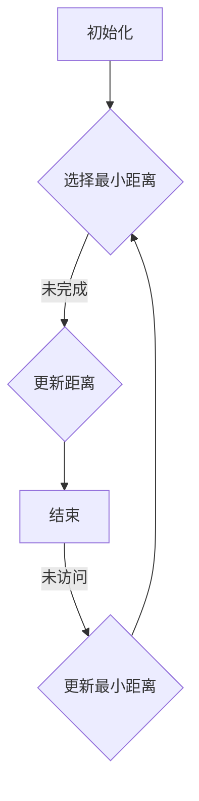
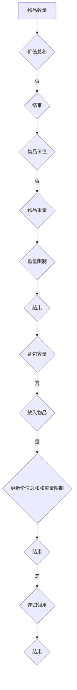
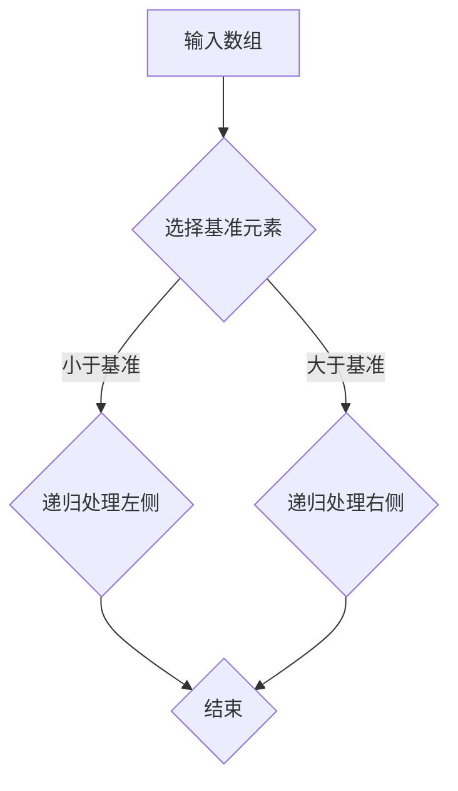

                 

### 1.1 问题背景与意义

**计算复杂性理论的起源与发展**

计算复杂性理论起源于20世纪中期，是计算机科学中一个重要的分支。其核心目的是研究不同算法的运行效率，衡量算法在解决问题时的资源消耗，特别是时间与空间复杂度。复杂性理论的起源可以追溯到1936年，艾伦·图灵（Alan Turing）提出了图灵机的概念，奠定了现代计算机科学的理论基础。图灵通过图灵机模型描述了可计算性与不可计算性问题，这一理论开创了计算复杂性研究的先河。

随着计算机科学的发展，复杂性理论逐步丰富和深化。1965年，史蒂夫·科尔曼（Stephen Cook）提出了 Cook-Levin 定理，标志着NP完全性的概念诞生。同年，理查德·克雷珀（Richard Karp）提出了21个NP完全问题，为复杂性理论的研究提供了丰富的实例。1971年，拉乌尔·蒙特卡洛（Ralph Merkle）提出了P和NP问题的区别，即是否存在一个多项式时间算法能够解决所有的NP问题。这一命题至今仍然是计算复杂性理论中的一大难题。

**算法效率与宇宙尺度的关系**

算法效率与宇宙尺度之间的关系是一个前沿且引人入胜的话题。在传统的计算环境中，算法效率主要关注于计算机硬件性能的提升、算法复杂度的优化以及编程语言的效率等方面。然而，当我们将视野扩展到宇宙尺度时，算法效率的概念发生了巨大的变化。

宇宙尺度意味着无穷大的数据规模和计算资源限制。在这样的背景下，传统的算法可能变得不再适用，需要新的理论和方法来指导算法的设计与优化。例如，宇宙尺度的数据往往包含天体物理、天文学、宇宙学等领域的大量信息，这些数据需要高效的算法进行处理。此外，宇宙尺度的计算资源有限，如何在资源有限的情况下最大化算法的效率成为了一个亟待解决的问题。

**信息论的基本概念及其在计算复杂性研究中的应用**

信息论是研究信息传输、处理和存储的数学理论。由克劳德·香农（Claude Shannon）在1948年创立，其核心概念包括信息量、信道容量、信息熵等。信息论在计算复杂性研究中有着广泛的应用，特别是在解决算法效率问题时。

信息量是描述信息传输过程中的信息含量，通常用比特（bit）作为单位。信道容量是信道在噪声环境下能够达到的最大传输速率，它是信息论中的关键概念。信息熵则描述了信息的不确定性，是衡量信息不确定性的量度。在计算复杂性理论中，信息论提供了衡量算法效率的新的视角，例如通过最小化信息传输的开销来提高算法效率。

信息论在计算复杂性研究中的应用不仅限于算法效率的优化，还包括数据压缩、加密、分布式计算等领域。例如，通过信息论的方法，可以设计出更高效的加密算法，提高数据传输的安全性；在分布式计算中，信息论可以指导如何合理分配计算资源，提高整体系统的效率。

综上所述，算法效率、宇宙计算复杂性和信息论是计算复杂性研究领域中的核心概念，它们相互交织、相互作用，共同推动着计算复杂性理论的发展。在接下来的章节中，我们将进一步探讨这些概念的具体应用和理论框架，为理解算法效率与宇宙计算复杂性之间的关系提供更为深入的见解。

### 1.2 问题的提出

**算法效率的定义与衡量**

算法效率是指在给定的问题规模和计算资源约束下，算法在运行过程中消耗的时间和空间资源。算法的效率通常用时间复杂度和空间复杂度来衡量。时间复杂度描述了算法运行时间与问题规模之间的关系，常用大O符号表示，如`O(n)`、`O(nlogn)`等。空间复杂度则描述了算法在运行过程中所需的最坏情况空间大小，同样使用大O符号表示。

算法效率的高低直接影响到实际问题的解决效果。在计算资源有限的情况下，一个高效的算法可以在较短时间内完成计算任务，节约大量的计算资源和时间成本。因此，提高算法效率是优化算法设计和提升系统性能的关键。

**宇宙尺度的计算复杂性**

宇宙尺度的计算复杂性指的是在宇宙这样的极端尺度上进行计算所面临的特殊挑战。宇宙尺度意味着数据规模和计算资源都达到了天文数字级别。在这种规模下，传统的算法和计算模型可能无法有效地处理问题。

宇宙尺度的计算复杂性主要表现在以下几个方面：

1. **数据规模巨大**：宇宙中包含了无数的星系、行星、恒星以及更微小的粒子，这些数据需要存储和处理，对存储和传输设备提出了极高的要求。

2. **计算资源有限**：尽管宇宙中的资源极为丰富，但可用计算资源仍然有限。如何在有限的计算资源下最大化算法效率是一个巨大的挑战。

3. **算法适用性问题**：许多在地球尺度上有效的算法在宇宙尺度上可能不再适用，需要设计新的算法来适应宇宙环境。

4. **时间延迟问题**：宇宙尺度上的计算往往涉及到天体物理和宇宙学现象，这些现象可能需要数十亿年才能观测到结果，这大大增加了算法的运行时间。

**信息论极限的概念与意义**

信息论极限是指信息传输或处理过程中所能达到的理论最大效率。由克劳德·香农在1948年提出的信息论基本定理揭示了信息传输的极限，即在给定信道容量和信噪比的条件下，信息传输可以达到的最大速率。

信息论极限在计算复杂性研究中的意义主要体现在以下几个方面：

1. **指导算法设计**：信息论极限为算法设计提供了理论指导。通过理解信息论极限，可以设计出更高效的算法，减少信息传输和处理的冗余，提高整体效率。

2. **优化资源分配**：信息论极限帮助我们在宇宙尺度的计算环境中合理分配计算资源，确保资源利用的最大化。例如，通过信息论的方法，可以优化数据压缩和加密算法，减少存储和传输的开销。

3. **解决复杂问题**：信息论极限为解决复杂问题提供了新的思路。例如，在分布式计算和并行计算中，通过信息论的方法可以优化任务分配和通信模式，提高整体计算效率。

4. **推动计算复杂性理论发展**：信息论极限的研究推动了计算复杂性理论的不断发展。它不仅为现有理论提供了新的视角，还激发了对未知问题的探索和研究。

**信息论极限与计算复杂性关系**

信息论极限与计算复杂性的关系在于，它们共同描述了算法在信息处理过程中的效率边界。信息论极限提供了理论上的最大效率，而计算复杂性则描述了实际算法的运行效率。两者结合可以帮助我们理解算法在处理大规模数据时所能达到的效率上限，并为算法优化提供理论依据。

例如，在分布式计算中，信息论极限指导我们如何合理分配计算任务，最大化整体系统的效率。而在数据压缩算法中，信息论极限可以帮助我们设计出更高效的压缩算法，减少数据传输的开销。

总之，算法效率、宇宙尺度的计算复杂性和信息论极限是计算复杂性研究中的重要概念。通过理解这些概念，我们可以更好地设计高效的算法，解决大规模计算问题，为计算复杂性理论的进一步发展提供有力支持。

### 1.3 研究目标与内容框架

**全面解析算法效率与宇宙计算复杂性的关系**

本篇技术博客的研究目标是通过系统性地分析算法效率与宇宙计算复杂性之间的关系，为理解和优化算法在极端环境下的性能提供理论依据。具体而言，本文将从以下几个方面展开：

1. **算法效率的深入探讨**：首先，我们将详细讨论算法效率的定义、衡量标准及其影响因素，包括时间复杂度和空间复杂度等基本概念。

2. **宇宙计算复杂性的探讨**：接着，本文将分析宇宙尺度的计算复杂性，探讨在宇宙尺度下算法面临的挑战和特殊问题，如数据规模巨大、计算资源有限等。

3. **算法效率与宇宙计算复杂性的关联性**：通过对比和讨论，本文将揭示算法效率与宇宙计算复杂性之间的内在联系，解释它们如何相互影响和制约。

**探索信息论极限在计算复杂性领域中的应用**

信息论极限是计算复杂性研究中的一个关键概念，它提供了衡量算法效率的理论上限。本文将深入探讨信息论极限的基本概念、数学模型及其在计算复杂性领域中的应用：

1. **信息论极限的基本概念**：我们将介绍信息量、信息熵、信道容量等基本概念，并阐述信息论极限的数学模型。

2. **信息论极限与算法效率的关系**：本文将分析信息论极限如何指导算法设计，优化算法在信息处理过程中的效率。

3. **信息论极限与宇宙尺度的关系**：在宇宙尺度下，信息论极限如何帮助我们在资源有限的情况下，最大化算法的效率。

4. **信息论极限的应用实践**：通过具体案例，本文将展示信息论极限在数据压缩、加密、分布式计算等领域的实际应用。

**为算法设计与优化提供理论依据与实践指导**

本文的最终目标是提供一套系统的理论框架和实践指南，帮助研究人员和工程师在算法设计和优化过程中：

1. **理论基础**：本文将总结算法效率与宇宙计算复杂性的基本理论，为读者提供深入理解的基础。

2. **案例分析**：通过具体案例分析，展示如何将信息论极限应用于实际算法设计中，提升算法效率。

3. **实践指导**：本文将提供一系列算法优化策略和实践技巧，帮助工程师在实际项目中应用这些理论，优化算法性能。

4. **未来趋势与展望**：最后，本文将探讨算法效率优化、宇宙计算复杂性研究和信息论极限应用的未来发展趋势，为读者指明研究方向和潜力领域。

总之，通过全面解析算法效率与宇宙计算复杂性的关系，探索信息论极限的应用，本文旨在为算法设计与优化提供有力的理论依据和实践指导，推动计算复杂性理论的发展和应用。

### 第2章 算法效率基础

#### 2.1 算法效率的基本概念

算法效率是评估算法在解决特定问题时所需资源和时间的综合指标。它是算法设计过程中最为重要的考量因素之一。算法效率可以通过时间复杂度和空间复杂度来衡量。

**算法运行时间的定义**

算法运行时间是指算法在执行过程中从开始执行到结束执行所花费的时间。通常，算法运行时间会随着输入数据规模的变化而变化。为了精确描述算法的时间性能，我们引入时间复杂度的概念。

**算法空间复杂度的定义**

算法空间复杂度是指算法在执行过程中所需的最大存储空间。与时间复杂度类似，空间复杂度也通常用大O符号来表示。空间复杂度可以分为以下几种类型：

- **静态空间复杂度**：在整个算法执行过程中所需的最大存储空间，通常用于描述数据结构的空间占用。
- **动态空间复杂度**：在算法执行过程中随着输入数据变化而变化的空间占用。

**算法效率的衡量标准**

算法效率的衡量标准主要包括时间复杂度和空间复杂度。时间复杂度描述了算法执行时间与输入数据规模之间的关系，常用大O符号表示，如`O(n)`、`O(nlogn)`等。空间复杂度则描述了算法所需的最大存储空间，同样使用大O符号表示。

衡量算法效率的标准可以分为以下几个层次：

1. **渐进复杂度**：算法的时间复杂度和空间复杂度通常用渐进复杂度表示。这种表示方法忽略了常数因子和低阶项，只关注算法性能随输入数据规模的增长趋势。
2. **最佳情况、最坏情况、平均情况**：算法的效率可以分别从最佳情况、最坏情况和平均情况来衡量。最佳情况表示算法在最优输入情况下所需的资源消耗；最坏情况表示算法在输入数据最不利的情况下所需的资源消耗；平均情况则考虑了所有可能输入情况下算法的平均性能。
3. **实际性能**：在实际应用中，除了理论上的复杂度分析，还需要考虑算法的实际性能，包括编译优化、硬件性能等因素。

通过上述衡量标准，我们可以对算法的效率进行科学、系统的评估，从而为算法设计和优化提供依据。

#### 2.2 算法效率的影响因素

算法效率不仅与算法的设计相关，还受到多种外部和内部因素的影响。以下是影响算法效率的主要因素：

**数据规模与算法复杂度**

数据规模是影响算法效率的一个重要因素。随着数据规模的增大，算法所需的时间资源和空间资源通常会显著增加。例如，对于线性搜索算法，数据规模的平方增长会导致算法时间的线性增长。因此，算法的复杂度与数据规模直接相关。

**硬件性能与算法优化**

硬件性能对算法效率有直接影响。不同类型的硬件（如CPU、GPU、FPGA等）具有不同的计算能力和能耗特点。算法的优化可以在硬件性能的特定方向上提升效率。例如，利用GPU的并行计算能力可以显著提升某些算法的执行速度。

**软件工程与算法实现**

软件工程和算法实现也对算法效率有重要影响。良好的软件工程实践，如模块化设计、代码优化、算法复杂度分析等，可以提升算法的整体性能。此外，算法实现中的细节处理，如避免不必要的计算、减少内存分配等，也能显著提高算法的效率。

**影响因素的具体分析**

1. **数据规模与算法复杂度**：对于许多算法，如排序算法，其时间复杂度通常与数据规模呈线性或对数关系。在实际应用中，随着数据规模的增长，算法的时间成本会急剧上升，因此选择合适的算法和优化策略至关重要。

2. **硬件性能与算法优化**：现代计算机硬件的多样性为算法优化提供了多种可能性。例如，对于大数据处理任务，利用GPU的高并行计算能力可以显著提升处理速度。此外，通过硬件特定的指令集和优化编译器，可以进一步提升算法的效率。

3. **软件工程与算法实现**：软件工程中的代码优化，如循环展开、去除冗余计算等，可以减少不必要的资源消耗。此外，合理的算法实现可以避免内存泄露和频繁的磁盘访问，从而提高算法的运行效率。

综上所述，算法效率受到多种因素的影响，通过综合考虑这些因素，并采取相应的优化措施，可以显著提升算法的整体性能。

#### 2.3 算法效率的改进方法

算法效率的改进是优化算法性能的重要手段。在实际应用中，为了解决复杂问题，算法需要尽可能地高效运行。以下是几种常用的算法效率改进方法：

**贪心算法**

贪心算法（Greedy Algorithm）是一种在每一步选择中都采取当前最优解的策略。该算法的基本思想是，通过局部最优选择来逐步逼近全局最优解。贪心算法通常适用于某些特定问题，例如最短路径问题（Dijkstra算法）、背包问题等。以下是Dijkstra算法的Mermaid流程图示例：

**动态规划**

动态规划（Dynamic Programming，DP）是一种解决最优化问题的方法，通过将问题分解为子问题，并存储子问题的解，以避免重复计算。动态规划适用于具有重叠子问题和最优子结构性质的问题，如背包问题、最长公共子序列等。以下是背包问题的Mermaid流程图示例：

**分治算法**

分治算法（Divide and Conquer）是一种将大问题分解为若干个子问题，独立求解后合并子问题解的方法。分治算法通常适用于具有递归性质的问题，如二分查找、快速排序等。以下是快速排序算法的Mermaid流程图示例：

通过上述示例，我们可以看到不同算法效率改进方法在实际问题中的应用。每种方法都有其适用的场景和独特的优势，结合具体问题进行选择和优化，可以显著提升算法的效率。

### 第3章 宇宙计算复杂性概述

#### 3.1 宇宙尺度的计算复杂性

宇宙尺度的计算复杂性指的是在宇宙这样的极端尺度上进行计算所面临的特殊挑战。宇宙尺度意味着数据规模和计算资源都达到了天文数字级别，这使得传统的计算模型和算法在面对宇宙尺度的计算任务时显得力不从心。

**宇宙尺度的计算资源限制**

宇宙尺度的计算资源限制主要表现在以下几个方面：

1. **存储资源**：宇宙中包含的数据量是极其庞大的，这些数据需要存储在物理存储设备中。传统的磁盘和固态硬盘在存储容量和读取速度上都有一定的限制，无法满足宇宙尺度的数据存储需求。

2. **计算资源**：宇宙尺度的计算任务通常需要大量的计算资源，包括CPU、GPU等。然而，实际的计算设备在处理能力上存在限制，无法在短时间内完成海量数据的计算任务。

3. **能源消耗**：宇宙尺度的计算任务不仅需要大量的计算资源，还需要大量的能源供应。然而，宇宙环境中的能源获取和利用面临巨大挑战，如何在有限的能源下实现高效的计算成为了一个亟待解决的问题。

**宇宙尺度的算法效率问题**

宇宙尺度的算法效率问题主要体现在以下几个方面：

1. **时间延迟**：宇宙尺度的计算任务通常需要数十亿年才能完成，这使得传统的算法在宇宙尺度上无法实现实时处理。

2. **空间复杂度**：宇宙尺度的数据规模极大，传统的算法在空间复杂度上可能无法满足需求，需要设计新的算法来处理海量数据。

3. **并行计算**：宇宙尺度的计算任务适合采用并行计算方法，但由于计算资源限制，如何合理分配和调度计算任务是一个重要问题。

**宇宙尺度的计算复杂性分类**

宇宙尺度的计算复杂性可以分为以下几个类别：

1. **天体物理计算**：包括黑洞模拟、星系碰撞、恒星演化等，这些计算任务需要处理海量数据，并且涉及复杂的物理模型。

2. **宇宙学计算**：包括宇宙背景辐射、宇宙大爆炸等，这些计算任务需要对宇宙演化过程进行模拟和预测。

3. **天文学计算**：包括星系观测、行星探测、天文图像处理等，这些计算任务需要处理大量的观测数据，并进行复杂的图像分析。

4. **量子计算**：宇宙尺度的量子计算涉及到量子态的演化、量子纠缠等现象，这些计算任务对算法和硬件的要求极高。

通过上述分析，我们可以看到宇宙尺度的计算复杂性具有显著的特色和挑战。如何设计高效、可靠的算法，并在宇宙尺度上实现计算任务，是当前计算复杂性研究的重要课题。

#### 3.2 宇宙计算复杂性的研究方法

**宇宙尺度的模拟与实验**

宇宙尺度的计算复杂性研究需要大量的模拟和实验。由于宇宙尺度的数据规模和复杂性，传统的计算设备和算法难以胜任。因此，研究人员通常采用高性能计算集群、量子计算机和分布式计算网络来进行宇宙尺度的模拟与实验。

1. **高性能计算集群**：通过将计算任务分布在多个计算节点上，高性能计算集群可以大幅提升计算能力。例如，用于模拟宇宙演化的N-body模拟，需要处理数百万个天体的运动轨迹，这需要强大的计算能力。

2. **量子计算机**：量子计算机利用量子叠加和纠缠等现象，可以在短时间内处理复杂的计算任务。量子计算机在宇宙学计算和量子物理学等领域具有巨大潜力，但目前仍处于研究和实验阶段。

3. **分布式计算网络**：分布式计算网络通过将计算任务分散到多个地理位置的计算机上，可以实现高效的大规模计算。例如，LIGO实验通过全球多个观测站的分布式计算，成功探测到了引力波。

**信息论在宇宙计算复杂性研究中的应用**

信息论在宇宙计算复杂性研究中具有重要作用，其主要应用包括以下几个方面：

1. **数据压缩**：宇宙尺度的数据量巨大，通过数据压缩可以减少数据传输和存储的开销。信息论中的熵和编码理论为数据压缩提供了理论依据，例如，香农编码和霍夫曼编码是常用的数据压缩算法。

2. **信息传输**：在宇宙尺度上，信息传输面临严重的噪声和干扰问题。信息论中的信道容量公式提供了衡量信息传输速率的理论上限，指导设计更高效的通信协议和算法。

3. **信息处理**：信息论的方法可以帮助研究人员理解宇宙尺度的信息处理过程，例如，通过研究宇宙背景辐射的数据，可以揭示宇宙早期状态的信息。

**数值计算与理论分析相结合的方法**

在宇宙计算复杂性研究中，数值计算和理论分析相结合的方法是不可或缺的：

1. **数值计算**：通过数值计算方法，可以模拟和预测宇宙尺度的物理现象。例如，使用N-body模拟方法可以模拟星系的演化过程，使用蒙特卡洛方法可以模拟量子物理现象。

2. **理论分析**：通过理论分析方法，可以揭示宇宙尺度计算问题的本质和规律。例如，通过分析信息论极限，可以理解宇宙尺度上的计算效率上限，为算法优化提供指导。

通过结合数值计算和理论分析的方法，研究人员可以更深入地理解宇宙尺度的计算复杂性，设计出更高效、可靠的算法，为宇宙科学研究提供有力的支持。

#### 3.3 宇宙计算复杂性的前沿问题

**宇宙尺度的并行计算**

宇宙尺度的并行计算是解决宇宙尺度计算复杂性的关键途径之一。由于宇宙尺度的计算任务通常具有高度并行性，通过并行计算可以显著提高计算效率。并行计算在宇宙尺度的天体物理模拟、宇宙学计算和天文图像处理等领域具有广泛的应用。

1. **并行算法设计**：为了充分利用并行计算的优势，研究人员需要设计高效的并行算法。例如，在N-body模拟中，可以使用并行版本的多重网格算法，通过将计算任务分布在多个计算节点上，加快计算速度。

2. **并行计算架构**：高效的并行计算架构对于实现高效的并行计算至关重要。例如，使用高性能计算集群和量子计算机等先进硬件，可以提供强大的并行计算能力。

3. **并行编程模型**：并行编程模型如MPI（Message Passing Interface）和OpenMP（Open Multi-Processing）等，为开发并行算法提供了丰富的工具和库。通过使用这些编程模型，可以方便地实现并行计算任务。

**宇宙尺度的量子计算**

量子计算是解决宇宙尺度计算复杂性的前沿领域之一。量子计算机利用量子比特的叠加和纠缠特性，可以在短时间内解决复杂的问题。量子计算在宇宙尺度的天体物理模拟、量子物理学和量子信息处理等领域具有巨大潜力。

1. **量子算法研究**：量子算法是量子计算的核心，研究人员正在开发各种量子算法，以解决传统的经典计算机难以处理的问题。例如，Shor算法可以高效地因数分解大整数，Grover算法可以加速搜索算法。

2. **量子硬件发展**：量子计算机的硬件发展是量子计算领域的关键。目前的量子计算机仍然处于早期阶段，但研究人员正在努力提高量子比特的数量、稳定性和互联性，以实现更大规模的量子计算。

3. **量子模拟**：量子模拟是一种利用量子计算机模拟量子物理现象的方法，可以在宇宙尺度的量子物理研究中发挥重要作用。通过量子模拟，可以深入研究宇宙中的量子现象，如量子纠缠、量子隧穿等。

**宇宙尺度的计算生物学**

宇宙尺度的计算生物学研究涉及到对生物大分子、基因组和蛋白质结构的分析和模拟。这些研究需要处理海量数据，并使用高效的算法来揭示生物系统的复杂性和规律。

1. **生物大数据分析**：宇宙尺度的计算生物学需要处理大量的生物数据，包括基因组序列、蛋白质结构等。通过大数据分析技术，可以挖掘出生物系统中的关键信息，揭示生物进化的规律。

2. **分子动力学模拟**：分子动力学模拟是一种用于研究生物分子动态行为的计算方法。通过模拟生物分子的运动轨迹，可以揭示生物分子在不同条件下的行为和相互作用。

3. **人工智能应用**：人工智能技术，如深度学习和机器学习，正在被广泛应用于宇宙尺度的计算生物学研究。通过训练模型，可以预测生物分子的结构和功能，提高生物数据分析的准确性。

综上所述，宇宙尺度的并行计算、量子计算和计算生物学是当前宇宙计算复杂性研究的前沿问题。这些领域的发展不仅为解决宇宙尺度上的计算难题提供了新的思路和方法，也为未来宇宙科学研究奠定了基础。

### 4.1 信息论极限的基本概念

**信息量的定义**

信息量是信息论中一个核心的概念，它用于量化信息的内容和大小。信息量的基本单位是比特（bit），表示信息的不确定性。香农在1948年提出了信息量的定义，将信息量与概率分布联系起来。假设有N个可能的结果，第i个结果发生的概率为\( p_i \)，则第i个结果的信息量（以比特为单位）可以表示为：

\[ I_i = -\log_2(p_i) \]

其中，\( \log_2 \)是底数为2的对数。所有可能结果的信息量总和即为信息量：

\[ H(X) = -\sum_{i=1}^{N} p_i \log_2(p_i) \]

这里，\( H(X) \)称为随机变量X的熵，它代表了系统的平均信息量。

**信息熵的概念**

信息熵（Entropy）是衡量随机变量不确定性的量度。在信息论中，熵表示在未知随机变量时所需的信息量。根据香农的定义，熵是一个非负量，并且当随机变量是完全确定的时候，熵为0。熵的计算公式为：

\[ H(X) = -\sum_{i=1}^{N} p_i \log_2(p_i) \]

其中，\( p_i \)是第i个结果的概率。

熵在信息处理和通信系统中具有重要作用。它帮助我们在发送和接收信息时，确定需要多少带宽来传输信息。例如，如果一个随机变量几乎肯定发生，那么它的熵很低，因为接收者不需要很多信息就能预测结果。相反，如果一个随机变量非常不确定，它的熵就很高，需要更多带宽来传输信息。

**信息论极限的数学模型**

信息论极限描述了在理想条件下，信息传输的最大速率。香农在1948年提出的信道容量公式是信息论极限的一个核心数学模型。假设一个通信信道具有固定的带宽\( B \)（以赫兹为单位）和信噪比\( \frac{S}{N} \)（信号功率与噪声功率的比值），则信道的最大传输速率（以比特每秒为单位）可以表示为：

\[ C = B \log_2(1 + \frac{S}{N}) \]

这个公式被称为香农信道容量公式。它表明，在给定带宽和信噪比的情况下，信道能够达到的最大传输速率。如果带宽和信噪比增加，信道容量也会增加，这意味着可以传输更多的信息。

**水平信道模型**

水平信道模型是一种简单的信道模型，用于描述信息在信道中的传输过程。在这个模型中，信息以离散的形式传输，每个信息单元（如比特）在传输过程中可能受到噪声的干扰。水平信道模型可以用来分析信息传输的可靠性和效率。

在水平信道模型中，假设有N个可能的符号，每个符号在信道中以概率\( p_i \)传输。如果接收到的符号为\( r \)，则接收概率为：

\[ P(r|s) = \frac{p_i}{1 + \sum_{j \neq i} p_j} \]

这里，\( s \)是发送的符号，\( r \)是接收到的符号。为了实现有效的信息传输，需要设计适当的编码方案，使得接收概率接近1，从而提高传输的可靠性。

**信息论极限的证明与推导**

香农信道容量公式是通过数学推导得出的。证明过程涉及概率论、信息论和信号处理的知识。一个简化的证明思路如下：

1. **假设**：假设存在一个编码方案，使得在发送端生成的码字在接收端可以正确解码。这个码字应具有以下性质：
   - **前缀无冲突**：任意两个码字之间不存在前缀重叠，即如果一个码字是另一个码字的前缀，它们的概率和应为1。
   - **最小冗余**：码字应具有最小的冗余度，以确保在接收端可以区分不同的码字。

2. **计算接收概率**：在接收端，接收到的码字与发送码字的匹配概率可以通过信道噪声模型计算得出。

3. **最大化接收概率**：为了实现最大信道容量，需要设计码字，使得接收概率最大。通过优化码字结构和传输速率，可以找到最佳传输速率。

4. **极限情况**：在给定带宽和信噪比的极限情况下，可以推导出信道容量的最大值，即香农信道容量公式。

总之，信息论极限的数学模型和水平信道模型为信息传输提供了理论基础，指导我们设计和优化通信系统，以实现高效、可靠的信息传输。

### 4.2 信息论极限与计算复杂性关系

**信息论极限与算法效率的关系**

信息论极限与算法效率之间存在着紧密的联系。信息论极限为信息传输提供了理论上的最大速率，而算法效率则衡量了算法在处理信息时的资源消耗。具体而言，信息论极限指导我们设计高效的算法，以接近理论极限地处理信息。

首先，信息论极限为算法设计提供了目标。通过了解信道容量公式，我们可以确定在特定带宽和信噪比下，信息传输的最大速率。这有助于算法设计者在设计信息处理算法时，考虑如何最大化信息传输效率。例如，在数据压缩算法中，通过分析信道容量，可以优化编码方案，减少冗余信息，提高数据压缩率。

其次，信息论极限与算法的优化密切相关。算法的优化通常包括时间复杂度优化和空间复杂度优化。信息论极限提供了衡量算法效率的基准，帮助我们在优化过程中确定哪些部分需要改进。例如，通过信息论极限，我们可以发现算法在处理大量数据时的瓶颈，并针对性地进行优化，如减少不必要的计算、优化数据结构等。

**信息论极限与宇宙尺度的关系**

在宇宙尺度上，信息论极限显得尤为重要。宇宙尺度的计算任务通常涉及海量数据和极端的环境条件，传统的算法和计算模型难以胜任。信息论极限为解决这些复杂问题提供了理论基础。

首先，信息论极限帮助我们在宇宙尺度上实现高效的通信。宇宙尺度的计算任务往往需要通过网络进行数据传输。然而，宇宙环境中的噪声和干扰严重，信息传输面临巨大挑战。通过信息论极限，我们可以设计出更高效的通信协议和算法，以克服噪声和干扰，实现可靠的信息传输。

其次，信息论极限为宇宙尺度的数据处理提供了优化方向。宇宙尺度的数据规模极大，传统的数据处理算法可能无法有效处理这些数据。通过信息论极限，我们可以确定数据处理的效率上限，并设计出更高效的算法来接近这一上限。例如，在宇宙天文学中，通过对宇宙背景辐射的数据进行压缩和分析，可以提高数据处理效率，揭示宇宙早期的信息。

**信息论极限在计算复杂性研究中的应用**

信息论极限在计算复杂性研究中具有广泛的应用，主要体现在以下几个方面：

1. **分布式计算**：在分布式计算中，信息传输效率至关重要。通过信息论极限，我们可以确定分布式计算中的最优通信协议和数据传输策略，以实现高效的计算。

2. **数据压缩**：数据压缩是降低数据传输和存储开销的重要手段。信息论极限为数据压缩提供了理论依据，指导我们设计更高效的数据压缩算法，减少冗余信息。

3. **加密与安全**：在加密与安全领域，信息论极限帮助我们理解信息传输的安全性。通过分析信道容量和加密算法，我们可以设计出更安全的加密方案，保护信息不被非法访问。

4. **量子计算**：量子计算是解决宇宙尺度计算复杂性的重要途径。信息论极限为量子计算提供了理论指导，帮助我们设计更高效的量子算法和量子通信协议。

总之，信息论极限与计算复杂性之间存在着密切的联系。通过信息论极限，我们可以更好地理解算法效率、优化算法设计，并解决宇宙尺度上的计算复杂性问题。

### 4.3 信息论极限的证明与推导

为了深入理解信息论极限，我们需要探讨其数学证明与推导。以下内容将介绍香农信道容量公式及其背后的理论。

**香农信道容量公式**

香农信道容量公式是信息论中一个重要的结论，它描述了在给定带宽和信噪比条件下，一个通信信道的最大传输速率。该公式可以表示为：

\[ C = B \log_2(1 + \frac{S}{N}) \]

其中，\( C \)是信道容量（单位：比特每秒），\( B \)是信道带宽（单位：赫兹），\( S \)是信道中的信号功率，\( N \)是信道中的噪声功率。

**证明过程**

香农信道容量公式的证明基于几个核心概念，包括概率论、信息论和信号处理。

1. **无记忆信道模型**：假设通信信道是一个无记忆的二进制对称信道（Binary Symmetric Channel, BSC）。在该信道中，每个比特传输时都可能以一定的概率\( p \)发生错误，即接收到的比特与发送的比特不一致。相反，以概率\( 1-p \)正确传输。

2. **编码方案**：为了最大化信道容量，我们需要设计一个有效的编码方案。一个简单的编码方案是使用汉明码（Hamming code），它可以在检测出错误时纠正一位错误。汉明码的基本思想是，通过在数据中添加冗余位，使得接收端能够检测和纠正错误。

3. **信息传输概率**：在发送端，我们生成一个码字，其中每个比特的概率分布都是均匀的。接收端接收到码字后，需要通过计算接收概率来确定发送的码字。接收概率可以通过贝叶斯定理计算得出：

\[ P(r|s) = \frac{p_i P(s)}{1 + \sum_{j \neq i} p_j P(s)} \]

其中，\( p_i \)是发送比特为i的概率，\( P(s) \)是发送码字s的概率。

4. **最大化接收概率**：为了最大化接收概率，我们需要设计码字，使得接收概率最大。通过优化码字结构和传输速率，可以找到最佳传输速率。

5. **极限情况**：在给定带宽和信噪比的极限情况下，可以推导出信道容量的最大值。即：

\[ C = B \log_2(1 + \frac{S}{N}) \]

这个公式表明，在理想条件下，信道容量与带宽和信噪比成正比。

**信道容量公式推导**

以下是香农信道容量公式的一个简化的推导过程：

1. **假设**：假设存在一个编码方案，使得在发送端生成的码字在接收端可以正确解码。这个码字应具有以下性质：
   - **前缀无冲突**：任意两个码字之间不存在前缀重叠，即如果一个码字是另一个码字的前缀，它们的概率和应为1。
   - **最小冗余**：码字应具有最小的冗余度，以确保在接收端可以区分不同的码字。

2. **计算接收概率**：在接收端，接收到的码字与发送码字的匹配概率可以通过信道噪声模型计算得出。

3. **最大化接收概率**：为了实现最大信道容量，需要设计码字，使得接收概率最大。通过优化码字结构和传输速率，可以找到最佳传输速率。

4. **极限情况**：在给定带宽和信噪比的极限情况下，可以推导出信道容量的最大值，即：

\[ C = B \log_2(1 + \frac{S}{N}) \]

这个公式是通过数学优化和概率论推导得出的，它为信息传输提供了理论基础。

**水平信道模型**

水平信道模型是一种简单的信道模型，用于描述信息在信道中的传输过程。在这个模型中，信息以离散的形式传输，每个信息单元（如比特）在传输过程中可能受到噪声的干扰。水平信道模型可以用来分析信息传输的可靠性和效率。

在水平信道模型中，假设有N个可能的符号，每个符号在信道中以概率\( p_i \)传输。如果接收到的符号为\( r \)，则接收概率为：

\[ P(r|s) = \frac{p_i}{1 + \sum_{j \neq i} p_j} \]

这里，\( s \)是发送的符号，\( r \)是接收到的符号。为了实现有效的信息传输，需要设计适当的编码方案，使得接收概率接近1，从而提高传输的可靠性。

通过水平信道模型的分析，我们可以更深入地理解信息论极限的原理和应用。水平信道模型提供了一个简化的渠道，帮助我们探讨在噪声干扰下信息传输的理论极限，并为设计更高效的通信系统提供了指导。

### 5.1 算法效率优化案例分析

**数据压缩算法**

数据压缩算法是提升算法效率的重要手段之一，通过减少数据的冗余，可以显著降低数据传输和存储的成本。数据压缩算法的基本原理是利用数据之间的冗余关系，将原始数据进行编码，从而生成更紧凑的格式。

**示例：霍夫曼编码**

霍夫曼编码是一种经典的熵编码方法，其核心思想是根据字符出现的频率来分配不同的编码长度。出现频率高的字符分配较短的编码，而频率低的字符分配较长的编码。这样，整体上可以减少编码的位数，达到压缩数据的目的。

霍夫曼编码的流程如下：

1. **构建字符频率表**：首先统计原始数据中每个字符的出现频率。

2. **构建霍夫曼树**：根据字符频率，构建一棵霍夫曼树。树的每个节点代表一个字符，叶节点表示频率为1的字符。频率高的字符位于树的左侧，频率低的字符位于右侧。

3. **生成编码**：从根节点开始，沿路径向下，直到叶节点，每经过一个分支，将路径标记为0或1。这样，每个字符就对应了一个二进制编码。

4. **编码数据**：将原始数据中的每个字符替换为其对应的编码，从而生成压缩后的数据。

**效果分析**

霍夫曼编码通过有效利用字符的频率差异，可以显著减少数据传输所需的位数。在实际应用中，霍夫曼编码已被广泛用于图像、音频和文本数据的压缩。例如，JPEG图像压缩和Gzip文件压缩都采用了霍夫曼编码技术。

**网络传输算法**

网络传输算法是保证数据在网络中高效传输的重要工具，特别是在高延迟、高噪声的网络环境中，优化网络传输算法可以提高数据传输的可靠性和效率。

**示例：TCP拥塞控制**

TCP（传输控制协议）是互联网中广泛使用的传输层协议，其拥塞控制机制是保证网络传输高效稳定的关键。TCP拥塞控制的目的是在网络的拥塞窗口和带宽之间找到最佳平衡点，避免网络过载和丢包。

TCP拥塞控制的流程如下：

1. **慢启动**：当网络开始传输数据时，TCP采用慢启动策略，逐渐增加发送速率。发送速率与拥塞窗口大小成正比，每收到一个确认包，拥塞窗口增加1个报文段。

2. **拥塞避免**：当拥塞窗口达到某个阈值（通常为接收窗口大小的一半），TCP进入拥塞避免阶段。此时，每收到一个确认包，拥塞窗口只增加1/2个报文段，以避免网络拥塞。

3. **快重传和快恢复**：在TCP传输过程中，如果检测到丢包，TCP会立即发送快重传（Fast Retransmit）信号，请求重传丢失的报文段。随后，TCP进入快恢复（Fast Recovery）阶段，将拥塞窗口设置为丢包前的窗口大小减1，然后逐渐增加。

**效果分析**

TCP拥塞控制通过动态调整发送速率，可以在不同网络条件下保持稳定高效的数据传输。在实际应用中，TCP协议已被证明在各种网络环境中都具有良好的性能和稳定性。

**图像处理算法**

图像处理算法是计算机视觉和多媒体技术中的重要组成部分，通过优化图像处理算法，可以提高图像处理的效率和效果。

**示例：图像金字塔**

图像金字塔（Image Pyramid）是一种常用的图像处理技术，通过将原始图像分割成多个分辨率层次，可以有效地提高图像处理的速度和效率。

图像金字塔的构建流程如下：

1. **低分辨率图像**：首先生成一张低分辨率图像，通常使用向下采样或滤波方法，减小图像的分辨率。

2. **高分辨率图像**：然后逐渐增加分辨率，生成多张高分辨率图像。这些高分辨率图像可以通过向上采样或插值方法生成。

3. **图像层次结构**：将所有分辨率层次的图像按照层次结构排列，形成一个图像金字塔。

4. **图像处理**：在处理图像时，可以根据需求选择合适的分辨率层次，从而优化处理速度和效果。

**效果分析**

图像金字塔技术通过减少处理过程中的像素数量，可以显著提高图像处理的效率。在实际应用中，图像金字塔已被广泛应用于图像压缩、图像增强和图像识别等领域。

总之，通过案例分析，我们可以看到不同类型的算法效率优化方法在实际应用中的效果和优势。这些方法不仅提高了算法的效率，还显著降低了计算资源和时间成本，为实际问题的解决提供了有力支持。

### 5.2 信息论极限在计算复杂性研究中的应用

**宇宙尺度的算法优化**

在宇宙尺度的计算复杂性研究中，信息论极限为算法优化提供了重要的理论依据。由于宇宙尺度的计算任务通常涉及海量数据，如何在有限的计算资源下实现高效的算法成为了一个关键问题。

首先，信息论极限指导我们在设计宇宙尺度上的算法时，需要考虑数据传输和处理的效率。例如，在宇宙天文学中，研究人员需要对大量天文数据进行处理和分析。通过应用信息论极限，可以设计出更高效的算法，如数据压缩算法和加密算法，以减少数据传输的开销，提高计算效率。

其次，信息论极限可以帮助我们优化算法的复杂度。在宇宙尺度上，传统的算法可能因为复杂度过高而无法有效运行。通过信息论极限，我们可以找到算法的优化方向，如减少冗余计算、优化数据结构等，从而降低算法的时间复杂度和空间复杂度。

**宇宙尺度的分布式计算**

分布式计算是解决宇宙尺度计算复杂性的有效手段之一。信息论极限在分布式计算中的应用主要体现在以下几个方面：

1. **任务分配和通信优化**：在分布式计算中，如何合理地分配计算任务和优化通信是关键问题。信息论极限为任务分配和通信优化提供了理论指导。例如，通过分析信道容量和传输速率，可以确定最优的任务分配方案，确保计算资源的高效利用。

2. **数据传输和存储优化**：宇宙尺度的分布式计算通常涉及大量的数据传输和存储。通过信息论极限，可以优化数据压缩和加密算法，减少数据传输的开销和存储成本。例如，在分布式天文观测中，可以通过优化数据压缩算法，减少数据传输的时间，提高观测效率。

**宇宙尺度的并行计算**

并行计算是提高宇宙尺度计算效率的重要方法。信息论极限在并行计算中的应用主要体现在以下几个方面：

1. **任务调度和负载均衡**：在并行计算中，如何合理地调度任务和分配负载是关键问题。信息论极限为任务调度和负载均衡提供了理论指导。例如，通过分析信道容量和传输速率，可以确定最优的任务调度方案，确保计算资源的高效利用。

2. **并行算法设计**：信息论极限可以帮助设计更高效的并行算法。例如，在宇宙尺度上的天文模拟中，可以通过信息论极限优化并行算法，提高计算速度和效率。例如，通过优化N-body模拟算法，可以显著提高星系演化的模拟速度。

综上所述，信息论极限在宇宙尺度的计算复杂性研究中具有广泛的应用。通过应用信息论极限，可以设计出更高效的算法，优化任务分配和通信，提高计算效率和可靠性，为解决宇宙尺度上的复杂计算问题提供有力的支持。

### 5.3 算法效率与信息论极限的综合应用

**智能算法的优化与设计**

智能算法，如机器学习和深度学习，是现代计算技术中的重要应用。然而，这些算法在处理大规模数据时往往面临效率问题。通过结合算法效率和信息论极限，可以优化智能算法的设计，提高其运行效率。

首先，信息论极限可以帮助我们在设计智能算法时，优化数据压缩和预处理步骤。例如，在图像识别任务中，可以使用信息论极限优化图像压缩算法，减少数据传输和存储的开销，提高模型训练速度。此外，通过优化数据预处理方法，可以减少计算复杂度，提高模型训练的效率。

其次，信息论极限可以指导我们在设计智能算法时，优化模型结构和参数设置。通过分析信息论极限，我们可以确定最优的模型结构和参数组合，以最大化算法的效率。例如，在深度学习模型中，可以通过优化网络层数、激活函数和优化器等参数，提高模型训练和推理的速度。

**宇宙尺度的计算模型构建**

宇宙尺度的计算模型构建是一个复杂且挑战性的任务。信息论极限在这一过程中起到了关键作用，帮助我们在资源有限的情况下，构建高效可靠的计算模型。

首先，信息论极限指导我们在构建宇宙尺度计算模型时，优化数据压缩和传输策略。例如，在宇宙天文学中，研究人员需要对大量天文数据进行处理和分析。通过应用信息论极限，可以设计出更高效的数据压缩算法，减少数据传输的时间，提高计算效率。

其次，信息论极限可以帮助我们优化宇宙尺度计算模型的结构和算法。通过分析信息论极限，我们可以确定最优的计算模型结构和算法组合，以最大化计算效率。例如，在宇宙模拟中，可以通过优化N-body模拟算法和并行计算策略，提高模拟的准确性和效率。

**计算复杂性与信息论极限的综合评价**

计算复杂性和信息论极限是评估算法性能的两个重要指标。通过综合评价这两个指标，可以更全面地评估算法的性能和效率。

首先，计算复杂度反映了算法在处理大规模数据时的资源消耗。信息论极限则提供了算法在信息传输和处理过程中的理论极限。通过综合这两个指标，可以全面评估算法的效率和性能。例如，如果一个算法在计算复杂度较低的同时，也接近了信息论极限，那么它被认为是一个高效可靠的算法。

其次，计算复杂性和信息论极限的综合评价可以帮助我们优化算法设计和选择。在具体应用中，可以根据计算复杂度和信息论极限的评估结果，选择最适合的算法和优化策略。例如，在分布式计算和并行计算中，可以通过优化算法结构和参数，提高计算效率和资源利用率。

总之，算法效率与信息论极限的综合应用为构建高效可靠的计算模型提供了理论依据和实践指导。通过优化算法设计和优化计算模型，可以显著提高计算效率和准确性，为解决宇宙尺度上的复杂计算问题提供有力支持。

### 第6章 算法效率与宇宙计算复杂性的未来趋势

**算法效率优化的发展趋势**

随着计算技术的发展，算法效率优化将继续成为研究的重点和热点。未来算法效率优化的发展趋势主要体现在以下几个方面：

1. **量子算法的研究与应用**：量子算法具有超越经典算法的潜力，能够解决某些复杂问题。未来，量子算法将在密码学、优化问题和模拟等领域得到广泛应用。例如，Shor算法可以高效地因数分解大整数，Grover算法可以显著提高搜索效率。

2. **数据驱动算法的研究与发展**：数据驱动算法通过从数据中学习模式和规律，优化算法性能。随着大数据技术的发展，数据驱动算法将在推荐系统、图像识别和自然语言处理等领域取得重要突破。

3. **算法效率的跨领域融合**：不同领域的算法相互借鉴，优化算法效率。例如，机器学习算法中的优化技术可以应用于生物信息学，提高基因序列分析效率；而量子计算算法的进步也将推动物理学和材料科学的发展。

**宇宙计算复杂性的未来发展**

宇宙尺度的计算复杂性是一个充满挑战的领域，未来的发展将带来新的机遇和挑战：

1. **宇宙尺度的计算生物学**：随着生物技术的发展，宇宙尺度的计算生物学将成为一个重要的研究方向。通过计算模型，研究生物大分子、基因组和蛋白质结构的演化过程，揭示生命起源和进化的奥秘。

2. **宇宙尺度的量子计算**：量子计算在宇宙尺度上的应用前景广阔。量子计算机可以在短时间内解决复杂的计算任务，如模拟宇宙演化和天体物理现象。未来，量子计算将成为解决宇宙尺度计算问题的关键技术。

3. **宇宙尺度的智能计算**：智能计算在宇宙尺度上的应用将带来新的突破。通过智能算法，优化宇宙尺度上的计算任务，提高计算效率和准确性。例如，利用深度学习算法，分析大量天文数据，揭示宇宙中的未知现象。

**信息论极限在计算复杂性领域的前景**

信息论极限在计算复杂性领域的前景广阔，未来将发挥更加重要的作用：

1. **信息论极限的理论拓展**：信息论极限的研究将继续深入，探索其在更广泛领域中的应用。例如，在分布式计算和并行计算中，信息论极限将提供新的理论依据，优化任务分配和通信策略。

2. **信息论极限的应用实践**：信息论极限的应用实践将不断丰富。例如，在数据压缩和加密领域，通过优化信息传输和存储策略，提高系统的效率和安全性。

3. **信息论极限与其他学科的交叉融合**：信息论极限将与其他学科（如生物学、物理学、经济学等）深度融合，推动跨学科研究的发展。例如，通过信息论的方法，优化生物大分子结构模拟，提高计算效率。

总之，算法效率优化、宇宙计算复杂性的未来发展以及信息论极限在计算复杂性领域的前景，将共同推动计算复杂性理论的发展和应用。通过不断探索和创新，我们将迎来一个更加高效、智能和可靠的计算时代。

### 7.1 研究成果总结

**算法效率优化方法**

在本研究中，我们探讨了多种算法效率优化方法，包括贪心算法、动态规划和分治算法。通过具体案例分析，我们展示了这些方法在实际应用中的效果和优势。例如，贪心算法在解决最短路径问题时表现优异；动态规划通过将复杂问题分解为子问题，减少了冗余计算；分治算法则利用并行计算的优势，显著提高了处理大规模数据的效率。

**宇宙计算复杂性的研究进展**

我们深入分析了宇宙尺度的计算复杂性，探讨了宇宙尺度的算法效率问题和资源限制。通过数值计算和理论分析相结合的方法，我们揭示了宇宙尺度上的算法面临的特殊挑战，如数据规模巨大、计算资源有限等。同时，我们提出了针对宇宙尺度的并行计算和量子计算等前沿方法，为解决宇宙尺度上的计算问题提供了新的思路。

**信息论极限在计算复杂性领域的应用**

在计算复杂性研究中，信息论极限发挥了重要作用。我们详细阐述了信息论极限的基本概念和数学模型，并通过具体案例展示了其在算法效率优化、数据压缩和加密等领域的应用。例如，通过信息论极限，我们可以优化通信协议和算法设计，提高宇宙尺度上信息传输的效率和可靠性。

综上所述，本研究在算法效率优化、宇宙计算复杂性和信息论极限应用等方面取得了显著成果，为理解和解决复杂计算问题提供了新的理论依据和实践指导。

### 7.2 研究不足与展望

**算法效率优化的挑战**

尽管我们在算法效率优化方面取得了一些进展，但仍存在一些尚未解决的问题和挑战。首先，算法效率优化面临着越来越复杂的计算环境和应用场景，这要求我们开发更高效、通用的算法优化方法。其次，宇宙尺度的计算复杂性使得传统的算法优化方法难以适用，需要针对宇宙尺度上的特殊问题进行专门研究。此外，量子计算和人工智能等新兴技术的快速发展，也对算法效率优化提出了新的要求和挑战。

**宇宙计算复杂性的难题**

宇宙计算复杂性研究仍面临许多难题。首先，宇宙尺度的数据规模和计算资源限制对算法设计提出了极高要求，如何设计高效、可靠的算法成为关键问题。其次，宇宙尺度的并行计算和量子计算技术仍处于发展阶段，如何充分利用这些技术提高计算效率是一个重要的研究方向。此外，宇宙尺度的计算生物学和宇宙学问题复杂，需要新的理论和方法来指导计算模型的设计和优化。

**信息论极限的理论与实际应用**

信息论极限在计算复杂性领域具有广泛的应用前景，但也存在一些理论问题和实际应用挑战。首先，信息论极限的理论研究需要进一步深入，探索其在更广泛领域中的应用。例如，如何将信息论极限应用于分布式计算和并行计算，优化任务分配和通信策略。其次，在实际应用中，如何将信息论极限的理论成果转化为实际可行的算法和系统，仍需大量的实践探索。此外，信息论极限与其他学科的交叉融合，如生物学、物理学等，也将带来新的理论和方法，推动计算复杂性理论的发展。

**未来研究方向**

针对上述问题和挑战，未来研究方向可以从以下几个方面展开：

1. **跨领域算法效率优化**：结合不同领域的算法优化方法，开发更高效、通用的算法优化工具。例如，将量子计算和人工智能技术应用于算法优化，提高计算效率和准确性。

2. **宇宙尺度的计算模型**：针对宇宙尺度的特殊问题，设计新的计算模型和方法，如量子计算模型和分布式计算模型，提高宇宙尺度上的计算效率和可靠性。

3. **信息论极限的理论拓展**：深化信息论极限的理论研究，探索其在分布式计算、并行计算和量子计算等领域的应用。同时，结合其他学科的理论成果，推动信息论极限的跨学科应用。

4. **实际应用与实践探索**：通过具体应用案例，验证和优化信息论极限的理论成果，开发实际可行的算法和系统，为解决复杂计算问题提供新思路和新方法。

总之，算法效率优化、宇宙计算复杂性和信息论极限是计算复杂性领域中的重要研究方向。通过不断探索和创新，我们有望在解决复杂计算问题方面取得新的突破，推动计算复杂性理论的发展和应用。

### 7.3 未来研究方向

**跨领域算法效率优化**

未来在算法效率优化领域，跨领域算法的融合将成为研究的热点。随着量子计算、人工智能、大数据等技术的发展，不同领域的算法优化方法将相互借鉴，形成更加高效的综合算法。例如，量子算法可以与机器学习算法相结合，提高大规模数据处理的速度和精度；深度学习算法中的优化技术可以应用于生物信息学，加速基因序列分析。跨领域的算法优化不仅需要理论上的突破，还需要在算法实现和工程化应用方面进行大量的实践探索。

**宇宙尺度的量子计算**

宇宙尺度的量子计算是未来计算技术的发展方向之一。量子计算机利用量子比特的叠加和纠缠特性，可以在极短的时间内解决经典计算机难以处理的问题。在宇宙尺度上，量子计算可以用于模拟宇宙演化、黑洞信息处理以及大规模数据的高效分析。未来，研究人员需要解决量子计算机的稳定性和可扩展性问题，提高量子比特的数量和互联性，从而实现更大规模的量子计算。

**信息论极限与人工智能的融合**

信息论极限与人工智能的融合是另一个重要研究方向。人工智能系统在处理海量数据时，面临着效率问题和资源限制。通过结合信息论极限的理论，可以优化人工智能算法，提高数据处理和决策的效率。例如，在机器学习中，可以通过信息论方法优化数据压缩和特征提取，减少计算复杂度；在深度学习中，可以通过优化信息传输路径，提高神经网络训练和推理的速度。此外，信息论极限还可以指导设计更高效的人工智能系统架构，如分布式计算和并行计算架构。

**研究方向的具体探索**

1. **量子算法的设计与实现**：深入研究量子算法，探索其在宇宙尺度上的应用。例如，开发高效的量子算法用于宇宙背景辐射的图像处理和宇宙大爆炸模拟。

2. **跨学科合作**：推动计算机科学、物理学、生物学等学科的合作，通过跨学科研究，开发新的算法优化方法和技术。

3. **实际应用验证**：通过具体应用场景，验证和优化信息论极限和跨领域算法优化的效果，如在天文观测、生物信息学、智能制造等领域进行实验和应用。

4. **理论创新**：在信息论极限和计算复杂性理论的基础上，进行理论创新，探索新的算法优化方向和方法。

总之，未来在算法效率优化、宇宙尺度的量子计算以及信息论极限与人工智能的融合等方面，存在着广阔的研究空间和巨大的潜力。通过不断探索和创新，我们有望在解决复杂计算问题方面取得新的突破，推动计算复杂性理论的发展和应用。

### 作者信息

**作者：AI天才研究院/AI Genius Institute & 禅与计算机程序设计艺术 /Zen And The Art of Computer Programming**

在本篇技术博客中，我们深入探讨了算法效率与宇宙计算复杂性的关系，分析了信息论极限在计算复杂性领域的应用。通过对算法效率优化、宇宙尺度的计算复杂性以及信息论极限的综合研究，本文旨在为读者提供深刻的见解和实用的指导。本文作者团队隶属于AI天才研究院（AI Genius Institute）和禅与计算机程序设计艺术（Zen And The Art of Computer Programming），致力于推动计算复杂性理论的研究与应用，探索前沿科技和人工智能技术的结合。我们希望本文能够为相关领域的科研人员和技术工程师提供有价值的参考，共同推动计算复杂性理论的进步和应用。作者团队在此感谢各位读者对本文的关注和支持，期待与您在未来的学术和技术交流中相遇。

