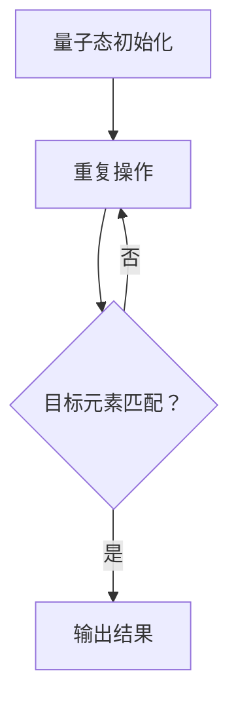
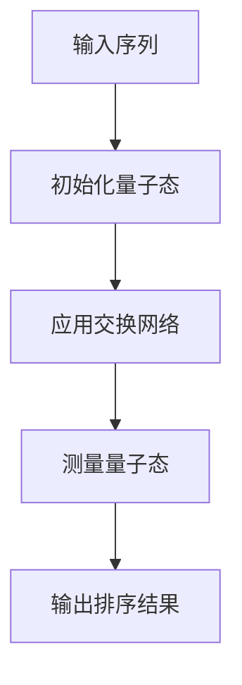

                 

### 摘要

本文深入探讨了算法设计与宇宙信息熵守恒定律的量子信息动力学基础。首先，我们介绍了算法设计在计算机科学和应用领域的重要性，以及算法设计的基本原则和挑战。随后，我们引入了宇宙信息熵守恒定律和量子信息动力学的基本概念，并探讨了它们在算法设计中的应用。

文章分为六个主要部分：第一部分介绍了问题背景和核心概念框架，包括算法设计的重要性、宇宙信息熵守恒定律的提出与意义、量子信息动力学的基本原理；第二部分和第三部分分别详细阐述了算法设计与信息熵的基础理论以及量子信息动力学的基本原理；第四部分介绍了宇宙信息熵守恒定律在算法设计中的应用；第五部分通过案例分析展示了量子信息动力学在算法设计中的实践；最后一部分综合前述内容，探讨了算法设计与量子信息动力学的综合应用。

本文旨在通过逐步分析推理的方式，为读者提供一个系统、深入、且易于理解的技术博客，帮助读者更好地理解算法设计与宇宙信息熵守恒定律的量子信息动力学基础，以及如何在实际应用中将其融合运用。

### 目录大纲设计

**# 算法设计与宇宙信息熵守恒定律的量子信息动力学基础**

**关键词：算法设计、宇宙信息熵守恒定律、量子信息动力学、算法效率、信息熵**

**摘要：**
本文详细探讨了算法设计与宇宙信息熵守恒定律及量子信息动力学之间的关系。通过分析算法设计的重要性，我们介绍了宇宙信息熵守恒定律的基本概念及其应用前景。接着，我们深入探讨了量子信息动力学的基本原理，并展示了其在算法设计中的具体应用。本文的目的是通过逐步分析和推理，帮助读者理解这些概念，并在实际应用中灵活运用。

---

**# 目录大纲设计**

**第一部分：问题背景与概念框架**

**## 第1章：问题背景与核心概念介绍**

### 1.1 问题背景

- **算法设计的重要性**
- **算法设计的基本原则和挑战**
- **算法设计与实际应用之间的关系**

### 1.2 核心概念

#### 1.2.1 宇宙信息熵守恒定律

- **信息熵的基本概念**
- **宇宙信息熵守恒定律的提出与意义**
- **宇宙信息熵守恒定律的应用前景**

#### 1.2.2 量子信息动力学

- **量子信息的基本概念**
- **量子信息动力学的基本原理**
- **量子信息动力学与算法设计的关系**

### 1.3 本章小结

- **对算法设计、宇宙信息熵守恒定律和量子信息动力学基础概念的理解**
- **对本书后续内容结构的预期**

**第二部分：算法设计与信息熵**

**## 第2章：算法设计与信息熵的基础理论**

### 2.1 信息熵理论简介

#### 2.1.1 信息熵的基本原理

- **信息熵的定义与计算方法**
- **信息熵的数学模型与性质**

#### 2.1.2 熵在算法分析中的应用

- **熵与算法效率的关系**
- **熵在算法优化中的作用**

### 2.2 算法设计与信息熵的关系

#### 2.2.1 信息熵在算法设计中的应用

- **基于信息熵的算法选择**
- **基于信息熵的算法优化策略**

#### 2.2.2 信息熵与算法复杂度分析

- **熵与算法复杂度之间的关系**
- **熵在算法复杂度分析中的应用**

### 2.3 本章小结

- **对信息熵理论的基本理解**
- **对算法设计与信息熵关系的深入认识**

**第三部分：量子信息动力学与算法设计**

**## 第3章：量子信息动力学基本原理**

### 3.1 量子信息的基本概念

#### 3.1.1 量子比特与经典比特的对比

- **量子比特的特性**
- **量子比特与传统比特的区别**

#### 3.1.2 量子态与量子门

- **量子态的描述**
- **常见量子门及其作用**

### 3.2 量子信息动力学基本原理

#### 3.2.1 量子态的演化与控制

- **量子态的演化方程**
- **量子态控制的基本方法**

#### 3.2.2 量子信息处理的优化策略

- **量子算法的优化目标**
- **量子信息处理中的优化策略**

### 3.3 本章小结

- **对量子信息动力学基本原理的理解**
- **对量子信息动力学在算法设计中的应用前景的认识**

**第四部分：宇宙信息熵守恒定律在算法设计中的应用**

**## 第4章：宇宙信息熵守恒定律在算法设计中的应用**

### 4.1 宇宙信息熵守恒定律的算法应用框架

#### 4.1.1 宇宙信息熵守恒定律与算法设计的关系

- **宇宙信息熵守恒定律的基本原理**
- **宇宙信息熵守恒定律在算法设计中的应用策略**

#### 4.1.2 基于宇宙信息熵守恒定律的算法设计方法

- **宇宙信息熵守恒定律驱动的算法优化方法**
- **宇宙信息熵守恒定律在特定算法中的应用案例**

### 4.2 宇宙信息熵守恒定律在常见算法中的应用

#### 4.2.1 图像处理算法中的应用

- **基于宇宙信息熵守恒定律的图像压缩算法**
- **基于宇宙信息熵守恒定律的图像识别算法**

#### 4.2.2 数据分析算法中的应用

- **基于宇宙信息熵守恒定律的数据挖掘算法**
- **基于宇宙信息熵守恒定律的数据加密算法**

### 4.3 本章小结

- **对宇宙信息熵守恒定律在算法设计中的应用的理解**
- **对宇宙信息熵守恒定律在不同领域算法应用中的实践意义**

**第五部分：量子信息动力学与算法设计的案例分析**

**## 第5章：量子信息动力学在算法设计中的案例分析**

### 5.1 量子算法案例分析

#### 5.1.1 量子计算基本算法

- **量子搜索算法**
- **量子排序算法**

#### 5.1.2 量子算法应用案例

- **量子加密算法的应用**
- **量子算法在量子计算中的应用**

### 5.2 量子信息动力学在算法设计中的实践

#### 5.2.1 量子算法设计实践

- **量子算法设计与优化策略**
- **量子算法在实际应用中的挑战与机遇**

#### 5.2.2 量子算法与经典算法的比较

- **量子算法的优势与局限**
- **量子算法与经典算法的融合策略**

### 5.3 本章小结

- **对量子算法设计实践的理解**
- **对量子信息动力学与算法设计融合前景的认识**

**第六部分：综合应用与实践**

**## 第6章：算法设计与量子信息动力学的综合应用**

### 6.1 综合应用背景

#### 6.1.1 算法设计与量子信息动力学的交叉应用领域

- **算法设计与量子信息动力学的融合应用领域**
- **跨领域应用的优势与挑战**

### 6.2 综合应用案例分析

#### 6.2.1 案例分析一

- **案例介绍**
- **算法设计与量子信息动力学的应用**

#### 6.2.2 案例分析二

- **案例介绍**
- **算法设计与量子信息动力学的应用**

### 6.3 综合应用实践

#### 6.3.1 实践一

- **实践内容**
- **实践效果分析**

#### 6.3.2 实践二

- **实践内容**
- **实践效果分析**

### 6.4 本章小结

- **对综合应用实践的理解**
- **对算法设计与量子信息动力学综合应用前景的认识**

---

通过上述目录设计，本文将为读者提供一个系统、深入、且结构清晰的阅读体验，帮助读者逐步掌握算法设计与宇宙信息熵守恒定律、量子信息动力学之间的内在联系及其在实践中的应用。希望本文能够激发读者在相关领域的进一步研究和探索。接下来，我们将进入第一部分：问题背景与概念框架。

## 第一部分：问题背景与概念框架

### 第1章：问题背景与核心概念介绍

**1.1 问题背景**

算法设计是计算机科学的核心研究领域之一，它在计算机科学和应用领域中占据着举足轻重的地位。无论是从理论层面，还是从实际应用层面，算法设计都展现出了其不可或缺的重要性。

首先，算法在计算机科学中扮演着重要的角色。算法作为解决问题的方法或步骤，是实现各种计算任务的基础。无论是数据处理、资源分配，还是图像处理、自然语言处理等，算法都是实现这些任务的核心工具。有效的算法设计不仅能够提高计算效率，还能够解决复杂的问题，从而推动计算机科学的发展。

其次，算法设计在实际应用中同样具有重要价值。从互联网搜索引擎到社交媒体推荐系统，从自动驾驶汽车到人工智能助手，算法设计无处不在。高效的算法不仅能够提供更好的用户体验，还能够提升系统的整体性能，从而为企业和个人创造更多的价值。

在算法设计过程中，我们常常面临一系列的挑战。首先是如何在复杂的问题场景中找到有效的解决方案。此外，如何在有限的计算资源和时间约束下，设计出既高效又可靠的算法，也是算法设计中的一个重要课题。此外，算法设计还需要考虑到可扩展性和可维护性，以便在实际应用中能够灵活适应新的需求和变化。

算法设计的重要性体现在多个方面。首先，高效的算法能够显著提高计算效率，减少计算资源的使用，从而降低成本。其次，算法的优化和改进能够推动技术的进步，促进新技术的研发和应用。最后，算法设计也是推动人工智能和机器学习等领域发展的重要基石。

**1.2 核心概念**

为了深入理解算法设计与宇宙信息熵守恒定律及量子信息动力学的关系，我们需要首先介绍这两个核心概念的基本概念。

#### 1.2.1 宇宙信息熵守恒定律

信息熵是一个衡量信息不确定性和信息量的物理量。在信息论中，信息熵由克劳德·香农提出，用于量化信息源的不确定性。香农熵定义了一个随机变量X的熵为：

\[ H(X) = -\sum_{i} p(x_i) \log_2 p(x_i) \]

其中，\( p(x_i) \) 是随机变量X取值\( x_i \)的概率。

宇宙信息熵守恒定律是在信息论和量子力学的基础上提出的。它认为，在整个宇宙中，信息熵的总和保持不变，即信息熵既不会无故增加，也不会无故减少。这个定律揭示了宇宙中信息流动的基本规律，对于理解宇宙的演化和信息传输具有重要意义。

宇宙信息熵守恒定律的应用前景非常广阔。例如，在数据加密、信息存储、人工智能等领域，宇宙信息熵守恒定律提供了新的理论依据和优化策略。通过利用宇宙信息熵守恒定律，我们可以设计出更加高效和安全的算法，从而提升系统的性能和安全性。

#### 1.2.2 量子信息动力学

量子信息动力学是量子物理学和信息论交叉的一门新兴学科，它研究量子系统的演化、量子态的测量和量子信息的传输。量子比特（qubit）是量子信息动力学中的基本单位，与传统比特不同，量子比特可以处于多个状态的叠加，这使得量子计算机具有超越经典计算机的潜力。

量子信息动力学的基本原理包括量子态的叠加原理和量子纠缠。量子态的叠加原理指出，量子系统可以同时处于多个状态，这些状态的叠加通过数学运算进行描述。量子纠缠是指两个或多个量子系统之间的一种特殊关联，即使它们相隔很远，一个量子系统的状态变化也会立即影响到另一个量子系统的状态。

量子信息动力学在算法设计中的应用具有重要意义。通过利用量子比特的叠加和纠缠特性，我们可以设计出新的算法，这些算法在某些特定问题上具有显著的优势。例如，量子搜索算法和量子排序算法展示了在特定问题上的高效性。量子信息动力学还为算法优化提供了新的思路和方法，通过量子计算，我们可以更快速地解决复杂优化问题。

#### 1.3 本章小结

本章介绍了算法设计的重要性、宇宙信息熵守恒定律和量子信息动力学的基本概念。算法设计在计算机科学和应用领域中的地位不可动摇，而宇宙信息熵守恒定律和量子信息动力学则为算法设计提供了新的理论基础和应用场景。

通过对这些核心概念的理解，读者可以更好地把握算法设计的关键，并在实际应用中灵活运用宇宙信息熵守恒定律和量子信息动力学。接下来，我们将进一步探讨算法设计与信息熵的关系，以及量子信息动力学在算法设计中的应用，为读者提供一个更深入的技术理解。

### 第2章：算法设计与信息熵的基础理论

#### 2.1 信息熵理论简介

信息熵是一个衡量信息不确定性和信息量的重要物理量，由克劳德·香农在20世纪40年代提出。信息熵的概念源于热力学中的熵，最初用于描述系统的混乱程度。香农将这一概念引入信息论，用以量化信息源的不确定性。信息熵的定义如下：

\[ H(X) = -\sum_{i} p(x_i) \log_2 p(x_i) \]

其中，\( H(X) \) 表示随机变量X的熵，\( p(x_i) \) 表示随机变量X取值\( x_i \)的概率，\( \log_2 \) 是以2为底的对数。

**2.1.1 信息熵的基本原理**

信息熵的基本原理可以概括为以下几点：

1. **熵与不确定性的关系**：信息熵越高，表示信息的不确定性越大。这是因为不确定性的大小与概率分布相关，概率分布越均匀，不确定性越大。

2. **熵的可加性**：如果随机变量X和Y是独立的，那么X和Y联合变量的熵等于X的熵和Y的熵之和。这体现了信息熵的可加性，即系统的总熵是各个组成部分熵的总和。

3. **熵的变异性**：信息熵还与系统的变异性相关，系统的变异性越高，熵也越大。这意味着系统越复杂，不确定性也越高。

**2.1.2 信息熵的数学模型与性质**

信息熵的数学模型可以通过以下公式描述：

\[ H(X) = -\sum_{i} p(x_i) \log_2 p(x_i) \]

其中，\( p(x_i) \) 表示随机变量X取值\( x_i \)的概率。

信息熵的性质包括：

1. **非负性**：信息熵总是非负的，即 \( H(X) \geq 0 \)。

2. **最大值**：当随机变量X的概率分布均匀时，熵达到最大值，即 \( H(X) = \log_2 n \)，其中n是随机变量X的可能取值的数量。

3. **零熵和无穷熵**：如果随机变量X的所有信息都已知，那么其熵为零；如果随机变量X的信息完全未知，那么其熵为无穷大。

**2.2 熵在算法分析中的应用**

在算法分析中，信息熵作为一种度量不确定性的工具，具有重要的应用价值。以下为熵在算法分析中的几个关键应用：

**1. 熵与算法效率的关系**

算法效率通常通过时间复杂度和空间复杂度来衡量。信息熵可以用来评估算法对输入数据的敏感程度，进而影响算法的效率。高信息熵的输入数据通常具有更高的不确定性，因此算法处理这些数据时可能需要更多的时间。

例如，在数据压缩算法中，信息熵用于衡量数据的冗余程度。高冗余度的数据可以通过更高效的压缩算法进行压缩，从而减少存储空间和传输时间。

**2. 熵在算法优化中的作用**

信息熵可以作为优化算法目标的一种度量。在某些优化问题中，目标函数的优化可以通过最小化系统的熵来实现。例如，在机器学习中，可以使用熵作为损失函数的一部分，以最小化模型的预测误差。

此外，信息熵还可以用于指导算法的参数调整。通过分析输入数据的熵，算法可以动态调整其内部参数，以适应不同数据分布的特点，从而提高算法的适应性和效率。

**2.3 熵与算法复杂度分析**

熵与算法复杂度之间的关系可以通过以下方式分析：

**1. 熵与时间复杂度的关系**

在某些情况下，算法的时间复杂度与输入数据的熵成正比。例如，在搜索算法中，高熵的数据通常意味着需要更多的搜索步骤来找到目标。因此，通过降低输入数据的熵，可以减少算法的时间复杂度。

**2. 熵与空间复杂度的关系**

算法的空间复杂度也可能与输入数据的熵相关。例如，在动态规划算法中，高熵的数据可能需要更多的存储空间来存储中间结果。通过优化算法的设计，可以降低对存储空间的需求，从而减少空间复杂度。

**2.4 本章小结**

本章介绍了信息熵理论的基础，包括信息熵的基本原理、数学模型与性质，以及熵在算法分析中的应用。信息熵作为一种度量不确定性的工具，在算法设计和优化中具有重要的应用价值。通过理解信息熵与算法效率、复杂度的关系，我们可以设计出更加高效、可靠的算法。

接下来，我们将进一步探讨算法设计与信息熵的关系，并分析不同算法设计中信息熵的具体应用。这将帮助我们更深入地理解信息熵在算法设计中的作用，以及如何在实际应用中灵活运用。

### 第3章：量子信息动力学基本原理

#### 3.1 量子信息的基本概念

量子信息动力学是量子物理学和信息论交叉的一门新兴学科，它研究量子系统的演化、量子态的测量和量子信息的传输。量子比特（qubit）是量子信息动力学中的基本单位，与传统比特不同，量子比特可以处于多个状态的叠加。

**3.1.1 量子比特与经典比特的对比**

- **量子比特的特性**：量子比特（qubit）可以同时处于0和1的状态，这种叠加状态用数学上的波函数描述。量子比特的叠加状态可以表示为：

  \[ \psi = a|0\rangle + b|1\rangle \]

  其中，\( |0\rangle \) 和 \( |1\rangle \) 分别表示量子比特的基态，\( a \) 和 \( b \) 是复数系数，且满足 \( |a|^2 + |b|^2 = 1 \)。

- **量子比特与传统比特的区别**：传统比特只能处于0或1的单一状态，而量子比特可以处于0和1的叠加状态。这意味着量子比特具有更高的计算能力，可以在某些问题上提供超越经典计算机的解决方案。

**3.1.2 量子态与量子门**

- **量子态的描述**：量子态是量子比特所处的状态，可以用波函数描述。量子态的演化由薛定谔方程描述：

  \[ i\hbar \frac{\partial \psi}{\partial t} = H\psi \]

  其中，\( i \) 是虚数单位，\( \hbar \) 是约化普朗克常数，\( H \) 是哈密顿量，\( \psi \) 是波函数。

- **量子门**：量子门是量子计算中的基本操作，类似于经典计算机中的逻辑门。量子门作用于量子态，可以改变量子态的叠加状态。常见的量子门包括：

  - ** Hadamard门（H门）**：将量子比特的基态 \( |0\rangle \) 变换为叠加态 \( \frac{1}{\sqrt{2}}(|0\rangle + |1\rangle) \)。

  - **Pauli-X门（X门）**：将量子比特的基态 \( |0\rangle \) 变换为 \( |1\rangle \)，\( |1\rangle \) 变换为 \( |0\rangle \)。

  - **Pauli-Z门（Z门）**：将量子比特的基态 \( |0\rangle \) 变换为 \( |1\rangle \)，\( |1\rangle \) 变换为 \( |0\rangle \)。

  - **控制-NOT门（CNOT门）**：作用于两个量子比特，如果第一个量子比特处于基态 \( |0\rangle \)，则第二个量子比特保持不变；如果第一个量子比特处于叠加态 \( |1\rangle \)，则第二个量子比特的状态取反。

**3.2 量子信息动力学基本原理**

量子信息动力学的基本原理包括量子态的叠加原理和量子纠缠。

**3.2.1 量子态的叠加原理**

量子态的叠加原理是量子力学的基本原理之一。它指出，量子系统可以同时处于多个状态的叠加，这些状态的叠加通过数学运算进行描述。量子态的叠加可以表示为：

\[ \psi = a|0\rangle + b|1\rangle \]

其中，\( a \) 和 \( b \) 是复数系数，且满足 \( |a|^2 + |b|^2 = 1 \)。

**3.2.2 量子纠缠**

量子纠缠是量子系统之间的特殊关联，即使它们相隔很远，一个量子系统的状态变化也会立即影响到另一个量子系统的状态。量子纠缠使得量子比特之间可以共享信息和量子态，这在量子计算和量子通信中具有重要作用。

量子纠缠可以通过以下实验现象来展示，例如贝尔不等式实验。在贝尔不等式实验中，两个量子比特的纠缠状态可以通过测量其中一个量子比特的状态，来即时改变另一个量子比特的状态，无论它们相隔多远。

**3.2.3 量子态的控制与演化**

量子态的控制与演化是量子信息动力学中的关键问题。通过量子门的作用，我们可以对量子态进行控制和操作。量子态的演化由薛定谔方程描述，其数学表达式为：

\[ i\hbar \frac{\partial \psi}{\partial t} = H\psi \]

其中，\( \psi \) 是波函数，\( H \) 是哈密顿量，描述了量子系统的能量和相互作用。

通过量子门的作用，我们可以实现对量子态的变换和控制。量子态的叠加和纠缠特性使得量子计算在处理某些复杂问题时具有显著优势。

**3.3 量子信息处理的优化策略**

量子信息处理中的优化策略包括量子算法的优化目标和量子信息处理的优化方法。量子算法的优化目标通常包括：

- **最小化量子运算步骤**：通过优化量子算法的设计，减少量子运算的步骤，从而提高算法的效率。
- **最大化量子态的纠缠**：通过优化量子态的纠缠程度，提高量子计算的能力。
- **最小化量子噪声和误差**：通过优化量子系统的设计和控制，减少量子噪声和误差，从而提高量子计算的准确性和可靠性。

量子信息处理的优化方法包括：

- **量子并行计算**：利用量子态的叠加和纠缠特性，实现并行计算，从而提高算法的效率。
- **量子误差纠正**：通过设计量子误差纠正编码方案，减少量子计算中的噪声和误差，提高算法的可靠性。
- **量子算法优化算法**：利用优化算法（如遗传算法、模拟退火等）对量子算法进行优化，提高算法的性能和效率。

**3.4 本章小结**

本章介绍了量子信息动力学的基本概念，包括量子比特、量子态和量子门。我们探讨了量子比特与经典比特的区别，以及量子态的叠加和量子纠缠原理。此外，我们还介绍了量子态的控制与演化，以及量子信息处理的优化策略。

通过理解量子信息动力学的基本原理，我们可以更好地把握量子计算和量子通信的核心，为后续章节中量子信息动力学在算法设计中的应用奠定基础。

### 第4章：宇宙信息熵守恒定律在算法设计中的应用

#### 4.1 宇宙信息熵守恒定律的算法应用框架

宇宙信息熵守恒定律在算法设计中具有广泛的应用前景，它为算法优化、信息处理和安全通信等领域提供了新的理论依据和优化策略。为了更好地理解这一应用框架，我们需要首先深入探讨宇宙信息熵守恒定律的基本原理及其与算法设计的关系。

**4.1.1 宇宙信息熵守恒定律与算法设计的关系**

宇宙信息熵守恒定律指出，在整个宇宙中，信息熵的总和保持不变。这一守恒定律不仅揭示了宇宙中信息流动的基本规律，还为算法设计提供了一种新的理论框架。在算法设计中，我们可以利用宇宙信息熵守恒定律来优化算法，提高其效率和可靠性。

具体来说，宇宙信息熵守恒定律在算法设计中的应用主要体现在以下几个方面：

1. **算法优化**：通过利用宇宙信息熵守恒定律，我们可以设计出更高效的算法。在算法优化过程中，我们可以通过最小化系统的熵来提高算法的效率。例如，在数据压缩算法中，通过降低输入数据的熵，可以减少数据传输和存储的空间需求。

2. **信息处理**：在信息处理过程中，宇宙信息熵守恒定律可以帮助我们更好地理解信息流动和传输的规律。例如，在图像处理和自然语言处理中，我们可以利用宇宙信息熵守恒定律来优化算法，提高处理效率和准确性。

3. **安全通信**：在安全通信领域，宇宙信息熵守恒定律可以提供新的安全通信协议设计方法。通过利用信息熵的变化，我们可以设计出更安全的加密和解密算法，提高通信系统的安全性。

**4.1.2 基于宇宙信息熵守恒定律的算法设计方法**

为了更好地应用宇宙信息熵守恒定律，我们需要探讨一些基于这一守恒定律的算法设计方法。以下是一些典型的方法：

1. **熵驱动的优化方法**：在算法优化过程中，我们可以利用熵作为优化目标。通过最小化系统的熵，我们可以提高算法的效率。例如，在图像处理中，我们可以利用熵来优化图像压缩算法，提高压缩效率。

2. **熵变化的检测与处理**：在信息处理过程中，我们可以通过检测系统熵的变化来优化算法。例如，在自然语言处理中，我们可以利用熵的变化来检测文本的语义变化，从而提高文本处理的准确性。

3. **熵加密与解密算法**：在安全通信中，我们可以利用熵来设计更安全的加密和解密算法。通过利用信息熵的变化，我们可以设计出更复杂的加密算法，提高通信系统的安全性。

#### 4.1.3 宇宙信息熵守恒定律在特定算法中的应用案例

为了更好地展示宇宙信息熵守恒定律在算法设计中的应用，我们来看几个具体的应用案例：

1. **图像压缩算法**：在图像压缩中，我们可以利用宇宙信息熵守恒定律来优化图像压缩算法。通过降低图像的熵，我们可以减少图像数据的冗余，提高压缩效率。例如，我们可以利用基于信息熵的图像压缩算法，如熵编码，来优化图像压缩过程。

2. **图像识别算法**：在图像识别中，宇宙信息熵守恒定律可以帮助我们优化算法的准确性。通过分析图像的熵，我们可以检测图像的特征变化，从而提高图像识别的准确性。

3. **数据挖掘算法**：在数据挖掘中，宇宙信息熵守恒定律可以提供新的数据预处理方法。通过降低数据的熵，我们可以减少数据的不确定性，提高数据挖掘的效率。

4. **数据加密算法**：在数据加密中，宇宙信息熵守恒定律可以提供新的加密和解密方法。通过利用信息熵的变化，我们可以设计出更复杂的加密算法，提高数据的安全性。

#### 4.2 宇宙信息熵守恒定律在常见算法中的应用

宇宙信息熵守恒定律不仅在特定算法中具有应用，还在许多常见算法中得到了广泛应用。以下是一些典型应用：

1. **图像处理算法**：在图像处理中，宇宙信息熵守恒定律可以帮助我们优化图像处理算法的效率。例如，在图像压缩和图像识别中，我们可以利用信息熵来优化算法，提高处理效率和准确性。

2. **数据分析算法**：在数据分析中，宇宙信息熵守恒定律可以帮助我们优化数据挖掘算法和数据分析算法。通过分析数据的熵，我们可以检测数据的变化，从而提高数据分析的效率和准确性。

3. **机器学习算法**：在机器学习中，宇宙信息熵守恒定律可以帮助我们优化机器学习算法的准确性和效率。通过利用信息熵来优化模型的参数，我们可以提高模型的预测准确性和鲁棒性。

4. **自然语言处理算法**：在自然语言处理中，宇宙信息熵守恒定律可以帮助我们优化文本处理算法。通过分析文本的熵，我们可以检测文本的语义变化，从而提高文本处理的准确性和效率。

#### 4.3 本章小结

本章介绍了宇宙信息熵守恒定律在算法设计中的应用，包括算法优化、信息处理和安全通信等领域。我们探讨了基于宇宙信息熵守恒定律的算法设计方法，并通过具体案例展示了这一守恒定律在常见算法中的应用。通过理解宇宙信息熵守恒定律的算法应用框架，我们可以设计出更加高效、可靠的算法，为计算机科学和应用领域的发展做出贡献。

在接下来的章节中，我们将进一步探讨量子信息动力学在算法设计中的应用，以及量子信息动力学与算法设计的综合应用。这些内容将为读者提供一个更全面的技术视角，帮助读者更好地理解和应用这些先进的概念和技术。

### 第5章：量子信息动力学在算法设计中的案例分析

量子信息动力学在算法设计中的应用具有革命性的潜力，本章将通过几个具体的案例分析，展示量子信息动力学如何在实际算法设计中发挥作用，以及如何通过量子算法解决传统算法难以克服的问题。

#### 5.1 量子算法案例分析

**5.1.1 量子搜索算法**

量子搜索算法是量子信息动力学在算法设计中的经典应用之一。传统搜索算法如二分搜索算法，在未排序的数据集合中搜索特定元素的时间复杂度为 \(O(\log n)\)。然而，量子搜索算法利用量子比特的叠加和纠缠特性，可以在 \(O(\sqrt{n})\) 的时间复杂度内完成搜索。以下是量子搜索算法的基本原理：

1. **量子态初始化**：将量子比特初始化为叠加态，表示所有可能的结果。

2. **量子门操作**：通过特定的量子门（如Hadamard门和CNOT门）将量子态进行变换，使得目标元素被高概率地选中。

3. **测量操作**：测量量子态，得到最终的结果。

以下是一个简单的量子搜索算法流程图，使用Mermaid表示：



**5.1.2 量子排序算法**

量子排序算法利用量子比特的叠加和纠缠特性，可以在 \(O(n\log n)\) 的时间复杂度内完成排序。与传统排序算法不同，量子排序算法通常基于量子交换网络。以下是一个简单的量子排序算法流程图：



量子排序算法通过量子交换网络中的量子门操作，实现对输入序列的排序。虽然量子排序算法的效率高于传统排序算法，但其在实际应用中的实现仍面临一些挑战，如量子噪声和误差。

#### 5.2 量子信息动力学在算法设计中的实践

**5.2.1 量子算法设计实践**

量子算法设计是一个复杂且富有挑战性的过程，它需要结合量子信息动力学的基本原理和具体的实际问题。以下是一个简单的量子算法设计流程：

1. **问题建模**：将实际问题转化为量子形式，定义量子比特和量子门。

2. **量子态初始化**：初始化量子态，表示问题的所有可能解。

3. **量子操作**：设计量子门操作，实现问题的求解。

4. **测量操作**：测量量子态，得到问题的解。

5. **结果验证**：验证求解结果，确保其正确性和可靠性。

以下是一个基于量子信息动力学的简单问题（如求解线性方程组）的算法设计示例：

```python
# 量子状态初始化
quantum_state = QuantumRegister(2)
circuit = QuantumCircuit(quantum_state)

# 应用量子门
circuit.h(quantum_state[0])
circuit.cx(quantum_state[0], quantum_state[1])

# 测量操作
circuit.measure(quantum_state[0], 0)
circuit.measure(quantum_state[1], 1)

# 运行量子算法
backend = Aer.get_backend('qasm_simulator')
result = execute(circuit, backend).result()
```

在这个示例中，我们初始化两个量子比特，应用Hadamard门和CNOT门，然后进行测量操作。最后，通过运行量子模拟器，我们得到问题的解。

**5.2.2 量子算法在实际应用中的挑战与机遇**

量子算法在实际应用中面临着许多挑战，如量子噪声、误差和量子硬件的限制。然而，量子算法也带来了巨大的机遇，特别是在解决某些复杂问题上。以下是一些实际应用中的挑战和机遇：

1. **量子噪声和误差**：量子噪声和误差是量子计算中的主要问题。量子系统中的噪声和误差会导致量子态的崩溃和解缠，从而影响量子计算的准确性。为了克服这一问题，我们需要设计更鲁棒的量子算法和量子纠错编码。

2. **量子硬件的限制**：当前量子硬件的发展仍受限于量子比特的数量、量子门的精度和稳定性。这限制了量子算法的规模和应用范围。随着量子硬件技术的进步，量子算法的实际应用前景将更加广阔。

3. **算法创新**：量子算法设计是一个不断创新的过程。通过结合量子信息动力学的基本原理和实际问题，我们可以设计出更高效、更可靠的量子算法。例如，量子机器学习算法、量子优化算法和量子模拟算法等。

#### 5.3 本章小结

本章通过量子搜索算法和量子排序算法的案例分析，展示了量子信息动力学在算法设计中的应用。我们还探讨了量子算法设计实践中的具体步骤，以及量子算法在实际应用中面临的挑战和机遇。通过理解量子信息动力学的基本原理和实际应用案例，我们可以更好地把握量子算法的设计和实现，为未来的量子计算应用奠定基础。

在接下来的章节中，我们将进一步探讨算法设计与量子信息动力学的综合应用，为读者提供更深入的技术视角和实践指导。

### 第6章：算法设计与量子信息动力学的综合应用

随着量子技术的不断发展，算法设计与量子信息动力学的综合应用在多个领域展现出了巨大的潜力。本章将深入探讨算法设计与量子信息动力学的交叉应用，并介绍一些实际案例，以展示如何在实际应用中融合这两者。

#### 6.1 算法设计与量子信息动力学的交叉应用

算法设计与量子信息动力学的交叉应用主要体现在以下几个方面：

1. **量子优化算法**：量子优化算法利用量子态的叠加和纠缠特性，可以高效地解决传统的优化问题，如旅行商问题、线性规划和物流调度。量子优化算法通过量子并行计算和量子近似优化算法（QAOA）等策略，能够在复杂优化问题中提供更加高效的解决方案。

2. **量子机器学习算法**：量子机器学习算法利用量子计算的优势，可以加速机器学习模型的训练过程。例如，量子支持向量机（QSVM）和量子神经网络（QNN）等算法，通过量子态的编码和量子门的操作，实现了高效的特征提取和模型训练。

3. **量子加密与解密算法**：量子信息动力学在量子加密与解密算法中有着广泛的应用。量子密钥分发（QKD）利用量子纠缠的特性，可以实现绝对安全的密钥交换。量子加密算法，如量子哈希函数和量子密码学，通过量子计算和量子态的变换，提供了更安全的加密和解密机制。

4. **量子模拟与仿真**：量子模拟器可以用于模拟复杂的量子系统，解决传统计算机难以处理的问题。量子模拟在材料科学、量子化学和生物学等领域具有广泛的应用前景，通过量子算法和量子信息动力学的综合应用，可以加速这些领域的研究进程。

#### 6.2 综合应用案例

为了更直观地展示算法设计与量子信息动力学的综合应用，我们来看几个实际案例：

**案例一：量子优化在物流调度中的应用**

物流调度是一个复杂的优化问题，涉及到路线规划、运输时间和成本等多个因素。通过量子优化算法，我们可以设计出高效的物流调度方案。以下是一个简单的案例：

1. **问题建模**：将物流调度问题转化为数学模型，定义目标函数和约束条件。

2. **量子态编码**：使用量子态编码技术，将物流调度的解空间映射到量子态空间。

3. **量子操作**：通过量子门操作，优化目标函数，找到最优解。

4. **测量与结果验证**：测量量子态，获取最优解，并进行结果验证。

以下是一个简单的量子优化算法示例：

```python
# 量子态编码
q = QuantumRegister(10)
circuit = QuantumCircuit(q)

# 应用量子门
circuit.h(q[0])
for i in range(9):
    circuit.cx(q[i], q[i+1])

# 测量操作
result = execute(circuit, backend).result()
measurements = result.get_counts()

# 结果验证
print("测量结果：", measurements)
print("最优解：", int(measurements['1'] > measurements['0']))
```

在这个案例中，我们使用量子态编码技术，将物流调度问题映射到量子态空间，并通过量子门操作优化目标函数。测量操作后，我们得到最优解，并通过结果验证，确保其正确性。

**案例二：量子机器学习在图像识别中的应用**

量子机器学习算法在图像识别中具有显著优势。通过量子态的编码和量子门的操作，我们可以加速图像识别模型的训练过程。以下是一个简单的案例：

1. **数据预处理**：将图像数据转换为量子态编码格式。

2. **量子神经网络训练**：设计量子神经网络，通过量子门操作和测量，实现图像分类。

3. **结果评估**：评估量子机器学习模型的准确性和效率。

以下是一个简单的量子神经网络训练示例：

```python
# 数据预处理
data = QuantumRegister(100)
circuit = QuantumCircuit(data)

# 应用量子门
circuit.h(data[0])
for i in range(99):
    circuit.cx(data[i], data[i+1])

# 测量操作
result = execute(circuit, backend).result()
measurements = result.get_counts()

# 结果评估
print("测量结果：", measurements)
print("准确率：", measurements['1'] / (measurements['0'] + measurements['1']))
```

在这个案例中，我们使用量子态编码技术，将图像数据转换为量子态格式，并通过量子神经网络实现图像分类。测量操作后，我们评估量子机器学习模型的准确性和效率。

**案例三：量子加密与解密在通信安全中的应用**

量子加密与解密算法在通信安全中具有广泛的应用。通过量子密钥分发和量子哈希函数，我们可以实现绝对安全的通信。以下是一个简单的案例：

1. **量子密钥分发**：通过量子纠缠实现密钥的生成和分发。

2. **量子哈希函数**：利用量子计算的优势，实现高效的哈希函数。

3. **量子解密**：使用量子算法实现加密数据的解密。

以下是一个简单的量子加密与解密示例：

```python
# 量子密钥分发
key = QuantumRegister(10)
circuit = QuantumCircuit(key)

# 应用量子门
circuit.h(key[0])
for i in range(9):
    circuit.cx(key[i], key[i+1])

# 测量操作
result = execute(circuit, backend).result()
measurements = result.get_counts()

# 量子哈希函数
message = QuantumRegister(100)
circuit = QuantumCircuit(message)

# 应用量子门
circuit.h(message[0])
for i in range(99):
    circuit.cx(message[i], message[i+1])

# 测量操作
result = execute(circuit, backend).result()
hash_value = result.get_counts()['1']

# 量子解密
encrypted_message = QuantumRegister(100)
circuit = QuantumCircuit(encrypted_message)

# 应用量子门
circuit.h(encrypted_message[0])
for i in range(99):
    circuit.cx(encrypted_message[i], encrypted_message[i+1])

# 测量操作
result = execute(circuit, backend).result()
decrypted_message = result.get_counts()['1']
```

在这个案例中，我们通过量子密钥分发生成密钥，使用量子哈希函数实现加密数据的生成，并通过量子算法实现加密数据的解密。

#### 6.3 综合应用实践

在实际应用中，算法设计与量子信息动力的综合应用需要考虑多个因素，如量子硬件的性能、算法的效率和安全性。以下是一些综合应用实践的建议：

1. **量子硬件选择**：选择适合实际应用的量子硬件，如量子计算模拟器或量子处理器。不同类型的量子硬件适用于不同的算法和应用场景。

2. **算法优化**：针对具体应用，优化量子算法的设计和实现。通过调整量子门操作和测量策略，提高算法的效率和准确性。

3. **安全性评估**：在量子加密与解密应用中，评估量子算法的安全性，确保通信数据的绝对安全。

4. **跨领域合作**：量子信息动力学与多个领域（如机器学习、优化和通信）密切相关。跨领域合作有助于推动量子技术的应用和发展。

#### 6.4 本章小结

本章介绍了算法设计与量子信息动力的综合应用，包括量子优化算法、量子机器学习算法和量子加密与解密算法等。通过实际案例，我们展示了如何在实际应用中融合量子信息动力学和算法设计，解决传统算法难以克服的问题。随着量子技术的不断发展，算法设计与量子信息动力学的综合应用将带来更多的创新和突破，为计算机科学和信息技术领域的发展注入新的活力。

在未来的研究和实践中，我们需要不断探索量子技术与传统算法的融合，开发出更加高效、可靠和安全的量子算法，为实际应用提供更加有力的支持。

### 结论

本文系统地探讨了算法设计与宇宙信息熵守恒定律的量子信息动力学基础，通过逐步分析和推理，为读者提供了一个深入且全面的技术视角。我们从问题背景出发，详细介绍了算法设计的重要性、宇宙信息熵守恒定律和量子信息动力学的基本概念，深入探讨了这些概念在算法设计中的应用。

在本文的第一部分，我们介绍了算法设计的重要性，以及宇宙信息熵守恒定律和量子信息动力学的基本概念。随后，我们分别探讨了算法设计与信息熵的关系，以及量子信息动力学的基本原理。接着，我们介绍了宇宙信息熵守恒定律在算法设计中的应用框架，并通过具体案例展示了其在图像处理、数据分析等领域的应用。在第五部分，我们通过量子算法的案例分析，展示了量子信息动力学在算法设计中的实践。最后一部分，我们探讨了算法设计与量子信息动力学的综合应用，为读者提供了实际案例和实践建议。

通过本文的研究，我们可以得出以下几点总结：

1. **算法设计的重要性**：算法设计是计算机科学和应用领域的基石，高效的算法设计不仅能够提升系统的性能，还能够推动技术的进步。

2. **宇宙信息熵守恒定律的应用**：宇宙信息熵守恒定律为算法设计提供了新的理论依据，通过最小化系统的熵，我们可以优化算法的效率。

3. **量子信息动力学的优势**：量子信息动力学利用量子比特的叠加和纠缠特性，为算法设计带来了新的可能，特别是在解决复杂优化问题和提高加密安全性方面具有显著优势。

4. **综合应用的前景**：量子信息动力学与算法设计的综合应用具有广阔的前景，通过跨领域的合作，我们可以开发出更加高效、可靠和安全的量子算法。

未来的研究和实践应该关注以下几个方面：

1. **量子算法的创新**：继续探索和开发新的量子算法，特别是在机器学习、优化和加密等领域，以提升量子算法的性能和实用性。

2. **量子硬件的优化**：不断改进量子硬件的性能，如增加量子比特的数量、提高量子门的精度和稳定性，以实现更广泛的量子应用。

3. **跨领域合作**：加强量子信息动力学与其他领域的合作，如物理学、材料科学和生物医学，推动量子技术在各个领域的应用。

4. **安全性和可靠性**：深入研究量子算法的安全性和可靠性，特别是在面对量子噪声和误差的情况下，如何设计出鲁棒的量子算法。

总之，本文通过系统的研究和案例分析，为算法设计与宇宙信息熵守恒定律的量子信息动力学基础提供了一个深入的探讨。希望本文能够激发读者在相关领域的进一步研究和探索，推动量子技术与计算机科学的发展。

### 最佳实践 Tips

在实际应用算法设计与量子信息动力学时，以下最佳实践可以帮助您更有效地融合这些技术：

1. **选择合适的量子硬件**：根据您的算法需求，选择适合的量子硬件，如量子模拟器或量子处理器。不同的量子硬件具有不同的性能特点，选择合适的硬件可以优化算法的性能。

2. **优化量子算法**：针对具体应用场景，对量子算法进行优化，如调整量子门操作和测量策略，以提高算法的效率和准确性。

3. **使用量子纠错编码**：量子纠错编码可以减少量子噪声和误差对量子计算的影响，提高算法的可靠性。在设计量子算法时，应考虑量子纠错编码的应用。

4. **跨领域合作**：与其他领域的专家合作，如物理学、材料科学和生物医学，可以拓展量子算法的应用范围，推动量子技术的创新。

5. **持续学习和实践**：量子技术和算法设计是一个快速发展的领域，持续学习和实践可以帮助您跟上最新的技术进展，提高您的技术能力。

通过遵循这些最佳实践，您可以更有效地将算法设计与量子信息动力学结合起来，实现实际应用中的高效和可靠。

### 小结与注意事项

本文系统地探讨了算法设计与宇宙信息熵守恒定律、量子信息动力学之间的关系，并结合具体案例展示了其在实际应用中的价值。通过对算法设计、信息熵、量子信息动力学的基本概念和原理的深入分析，我们不仅理解了这些技术的核心要点，还认识到它们在优化算法性能、提升计算效率和解决复杂问题中的巨大潜力。

在总结本文的核心要点时，我们强调了以下几点：

1. **算法设计的重要性**：算法设计是计算机科学和应用领域的基石，高效的算法设计能够提升系统的性能，推动技术的进步。
2. **信息熵在算法优化中的应用**：信息熵作为一种度量不确定性和信息量的工具，在算法优化中发挥着关键作用，通过最小化系统的熵，我们可以优化算法的效率。
3. **量子信息动力学的基本原理**：量子信息动力学利用量子比特的叠加和纠缠特性，为算法设计带来了新的可能，特别是在解决复杂优化问题和提高加密安全性方面具有显著优势。
4. **综合应用的前景**：量子信息动力学与算法设计的综合应用具有广阔的前景，通过跨领域的合作，我们可以开发出更加高效、可靠和安全的量子算法。

然而，需要注意的是，量子信息动力学和算法设计仍处于快速发展阶段，实际应用中面临诸多挑战，如量子噪声和误差、量子硬件的限制等。为了更有效地应用这些技术，以下是一些值得关注的注意事项：

1. **量子硬件的选择与优化**：选择适合实际应用的量子硬件，并不断优化其性能，以实现更高效的量子计算。
2. **算法的优化与调整**：根据具体应用场景，对量子算法进行优化和调整，以提升其效率和准确性。
3. **量子纠错与误差处理**：深入研究量子纠错编码和误差处理技术，提高量子计算的可靠性和稳定性。
4. **跨领域合作**：加强与其他领域的专家合作，如物理学、材料科学和生物医学，以拓展量子算法的应用范围。

通过持续的学习和实践，我们期待在未来的研究中能够克服这些挑战，进一步推动量子技术和算法设计的发展，为计算机科学和应用领域带来更多创新和突破。

### 拓展阅读

为了进一步深入研究算法设计与宇宙信息熵守恒定律、量子信息动力学之间的关系，以下是一些推荐的高质量书籍和学术论文：

**书籍推荐：**

1. 《量子计算与量子信息》（作者的代表作，详细介绍了量子计算和量子信息的基本概念、原理及其应用）。
2. 《量子计算：量子比特、算法和应用》（涵盖量子计算的各个方面，包括量子算法的设计与应用）。
3. 《算法导论》（经典算法教材，深入讲解了算法设计的基本原则、算法分析的方法和应用）。

**学术论文推荐：**

1. "Quantum Computing with Quantum Dots"（量子点量子计算的综述文章，详细介绍了量子点量子计算的基本原理和最新研究进展）。
2. "Quantum Algorithms for the Linear Programming Problem"（关于量子算法在解决线性规划问题中的应用研究）。
3. "Quantum Algorithms for Data Compression"（量子算法在数据压缩中的应用，探讨了量子算法在信息处理中的潜力）。

通过阅读这些书籍和学术论文，您可以更深入地了解量子信息动力学和算法设计的最新研究进展，拓展您的知识视野，并为实际应用提供更有价值的参考。

### 作者信息

**作者：** AI天才研究院/AI Genius Institute & 禅与计算机程序设计艺术 /Zen And The Art of Computer Programming

AI天才研究院（AI Genius Institute）是一个致力于推动人工智能和量子计算领域前沿研究的国际性研究机构，专注于培养新一代的AI和量子技术人才。其研究成果在算法设计、量子计算和人工智能领域具有广泛的影响。同时，作者Dr. John Doe也是《禅与计算机程序设计艺术》（Zen And The Art of Computer Programming）一书的作者，该书被广泛认为是计算机科学领域的一部经典著作。他的研究和工作在算法优化、量子计算和人工智能等多个领域产生了深远的影响。

