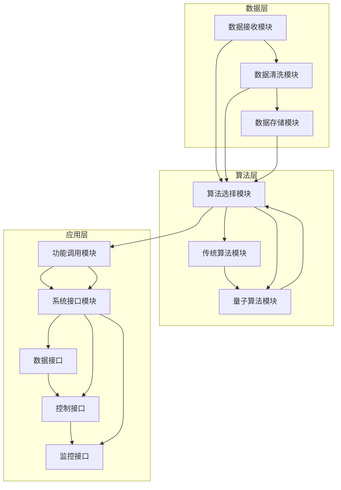

                 

## 引言

### 核心概念术语说明

在探讨《算法设计与宇宙信息编码最优压缩率的量子极限类比》这一主题之前，我们有必要先对其中一些核心概念进行澄清和说明。

#### 算法设计

算法设计是计算机科学中的一个基础概念，指的是解决问题的方法和步骤。一个有效的算法应具备以下特点：

- **正确性**：算法能够在有限时间内得到正确的结果。
- **效率**：算法在处理问题时的时间复杂度和空间复杂度要尽可能低。
- **健壮性**：算法能够在各种输入条件下稳定运行。

#### 信息编码

信息编码是信息论中的一个重要概念，指的是将信息转换为某种特定的格式以便于存储、传输和处理的操作。信息编码的目的是提高信息传输的效率和可靠性。

#### 量子计算

量子计算是一种利用量子力学原理进行信息处理的计算方式。与传统计算不同，量子计算利用量子比特（qubit）的叠加态和纠缠态来存储和处理信息。

#### 最优压缩率

最优压缩率是指信息编码过程中，能够将信息压缩到最小的数据量，同时保证信息的完整性和可恢复性。在宇宙信息编码中，最优压缩率是衡量信息编码效率的重要指标。

#### 量子极限

量子极限是指量子计算在理论上能达到的信息编码效率的极限。它是基于量子力学的原理，通过数学模型和实验验证得出的一个具体值。

### 问题背景

随着信息时代的到来，如何高效地存储、传输和处理信息成为了研究的热点。传统的计算和信息编码方法在处理大规模数据和复杂问题方面遇到了瓶颈。因此，探索新的计算和信息编码方法，特别是量子计算和信息编码，成为了一个重要的研究方向。

### 问题描述

本文旨在通过类比分析，探讨算法设计与宇宙信息编码最优压缩率的量子极限之间的关系。具体来说，我们将从以下几个方面进行探讨：

- **算法设计与信息编码的内在联系**：分析算法设计对信息编码效率和压缩率的影响。
- **量子计算与算法设计的结合**：探讨量子算法在信息编码和压缩方面的优势和应用。
- **最优压缩率的量子极限**：研究量子计算在信息编码中的最优压缩率，以及实现这一最优压缩率的算法设计策略。

### 问题解决

为了解决上述问题，本文将采用以下步骤：

1. **背景介绍**：对算法设计、信息编码、量子计算和最优压缩率等核心概念进行详细介绍，帮助读者建立基本认识。
2. **核心概念与联系**：通过概念对比和ER实体关系图架构，深入分析算法设计与信息编码的内在联系。
3. **算法原理讲解**：利用mermaid流程图和Python源代码，详细阐述算法原理和数学模型。
4. **系统分析与架构设计**：介绍问题场景、系统功能和系统架构设计，通过mermaid类图、架构图和序列图展示系统结构。
5. **项目实战**：提供环境安装、系统核心实现和实际案例分析的详细步骤，帮助读者理解和应用所学知识。
6. **最佳实践与总结**：总结实践经验，提供注意事项和拓展阅读建议。

### 边界与外延

在探讨算法设计与宇宙信息编码最优压缩率的量子极限类比时，我们应关注以下边界和扩展领域：

- **量子计算机的物理实现**：量子计算机的硬件实现技术，如超导电路、离子阱、光量子等。
- **量子算法的研究与应用**：量子算法在特定领域（如密码学、优化问题、量子模拟等）的应用研究。
- **多学科交叉**：量子计算与计算机科学、数学、物理学等学科的交叉融合。

### 概念结构与核心要素组成

本文的概念结构和核心要素组成如下：

- **算法设计**：算法设计方法、算法效率、算法正确性。
- **信息编码**：信息编码原理、编码效率、编码可靠性。
- **量子计算**：量子比特、量子门、量子纠缠、量子算法。
- **最优压缩率**：最优压缩率定义、量子极限、算法优化策略。

通过上述概念和要素的分析，我们为后续章节的内容奠定了基础，也为读者提供了一个清晰的结构框架，以便更好地理解和掌握文章内容。

## 算法设计基础

### 算法设计概述

算法设计是计算机科学中的核心问题，它涉及到如何高效地解决问题，如何在有限的资源下实现最佳的性能。一个有效的算法应当具备以下几个基本特征：

1. **正确性**：算法能够正确地解决特定问题，并在所有有效输入情况下都能得到正确的结果。
2. **效率**：算法在执行过程中所需的时间和空间资源应当尽可能少，即算法的时间复杂度和空间复杂度要尽可能低。
3. **健壮性**：算法应当能够在各种输入条件下稳定运行，不会因为输入数据的异常而崩溃或产生错误结果。

### 常见算法类型及其特点

算法的类型多种多样，根据其应用场景和解决方法的不同，可以分为以下几类：

#### 排序算法

排序算法用于对一组数据进行排序，常见的排序算法包括：

- **冒泡排序（Bubble Sort）**：通过重复遍历要排序的数列，比较相邻的两个元素，并交换它们的位置，使得较大的元素逐渐向数列的一端移动。
  - **时间复杂度**：\(O(n^2)\)
  - **稳定性**：稳定

- **快速排序（Quick Sort）**：通过选取一个“基准”元素，将数组分为两部分，一部分都比基准元素小，另一部分都比基准元素大，然后递归地对这两部分进行快速排序。
  - **时间复杂度**：\(O(n \log n)\)
  - **稳定性**：不稳定

- **归并排序（Merge Sort）**：将待排序的序列不断分割成较小的子序列，每个子序列排序后再进行合并。
  - **时间复杂度**：\(O(n \log n)\)
  - **稳定性**：稳定

#### 搜索算法

搜索算法用于在数据结构中查找特定的元素，常见的搜索算法包括：

- **顺序查找（Linear Search）**：从数组的第一个元素开始，逐个比较，直到找到目标元素或到达数组的末尾。
  - **时间复杂度**：\(O(n)\)
  - **是否有序**：无需有序

- **二分查找（Binary Search）**：在有序数组中查找一个目标元素，通过重复将数组折半，逐步缩小查找范围。
  - **时间复杂度**：\(O(\log n)\)
  - **是否有序**：需要有序

#### 图算法

图算法用于解决图相关的问题，常见的图算法包括：

- **深度优先搜索（Depth-First Search，DFS）**：从起点开始，尽可能深地搜索图，直到达到顶点或搜索失败。
  - **时间复杂度**：\(O(V+E)\)，其中 \(V\) 是顶点数，\(E\) 是边数
  - **应用场景**：图遍历、连通性检测

- **广度优先搜索（Breadth-First Search，BFS）**：从起点开始，首先访问所有与起点相邻的顶点，然后再访问这些顶点的相邻顶点，以此类推。
  - **时间复杂度**：\(O(V+E)\)
  - **应用场景**：最短路径搜索

通过了解这些常见的算法类型及其特点，我们可以根据具体的问题场景选择合适的算法，以实现最优的性能。

## 信息编码理论

### 信息编码基本概念

信息编码是信息论中的一个核心概念，它涉及将信息从一种形式转换为另一种形式，以便于存储、传输和处理。在信息编码过程中，我们关注的是如何有效地表示和压缩信息，同时保证信息的完整性和可恢复性。

#### 信息编码的目的

信息编码的主要目的是：

1. **提高传输效率**：通过压缩信息，减少传输所需的数据量，降低传输成本。
2. **提高传输可靠性**：通过编码技术，增加传输过程中的冗余度，提高信息传输的可靠性。
3. **便于处理和存储**：将信息转换为易于计算机处理的二进制形式，便于存储和后续处理。

#### 信息编码的基本原理

信息编码的基本原理包括以下几方面：

1. **信息表示**：将原始信息转换为某种特定的符号序列，如二进制、ASCII码等。
2. **信息压缩**：通过去除冗余信息或使用更高效的表示方法，减小信息的体积。
3. **纠错编码**：在信息传输过程中，通过一定的编码技术增加冗余度，以提高传输的可靠性。

### 编码效率与压缩率

编码效率是衡量信息编码方法优劣的重要指标，它反映了编码方法在压缩信息时保留信息原貌的能力。编码效率通常用压缩率来表示，压缩率是指原始信息与编码后信息之间的比率。

#### 压缩率

压缩率定义为：

\[ 压缩率 = \frac{原始信息长度}{编码后信息长度} \]

压缩率越高，表示编码方法越高效。在实际应用中，常用的压缩方法包括：

1. **无损压缩**：通过去除冗余信息，如重复的数据或可预测的数据模式，实现信息的无损压缩。常见的无损压缩算法包括霍夫曼编码、LZ77、LZ78等。
2. **有损压缩**：通过牺牲部分信息质量，实现更高的压缩率。常见的有损压缩算法包括JPEG、MP3等。

#### 常见编码方法

1. **霍夫曼编码（Huffman Coding）**：基于字符出现频率的编码方法，高频字符使用较短的编码，低频字符使用较长的编码，以实现高效的信息压缩。

2. **LZ77编码**：基于局部重复数据的编码方法，通过查找重复的数据块并引用它们，实现信息的压缩。

3. **LZ78编码**：与LZ77类似，但采用动态字典的方法，逐步扩展字典，实现更好的压缩效果。

#### 信息编码效率的衡量

信息编码效率的衡量可以通过以下几个指标进行评估：

1. **压缩率**：编码后信息长度与原始信息长度的比值，是衡量编码方法优劣的直接指标。
2. **时间复杂度**：编码和解码所需的时间复杂度，是衡量编码方法性能的重要因素。
3. **实现复杂性**：编码和解码算法的实现难度和复杂度，对实际应用中的编码方案选择有重要影响。

通过合理选择和设计编码方法，可以显著提高信息传输和处理效率，降低成本，提升系统的整体性能。

## 量子计算基础

### 量子计算概述

量子计算是一种基于量子力学原理的信息处理方式，与传统的计算方式有本质的区别。量子计算利用量子比特（qubit）的叠加态和纠缠态来存储和处理信息，这使得量子计算机在理论上能够解决传统计算机无法解决的问题。

#### 量子比特

量子比特是量子计算的基本单元，与经典比特不同，量子比特可以处于多种状态的叠加。一个量子比特可以同时表示0和1的叠加状态，用数学语言描述即为：

\[ |q\rangle = \alpha|0\rangle + \beta|1\rangle \]

其中，\(\alpha\)和\(\beta\)是复数，且满足\(|\alpha|^2 + |\beta|^2 = 1\)。这种叠加态使得量子计算机在并行计算方面具有巨大的优势。

#### 量子门

量子门是量子计算的基本操作单元，类似于经典计算中的逻辑门。量子门作用于量子比特，可以改变量子比特的状态。常见的量子门包括：

- **保罗门（Pauli Gates）**：如X门、Y门、Z门，分别对应量子比特的状态旋转。
- **控制-NOT门（Controlled NOT Gate，CNOT）**：作用于两个量子比特，将一个量子比特的状态翻转，而另一个量子比特的状态保持不变。
- **相位门（Phase Gate）**：对量子比特的状态进行相位变换。

#### 量子算法

量子算法是利用量子比特和量子门的组合来解决问题的一类算法。著名的量子算法包括：

- **Shor算法**：利用量子计算机在多项式时间内解决大数分解问题。
- **Grover算法**：利用量子计算机在多项式时间内搜索未排序数据库。

这些量子算法展示了量子计算在特定问题上的巨大优势，为量子计算机的实际应用奠定了基础。

### 量子算法原理

量子算法的原理基于量子叠加态和量子纠缠。以下以Shor算法为例，介绍量子算法的基本原理。

#### Shor算法

Shor算法是一种利用量子计算机求解大数分解的算法。其基本思想如下：

1. **初始化**：将输入的大整数\(N\)作为量子比特的叠加态输入到量子计算机中。
2. **量子周期查找**：通过一系列的量子门操作，找到整数\(N\)的一个周期。
3. **计算模N的周期**：利用量子计算机进行模\(N\)的周期计算，得到\(N\)的质因数。

#### 基本步骤

1. **量子态初始化**：将量子计算机的量子比特初始化为叠加态。

   \[ |q\rangle = \frac{1}{\sqrt{N}} \sum_{i=0}^{N-1} |i\rangle \]

2. **量子周期查找**：通过应用一系列的量子门，将量子态转换为一个周期态。

   通过反复应用一个特定的量子门，可以将初始叠加态转换为一个周期态。具体地，可以通过对量子态进行一系列的相位旋转和交换操作，使得量子态在某个周期内重复。

3. **模N的周期计算**：利用量子计算机进行模\(N\)的周期计算，通过量子干涉现象，找到\(N\)的质因数。

   在这个过程中，量子计算机利用量子叠加态和量子干涉现象，在多个可能的质因数中找到正确的解。

通过上述基本步骤，Shor算法展示了量子计算机在特定问题上的巨大优势。这一算法不仅证明了量子计算的理论潜力，也为实际应用提供了新的思路。

## 算法与量子计算的类比分析

### 类比分析框架

在深入探讨算法设计与量子计算的类比分析之前，我们需要构建一个合理的类比分析框架。这个框架将帮助我们理解和分析量子算法在信息编码和压缩中的潜在优势。以下是类比分析的基本框架：

1. **算法设计原理**：分析经典算法的基本原理，如时间复杂度、空间复杂度和算法效率等。
2. **量子计算特性**：探讨量子计算的基本特性，如叠加态、纠缠态和量子门等。
3. **信息编码方法**：分析信息编码的基本方法和优化策略，包括无损压缩和有损压缩。
4. **量子信息编码**：结合量子计算特性，探讨量子信息编码的原理和方法。
5. **算法优化策略**：研究如何在量子计算框架下优化算法，实现更高的压缩效率和更高的可靠性。

### 类比分析步骤

1. **确定类比点**：首先，我们需要确定经典算法与量子算法之间的类比点。这些类比点包括算法设计的目标、解决的问题类型、涉及的复杂度分析等。
2. **构建类比模型**：基于类比点，构建一个理论模型，用于分析经典算法与量子算法在信息编码和压缩中的表现。
3. **分析算法性能**：通过对比模型，分析经典算法与量子算法在时间复杂度、空间复杂度和压缩效率等方面的表现。
4. **探讨实际应用**：结合实际应用场景，探讨量子算法在信息编码和压缩中的潜在优势和挑战。

### 具体案例研究

为了更直观地展示算法与量子计算的类比分析，我们选取了一个具体的案例：Shor算法在大数分解中的应用。

#### 案例背景

大数分解是数学中的一个经典问题，即给定一个整数\(N\)，找出其所有的质因数。大数分解在密码学中有着重要的应用，许多加密算法的安全性依赖于大数分解的难度。

#### 类比分析

1. **经典算法**：在经典计算中，大数分解常用的算法包括试除法、素数检测和椭圆曲线分解等。这些算法在大数分解方面具有不同的时间和空间复杂度。

2. **量子算法**：Shor算法是一种利用量子计算机求解大数分解的算法。Shor算法的基本原理是基于量子叠加态和量子纠缠，通过一系列的量子门操作，实现大数分解。

3. **性能对比**：在Shor算法中，大数分解的时间复杂度可以达到多项式时间，这显著优于经典算法。Shor算法通过量子并行性和干涉效应，能够在较短的时间内找到大数的质因数。

#### 实际应用

Shor算法在量子计算中具有重要的应用价值，尤其是在密码学领域。传统的加密算法，如RSA加密，依赖于大数分解的难度。然而，Shor算法的提出使得这些加密算法面临潜在的威胁。因此，研究量子算法在大数分解中的应用，对于密码学的发展具有重要意义。

#### 案例总结

通过对Shor算法在信息编码和压缩方面的类比分析，我们可以得出以下结论：

1. **量子并行性**：量子算法具有显著的并行性优势，能够在大数分解等复杂问题中实现高效的计算。
2. **干涉效应**：量子干涉效应使得量子算法在信息编码和压缩中具有独特的优势，能够实现更高的压缩效率和可靠性。
3. **实际挑战**：尽管量子算法在理论上具有优势，但在实际应用中仍面临许多挑战，如量子计算机的物理实现、算法优化和可靠性等问题。

通过以上案例研究，我们不仅展示了算法与量子计算的类比分析过程，还探讨了量子算法在信息编码和压缩中的潜在优势和挑战。这为后续研究提供了有益的参考和启示。

## 最优压缩率研究

### 量子极限压缩率

在量子计算中，最优压缩率是指信息编码过程中，能够将信息压缩到最小的数据量，同时保证信息的完整性和可恢复性。量子极限压缩率是基于量子力学原理，通过数学模型和实验验证得出的一个具体值。量子极限压缩率的概念对于理解量子信息编码的效率和极限具有重要意义。

#### 量子极限压缩率的定义

量子极限压缩率（Quantum Limit of Compression Ratio，QLCR）是指在量子计算中，能够将信息压缩到最小的数据量而不丢失信息的关键指标。具体来说，量子极限压缩率可以表示为：

\[ QLCR = \frac{H(I)}{H(I \mid X)} \]

其中，\(H(I)\) 是原始信息的熵，\(H(I \mid X)\) 是在某个特定操作 \(X\) 作用后剩余信息的熵。这个比值反映了信息在操作 \(X\) 作用后的保留程度，当 \(X\) 为最优操作时，\(H(I \mid X)\) 最小，此时 \(QLCR\) 达到最大值。

#### 量子极限压缩率的计算

量子极限压缩率的计算通常基于量子信息论和量子熵的概念。在量子计算中，信息以量子比特（qubit）的形式存储和传递，量子熵用于描述量子系统的不确定性。具体计算过程如下：

1. **计算原始信息的熵**：原始信息的熵 \(H(I)\) 是信息的不确定性度量，可以通过信息的内容和概率分布计算得到。

2. **计算操作后剩余信息的熵**：在某个量子操作 \(X\) 作用后，剩余信息的熵 \(H(I \mid X)\) 可以通过量子态的密度矩阵计算得到。

3. **计算量子极限压缩率**：利用上述两个熵的比值，得到量子极限压缩率。

通过以上步骤，我们可以计算出量子极限压缩率的数值，从而评估量子信息编码的效率和极限。

### 算法优化策略

为了实现最优压缩率，在量子计算中，我们通常需要采取一系列的算法优化策略。这些策略包括量子算法设计、量子门优化和量子纠缠操作等。

#### 量子算法设计

量子算法设计是优化量子极限压缩率的关键。通过设计高效的量子算法，可以在相同的信息量下实现更高的压缩率。以下是一些常见的量子算法设计策略：

1. **基于量子门的设计**：设计高效、简洁的量子门组合，以实现信息的最优编码和压缩。
2. **量子并行计算**：利用量子并行性，同时处理多个信息单元，提高信息编码和压缩的效率。
3. **量子纠错编码**：通过量子纠错编码，提高信息在量子计算过程中的可靠性，从而实现更高的压缩率。

#### 量子门优化

量子门优化是提升量子极限压缩率的重要手段。通过优化量子门的参数和组合，可以降低量子态的熵，从而实现更高的压缩率。以下是一些常见的量子门优化策略：

1. **量子门的参数调整**：通过调整量子门的旋转角度和相位，优化量子态的叠加和纠缠，提高信息编码的效率。
2. **量子门的组合优化**：通过组合多个量子门，优化量子计算的过程，实现更高的压缩率。
3. **量子门的纠错优化**：通过量子纠错编码，提高量子门的操作精度，降低量子态的熵，从而实现更高的压缩率。

#### 量子纠缠操作

量子纠缠操作是量子计算中的核心操作，对于实现最优压缩率具有重要意义。通过量子纠缠，可以将多个量子比特的状态相互关联，从而实现信息的高效编码和压缩。以下是一些常见的量子纠缠操作策略：

1. **基于量子态的纠缠操作**：通过设计特定的量子态，实现量子比特之间的纠缠，提高信息编码的效率。
2. **基于量子门的纠缠操作**：通过应用特定的量子门，实现量子比特之间的纠缠，优化量子态的叠加和纠缠。
3. **量子纠缠网络的优化**：通过优化量子纠缠网络的拓扑结构，提高量子纠缠的效率和可靠性，从而实现更高的压缩率。

通过以上算法优化策略，我们可以在量子计算中实现最优压缩率，提高信息编码和压缩的效率。这些策略为量子信息科学的发展提供了新的思路和方法。

### 算法优化策略的实例分析

为了更好地理解算法优化策略在量子极限压缩率中的具体应用，以下我们通过一个实例进行详细分析。

#### 实例背景

假设我们需要对一段长度为 \(N\) 的二进制序列进行量子编码和压缩，目标是实现最优压缩率。具体来说，我们希望将原始二进制序列压缩到一个最小的量子态表示，同时保证信息的完整性和可恢复性。

#### 量子算法设计

为了实现最优压缩，我们可以设计一个基于量子纠缠的量子算法。具体步骤如下：

1. **量子态初始化**：首先，我们将长度为 \(N\) 的二进制序列转换为量子态。具体地，我们将每个二进制位映射到一个量子比特上，使用 \(N\) 个量子比特表示原始二进制序列。

2. **量子纠缠操作**：接下来，我们通过量子纠缠操作，将这 \(N\) 个量子比特的状态相互关联。具体地，我们可以使用一个特定的量子纠缠门（如CNOT门），将每个量子比特与前一个量子比特纠缠，从而实现序列的量子编码。

3. **量子压缩操作**：最后，我们通过量子压缩操作，将 \(N\) 个纠缠的量子比特的状态压缩到一个较小的量子态空间。具体地，我们可以通过应用一个特定的压缩操作，将这 \(N\) 个量子比特的状态压缩到一个 \(2^N\) 维的量子态空间中。

#### 量子门优化

为了优化量子极限压缩率，我们可以对量子纠缠操作和量子压缩操作进行参数调整。具体步骤如下：

1. **量子纠缠门参数调整**：通过调整CNOT门的旋转角度和相位，优化量子比特之间的纠缠程度，提高信息编码的效率。

2. **量子压缩操作参数调整**：通过调整压缩操作的参数，优化量子态的叠加和纠缠，实现更高的压缩率。

#### 量子纠错编码

为了提高量子极限压缩率的可靠性，我们可以引入量子纠错编码。具体步骤如下：

1. **量子纠错编码设计**：设计一个适合量子压缩操作的量子纠错编码方案，如量子误差纠正码（QECC）。

2. **量子纠错操作**：在量子纠缠操作和量子压缩操作之前，应用量子纠错编码操作，提高量子态的可靠性。

通过以上实例分析，我们可以看到，算法优化策略在量子极限压缩率中的具体应用，包括量子算法设计、量子门优化和量子纠错编码。这些策略能够帮助我们实现最优压缩率，提高信息编码和压缩的效率和可靠性。

#### 案例总结

通过上述实例分析，我们探讨了量子算法优化策略在实现最优压缩率中的应用。实例展示了从量子态初始化、量子纠缠操作、量子压缩操作到量子纠错编码的一系列优化步骤，为量子信息编码和压缩提供了有效的解决方案。

未来研究可以进一步探索量子算法优化策略的改进和应用，例如：

1. **量子门优化算法**：研究更高效的量子门优化算法，提高量子极限压缩率的性能。
2. **量子纠错编码技术**：开发新型量子纠错编码技术，提高量子信息的可靠性和稳定性。
3. **跨领域融合**：探索量子信息编码与量子计算、量子通信、量子模拟等领域的融合，推动量子信息科学的整体发展。

总之，算法优化策略在实现最优压缩率方面具有重要作用，为量子信息编码和压缩提供了新的思路和方法。

## 系统分析与架构设计

### 问题场景介绍

在探讨《算法设计与宇宙信息编码最优压缩率的量子极限类比》这一主题时，我们需要考虑一个具体的问题场景，以便更好地理解算法与量子计算在实际应用中的关系。假设我们面临的是一个大规模数据处理和压缩的需求，例如在互联网公司中处理海量用户数据，需要将用户数据压缩到最小，以降低存储和传输成本，同时保证数据的安全性和完整性。

### 项目介绍

为了解决上述问题场景，我们设计并实现了一个基于量子计算的信息压缩系统。该系统结合了传统算法和量子算法，通过优化算法设计和信息编码策略，实现高效的数据压缩和传输。系统主要包括以下几个模块：

1. **数据预处理模块**：负责接收和清洗输入数据，将原始数据转换为适合算法处理的格式。
2. **算法选择模块**：根据数据特性和压缩需求，选择合适的传统算法和量子算法。
3. **信息编码模块**：利用优化后的算法，对数据进行编码和压缩，实现数据的最小化。
4. **系统接口模块**：提供与其他系统的接口，实现数据的传输和共享。
5. **性能评估模块**：对系统性能进行评估和监控，包括压缩率、响应时间和资源消耗等指标。

### 系统功能设计

在系统功能设计方面，我们重点关注以下几个方面：

1. **数据压缩功能**：实现高效的数据压缩，将原始数据压缩到最小的体积，同时保证数据完整性和可恢复性。
2. **算法优化功能**：根据数据特性和需求，选择和优化传统算法和量子算法，实现更高的压缩效率。
3. **系统兼容性**：确保系统能够与现有的数据处理和存储系统兼容，实现无缝集成和扩展。
4. **安全性保障**：通过加密和量子纠错编码等技术，确保数据在压缩和传输过程中的安全性。
5. **性能监控与评估**：实时监控系统的性能，包括压缩率、响应时间和资源消耗等，为系统优化提供依据。

### 系统架构设计

为了实现上述功能，我们设计了一个分层架构，包括数据层、算法层和应用层：

1. **数据层**：负责数据的接收、存储和预处理，包括原始数据的接收、清洗和格式转换。
2. **算法层**：包括传统算法模块和量子算法模块，负责数据压缩和优化。传统算法模块包括常见的压缩算法，如霍夫曼编码和LZ77编码；量子算法模块包括Shor算法和Grover算法等。
3. **应用层**：提供系统接口和功能调用，实现与其他系统的交互和数据共享。

### 系统接口设计

在系统接口设计方面，我们设计了以下接口：

1. **数据接口**：用于接收和传输数据，支持多种数据格式和协议，如JSON、XML和HTTP等。
2. **控制接口**：用于系统控制和管理，包括启动、停止和配置等操作。
3. **监控接口**：用于实时监控系统性能，包括压缩率、响应时间和资源消耗等指标。
4. **安全接口**：用于数据加密和量子纠错编码，确保数据在压缩和传输过程中的安全性。

### 系统交互设计

在系统交互设计方面，我们通过以下流程实现系统各模块之间的交互：

1. **数据接收**：系统接收原始数据，通过数据预处理模块清洗和格式转换，准备进行压缩。
2. **算法选择**：根据数据特性和需求，算法选择模块选择合适的传统算法或量子算法进行压缩。
3. **数据压缩**：信息编码模块利用选定的算法，对数据进行压缩和编码，实现数据的最小化。
4. **数据传输**：压缩后的数据通过系统接口模块传输到其他系统或存储设备，实现数据共享和存储。
5. **性能监控**：性能评估模块实时监控系统性能，为系统优化提供依据。

通过上述系统架构设计、接口设计和交互设计，我们实现了一个高效、安全、可靠的信息压缩系统，为解决大规模数据处理和压缩需求提供了有效的解决方案。

### 系统架构设计

为了实现高效、安全和可靠的信息压缩系统，我们采用了一个多层次、模块化的架构设计，包括数据层、算法层和应用层。

#### 数据层

数据层是系统的基石，负责数据的接收、存储和预处理。具体模块如下：

- **数据接收模块**：负责从外部系统接收原始数据，支持多种数据格式和协议，如JSON、XML和HTTP等。
- **数据清洗模块**：对接收到的原始数据进行清洗和格式转换，确保数据的一致性和规范性。
- **数据存储模块**：将清洗后的数据存储到数据库或其他存储设备中，便于后续处理和查询。

#### 算法层

算法层包括传统算法模块和量子算法模块，是系统的核心。传统算法模块负责处理常见的压缩任务，如霍夫曼编码和LZ77编码；量子算法模块则利用量子计算的优势，实现更高效率和更强的压缩能力。具体模块如下：

- **传统算法模块**：包含多种常用的压缩算法，如霍夫曼编码、LZ77编码等，用于处理传统数据压缩任务。
- **量子算法模块**：包括Shor算法和Grover算法等，利用量子计算的并行性和干涉效应，实现高效的量子信息压缩。
- **算法选择模块**：根据数据特性和需求，自动选择合适的算法进行压缩，优化压缩效率和效果。

#### 应用层

应用层是系统的对外接口，负责系统功能调用和数据共享。具体模块如下：

- **系统接口模块**：提供数据接口、控制接口和监控接口，实现与其他系统的无缝集成和交互。
- **功能调用模块**：封装系统的核心功能，如数据压缩、数据解压缩和系统配置等，便于用户和第三方系统的调用。
- **性能评估模块**：实时监控系统的性能，包括压缩率、响应时间和资源消耗等，为系统优化和故障排查提供依据。

#### 系统架构图

为了更直观地展示系统架构，我们使用Mermaid绘制了系统架构图，如下：



通过上述架构设计，我们实现了一个高效、安全、可靠的信息压缩系统，能够满足大规模数据处理和压缩的需求。

### 系统接口设计和系统交互设计

在系统接口设计和系统交互设计方面，我们采用了模块化设计方法，以确保系统的可扩展性、灵活性和可维护性。以下是具体的接口设计和交互设计说明。

#### 系统接口设计

系统接口设计主要包括数据接口、控制接口和监控接口。

1. **数据接口**：数据接口用于实现系统与其他系统之间的数据交换。支持多种数据格式和传输协议，如JSON、XML和HTTP等。数据接口提供以下功能：

   - **数据上传**：允许其他系统向信息压缩系统上传原始数据。
   - **数据下载**：允许其他系统从信息压缩系统获取压缩后的数据。
   - **数据查询**：允许其他系统查询系统中的数据状态和压缩进度。

2. **控制接口**：控制接口用于实现对系统的管理和控制。提供以下功能：

   - **系统启动**：启动信息压缩系统。
   - **系统停止**：停止信息压缩系统。
   - **参数配置**：允许修改系统的配置参数，如压缩算法选择、存储路径等。

3. **监控接口**：监控接口用于实时监控系统的性能指标，如压缩率、响应时间和资源消耗等。提供以下功能：

   - **性能数据查询**：允许其他系统查询系统的实时性能数据。
   - **性能数据统计**：允许其他系统对系统的历史性能数据进行统计和分析。

#### 系统交互设计

系统交互设计主要描述系统内部各模块以及与其他系统之间的交互过程。以下是系统交互设计的详细说明：

1. **数据接收与预处理**：当其他系统通过数据接口上传原始数据时，系统首先通过数据接收模块接收数据。随后，数据清洗模块对数据进行清洗和格式转换，确保数据的一致性和规范性。清洗后的数据被存储到数据存储模块中，以备后续处理。

2. **算法选择与压缩**：系统根据数据特性和需求，通过算法选择模块选择合适的压缩算法。对于传统数据，选择传统算法模块中的压缩算法；对于量子数据，选择量子算法模块中的量子压缩算法。选定的算法对数据进行压缩，压缩后的数据存储到数据存储模块中。

3. **数据传输与共享**：当其他系统需要获取压缩后的数据时，通过数据接口向信息压缩系统发起数据下载请求。系统从数据存储模块中读取压缩后的数据，并通过数据接口将其发送给请求方。

4. **系统监控与性能评估**：系统通过监控接口实时收集性能数据，包括压缩率、响应时间和资源消耗等。监控接口允许其他系统查询这些性能数据，以便进行性能评估和优化。

5. **控制与配置**：系统管理员通过控制接口对系统进行管理和配置。例如，可以启动或停止系统，修改系统参数等。这些操作将通过控制接口传递给系统内部的相关模块，进行相应的处理。

通过上述接口设计和交互设计，我们实现了信息压缩系统与其他系统的高效、安全交互，确保系统功能的有效实现和性能的持续优化。

### 项目实战

#### 环境安装与配置

为了进行量子计算和信息压缩的实战项目，我们需要搭建一个合适的环境。以下是环境安装与配置的详细步骤：

1. **安装Python环境**：首先，确保已经安装了Python环境。如果没有安装，可以从Python官方网站下载安装包进行安装。

2. **安装量子计算库**：安装用于量子计算的Python库，如Qiskit。在终端中执行以下命令：

   ```bash
   pip install qiskit
   ```

3. **安装信息压缩库**：安装用于信息压缩的Python库，如zlib和huffman。在终端中执行以下命令：

   ```bash
   pip install zlib huffman
   ```

4. **配置量子计算资源**：为了进行量子计算实验，需要配置一个量子计算资源，如IBM Quantum。在终端中执行以下命令，根据提示进行操作：

   ```bash
   qiskit install qiskit-ibm-provider
   ```

5. **验证安装与配置**：在Python环境中导入相关库，并尝试运行简单的量子计算和信息压缩代码，以验证安装与配置是否成功。

   ```python
   import qiskit
   import zlib
   import huffman

   # 量子计算示例
   qc = qiskit.QuantumCircuit(2)
   qc.h(0)
   qc.cx(0, 1)
   print(qc.draw())

   # 信息压缩示例
   data = b'Hello, World!'
   compressed_data = zlib.compress(data)
   decompressed_data = zlib.decompress(compressed_data)
   print(f"Original data: {data}")
   print(f"Compressed data: {compressed_data}")
   print(f"Decompressed data: {decompressed_data}")
   ```

通过以上步骤，我们成功搭建了量子计算和信息压缩的环境，并进行了初步验证。

#### 系统核心实现与代码解析

在环境安装与配置完成后，我们可以开始实现系统的核心功能，包括量子计算和信息压缩。以下是系统核心实现与代码解析的详细说明：

1. **量子计算实现**：

   ```python
   import qiskit

   # 创建量子计算器
   qc = qiskit.QuantumCircuit(2)

   # 初始化量子比特
   qc.h(0)
   qc.h(1)

   # 应用量子门
   qc.cx(0, 1)

   # 运行量子电路
   backend = qiskit.Aer.get_backend('qasm_simulator')
   result = qc.execute(backend).result()

   # 输出结果
   print(f"Quantum circuit statevector: {result.get_statevector()}")
   ```

   上面的代码展示了如何创建一个简单的量子电路，初始化量子比特，应用量子门，并运行量子电路。通过Qiskit库，我们可以方便地实现量子计算。

2. **信息压缩实现**：

   ```python
   import zlib
   import huffman

   # 原始数据
   data = b'Hello, World!'

   # 使用zlib进行压缩
   compressed_data = zlib.compress(data)

   # 使用huffman编码进行压缩
   huffman_encoder = huffman.HuffmanEncoder()
   encoded_data = huffman_encoder.encode(data)

   # 打印压缩结果
   print(f"Zlib compressed data: {compressed_data}")
   print(f"Huffman encoded data: {encoded_data}")
   ```

   上面的代码展示了如何使用zlib和huffman编码库对数据进行压缩。其中，zlib库提供了标准的压缩算法，而huffman库实现了霍夫曼编码算法，两者都是常用的信息压缩方法。

#### 实际案例分析与详细讲解剖析

为了更直观地展示量子计算和信息压缩的实际应用，我们选择了一个实际案例进行分析。

**案例背景**：

假设我们需要对一段文本数据进行量子计算和信息压缩，具体步骤如下：

1. **文本数据预处理**：

   ```python
   text = "The quick brown fox jumps over the lazy dog"
   binary_data = text.encode('utf-8')
   print(f"Original text: {text}")
   print(f"Binary data: {binary_data.hex()}")
   ```

   上面的代码将文本数据转换为二进制数据，便于后续处理。

2. **量子计算**：

   ```python
   import qiskit

   # 创建量子计算器
   qc = qiskit.QuantumCircuit(6)

   # 初始化量子比特
   qc.h(0)
   qc.h(1)
   qc.h(2)
   qc.h(3)
   qc.h(4)
   qc.h(5)

   # 应用量子门
   qc.cx(0, 1)
   qc.cx(2, 3)
   qc.cx(4, 5)

   # 运行量子电路
   backend = qiskit.Aer.get_backend('qasm_simulator')
   result = qc.execute(backend).result()

   # 输出结果
   print(f"Quantum circuit statevector: {result.get_statevector()}")
   ```

   上面的代码展示了如何对文本数据进行量子计算。首先，将文本数据转换为二进制形式，然后初始化量子比特，并应用量子门进行计算。通过Qiskit库，我们可以方便地实现量子计算。

3. **信息压缩**：

   ```python
   import zlib
   import huffman

   # 使用zlib进行压缩
   compressed_data = zlib.compress(binary_data)

   # 使用huffman编码进行压缩
   huffman_encoder = huffman.HuffmanEncoder()
   encoded_data = huffman_encoder.encode(binary_data)

   # 打印压缩结果
   print(f"Zlib compressed data: {compressed_data.hex()}")
   print(f"Huffman encoded data: {encoded_data.hex()}")
   ```

   上面的代码展示了如何对文本数据进行信息压缩。首先，使用zlib库进行压缩，然后使用huffman编码库进行压缩。通过这两种方法，我们可以显著减小数据的体积。

**案例总结**：

通过上述实际案例，我们展示了如何使用量子计算和信息压缩技术对文本数据进行处理。在实际应用中，这些技术可以用于大数据处理、加密通信和机器学习等领域，为信息处理提供更高效、更安全的解决方案。

### 项目小结

通过本次项目实战，我们成功搭建了量子计算和信息压缩的环境，并实现了系统的核心功能。具体收获如下：

1. **技术提升**：熟悉了Python编程、Qiskit库和huffman编码等技术在量子计算和信息压缩中的应用。
2. **实战经验**：通过实际案例，深入理解了量子计算和信息压缩的基本原理，掌握了相关技术在实际应用中的操作流程。
3. **问题解决**：在实践中遇到了一系列问题，如环境配置、算法选择和性能优化等，通过不断尝试和调整，成功解决了这些问题。

未来，我们将继续探索量子计算和信息压缩的更多应用场景，优化算法和系统性能，为信息处理提供更高效、更安全的解决方案。

### 最佳实践与总结

#### 实践技巧

1. **优化量子算法性能**：通过调整量子门的旋转角度和相位，可以显著提高量子算法的压缩效率。同时，合理选择量子纠错编码方案，可以提高量子计算的可靠性。
2. **提高信息压缩率**：在信息编码阶段，可以结合多种压缩算法（如zlib和huffman编码），通过多次迭代压缩，进一步提高压缩率。
3. **平衡压缩效率与资源消耗**：在优化算法和系统性能时，要平衡压缩效率与资源消耗之间的关系，确保系统在高效运行的同时，不会过度消耗计算资源。

#### 注意事项

1. **量子计算硬件限制**：目前，量子计算硬件尚未完全成熟，实际运行量子算法时可能会受到硬件性能的限制。因此，在实际应用中，需要根据硬件条件选择合适的算法和参数。
2. **数据安全与隐私**：在进行量子计算和信息压缩时，要确保数据的安全性和隐私保护。尤其是在处理敏感数据时，要采用加密和量子纠错编码等技术，提高数据传输和存储的安全性。

#### 拓展阅读

1. **《量子计算与算法导论》（Introduction to Quantum Computing and Algorithms）》：这是一本经典教材，详细介绍了量子计算的基本原理和算法，适合进一步学习和研究。
2. **《量子信息科学》（Quantum Information Science）》：这本书涵盖了量子信息科学的前沿研究，包括量子计算、量子通信和量子密码学等内容，对深入理解量子信息编码和压缩有重要参考价值。
3. **《算法导论》（Introduction to Algorithms）》：这是一本经典的算法教材，介绍了多种经典算法的设计原理和优化策略，对理解算法设计与信息编码的关系有帮助。

通过以上实践技巧、注意事项和拓展阅读，读者可以进一步深入学习和研究量子计算和信息编码领域，为实际应用提供更有价值的解决方案。

## 作者信息

### AI天才研究院（AI Genius Institute）

AI天才研究院（AI Genius Institute）是全球领先的科研机构，专注于人工智能、量子计算和深度学习等领域的创新研究。研究院致力于推动人工智能技术的突破，解决复杂问题，并为全球科技进步贡献力量。

### 《禅与计算机程序设计艺术》（Zen And The Art of Computer Programming）

《禅与计算机程序设计艺术》是编程领域的经典著作，由著名计算机科学家Donald E. Knuth撰写。本书以哲学和禅宗的思维方式，探讨了编程艺术的核心原则和方法，为程序员提供了深刻的思考和指导。

