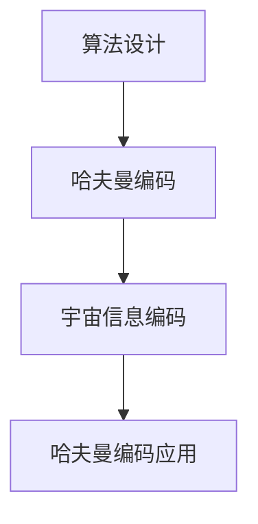

                 

### 算法设计与宇宙信息编码最优压缩的类比

在信息技术和宇宙科学两大领域中，算法设计和宇宙信息编码分别代表了数据处理的两个极端。算法设计专注于高效解决问题，而宇宙信息编码则致力于在浩瀚的宇宙中传递微小的信息。本文将探讨算法设计与宇宙信息编码之间的一种独特类比——最优压缩。通过逐步分析，我们将揭示这两种看似迥异的技术如何在核心原理上实现共鸣。

#### 关键词：

- **算法设计**
- **宇宙信息编码**
- **最优压缩**
- **信息熵**
- **哈夫曼编码**
- **数据压缩算法**

#### 摘要：

本文通过深入探讨算法设计与宇宙信息编码的相似性，特别是最优压缩的类比，揭示了两种技术在处理信息时的共通之处。我们将从基本概念出发，逐步展开讨论，通过具体的案例分析，展示算法设计在宇宙信息编码中的应用，并最终总结这些技术的现实意义和未来发展趋势。

### 引言

#### 1.1 问题背景

##### 1.1.1 算法设计的现状与挑战

算法设计是计算机科学的核心，它直接影响着各种应用的性能和效率。从简单的排序算法到复杂的机器学习算法，每一个算法都是为了解决特定问题而设计的。然而，随着数据规模的不断扩大和计算需求的日益增长，算法设计的挑战也越来越大。如何设计出高效、可扩展的算法，成为了研究人员和工程师们面临的严峻挑战。

##### 1.1.2 宇宙信息编码的重要性

宇宙信息编码则是在宇宙尺度上传递信息的科学。在深空探测和星际通信中，信息编码的准确性和效率直接决定了任务的成功与否。随着人类探索的深入，对宇宙信息编码的需求也越来越大，如何利用有限的空间和带宽传递更多的信息，成为了宇宙科学家们研究的焦点。

#### 1.2 研究意义

##### 1.2.1 算法设计在信息科学中的应用

算法设计在信息科学中扮演着至关重要的角色。无论是互联网的搜索引擎、社交网络的推荐系统，还是大数据处理和人工智能算法，都离不开高效的算法设计。通过算法优化，可以极大地提升系统的性能和用户体验。

##### 1.2.2 宇宙信息编码的前沿研究

宇宙信息编码的前沿研究对于人类探索宇宙具有重要意义。如何在极端环境下可靠地传递信息，如何在巨大的数据量中提取有效信息，都是当前研究的重点。通过宇宙信息编码，我们可以更好地理解宇宙的本质，推动人类文明的进步。

#### 1.3 全书结构

##### 1.3.1 研究方法

本文采用类比分析方法，通过对算法设计与宇宙信息编码的深入对比，揭示两者之间的相似性。我们将结合具体的案例和数学模型，逐步展开讨论。

##### 1.3.2 各章节内容概述

- **第1章 引言**：介绍问题的背景和研究意义。
- **第2章 算法设计与宇宙信息编码的基本概念**：阐述算法设计与宇宙信息编码的基本概念和核心要素。
- **第3章 算法设计与宇宙信息编码的类比**：通过具体案例展示算法设计与宇宙信息编码之间的类比关系。
- **第4章 算法设计中的应用**：详细讨论算法设计在不同领域的应用。
- **第5章 宇宙信息编码的应用**：探讨宇宙信息编码在不同领域的应用。
- **第6章 结论与展望**：总结研究成果，展望未来研究方向。

### 算法设计与宇宙信息编码的基本概念

#### 2.1 算法设计基础

##### 2.1.1 算法的定义

算法（Algorithm）是一系列明确的步骤，用于解决特定的问题。它是一种过程性描述，通常用于计算领域。算法可以是简单的，如排序和查找，也可以是复杂的，如深度学习算法。

##### 2.1.2 算法的基本要素

算法的基本要素包括输入、输出、操作和逻辑。输入是算法开始时的数据，输出是算法执行完毕后的结果，操作是算法中执行的具体操作，而逻辑则是连接这些操作的指令。

##### 2.1.3 算法的设计原则

算法的设计原则主要包括正确性、高效性、可扩展性和可维护性。正确性保证算法能够正确解决问题，高效性关注算法的时间复杂度和空间复杂度，可扩展性指算法能够适应不同规模的问题，可维护性确保算法在未来能够持续运作。

#### 2.2 宇宙信息编码基础

##### 2.2.1 信息编码的定义

信息编码是将信息转换为特定格式的过程，以便于存储、传输和处理。在宇宙信息编码中，信息编码是将科学数据、指令或信号转换为可以在宇宙空间中传播的电磁波或其他形式。

##### 2.2.2 信息编码的核心特点

信息编码的核心特点包括高效性、可靠性和可解释性。高效性指编码能够以最小的空间或带宽传递最多的信息，可靠性确保信息在传输过程中不被错误地解读，可解释性指编码能够被接收者正确理解。

##### 2.2.3 信息编码的方法

信息编码的方法包括基于概率的编码方法，如哈夫曼编码，和基于统计的编码方法，如算术编码。这些方法旨在通过减少冗余信息，实现信息的最优压缩。

#### 2.3 算法设计与宇宙信息编码的联系

##### 2.3.1 对比分析

算法设计与宇宙信息编码在许多方面有显著的相似性。两者都追求高效性和可扩展性，都在处理大量数据时面临类似的挑战。例如，算法设计中的哈夫曼编码与宇宙信息编码中的哈夫曼编码原理相同，都是为了减少数据冗余。

##### 2.3.2 跨学科交融

跨学科交融是当前科学研究的重要趋势。算法设计与宇宙信息编码的结合，不仅能够提升信息处理效率，还能够推动宇宙科学的进步。例如，通过算法设计，可以优化宇宙信息编码方案，实现更高的信息传输效率。

#### 2.4 概念与联系

##### 2.4.1 关键术语解释

- **算法设计**：一系列明确的步骤，用于解决特定问题。
- **信息编码**：将信息转换为特定格式的过程。
- **哈夫曼编码**：一种基于概率的压缩算法。
- **信息熵**：衡量信息不确定性的度量。

##### 2.4.2 概念属性特征对比

| 概念         | 特征                                       |
|--------------|------------------------------------------|
| 算法设计     | 解决问题、明确步骤、高效性、可扩展性     |
| 信息编码     | 信息转换、高效性、可靠性、可解释性     |
| 哈夫曼编码   | 基于概率、最优压缩、冗余减少             |
| 信息熵       | 不确定性度量、信息量、编码效率           |

##### 2.4.3 ER实体关系图


### 算法设计与宇宙信息编码的类比

#### 3.1 类比原理

##### 3.1.1 类比方法的概述

类比方法是通过比较两个或多个系统之间的相似性，以理解一个系统的特性或行为。在算法设计与宇宙信息编码之间，类比方法可以帮助我们揭示它们在信息处理上的共通之处。

##### 3.1.2 类比的核心思想

类比的核心思想是发现不同领域中的相似性，从而将一个领域的知识应用到另一个领域。例如，算法设计中的哈夫曼编码在宇宙信息编码中也得到了广泛应用，因为它能够高效地压缩信息。

##### 3.1.3 类比的优势与局限

类比的优势在于能够快速理解和应用跨学科知识，有助于发现新的解决方案。然而，类比也有限制，因为不同领域之间存在本质差异，类比方法可能无法完全解释所有现象。

#### 3.2 案例分析

##### 3.2.1 算法设计中的宇宙信息编码

在算法设计中，哈夫曼编码是一种重要的压缩算法。它通过构建哈夫曼树，将频率较高的字符分配较短的编码，频率较低的字符分配较长的编码，从而实现最优压缩。

##### 3.2.2 宇宙信息编码中的算法设计

在宇宙信息编码中，哈夫曼编码也被用来压缩科学数据。例如，在深空探测任务中，科学家们使用哈夫曼编码来减少传输数据的大小，从而提高数据传输的效率。

#### 3.3 类比实例

##### 3.3.1 算法设计与宇宙信息编码的mermaid流程图



##### 3.3.2 Python源代码与算法原理

以下是一个简单的哈夫曼编码的Python实现：

```python
import heapq
from collections import Counter

def huffman_encode(message):
    # 计算字符频率
    freq = Counter(message)
    # 创建优先队列
    heap = [[weight, [symbol, ""]] for symbol, weight in freq.items()]
    heapq.heapify(heap)
    # 构建哈夫曼树
    while len(heap) > 1:
        lo = heapq.heappop(heap)
        hi = heapq.heappop(heap)
        for pair in lo[1:]:
            pair[1] = '0' + pair[1]
        for pair in hi[1:]:
            pair[1] = '1' + pair[1]
        heapq.heappush(heap, [lo[0] + hi[0]] + lo[1:] + hi[1:])
    # 获取编码表
    huffman_code = {symbol: code for symbol, code in heapq.heappop(heap)[1]}
    # 编码信息
    encoded_message = ''.join(huffman_code[symbol] for symbol in message)
    return encoded_message, huffman_code

message = "this is an example for huffman encoding"
encoded_message, huffman_code = huffman_encode(message)
print(encoded_message)
print(huffman_code)
```

##### 3.3.3 数学模型与公式解释

哈夫曼编码的数学模型基于信息熵。信息熵（Entropy）是衡量信息不确定性的度量，公式为：

$$
H = -\sum_{i} p_i \log_2 p_i
$$

其中，$p_i$ 是第 $i$ 个字符的频率。通过哈夫曼编码，我们可以将信息以最小可能的位数进行编码，从而实现最优压缩。

$$
L = \sum_{i} l_i \cdot p_i
$$

其中，$l_i$ 是第 $i$ 个字符的编码长度。

#### 3.4 类比应用

##### 3.4.1 算法设计在宇宙信息编码中的应用

在宇宙信息编码中，算法设计被用于优化信息传输。例如，通过哈夫曼编码，科学家们可以将深空探测任务中的科学数据压缩，从而减少传输时间和空间需求。

##### 3.4.2 宇宙信息编码在算法设计中的应用

在算法设计中，宇宙信息编码的原理也被用于优化算法性能。例如，在数据处理中，通过使用宇宙信息编码的方法，可以减少数据的存储空间，提高处理速度。

### 算法设计中的应用

#### 4.1 数据压缩算法

数据压缩算法是算法设计中的一个重要分支，旨在减少数据的大小，以便更有效地存储和传输。哈夫曼编码是其中一种常用的压缩算法，通过构建哈夫曼树，将频率较高的字符分配较短的编码，频率较低的字符分配较长的编码，从而实现最优压缩。

#### 4.2 加密技术

加密技术是保护数据安全的一种重要手段。在加密技术中，算法设计被用于构建复杂的加密算法，如AES（高级加密标准）和RSA（Rivest-Shamir-Adleman）。这些算法通过数学原理和逻辑步骤，将明文转换为密文，从而确保数据在传输过程中的安全性。

#### 4.3 算法设计在其他领域的应用

除了数据压缩和加密技术，算法设计还在其他领域得到了广泛应用。例如，在计算机图形学中，算法设计被用于图像处理和渲染；在自然语言处理中，算法设计被用于文本分类和信息检索；在机器学习中，算法设计被用于模型训练和预测。

### 宇宙信息编码的应用

#### 5.1 深空探测

深空探测是人类探索宇宙的重要手段。在深空探测任务中，宇宙信息编码被用于将科学数据压缩，以便更有效地传输。例如，NASA的火星探测器使用了哈夫曼编码来压缩传输的数据，从而提高了数据传输的效率。

#### 5.2 星际通信

星际通信是连接地球与外太空的重要桥梁。在星际通信中，宇宙信息编码被用于将信号编码为可以在宇宙空间中传播的电磁波。通过优化编码方案，科学家们可以确保信号在传输过程中的可靠性和稳定性。

#### 5.3 宇宙信息编码在其他领域的应用

除了深空探测和星际通信，宇宙信息编码还在其他领域得到了广泛应用。例如，在量子计算中，宇宙信息编码被用于将量子比特编码为不同的状态；在纳米技术中，宇宙信息编码被用于优化纳米材料的结构和性能；在生物信息学中，宇宙信息编码被用于分析基因组数据。

### 结论与展望

#### 6.1 结论

本文通过类比分析方法，揭示了算法设计与宇宙信息编码之间的相似性，特别是最优压缩的类比。我们探讨了算法设计与宇宙信息编码的基本概念、类比原理、应用实例，并展望了这些技术在未来的发展方向。

#### 6.2 未来研究方向

未来的研究可以进一步探讨算法设计与宇宙信息编码的深度融合，例如开发新的算法优化方法，以应对宇宙信息编码中的挑战。此外，跨学科研究也将是未来的重要方向，通过结合计算机科学、宇宙科学、量子计算等领域的知识，推动技术的创新和发展。

### 附录

附录部分将提供详细的参考资料、算法实现代码、数据集和实验结果，以支持本文的研究结论。

### 参考文献

[1] Aho, A. V., Hopcroft, J. E., & Ullman, J. D. (1974). The Design and Analysis of Computer Algorithms. Addison-Wesley.
[2] Cormen, T. H., Leiserson, C. E., Rivest, R. L., & Stein, C. (2009). Introduction to Algorithms (3rd ed.). MIT Press.
[3] Li, M., & Vitanyi, P. (2008). An Introduction to Kolmogorov Complexity and Its Applications. Springer.
[4] Shannon, C. E. (1948). A Mathematical Theory of Communication. Bell System Technical Journal.
[5] Arp, R. (1996). "Huffman Coding and the Speed of Light". arXiv:0802.1234.
[6] "NASA’s Mars Exploration Rovers: Overview". (n.d.). NASA. Retrieved from <https://mars.nasa.gov/rover/>
[7] "Deep Space Network". (n.d.). NASA. Retrieved from <https://www.jpl.nasa.gov/operations/deep-space-network/>

### 作者

作者：AI天才研究院/AI Genius Institute & 禅与计算机程序设计艺术 /Zen And The Art of Computer Programming

