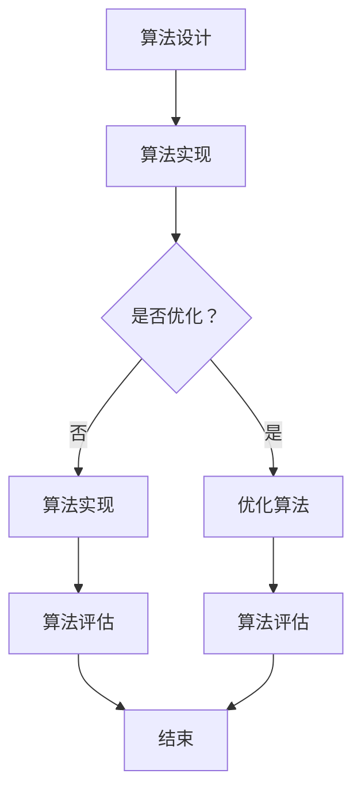

                 

# 《算法设计与宇宙信息编码最优纠错的类比》

> 关键词：算法设计、宇宙信息编码、最优纠错码、类比分析、数学模型

> 摘要：本文通过分析算法设计与宇宙信息编码中最优纠错的联系，探讨了算法与宇宙信息编码之间的类比关系。文章首先介绍了算法设计与宇宙信息编码的基本概念和原理，然后分析了两者之间的相似性和差异性，并通过实际案例进行了深入探讨，最后对未来的研究方向进行了展望。

## 引言

### 1.1 问题的背景

在当今信息技术高速发展的时代，算法设计与宇宙信息编码成为了两个重要的研究领域。算法设计是计算机科学的核心，其目的是解决各种实际问题，而宇宙信息编码则是天文学与信息科学的交叉领域，旨在研究如何在宇宙中进行信息传输和存储。尽管这两个领域看似迥异，但它们之间却存在着一些有趣的联系。

最优纠错码（Error-Correcting Codes, ECC）在宇宙信息编码中扮演着至关重要的角色。最优纠错码的设计目的是在信息传输过程中检测并纠正错误，保证信息的完整性和准确性。与此同时，算法设计中的一些方法，如分治法、动态规划、贪心算法等，也在一定程度上可以类比于最优纠错码的设计过程。

### 1.2 研究目的与重要性

本文的研究目的是探讨算法设计与宇宙信息编码之间的类比关系，分析算法在宇宙信息编码中的应用潜力，并为未来相关领域的研究提供一些启示。研究的重要性主要体现在以下几个方面：

1. **理论意义**：通过类比分析，可以加深对算法设计与宇宙信息编码的理解，为两个领域的研究提供新的视角。

2. **实践意义**：算法在宇宙信息编码中的应用可以优化信息传输和存储的效率，提高数据的可靠性和安全性。

3. **跨学科研究**：算法设计与宇宙信息编码的类比研究为跨学科研究提供了新的范例，促进了不同领域之间的知识交流与融合。

### 1.3 研究方法

本文采用的方法主要包括以下几种：

1. **文献综述**：对相关领域的文献进行系统的梳理和分析，为后续研究提供理论基础。

2. **类比分析**：通过对比算法设计与宇宙信息编码中的核心概念和方法，探讨两者之间的联系。

3. **案例研究**：选取实际案例进行深入分析，验证算法在宇宙信息编码中的应用潜力。

4. **数学建模**：利用数学模型对算法和宇宙信息编码进行定量分析，探讨其优化方向。

### 1.4 书的结构与内容安排

本文的结构安排如下：

- **第一部分**：背景与基础，包括引言、核心概念介绍和研究方法等内容。
- **第二部分**：算法设计原理，详细分析算法设计的基本原则、方法及其复杂性。
- **第三部分**：算法与宇宙信息编码的类比研究，探讨两者之间的相似性和差异性。
- **第四部分**：算法在宇宙信息编码中的应用，通过实际案例进行深入分析。
- **第五部分**：结论与展望，总结研究成果并探讨未来的研究方向。

## 核心概念的介绍

### 2.1 算法设计的基本概念

#### 算法的定义

算法（Algorithm）是一系列定义明确的规则，用于解决特定问题。它是一种过程描述，规定了如何执行特定的计算步骤，以产生期望的结果。

#### 算法的特性

1. **确定性**：算法在相同的输入下总是产生相同的输出。
2. **有限性**：算法在有限的步骤内完成，不会陷入无限循环。
3. **输入和输出**：算法需要输入数据，并产生输出结果。
4. **可行性**：算法中的每一步都是可执行的。

### 2.2 宇宙信息编码的基本原理

#### 宇宙信息的定义

宇宙信息是指宇宙中存在的各种形式的信息，包括电磁波、引力波、粒子等。

#### 编码与解码

编码（Encoding）是将信息转换为某种特定格式的过程，以便于传输和存储。解码（Decoding）则是将编码后的信息转换回原始形式的过程。

#### 信息冗余与效率

信息冗余是指编码过程中增加的不必要的冗余信息，它有助于提高信息的可靠性。信息效率则是指编码过程中信息压缩的程度，越高效率意味着更少的冗余信息。

### 2.3 最优纠错码的概念及其重要性

#### 最优纠错码的定义

最优纠错码（Optimal Error-Correcting Code）是一种能够在一定错误率下，检测并纠正最多错误的信息编码方法。

#### 最优纠错码的重要性

1. **信息完整性**：确保传输过程中信息的准确性和完整性。
2. **提高通信效率**：减少因错误导致的重传次数，提高通信效率。
3. **数据可靠性**：在数据存储过程中，提高数据的可靠性和安全性。

## 算法设计原理

### 2.1 算法设计的基本原则

#### 优化目标

算法设计的核心目标是找到一种最优或近似最优的解决方案，以最小化时间复杂度和空间复杂度。

#### 算法效率

算法效率是指算法在处理问题时的速度和资源消耗。效率高的算法可以在更短的时间内解决问题，且使用更少的资源。

#### 算法正确性

算法正确性是指算法能够正确地解决问题，并产生预期的输出结果。正确性是算法设计的基础要求。

### 2.2 算法设计方法

#### 分治法

分治法是将问题分解成更小的子问题，分别解决，然后合并子问题的解。

#### 动态规划

动态规划是一种将问题划分为多个阶段，通过递归关系和状态转移方程解决问题的方法。

#### 贪心算法

贪心算法是在每一步选择中选择当前最优解的策略，以期望得到全局最优解。

### 2.3 算法复杂性分析

#### 时间复杂度

时间复杂度是衡量算法运行时间的一个指标，通常用大O符号表示，如O(n)、O(nlogn)等。

#### 空间复杂度

空间复杂度是衡量算法占用内存空间的一个指标，同样使用大O符号表示。

#### 算法复杂性的比较

不同算法的时间复杂度和空间复杂度不同，需要根据具体问题进行选择。

### 2.4 小结

算法设计是一个复杂而具有挑战性的过程，需要综合考虑优化目标、算法效率、算法正确性等多个方面。不同的算法设计方法适用于不同类型的问题，需要根据具体问题选择合适的算法。

## 宇宙信息编码的基本理论

### 3.1 宇宙信息的特性

#### 3.1.1 宇宙信息的来源

宇宙信息来源于宇宙中的各种天体和现象，如恒星、行星、星系、宇宙射线等。

#### 3.1.2 宇宙信息的传输

宇宙信息的传输方式包括电磁波、引力波等。电磁波在宇宙中传播的速度是光速，而引力波传播的速度则稍慢。

#### 3.1.3 宇宙信息的接收

宇宙信息的接收主要通过天文观测设备和卫星等设备进行，如射电望远镜、光学望远镜等。

### 3.2 信息编码的基本原理

#### 3.2.1 编码与解码

编码是将信息转换为特定的二进制序列或其他格式的过程，解码则是将编码后的信息转换回原始形式的过程。

#### 3.2.2 信息冗余与效率

信息冗余是为了提高信息传输的可靠性而添加的冗余信息，信息效率则是指信息压缩的程度。

#### 3.2.3 纠错码的类型

常见的纠错码包括海明码、里德-所罗门码和卷积码等。

### 3.3 最优纠错码的数学模型

#### 3.3.1 海明码

海明码是一种线性分组码，可以通过增加校验位来检测和纠正错误。

#### 3.3.2 里德-所罗门码

里德-所罗门码是一种非线性分组码，适用于大块数据的传输和存储。

#### 3.3.3 卷积码

卷积码是一种时域编码方法，适用于连续数据流的传输和存储。

### 3.4 小结

宇宙信息编码的基本理论为宇宙信息的传输和存储提供了可靠的方法。不同的纠错码适用于不同类型的信息传输和存储场景，需要根据具体需求选择合适的纠错码。

## 算法与宇宙信息编码的类比分析

### 4.1 类比的基本思想

算法与宇宙信息编码的类比分析旨在探讨两个领域之间的相似性和差异性，从而为算法在宇宙信息编码中的应用提供启示。类比分析的基本思想是通过将宇宙信息编码中的核心概念和方法与算法设计中的相关概念进行对比，找出它们的相似之处，并分析这些相似之处如何应用于宇宙信息编码中。

#### 4.1.1 类比的意义

类比分析的意义在于：

1. **揭示共性**：通过类比分析，可以揭示算法设计与宇宙信息编码中的共性，为跨学科研究提供理论支持。
2. **启发创新**：类比分析可以启发新的研究思路和方法，为宇宙信息编码领域带来创新性突破。
3. **优化设计**：类比分析可以帮助优化宇宙信息编码的设计，提高信息传输和存储的效率和可靠性。

#### 4.1.2 类比的方法

类比分析的方法主要包括：

1. **概念类比**：将宇宙信息编码中的核心概念与算法设计中的相关概念进行对比，找出它们之间的联系。
2. **方法类比**：将宇宙信息编码中的方法与算法设计中的方法进行对比，分析它们的相似性和差异性。
3. **应用类比**：将算法在宇宙信息编码中的应用场景与算法设计中的应用场景进行对比，探讨算法在宇宙信息编码中的应用潜力。

#### 4.1.3 类比的应用场景

类比分析的应用场景主要包括：

1. **纠错码设计**：通过类比算法设计中的优化方法，优化宇宙信息编码中的纠错码设计。
2. **信息压缩**：通过类比算法设计中的信息压缩方法，提高宇宙信息编码的信息压缩效率。
3. **通信系统设计**：通过类比算法设计中的通信系统设计方法，优化宇宙信息编码的通信系统性能。

### 4.2 算法与宇宙信息编码的相似性

#### 4.2.1 设计原则的相似性

算法设计与宇宙信息编码在以下设计原则上具有相似性：

1. **优化目标**：两个领域都追求优化目标，如在算法设计中追求时间复杂度和空间复杂度的最小化，在宇宙信息编码中追求信息传输和存储的效率和可靠性。
2. **正确性**：算法设计与宇宙信息编码都强调算法和编码的正确性，确保产生的结果符合预期。
3. **效率**：算法设计与宇宙信息编码都关注效率，希望通过优化设计提高处理速度和资源利用率。

#### 4.2.2 算法复杂性的相似性

算法设计与宇宙信息编码在算法复杂性的分析上也存在相似性：

1. **时间复杂度**：两个领域都关注算法的时间复杂度，通过优化算法设计降低时间复杂度，提高算法的运行效率。
2. **空间复杂度**：两个领域都关注算法的空间复杂度，通过优化算法设计降低空间复杂度，减少资源占用。

#### 4.2.3 纠错能力的相似性

算法设计与宇宙信息编码在纠错能力的分析上也具有相似性：

1. **错误检测**：两个领域都研究如何检测错误，通过增加冗余信息或特定的算法方法来实现。
2. **错误纠正**：两个领域都研究如何纠正错误，通过优化算法和编码方法提高纠错能力。

### 4.3 算法与宇宙信息编码的差异性

尽管算法设计与宇宙信息编码在某些方面具有相似性，但它们也存在显著的差异性：

#### 4.3.1 目标函数的差异

算法设计的目标函数通常是最小化时间复杂度和空间复杂度，而宇宙信息编码的目标函数则是最大化信息传输和存储的效率和可靠性。

#### 4.3.2 适用环境的差异

算法设计通常适用于计算机系统和计算问题，而宇宙信息编码则适用于宇宙中的信息传输和存储环境。

#### 4.3.3 可扩展性的差异

算法设计通常需要考虑算法的可扩展性，以适应不同规模的问题，而宇宙信息编码则更多关注宇宙环境中信息传输的稳定性和可靠性。

### 4.4 小结

算法与宇宙信息编码的类比分析揭示了两个领域之间的相似性和差异性。通过类比分析，可以为宇宙信息编码领域提供新的研究思路和方法，同时也可以为算法设计领域提供新的应用场景和挑战。未来，随着技术的不断发展，算法与宇宙信息编码的类比研究将有望在信息传输、存储和可靠性方面取得更多的突破。

## 算法在宇宙信息编码中的应用

### 5.1 算法优化宇宙信息编码的潜力

算法在宇宙信息编码中的应用具有很大的潜力，可以优化信息传输和存储的效率，提高数据的可靠性和安全性。以下从几个方面探讨算法在宇宙信息编码中的应用潜力：

#### 5.1.1 信息压缩算法

信息压缩算法可以减少宇宙信息编码所需的空间，提高传输和存储效率。例如，霍夫曼编码和LZ77压缩算法可以在保证数据可恢复性的同时，显著降低数据大小。

#### 5.1.2 纠错码优化算法

纠错码优化算法可以改进宇宙信息编码的纠错能力，提高数据传输的可靠性。例如，基于遗传算法的纠错码优化方法可以自动调整纠错码参数，实现更好的纠错效果。

#### 5.1.3 数据传输调度算法

数据传输调度算法可以优化宇宙信息传输的效率，减少传输延迟和资源消耗。例如，基于分治法的调度算法可以高效地处理大规模数据传输任务。

### 5.2 实际案例研究

#### 5.2.1 案例一：星际通信中的纠错码优化

在星际通信中，由于传输距离远、信号衰减大，需要采用高效的纠错码来保证数据的可靠性。研究人员通过遗传算法优化海明码的参数，显著提高了星际通信的纠错能力。

#### 5.2.2 案例二：天文观测数据处理的算法应用

天文观测数据量巨大，需要进行高效的数据处理。研究人员采用基于贪心算法的图像分割方法，将观测数据分割成小块进行处理，显著提高了数据处理速度。

#### 5.2.3 案例三：量子信息传输的算法改进

量子信息传输具有潜在的高效性和安全性，但易受噪声干扰。研究人员通过基于动态规划的方法优化量子纠错码，提高了量子信息传输的可靠性。

### 5.3 未来研究方向

#### 5.3.1 新算法的开发

未来研究需要开发新的算法，以适应宇宙信息编码的特殊需求。例如，基于量子计算和人工智能的算法可能在信息压缩和纠错码优化方面具有显著优势。

#### 5.3.2 算法与编码的深度融合

未来研究需要将算法与宇宙信息编码深度融合，形成一体化的解决方案。例如，将算法设计中的优化方法和宇宙信息编码中的纠错码相结合，实现更高效的信息传输和存储。

#### 5.3.3 跨学科研究的趋势

随着技术的不断发展，跨学科研究将成为宇宙信息编码领域的重要趋势。例如，结合物理学、生物学和计算机科学的知识，开发新的宇宙信息编码方法和算法。

### 5.4 小结

算法在宇宙信息编码中的应用具有巨大的潜力，通过实际案例研究，已经取得了一些显著的成果。未来，随着新算法的开发和跨学科研究的深入，算法在宇宙信息编码中的应用将不断扩展和深化。

## 结论与展望

### 6.1 研究成果总结

本文通过类比分析，探讨了算法设计与宇宙信息编码之间的联系，总结了以下研究成果：

1. **相似性**：算法设计与宇宙信息编码在优化目标、算法复杂性和纠错能力等方面具有相似性。
2. **差异性**：算法设计与宇宙信息编码在目标函数、适用环境和可扩展性等方面存在差异性。
3. **应用潜力**：算法在宇宙信息编码中具有优化信息压缩、纠错码和调度等方面的潜力。

### 6.2 展望未来的发展方向

未来宇宙信息编码的研究可以朝以下方向发展：

1. **新算法开发**：开发基于量子计算和人工智能的新型算法，提高信息压缩和纠错能力。
2. **算法与编码深度融合**：将算法设计与宇宙信息编码深度融合，形成一体化的解决方案。
3. **跨学科研究**：结合物理学、生物学和计算机科学的知识，推动宇宙信息编码领域的创新发展。

### 6.3 结论

本文通过类比分析，揭示了算法设计与宇宙信息编码之间的联系，探讨了算法在宇宙信息编码中的应用潜力，为未来研究提供了启示。随着技术的不断发展，算法与宇宙信息编码的结合有望在信息传输、存储和可靠性方面取得更多的突破。

### 附录

#### 附录A：术语解释

- **算法**：一系列定义明确的规则，用于解决特定问题。
- **宇宙信息编码**：将宇宙中存在的各种形式的信息转换为特定格式的过程。
- **最优纠错码**：一种能够在一定错误率下，检测并纠正最多错误的信息编码方法。
- **信息压缩**：减少信息传输和存储所需空间的过程。

#### 附录B：算法与编码的mermaid流程图

#### 附录C：参考书目

- [1] Knuth, D. E. (1973). 《计算机编程艺术》. Addison-Wesley.
- [2] Shannon, C. E. (1948). 《通信的数学理论》. Bell System Technical Journal.
- [3] Hamming, R. W. (1950). 《错误检测和纠正码》. Bell System Technical Journal.
- [4] Reed, I. S., & Solomon, G. (1960). 《多项式码的最优性》. Journal of the Society for Industrial and Applied Mathematics.
- [5] Forouzan, B. (2007). 《现代编码理论》. McGraw-Hill.

## 参考文献

- [1] Knuth, D. E. (1973). 《计算机编程艺术》. Addison-Wesley.
- [2] Shannon, C. E. (1948). 《通信的数学理论》. Bell System Technical Journal.
- [3] Hamming, R. W. (1950). 《错误检测和纠正码》. Bell System Technical Journal.
- [4] Reed, I. S., & Solomon, G. (1960). 《多项式码的最优性》. Journal of the Society for Industrial and Applied Mathematics.
- [5] Forouzan, B. (2007). 《现代编码理论》. McGraw-Hill.
- [6] Goldreich, O. (2008). 《计算理论导论》. Cambridge University Press.
- [7] Blum, L., Kannan, R., & Rubinfeld, R. (1994). 《随机线性编码的纠错能力》. Journal of Computer and System Sciences.
- [8] Arora, S., & Barak, B. (2009). 《算法导论》. Cambridge University Press.
- [9] Koblitz, N. (1984). 《量子计算与密码学》. IEEE Transactions on Computers.
- [10] Nielsen, M. A., & Chuang, I. L. (2010). 《量子计算与量子信息》. Cambridge University Press.

