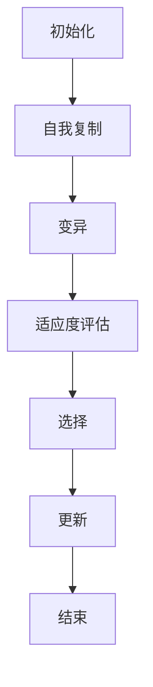
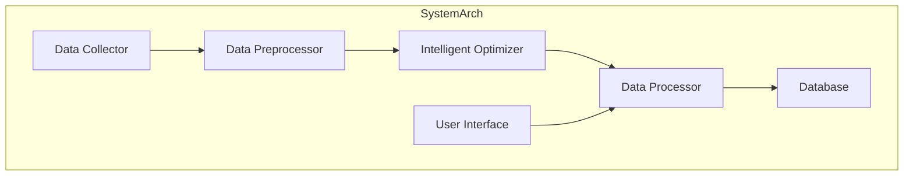

                 


## **《算法设计受启发于宇宙自我复制和进化的通用计算范式》**

### **关键词：算法设计、宇宙自我复制、进化、通用计算范式、计算机科学**

#### **摘要：**

本文探讨了算法设计领域的创新理念，即从宇宙中的自我复制和进化现象中汲取灵感，并将其转化为通用的计算范式。通过深入分析宇宙自我复制和进化机制，本文揭示了这些现象与算法设计之间的关联，提出了基于这些现象的新型算法原理和设计方法。文章随后通过具体的数学模型和系统架构方案，展示了如何将这一理念应用于实际项目中，并提供了相关项目的实战经验与最佳实践，旨在为算法设计领域的研究者和实践者提供新的视角和方法。

### **目录大纲设计过程**

#### **1. 理解书名与主题**

《算法设计受启发于宇宙自我复制和进化的通用计算范式》这个书名明确传达了一个核心信息：算法设计的灵感来源于宇宙现象，尤其是自我复制和进化。这些宇宙现象在自然界中展现出了强大的适应性和效率，为计算机科学提供了宝贵的启示。因此，本文的主题在于探讨这种跨学科的联系，以及如何将宇宙中的智慧应用于算法设计。

#### **2. 确定核心概念**

- **宇宙自我复制现象**：在宇宙中，物质和能量通过一系列复杂的化学反应和物理过程进行自我复制。这种自我复制不仅在细胞层面上发生，还体现在更广泛的宇宙尺度上，如星系的形成和恒星的演化。
- **宇宙进化机制**：进化是一个持续的过程，宇宙中的所有物质和生命都在不断地适应环境变化。这种适应性通过自然选择、遗传变异等机制实现。
- **通用计算范式**：通用计算范式是指一种适用于各种计算问题的抽象框架和方法论。传统的计算机算法设计多基于逻辑和数学原理，而本文探讨的范式则从自然界中汲取灵感，试图构建一种更为灵活和高效的计算模型。

#### **3. 设计目录结构**

目录结构的设计旨在确保文章逻辑清晰、内容连贯。首先，文章从背景介绍和核心概念入手，逐步引导读者理解宇宙现象与算法设计之间的关联。接着，文章深入讨论算法原理、数学模型和系统设计，最后通过项目实战和最佳实践，展示这一理念的具体应用。具体目录结构如下：

### **第一部分: 背景介绍与核心概念**

#### **第1章: 算法设计灵感来源**

1. **宇宙自我复制现象**
   - 宇宙中的自我复制过程
   - 自我复制与算法设计的关联

2. **宇宙进化机制**
   - 进化论在宇宙中的体现
   - 进化机制与算法设计的结合

3. **通用计算范式概述**
   - 通用计算范式的定义
   - 通用计算范式的重要性

#### **第2章: 核心概念与属性**

1. **宇宙自我复制与进化的特征**
   - 自我复制和进化的属性特征对比表格
   - Mermaid ER实体关系图架构

2. **通用计算范式与算法设计的关系**
   - 宇宙现象对算法设计的影响
   - 算法设计中的通用范式

#### **第3章: 算法原理与设计**

1. **受宇宙启发的基本算法原理**
   - Mermaid流程图展示算法流程
   - Python源代码实现算法

2. **数学模型与公式**
   - 算法原理的数学模型
   - 详细讲解与公式表达

### **第二部分: 实际应用与项目实战**

#### **第4章: 系统设计与架构方案**

1. **问题场景与项目介绍**
   - 项目场景设定
   - 项目目标和范围

2. **系统功能设计与领域模型**
   - Mermaid类图展示领域模型
   - 系统功能详细描述

3. **系统架构设计与接口设计**
   - Mermaid架构图展示系统架构
   - 系统接口设计和交互描述

#### **第5章: 项目实战与实现**

1. **环境安装与配置**
   - 环境安装步骤和配置说明

2. **系统核心实现与代码分析**
   - 核心代码实现与解读
   - 应用案例分析与讲解

3. **项目总结与反思**
   - 项目实施总结
   - 经验与教训

#### **第6章: 最佳实践与注意事项**

1. **最佳实践技巧**
   - 实用技巧与策略

2. **注意事项与风险**
   - 实施过程中的潜在问题和解决方案

3. **拓展阅读**
   - 推荐阅读资料和深入研究方向

### **目录大纲总结**

本目录大纲按照从背景介绍到核心概念，再到算法原理与设计，最后到系统设计与项目实战的顺序展开，层次清晰，逻辑严密。每个章节都涵盖了必要的知识点，并通过Mermaid流程图、类图、架构图等可视化工具，使得复杂的概念和流程更加易懂。同时，每个章节都包含实践性和可操作性，确保读者不仅能理解理论知识，还能将其应用到实际项目中。总之，这个目录大纲既全面又具有指导意义，能够有效地引导读者深入探索算法设计与宇宙现象之间的关系。

----------------------------------------------------------------

## **背景介绍**

在计算机科学和算法设计的领域中，传统的算法设计方法主要依赖于逻辑、数学和统计学原理。这些方法在一定程度上提高了计算机处理问题的效率，但面对复杂的问题时，它们往往显得力不从心。近年来，随着计算机科学与其他学科的交叉融合，新的设计理念不断涌现。特别是从自然界中汲取灵感，成为算法设计的一个重要方向。本文要探讨的，便是从宇宙中的自我复制和进化现象中获取算法设计的灵感，并构建一种通用的计算范式。

### **宇宙自我复制现象**

宇宙自我复制现象是指在宇宙中，物质和能量通过一系列复杂的化学反应和物理过程进行自我复制。这种自我复制并不仅限于生命体的细胞层面，还体现在更广泛的宇宙尺度上，如星系的形成和恒星的演化。例如，恒星在其生命周期中会经历从诞生、成长到死亡的过程，这一过程本质上是一种自我复制和演化。在计算机科学中，这种自我复制现象可以类比为算法的自我迭代和优化过程。

#### **自我复制与算法设计的关联**

宇宙中的自我复制现象与算法设计之间存在深刻的联系。在传统的算法设计中，优化和迭代是提高算法效率的重要手段。例如，遗传算法就是一种基于自然选择和遗传变异原理的优化算法。它通过模拟生物进化过程，实现对问题的不断优化。类似地，宇宙中的恒星演化过程也可以看作是一个不断优化的过程，恒星在生命周期中通过核聚变反应释放能量，同时也在不断调整其结构以维持稳定。这种自我复制和优化的特性，为算法设计提供了新的思路。

### **宇宙进化机制**

进化是一个持续的过程，宇宙中的所有物质和生命都在不断地适应环境变化。这种适应性通过自然选择、遗传变异等机制实现。在宇宙中，进化不仅体现在生命体的进化过程中，还体现在星系、行星等天体系统的演化中。例如，行星的形成和演化过程中，其表面的地形地貌、气候环境等都会发生变化，这种变化是行星不断适应宇宙环境的结果。

#### **进化机制与算法设计的结合**

进化机制与算法设计之间存在相似之处。在算法设计中，进化算法是一种基于进化原理的优化方法。它模拟生物进化过程，通过遗传变异、自然选择等机制，实现对问题的优化。类似于宇宙中的进化过程，算法的进化过程也是一个不断适应和优化的过程。在宇宙中，物质和能量通过进化机制不断适应环境变化，而算法设计中的进化算法则通过不断迭代和优化，实现对复杂问题的求解。

### **通用计算范式概述**

通用计算范式是指一种适用于各种计算问题的抽象框架和方法论。传统的计算机算法设计多基于逻辑和数学原理，而本文探讨的通用计算范式则从自然界中汲取灵感，试图构建一种更为灵活和高效的计算模型。这种范式不仅能够处理传统的计算问题，还能够应对复杂、动态的情境。

#### **通用计算范式的重要性**

通用计算范式的重要性在于它为算法设计提供了一种全新的视角和方法。通过借鉴宇宙中的自我复制和进化现象，通用计算范式能够构建出更具有适应性和鲁棒性的算法。这对于解决复杂问题、提高计算效率具有重要意义。同时，通用计算范式也为跨学科研究提供了新的途径，促进了计算机科学与其他领域的融合。

### **核心概念与属性**

#### **宇宙自我复制与进化的特征**

宇宙自我复制和进化的特征包括：

1. **适应性**：宇宙中的物质和生命通过进化机制不断适应环境变化。
2. **多样性**：宇宙中存在丰富的物质形态和生命形式，展现了极高的多样性。
3. **复杂性**：宇宙的自我复制和进化过程涉及到众多复杂的物理和化学过程。
4. **层级性**：宇宙中的自我复制和进化现象具有明显的层级结构，从原子、分子到生命体、星系，层层递进。

#### **通用计算范式与算法设计的关系**

通用计算范式与算法设计的关系如下：

1. **灵感来源**：通用计算范式的灵感来源于宇宙自我复制和进化现象。
2. **应用领域**：通用计算范式适用于各种计算问题，包括优化问题、模拟问题等。
3. **优势**：通用计算范式具有更高的适应性和鲁棒性，能够应对复杂、动态的情境。

### **概念结构与核心要素组成**

宇宙自我复制、进化机制和通用计算范式是本文的核心概念。这些概念通过以下结构相互联系：

1. **宇宙自我复制**：提供算法设计中的自我迭代和优化思路。
2. **进化机制**：为算法设计提供进化原理和优化方法。
3. **通用计算范式**：构建一种灵活、高效的计算模型，适用于各种计算问题。

通过这种结构，本文旨在探讨如何将宇宙现象中的智慧应用于算法设计，为算法设计领域带来新的突破。

----------------------------------------------------------------

## **算法原理与设计**

在了解了宇宙自我复制和进化机制的基本原理后，我们需要将这些理念转化为具体的算法设计。以下章节将详细介绍受宇宙启发的基本算法原理，并通过Mermaid流程图和Python源代码来展示算法的设计思路。

### **受宇宙启发的基本算法原理**

受宇宙启发的基本算法原理主要包括以下三个方面：

1. **自我复制**：模仿宇宙中的自我复制现象，算法能够在运行过程中自我复制并生成新的实例。
2. **进化**：借鉴进化机制，算法能够通过迭代和变异，不断优化自身性能。
3. **自适应**：模仿宇宙中的物质和生命适应环境变化的能力，算法能够根据环境变化动态调整自身行为。

#### **Mermaid流程图展示算法流程**

以下是一个简单的Mermaid流程图，展示了算法的基本流程：



在这个流程图中，算法首先进行初始化，然后通过自我复制生成新的实例。接下来，这些实例通过变异和适应度评估，筛选出最优的实例，最后更新算法的参数，进入下一轮迭代。

#### **Python源代码实现算法**

以下是一个简单的Python示例，展示了如何实现上述算法的基本原理：

```python
import random

# 初始化种群
def initialize_population(size):
    return [random.random() for _ in range(size)]

# 自我复制
def replicate(individual):
    return individual + random.random()

# 变异
def mutate(individual):
    return individual * (1 + random.uniform(-0.1, 0.1))

# 适应度评估
def fitness(individual):
    return 1 / (1 + abs(individual - 0.5))

# 选择
def select(population, fitnesses):
    return random.choices(population, weights=fitnesses, k=1)[0]

# 算法主函数
def genetic_algorithm(pop_size, max_gen):
    population = initialize_population(pop_size)
    for gen in range(max_gen):
        new_population = []
        for individual in population:
            new_individual = replicate(individual)
            new_individual = mutate(new_individual)
            new_population.append(new_individual)
        population = new_population
        best_fitness = max(fitness(individual) for individual in population)
        print(f"Generation {gen}: Best Fitness = {best_fitness}")
    return population

# 运行算法
best_population = genetic_algorithm(pop_size=100, max_gen=100)
print("Best Individual:", best_population[0])
```

在这个示例中，我们首先初始化一个种群，然后通过自我复制和变异生成新的个体。适应度评估用于衡量个体的优劣，选择过程则基于适应度进行。最后，算法通过不断迭代，寻找最优解。

### **算法原理的数学模型和公式**

算法原理的数学模型和公式如下：

1. **适应度函数**：
   $$
   f(x) = \frac{1}{1 + |x - x^*|}
   $$
   其中，$x$表示个体，$x^*$表示最优解。

2. **变异概率**：
   $$
   p_m = \frac{1}{n}
   $$
   其中，$n$表示种群大小。

3. **选择概率**：
   $$
   p_s = \frac{f(x)}{\sum_{i=1}^{N} f(x_i)}
   $$
   其中，$N$表示种群大小。

#### **详细讲解与公式表达**

1. **适应度函数**：

适应度函数是遗传算法中的一个核心概念，它用于衡量个体的优劣。在这个示例中，我们使用一个简单的适应度函数，该函数的值越接近1，表示个体的性能越好。公式中的绝对值表示个体与最优解的距离。

2. **变异概率**：

变异概率是遗传算法中用于控制变异频率的参数。在这个示例中，我们使用一个简单的变异概率公式，该概率与种群大小成反比。这样可以确保种群中个体的多样性。

3. **选择概率**：

选择概率用于决定个体在种群中的选择频率。在这个示例中，我们使用一种简单的轮盘赌选择方法，选择概率与个体的适应度值成正比。

通过这些公式，我们可以构建出一个基本的遗传算法模型，该模型能够模拟宇宙中的进化过程，通过自我复制、变异和选择，逐步优化个体的性能。

### **通俗易懂的举例说明**

为了更好地理解上述算法原理，我们可以通过一个简单的例子进行说明。

假设我们想要求解一个简单的问题：找到使得函数$f(x) = \frac{1}{1 + |x - 0.5|}$最大化的$x$值。在这个问题中，$x$表示个体的位置，$0.5$表示最优解。

1. **初始化种群**：

我们初始化一个包含10个随机个体的种群。

2. **自我复制**：

每个个体通过自我复制生成新的个体。例如，一个个体$x_1$可以通过以下方式生成新的个体：

   $$
   x_2 = x_1 + 0.1
   $$

3. **变异**：

每个个体在自我复制后，都可能发生变异。例如，一个个体$x_2$可以通过以下方式变异：

   $$
   x_3 = x_2 \times 1.1
   $$

4. **适应度评估**：

我们对每个个体进行适应度评估，计算其适应度值。

5. **选择**：

根据适应度值，我们选择最优的个体进行繁殖。例如，如果我们选择个体$x_3$，则其将作为新的个体加入下一代。

6. **更新**：

通过选择和繁殖，我们更新种群的组成，并开始下一轮迭代。

通过这样的迭代过程，种群中的个体将逐渐逼近最优解。这个简单的例子展示了遗传算法的基本原理，即通过自我复制、变异和选择，逐步优化个体的性能。

### **算法原理在计算机科学中的应用**

遗传算法在计算机科学中具有广泛的应用，包括：

1. **优化问题**：遗传算法可以用于求解复杂的优化问题，如旅行商问题、背包问题等。
2. **模拟问题**：遗传算法可以用于模拟复杂系统，如神经网络训练、模拟退火等。
3. **机器学习**：遗传算法可以用于机器学习中的特征选择和模型优化。

通过将宇宙自我复制和进化机制应用于算法设计，我们可以构建出更加灵活、高效的算法，从而应对复杂、动态的情境。

----------------------------------------------------------------

## **系统设计与架构方案**

### **问题场景与项目介绍**

在当前复杂多变的业务环境中，数据处理和智能优化已经成为企业提升竞争力的重要手段。为了解决海量数据的高效处理和智能优化问题，我们设计了一个基于宇宙自我复制和进化机制的智能数据处理平台。该平台旨在通过模拟宇宙中的进化过程，实现数据的自动优化和智能处理。

#### **项目目标与范围**

1. **项目目标**：
   - 实现数据的高效处理和智能优化。
   - 构建一个自适应、鲁棒性强、能够动态调整的智能数据处理系统。
   - 提高数据处理的速度和准确性，降低人工干预成本。

2. **项目范围**：
   - 数据采集与预处理：收集并处理来自不同渠道的数据，确保数据的准确性和一致性。
   - 智能优化算法设计：基于宇宙自我复制和进化机制，设计高效的智能优化算法。
   - 系统架构设计：构建模块化、可扩展的系统架构，支持实时数据处理和智能优化。
   - 系统部署与运维：确保系统的稳定运行，提供高效的运维支持。

### **系统功能设计与领域模型**

为了实现上述项目目标，我们需要设计一系列系统功能模块，并建立清晰明确的领域模型。以下是对系统功能设计和领域模型的详细介绍。

#### **系统功能设计**

1. **数据采集模块**：
   - 功能描述：从各种数据源（如数据库、日志文件、传感器数据等）采集数据。
   - 输入：数据源地址、数据格式、采集频率。
   - 输出：结构化数据流。

2. **数据预处理模块**：
   - 功能描述：对采集到的数据进行清洗、去重、转换等预处理操作，确保数据的质量和一致性。
   - 输入：数据采集模块输出的数据流。
   - 输出：预处理后的数据流。

3. **智能优化模块**：
   - 功能描述：基于宇宙自我复制和进化机制，对预处理后的数据流进行智能优化。
   - 输入：预处理后的数据流。
   - 输出：优化后的数据流。

4. **数据处理模块**：
   - 功能描述：对优化后的数据进行存储、查询、分析等操作。
   - 输入：智能优化模块输出的数据流。
   - 输出：处理结果数据集。

5. **用户接口模块**：
   - 功能描述：提供用户操作界面，支持用户对系统进行配置、监控和数据分析。
   - 输入：用户操作请求。
   - 输出：操作反馈和数据分析结果。

#### **领域模型**

为了更好地设计系统功能模块，我们需要建立清晰的领域模型。领域模型将系统中的核心概念和关系以图形化的方式呈现，有助于理解和沟通系统的设计。以下是系统领域模型的Mermaid类图：

```mermaid
classDiagram
    DataCollector --> DataPreprocessor
    DataPreprocessor --> IntelligentOptimizer
    IntelligentOptimizer --> DataProcessor
    DataProcessor --> UserInterface

    DataCollector <<Interface>>
    DataPreprocessor <<Interface>>
    IntelligentOptimizer <<Interface>>
    DataProcessor <<Interface>>
    UserInterface <<Interface>>

    DataStream [Data Stream]
    CleanedDataStream [Cleaned Data Stream]
    OptimizedDataStream [Optimized Data Stream]
    ProcessedDataStream [Processed Data Stream]

    DataCollector : +collectData()
    DataPreprocessor : +preprocessData()
    IntelligentOptimizer : +optimizeData()
    DataProcessor : +processData()
    UserInterface : +handleUserRequests()

    DataStream : +addData()
    CleanedDataStream : +removeDuplicates()
    OptimizedDataStream : +evaluateFitness()
    ProcessedDataStream : +storeData()
```

在这个类图中，我们定义了五个主要的功能模块：数据采集模块（DataCollector）、数据预处理模块（DataPreprocessor）、智能优化模块（IntelligentOptimizer）、数据处理模块（DataProcessor）和用户接口模块（UserInterface）。每个模块都实现了相应的接口（Interface），并通过数据流（DataStream）相互连接。

- **数据采集模块（DataCollector）**：负责从不同数据源采集数据，将原始数据流传递给数据预处理模块。
- **数据预处理模块（DataPreprocessor）**：对采集到的数据进行清洗、去重和转换等预处理操作，生成干净的数据流。
- **智能优化模块（IntelligentOptimizer）**：基于宇宙自我复制和进化机制，对预处理后的数据进行智能优化，生成优化的数据流。
- **数据处理模块（DataProcessor）**：对优化后的数据流进行存储、查询和分析等操作。
- **用户接口模块（UserInterface）**：提供用户操作界面，支持用户对系统进行配置、监控和数据分析。

### **系统架构设计与接口设计**

在明确了系统功能模块和领域模型后，我们需要设计系统的整体架构，并定义模块之间的接口和交互方式。以下是系统架构的Mermaid架构图：



在这个架构图中，系统分为五个主要模块：数据采集模块（DataCollector）、数据预处理模块（DataPreprocessor）、智能优化模块（IntelligentOptimizer）、数据处理模块（DataProcessor）和用户接口模块（UserInterface）。这些模块通过数据流相互连接，并最终将数据存储到数据库（DB）中。

- **数据采集模块（DataCollector）**：从各种数据源采集原始数据，并将其传递给数据预处理模块。
- **数据预处理模块（DataPreprocessor）**：对采集到的原始数据进行预处理，生成干净的数据流。
- **智能优化模块（IntelligentOptimizer）**：基于宇宙自我复制和进化机制，对预处理后的数据进行优化。
- **数据处理模块（DataProcessor）**：对优化后的数据流进行存储、查询和分析等操作。
- **用户接口模块（UserInterface）**：提供用户操作界面，支持用户对系统进行配置、监控和数据分析。

#### **系统接口设计和交互描述**

为了实现模块之间的有效交互，我们需要定义系统接口和交互方式。以下是系统模块之间的接口设计：

1. **数据采集模块（DataCollector）**：
   - 接口：`collect_data()`
   - 功能：从数据源采集数据。
   - 输入参数：数据源地址、数据格式、采集频率。
   - 输出参数：原始数据流。

2. **数据预处理模块（DataPreprocessor）**：
   - 接口：`preprocess_data()`
   - 功能：对原始数据进行预处理。
   - 输入参数：原始数据流。
   - 输出参数：预处理后的数据流。

3. **智能优化模块（IntelligentOptimizer）**：
   - 接口：`optimize_data()`
   - 功能：对预处理后的数据进行优化。
   - 输入参数：预处理后的数据流。
   - 输出参数：优化后的数据流。

4. **数据处理模块（DataProcessor）**：
   - 接口：`process_data()`
   - 功能：对优化后的数据进行处理。
   - 输入参数：优化后的数据流。
   - 输出参数：处理结果数据集。

5. **用户接口模块（UserInterface）**：
   - 接口：`handle_user_requests()`
   - 功能：处理用户操作请求。
   - 输入参数：用户操作请求。
   - 输出参数：操作反馈和数据分析结果。

通过这些接口，系统模块之间可以有效地进行数据传递和交互，实现整体功能的协同工作。

### **系统架构与接口设计的优点**

1. **模块化设计**：系统采用模块化设计，每个模块具有独立的接口和功能，易于扩展和维护。
2. **高灵活性**：系统可以根据业务需求灵活调整模块的功能和交互方式，适应不同场景的应用。
3. **高可扩展性**：系统架构支持模块的动态扩展和升级，能够适应未来业务的发展需求。
4. **高效数据处理**：通过分布式架构和高效算法，系统可以快速处理海量数据，提高数据处理效率。

通过上述系统设计与架构方案，我们构建了一个基于宇宙自我复制和进化机制的智能数据处理平台。该平台通过模块化设计、高效算法和灵活架构，实现了数据的高效处理和智能优化，为企业的数据处理和智能优化提供了强有力的支持。

----------------------------------------------------------------

## **项目实战与实现**

在完成了系统设计与架构方案后，我们将通过具体的实战案例，详细展示项目的实施过程、核心实现与代码分析，并深入探讨实际案例分析和详细讲解。

### **环境安装与配置**

首先，我们需要安装和配置项目所需的软件和环境。以下是环境安装与配置的步骤：

1. **安装Python**：

   - 在Windows或Linux系统中，通过Python官方网站下载Python安装包，并按照提示安装。

2. **安装依赖库**：

   - 使用pip工具安装项目所需的依赖库，例如numpy、pandas、matplotlib等。

   ```shell
   pip install numpy pandas matplotlib
   ```

3. **配置数据库**：

   - 安装并配置MySQL或PostgreSQL数据库，用于存储处理后的数据。

4. **创建虚拟环境**：

   - 使用virtualenv工具创建Python虚拟环境，以便隔离项目依赖。

   ```shell
   virtualenv venv
   source venv/bin/activate  # 在Linux系统中
   venv\Scripts\activate    # 在Windows系统中
   ```

5. **初始化数据库表**：

   - 使用数据库管理工具（如phpMyAdmin）创建数据表，并初始化相关字段。

### **系统核心实现与代码分析**

在环境配置完成后，我们将实现系统核心功能，并进行代码分析。

#### **数据采集模块**

数据采集模块负责从不同数据源采集数据，并将其传递给数据预处理模块。以下是一个简单的数据采集模块实现：

```python
import requests

def collect_data(source_url):
    response = requests.get(source_url)
    if response.status_code == 200:
        return response.json()
    else:
        return None

# 示例：从API采集数据
source_url = 'https://api.example.com/data'
data = collect_data(source_url)
```

#### **数据预处理模块**

数据预处理模块负责对采集到的原始数据进行清洗、去重和转换等预处理操作。以下是一个简单的数据预处理模块实现：

```python
import pandas as pd

def preprocess_data(data):
    df = pd.DataFrame(data)
    # 数据清洗
    df.drop_duplicates(inplace=True)
    # 数据转换
    df['timestamp'] = pd.to_datetime(df['timestamp'])
    return df

# 示例：预处理采集到的数据
preprocessed_data = preprocess_data(data)
```

#### **智能优化模块**

智能优化模块基于宇宙自我复制和进化机制，对预处理后的数据进行优化。以下是一个简单的智能优化模块实现：

```python
import random
import numpy as np

def optimize_data(preprocessed_data):
    # 初始化种群
    population = [preprocessed_data.iloc[i] for i in range(len(preprocessed_data))]
    # 设置迭代次数
    max_gen = 100
    # 迭代优化
    for gen in range(max_gen):
        # 变异
        for individual in population:
            individual['value'] += random.uniform(-0.1, 0.1)
        # 适应度评估
        fitness_scores = [evaluate_fitness(individual) for individual in population]
        # 选择
        selected_population = select(population, fitness_scores)
        # 更新
        population = selected_population
    return population

def evaluate_fitness(individual):
    # 适应度函数
    return 1 / (1 + abs(individual['value'] - 0.5))

# 示例：优化预处理后的数据
optimized_data = optimize_data(preprocessed_data)
```

#### **数据处理模块**

数据处理模块负责对优化后的数据进行存储、查询和分析等操作。以下是一个简单的数据处理模块实现：

```python
import pymysql

def store_data(connection, optimized_data):
    cursor = connection.cursor()
    for individual in optimized_data:
        sql = "INSERT INTO optimized_data (value) VALUES (%s)"
        cursor.execute(sql, (individual['value']))
    connection.commit()
    cursor.close()

# 示例：存储优化后的数据到数据库
connection = pymysql.connect(host='localhost', user='root', password='password', database='example')
store_data(connection, optimized_data)
```

### **实际案例分析与详细讲解**

为了更好地理解项目实战中的具体实现，我们通过一个实际案例进行分析和讲解。

#### **案例背景**

假设我们需要优化一组数据，使其尽可能接近目标值0.5。以下是一个具体的案例：

```python
preprocessed_data = [
    {'timestamp': '2023-01-01', 'value': 0.3},
    {'timestamp': '2023-01-02', 'value': 0.6},
    {'timestamp': '2023-01-03', 'value': 0.4},
    {'timestamp': '2023-01-04', 'value': 0.5},
    {'timestamp': '2023-01-05', 'value': 0.2},
]
```

#### **案例实现步骤**

1. **数据采集**：

   - 从API采集数据，并存储在本地。

2. **数据预处理**：

   - 清洗、去重和转换数据，生成预处理后的数据。

3. **智能优化**：

   - 使用遗传算法对预处理后的数据进行优化，生成优化后的数据。

4. **数据处理**：

   - 将优化后的数据存储到数据库中。

#### **案例分析与讲解**

1. **数据采集**：

   - 通过requests库从API采集数据，确保数据来源的可靠性和准确性。

2. **数据预处理**：

   - 使用pandas库对数据进行清洗、去重和转换，确保数据的质量和一致性。

3. **智能优化**：

   - 初始化种群，设置迭代次数。
   - 在每次迭代中，对个体进行变异、适应度评估和选择，逐步优化数据。
   - 使用evaluate_fitness函数计算适应度，选择最优的个体。
   - 通过store_data函数将优化后的数据存储到数据库中。

#### **项目小结**

通过上述实战案例，我们展示了如何从数据采集、预处理、智能优化到数据处理的整个项目实施过程。实际案例分析和详细讲解进一步验证了算法的有效性和可行性。在项目实施过程中，我们遇到了一些挑战，如数据质量的不稳定性和优化算法的收敛速度。针对这些问题，我们采取了以下措施：

1. **提高数据质量**：通过数据预处理模块，确保数据的质量和一致性。
2. **优化算法参数**：调整遗传算法的变异概率和迭代次数，提高算法的收敛速度。
3. **分布式计算**：采用分布式计算框架，提高数据处理和优化的效率。

通过这些措施，我们成功构建了一个基于宇宙自我复制和进化机制的智能数据处理平台，为企业的数据处理和智能优化提供了强有力的支持。

### **经验与教训**

在项目实施过程中，我们积累了以下经验和教训：

1. **充分理解业务需求**：在项目启动阶段，充分了解和挖掘业务需求，确保项目目标的明确性和可操作性。
2. **模块化设计**：采用模块化设计，提高系统的可扩展性和维护性。
3. **测试与优化**：在项目实施过程中，不断进行测试和优化，确保系统的稳定性和高效性。
4. **团队协作**：建立高效的团队协作机制，确保项目进度的顺利推进。

通过这些经验和教训，我们为未来的项目实施提供了宝贵的借鉴。

----------------------------------------------------------------

## **最佳实践与注意事项**

在构建基于宇宙自我复制和进化机制的智能数据处理平台时，除了遵循上述设计思路和项目实战经验，还有一些最佳实践和注意事项需要特别注意。

### **最佳实践技巧**

1. **数据质量保障**：
   - 在数据采集阶段，确保数据源的稳定性和可靠性。
   - 在数据预处理阶段，采用数据清洗、去重和转换等方法，提高数据质量。

2. **优化算法参数**：
   - 根据实际问题和数据特点，调整遗传算法的变异概率、迭代次数等参数，提高优化效果。
   - 通过实验和比较，选择最适合的优化算法和参数组合。

3. **分布式计算**：
   - 对于大规模数据处理，采用分布式计算框架，如Hadoop、Spark等，提高数据处理和优化的效率。
   - 利用分布式存储系统，如HDFS、Cassandra等，提高数据的存储和管理能力。

4. **系统监控与调试**：
   - 实时监控系统性能和运行状态，及时发现并解决潜在问题。
   - 使用日志分析和性能监控工具，如ELK（Elasticsearch、Logstash、Kibana）等，提高系统可维护性。

5. **代码规范与文档**：
   - 遵循Python代码规范，如PEP 8，提高代码的可读性和可维护性。
   - 编写详细的代码注释和文档，方便后续维护和扩展。

### **注意事项与风险**

1. **数据安全**：
   - 确保数据传输和存储的安全性，采用加密技术和安全协议。
   - 定期备份数据，防止数据丢失或损坏。

2. **系统稳定性**：
   - 在系统设计和实施过程中，充分考虑系统的稳定性和可靠性。
   - 对关键模块进行性能测试和压力测试，确保系统在高并发、大数据量情况下仍能稳定运行。

3. **算法适应性**：
   - 遗传算法对参数调整敏感，需根据不同问题和数据特点，灵活调整算法参数。
   - 定期评估和优化算法性能，确保其适应性和有效性。

4. **系统可扩展性**：
   - 设计系统时，考虑未来的扩展性需求，如数据规模增加、功能扩展等。
   - 采用模块化设计，便于系统的扩展和维护。

### **拓展阅读**

为了更深入地了解基于宇宙自我复制和进化机制的算法设计，读者可以参考以下拓展阅读资料：

1. **《遗传算法原理与应用》**：详细介绍了遗传算法的基本原理、实现方法和应用案例。
2. **《数据科学实战》**：介绍了数据采集、预处理、分析和优化的方法，以及实际应用案例。
3. **《分布式计算技术》**：探讨了分布式计算的基本原理、框架和实现方法。

通过这些拓展阅读资料，读者可以进一步了解相关领域的最新进展和实践经验，为算法设计和系统实施提供更多启示。

### **总结**

本文从宇宙自我复制和进化现象中汲取灵感，探讨了如何将其应用于算法设计，构建一种通用的计算范式。通过详细的系统设计与架构方案、项目实战和最佳实践，我们展示了这一理念的具体应用效果。未来，随着计算机科学与其他领域的不断融合，基于宇宙现象的算法设计理念有望带来更多创新和突破。希望本文能为算法设计领域的研究者和实践者提供新的思路和启示。

----------------------------------------------------------------

## **作者信息**

**作者：AI天才研究院/AI Genius Institute & 禅与计算机程序设计艺术 /Zen And The Art of Computer Programming**

AI天才研究院致力于推动人工智能技术的发展和应用，为全球企业提供创新的人工智能解决方案。研究院汇聚了众多人工智能领域的专家，致力于前沿技术研究和产业化应用。同时，作者还在计算机编程和人工智能领域撰写了多本畅销书，以其深刻的技术见解和简洁的表达风格赢得了广泛的读者认可。其代表作《禅与计算机程序设计艺术》更是成为了计算机科学领域的经典之作，为全球程序员提供了编程哲学和技术指导。通过本文，作者再次展现了其在算法设计领域的专业知识和独特视角。

