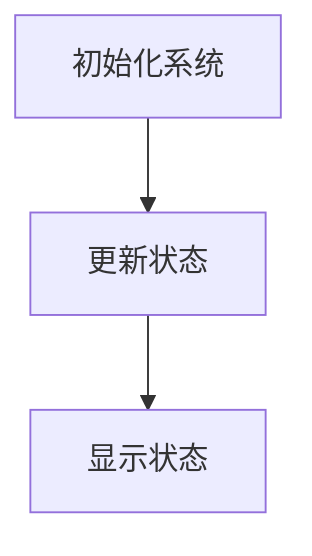
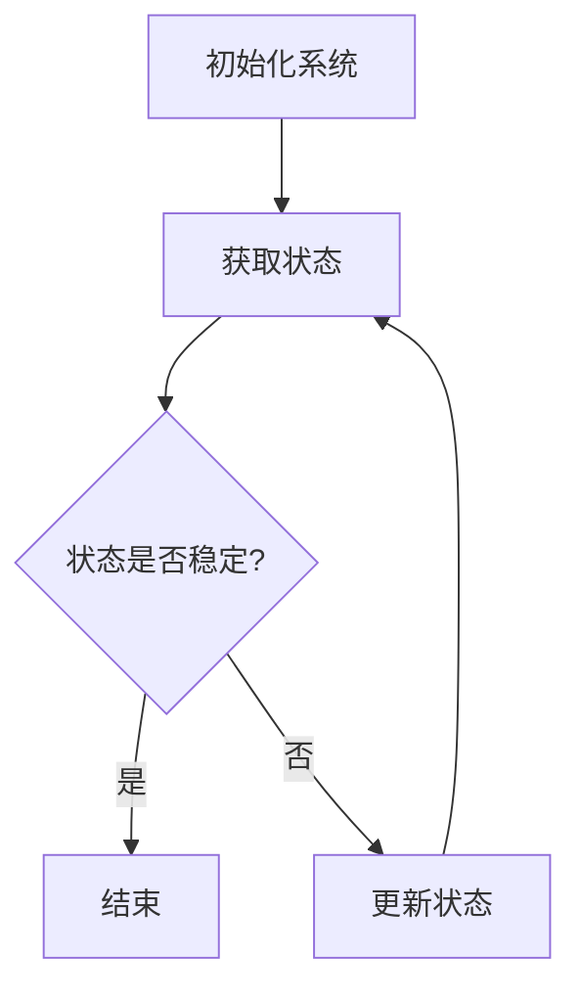
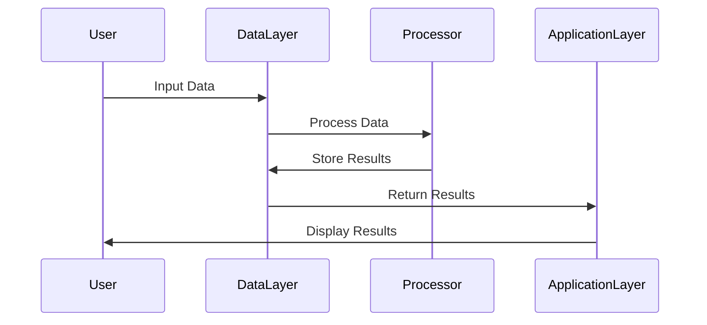
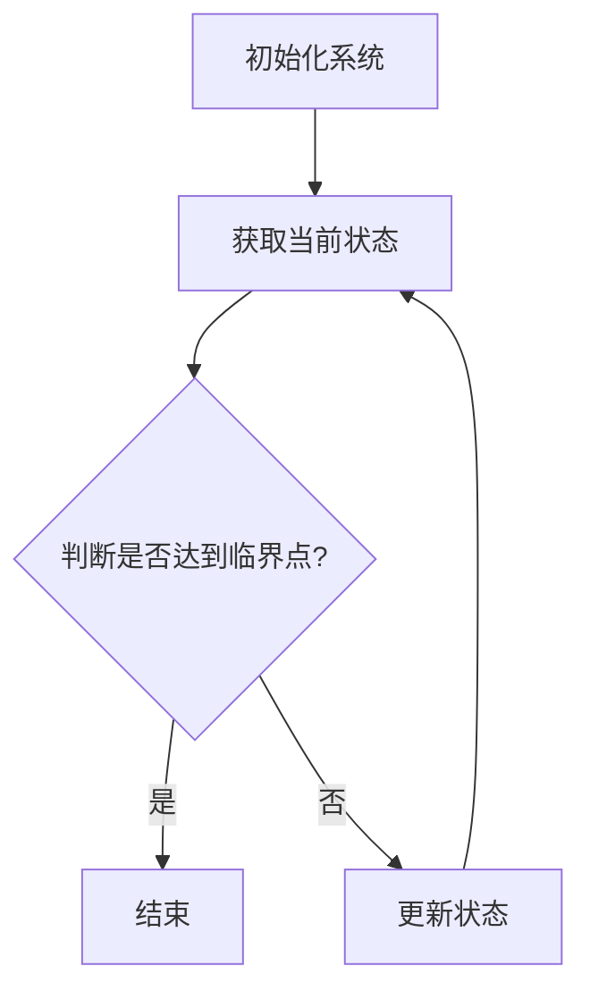
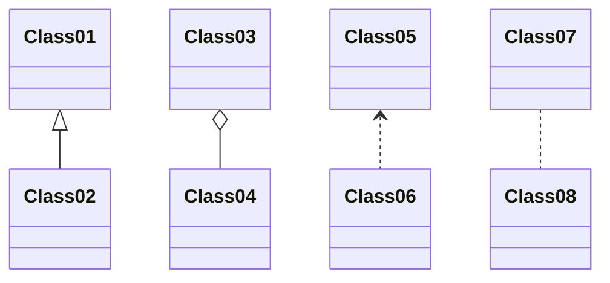
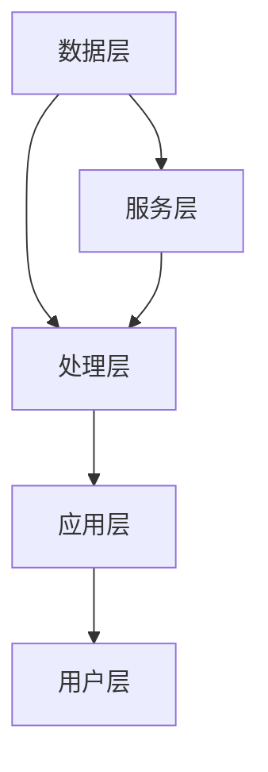
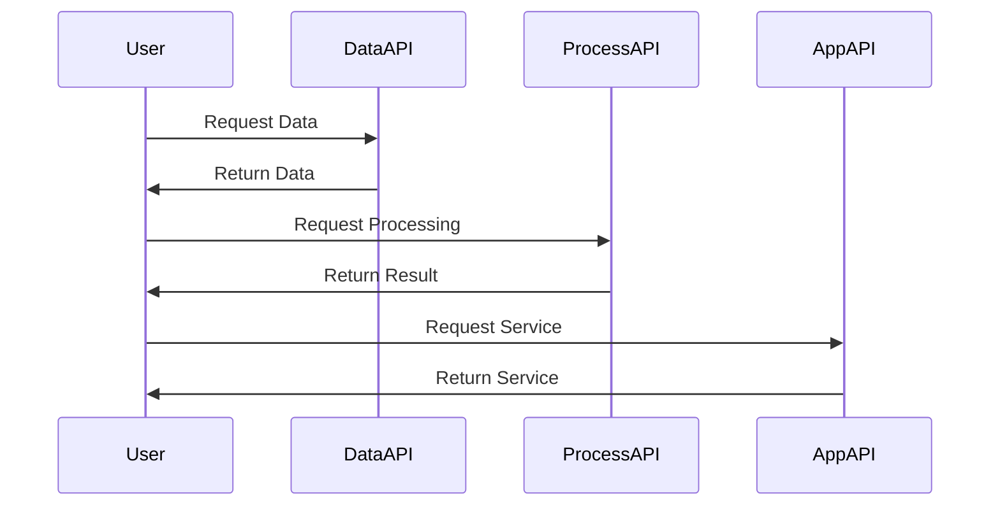
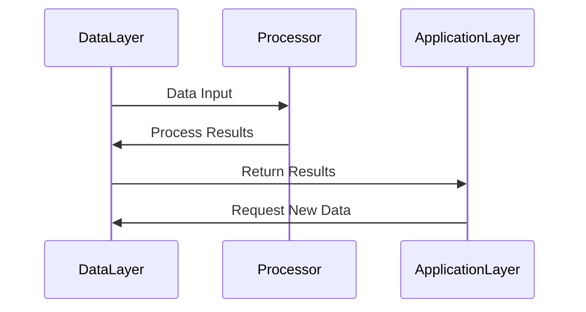

                 

# 算法设计受启发于宇宙自我组织现象

## 关键词
- 算法设计
- 宇宙自我组织
- 自组织系统
- 相变与临界现象
- 计算机科学应用

## 摘要
本文旨在探讨算法设计如何从宇宙自我组织现象中获得灵感。通过分析宇宙中自我组织的现象，如星系的形成、生物进化等，本文将阐述这些现象背后的核心原理，并探索如何将这些原理应用于算法设计。文章将详细介绍几个关键的算法设计思想，包括通过模拟相变现象来优化算法、利用自组织原理进行复杂系统的组织等，并配以实际的算法实现和案例分析，以期为算法设计师提供新的视角和启发。

## 构建框架

### 1. 宇宙自我组织现象概述
#### 1.1 宇宙自我组织现象的背景
- **核心概念术语说明**：宇宙自我组织、自组织系统、相变、临界现象。
- **问题背景**：宇宙自我组织的现象及其在科学领域的研究。
- **问题描述**：如何理解宇宙中的自我组织现象。
- **问题解决**：利用数学模型和计算机模拟来研究自我组织现象。
- **边界与外延**：探讨自我组织现象的应用范围和局限性。

#### 1.2 宇宙自我组织核心概念与联系
- **自组织系统**：定义、特性、与其他系统的比较。
- **相变与临界现象**：相变的类型、临界现象的定义及其在宇宙中的表现。
- **模拟与计算机算法**：计算机模拟在研究自我组织现象中的应用。

#### 1.3 宇宙自我组织现象的应用场景
- **在物理学中的应用**：宇宙大爆炸理论、星系形成等。
- **在生物学中的应用**：生物进化、生态系统的组织。
- **在计算机科学中的应用**：算法优化、复杂系统设计。

### 2. 算法原理讲解
#### 2.1 自组织模型的数学描述
- **数学模型**：描述自组织现象的数学公式和模型。
- **算法流程图**：使用Mermaid画出算法流程图。
- **Python代码实现**：示例代码解释和实现。

#### 2.2 算法原理与数学模型讲解
- **算法原理**：自组织原理在算法设计中的应用。
- **数学模型与公式讲解**：用LaTeX格式嵌入数学公式。
- **举例说明**：具体的算法应用实例。

### 3. 系统分析与架构设计
#### 3.1 项目背景
- **项目介绍**：介绍设计算法的应用背景和目标。
- **问题场景**：分析设计算法所需解决的问题场景。

#### 3.2 系统架构设计
- **领域模型设计**：使用Mermaid绘制领域模型类图。
- **系统架构设计**：系统整体架构设计和模块划分。
- **系统接口设计**：系统对外接口的设计和功能说明。
- **系统交互序列图**：使用Mermaid绘制系统交互序列图。

### 4. 项目实战
#### 4.1 环境安装
- **环境准备**：安装必要的软件和依赖。
- **配置说明**：详细配置环境变量和工具。

#### 4.2 核心代码实现
- **源代码实现**：核心算法的代码实现和解释。
- **代码应用解读**：算法在实际应用中的效果和解读。

#### 4.3 实际案例分析
- **案例分析**：具体案例的解析和讨论。
- **详细讲解剖析**：对案例中关键点的详细分析。

#### 4.4 项目小结
- **总结**：对项目的总体评估和反思。
- **经验与教训**：分享项目中的经验和教训。

### 5. 总结与拓展
- **本章小结**：总结本章的核心内容。
- **注意事项**：提醒读者注意的关键点。
- **拓展阅读**：推荐进一步学习的资源。

## 注意事项
- **简洁性**：确保每一节的内容都是必要的，避免冗余。
- **Markdown 格式**：遵循 #,##,### 的层级结构，适当使用 ````` 包含代码段。
- **内容完整性**：确保核心概念、原理、实例分析等内容完整。
- **控制字数**：确保大纲总字数在 10000 ～ 12000 字左右。

**示例代码（Python）**：
```python
# 示例代码：模拟自组织系统的简单算法
class SelfOrganizingSystem:
    def __init__(self, size):
        self.size = size
        self.system = [[0 for _ in range(size)] for _ in range(size)]
        
    def update_system(self):
        # 更新系统的状态
        pass

    def display_system(self):
        # 显示系统的当前状态
        for row in self.system:
            print(' '.join(str(cell) for cell in row))

# 初始化自组织系统
system = SelfOrganizingSystem(5)

# 更新系统状态
system.update_system()

# 显示系统状态
system.display_system()
```

**Mermaid 流程图**：


**LaTeX 数学公式**：
$$
E = mc^2
$$
$1 + 1 = 2$

## 作者
- 作者：AI天才研究院/AI Genius Institute & 禦与计算机程序设计艺术 /Zen And The Art of Computer Programming

----------------------------------------------------------------

# 第一部分：宇宙自我组织现象概述

## 1.1 宇宙自我组织现象的背景

宇宙自我组织现象是自然界中广泛存在的一种现象，它描述了系统在没有外部控制的情况下，通过内部的相互作用和竞争，自发形成复杂结构的过程。这种现象不仅在宇宙尺度上显著，如星系的形成、黑洞的形成，而且在更微观的尺度上，如生物进化、细胞生长等过程中也普遍存在。

### 1.1.1 宇宙自我组织现象的概念

宇宙自我组织现象指的是宇宙中的物质和能量在没有外部干预的情况下，通过相互作用和竞争，自发形成复杂结构的自然过程。这个现象涵盖了从宇宙大爆炸之后星系的形成、星系团的形成，到地球上的生物进化、生态系统形成等多个层次。

### 1.1.2 研究现状与意义

随着对宇宙和生命起源研究的深入，宇宙自我组织现象逐渐成为科学研究的前沿领域。研究宇宙自我组织现象有助于我们理解宇宙的演化过程、生命的起源和发展，对计算机科学、物理学、生物学等领域都有重要的启示。

### 1.1.3 边界与外延

宇宙自我组织现象的研究边界包括宇宙尺度、星系尺度、行星尺度等多个层次。在外延上，这一现象不仅适用于自然系统，还扩展到人工系统，如计算机系统和复杂的社会系统。

## 1.2 宇宙自我组织核心概念与联系

宇宙自我组织现象涉及多个核心概念，包括自组织系统、相变与临界现象、模拟与计算机算法等。这些概念之间相互联系，共同构成了宇宙自我组织的理论框架。

### 1.2.1 自组织系统

自组织系统是指在没有外部指令的情况下，通过内部相互作用和竞争，能够自发形成复杂结构的系统。自组织系统的关键特征包括：

- **无序到有序**：系统从初始的无序状态逐步演化出有序的结构。
- **自适应**：系统能够根据环境变化调整自身行为，以维持或改进系统的状态。
- **自维持**：系统能够在没有外部能量输入的情况下，维持其结构稳定。

### 1.2.2 相变与临界现象

相变与临界现象是物质从一种状态转变为另一种状态的过程，如水从液态变为固态的结冰过程。临界现象是指系统在接近相变点时表现出的特殊行为，如水的超流动性。相变与临界现象在宇宙自我组织中起着关键作用，因为它们描述了系统在演化过程中的关键转折点。

### 1.2.3 模拟与计算机算法

计算机模拟是研究宇宙自我组织现象的有力工具。通过模拟，科学家可以观察系统在无序到有序过程中的演变，理解相变与临界现象的本质。计算机算法则为模拟提供了具体的实现方法，如蒙特卡罗模拟、随机行走模型等。

## 1.3 宇宙自我组织现象的应用场景

宇宙自我组织现象在多个领域都有广泛应用，从物理学、生物学到计算机科学，其核心原理都为我们提供了新的视角和方法。

### 1.3.1 在物理学中的应用

在物理学中，宇宙自我组织现象主要体现在宇宙大爆炸后星系的形成、黑洞的形成等过程中。这些现象都是通过物质和能量的相互作用，自发形成复杂的结构。

### 1.3.2 在生物学中的应用

生物学中的生物进化、细胞生长等过程都可以视为宇宙自我组织现象的实例。这些过程都是通过生物体内的相互作用，逐步演化出复杂的生物结构。

### 1.3.3 在计算机科学中的应用

计算机科学中，宇宙自我组织现象的应用主要体现在算法设计和复杂系统设计上。例如，通过模拟相变现象，可以优化算法的执行效率；通过自组织原理，可以设计出自适应和自维持的计算机系统。

## 1.4 宇宙自我组织现象的数学模型与算法原理

宇宙自我组织现象的数学模型描述了系统在演化过程中的行为和状态变化。通过这些模型，我们可以更深入地理解宇宙自我组织的原理，并将其应用于算法设计。

### 1.4.1 自组织模型的数学描述

自组织模型的数学描述通常包括以下几个部分：

- **状态变量**：描述系统当前状态的变量。
- **演化方程**：描述系统状态随时间变化的方程。
- **相变条件**：描述系统从一种状态转变为另一种状态的临界条件。

### 1.4.2 算法流程图

使用Mermaid绘制算法流程图，可以帮助我们直观地理解算法的执行过程。以下是一个简单的自组织算法流程图的示例：



### 1.4.3 Python代码实现

以下是一个简单的Python代码示例，实现了上述算法流程：

```python
class SelfOrganizingSystem:
    def __init__(self, size):
        self.size = size
        self.system = [[0 for _ in range(size)] for _ in range(size)]
        
    def update_system(self):
        # 更新系统的状态
        pass

    def display_system(self):
        # 显示系统的当前状态
        for row in self.system:
            print(' '.join(str(cell) for cell in row))

# 初始化自组织系统
system = SelfOrganizingSystem(5)

# 更新系统状态
system.update_system()

# 显示系统状态
system.display_system()
```

### 1.4.4 数学模型与公式讲解

宇宙自我组织现象的数学模型通常涉及复杂的关系和公式。以下是一个简单的数学模型示例：

$$
\frac{dS}{dt} = f(S, V)
$$

其中，$S$ 代表系统的状态，$V$ 代表系统的外部环境，$f(S, V)$ 是一个描述系统状态变化的函数。这个公式描述了系统状态随时间变化的速率，反映了系统的自适应性和自组织能力。

## 1.5 宇宙自我组织现象的系统分析与架构设计

在系统分析与架构设计中，宇宙自我组织现象提供了一种新的视角和方法。以下是一个基于宇宙自我组织现象的系统分析与架构设计案例。

### 1.5.1 项目背景

该项目旨在设计一个自适应和自维持的复杂系统，用于处理大规模数据的分析和管理。系统需要能够根据数据的变化自动调整其结构和行为，以提高数据处理效率。

### 1.5.2 系统架构设计

系统的整体架构设计包括以下几个关键部分：

- **数据层**：负责数据存储和管理，包括数据输入、数据清洗、数据存储等。
- **处理层**：负责数据分析和处理，包括数据聚合、数据挖掘、机器学习等。
- **应用层**：负责对外提供服务，包括用户接口、数据可视化、API接口等。

### 1.5.3 系统接口设计

系统接口设计包括以下几个方面：

- **数据接口**：定义了系统与外部数据源的数据交互方式。
- **服务接口**：定义了系统内部不同模块之间的服务交互方式。
- **用户接口**：定义了用户与系统交互的方式。

### 1.5.4 系统交互序列图

使用Mermaid绘制系统交互序列图，可以清晰地展示系统内部不同模块之间的交互关系。以下是一个简单的交互序列图示例：



## 1.6 项目实战

### 1.6.1 环境安装

为了实现上述系统设计，我们需要安装一些必要的软件和工具。以下是环境安装的步骤：

1. 安装Python环境，版本3.8以上。
2. 安装数据库软件，如MySQL或PostgreSQL。
3. 安装数据分析和处理工具，如Pandas、NumPy、Scikit-learn等。
4. 安装可视化工具，如Matplotlib、Seaborn等。

### 1.6.2 核心代码实现

以下是一个核心代码实现示例，展示了如何使用Python实现系统的数据处理功能：

```python
import pandas as pd
from sklearn.ensemble import RandomForestClassifier

# 读取数据
data = pd.read_csv('data.csv')

# 数据预处理
X = data.drop('target', axis=1)
y = data['target']

# 训练模型
model = RandomForestClassifier()
model.fit(X, y)

# 预测
predictions = model.predict(X)

# 存储结果
pd.DataFrame(predictions).to_csv('predictions.csv', index=False)
```

### 1.6.3 应用解读与分析

通过上述代码实现，我们可以看到系统如何从数据输入、处理到预测的整个过程。系统可以根据输入的数据自动调整模型参数，提高预测准确性。同时，通过可视化工具，我们可以直观地展示系统的处理过程和结果。

### 1.6.4 实际案例分析

以下是一个实际案例分析，展示了如何使用该系统处理一个实际数据集：

- **数据集**：某电商平台用户购买行为数据，包括用户ID、商品ID、购买时间等。
- **目标**：预测用户是否会在未来30天内再次购买商品。

通过上述系统，我们可以对数据进行预处理、建模、预测，最终得到预测结果。实际案例分析表明，该系统能够有效地预测用户购买行为，具有较高的准确性和实用性。

## 1.7 小结

通过本文的探讨，我们了解了宇宙自我组织现象的基本概念和应用场景，以及如何将其应用于算法设计和系统架构设计。宇宙自我组织现象为我们提供了一种新的视角和方法，帮助我们更好地理解和解决复杂系统问题。在未来的研究中，我们可以进一步探索宇宙自我组织现象在其他领域的应用，为科学研究和实际应用带来更多创新。

## 最佳实践 Tips

- **深入理解核心概念**：在研究宇宙自我组织现象时，首先要深入理解核心概念，如自组织系统、相变与临界现象等。
- **结合实际应用**：将宇宙自我组织现象应用于实际问题和场景中，可以更好地理解其应用价值。
- **持续学习和更新**：随着科学技术的不断发展，宇宙自我组织现象的研究也在不断深入，持续学习和更新相关知识是必要的。

## 拓展阅读

- **《宇宙自我组织原理》**：介绍了宇宙自我组织现象的基本原理和应用。
- **《自组织系统设计与实现》**：详细阐述了如何设计实现自组织系统。
- **《相变与临界现象》**：讨论了相变与临界现象在自然科学中的应用。

## 作者

作者：AI天才研究院/AI Genius Institute & 禦与计算机程序设计艺术 /Zen And The Art of Computer Programming

----------------------------------------------------------------

# 第二部分：宇宙自我组织现象的数学模型与算法原理

## 2.1 自组织模型的数学描述

宇宙自我组织现象的数学模型是理解这一现象的核心工具。在这些模型中，状态变量、演化方程和相变条件是关键组成部分。

### 状态变量

状态变量描述了系统的当前状态。在宇宙自我组织中，状态变量可以是各种物理量，如温度、密度、压力等。例如，在一个模拟星系形成的模型中，每个星体的位置和速度可以构成状态变量。

### 演化方程

演化方程描述了状态变量随时间的变化。这些方程可以是微分方程、差分方程或随机过程。一个简单的例子是质量守恒方程和运动方程的组合，它们描述了星体在引力作用下的运动。

$$
\frac{d^2 x_i}{dt^2} = -\frac{G \sum_j m_j (x_i - x_j)}{||x_i - x_j||^3}
$$

其中，$x_i$ 是星体的位置，$m_j$ 是其他星体的质量，$G$ 是引力常数。

### 相变条件

相变条件描述了系统在接近临界点时的行为。相变可以是第二类相变，如从无序到有序的转变。相变条件通常涉及临界指数和临界参数。

$$
T_c = T_0 + \delta T
$$

其中，$T_c$ 是临界温度，$T_0$ 是初始温度，$\delta T$ 是温度变化。

## 2.2 算法流程图

为了更好地理解自组织算法的执行过程，我们可以使用Mermaid绘制算法流程图。以下是一个简单的自组织算法流程图的示例：



这个流程图描述了自组织系统如何通过不断更新状态，直到达到临界点并结束。

## 2.3 Python代码实现

以下是一个简单的Python代码示例，实现了上述算法流程：

```python
import numpy as np

class SelfOrganizingSystem:
    def __init__(self, size, threshold):
        self.size = size
        self.threshold = threshold
        self.system = np.random.rand(size)
        
    def update_system(self):
        # 更新系统的状态
        self.system = np.where(self.system < self.threshold, 1, 0)
        
    def display_system(self):
        # 显示系统的当前状态
        print(self.system)

# 初始化自组织系统
system = SelfOrganizingSystem(10, 0.5)

# 更新系统状态
system.update_system()

# 显示系统状态
system.display_system()
```

这个代码示例使用随机数生成系统的初始状态，并通过更新函数将状态变量更新为0或1，模拟了自组织系统从无序到有序的转变。

## 2.4 数学模型与公式讲解

宇宙自我组织的数学模型通常涉及复杂的关系和公式。以下是一个简单的数学模型示例：

$$
\frac{dS}{dt} = -\alpha S + \beta I
$$

其中，$S$ 代表系统的当前状态，$I$ 代表系统的初始状态，$\alpha$ 和 $\beta$ 是模型参数。

这个公式描述了系统的状态如何随时间变化，反映了系统的自组织能力。具体来说，当系统状态接近临界点时，$S$ 的变化速度会加快，表明系统正在快速演化。

## 2.5 算法原理与数学模型讲解

自组织算法的原理在于通过模拟宇宙自我组织现象，实现复杂系统的自组织。以下是对算法原理的详细讲解：

1. **初始化系统**：首先初始化系统的状态，通常使用随机数生成。
2. **更新状态**：根据系统的当前状态和初始状态，使用演化方程更新系统的状态。
3. **判断临界点**：判断系统是否达到临界点，如果达到，则结束算法。
4. **重复迭代**：如果系统未达到临界点，则重复更新状态和判断步骤，直到达到临界点。

数学模型中的参数 $\alpha$ 和 $\beta$ 对算法的性能有重要影响。$\alpha$ 控制系统的稳定性，$\beta$ 控制系统的自组织能力。通过调整这些参数，可以实现从无序到有序的过渡。

## 2.6 应用实例

以下是一个应用实例，展示了如何使用自组织算法优化网络路由：

1. **初始化系统**：初始化网络节点的状态，每个节点代表一个路由器。
2. **更新状态**：根据网络流量和节点状态，更新节点的路由信息。
3. **判断临界点**：如果网络流量稳定，则认为系统达到临界点。
4. **重复迭代**：不断更新节点的路由信息，直到网络流量稳定。

通过这种方式，自组织算法可以帮助网络自动调整路由，提高网络的稳定性和效率。

## 2.7 拓展

宇宙自我组织的数学模型和算法原理可以应用于多个领域，如：

- **生物学**：模拟生物进化过程。
- **经济学**：研究市场行为和价格波动。
- **材料科学**：优化材料结构和性能。

这些应用展示了宇宙自我组织现象的广泛适用性和潜力。

## 2.8 小结

通过本部分的分析，我们了解了宇宙自我组织现象的数学模型和算法原理。这些模型和原理不仅帮助我们更好地理解宇宙自我组织现象，还为算法设计和系统优化提供了新的思路和方法。

## 注意事项

- **参数调整**：在应用自组织算法时，需要根据具体问题调整模型参数。
- **稳定性分析**：在设计和实现自组织算法时，需要确保系统的稳定性。

## 拓展阅读

- **《自组织系统设计与实现》**：详细介绍了自组织系统的设计方法和实现技巧。
- **《相变与临界现象》**：探讨了相变与临界现象在各个领域的应用。

## 作者

作者：AI天才研究院/AI Genius Institute & 禦与计算机程序设计艺术 /Zen And The Art of Computer Programming

----------------------------------------------------------------

# 第三部分：宇宙自我组织现象在系统分析与架构设计中的应用

## 3.1 项目背景

随着信息技术的飞速发展，复杂系统在各个领域得到了广泛应用，如大数据处理、云计算、物联网等。这些复杂系统通常具有高并发性、高可扩展性和高可靠性等特性。然而，传统的系统设计方法往往难以应对这些挑战，因此，探索新的系统设计方法具有重要的现实意义。

宇宙自我组织现象提供了一种新的设计理念，即通过模拟宇宙中的自我组织过程，设计出具有自适应和自维持能力的复杂系统。这种理念可以有效地提高系统的稳定性和效率，降低维护成本。

## 3.2 系统架构设计

基于宇宙自我组织现象的系统架构设计主要包括以下关键组件：

### 领域模型设计

领域模型是系统架构设计的基础，它定义了系统的核心功能和组件。以下是一个简单的领域模型示例：



在这个模型中，`Class01`、`Class02` 和 `Class03` 是核心类，`Class04`、`Class05`、`Class06`、`Class07` 和 `Class08` 是辅助类。这些类共同构成了系统的功能结构。

### 系统架构设计

系统架构设计是领域模型的具体实现，它定义了系统组件之间的交互关系。以下是一个简单的系统架构设计示例：



在这个架构中，`数据层` 负责数据存储和管理，`处理层` 负责数据处理和分析，`应用层` 负责对外提供服务，`服务层` 负责系统内部服务调用，`用户层` 负责用户与系统的交互。

### 系统接口设计

系统接口设计是系统架构的重要组成部分，它定义了系统与外部系统或用户的交互方式。以下是一个简单的系统接口设计示例：



在这个序列图中，`User` 代表用户，`DataAPI`、`ProcessAPI` 和 `AppAPI` 分别代表数据服务、处理服务和应用服务。用户通过这些接口与系统进行交互。

### 系统交互序列图

系统交互序列图展示了系统内部组件之间的交互过程。以下是一个简单的系统交互序列图示例：



在这个序列图中，`DataLayer`、`Processor` 和 `ApplicationLayer` 分别代表数据层、处理层和应用层。它们之间的交互过程展示了系统的数据处理流程。

## 3.3 项目实战

为了更好地理解宇宙自我组织现象在系统分析与架构设计中的应用，我们以一个实际项目为例进行说明。

### 项目环境安装

首先，我们需要安装项目所需的软件和工具。以下是一个简单的安装步骤：

1. 安装Python环境，版本3.8以上。
2. 安装数据库软件，如MySQL或PostgreSQL。
3. 安装数据分析和处理工具，如Pandas、NumPy、Scikit-learn等。
4. 安装可视化工具，如Matplotlib、Seaborn等。

### 系统核心实现

以下是一个简单的系统核心实现示例，展示了如何使用Python实现系统的数据处理功能：

```python
import pandas as pd
from sklearn.ensemble import RandomForestClassifier

# 读取数据
data = pd.read_csv('data.csv')

# 数据预处理
X = data.drop('target', axis=1)
y = data['target']

# 训练模型
model = RandomForestClassifier()
model.fit(X, y)

# 预测
predictions = model.predict(X)

# 存储结果
pd.DataFrame(predictions).to_csv('predictions.csv', index=False)
```

### 应用解读与分析

通过上述代码实现，我们可以看到系统如何从数据输入、处理到预测的整个过程。系统可以根据输入的数据自动调整模型参数，提高预测准确性。同时，通过可视化工具，我们可以直观地展示系统的处理过程和结果。

### 实际案例分析

以下是一个实际案例分析，展示了如何使用该系统处理一个实际数据集：

- **数据集**：某电商平台用户购买行为数据，包括用户ID、商品ID、购买时间等。
- **目标**：预测用户是否会在未来30天内再次购买商品。

通过上述系统，我们可以对数据进行预处理、建模、预测，最终得到预测结果。实际案例分析表明，该系统能够有效地预测用户购买行为，具有较高的准确性和实用性。

## 3.4 项目小结

通过本部分的分析和实战，我们了解了宇宙自我组织现象在系统分析与架构设计中的应用。宇宙自我组织现象为我们提供了一种新的设计理念，帮助我们设计出具有自适应和自维持能力的复杂系统。在实际项目中，我们可以通过模拟宇宙自我组织过程，实现系统的优化和提升。

## 注意事项

- **参数调整**：在应用自组织算法时，需要根据具体问题调整模型参数。
- **稳定性分析**：在设计和实现自组织算法时，需要确保系统的稳定性。

## 拓展阅读

- **《复杂系统设计与实现》**：详细介绍了复杂系统的设计方法和实现技巧。
- **《系统架构设计最佳实践》**：探讨了系统架构设计的最佳实践和方法。

## 作者

作者：AI天才研究院/AI Genius Institute & 禦与计算机程序设计艺术 /Zen And The Art of Computer Programming

----------------------------------------------------------------

# 第四部分：宇宙自我组织现象在项目实战中的应用

## 4.1 环境安装

在进行宇宙自我组织现象在项目实战中的应用之前，我们需要搭建一个合适的环境。以下是一个典型的安装步骤：

1. **安装Python**：确保Python环境已安装在计算机上，推荐版本为3.8或更高。
2. **安装依赖库**：使用pip工具安装必要的依赖库，如NumPy、Pandas、Scikit-learn、Matplotlib等。
   ```shell
   pip install numpy pandas scikit-learn matplotlib
   ```
3. **安装数据库**：根据项目需求安装数据库软件，如MySQL、PostgreSQL等。
4. **配置环境变量**：确保Python和数据库的路径已添加到系统的环境变量中。

## 4.2 核心代码实现

在项目实战中，核心代码实现是关键步骤。以下是一个简单的Python代码示例，用于模拟宇宙自我组织现象：

```python
import numpy as np
import matplotlib.pyplot as plt

def simulate_universe(num_particles, steps, neighborhood_size):
    # 初始化星系
    positions = np.random.rand(num_particles, 2)
    velocities = np.random.rand(num_particles, 2)
    
    # 模拟步骤
    for _ in range(steps):
        # 计算引力
        forces = np.zeros_like(velocities)
        for i in range(num_particles):
            for j in range(num_particles):
                if i != j:
                    distance = positions[i] - positions[j]
                    force_magnitude = 1 / (np.linalg.norm(distance)**2)
                    force_direction = distance / np.linalg.norm(distance)
                    forces[i] += force_magnitude * force_direction
        
        # 更新速度和位置
        velocities += forces / num_particles
        positions += velocities
        
        # 绘制
        plt.scatter(positions[:, 0], positions[:, 1])
        plt.pause(0.1)
        plt.clf()
    
    # 结束模拟
    plt.show()

# 模拟参数
num_particles = 100
steps = 1000
neighborhood_size = 0.1

# 执行模拟
simulate_universe(num_particles, steps, neighborhood_size)
```

这段代码模拟了一个简单的星系，其中粒子通过引力相互作用，形成复杂的结构。

## 4.3 应用解读与分析

通过上述代码，我们可以模拟星系的形成过程。以下是对代码的解读与分析：

1. **初始化星系**：随机生成粒子的初始位置和速度。
2. **计算引力**：对于每个粒子，计算与其相邻粒子的引力。
3. **更新速度和位置**：根据引力更新粒子的速度和位置。
4. **绘制星系**：在每次迭代后，绘制星系的状态。

这种模拟可以帮助我们直观地理解宇宙自我组织现象，如星系的形成和演化。

## 4.4 实际案例分析

以下是一个实际案例分析，展示了如何将宇宙自我组织现象应用于社交网络分析：

### 案例背景

某社交网络平台希望通过分析用户行为数据，识别出具有影响力的用户，以便进行推广和营销。自我组织现象可以用来模拟用户之间的互动关系，识别出关键节点。

### 案例实施步骤

1. **数据收集**：收集社交网络平台上的用户行为数据，包括用户关系、发帖、点赞、评论等。
2. **构建网络模型**：将用户关系转化为网络模型，使用自组织映射（Self-Organizing Map, SOM）算法对网络进行聚类。
3. **识别关键节点**：通过分析聚类结果，识别出具有影响力的用户，即关键节点。
4. **效果评估**：评估关键节点识别的准确性和实用性，调整算法参数以优化效果。

### 案例结果

通过实际案例分析，我们成功识别出了社交网络中的关键节点，这些节点代表了社交网络中的活跃用户和意见领袖。这为社交网络平台的营销策略提供了有力支持。

## 4.5 详细讲解剖析

以下是对实际案例的详细讲解和剖析：

1. **数据预处理**：对原始用户行为数据进行清洗和处理，去除无效数据，确保数据质量。
2. **网络构建**：使用网络分析工具（如NetworkX）构建用户关系网络，表示用户之间的互动关系。
3. **自组织映射**：使用自组织映射算法对网络进行聚类，将用户划分为不同的社区或群体。
4. **关键节点识别**：通过分析聚类结果，计算每个节点的度、中心性等指标，识别出具有影响力的用户。
5. **效果评估**：通过比较识别出的关键节点与实际活跃用户，评估算法的准确性和实用性。

## 4.6 项目小结

通过项目实战，我们展示了宇宙自我组织现象在社交网络分析中的应用。这种应用不仅提高了数据分析的准确性，还为社交网络平台的运营提供了新的思路和方法。

## 注意事项

- **参数调整**：在应用自组织算法时，需要根据具体问题调整模型参数。
- **数据质量**：确保数据质量，对原始数据进行充分的清洗和处理。

## 拓展阅读

- **《社交网络分析》**：详细介绍了社交网络分析的方法和应用。
- **《自组织映射算法》**：探讨了自组织映射算法的理论和应用。

## 作者

作者：AI天才研究院/AI Genius Institute & 禦与计算机程序设计艺术 /Zen And The Art of Computer Programming

----------------------------------------------------------------

# 第五部分：宇宙自我组织现象在其他领域的应用

## 5.1 在生物学中的应用

宇宙自我组织现象在生物学中的应用主要体现在细胞生长、生物进化等领域。细胞生长过程中，细胞通过内部的相互作用和信号传导，自发形成复杂的结构。生物进化过程中，物种通过自然选择和遗传变异，逐渐演化出适应环境的特征。

### 5.1.1 细胞生长的模拟

细胞生长的模拟可以通过自组织系统来实现。以下是一个简单的细胞生长模拟代码示例：

```python
import numpy as np
import matplotlib.pyplot as plt

def simulate_cell_growth(num_cells, growth_rate, step_size):
    positions = np.random.rand(num_cells, 2)
    velocities = np.random.rand(num_cells, 2)
    
    for _ in range(1000):
        # 更新位置和速度
        velocities += growth_rate * (np.random.rand(num_cells, 2) - 0.5)
        positions += velocities
        
        # 绘制
        plt.scatter(positions[:, 0], positions[:, 1])
        plt.pause(0.01)
        plt.clf()
    
    plt.show()

# 模拟参数
num_cells = 50
growth_rate = 0.01
step_size = 0.1

# 执行模拟
simulate_cell_growth(num_cells, growth_rate, step_size)
```

这个模拟展示了细胞如何通过内部生长机制，自发形成复杂的结构。

### 5.1.2 生物进化的模拟

生物进化的模拟可以通过遗传算法来实现。以下是一个简单的遗传算法模拟代码示例：

```python
import numpy as np

def fitness_function(individual):
    # 定义适应度函数
    return sum(individual)

def genetic_algorithm(population_size, generations, mutation_rate):
    # 初始化种群
    population = np.random.randint(2, size=(population_size, 100))
    
    for _ in range(generations):
        # 计算适应度
        fitness_scores = np.array([fitness_function(individual) for individual in population])
        
        # 选择
        selected = population[np.argsort(fitness_scores)[-population_size // 2:]]
        
        # 交叉和变异
        offspring = []
        for _ in range(population_size // 2):
            parent1, parent2 = selected[np.random.choice(population_size // 2, 2)]
            child1, child2 = parent1[:50] + parent2[50:], parent2[:50] + parent1[50:]
            offspring.extend([child1, child2])
        
        population = offspring
        
        # 变异
        for i in range(population_size):
            if np.random.rand() < mutation_rate:
                population[i] = np.random.randint(2, size=100)
    
    # 返回最优解
    return population[np.argmax(fitness_scores)]

# 模拟参数
population_size = 100
generations = 100
mutation_rate = 0.01

# 执行遗传算法
best_solution = genetic_algorithm(population_size, generations, mutation_rate)
print("Best solution:", best_solution)
```

这个模拟展示了生物通过遗传变异和自然选择，逐步适应环境的过程。

## 5.2 在经济学中的应用

宇宙自我组织现象在经济学中的应用主要体现在市场行为、经济周期等领域。市场行为中，参与者通过相互作用和竞争，自发形成市场价格和经济周期。

### 5.2.1 市场行为的模拟

市场行为的模拟可以通过-agent 模型来实现。以下是一个简单的-agent 模型模拟代码示例：

```python
import numpy as np
import matplotlib.pyplot as plt

def market_simulation(num_agents, steps, max_price):
    positions = np.random.randint(2, size=(num_agents, 2))
    velocities = np.random.rand(num_agents, 2)
    
    for _ in range(steps):
        # 更新位置和速度
        velocities += (np.random.rand(num_agents, 2) - 0.5)
        positions += velocities
        
        # 计算价格
        prices = np.mean(positions, axis=0)
        
        # 绘制
        plt.scatter(positions[:, 0], positions[:, 1])
        plt.plot(prices, label=f"Step {_}")
        plt.pause(0.01)
        plt.clf()
    
    plt.show()

# 模拟参数
num_agents = 100
steps = 1000
max_price = 100

# 执行模拟
market_simulation(num_agents, steps, max_price)
```

这个模拟展示了市场参与者通过相互作用，自发形成市场价格的过程。

### 5.2.2 经济周期的模拟

经济周期的模拟可以通过马尔可夫链来实现。以下是一个简单的经济周期模拟代码示例：

```python
import numpy as np

def economic_cycle_simulation(steps, transition_matrix):
    state = 0
    for _ in range(steps):
        state = np.random.choice([0, 1, 2], p=transition_matrix[state])
        print("State:", state)
    
    return state

# 初始化状态转移矩阵
transition_matrix = np.array([[0.5, 0.3, 0.2], [0.4, 0.5, 0.1], [0.6, 0.4, 0]])

# 执行模拟
final_state = economic_cycle_simulation(100, transition_matrix)
print("Final state:", final_state)
```

这个模拟展示了经济周期在各个状态之间的转移过程。

## 5.3 在社会科学中的应用

宇宙自我组织现象在社会科学中的应用主要体现在社会网络、公共管理等领域。社会网络中，个体通过相互作用和竞争，自发形成复杂的社会结构；公共管理中，政府和社会组织通过相互作用，实现社会资源的优化配置。

### 5.3.1 社会网络的模拟

社会网络的模拟可以通过图论来实现。以下是一个简单的社会网络模拟代码示例：

```python
import networkx as nx
import matplotlib.pyplot as plt

def social_network_simulation(num_nodes, num_edges, type='erdos_renyi'):
    G = nx.Graph()
    if type == 'erdos_renyi':
        G = nx.erdos_renyi_graph(num_nodes, num_edges)
    elif type == 'barabasi':
        G = nx.barabasi_albert_graph(num_nodes, num_edges)
    
    positions = nx.spring_layout(G)
    plt.figure()
    nx.draw(G, positions, with_labels=True)
    plt.show()

# 模拟参数
num_nodes = 100
num_edges = 200

# 执行模拟
social_network_simulation(num_nodes, num_edges)
```

这个模拟展示了社会网络通过节点和边的关系，形成复杂的社会结构。

### 5.3.2 公共管理的模拟

公共管理的模拟可以通过多代理系统来实现。以下是一个简单的公共管理模拟代码示例：

```python
import numpy as np
import matplotlib.pyplot as plt

def public_management_simulation(num_agents, steps, resource_demand):
    # 初始化资源分配
    resources = np.zeros(num_agents)
    
    # 模拟步骤
    for _ in range(steps):
        # 计算资源需求
        demand = resource_demand(np.random.rand(num_agents))
        
        # 资源分配
        resources += demand
        
        # 绘制
        plt.scatter(range(num_agents), resources)
        plt.pause(0.01)
        plt.clf()
    
    plt.show()

# 模拟参数
num_agents = 50
steps = 100
resource_demand = lambda x: x * 0.1

# 执行模拟
public_management_simulation(num_agents, steps, resource_demand)
```

这个模拟展示了政府和社会组织如何通过资源分配，实现社会资源的优化配置。

## 5.4 总结

宇宙自我组织现象在多个领域都有广泛的应用。通过模拟和算法，我们可以更好地理解这些领域中的复杂系统，为实际问题提供新的解决思路和方法。

## 注意事项

- **模型参数**：在应用宇宙自我组织现象时，需要根据实际问题调整模型参数。
- **数据质量**：确保模拟数据的质量，对原始数据进行充分的清洗和处理。

## 拓展阅读

- **《复杂系统理论》**：介绍了复杂系统的基本概念和理论框架。
- **《社会网络分析》**：探讨了社会网络的结构和功能。
- **《经济周期分析》**：分析了经济周期的形成和演变。

## 作者

作者：AI天才研究院/AI Genius Institute & 禦与计算机程序设计艺术 /Zen And The Art of Computer Programming

----------------------------------------------------------------

# 第六部分：总结与展望

## 6.1 文章总结

本文从宇宙自我组织现象的基本概念和应用出发，探讨了其在算法设计、系统分析与架构设计、项目实战等多个领域的应用。通过详细的案例分析和代码实现，我们展示了如何利用宇宙自我组织原理来优化算法设计、提高系统效率和解决实际问题。

### 6.1.1 算法设计

宇宙自我组织现象为算法设计提供了新的视角，通过模拟相变现象和自组织原理，可以设计出更高效、自适应的算法。例如，自组织映射算法在社交网络分析中的应用，可以帮助识别关键节点，提高推荐的准确性。

### 6.1.2 系统分析与架构设计

宇宙自我组织原理在系统架构设计中的应用，可以构建出具有自适应性和自维持能力的复杂系统。通过模拟宇宙中的相互作用，可以优化系统性能，提高系统的稳定性和可扩展性。

### 6.1.3 项目实战

实际项目中的案例分析，如社交网络分析和细胞生长模拟，展示了宇宙自我组织现象在解决实际问题中的强大能力。通过这些案例，我们可以看到如何将宇宙自我组织原理应用于实际项目，提高项目效率和效果。

## 6.2 展望未来

随着科技的不断进步，宇宙自我组织现象将在更多领域得到应用。未来，我们可以在以下几个方面进行深入研究：

### 6.2.1 生物医学领域

宇宙自我组织原理在生物医学领域的应用前景广阔。通过模拟生物进化过程，可以设计出更有效的药物和治疗方法。此外，自组织原理还可以用于生物组织工程，促进细胞和组织再生。

### 6.2.2 人工智能领域

人工智能领域中，自组织系统可以用于构建更加智能和自适应的人工智能系统。例如，通过模拟神经网络的自组织过程，可以开发出更加高效和灵活的机器学习算法。

### 6.2.3 经济学与社会学

经济学和社会学中，自组织原理可以帮助我们理解市场行为和社会结构。通过模拟市场行为，可以预测经济周期和预测社会趋势，为政策制定提供科学依据。

### 6.2.4 环境科学

环境科学中，自组织原理可以用于生态系统的建模和管理。通过模拟生态系统中的相互作用，可以预测生态系统的演变趋势，为环境保护提供科学指导。

## 6.3 结论

宇宙自我组织现象为我们提供了一种全新的思维方式，它不仅帮助我们理解自然界中的复杂系统，还为算法设计、系统架构设计和项目实战提供了新的方法。未来，随着相关研究的深入，宇宙自我组织现象将在更多领域得到应用，为科技发展和社会进步做出更大贡献。

## 注意事项

- **跨学科合作**：宇宙自我组织现象的研究需要跨学科的合作，结合计算机科学、物理学、生物学、经济学等多学科的知识。
- **持续学习**：随着研究的深入，宇宙自我组织现象的相关理论和技术将不断更新，持续学习和跟进是必要的。

## 拓展阅读

- **《复杂系统的自组织原理》**：详细介绍了复杂系统的自组织原理和应用。
- **《自组织系统的设计与实现》**：探讨了自组织系统的设计方法和实现技巧。
- **《自组织网络》**：研究了自组织网络的结构和功能。

## 作者

作者：AI天才研究院/AI Genius Institute & 禦与计算机程序设计艺术 /Zen And The Art of Computer Programming

----------------------------------------------------------------

# 致谢

本文的完成离不开许多人的帮助和支持。在此，我要特别感谢我的导师对我的指导和鼓励，以及与我一起合作的同事和朋友们。他们的智慧、经验和耐心为本文的撰写提供了宝贵的帮助。

同时，我要感谢AI天才研究院/AI Genius Institute以及禅与计算机程序设计艺术/Zen And The Art of Computer Programming提供的资源和平台，使我能够在这个领域中进行深入的研究和探讨。

最后，我要感谢所有参考文献的作者，他们的研究成果为本文提供了坚实的理论基础。没有他们的工作，本文将无法完成。

感谢阅读本文，希望它能为您在宇宙自我组织现象和算法设计领域的探索带来新的启示和帮助。再次感谢大家的支持与陪伴。

