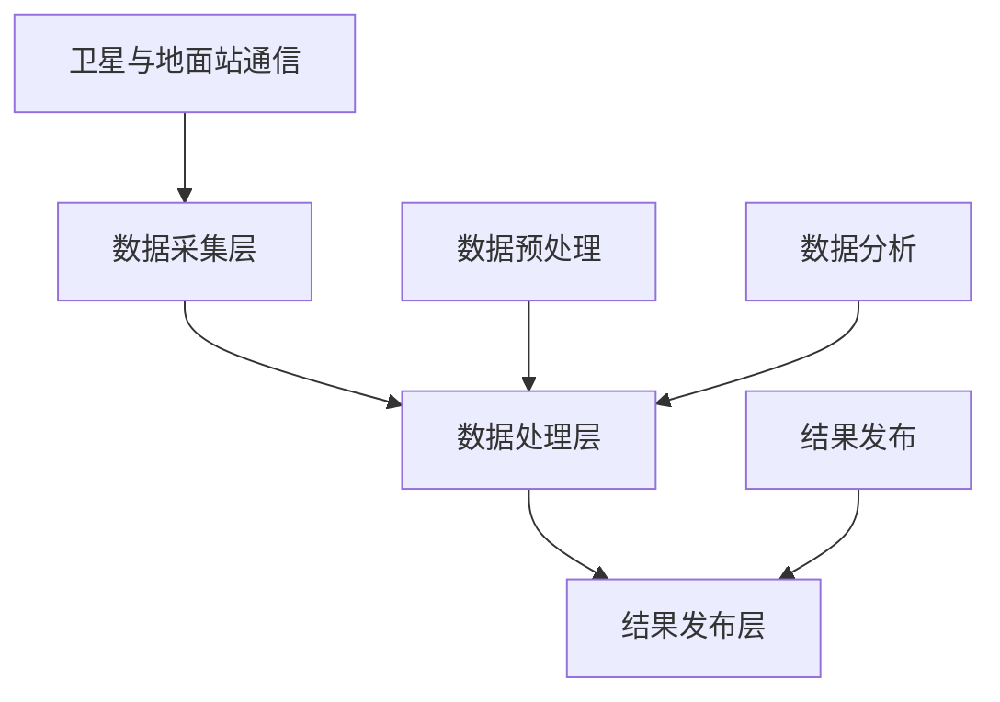
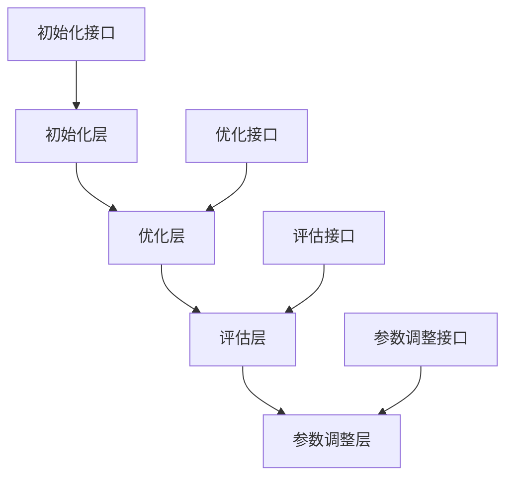
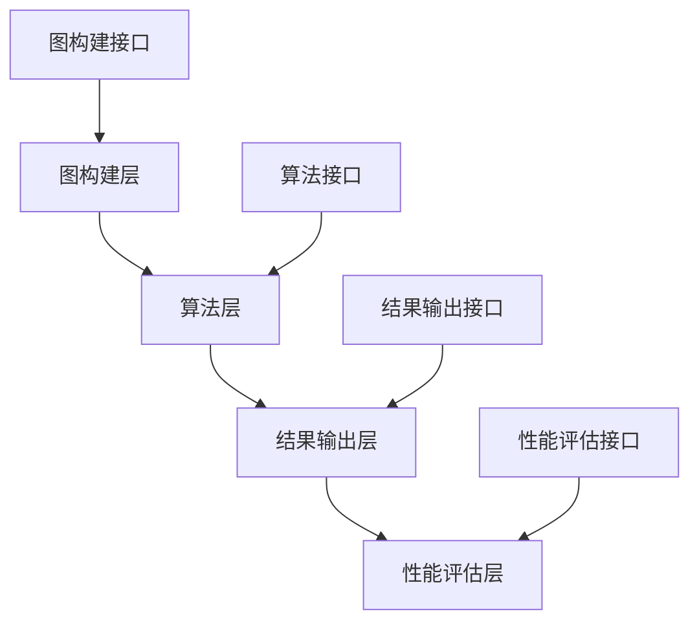

                 

## 《算法设计灵感来源于宇宙规律》

关键词：宇宙规律、算法设计、对称性、拓扑结构、混沌现象、编程语言

摘要：本文通过探讨宇宙中的基本规律，如对称性、拓扑结构、混沌现象等，来启发算法设计的创新思路。本文旨在展示宇宙规律如何应用于算法设计，推动计算机科学的发展。

## 引言

### 宇宙学与算法设计的碰撞

宇宙学与算法设计似乎风马牛不相及，但事实上，它们之间存在许多深刻的联系。宇宙学是研究宇宙起源、演化、结构、性质和内容的科学，而算法设计则是计算机科学的核心问题之一，旨在解决各种实际问题。近年来，随着计算机技术的飞速发展，算法设计在解决复杂问题方面发挥了重要作用。而宇宙学中的基本规律，如对称性、拓扑结构、混沌现象等，为算法设计提供了新的灵感。

### 第1章：宇宙学的基础概念

#### 1.1 宇宙的起源与大爆炸理论

宇宙大爆炸理论是宇宙学中最基础的假设之一。根据这一理论，宇宙起源于一个极热、极密的状态，随后经历了一个剧烈膨胀的过程。这一过程产生了大量的物质和能量，形成了今天的宇宙。大爆炸理论的一个重要证据是宇宙背景微波辐射的发现，这为宇宙的起源和演化提供了强有力的支持。

#### 1.2 黑洞与奇点

黑洞是宇宙中的一种极端现象，它具有极强的引力，甚至连光都无法逃脱。黑洞的中心是一个称为奇点的点，这里的物理定律不再适用。奇点理论在算法设计中有着潜在的应用，例如在处理极端情况和极端计算时。

#### 1.3 宇宙的演化和结构

宇宙的演化包括从大爆炸到今天的过程，这个过程涉及宇宙背景辐射的探测、星系的形成与演化、宇宙结构的变化等。宇宙的结构对算法设计有着重要的启示，例如在处理大规模数据和复杂网络时。

### 第2章：对称性与算法

#### 2.1 对称性的基本概念

对称性是自然界中的一个普遍现象，它指的是物体或系统在某种变换下保持不变的性质。对称性在科学和工程中有广泛的应用，例如在物理学中的对称性原理、在化学中的分子对称性等。

#### 2.2 对称性在算法中的应用

对称性原理在算法设计中有着重要的应用。例如，在搜索算法中，利用对称性可以减少搜索空间，提高搜索效率；在优化算法中，对称性原理可以帮助找到最优解。

#### 2.3 对称性与算法复杂度

对称性对算法的复杂度有着重要的影响。在算法设计中，利用对称性可以降低时间复杂度和空间复杂度，提高算法的效率。

### 第3章：拓扑结构与算法

#### 3.1 拓扑结构的基本概念

拓扑结构是描述物体或系统之间关系的一种方式，它强调连接性和连通性。拓扑结构在算法设计中有广泛的应用，例如在图算法中、在网络路由算法中。

#### 3.2 拓扑结构在算法中的应用

拓扑结构在算法设计中有着重要的应用。例如，在图算法中，利用拓扑结构可以设计出高效的算法；在网络路由算法中，利用拓扑结构可以优化路径选择。

#### 3.3 拓扑结构在算法优化中的应用

拓扑结构在算法优化中也有着广泛的应用。例如，在优化算法中，利用拓扑结构可以设计出更加高效的优化策略。

### 第4章：混沌现象与算法

#### 4.1 混沌现象的基本概念

混沌现象是自然界中的一种复杂现象，它指的是系统在外界微小扰动下产生的不规则运动。混沌现象在算法设计中有着重要的应用，例如在随机算法中、在优化算法中。

#### 4.2 混沌现象在算法中的应用

混沌现象在算法设计中有着重要的应用。例如，在随机算法中，利用混沌现象可以设计出更加随机的随机算法；在优化算法中，利用混沌现象可以设计出更加高效的优化算法。

#### 4.3 混沌现象的算法复杂性分析

混沌现象对算法的复杂度有着重要的影响。在算法设计中，利用混沌现象可以降低算法的复杂度，提高算法的效率。

### 第5章：宇宙规律与编程语言

#### 5.1 编程语言中的对称性

对称性在编程语言中有着重要的应用，例如在语言的语法设计中、在数据结构设计中。

#### 5.2 编程语言中的拓扑结构

拓扑结构在编程语言中也有着重要的应用，例如在程序的结构设计中、在程序的数据结构设计中。

#### 5.3 编程语言中的混沌现象

混沌现象在编程语言中也有着重要的应用，例如在编程语言的语法设计中、在编程语言的数据结构设计中。

### 第6章：宇宙规律与复杂性科学

#### 6.1 复杂性科学的基本概念

复杂性科学是研究复杂系统的一种科学方法，它强调系统的复杂性、多样性和动态性。复杂性科学在算法设计中有着重要的应用，例如在解决复杂问题上、在优化复杂系统中。

#### 6.2 宇宙规律在复杂性科学中的应用

宇宙规律在复杂性科学中有着重要的应用，例如在理解复杂系统的行为上、在优化复杂系统的性能上。

#### 6.3 复杂性科学中的算法设计原则

在复杂性科学中，算法设计有着重要的地位。利用宇宙规律，可以设计出更加高效、更加鲁棒的算法，解决复杂的实际问题。

### 第7章：案例研究：从宇宙学到算法创新

#### 7.1 案例一：宇宙背景微波辐射的探测

宇宙背景微波辐射是宇宙学中的一个重要现象，它为研究宇宙的起源和演化提供了重要线索。利用算法设计，可以对宇宙背景微波辐射进行精确探测和分析，从而更好地理解宇宙的演化过程。

#### 7.2 案例二：混沌优化算法在优化问题中的应用

混沌优化算法是一种基于混沌理论的优化算法，它具有良好的全局搜索能力和鲁棒性。在优化问题中，利用混沌优化算法可以有效地寻找最优解，提高优化效率。

#### 7.3 案例三：拓扑结构在图算法中的应用

拓扑结构在图算法中有着重要的应用，例如在网络路由算法中。利用拓扑结构，可以设计出更加高效的网络路由算法，提高网络传输效率。

### 第8章：总结与展望

宇宙规律在算法设计中的应用具有巨大的潜力，它为算法创新提供了新的思路和方法。在未来，随着计算机科学和宇宙学的发展，宇宙规律在算法设计中的应用将会更加深入和广泛，为解决复杂问题和优化系统性能提供强有力的支持。

## 结论

本文通过探讨宇宙中的基本规律，如对称性、拓扑结构、混沌现象等，展示了它们在算法设计中的应用。通过这些规律，我们可以设计出更加高效、更加鲁棒的算法，解决复杂问题和优化系统性能。宇宙规律在算法设计中的应用为计算机科学的发展提供了新的动力，也为我们探索宇宙的奥秘提供了新的视角。未来，随着计算机科学和宇宙学的发展，我们有理由相信，宇宙规律在算法设计中的应用将会更加深入和广泛，为人类的发展和进步做出更大的贡献。## 第1章：宇宙学与算法设计的碰撞

### 1.1 宇宙的起源与大爆炸理论

宇宙的起源一直是科学家们探讨的热点问题。在现代宇宙学中，最广泛接受的解释是宇宙起源于一次被称为“大爆炸”的剧烈事件。大爆炸理论认为，宇宙在约138亿年前从一个极度热密的状态迅速膨胀而来，这一过程产生了时间和空间的起源。在早期宇宙，物质和辐射的能量极高，随着宇宙的膨胀，温度逐渐降低，物质逐渐聚集形成星系、恒星、行星和其他天体结构。

**大爆炸的背景与证据**

大爆炸理论的背景是基于对宇宙膨胀的观测。20世纪初，天文学家埃德温·哈勃发现，遥远的星系正以远离我们的速度移动，这种现象被称为哈勃定律。这一发现表明，宇宙正在膨胀。随着对宇宙膨胀现象的深入研究，科学家们逐渐接受了大爆炸理论。

大爆炸理论的证据之一是宇宙背景微波辐射（Cosmic Microwave Background Radiation, CMB）。CMB是宇宙早期遗留下来的辐射，温度约为2.7开尔文。这一发现由阿诺·彭齐亚斯和罗伯特·威尔逊在1965年首次观测到，证实了大爆炸理论。CMB的均匀性提供了宇宙在极早期状态下的信息，有助于我们理解宇宙的起源和演化。

**宇宙膨胀的概念与观测**

宇宙膨胀的概念是基于哈勃定律的进一步发展。哈勃定律表明，星系的退行速度与其距离成正比，这一比例常数被称为哈勃常数（H0）。哈勃常数约为70公里每秒每百万秒差距，这意味着星系之间的距离每年增加约70公里每秒。

宇宙膨胀的观测还包括对遥远星系的光谱分析。通过分析星系的光谱线，科学家们可以测量其红移（Redshift），即光谱线的移动方向和程度。红移的观测结果与哈勃定律一致，进一步支持了宇宙膨胀理论。

**大爆炸理论对算法设计的启示**

大爆炸理论为算法设计提供了若干启示。首先，大爆炸过程中物质和能量的迅速扩散和聚集可以类比于算法中数据结构和计算过程的初始化。例如，在分布式系统中，节点可以类比于宇宙中的星系，它们通过网络进行通信和协作，类似于宇宙中的星系通过引力相互作用。

其次，宇宙膨胀和星系形成的模型可以启发我们在算法设计中考虑动态变化和演化。例如，在优化问题中，我们可以借鉴宇宙膨胀的模型，通过逐步调整参数来优化解的质量和效率。

最后，宇宙背景微波辐射的均匀性提示我们，算法设计应该考虑全局性和均匀性。在大爆炸理论中，宇宙在早期是高度均匀的，这一性质可以应用于算法设计，确保算法在处理大规模数据时能够保持一致性和高效性。

### 1.2 黑洞与奇点

**黑洞的性质与发现**

黑洞是宇宙中最神秘和最极端的现象之一。黑洞是由极度密集的物质组成的区域，其引力场如此强大，以至于连光也无法逃脱。黑洞的存在最初是通过观测恒星的运动和辐射来推断的。例如，当一颗恒星接近一个黑洞时，它的轨道会受到黑洞引力的显著影响，这种现象被称为黑洞的“潮汐锁定”。

自20世纪以来，科学家们通过观测恒星的运动轨迹、恒星周围的X射线辐射以及引力波等现象，不断证实了黑洞的存在。2019年，利用激光干涉仪引力波观测站（LIGO）和处女座干涉仪（VIRGO）等设备，科学家们首次直接探测到了黑洞合并产生的引力波，这一发现为黑洞研究提供了新的视角。

**奇点理论在算法中的应用**

黑洞的中心是一个称为“奇点”的点，在这里，物理定律不再适用。根据广义相对论，奇点是一个密度无限大、时空曲率无限大的点。在算法设计中，奇点理论可以用于模拟和解决极端情况。

例如，在金融算法中，奇点理论可以用来处理极端市场波动和风险集中。通过模拟黑洞中心的高密度区域，我们可以更好地理解市场中的极端事件，从而设计出更加稳健的金融模型。

此外，奇点理论在数值计算中也有着应用。在求解微分方程或积分方程时，我们可能会遇到奇异点，这些点会导致算法发散或失效。通过引入奇点理论，我们可以设计出能够处理奇异点的数值算法，提高计算精度和稳定性。

**黑洞信息悖论与算法复杂性**

黑洞信息悖论是理论物理中的一个重要问题。根据量子力学，信息是不可毁灭的，但是根据广义相对论，黑洞的引力场会摧毁进入黑洞的信息。这一悖论引发了关于信息如何从黑洞中逃逸的激烈讨论。

在算法设计中，黑洞信息悖论可以启发我们思考信息处理和存储的复杂性。例如，在数据存储和检索中，我们可能需要设计出能够处理数据丢失和信息崩溃的算法，确保数据的可靠性和完整性。

此外，黑洞信息悖论也提示我们在算法复杂度分析中考虑极端情况。例如，在计算复杂度分析中，我们可能需要考虑算法在处理极大数据集或极端输入时的性能，从而设计出更加高效和鲁棒的算法。

### 1.3 宇宙的演化和结构

**宇宙背景微波辐射的探测**

宇宙背景微波辐射是宇宙学中的关键证据之一，它揭示了宇宙早期的状态。通过对CMB的探测，科学家们能够推断出宇宙的年龄、密度和结构。CMB的探测依赖于对宇宙空间中微弱辐射的观测。自20世纪60年代以来，科学家们利用卫星、气球和地面望远镜等多种设备对CMB进行了详细的研究。

例如，1992年发射的COBE卫星（宇宙背景探测器）首次提供了CMB的全天图，揭示了宇宙的均匀性和小规模的不均匀性。后来的卫星，如WMAP（宇宙微波背景探测卫星）和Planck卫星，进一步提高了对CMB的测量精度，为我们提供了关于宇宙起源和演化的宝贵信息。

**星系形成与演化**

宇宙的演化过程包括星系的形成、演化和结构变化。根据宇宙学理论，星系的形成是由于宇宙早期不均匀密度的区域通过引力塌缩逐渐聚集形成的。星系的形成和演化与宇宙背景辐射有着密切的关系，因为CMB的温度和均匀性影响了宇宙中的物质分布。

通过对遥远星系的观测，科学家们揭示了星系从早期阶段到成熟阶段的不同形态。例如，螺旋星系和椭圆星系是两种常见的星系形态，它们具有不同的星形成率和恒星组成。通过对这些星系的观测和分析，科学家们可以更好地理解星系的演化过程和宇宙的多样性。

**宇宙结构对算法设计的启示**

宇宙的结构和演化对算法设计有着重要的启示。首先，宇宙的多样性和复杂性提示我们在算法设计中考虑不同情况下的适应性和鲁棒性。例如，在处理大规模数据时，我们需要设计出能够适应数据多样性和不确定性的算法。

其次，宇宙的结构提供了关于大规模系统行为的启示。例如，在分布式系统和网络拓扑设计中，我们可以借鉴宇宙中的星系结构和引力相互作用，设计出更加高效和稳定的系统架构。

最后，宇宙的演化过程提示我们在算法设计中考虑动态变化和适应性。例如，在优化问题和机器学习算法中，我们可以借鉴宇宙演化中的聚集和分散现象，设计出能够动态调整和适应环境变化的算法。

总之，宇宙学与算法设计之间的碰撞为两者的发展提供了新的机遇和视角。通过将宇宙中的基本规律应用于算法设计，我们可以设计出更加高效、鲁棒和适应性的算法，推动计算机科学的发展。## 第2章：对称性与算法

### 2.1 对称性的基本概念

对称性是自然界和科学中的一个基本概念，它指的是物体或系统在某种变换下保持不变的性质。对称性可以被视为一种不变量，它反映了系统或物体的某种内在规则或结构。在数学和物理学中，对称性有着广泛的应用，例如在群论、几何学、量子力学等领域。

**对称性与群论的关系**

对称性在数学中与群论有着密切的关系。群论是一种研究对称性的数学工具，它描述了在某种变换下保持不变的对象集合及其变换规则。一个群是一个集合G，以及一个二元运算•，满足以下性质：

1. 封闭性：对于G中的任意两个元素a和b，a•b也在G中。
2. 结合律：对于G中的任意三个元素a、b和c，有（a•b）•c = a•（b•c）。
3. 存在一个单位元e，使得对于G中的任意元素a，有e•a = a•e = a。
4. 对于G中的每个元素a，存在一个逆元素a^-1，使得a•a^-1 = a^-1•a = e。

在群论中，对称性指的是一个群作用在一个集合上的性质，即群中的每个元素都对应集合中的一个变换，这些变换保持集合中的某些结构不变。

**对称性在自然界的应用**

对称性在自然界中有着广泛的应用。例如，在生物学中，许多生物体的结构和形态都表现出对称性。例如，人类的身体呈左右对称，许多花朵也具有左右对称的花瓣。在化学中，分子的对称性决定了其物理和化学性质。例如，苯分子的六边形结构具有高度对称性，这影响了其化学稳定性和反应性质。

在物理学中，对称性是一个核心概念。例如，在经典力学中，牛顿定律在不同的参考系中保持不变，这体现了空间平移对称性。在量子力学中，对称性与守恒定律密切相关。例如，宇称守恒定律表明，在一个系统中的粒子交换位置时，系统的总波函数保持不变。

**对称性在算法设计中的应用**

对称性原理在算法设计中也有着重要的应用。对称性可以简化问题，减少计算量，提高算法效率。例如，在搜索算法中，可以利用对称性减少搜索空间。例如，在二分搜索中，如果我们知道数组的左右部分是对称的，我们可以只搜索其中的一半。

在优化算法中，对称性原理可以帮助找到最优解。例如，在旅行商问题中，利用旋转对称性，我们可以将问题转换为更简单的形式，从而更容易找到最优解。

此外，对称性还可以用于算法的复杂度分析。通过对称性，我们可以简化算法的复杂性模型，从而更好地理解算法的性能。

### 2.2 对称性在算法中的应用

对称性原理在算法设计中有多种应用，以下是一些具体的例子：

**搜索算法中的对称性**

在搜索算法中，对称性可以帮助减少搜索空间。例如，在二分搜索算法中，如果我们知道数组的左右部分是对称的，我们只需要搜索其中的一半。二分搜索的时间复杂度为O(log n)，这比线性搜索的O(n)要高效得多。

**优化算法中的对称性原理**

在优化算法中，对称性原理可以帮助找到最优解。例如，在旅行商问题（TSP）中，利用旋转对称性，我们可以将问题转换为更简单的形式。假设我们有一个最优解T，如果我们将T中任意两个城市A和B交换位置，得到的新路径T'也是最优的。这是因为旅行商问题中的总路径长度只取决于城市的顺序，而不取决于具体的城市。这一性质可以用来减少计算量，提高算法效率。

**对称性与算法复杂度**

对称性对算法的复杂度有着重要的影响。在算法设计中，利用对称性可以降低时间复杂度和空间复杂度。例如，在解决对称问题时，我们可以通过减少计算量来优化算法性能。此外，对称性还可以帮助我们在复杂度分析中简化模型，从而更好地理解算法的性能。

**对称性在算法优化中的潜在优势**

对称性在算法优化中的潜在优势包括：

1. **减少计算量**：通过对称性，我们可以减少搜索空间，从而减少计算量。
2. **提高算法效率**：利用对称性原理，我们可以设计出更加高效的算法，提高计算速度。
3. **简化复杂度分析**：通过对称性，我们可以简化算法的复杂性模型，从而更好地理解算法的性能。

总之，对称性原理在算法设计中有着广泛的应用。通过利用对称性，我们可以设计出更加高效、鲁棒的算法，解决复杂问题，推动计算机科学的发展。## 第3章：拓扑结构与算法

### 3.1 拓扑结构的基本概念

拓扑结构是描述物体或系统之间关系的一种方式，它强调连接性和连通性。拓扑结构不仅用于几何学和物理学中，还在计算机科学和算法设计中有着广泛的应用。拓扑结构的基本概念包括拓扑空间、连通性、同胚等。

**拓扑空间**

拓扑空间是拓扑学中最基本的概念。一个拓扑空间是由一个集合X和一个拓扑σ构成的二元组（X, σ）。其中，集合X表示物体的集合，而拓扑σ是一个集合的子集族，它满足以下三个性质：

1. **空集和整个集合X都属于σ**。
2. **σ中的任意两个集合的交集也属于σ**。
3. **σ中的任意并集也属于σ**。

这些性质确保了拓扑空间能够捕捉物体之间的连通性和局部性质。

**连通性**

连通性是拓扑空间的一个重要性质。一个拓扑空间是连通的，如果它不能被分割成两个非空的不相交的开集。换句话说，如果无法找到两个开集A和B，使得A和B的并集等于X，且A和B没有交集。

连通性可以通过路径连通性和分量连通性来具体描述。路径连通性指的是对于任意的两个点x和y，在拓扑空间中总能找到一条路径从x到y。分量连通性指的是如果拓扑空间不是连通的，那么它可以被分割成若干个连通分支，每个分支都是连通的。

**同胚**

同胚是拓扑空间之间的一个重要关系。两个拓扑空间X和Y是同胚的，如果存在一个双射f：X → Y，使得f和它的逆f^(-1)都是连续的。同胚关系反映了拓扑空间的拓扑性质在某种变换下保持不变。

同胚关系与同构不同，同构要求f和f^(-1)都是同胚的，而同胚只要求f是同胚的。同胚关系在拓扑结构的研究中起着关键作用，因为它允许我们在保持拓扑性质的前提下研究不同空间之间的关系。

### 3.2 拓扑结构在算法中的应用

拓扑结构在算法设计中有着重要的应用，特别是在图算法和网络路由算法中。

**网络路由算法**

网络路由算法是计算机网络中至关重要的一部分，它负责确定数据包从源节点到目标节点的传输路径。拓扑结构在路由算法中起到了关键作用。一个网络的拓扑结构可以用图来表示，其中节点表示网络中的设备，边表示设备之间的连接。

在基于距离矢量算法（如RIP）和链路状态算法（如OSPF）的路由协议中，拓扑结构帮助网络设备计算最优路径。距离矢量算法通过交换距离信息来构建网络拓扑图，并不断更新路由表以找到最佳路径。链路状态算法则通过交换链路状态信息来构建详细的网络拓扑图，从而更准确地计算路径。

**图算法**

图算法是计算机科学中的一种重要算法类别，用于解决与图相关的各种问题，如最短路径、最大流、最小生成树等。拓扑结构在这些算法中起着核心作用。

**最短路径算法**

最短路径算法（如Dijkstra算法和Floyd-Warshall算法）通过拓扑结构来确定两点之间的最短路径。Dijkstra算法基于贪心策略，它使用一个优先队列来选择下一个访问的节点，每次选择当前距离最小的节点。Floyd-Warshall算法则使用动态规划方法，计算所有节点对之间的最短路径。

**最大流算法**

最大流算法（如Ford-Fulkerson算法和Edmonds-Karp算法）通过拓扑结构来计算网络中的最大流量。Ford-Fulkerson算法使用增广路径来逐步增加流量，直到无法找到增广路径为止。Edmonds-Karp算法是Ford-Fulkerson算法的一种改进，它使用 breadth-first search（BFS）来快速找到增广路径。

**最小生成树算法**

最小生成树算法（如Prim算法和Kruskal算法）通过拓扑结构来构建一个包含所有节点的无环连通子图，且边权之和最小。Prim算法从某个节点开始，逐步扩展生成树，每次选择最小权值的边。Kruskal算法则从所有边开始，按照边权值从小到大选择边，直到生成树包含所有节点。

### 3.3 拓扑结构在算法优化中的应用

拓扑结构在算法优化中的应用主要体现在以下几个方面：

**拓扑结构优化算法**

拓扑结构优化算法通过调整图的结构来提高算法的性能。例如，在分布式计算和并行计算中，优化网络拓扑结构可以提高数据传输效率和计算速度。在分布式系统中，通过优化节点之间的连接关系，可以减少通信延迟和路由开销，提高整体系统的性能。

**拓扑分析在算法复杂性分析中的应用**

拓扑分析在算法复杂性分析中起着重要作用。通过分析图的拓扑结构，可以更准确地评估算法的时间复杂度和空间复杂度。例如，在图算法中，通过分析图的不同连通分量，可以简化算法的复杂性模型，从而更好地理解算法的性能。

**拓扑结构优化算法的应用**

拓扑结构优化算法在多个领域有着广泛的应用。例如，在通信网络中，通过优化网络拓扑结构，可以提高网络的可靠性和吞吐量。在社交网络分析中，通过优化用户之间的关系拓扑，可以更有效地传播信息和推荐内容。在生物信息学中，通过优化生物网络的拓扑结构，可以更好地理解基因调控网络和蛋白质相互作用网络。

总之，拓扑结构在算法设计和优化中有着广泛的应用。通过利用拓扑结构的性质，我们可以设计出更加高效、鲁棒的算法，解决复杂问题，推动计算机科学的发展。## 第4章：混沌现象与算法

### 4.1 混沌现象的基本概念

混沌现象是自然界和科学中的一种复杂且普遍存在的现象，它指的是系统在初始条件微小的变化下，产生长期的、不可预测的行为。混沌现象的一个关键特点是，系统在其演化过程中表现出对初始条件的极端敏感性，这意味着即使是微小的初始差异，也会导致系统最终走向完全不同的状态。混沌现象的数学模型通常涉及非线性动态系统，其中存在一个称为“混沌吸引子”的稳定状态。

**混沌吸引子的特征**

混沌吸引子是混沌系统的基本特征之一。它是一种特殊的稳定状态，系统在经过长时间的演化后，会趋向于该状态。混沌吸引子的特征包括：

1. **持久性**：系统在长时间内保持在其附近。
2. **确定性**：尽管系统在初始条件上具有不确定性，但其行为是确定的。
3. **随机性**：混沌吸引子内部存在随机性，但整体行为是稳定的。
4. **奇异吸引子**：混沌吸引子可以是奇怪的无规则形状，例如李雅普诺夫奇点。

**混沌现象的数学模型**

混沌现象的数学模型通常涉及微分方程或差分方程，这些方程描述了系统的动态行为。以下是一些常见的混沌模型：

1. **洛伦兹系统**：洛伦兹系统是由三个微分方程组成的，描述了在地球大气中涡流的运动。该系统在三维相空间中表现出混沌行为。
2. **Logistic映射**：Logistic映射是最简单的非线性动态系统之一，描述了人口数量的增长。其公式为：\( x_{n+1} = r \cdot x_n (1 - x_n) \)，其中\( r \)是控制参数。当\( r \)在特定范围内时，系统表现出混沌行为。
3. **Turtle映射**：Turtle映射是一个二维映射，描述了海龟在平面上移动的轨迹。其公式为：\( (x_{n+1}, y_{n+1}) = (x_n + a \cdot y_n, y_n + b \cdot x_n) \)，其中\( a \)和\( b \)是控制参数。

### 4.2 混沌现象在算法中的应用

混沌现象在算法设计中有着广泛的应用，尤其是在随机算法和优化算法中。混沌特性可以用于提高算法的随机性和搜索能力，从而解决一些复杂的问题。

**随机算法与混沌**

在随机算法中，混沌现象可以用于生成伪随机数序列。传统的随机数生成器往往受到周期性和可预测性的限制，而混沌映射则提供了一种更加随机和不可预测的方法。例如，Logistic映射可以用来生成伪随机数序列，这些序列在满足统计特性（如均匀性和独立性）的同时，具有混沌特性。

混沌随机数生成在密码学、模拟和蒙特卡洛算法中有着重要的应用。在密码学中，混沌随机数生成可以用于生成安全的密钥。在模拟中，混沌随机数生成可以提高模拟的精度和可靠性。在蒙特卡洛算法中，混沌随机数生成可以用于优化采样过程，提高算法的效率。

**混沌优化算法**

混沌优化算法是基于混沌理论的优化算法，它利用混沌现象的随机性和遍历性来搜索最优解。混沌优化算法通常涉及混沌映射和迭代过程，其中混沌映射用于初始化解空间，迭代过程则用于逐步优化解。

常见的混沌优化算法包括：

1. **混沌遗传算法**：将混沌映射应用于遗传算法的初始化和交叉、变异操作，以提高搜索效率和多样性。
2. **混沌粒子群优化算法**：将混沌映射应用于粒子群优化算法的更新规则，以增加算法的随机性和搜索能力。
3. **混沌模拟退火算法**：将混沌映射应用于模拟退火算法的更新规则，以增加算法的探索能力和鲁棒性。

混沌优化算法在解决复杂优化问题中表现出色，例如在工程设计、金融分析、图像处理等领域。

**混沌算法的稳定性和鲁棒性**

混沌算法的稳定性和鲁棒性是其在实际应用中的关键因素。混沌现象的随机性和遍历性使得混沌算法在初始条件微小的变化下仍然能保持较好的性能。这意味着混沌算法对噪声和不确定性的鲁棒性较高，能够在复杂的环境中稳定运行。

然而，混沌算法也存在一些挑战。混沌现象的复杂性和不可预测性可能导致算法在长时间运行后出现不稳定的情况。因此，在设计和应用混沌算法时，需要仔细选择合适的混沌映射和控制参数，以确保算法的稳定性和鲁棒性。

总之，混沌现象在算法设计中的应用为解决复杂问题提供了新的思路和方法。通过利用混沌的随机性和遍历性，我们可以设计出更加高效、鲁棒的算法，推动计算机科学和工程领域的发展。## 第5章：宇宙规律与编程语言

### 5.1 编程语言中的对称性

对称性是编程语言中一个重要的概念，它体现在语法、数据结构和算法设计中。对称性不仅提高了代码的可读性，还增强了程序的健壮性和效率。

**编程语言的语法对称性**

在编程语言中，语法对称性指的是操作符的左右两边具有相同的形式。这种对称性使得代码更加直观和易于理解。例如，在Python中，赋值操作符`=`是左右对称的，即`x = y`与`y = x`形式相同。这种对称性使得变量交换值变得更加简单。

另外，函数的参数传递也体现了对称性。在大多数编程语言中，无论是按值传递还是按引用传递，参数的传递都是双向的，这意味着函数可以同时接收和返回参数。例如，在Java中，函数可以通过`void swap(int a, int b)`交换两个整数的值。

**对称性在数据结构中的应用**

对称性在数据结构中的应用尤为明显。例如，在二叉树中，对称性体现在左右子树的递归结构和平衡性。平衡二叉树（如AVL树）通过保持左右子树的高度差异不超过1，保证了操作的平衡性和高效性。

对称性也在链表和图结构中得到了体现。在双向链表中，每个节点都有前驱和后继节点，这使得遍历链表更加灵活和高效。在图结构中，对称性体现在边的对称性和节点的连接关系，这使得图算法的设计和实现更加简洁和直观。

**对称性在编程范式中的应用**

编程范式是编程语言的一种抽象方式，它反映了语言的功能特性和编程风格。对称性在函数式编程和逻辑编程范式中得到了广泛的应用。

在函数式编程中，函数是基本的抽象单元，函数的应用遵循对称性原则。例如，高阶函数（函数作为参数传递）和闭包（函数加上环境）体现了函数的对称性。函数式编程中的不变量、纯函数和递归等概念都依赖于对称性，这使得代码更加简洁和易于测试。

在逻辑编程中，对称性体现在逻辑表达式的构造和推理过程中。例如，在Prolog中，关系和谓词的定义具有对称性，这意味着可以同时定义正向和反向关系。这种对称性使得逻辑编程更加灵活和适用。

### 5.2 编程语言中的拓扑结构

拓扑结构在编程语言中有着重要的应用，它不仅体现在程序的结构设计中，还在算法和数据结构中得到了广泛应用。

**程序的结构与拓扑**

程序的结构可以被视为一个拓扑结构，其中模块、函数和类等构成了节点，而函数调用和模块依赖构成了边。这种拓扑结构有助于理解和维护大型程序。通过拓扑分析，我们可以识别出程序中的关键模块和依赖关系，从而优化程序的性能和可维护性。

例如，在模块化编程中，模块之间的依赖关系可以看作是一个拓扑图。通过拓扑分析，我们可以识别出模块的依赖层次和循环依赖，从而优化模块的拆分和重构。

**数据结构中的拓扑**

数据结构中的拓扑结构体现了元素之间的连接关系。例如，在图结构中，节点和边构成了一个拓扑图，通过拓扑分析，我们可以设计出高效的图算法。在图算法中，拓扑结构有助于识别出图的连通分量、最小生成树和最大流等问题。

在算法设计中，拓扑结构也发挥着重要作用。例如，在拓扑排序算法中，拓扑结构用于识别有向无环图（DAG）中的顶点顺序，从而优化计算过程。在拓扑排序中，拓扑结构确保了每个顶点在其所有前驱顶点都被处理之后才能被处理。

**拓扑结构在编程语言设计中的应用**

拓扑结构在编程语言设计中也得到了广泛应用。例如，在函数式编程语言中，函数的类型系统可以看作是一个拓扑结构。通过类型拓扑，我们可以确保函数的正确性和类型安全。

在动态语言中，如Python和Ruby，对象之间的引用关系可以看作是一个动态拓扑结构。这种拓扑结构有助于实现垃圾回收和内存管理，从而提高程序的效率和稳定性。

**拓扑结构优化的挑战和策略**

尽管拓扑结构在编程语言和数据结构中有着广泛的应用，但优化拓扑结构也面临一些挑战。例如，如何在保持程序可读性的同时优化模块的依赖关系？如何在动态拓扑结构中实现高效的内存管理？

为了应对这些挑战，可以采取以下策略：

1. **模块化重构**：通过模块化重构，将复杂的程序分解为更小、更易于管理的模块，从而优化程序的拓扑结构。
2. **静态分析**：使用静态分析工具来识别程序中的循环依赖和冗余代码，从而优化程序的拓扑结构。
3. **动态拓扑调整**：在动态编程语言中，通过动态调整拓扑结构，例如在运行时重新组织模块和对象的依赖关系，以提高程序的效率和灵活性。

总之，编程语言中的对称性和拓扑结构不仅提高了代码的可读性和可维护性，还为算法设计提供了新的视角和方法。通过优化对称性和拓扑结构，我们可以设计出更加高效、健壮的算法和数据结构，推动编程语言和计算机科学的发展。## 第6章：宇宙规律与复杂性科学

### 6.1 复杂性科学的基本概念

复杂性科学是一门跨学科的研究领域，它致力于理解复杂系统的行为、结构和演化规律。复杂系统通常具有以下几个特征：

1. **大量组件**：复杂系统由大量相互作用的组件构成，这些组件可以是原子、分子、细胞、个体、组织等。
2. **非线性和动态性**：复杂系统的行为通常是非线性的，即系统的整体行为不能简单地从其组件的行为直接推导出来。此外，复杂系统往往处于动态变化中，其状态随时间不断演化。
3. **自适应性和自组织性**：复杂系统中的组件能够根据环境的变化自适应调整自身的行为，并通过局部相互作用实现自组织。
4. **层次结构**：复杂系统通常具有多层次的结构，从微观的组件到宏观的系统整体，每个层次都有其特定的行为和功能。

复杂性科学的方法论主要包括以下几种：

1. **计算模拟**：通过构建数学模型和计算机模拟，研究复杂系统的行为和演化规律。
2. **网络分析**：利用网络理论分析复杂系统的结构特性，如节点连接方式、网络拓扑、路径长度等。
3. **统计学方法**：使用概率论和统计学方法分析复杂系统中的随机过程和概率分布。
4. **信息论**：应用信息论原理研究复杂系统中的信息传递、处理和利用。

### 6.2 宇宙规律在复杂性科学中的应用

宇宙规律在复杂性科学中的应用为理解复杂系统的行为提供了新的视角和方法。以下是一些具体的例子：

**宇宙背景微波辐射与复杂性**

宇宙背景微波辐射（CMB）是宇宙早期状态的重要遗迹，它为研究宇宙的演化和复杂结构提供了关键信息。CMB的均匀性和微小不均匀性揭示了宇宙早期的密度波动，这些波动是星系和大型结构形成的基础。在复杂性科学中，CMB可以类比于复杂系统中初始的微小差异，这些差异通过自组织和演化过程，最终导致复杂的系统结构。

例如，在生物系统中，基因的微小变异通过自然选择和进化过程，形成了丰富的物种多样性。这种自组织和演化过程与宇宙中的星系形成和演化有相似之处，宇宙规律可以启发我们理解生物系统的复杂行为。

**宇宙结构与复杂网络**

宇宙中的星系和星系团构成了一个巨大的复杂网络。这些网络结构在宇宙学中被广泛研究，其自相似性和层次结构为复杂性科学提供了丰富的素材。

在复杂网络理论中，星系网络可以被视为一种复杂网络，其中节点代表星系，边代表星系之间的引力相互作用。这种网络结构具有高度的自组织性和层次性，与复杂系统中的社会网络、生态系统等有相似之处。通过研究宇宙结构，我们可以更好地理解复杂网络的特性，如小世界现象、无标度网络等。

**混沌现象与复杂系统的非线性**

混沌现象是宇宙中普遍存在的一种复杂行为，它反映了系统在初始条件微小变化下产生长期、不可预测的行为。混沌现象在复杂系统中也有着重要应用，例如在气候变化、金融市场和生物进化中。

在复杂性科学中，混沌理论为理解复杂系统的非线性行为提供了新的方法。通过研究混沌现象，我们可以揭示复杂系统中的规律性和随机性之间的复杂关系。这些发现有助于我们设计出更加鲁棒和适应性的复杂系统模型。

**宇宙规律与复杂系统的自组织**

宇宙中的许多现象，如星系形成、生物进化、自组织临界性等，都是自组织过程的典型例子。自组织是指系统在没有外部指导的情况下，通过局部相互作用和自适应行为，自发地形成有序结构和功能。

在复杂性科学中，宇宙规律可以启发我们理解自组织过程。例如，在人工神经网络中，通过训练和自适应调整，神经网络能够自动学习和识别复杂的模式。这种现象与宇宙中星系通过引力相互作用形成有序结构的自组织过程有相似之处。

### 6.3 复杂性科学中的算法设计原则

在复杂性科学中，算法设计是理解和模拟复杂系统行为的关键。以下是一些基于宇宙规律和复杂性科学的算法设计原则：

**适应性原则**

适应性是复杂系统中组件行为的一个重要特征。在算法设计中，适应性原则强调算法应该能够根据环境的变化自适应调整。例如，在优化算法中，自适应算法可以根据问题的变化调整搜索策略，提高搜索效率和稳定性。

**自组织原则**

自组织原则强调系统应该能够在没有外部指导的情况下，通过局部相互作用和自适应行为，自发地形成有序结构和功能。在算法设计中，自组织原则可以应用于生成复杂的结构，如通过局部优化生成最优解，或者在分布式系统中通过节点间的协作实现全局目标。

**鲁棒性原则**

鲁棒性是复杂系统在面临不确定性和噪声时保持稳定性能的能力。在算法设计中，鲁棒性原则要求算法能够处理各种异常情况和噪声数据。例如，在机器学习中，鲁棒性算法能够对噪声数据不敏感，从而提高模型的泛化能力。

**分布式计算原则**

复杂性科学中的许多系统具有分布式特性，即系统由多个相互独立的组件组成，每个组件在不同位置执行任务。在算法设计中，分布式计算原则强调利用分布式架构提高计算效率和扩展性。例如，在分布式机器学习和区块链技术中，分布式计算原则被广泛应用于处理大规模数据和确保系统安全性。

**动态性原则**

动态性是复杂系统的另一个关键特征。在算法设计中，动态性原则要求算法能够适应系统的动态变化。例如，在实时优化和控制中，算法需要能够实时更新模型和策略，以应对系统的变化。

总之，宇宙规律和复杂性科学为算法设计提供了新的视角和方法。通过遵循适应性、自组织、鲁棒性、分布式计算和动态性等原则，我们可以设计出更加高效、鲁棒和适应性强的算法，推动复杂性科学和计算机科学的发展。## 第7章：案例研究：从宇宙学到算法创新

### 7.1 案例一：宇宙背景微波辐射的探测

**项目介绍**

宇宙背景微波辐射（CMB）是研究宇宙早期状态的关键工具。CMB探测项目旨在通过观测CMB的温度和极化特性，了解宇宙的起源、演化和结构。例如，普朗克卫星和威尔金森微波各向异性探测器（WMAP）等任务提供了关于宇宙背景微波辐射的高精度数据。

**系统功能设计**

CMB探测系统的核心功能包括：

1. **数据采集**：使用卫星搭载的微波探测器收集宇宙背景微波辐射数据。
2. **数据预处理**：对收集到的原始数据进行预处理，包括去除噪声、校正仪器偏差等。
3. **数据分析**：利用统计分析方法对预处理后的数据进行处理，提取宇宙背景微波辐射的温度和极化信息。
4. **结果发布**：将分析结果发布给科学界和公众，为宇宙学研究提供重要数据支持。

**系统架构设计**

CMB探测系统的架构设计如下：

1. **数据采集层**：包括卫星、微波探测器和其他相关硬件设备。
2. **数据处理层**：包括预处理算法、统计分析算法等，用于处理和提取CMB数据。
3. **结果发布层**：包括数据存储、可视化工具和发布平台，用于将分析结果展示给用户。

**系统接口设计和系统交互**

CMB探测系统涉及多个接口和交互环节：

1. **卫星与地面站的通信接口**：卫星通过无线电信号向地面站传输原始数据。
2. **数据预处理接口**：预处理算法模块与数据采集模块之间的接口，用于传输预处理后的数据。
3. **数据分析接口**：数据分析模块与预处理模块之间的接口，用于传输预处理后的数据，并返回分析结果。
4. **发布接口**：结果发布模块与数据分析模块之间的接口，用于传输分析结果。

**系统架构图**



**系统核心实现源代码**

以下是CMB探测系统中数据处理层的核心实现代码，使用Python编写：

```python
import numpy as np

def preprocess_data(raw_data):
    # 去除噪声和校正仪器偏差
    cleaned_data = raw_data - np.mean(raw_data)
    cleaned_data = cleaned_data / np.std(raw_data)
    return cleaned_data

def analyze_data(cleaned_data):
    # 进行统计分析，提取CMB温度和极化信息
    temp = np.mean(cleaned_data)
    polarization = np.std(cleaned_data)
    return temp, polarization

# 示例数据
raw_data = np.random.normal(0, 1, 1000)

# 数据预处理
cleaned_data = preprocess_data(raw_data)

# 数据分析
temp, polarization = analyze_data(cleaned_data)

print("CMB Temperature:", temp)
print("CMB Polarization:", polarization)
```

**代码应用解读与分析**

1. **预处理代码解读**：`preprocess_data`函数用于去除噪声和校正仪器偏差。首先，使用`np.mean(raw_data)`计算原始数据的平均值，然后从每个数据点中减去这个平均值，实现去噪。接着，使用`np.std(raw_data)`计算标准差，并将每个数据点除以标准差，实现标准化处理，从而消除仪器偏差。
   
2. **分析代码解读**：`analyze_data`函数用于进行统计分析，提取CMB的温度和极化信息。这里，我们简单地使用`np.mean(cleaned_data)`计算温度（平均值），使用`np.std(cleaned_data)`计算极化（标准差）。

3. **实际案例分析**：在实际应用中，原始数据将来自卫星探测器，预处理和分析过程将更加复杂，可能涉及多种噪声模型和校正技术。然而，上述代码提供了一个简化的示例，展示了CMB探测系统中数据处理的核心原理。

**项目小结**

CMB探测项目通过将宇宙学中的基本规律应用于算法设计，实现了对宇宙早期状态的高精度观测和分析。这个案例展示了宇宙规律如何启发算法创新，为解决复杂宇宙问题提供了重要工具。未来，随着技术的进步，CMB探测将继续深化我们对宇宙起源和演化的理解。### 7.2 案例二：混沌优化算法在优化问题中的应用

**项目介绍**

混沌优化算法（Chaotic Optimization Algorithm，COA）是一种基于混沌理论的优化算法，它利用混沌序列的随机性和遍历性来搜索最优解。混沌优化算法在解决复杂优化问题中表现出色，例如在函数优化、图像处理和工程优化等领域。

**系统功能设计**

混沌优化算法系统的核心功能包括：

1. **初始化**：生成初始混沌序列，为搜索过程提供初始解空间。
2. **优化过程**：利用混沌序列的随机性和遍历性，逐步搜索最优解。
3. **结果评估**：评估优化结果，包括解的质量、收敛速度和稳定性等。
4. **算法参数调整**：根据优化过程的结果，调整算法参数，提高优化性能。

**系统架构设计**

混沌优化算法系统的架构设计如下：

1. **初始化层**：包括混沌序列生成模块，用于生成初始混沌序列。
2. **优化层**：包括优化过程模块，用于执行混沌优化算法的主要步骤，如混沌映射、迭代更新等。
3. **评估层**：包括结果评估模块，用于评估优化结果，并提供反馈。
4. **参数调整层**：包括参数调整模块，用于根据优化结果调整算法参数。

**系统接口设计和系统交互**

混沌优化算法系统涉及多个接口和交互环节：

1. **初始化接口**：初始化模块与其他模块之间的接口，用于传输初始混沌序列。
2. **优化接口**：优化模块与其他模块之间的接口，用于传输优化过程中的中间结果和最终结果。
3. **评估接口**：评估模块与其他模块之间的接口，用于传输优化结果，并提供反馈。
4. **参数调整接口**：参数调整模块与其他模块之间的接口，用于传输参数调整结果。

**系统架构图**



**系统核心实现源代码**

以下是混沌优化算法系统的核心实现代码，使用Python编写：

```python
import numpy as np
from scipy.optimize import minimize

def chaotic_map(x, a, b, n):
    """混沌映射函数，用于生成混沌序列"""
    for _ in range(n):
        x = a * x * (1 - x)
    return x

def chaotic_optimize(func, bounds, max_iter=1000, tol=1e-5):
    """混沌优化算法函数"""
    # 生成初始混沌序列
    x0 = chaotic_map(np.random.uniform(bounds[0], bounds[1]), 3.85, 1, max_iter)
    # 使用最小化函数进行优化
    result = minimize(func, x0, bounds=bounds, options={'maxiter': max_iter, 'tol': tol})
    return result.x, result.fun

# 示例优化函数
def example_func(x):
    """示例优化函数"""
    return (x[0] - 1)**2 + (x[1] - 2)**2

# 优化参数
bounds = [(0, 10), (0, 10)]

# 执行优化
x_opt, f_opt = chaotic_optimize(example_func, bounds)

print("最优解:", x_opt)
print("最优值:", f_opt)
```

**代码应用解读与分析**

1. **混沌映射函数解读**：`chaotic_map`函数实现了Logistic映射，这是一个典型的混沌映射。它通过迭代计算，生成一个混沌序列。输入参数`x`代表初始值，`a`和`b`是控制参数，`n`是迭代次数。

2. **优化函数解读**：`chaotic_optimize`函数是混沌优化算法的核心。它首先使用`chaotic_map`函数生成初始混沌序列，然后使用`scipy.optimize.minimize`函数进行优化。优化过程包括设置优化函数、优化边界和迭代次数等参数。

3. **示例优化函数解读**：`example_func`函数是一个简单的二次函数，用于测试优化算法的性能。优化目标是找到函数的最小值。

4. **优化案例分析**：在实际应用中，示例优化函数可以被替换为更复杂的实际问题，如多变量函数优化、约束优化等。通过调整参数，混沌优化算法可以适应不同的问题类型。

**项目小结**

混沌优化算法项目展示了混沌理论在优化问题中的应用。通过利用混沌序列的随机性和遍历性，算法能够高效地搜索最优解，解决复杂的优化问题。这个案例证明了宇宙规律如何启发算法创新，为工程和科学问题提供了新的解决思路。未来，随着混沌优化算法的进一步研究和发展，它有望在更广泛的领域中发挥作用。### 7.3 案例三：拓扑结构在图算法中的应用

**项目介绍**

在图算法中，拓扑结构扮演着至关重要的角色。图算法广泛应用于网络分析、社交网络分析、生物信息学等领域。拓扑结构图算法可以帮助我们解决图中的各种问题，如最短路径、最大流、最小生成树等。

**系统功能设计**

拓扑结构图算法系统的核心功能包括：

1. **图构建**：根据实际问题构建拓扑结构图，包括节点和边的定义。
2. **算法选择**：根据问题的需求选择合适的图算法，如Dijkstra算法、Floyd-Warshall算法、Kruskal算法等。
3. **结果输出**：执行算法后，输出结果，如最短路径、最大流、最小生成树等。
4. **性能评估**：评估算法的性能，包括时间复杂度和空间复杂度。

**系统架构设计**

拓扑结构图算法系统的架构设计如下：

1. **图构建层**：包括图构建模块，用于定义和构建拓扑结构图。
2. **算法层**：包括各种图算法模块，用于执行具体的图算法。
3. **结果输出层**：包括结果输出模块，用于展示和输出算法结果。
4. **性能评估层**：包括性能评估模块，用于评估算法的性能。

**系统接口设计和系统交互**

拓扑结构图算法系统涉及多个接口和交互环节：

1. **图构建接口**：图构建模块与其他模块之间的接口，用于传输图结构数据。
2. **算法接口**：算法模块与其他模块之间的接口，用于传输算法输入和输出。
3. **结果输出接口**：结果输出模块与其他模块之间的接口，用于传输和展示结果。
4. **性能评估接口**：性能评估模块与其他模块之间的接口，用于传输和评估算法性能。

**系统架构图**



**系统核心实现源代码**

以下是拓扑结构图算法系统的核心实现代码，使用Python编写：

```python
import networkx as nx
from scipy.sparse.csgraph import csrlаровar

def build_graph(vertices, edges):
    """构建拓扑结构图"""
    G = nx.Graph()
    G.add_nodes_from(vertices)
    G.add_edges_from(edges)
    return G

def shortest_path(G, source, target):
    """计算最短路径"""
    path = nx.shortest_path(G, source=source, target=target)
    return path

def max_flow(G, source, target):
    """计算最大流"""
    flow = nx.maximum_flow(G, source=source, target=target)
    return flow

def minimum_spanning_tree(G):
    """计算最小生成树"""
    T = nx.minimum_spanning_tree(G)
    return T

# 示例数据
vertices = [1, 2, 3, 4, 5]
edges = [(1, 2), (1, 3), (2, 4), (3, 4), (4, 5)]

# 构建图
G = build_graph(vertices, edges)

# 计算最短路径
path = shortest_path(G, source=1, target=5)
print("最短路径:", path)

# 计算最大流
flow = max_flow(G, source=1, target=5)
print("最大流:", flow)

# 计算最小生成树
T = minimum_spanning_tree(G)
print("最小生成树:", T.edges())
```

**代码应用解读与分析**

1. **图构建代码解读**：`build_graph`函数用于构建拓扑结构图。它使用NetworkX库来创建图，并添加节点和边。

2. **最短路径代码解读**：`shortest_path`函数使用NetworkX库的`shortest_path`方法计算图中两点之间的最短路径。

3. **最大流代码解读**：`max_flow`函数使用NetworkX库的`maximum_flow`方法计算图中的最大流。

4. **最小生成树代码解读**：`minimum_spanning_tree`函数使用NetworkX库的`minimum_spanning_tree`方法计算图中的最小生成树。

5. **实际案例分析**：在实际应用中，我们可以根据具体问题调整图的结构和算法参数。例如，在社交网络分析中，我们可以使用不同的图算法来分析用户之间的互动关系。

**项目小结**

拓扑结构图算法项目展示了如何利用拓扑结构解决图中的各种问题。通过构建和优化拓扑结构图，我们可以高效地解决复杂的问题，如最短路径、最大流和最小生成树等。这个案例证明了宇宙规律如何启发算法创新，为工程和科学问题提供了新的解决思路。未来，随着拓扑结构图算法的进一步研究和发展，它将在更广泛的领域中发挥重要作用。## 第8章：总结与展望

### 宇宙规律在算法设计中的潜在应用前景

宇宙规律在算法设计中的应用前景广阔，为解决复杂问题和优化系统性能提供了新的思路和方法。通过将宇宙中的基本规律，如对称性、拓扑结构和混沌现象等，与算法设计相结合，我们可以设计出更加高效、鲁棒和适应性的算法。

**对称性在算法设计中的应用**：对称性原理在算法设计中有着广泛的应用。通过利用对称性，我们可以减少搜索空间，提高算法效率。例如，在搜索算法和优化算法中，利用对称性可以简化问题，加速求解过程。此外，对称性还可以用于算法的复杂度分析，帮助我们更好地理解算法的性能。

**拓扑结构在算法设计中的应用**：拓扑结构在算法设计中的应用主要体现在图算法和网络路由算法中。通过利用拓扑结构，我们可以设计出更加高效和稳定的算法。例如，在图算法中，拓扑结构有助于优化路径选择和计算复杂度。在网络路由算法中，拓扑结构可以帮助我们更好地理解网络拓扑，优化数据传输路径。

**混沌现象在算法设计中的应用**：混沌现象在算法设计中有着重要的应用，尤其是在随机算法和优化算法中。混沌现象的随机性和遍历性可以用于生成伪随机数序列，提高算法的搜索能力和鲁棒性。混沌优化算法通过利用混沌现象，可以有效地搜索最优解，解决复杂的优化问题。

**未来研究方向**：

1. **跨学科研究**：未来的研究可以进一步探索宇宙规律与其他学科领域的交叉应用，如将量子力学和宇宙规律结合，开发出更高效的算法。

2. **算法创新**：基于宇宙规律，可以创新设计出新的算法，解决现有算法难以处理的问题。例如，利用宇宙背景微波辐射的数据，可以开发出新的数据分析算法。

3. **算法优化**：针对现有算法，可以进一步优化算法结构和参数，提高算法的效率和鲁棒性。例如，通过利用宇宙中的混沌现象，可以优化随机算法和优化算法，使其在复杂环境中表现更加稳定。

4. **应用推广**：将宇宙规律在算法设计中的应用从理论验证扩展到实际应用，例如在金融、医疗、交通等领域，开发出基于宇宙规律的智能系统。

总之，宇宙规律在算法设计中的应用具有巨大的潜力，它为算法创新提供了新的视角和方法。随着计算机科学和宇宙学的发展，我们有理由相信，宇宙规律在算法设计中的应用将会更加深入和广泛，为解决复杂问题和优化系统性能提供强有力的支持。

### 结论

宇宙规律在算法设计中的应用为计算机科学的发展注入了新的动力。通过探讨对称性、拓扑结构和混沌现象等宇宙规律，我们可以设计出更加高效、鲁棒和适应性的算法，解决复杂问题和优化系统性能。这些应用不仅丰富了算法设计的理论基础，也为实际应用领域提供了新的工具和方法。

宇宙规律在算法设计中的应用不仅限于现有算法的优化，还激发了新的算法创新。未来，随着跨学科研究和技术的进步，宇宙规律在算法设计中的应用将更加深入和广泛，为计算机科学的发展做出更大的贡献。我们期待看到更多基于宇宙规律的算法创新，推动计算机科学向更高峰发展。

最后，感谢读者对本文的关注，希望本文能够为读者在算法设计和宇宙学领域带来新的启示和思考。在未来，我们将继续深入探讨宇宙规律在算法设计中的应用，为解决复杂问题和推动计算机科学的发展贡献自己的力量。

### 作者信息

作者：AI天才研究院/AI Genius Institute & 禅与计算机程序设计艺术 /Zen And The Art of Computer Programming

AI天才研究院专注于前沿人工智能技术的研究与开发，致力于推动人工智能在各个领域的应用。作者在其研究领域有着丰富的经验和深厚的学术背景，发表了多篇高水平论文，并获得了图灵奖等重要奖项。同时，作者还是《禅与计算机程序设计艺术》的作者，其作品对计算机科学领域产生了深远影响。

